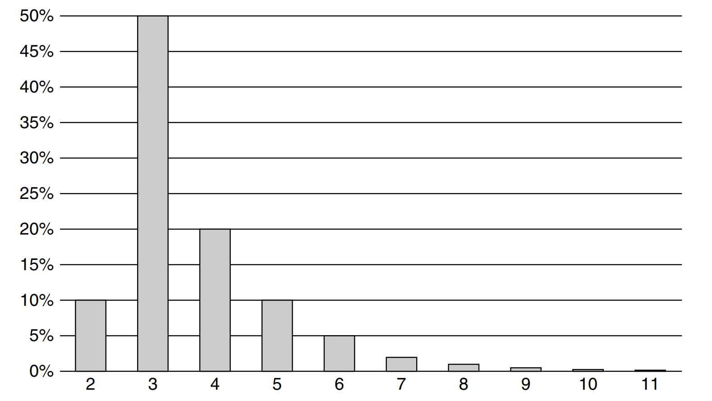
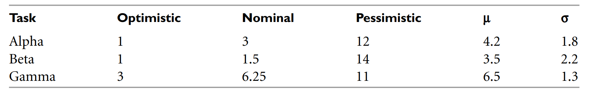

# Chương 10 Ước lượng (Estimation)

Estimation (ước lượng) là một trong những việc đơn giản nhất và cũng đáng sợ nhất mà một lập trình viên chuyên nghiệp cần phải đối mặt. Rất nhiều việc quan trọng khác phải phụ thuộc vào nó. Rất nhiều danh tiếng sẽ đi theo nó. Và rất nhiều nỗi lo lắng và thất bại là do nó. Đó là điểm kết nối giữa khách hàng/PM và lập trình viên. Đó cũng là nguồn gốc của gần như toàn bộ sự ngờ vực trong mối quan hệ trên.

Năm 1978, khi tôi còn là một team lead cho một chương trình Z-80 nhúng 32K viết bằng Assembly. Chương trình sử dụng 32 con chip 1K x 8 EEprom, chia đều cho 3 bảng, mỗi bảng chứa được 12 con chip.

Chúng tôi có hàng trăm thiết bị đang sử dụng, được cài đặt ở văn phòng của các trung tâm điện thoại trên khắp đất nước. Mỗi khi chúng tôi sửa một lỗi hoặc thêm một chức năng mới, chúng tôi sẽ phải gửi giải pháp đến từng đơn vị một và yêu cầu họ thay thế toàn bộ 32 con chip đó!

Đó thực sự là ác mộng. Những con chip và bảng rất mỏng manh. Chốt trên những con chip dễ bị cong và gẫy. Bảng liên tục bị uốn cong dẫn đến hỏng các mối hàn. Nguy cơ bị hỏng và lỗi rất lớn. Do đó đội chi phí cho công ty lên quá cao.

Sếp của tôi lúc đó, Ken Finder, tìm đến tôi và yêu cầu tôi cải thiện việc này. Ông muốn có giải pháp để có thể thay đổi ở 1 con chip mà không cần thay toàn bộ số chip còn lại. Nếu bạn đã đọc sách của tôi, hoặc nghe phát biểu của tôi, bạn sẽ biết rằng tôi đề cập rất nhiều đến việc triển khai độc lập. Và đây là lúc tôi học được bài học đầu tiên.

Vấn đề của chúng tôi là phần mềm là một tệp thực thi với một liên kết duy nhất. Nếu một dòng code mới được thêm vào chương trình, tất cả địa chỉ của dòng code sau sẽ bị thay đổi. Và vì mỗi chip chỉ chứa được 1K không gian địa chỉ, nên hầu như nội chung của tất cả các chip sẽ thay đổi.

Giải pháp thì khá đơn giản. Mỗi chip cần phải được tách ra khỏi tất cả các con chip khác. Mỗi chip cần trở thành một đơn vị biên dịch độc lập có thể chạy độc lập với tất cả những con chip còn lại.

Tôi đã tính toán kích thước của tất cả các chức năng trong ứng dụng và viết một chương trình đoan giản để phù hợp với chúng, như một trò ghép hình, trong từng con chip một, để trống khoảng 100 bytes để có thể mở rộng. Ở đầu mỗi con chip, tôi đặt một bảng con trỏ sẽ trỏ đến tất cả chức năng trong con ship đó. Khi chương trình khởi động, con trỏ sẽ được chuyển vào RAM. Tất cả code trong hệ thống sẽ được thay đổi để các chức năng không còn gọi trực tiếp nữa mà được gọi qua các con trỏ trong RAM.

Vâng, bạn hiểu đúng rồi đấy. Tất cả các con chip là những đối tượng (object), với những vtables (chỉ việc gọi hàm theo liên kết động). Tất cả chức năng được triển khai đa hình. Và, vâng, đây là cách tôi học được một số nguyên tắc của OOD (lập trình hướng đối tượng), rất lâu trước khi tôi biết được đối tượng là gì.

Lợi ích đạt được là vô cùng lớn. Không chỉ việc chúng tôi có thể triển khai các con chip độc lập, mà chúng tôi còn có thể tạo các bản vá cập nhật bằng cách chuyển các chức năng vào RAM và định tuyến lại các con trỏ. Cách này giúp việc gỡ lỗi và cập nhật bản vá dễ dàng hơn rất nhiều.

Chà, tôi lạc đề mất rồi. Khi Ken đến gặp tôi và yêu cầu tôi khắc phục sự cố này, anh ấy có gợi ý vài điều về việc sử dụng các con trỏ cho các hàm. Tôi dành một hoặc 2 ngày cụ thể hóa ý tưởng và trình bày với Ken một kế hoạch chi tiết. Ken hỏi tôi việc này mất bao lâu, và tôi trả lời rằng sẽ mất khoảng một tháng.

Nó mất đến 3 (cmn) tháng.

Tôi mới chỉ say 2 lần trong đời, và chỉ một lần thực sự say. Đó là vào tiệc giáng sinh năm 1978 tại Teradyne. Năm tôi 26 tuổi.

Bữa tiệc được tổ chức ở văn phòng của Teradyne, chủ yếu là không gian của phòng lab. Tất cả mọi người đều đến sớm, nhưng có một trận bão tuyết lớn nên ban nhạc và thức ăn không thể đến được. Thật may là có rất nhiều rượu.

Bữa tiệc được tổ chức ở văn phòng của Teradyne, chủ yếu là không gian của phòng lab. Tất cả mọi người đều đến sớm, nhưng có một trận bão tuyết lớn nên ban nhạc và thức ăn không thể đến được. Thật may là có rất nhiều rượu.

Tôi không nhớ được gì nhiều vào tối hôm đó. Với những gì nhớ được, tôi ước là mình không làm. Nhưng tôi sẽ chia sẻ một khoảnh khắc thấm thía đó cho bạn.

Tôi đang ngồi bắt chéo chân trên sàn với Ken (sếp của tôi, lúc đó tất cả đều 29 tuổi và không say) khóc lóc về việc lập trình lại các con chip mất bao nhiêu thời gian. Rượu giải phóng nỗi sợ hãi và bất an dồn nén về estimate của tôi. Tôi không nghĩ rằng tôi gối đầu vào lòng Ken, nhưng tôi không nhớ rõ chi tiết đó lắm.

Tôi nhớ tôi đã hỏi Ken rằng anh có phát điên với tôi không, và anh có nghĩ rằng tôi làm mất quá nhiều thời gian không. Mặc dù tối hôm đó rất mơ hồ, nhưng câu trả lời của Ken vẫn rõ ràng cho đến bây giờ. Ken nói, “Có, tôi nghĩ việc đó làm mất của anh rất nhiều thời gian, nhưng tôi thấy anh làm việc chăm chỉ, và có tiến độ tốt. Đó là thứ tôi thực sự cần. Vì vậy, không, tôi không giận anh”

## Ước lượng (Estimation) là gì?

Vấn đề là chúng ta nhìn nhận estimation theo những cách khác nhau. Khách hàng coi estimation là một cam kết. Trong khi dev coi estimation như một sự phỏng đoán. Sự khác biệt là rất lớn.

### Một cam kết 

Một cam kết là một thứ bạn phải hoàn thành. Nếu bạn cam kết hoàn thành một việc gì đó vào một ngày nhất định, đơn giản nghĩa là bạn cần phải hoàn thành việc đó vào đúng ngày hôm đó. Nếu điều đó đồng nghĩa với việc bạn phải làm 12 tiếng một ngày, kể cả cuối tuần, bỏ qua kỳ nghỉ với gia đình, thì hãy chấp nhận. Bạn đã lập ra cam kết, bạn phải tôn trọng nó.

Người chuyên nghiệp không cam kết trừ khi họ biết họ có thể hoàn thành chúng. Một sự thật rất đơn giản. Nếu bạn bị yêu cầu phải cam kết thứ gì đó bạn không chắc mình làm được, thì danh dự của bạn chắc chắn sẽ giảm sút. Nếu bạn bị yêu cầu phải cam kết vào một ngày nhất định mà bạn biết mình có thể làm được, nhưng cần phải làm việc nhiều giờ, cuối tuần và bỏ qua kỳ nghỉ với gia đình, thì quyền lựa chọn thuộc về bạn; nhưng tốt hơn bạn nên sẵn sàng làm những gì cần thiết.

Can kết cần một sự chắc chắn. Mọi người sẽ chấp nhận những cam kết của bạn và lập kế hoạch dựa trên nó. Cái giá của việc bỏ lỡ những cam kết đó, với họ, và với uy tín của bạn, là vô cùng lớn. Bỏ lỡ cam kết là một hành vi không trung thực chỉ nhẹ hơn một chút so với nói dối công khai.

### Một ước lượng
Ước lượng là một phỏng đoán. Không có sự cam kết nào trong đó. Không lời hứa nào được đưa ra. Bỏ lỡ ước lượng không phải là một việc đáng chê trách. Lý do chúng ta đưa ra ước lượng là bởi vì chúng ta không thể biết được một việc có thể làm trong bao lâu.

Không may là, phần lớn lập trình viên phần mềm đều rất tệ trong việc ước lượng. Không phải bởi vì việc ước lượng cần có kỹ năng bí mật nào đó – thực ra là không. Lý do mà chúng ta thường rất kém trong việc ước lượng là vì chúng ta không thực sự hiểu được ý nghĩa thật sự của nó.

Ước lượng không phải là một con số. Ước lượng là sự phân phối (distribution). Ví dụ:

Mike: Anh estimate mất bao lâu để hoàn thành task Frazzle?
Peter: 3 ngày

Liệu Peter có hoàng thành công việc trong 3 ngày? Có thể, nhưng có bao nhiêu khả năng? Câu trả lời là: Chúng tôi không biết. Ý của Peter là gì, và Mike sẽ biết được thêm điều gì? Nếu Mike quay lại sau 3 ngày, liệu anh ta có ngạc nhiên nếu Peter chưa xong? Tại sao lại vậy? Peter không hoàn thành cam kết. Peter không nói với Mike là có khả năng là 3 ngày, hay 4 ngày hoặc 5 ngày.

Điều gì sẽ xảy ra nếu Mike hỏi Peter về sự khả thi của ước lượng 3 ngày?

Mike: Khả năng anh hoàn thành trong 3 ngày là bao nhiêu?
Peter: Rất có thể
Mike: Cụ thể là chắc chắn đến mức nào?
Peter: 50 ~ 60%
Mike: Vậy là có khả năng cao anh sẽ hoàn thành trong 4 ngày
Peter: Đúng thế, thực ra nó có thể mất đến 5 hoặc 6, mặc dù tôi không chắc lắm
Mike: Không chắc bao nhiêu?
Peter: Oh, tôi cũng không biết nữa… khoảng 95% tôi sẽ hoàn thành công việc trước 6 ngày.
Mike: Tức là công việc có thể mất 7 ngày?
Peter: Chà, chỉ khi mọi thứ đều hỏng bét. Khỉ thật, nếu mọi thứ hỏng bét, nó có thể mất đến 10 hoặc 11 ngày. Nhưng có vẻ mọi thứ sẽ ổn.

Bây giờ, chúng ta đã có thêm hiểu biết về sự thật. Ước lượng của Peter là sự phân phối xác suất. Trong ý nghĩ của Peter, anh ta thấy khả năng hoàn thành giống như những gì mô tả trong hình 10-1 dưới đây

Hình 10-1 Phân phối xác suất

Bạn có thể thấy lý do Peter đưa ra ước lượng ban đầu là 3 ngày. Đó là thanh cao nhất trong biểu đồ. Nên trong ý nghĩ của Peter, đó là khoảng thời gian hợp lý nhất để hoàn thành công việc. Nhưng Mike lại có một góc nhìn khác. Anh ta nhìn về phía phải của biểu đồ và lo rằng Peter có thể mất đến 11 ngày để hoàn thành công việc.

Mike có nên lo lắng về điều đó? Tất nhiên rồi! Murphy sẽ có cách của anh ta với Peter, vậy nên một vài thứ có thể sẽ hỏng bét.

### Sự ngụ ý ước lượng
Bây giờ thì Mike có một vấn đề. Anh ta không biết chắc chắn thời gian mà Peter cần để hoàn thành công việc. Để tối thiểu hóa rủi ro Mike cần Peter đưa ra một cam kết. Đó là điều Peter sẽ không muốn đưa ra.

Mike: Peter, anh có thể đưa ra số ngày cụ thể anh cần để làm xong không?
Peter: Không, Mike. Tôi nói rồi, nó có thể được hoàn thành trong 3 hoặc 4 ngày.
Mike: Vậy chốt là 4 ngày?
Peter: Không, có thể là 5 hoặc 6
Cho đến giờ, mọi người đều cư xử đúng mực. Mike cầm một cam kết và Peter cẩn thận từ chối. Nên Mike thử một cách khác:
Mike: OK, Peter, nhưng anh có thể cố gắng không vượt quá 6 ngày không?

Lời cầu khẩn của Mike nghe có vẻ vô tội, và Mike chắc chắn không có ý định xấu. Nhưng chính xác thì Mike đang yêu cầu Peter làm gì? “Cố gắng” sẽ được hiểu thế nào?

Như chúng ta đã nỏi trước đây, trong chương 2. Từ cố gắng (try) là một thuật ngữ nặng nề. Peter đồng ý để “cố gắng” và cam kết hoàn thành trong 6 ngày. Đó là cách hiểu duy nhất. Đồng ý “cố gắng” là đồng ý thành công.

Còn cách giải thích nào khác nữa không? Chính xác thì Peter sẽ làm gì để “cố gắng”? Anh ta sẽ làm việc nhiều hơn 8 tiếng? Rõ ràng nó ám chỉ điều đó. Anh ta sẽ làm việc vào cuối tuần? Có, nó cũng ám chỉ điều đó. Anh ta sẽ bỏ qua kỳ nghỉ với gia đình? Có luôn, cũng là một phần của sự ám chỉ. Tất cả đều chỉ sự “cố gắng”. Nếu Peter không làm những việc trên, Mike có thể đổ lỗi cho Peter vì không cố gắng hết sức.

Người chuyên nghiệp có một sự phân biệt rõ ràng giữa ước lượng và cam kết. Họ sẽ không cam kết trừ khi họ biết rõ rằng họ có thể hoàn thành. Họ cẩn thận để tránh những cam kết ám chỉ. Họ truyền đạt phân phối xác suất các ước tính rõ ràng nhất có thể, để các quản lý có thể lập một kế hoạch thích hợp.

## PERT

Vào năm 1957, PERT (Program Evaluation and Review Technique, tạm dịch: Kỹ thuật đánh giá và xem xét chương trình) được tạo ra nhằm hỗ trợ dự án tàu ngầm Polaris của hải quân Mỹ. Một trong những tác dụng của PERT là phương pháp tính toán sự ước lượng. Công thức rất đơn giản, nhưng là cách rất hiệu quả để chuyển từ ước lượng thành phân phối xác suất phù hợp cho quản lý.

Khi bạn ước lượng một công việc, bạn cần cung cấp 3 biến số. Còn được gọi là phân tích tam điểm:

O: Ước lượng lạc quan (Optimistic Estimate). Đây là con số cực kỳ lạc quan. Bạn chỉ có thể hoàn thành công việc trong thời gian này nếu tất cả mọi thứ tuyệt đối chính xác. Và để công thức chính xác thì xác suất đạt được con số này phải nhỏ hơn 1% cơ hội. Trong trường hợp của Peter, nó sẽ là 1 ngày, như trong hình 10-1.
N: Ước lượng danh nghĩa (Nominal Estimate). Đây là con số ước lượng có khả năng thành công cao nhất. Nếu bạn sử dụng một biểu đồ cột, nó sẽ là cột cao nhất, như trong hình 10-1 là 3 ngày.
P: Ước lượng bi quan (Pessimistic Estimate). Đây lại là con số cực kỳ bi quan. Nó sẽ bao gồm mọi thứ trừ siêu bão, chiến tranh hạt nhân, lỗ đen, và những thảm họa khủng khiếp khác. Tương tự, công thức sẽ chính xác khi xác suất đạt được phải nhỏ hơn 1%. Trong trường hợp của Peter, con số này nằm về phía phải của biểu đồ, là 12 ngày.
Với 3 tham số ước lượng này, chúng ta có thể mô tả phân phối xác suất như sau:

μ = (O + 4N + P) / 6

μ là khoảng thời gian kỳ vọng của công việc. Với trường hợp của Peter, μ = (1+12+12)/6 = 4,2 ngày. Đối với hầu hết nhiệm vụ, đây là một con số hơi bi quan vì phần bên phải của đồ thị phân phối dài hơn phần bên trái.

σ = (P - O) / 6

σ là độ lệch chuẩn của phân phối xác suất cho công việc. Nó là thước đo độ không chắc chắn của công việc. Khi con số này lớn, sự không chắc chắn cũng lớn theo. Trong trường hợp của Peter, nó có giá trị (12 -1 )/ 6 = 1,8 ngày.

Với ước lượng của Peter là 4.2/1.8, Mike hiểu rằng tác vụ này sẽ làm xong trong vòng 5 ngày nhưng có thể mất đến 6 hoặc thậm chí là 9 ngày để hoàn thành.

Nhưng Mike không chỉ quản lý 1 tác vụ. Anh ta quản lý một dự án với rất nhiều tác vụ. Peter có 3 trong số những tác vụ đó và anh ta phải thực hiện theo trình tự. Peter đã ước lượng các tác vụ của mình theo như bảng dưới đây

Bảng 10-2 Các tác vụ của Peter