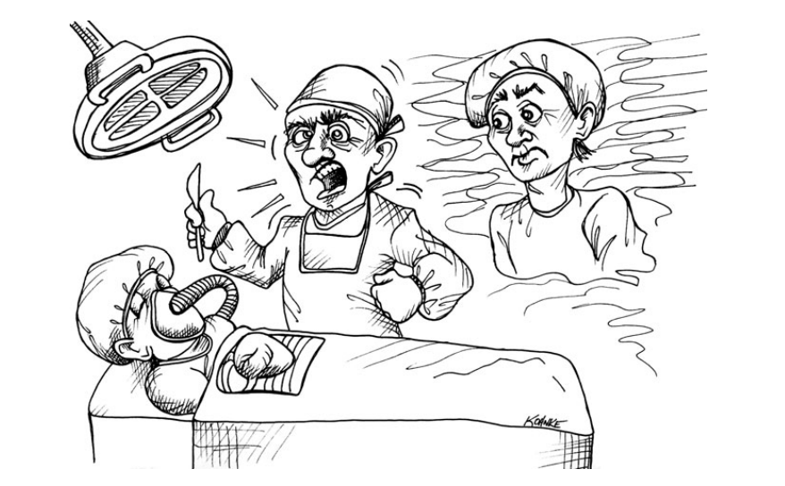

# Chương 11 Áp lực

Thử tưởng tượng bạn đang có trải nghiệm được thoát xác, quan sát bản thân mình đang nằm trên bàn mổ khi bác sỹ phẫu thuật thực hiện ca mổ tim cho bạn. Vị bác sỹ đang cố giành lại cuộc sống cho bạn, nhưng thời gian thì có hạn và bác sỹ đang làm việc với một hạn chót - một hạn chót _sống còn_.

Bạn muốn vị bác sỹ đó hành xử như thế nào? Bạn muốn anh ta tỏ ra bình tĩnh và tự chủ? Bạn muốn anh ta đưa ra những mệnh lệnh rõ ràng và chính xác cho các bác sỹ hỗ trợ? Bạn muốn anh ta tuân theo sự đào tạo và tuân thủ kỷ luật?

Hay là bạn muốn anh ta đổ mồ hôi và la hét? Bạn muốn anh ta đập và ném dụng cụ? Bạn muốn anh ta đổ lỗi cho quản lý về những kỳ vọng không thực tế và liên tục phàn nàn về thời gian? Bạn muốn anh ta cư xử như một chuyên gia hay như một lập trình viên điển hình?

Những lập trình viên chuyên nghiệp bình tĩnh và quyết đoán trước áp lực. Khi áp lực càng lớn, anh ta càng tuân thủ sự huấn luyện và kỷ luật của bản thân, biết rõ rằng chúng là cách tốt nhất để đáp ứng hạn chót và cam kết đang đè nặng lên anh ta.

Năm 1988, khi tôi đang làm việc tại Clear Communications. Đó là một công ty khởi nghiệp (start-up) nhưng chưa bao giờ có thể "bắt đầu". Họ đốt hết tiền của vòng gọi vốn đầu tiền và sau đó phải tiếp tục gọi vốn vòng 2, và vòng 3.

Tầm nhìn ban đầu của sản phẩm có vẻ tốt, nhưng dường như kiến trúc sản phẩm lại không hề có cơ sở. Ban đầu, sản phẩm bao gồm cả phần cứng và phần mềm. Rồi sau đó, chỉ còn lại phần mềm. Nền tảng phần mềm thay đổi từ PCs sang Sparcstations. Khách hàng thay đổi từ cao cấp đến bình dân. Cuối cùng, ngay đến cả mục đích ban đầu của sản phẩm cũng trôi mất khi công ty cố gắng tìm kiếm thứ gì đó có thể tạo ra doanh thu. Trong gần 4 năm ở đó, tôi không nghĩ rằng công có được một xu thu nhập.

Không khó để nói, chúng tôi, những người phát triển phần mềm phải chịu một áp lực đáng kể. Có những đêm rất dài, và những ngày cuối tuần còn dài hơn ở văn phòng, trước màn hình. Những hàm viết bằng C _dài đến 3000 dòng_. Có những cuộc tranh cãi chỉ toàn là la hét và gọi tên. Có cả âm mưu và khuất phục. Có những cú đấm vào tường, bút ném vào bảng trắng một cách giận dữ, những bức tranh biếm họa về những đồng nghiệp khó chịu được vẽ lên tường bằng bút chì, và có một nguồn cung cấp sự tức giận và căng thẳng không bao giờ dứt.

Hạn chót được xác định bởi các sự kiện. Các chức năng phải sẵn sàng cho triển lãm thương mại hoặc bản thử nghiệm cho khách hàng. Bất kỳ điều gì khách hàng yêu cầu, kể cả ngớ ngẩn đến thế nào, chúng tôi đề phải sẵn sàng cho bản thử nghiệm tiếp theo. Thời gian luôn quá ngắn. Công việc luôn ở phía sau. Lịch trình luôn quá tải.

Nếu bạn làm việc 80 giờ một tuần, bạn có thể là người hùng. Nếu bạn cùng nhau hack một mớ hỗn độn cho một bản thử nghiệm đến khách hàng, bạn có thể là người hùng. Nếu bạn làm đủ, bạn có thể được đề bạt. Nhưng nếu không, bạn có thể bị sa thải. Đó là một công ty khởi nghiệp - tất cả được xoanh quanh "cổ phần dựa theo công sức". Và vào năm 1988, với gần 20 năm kinh nghiệm giắt lưng, tôi đã mua nó.

Tôi là quản lý nhóm phát triển, người đã yêu cầu những lập trình viên dưới quyền phải làm việc nhiều hơn và nhanh hơn. Tôi là người làm 80 tiếng, viết những hàm C với 3000 dòng vào 2h sáng khi con tôi ngủ ở nhà mà không có cha chúng ở đó. Tôi là người đã ném bút và la hét. Tôi sa thải những ai không tuân lệnh. Điều đó thật tồi tệ. Tôi thật tồi tệ.

Cho đến một ngày vợ tôi ép tôi phải tự nhìn lại thật kỹ bản thân mình trong gương. Tôi thực sự không thích điều mình nhìn thấy. Cô ấy nói với tôi rằng ở bên cạnh tôi không vui chút nào. Tôi phải đồng ý về điều đó. Nhưng tôi không thích nó, vì vậy tôi tức giận lao ra khỏi nhà và bắt đầu bước đi trong vô định. Tôi đi bộ khoảng 30 phút, sải bước giận dữ, và sau đó trời bắt đầu đổ mưa.

Và có thứ gì đó nảy ra trong đầu tôi. Tôi bắt đầu cười. Tôi cười vì sự điên rồ của mình. Tôi cười vì sự căng thẳng của mình. Tôi cười nhạo người tôi nhìn thấy trong gương, một kẻ khốn nạn đáng thương đang khiến cuộc sống của chính mình và những người khác trở nên khốn khổ mà không vì cái gì hết.

Mọi thứ đã thay đổi vào ngày hôm đó. Tôi ngừng những giờ làm thêm điên rồ. Tôi ngừng lối sống đầy căng thẳng. Tôi ngừng ném bút và viết những hàm C 3000 dòng. Tôi xác định rằng tôi sẽ tận hưởng sự nghiệp của mình bằng cách làm tốt nó, chứ không phải làm một cách ngu ngốc.

Tôi bỏ công việc đó một cách chuyên nghiệp nhất có thể, và tôi trở thành một nhà tư vấn. Kể từ ngày đó, tôi chưa bao giờ gọi người khác là "sếp".

## Tránh xa áp lực

Cách tốt nhất để giữ bình tĩnh dưới áp lực là phòng tránh những tình huống _gây nên_ áp lực. Việc phòng tránh có thể không loại bỏ áp lực hoàn toàn, nhưng về lâu dài, nó sẽ giúp giảm thiểu và rút ngắn thời gian căng thẳng cao độ.

### Cam kết

Như chúng ta đã khám phá ở Chương 10, việc tránh cam kết những hạn chót mà chúng ta không chắc chắn đáp ứng được là rất quan trọng. Khách hàng sẽ luôn muốn những cam kết vì họ muốn loại bỏ rủi ro. Việc chúng ta phải làm là chắc chắn rằng rủi ro phải được định lượng và trình bày cho khách hàng, để họ có thể quản lý nó một cách thích hợp. Việc chấp nhận những cam kết không thực tế sẽ cản trở mục tiêu này và gây bất lợi cho cả doanh nghiệp và chính chúng ta.

Đôi khi những cam kết được đặt ra cho chúng ta. Đôi khi chúng nhận ra bộ phận kinh doanh của công ty đã hứa với khách hàng mà không tham khảo ý kiến của chúng ta. Khi việc này xảy ra chúng ta có vinh dự được giúp bộ phận kinh doanh tìm cách đám ứng những cam kết đó. Tuy nhiên, chúng ta _không_ có trách nhiệm phải _chấp nhận_ các cam kết đó.

Phân biệt rõ việc này rất quan trọng. Những người chuyên nghiệp luôn giúp đỡ bộ phận kinh doanh tìm cách đạt được mục tiêu cuối cùng. Nhưng những người chuyên nghiệp không nhất thiết phải chấp nhận những cam kết đặt ra bởi bộ phận kinh doanh. Bởi vì cuối cùng, nếu chúng ta không tìm được cách nào đáp ứng được lời hứa của bộ phận kinh doanh, thì người đặt ra lời hứa đó phải nhận trách nhiệm.

Nói thì rất dễ. Nhưng khi bộ phận kinh doanh của công ty thất bại, và tiền lương của bạn bị chậm do không đáp ứng cam kết, rất khó để không cảm thấy áp lực. Nhưng nếu bạn hành xử một cách chuyên nghiệp, ít nhất bạn có thể ngẩng cao đầu để tìm một công việc mới.

### Giữ sạch sẽ

Cách để đi nhanh, và giữ đúng hạn chót, là giữ sạch sẽ. Những người chuyên nghiệp không khuất phục trước sự cám dỗ của việc tạo ra mớ hỗn độn để hoàn thành công việc nhanh chóng. Những người chuyên nghiệp nhận ra rằng "nhanh và cẩu thả (quick and dirty)" là một nghịch lý. Cẩu thả luôn đi cùng với chậm!

Chúng ta có thể tránh được áp lực bằng cách giữ cho hệ thống, code và thiết kế sạch nhất có thể. Điều đó không có nghĩa là chúng ta dành hàng giờ để chăm chút cho code. Nó đơn giản là chúng ta không thỏa hiệp với sự lộn xộn. Chúng ta nhận ra rằng lộn xộn sẽ làm ta chậm lại, khiến chúng ta lỡ hạn chót và phá vỡ cam kết. Vì vậy chúng ta cần làm hết sức mình để giữ cho sản phẩm đầu ra sạch nhất có thể.

### Kỷ luật trong khủng hoảng

Bạn biết mình tin vào điều gì khi quan sát bản thân trong một cơn khủng hoảng. Nếu trong cơn khủng hoảng bạn tuân thủ những kỷ luật của mình, thì bạn thực sự tin tưởng vào những kỷ luật đó. Mặt khác, nếu bạn thay đổi hành vi của mình khi trong cơn khủng hoảng, thì bạn không thực sự tin vào những hành vi thông thường của mình.

Nếu bình thường bạn tuân theo kỷ luật của TDD nhưng từ bỏ chúng trong cơn khủng hoảng, thì bạn không thực sự tin tưởng rằng TDD là hữu ích. Nếu bình thường bạn giữ cho code sạch sẽ nhưng lại tạo ra sự lộn xộn trong cơn khủng hoảng, thì bạn không thực sự tin rằng lộn xộn sẽ làm bạn chậm lại. Nếu bạn bắt cặp trong cơn khủng hoảng nhưng bình thường thì không, thì bạn tin rằng bắt cặp sẽ hiệu quả hơn so với không bắt cặp.

Chọn những kỷ luật bạn thấy thoải mái khi tuân theo trong cơn khủng hoảng. _Và luôn luôn tuân chủ chúng mọi lúc_. Tuân thủ những kỷ luật đó là cách tốt nhất để tránh rơi vào một cuộc khủng hoảng.

Đừng thay đổi hành vi của bạn khi cơn nguy kịch đến. Nếu kỷ luật của bạn là cách tốt nhất để làm việc, thì bạn nên tuân thủ chúng ngay cả khi chìm trong khủng hoảng.

## Xử lý áp lực

Ngăn chặn, giảm nhẹ và loại bỏ áp lực là việc tốt, nhưng đôi khi áp lực sẽ đến bất chấp mọi ý định và biện pháp phòng ngừa tốt nhất của bạn. Đôi khi dự án mất nhiều thời gian hơn so với dự đoán của bất kỳ ai. Thỉnh thoảng thiết kế ban đầu sai hướng và phải làm lại. Đôi khi bạn đánh mất một thành viên cốt cán hoặc một khách hàng quan trọng. Đôi khi bạn đưa ra một cam kết mà bạn không thể đáp ứng. Sau đó thì sao?

### Đừng hoảng sợ

Kiểm soát sự căng thẳng của bạn. Những đêm mất ngủ sẽ không giúp bạn hoàn thành công việc nhanh hơn. Ngồi một chỗ và băn khoăn cũng không giúp gì cả. Và điều tệ nhất bạn có thể làm là vội vàng! Hãy chống lại cám dỗ đó bằng mọi giá. Nóng vội sẽ chỉ đẩy bạn vào hố sâu hơn.

Thay vào đó, hãy chậm lại. Suy nghĩ về vấn đề gặp phải một cách thấu đáo. Lập kế hoạch cho một lộ trình để đạt được kết quả tốt nhất có thể, và sau đó hướng tới kết quả đó với tốc độ hợp lý và ổn định.

### Giao tiếp

Hãy để đội của bạn và cấp trên của bạn biết bạn đang gặp rắc rối. Nói cho họ biết kế hoạch tốt nhất của bạn để thoát khỏi rắc rối này. Yêu cầu họ đóng góp ý kiến và hướng dẫn. Tránh tạo ra sự bất ngờ. Không gì khiến con người ta tức giận và kém lý trí hơn những điều bất ngờ. Ngạc nhiên/bất ngờ làm áp lực nhân lên gấp 10 lần.

### Tin tưởng kỷ luật của bạn

Khi mọi thứ trở nên khó khăn, _tin vào kỷ luật của bạn_. Lý do bạn _có_ những kỷ luật đó là chúng hướng dẫn bạn vượt qua khoảng thời gian áp lực lớn. Đó là thời gian đặc biệt chú ý đến tất cả những kỷ luật của bạn. Đó _không_ phải là lúc để nghi ngờ và từ bỏ chúng.

Thay vì nhìn xung quanh trong hoảng sợ điều gì đó, bất kỳ điều gì, kỷ luật sẽ giúp bạn hoàn thành công việc nhanh hơn, hãy trở nên có chủ ý và chuyên tâm hơn để tuân thủ đúng kỷ luật mà bạn đã chọn. Nếu bạn tuân thủ TDD, thì hãy viết nhiều test hơn bình thường. Nếu bạn có thể tái cấu trúc (refactor) không thương tiếc, thì hãy tái cấu trúc nhiều hơn. Nếu bạn giữ cho các hàm của mình nhỏ, thì hãy làm cho chúng nhỏ hơn nữa. Cách duy nhất để vượt qua áp lực là dựa vào những gì bạn biết chắc rằng chúng hoạt động - kỷ luật của bạn.

### Tìm kiếm sự giúp đỡ

Ghép cặp! Khi mọi thứ bùng phát, hãy tìm một cộng sự sẵn sàng ghép cặp với bạn. Bạn sẽ hoàn thành công việc nhanh hơn, ít sai sót hơn. Đối tác theo cặp của bạn sẽ giúp bạn giữ vững kỷ luật của mình và giúp bạn không bị hoảng sợ. Đối tác của bạn sẽ phát hiện ra những điều bạn thiếu sót, sẽ có những ý tưởng hữu ích và nhận ra sự chểnh mảng, thiếu tập trung của bạn.

Tương tự, khi bạn thấy ai đó đang chịu áp lực, hãy đề nghị ghép cặp vưới họ. Giúp họ ra khỏi rắc rối của họ.

## Kết luận

Mẹo để xử lý áp lực là tránh nó khi bạn có thể và vượt qua nó khi bạn không thể. Bạn tránh điều đó bằng cách quản lý các cam kết, tuân thủ kỷ luận và giữ mọi thứ sạch sẽ. Bạn vượt qua nó bằng cách giữ bình tĩnh, giao tiếp, tuân thủ kỷ luật và tìm kiếm sự giúp đỡ.
