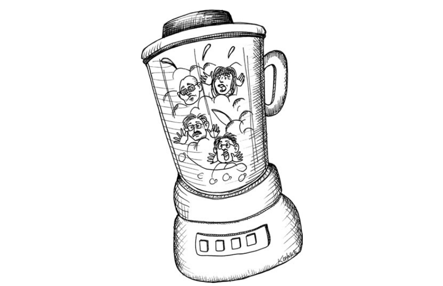

# Chương 13 Đội nhóm và dự án

Sẽ ra sao nếu bạn có nhiều dự án nhỏ cần hoàn thiện? Bạn sẽ phân bổ những dự án đó cho lập trình viên như thế nào? Sẽ ra sao nếu bạn có một dự án thực sự lớn cần hoàn thiện?

## Có nên dùng chung nhân sự giữa các dự án nhỏ?

Trong vài năm gần đây, tôi có cố vấn cho một số ngân hàng và tổ chức bảo hiểm. Tôi nhận ra giữa họ có một điểm chung kỳ lạ, đó là cách họ phân chia những dự án.

Thông thường, một dự án ở ngân hàng có khối lượng công việc tương đối nhỏ, chỉ cần từ 1 đến 2 lập trình viên trong khoảng vài tuần. Các dự án này thường sẽ được quản lý bởi 1 PM, người cũng đang quản lý những dự án khác. Dự án có một BA, người cũng đang cung cấp yêu cầu cho những dự án khác. Nó được giao cho một vài lập trình viên cũng đang làm việc ở một vài dự án khác. Một hoặc 2 tester được chỉ định vào dự án, và họ cũng đang làm việc ở những dự án khác.

Bạn đã nhận ra khuôn mẫu ở đây chưa? Dự án quả nhỏ nên không cá nhân nào có thể được chỉ định toàn thời gian. Mọi người đang làm việc trong dự án ở mức 50, hoặc thậm chí 25 phần trăm.

Bây giờ, quy tắc là: Không có cái gì gọi là nửa người.

Thật vô nghĩa khi nói một lập trình viên dành một nửa thời gian của họ cho dự án A và thời gian còn lại cho dự án B, đặc biệt là khi 2 dự án có 2 PM khác nhau, 2 BA khác nhau, lập trình viên khác nhau và tester khác nhau. Làm thế nào bạn có thể gọi đó là một nhóm? Đó không phải là một nhóm, đó là một cái máy xay sinh tố.

### Một nhóm gắn kết

Cần thời gian để thành lập một nhóm. Những thành viên bắt đầu hình thành các mối quan hệ. Họ học cách cộng tác với nhau. Họ hiểu được những điều kỳ quặc, điểm mạnh và điểm yếu của nhau. Cuối cùng họ sẽ bắt đầu _gắn kết_.

Có một điều thực sự nhiệm màu ở một nhóm gắn kết. Họ có thể làm ra những điều kỳ diệu. Họ dự đoán, che chở, hỗ trợ cho nhau và thể hiện những gì tốt nhất ở mỗi người. Họ khiến mọi thứ xảy ra.

Một nhóm gắn kết thường gồm khoảng một chục người. Có thể nhiều đến 20 hoặc ít hơn là 3, nhưng con số tốt nhất có lẽ là khoảng 12. Nhóm nên bao gồm lập trình viên, tester, và BA. Và nó cần có một PM.

Tỉ lệ giữa lập trình viên so với tester và BA có thể thay đổi rất nhiều, những 2:1 là một con số tốt. Vì vậy, một team gắn kết 12 người sẽ bao gồm 7 lập trình viên, 2 tester, 2 BA và 1 PM.

Các BA phân tích các yêu cầu và viết các kiểm thử chấp nhận tự động. Tester cũng viết các kiểm thử chấp nhận tự động. Những kiểm thử này sẽ khác nhau về mặt quan điểm. Cả 2 đều đọc yêu cầu. Nhưng BA tập trung vào giá trị sản phẩm, còn tester tập trung vào tính đúng đắn. BA sẽ viết những con đường hoàn hảo; tester quan tâm đến những thứ có thể gây nên sai sót và các trường hợp thất bại và giới hạn.

PM sẽ theo dõi tiến độ của nhóm và đảm bảo rằng cả nhóm hiểu được lịch trình và mức độ ưu tiên.

Một trong các thành viên trong nhóm có thể đóng vai trò huấn luyện hoặc quản lý bán thời gian với trách nhiệm bảo vệ quy trình và kỷ luật nhóm. Họ đóng vai trò lương tâm của nhóm khi họ bị cám dỗ di sai quy trình vì áp lực lịch trình.

### Sôi nổi

Cần có thời gian để một nhóm như vậy tìm ra sự khác biệt giữa họ, thống nhất với nhau và thực sự gắn kết. Có thể mất đến 6 tháng, thậm chí 1 năm. Nhưng một khi nó xảy ra, đó là một điều kỳ diệu. Một nhóm gắn kết sẽ cùng nhau lập kế hoạch, cùng nhau giải quyết vấn đề, cùng nhau đối mặt với khó khăn và khiến _mọi thứ hoạt động_.

Một khi nó xảy ra, thật là lố bịch khi phá vỡ nhóm chỉ vì dự án kết thúc. Tốt nhất là giữ nhóm đó lại và tiếp tục giao những dự án khác.

### Điều gì sẽ có trước, Nhóm hay Dự án?

Ngân hàng và các công ty bảo hiểm cố gắng thành lập các nhóm xung quanh dự án. Đó là một cách làm ngốc nghếch. Những nhóm đó không thể gắn kết. Các cá nhân chỉ tham gia dự án trong một thời gian ngắn, và chỉ trong 1% thời gian của họ, và do đó sẽ không bao giờ học được cách làm việc với nhau.

Các tổ chức phát triển chuyên nghiệp phân bổ dự án cho các nhóm đã gắn kết hiện có, họ không thành lập nhóm xung quanh các dự án. Một nhóm gắn kết có thể chấp nhận nhiều dự án đồng thời và sẽ phân chia công việc theo ý kiến, kỹ năng của riêng họ. Nhóm gắn kết sẽ hoàn thành các dự án.

### Nhưng làm thế nào bạn quản lý được việc đó?

Các nhóm đều có vận tốc (velocites) riêng. Vận tốc của một nhóm hiểu đơn giản là khối lượng công việc có thể hoàn thành trong một khoảng thời gian cố định. Một số nhóm đo vận tốc của họ bằng _điểm (point)_ mỗi tuần, với điểm là đơn vị cho mức độ phức tạp. Họ chia nhỏ các chức năng của những dự án họ thực hiện và ước tính chúng theo điểm. Sau đó, họ đo xem họ hoàn thành được bao nhiêu điểm mỗi tuần.

Vận tốc là một thước đo thống kê. Một nhóm có thể hoàn thành 38 điểm một tuần, 42 điểm trong tuần tiếp theo, và 25 điểm trong tuần kế tiếp. Giá trị này sẽ được tính trung bình theo thời gian.

Ban quản lý có thể đặt mục tiêu cho từng dự án được giao cho nhóm. Ví dụ, nếu vận tốc trung bình của nhóm là 50 và họ đang làm việc trên 3 dự án, ban quản lý có thể yêu cầu nhóm chia công sức của họ thành 15, 15 và 20.

Bên cạnh việc có một nhóm gắn kết làm việc với những dự án của bạn, lợi thế của việc lên kế hoạch này là trong trường hợp khẩn cấp, khách hàng có thể nói: "Dự án B đang rơi vào khủng hoảng; dành 100% công sức của bạn cho dự án đó trong 3 tuần tới"

Việc phân bổ lại mức ưu tiên một cách nhanh chóng gần như là không thể với các nhóm xuất phát từ cái máy xay sinh tố, nhưng với nhóm gắn kết đang thực hiện 2 hoặc 3 dự án đồng thời có thể giúp ích rất nhiều.

### Sự khó xử của chủ dự án

Một trong những ý kiến phản đối cách làm mà tôi đang ủng hộ là những chủ dự án sẽ mất đi một số quyền an ninh và ảnh hưởng. Họ có một team dành riêng cho dự án của họ để có thể tin tưởng vào nỗ lực của team đó. Họ biết rằng việc tạo dựng và giải tán một team là một việc tốn kém, khách hàng sẽ không loại bỏ team vì những lý do ngắn hạn.

Mặt khác, nếu dự án được giao cho một team gắn kết, và nếu những team đó đảm nhận một vài dự án cùng một lúc, thì khách hàng sẽ thoải mái thay đổi ưu tiên theo ý thích. Điều này có thể khiến chủ dự án bất an hơn trong tương lai. Nguồn lực mà họ phụ thuộc có thể đột ngột rời bỏ họ.

Thành thật mà nói, tôi thích tình huống sau hơn. Doanh nghiệp không nên tự trói tay mình bởi những khó khăn giả tạo trong việc thành lập và giải tán team. Nếu doanh nghiệp quyết định rằng dự án này có ưu tiên cao hơn dự án khác, nó nên được phân bổ nguồn lực nhanh chóng. Chủ dự án có trách nhiệm ủng hộ dự án của mình.

## Kết luận

Xây dựng team khó hơn xây dựng dự án. Vậy nên, sẽ tốt hơn nếu xây dựng một team cố định có thể chuyển cùng nhau từ dự án này sang dự án khác và có thể cùng lúc đảm nhiệm nhiều hơn 1 dự án. Mục tiêu gây dựng một team là cho team đó đủ thời gian để gắn kết, và sau đó duy trì như một cỗ máy để hoàn thành nhiều dự án.
