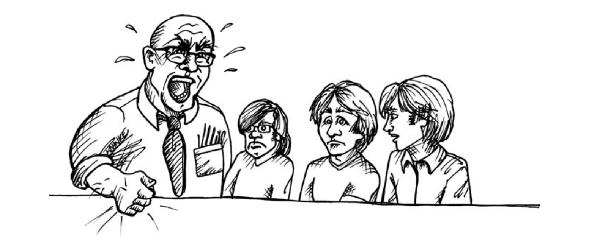

# Chương 2 Phản đối (Saying No)

Làm, hoặc không làm. Không có cố gắng (Do; or do not. There is no trying) - Yoda

Những năm đầu thập kỷ 70, tôi cùng với 2 người bạn lúc đó 19 tuổi, đang làm việc tại một hệ thống kế toán thời gian thực của hiệp hội Teamster ở Chicago, tên công ty là ASC. Nếu điều này gợi nhớ đến cái tên Jimmy Hoffa, thì đúng vậy. Bạn không nên đùa với teamsters vào năm 1971.

Hệ thống của chúng thôi cần phải đưa vào vận hành vào một ngày xác định. _Rất nhiều_ tiền được đổ vào ngày đó. Đội của chúng tôi phải làm việc 60, 70 và 80 giờ một tuần để giữ đúng lịch trình.

Cuối cùng, một tuần trước hạn chót, chúng tôi đã hoàn thiện toàn bộ hệ thống. Có rất nhiều lỗi và vấn đề cần giải quyết, và chúng tôi đã điên cuồng làm việc với danh sách này. Gần như không có thời gian để ăn và ngủ chứ đừng nói đến suy nghĩ.

Frank, giám đốc ở ASC, là đại tá không quân đã về hưu. Ông ta là kiểu quản lý sẽ quát thẳng vào mặt bạn. Mọi thứ phải là đường của ông ta hoặc đường cao tốc, và ông ta sẽ đưa bạn vào đường cao tốc bằng cách trả bạn từ độ cao 10000 feet mà không có dù. Chúng tôi, những đứa nhóc 19 tuổi, hầu như không thể nhìn thẳng vào mắt ông ta.

Frank yêu cầu mọi việc phải hoàn thành đúng hạn. Đó là tất cả những gì cần làm. Khi thời hạn đó đến, chúng tôi sẽ hoàn thành. Không thảo luận. Không bàn cãi. Chấm hết.

Quản lý của tôi, Bill, là một người dễ mến. Anh ta đã làm việc với Frank trong vài năm và hiểu với Frank điều gì là có thể và điều gì không thể. Anh ta nói với chúng tôi mọi thứ cần đưa vào vận hành đúng ngày, bất kể thế nào.

Vì vậy, chúng tôi đưa vào vận hành đúng ngày. Và nó là một thảm họa kinh hoàng.

Có hàng tá máy 300-baud, thiết bị đầu cuối bán song công, kết nối từ trụ sở chính của Teamster ở Chicago đến máy của chúng tôi ở vùng ngoại ô cách đó 30 dặm về phía bắc. Mỗi thiết bị đầu cuối đó đều bị tê liệt sau mỗi 30 phút hoặc lâu hơn. Chúng tôi đã từng gặp sự cố này trước đây nhưng chưa mô phỏng lại lưu lượng truy cập khi hàng loạt nhân viên nhập liệu đột ngột vào hệ thống.

Tệ hơn nữa, những băng giấy được in từ máy ASR35, kết nối với hệ thống của chúng tôi bằng đường dây điện thoại 110-baud, cũng dừng lại khi đang in.

Giải pháp cho những lần tê liệt này là khởi động lại. Vì vậy họ phải yêu cầu những máy đang hoạt động nhanh chóng hoàn thành công việc và dừng lại. Khi tất cả đã dừng lại, họ thông báo cho chúng tôi khởi động lại hệ thống. Những máy bị tê liệt sẽ bắt đầu công việc lại từ đầu. Và việc này tái diễn nhiều hơn 1 lần mỗi giờ.

Sau nửa ngày như vậy, quản lý văn phòng tại Teamster yêu cầu chúng tôi tắt hệ thống đi và không mở lại cho đến khi mọi thứ hoạt động ổn định. Trong khi đó, họ sẽ bỏ đi nửa ngày làm việc và phải sử dụng hệ thống cũ để nhập lại mọi thứ.

Chúng tôi nghe thấy tiếng rên rỉ và gào thét của Frank vang lên khắp tòa nhà. Họ bàn bạc rất, rất lâu. Sau đó Bill và phân tích hệ thống Jalil đến gặp chúng tôi và hỏi khi nào chúng tôi có thể làm cho hệ thống hoạt động ổn định. Tôi trả lời, "4 tuần".

Khuôn mặt họ chuyển từ kinh hãi sang quyết tâm. "Không", họ nói, "nó phải chạy được vào thứ 6";

Nên tôi trả lời: "Nhìn xem, hệ thống mới đưa vào hoạt động vào tuần trước. Chúng ta phải giải quyết những rắc rối và vấn đề gặp phải. Chúng ta cần 4 tuần".

Nhưng Bill và Jalil vẫn cương quyết. "Không, nó phải chạy được vào thứ 6. Ít nhất hãy thử cố một lần xem?"

Sau đó trưởng nhóm chúng tôi nói: "OK, chúng tôi sẽ cố".

Thứ 6 là một lựa chọn tốt, lượng tải vào cuối tuần thấp hơn nhiều. Chúng tôi có thể tìm ra thêm vài vấn đề và chỉnh sửa chúng trước thứ 2. Tuy nhiên, mọi thứ lại sụp đổ một lần nữa. Hệ thống vẫn bị tê liệt 1 hoặc 2 lần một ngày. Có cả những vấn đề khác nữa. Nhưng dần dần, sau một vài tuần, chúng tôi đưa được hệ thống về mức ổn định, và cuộc sống bình thường có vẻ thực sự diễn ra.

Và sau đó, như tôi đã nói với bạn ở phần giới thiệu, tất cả chúng tôi đều nghỉ việc. Và họ đã bị bỏ lại với một cuộc khủng hoảng thực sự. Họ đã phải thuê một loạt lập trình viên mới để cố gắng giải quyết vấn lượng tải khổng lồ từ khách hàng.

Chúng ta có thể đổ lỗi thất bại này cho ai? Rõ ràng, kiểu quản lý của Frank là một phần vấn đề. Những lời đe dọa của đã khiến ông ta khó có thể nghe được sự thật. Đáng nhẽ Bill và Jalil nên kìm chế Frank lại nhiều hơn. Đáng nhẽ trưởng nhóm không nên chấp nhận hạn chót vào thứ 6. Và đáng nhẽ, tôi nên tiếp nói "không" thay vì nghe theo trưởng nhóm.

Người chuyên nghiệp nói lên sự thật với quyền lực. Người chuyên nghiệp đủ can đảm để nói không với quản lý của họ.

Làm thế nào bạn nói "không" với sếp của bạn? Sau tất cả, đó là _sếp_ của bạn! Bạn không phải làm theo những gì họ nói sao?

Không, nếu bạn là một người chuyên nghiệp.

Nô lệ không được phép nói không. Người lao động có thể do dự khi nói không. Nhưng những người chuyên nghiệp phải biết nói không. Sự thật là, những nhà quản lý giỏi luôn khát khao có một người đủ can đảm để từ chối. Đó là cách duy nhất bạn thực sự có thể hoàn thành mọi việc.

## Vai trò đối đầu

Một trong những người đánh giá cuốn sách thực sự ghét chính chương này. Anh ấy nói rằng nó gần như khiến mình phải đặt cuốn sách xuống. Anh ấy đã xây dựng những đội nhóm không có mối quan hệ đối đầu nào; những đội nhóm đó làm việc với nhau rất hòa hợp và không hề có bất đồng.

Tôi lấy làm hạnh phúc cho anh ta, nhưng tôi tự hỏi liệu những đội nhóm đó có thực sự không tồn tại bất đồng như anh ta vẫn nghĩ. Và nếu vậy, tôi tự hỏi liệu họ có hiệu quả như họ nghĩ không. Kinh nghiệm của riêng tôi là các quyết định khó khăn được quyết định tốt nhất thông qua sự đối đầu của các vai trò đối địch.

Quản lý là những người có việc phải làm, và phần lớn họ biết cách làm khá tốt tốt công việc đó. Một phần của công việc là theo đuổi và bảo vệ mục tiêu của họ một cách quyết liệt nhất có thể.

Nhưng mặt khác, lập trình viên cũng là những người có  việc phải làm, và phần lớn họ biết cách hoàn thành khá tốt công việc đó. Nếu họ là người chuyên nghiệp, họ sẽ theo đuổi và bảo vệ mục tiêu _của họ_ một cách quyết liệt nhất có thể.

Khi quản lý nói với bạn rằng trang đăng nhập cần sẵn sàng vào ngày mai, anh ta đang theo đuổi và bảo vệ một trong những mục tiêu của mình. Anh ta đang làm công việc của mình. Nếu bạn biết chắc chắn rằng hoàn thành trang đăng nhập vào ngày mai là không thể, nhưng nếu bạn nói "OK, tôi sẽ cố", tức là bạn đang không làm tốt công việc của mình. Cách duy nhất để thực hiện tốt công việc của bạn, tại thời điểm đó, là nói "Không, điều đó là không thể".

Nhưng bạn không cần phải làm những việc quản lý của bạn yêu cầu sao? Không, quản lý sẽ tin tưởng để bạn bảo vệ mục tiêu của bạn quyết liệt như anh ta bảo vệ mục tiêu của anh ta. Đó là cách đôi bên có thể đưa ra được _kết quả tốt nhất_.

Kết quả tốt nhất là mục tiêu mà bạn và quản lý cùng chia sẻ. Bí quyết để đạt được kết quả đó thường là thông qua thương lượng.

Thương lượng có đôi khi rất dễ chịu.

Mike: "Paula, tôi cần trang đăng nhập hoàn thành vào ngày mai"

Paula: "Oh wow! Sớm thế ah? Chà, OK, tôi sẽ cố"

Mike: "OK, tuyệt quá. Cảm ơn nhé!"

Đó là cuộc trò chuyện ngắn diễn ra tốt đẹp. Tránh được tất cả xung đột. Cả hai đều tươi cười ra về. Rất tốt.

Nhưng cả 2 bên đều đang cư xử thiếu chuyên nghiệp. Paula biết rõ rằng cô cần nhiều hơn một ngày cho trang đăng nhập, tức là cô đang nói dối. Cô ấy có thể không nghĩ đó là nói dối. Có thể cô ấy nghĩ rằng mình _thực sự sẽ cố gắng_, và có thể cô ấy giữ lấy một chút hy vọng nhỏ nhoi rằng cô sẽ thực sự hoàn thành nó. Nhưng cuối cùng thì đó vẫn là một lời nói dối.

Ở phía còn lại, Mike, chấp nhận câu trả lời "Tôi sẽ cố" như một sự khẳng định. Đó thực sự là một việc ngốc nghếch. Anh ấy nên biết rằng Paula chỉ đang lảng tránh sự xung đột, nên anh ấy phải nhấn mạnh vào vấn đề đó bằng việc hỏi lại, "Bạn có vẻ do dự. Bạn có chắc rằng nó sẽ hoàn thành vào ngày mai hay không?"

Sau đây là một cuộc trò chuyện thú vị khác

Mike: "Paula, tôi cần trang đăng nhập hoàn thành vào ngày mai"

Paula: "Oh, xin lỗi Mike, nhưng tôi cần nhiều thời gian hơn để hoàn thành"

Mike: "Bạn nghĩ khi nào có thể hoàn thành được?"

Paula: "2 tuần nữa kể từ giờ thì sao?"

Mike: (viết gì đó vào sổ tay) "OK, cảm ơn nhé."

Cũng rất dễ chịu, nhưng vô cùng rối loạn và hoàn toàn không chuyên nghiệp. Cả hai đều thất bại trong việc tìm kiếm kết quả tốt nhất có thể. Thay vì hỏi liệu 2 tuần có ổn không, Paula nên quyết đoán hơn: "Tôi sẽ mất 2 tuần, Mike"

Ở phía còn lại, Mike, chấp nhận thời hạn mà không hỏi lại, dường như mục tiêu của riêng anh ta không quan trọng. Mọi người tự hỏi nếu anh ta không chỉ đơn giản báo cáo lại với sếp mình rằng buổi giới thiệu sản phẩm sẽ hoãn lại vì Paula. Kiểu hành vi hung hăng thụ động đó có đáng trách về mặt đạo đức?

Trong tất cả các trường hợp trên không bên nào theo đuổi một mục tiêu chung có thể chấp nhận được. Không bên nào tìm kiếm kết quả tốt nhất có thể. Chúng ta hãy xem thử ví dụ dưới đây.

Mike: "Paula, tôi cần trang đăng nhập hoàn thành vào ngày mai"

Paula: "Không, Mike, việc đó cần 2 tuần"

Mike: "2 tuần? Các kiến trúc sư ước tính nó hết khoảng 3 ngày, bây giờ đã thành 5 ngày rồi!"

Paula: "Họ nhầm rồi, Mike. Họ ước lượng trước khi có yêu cầu cuối cùng. Tôi cần ít nhất 10 ngày nữa để hoàn thành. Anh chưa xem ước lượng mới nhất của tôi trên wiki ah?"

Mike: (với vẻ mặt vô cùng thất vọng) "Điều này không chấp nhận được, Paula. Khách hàng sẽ tới cho một buổi demo vào ngày mai, và tôi cần cho họ thấy trang đăng nhập hoạt động."

Paula: "Phần nào của trang đăng nhập anh muốn hoạt động vào ngày mai?"

Mike: "Tôi muốn _trang đăng nhập_! Tôi muốn nó có thể _đăng nhập_ được"

Paula: "Mike, tôi có thể cung cấp cho anh một bản mô phỏng của trang đăng nhập cho phép đăng nhập. Tôi sẽ làm việc đó ngay bây giờ. Nó sẽ không thực sự kiểm tra tên và mật khẩu, và nó sẽ không gửi email quên mật khẩu. Nó sẽ không có biểu ngữ tin tức của công ty, và nút trợ giúp sẽ không hoạt động. Nó sẽ không lưu cookie ghi nhớ và sẽ không đặt ra bất kỳ giới hạn nào đối với anh. Nhưng anh có thể đăng nhập. Điều đó được chứ?

Mike: "Tôi sẽ có thể đăng nhập?"

Paula: "Đúng, anh sẽ có thể đăng nhập".

Mike: "Thật tuyệt vời Paula, bạn là vị cứu tinh!" (bước đi với tay giơ lên không "Yes")

Họ đã đạt được kết quả tốt nhất có thể. Họ làm được vậy bằng cách nói không và sau đó cùng tìm ra giải pháp được cả 2 đồng thuận. Họ hành động như những người chuyên nghiệp. Cuộc trò chuyện có chút mâu thuẫn và có đôi lúc không thoải mái, nhưng điều đó xảy ra khi cả hai quyết tâm theo đuổi những mục tiêu không khớp nhau.

### Thế còn câu hỏi "Tại sao"?

Có thể bạn nghĩ rằng Paula nên giải thích _tại sao_ trang đăng nhập lại cần thêm nhiều thời gian. Theo kinh nghiệm của tôi, _lý do tại sao_ không quan trọng bằng _sự thật_. Sự thật là trang đăng nhập sẽ cần đến 2 tuần. Tại sao nó cần đến 2 tuần chỉ là một chi tiết.

Tuy nhiên, biết lý do tại sao sẽ giúp Mike hiểu và dễ chấp nhận sự thật hơn. Hợp lý hơn. Và trong trường hợp Mike có chuyên môn về kỹ thuật và đủ kiên nhẫn để hiểu, khi đó sự giải thích sẽ có tác dụng. Mặt khác, Mike có thể không đồng ý với kết luận này. Mike có thể kết luận Paula đã làm sai mọi thứ. Anh ta có thể nói với Paula rằng cô không cần tất cả những kiểm thử này, hoặc tất cả những đánh giá kia, hoặc bước thứ 12 có thể bỏ qua. Cung cấp quá nhiều chi tiết có thể là một lời mời cho việc quản lý vi mô.

## Rủi ro cao

Thời điểm quan trọng nhất để nói không là khi sự rủi ro ở mức cao nhất. Mức độ rủi ro càng cao, giá trị mang lại càng lớn.

Điều này rất hiển nhiên. Khi cái giá của thất bại cao đến mức sự tồn vong của công ty bạn phụ thuộc vào nó, bạn phải thực sự quyết tâm cung cấp cho quản lý của mình những thông tin tốt nhất có thể. Và điều đó thường có nghĩa là nói không.

Don (Giám đốc phát triển): "Ước lượng hiện tại để hoàn thành dự án Goose Golden (ngỗng vàng!!!) là 12 tuần kể từ bây giờ, có thể thêm hoặc bớt đi 5 tuần nhưng không chắc lắm".

Charles (CEO): (nhìn trừng trừng 15s với khuôn mặt đỏ bừng) "Anh đang nói với tôi rằng chúng ta có thể cần đến 17 tuần để hoàn thành?"

Don: "Vâng, có thể như thế."

Charles: (lập tức đứng dậy): "Chết tiệt, Don! Nó đáng nhẽ phải hoàn thành từ 3 tuần trước! Tôi nhận được cuộc gọi của Galitron mỗi ngày chỉ để hỏi về hệ thống chết tiệt đó đang ở đâu. Tôi sẽ không nói với họ rằng họ phải đợi thêm 4 tháng nữa. Chúng ta phải làm gì đó tốt hơn.

Don: Chuck, tôi đã nói với anh _3 tháng trước_, sau đợt cắt giảm nhân sự, chúng ta cần thêm 4 tháng nữa. Ý tôi là, Chúa Chuck ơi, anh giảm 20% nhân sự của tôi! Anh có nói với Galitron chúng ta sẽ chậm tiến độ không?

Charles: "Anh biết rõ là tôi không thể. Chúng ta không thể trụ được nếu mất hợp đồng này Don ạ. (Charles dừng lại, mặt trắng bệch) Không có Galitron, chúng ta chỉ có cạp đất. Anh biết điều đó đúng không? Và bây giờ với sự chậm trễ này, tôi e là ... Nếu tôi nói với ban giám thì sao? (Anh ta từ từ ngồi xuống, cố gắng không gục ngã) Don, anh cần phải làm tốt hơn"

Don: "Tôi không thể được gì cả Chuck. Chúng ta đã trải qua việc này rồi. Galitron không cắt giảm khối lượng công việc, và họ sẽ không chấp nhận bất kỳ phiên bản tạm thời nào. Họ muốn cài đặt và hoàn thiện một lần duy nhất. Tôi không thể làm nó nhanh hơn được. Điều đó _không thể_ xảy ra."

Charles: "Chết tiệt. Tôi không nghĩ sẽ có vấn đề gì nếu tôi nói với anh rằng vị trí của anh đang gặp rắc rối."

Don: "Sa thải tôi sẽ không làm thay đổi ước lượng đâu, Charles"

Charles: "Thôi, tôi không muốn nói thêm nữa. Quay lại với đội phát triển và giữ cho dự án tiếp tục chạy. Bây giờ tôi cần thực hiện một vài cuộc gọi khó khăn."

Tất nhiên, ngay khi nhận được ước lượng mới, Charles cần phải nói với Galitron rằng sẽ không có chuyện hoàn thành từ 3 tháng trước. Ít nhất bây giờ anh ta đã làm một việc đúng đắn là gọi cho họ (và ban giám đốc). Nhưng nếu Don không giữ vững lập trường của mình, những cuộc gọi đó có thể bị trì hoãn lâu hơn.

## Là một "Team player" (người có kỹ năng làm việc nhóm tốt)

Chúng ta đều biết được tầm quan trọng của việc là một "team player". Trở thành một team player tức là bạn chơi tốt vị trí của mình theo cách tốt nhất bạn có thể, và giúp đỡ đồng đội khi họ gặp rắc rối. Một team player thường xuyên tương tác, quan tâm đến đồng đội của anh/cô ấy, và đảm bảo trách nhiệm của riêng anh/cô ấy tốt nhất có thể.

Một team player không phải là người lúc nào cũng nói có. Xem xét ví dụ dưới đây:

Paula: "Mike, tôi có bản ước lượng cho anh rồi đây. Mọi người trong team đã thống nhất chúng ta cần 8 tuần để có bản dùng thử, có thể hơn hoặc kém 1 tuần.

Mike: "Paula, chúng ta đã lên kế hoạch cho bản dùng thử trong 6 tuần nữa kể từ giờ."

Paula: "Và không nghe ý kiến từ chúng tôi? Thôi nào Mike, anh không thể ép chúng tôi như vậy"

Mike: "Mọi việc đã được quyết định"

Paula: (thở dài) "Thôi được, thế này nhé, tôi sẽ xem xét lại với 6 tuần chúng ta có thể an toàn bàn giao được những phần nào, sẽ không phải là toàn bộ hệ thống đâu. Sẽ có một vài chức năng chưa hoàn thành, và lượng dữ liệu tải được chưa hoàn thiện.

Mike: "Paula, khách hàng muốn thấy một bản dùng thử hoàn thiện"

Paula: "Điều đó không thể được Mike"

Mike: "Chết tiệt. Thôi được, hãy đưa ra một bản kế hoạch tốt nhất có thể và đưa cho tôi vào ngày mai"

Paula: "Đó là điều tôi sẽ làm"

Mike: "Cô không thể làm bất cứ điều gì để hoàn thành sớm hơn ah? Có thể có cách nào đó thông minh và sáng tạo hơn."

Paula: "Tất cả chúng tôi đều rất sáng tạo, Mike. Chúng tôi có cách giải quyết tốt cho vấn đề này, và thời gian sẽ là 8 hoặc 9 tuần, không phải 6"

Mike: "Cô có thể làm thêm giờ"

Paula: "Nó sẽ khiến chúng tôi chậm hơn, Mike. Hãy nhớ lần gần nhất chúng ta làm thêm giờ, và mọi thứ trở nên mất kiểm soát như thế nào?"

Mike: "Đúng vậy, nhưng lần này mọi thứ sẽ khác"

Paula: "Nó sẽ giống lần đó thôi, Mike. Tin tôi đi. Phải là 8 hoặc 9 tuần, không phải 6"

Mike: "OK, cho tôi kế hoạch tốt nhất cô có, nhưng cứ tiếp tục nghĩ về việc làm thế nào để hoàn thành trong 6 tuần. Tôi biết các bạn sẽ tìm được cách nào đó"

Paula: "Không, Mike, chúng tôi sẽ không làm thế. Chúng tôi có thể đưa ra một kế hoạch cho 6 tuần, nhưng nó sẽ thiếu nhiều chức năng và dữ liệu. Đó là cách mọi thứ diễn ra"

Mike: "OK, Paula, nhưng tôi cá là các bạn có thể làm nên điều kỳ diệu nếu các bạn thử"
(Paula lắc đầu bỏ đi)

Sau đó, trong buổi họp chiến lược của ban giám đốc...

Don: "OK, Mike, như anh đã biết 6 tuần nữa khách hàng sẽ tới đây cho buổi dùng thử. Họ muốn nhìn thấy mọi thứ vận hành."

Mike: "Vâng, và chúng ta sẽ sẵn sàng. Team của tôi đang rất nỗ lực và chúng ta sẽ hoàn thành đúng hẹn. Chúng tôi có thể làm thêm giờ, và có một chút sáng tạo, nhưng chúng tôi sẽ hoàn thành."

Don: "Thật tuyệt vời khi anh và nhân viên của anh là những team player"

Ai _thực sự_ là những team player trong tình huống trên? Paula có tinh thần đồng đội, vì cô đã nêu ra những thứ có thể, hoặc không thể, hoàn thành với khả năng tốt nhất của mình. Cô ấy tích cực bảo vệ ý kiến của mình, bất chấp sự đe dọa và nịnh nọt của Mike. Mike có tinh thần đồng đội của team 1 người, anh ta chỉ nghĩ cho mình. Anh ta rõ ràng không đứng về phía đội của Paula vì anh ta chỉ muốn cô cam kết những thứ trước đó cô đã nói rằng không thể hoàn thành. Anh ta cũng không đứng về phía đội của Don (mặc dù anh ta không nghĩ thế) vì anh ta đã nói dối Don.

Vậy tại sao Mike làm vậy? Anh ta muốn thể hiện mình là một người có tinh thần đồng đội với Don, và anh ta có lòng tin vào khả năng sẽ đe dọa và kiểm soát Paula sẽ _cố gắng_ cho hạn chót 6 tuần. Mike không hề xấu xa; anh ta chỉ quá tự tin vào khả năng của mình có thể khiến người khác làm việc anh ta muốn.

### Cố gắng

Điều tệ nhất mà Paula có thể trả lời cho sự kiểm soát của Mike là nói "OK, chúng tôi sẽ cố gắng". Tôi ghét phải mượn lời Yoda, nhưng trong trường hợp này ông đã đúng. _Không có gì gọi là cố gắng cả_.

Có thể bạn không thích điều đó? Có thể bạn nghĩ rằng _cố gắng_ là một việc làm tích cực. Suy cho cùng, liệu Columbus có tìm ra Châu Mỹ nếu ông không cố gắng?

Từ _cố gắng_ mang rất nhiều nghĩa. Ý nghĩa mà tôi thấy có vấn đề ở đây là "dành thêm nỗ lực". Liệu Paula có thể dành thêm nỗ lực để có được bản demo kịp thời? Nếu cô có thể nỗ lực hơn nữa, hẳn là cô ấy và nhóm của mình trước đây vẫn chưa nỗ lực hết sức. Họ hẳn vẫn dự trữ/giữ lại phần nào đó nỗ lực của mình.

Lời hứa sẽ cố gắng là một sự thừa nhận rằng bạn đang tự kìm hãm bản thân, rằng bạn có thể nỗ lực hơn nữa. Lời hứa sẽ cố gắng là một sự thừa nhận rằng mục tiêu có thể đạt được thông qua việc bỏ thêm công sức để thực hiện; Hơn nữa, đó là một lời cam kết bỏ thêm công sức để đạt được mục tiêu. Vì vậy, bằng lời hứa về việc cố gắng, bạn đã cam kết cho thành công. Điều này sẽ đặt gánh nặng lên bạn. Nếu "cố gắng" của bạn không đạt kết quả mong muốn, đó sẽ là thất bại của bạn.

Bạn có sự nỗ lực nào đang bị bản thân kìm hãm không? Nếu bạn sử dụng chúng, liệu bạn sẽ đạt được mục tiêu? Hoặc, bằng cách hứa sẽ cố gắng, bạn đơn giản là sắp đặt cho mình một thất bại?

Bằng việc hứa sẽ cố gắng bạn đang hứa sẽ thay đổi kế hoạch. Tức là, kế hoạch ban đầu của bạn không đủ tốt. Bằng việc hứa sẽ cố gắng, bạn đang thể hiện rằng mình sẽ có một kế hoạch mới. Kế hoạch mới là gì? Bạn sẽ thực hiện thay đổi nào với hành động của mình? Những việc bạn sẽ phải làm khác đi khi bạn đang "cố gắng" là gì?

Nếu bạn không có một kế hoạch mới, nếu bạn không thay đổi hành vi của mình, nếu bạn làm mọi thứ chính xác như cách bạn thực hiện trước khi hứa sẽ "cố gắng", vậy thì ý nghĩa của việc cố gắng là gì?

Nếu bạn không giữ lại sự nỗ lực để dự phòng, nếu bạn không có kế hoạch mới, nếu bạn không thay đổi hành vi của mình, và nếu bạn hoàn toàn tin tưởng vào ước lượng ban đầu của mình, thì việc hứa cố gắng về cơ bản là không trung thực. Bạn đang _nói dối_. Và bạn làm điều đó có thể chỉ để giữ thể diện và tránh xung đột.

Cách của Paula tốt hơn nhiều. Cô ấy luôn nhắc Mike rằng ước lượng của team là không chắc chắn. Cô ấy luôn nói rằng "8 hoặc 9 tuần". Cô ấy kéo dãn sự không chắc chắn và không nhượng bộ. Cô ấy không bao giờ gợi ý về những nỗ lực bổ sung, hoặc kế hoạch mới, hoặc thay đổi phương thức có thể giảm được sự không chắc chắn.

Ba tuần sau ...

Mike: "Paula, 3 tuần nữa sẽ có bản dùng thử và khách hàng yêu cầu chức năng 'TẢI TẬP TIN LÊN' phải hoạt động"

Paula: "Mike, chức năng này không có trong danh sách chức năng chúng ta đã thống nhất"

Mike: "Tôi biết, nhưng họ yêu cầu như vậy"

Paula: "OK, điều đó có nghĩa là SSO hoặc SAO LƯU sẽ bị loại khỏi bản dùng thử"

Mike: "Tuyệt đối không! Họ cũng mong muốn các tính năng đó hoạt động"

Paula: "Tức là, họ đang mong đợi mọi tính năng hoạt động. Đó là những gì anh đang nói với tôi. Tôi đã nói là điều đó sẽ không xảy ra"

Mike: "Tôi xin lỗi Paula, nhưng khách hàng không nhượng bộ cho việc đó. Họ muốn thấy tất cả."

Paula: "Chuyện đó sẽ không xảy ra, Mike. Đơn giản thế thôi"

Mike: "Thôi nào Paula, ít nhất các bạn có thể _cố_ được không?"

Paula: "Mike, tôi có thể _cố_ để bay. Tôi có thể _cố_ biến chì thành vàng. Tôi có thể _cố_ bơi qua Đại Tây Dương. Anh có nghĩ rằng tôi sẽ thành công?"

Mike: "Cô nói không hợp lý chút nào. Tôi không yêu cầu những _điều không thể_"

Paula: "Có đấy, Mike, anh _đang làm vậy_"

(Mike cười khẩy, gật đầu, rồi quay lưng bước đi)
Mike: "Tôi có lòng tin ở cô Paula, tôi biết cô sẽ không làm tôi thất vọng"

Paula: (nói phía sau Mike) "Mike, anh đang mơ thôi. Và nó _sẽ không_ có kết cục tốt đẹp đâu"

(Mike chỉ vẫy tay và không quay lại)

### Quyết liệt thụ động

Paula đưa ra một quyết định thú vị. Cô ấy nghi ngờ Mike sẽ không nói với Don về ước lượng của mình. Cô ấy có thể đẩy Mike vào đường cùng. Cô ấy đảm bảo tất cả các biên bản ghi nhớ đều được lưu trong hồ sơ, để khi thảm họa xảy ra, cô ấy có thể trình bày lại toàn bộ _nội dung_ cô đã nói với Mike và vào _thời điểm_ nào. Đây là hành động quyết liệt thụ động. Paula để Mike tự đi vào đường cùng.

Hoặc, cô ấy có thể cố gắng đối đầu với thảm họa bằng cách liên lạc trực tiếp với Don. Điều này chắc chắn là rủi ro, nhưng đó cũng là điều mà một người có tinh thần đồng đội thực sự hướng đến. Khi một đoàn tàu chở hàng lao vào bạn và bạn là người duy nhất có thể nhìn thấy nó, bạn có thể lặng lẽ bước ra khỏi đường ray và nhìn nó lao vào những người khác hoặc bạn có thể hét lên "Tàu tới, mau tránh khỏi đường ray!"

Hai ngày sau...

Paula: "Mike, anh đã nói với Don về ước lượng của tôi chưa? Anh ấy đã nói với khách hàng rằng chức năng 'TẢI TẬP TIN LÊN' sẽ không sử dụng được ở bản dùng thử sẽ chưa?"

Mike: "Paula, cô đã nói là cô sẽ làm cho nó hoạt động mà"

Paula: "Không, Mike, tôi không nói thế. Tôi đã nói với anh là nó không thể. Đây là bản ghi chú tôi gửi cho anh sau cuộc họp"

Mike: "Phải, những cô có nói là cô có thể _cố_ mà phải không?"

Paula: "Chúng ta cũng đã bàn về việc đó Mike. Anh nhớ chứ, vàng và chì?

Mike: (thở dài) "Nghe này, Paula, cô cần làm việc đó. Cô phải làm việc đó. Làm ơn bằng mọi giá, hãy làm cho nó hoạt động giúp tôi"

Paula: "Mike, anh nhầm rồi. Tôi không cần phải làm cho nó hoạt động cho anh. Việc tôi _phải_ làm là, nếu anh không nói với Don, thì tôi sẽ nói"

Mike: "Anh ta sẽ giết tôi mất, cô không được làm vậy"

Paula: "Tôi không muốn làm thế, nhưng tôi sẽ nói nếu anh ép tôi"

Mike: "Ôi, Paula..."

Paula: "Nghe này, Mike, những chức năng này _không thể_ hoàn thành kịp thời gian cho bản dùng thử. Anh cần phải lưu lại điều đó trong đầu. Đừng cố thuyết phục tôi làm việc chăm chỉ hơn. Đừng lừa đối bản thân rằng bằng cách nào đó tôi có thể lôi được con thỏ từ cái mũ. Đối mặt với thực tế rằng anh phải nói cho Don, và anh phải nói với anh ta _hôm nay_."

Mike: (mở to mắt) "Hôm nay ah?"

Paula: "Đúng, Mike. Là hôm nay. Vì ngày mai tôi sẽ có một cuộc họp với anh và Don về những chức năng sẽ nằm trong bản dùng thử. Nếu cuộc họp không diễn ra vào ngày mai, thì tự tôi bắt buộc phải đi gặp Don. Đây là bản ghi chú giải thích cho việc đó."

Mike: "Cô đang cứu một bàn thua cho tôi đấy"

Paula: "Mike, tôi đang cố cứu _cả hai_ chúng ta. Anh có tưởng tượng được sẽ ra sao nếu khách hàng đến đây và mong đợi một bản dùng thử đầy đủ - thứ mà chúng ta không thể đưa ra?"

Cuối cùng thì chuyện gì sẽ xảy ra với Paula và Mike? Tôi sẽ để mở những khả năng dành cho bạn. Vấn đề là Paula đã cư xử rất chuyên nghiệp. Cô ấy luôn nói không đúng lúc, đúng chỗ, và đúng cách. Cô ấy nói không khi bị ép phải chỉnh sửa ước lượng của mình. Cô ấy nói không khi bị thao túng, nịnh nọt, và van xin. Và quan trọng nhất, cô ấy nói không với việc Mike tự ảo tưởng và không thực hiện nghĩa vụ. Paula đã có tinh thần đồng đội tốt. Mike cần sự giúp đỡ, và cô ấy dùng mọi cách trong khả năng của mình để giúp anh ta.

## Cái giá của việc đồng ý nhượng bộ

Phần lớn mọi việc chúng ta đều muốn đồng thuận. Trên thực tế, các đội nhóm mạnh mẽ luôn cố gắng tìm cách đồng ý. Quản lý và lập trình viên trong các nhóm vận hành tốt sẽ thương lượng với nhau cho đến khi họ đi đến một kế hoạch hành động đã được thống nhất.

Nhưng, như chúng ta đã thấy, đôi khi cách duy nhất để có được sự đồng thuận _đúng đắn_ là không ngần ngại nói không.

Hãy xem xét câu chuyện dưới đây của John Blanco trên blog của anh ấy. Nó đã được cho phép trích dẫn trong sách này. Khi bạn đọc nó, hãy tự hỏi bản thân xem khi nào và làm cách nào để anh ấy có thể từ chối.

<pre>
Code sạch có khả thi không?

Khi bạn quyết định sẽ trở thành một lập trình viên phần mềm vào những năm tuổi teen. Trong suốt những năm trung học, bạn học viết phần mềm theo các nguyên tắc hướng đối tượng. Khi bạn tốt nghiệp đại học, bạn dùng toàn bộ kiến thức, nguyên tắc mình học được vào một số lĩnh vực như trí tuệ nhân tạo (AI) hoặc đồ họa 3D.

Và khi bạn đạt đến trình độ chuyên nghiệp, bạn bắt đầu thực hiện những nhiệm vụ không ngừng nghỉ để viết code chất lượng thương mại, có thể bảo trì và "hoàn hảo" trước thử thách thời gian.

Chất lượng thương mại (commercial quality). Huh. Nghe buồn cười phải không.

Tôi tự cho mình là một người may mắn, tôi _thích_ các design pattern. Tôi thích nghiên cứu những lý thuyết về sự "hoàn hảo" của code. Tôi không ngần ngại thảo luận hàng giờ liền với đồng nghiệp về cách kế thừa phân cấp sai của họ - rằng HAS-A tốt hơn IS-A trong nhiều trường hợp. Nhưng gần đây có điều gì đó làm tôi khó chịu và băn khoăn...

...Liệu code sạch có là bất khả thi trong phát triển phần mềm hiện đại?

Đề xuất dự án điển hình

Khi đang là một lập trình viên toàn thời gian (và bán thời gian), tôi dành thời gian ban ngày (và ban đêm) phát triển những ứng dụng di động cho khách hàng. Và những thứ tôi học được sau nhiều năm làm việc là yêu cầu của khách hàng ngăn cản tôi viết các ứng dụng thực sự chất lượng như ý mình.

Trước khi bắt đầu, tôi phải nói trước rằng đó không phải do tôi không cố gắng. Tôi thích các chủ đề về code sạch. Tôi không biết có ai khác theo đuổi thiết kế phần mềm hoàn hảo như tôi không. Đó là cách thực hiện tôi thấy khá khó nắm bắt, và không phải những lý do mà bạn nghĩ.

Đây, để tôi kể cho bạn nghe một câu chuyện.

Vào khoảng cuối năm ngoái, một công ty khá nổi tiếng đã đưa ra một RFP (Request For Proposal - Đề xuất yêu cầu) cho một ứng dụng của họ. Họ là một công ty bán lẻ khổng lồ, nhưng vì lý do bảo mật, chúng ta hãy gọi họ là Gorilla Mart. Họ nói họ cần một ứng dụng trên iPhone để sử dụng cho Black Friday. Một cuộc rượt đuổi ư? Lúc đó đã là 01/11. Chỉ còn dưới 4 tuần đề tạo ứng dụng. Và vào thời điểm đó Apple vẫn mất 2 tuần để phê duyệt các ứng dụng. (Haizz, những ngày xưa cũ) Vì vậy, chờ đã, ứng dụng này phải được viết trong ... HAI TUẦN???

Vâng, chúng ta có hai tuần để viết ứng dụng. Và, không may là, chúng tôi trúng thầu. (Trong kinh doanh, phải đặt vấn đề của khách hàng lên hàng đầu). Đây là những gì sẽ xảy ra.

"Nhưng sẽ ổn thôi" Điều hành thứ nhất của Gorilla Mart nói. "Ứng dụng rất đơn giản. Nó chỉ cần hiển thị cho người dùng một vài sản phẩm từ danh mục sản phẩm của chúng tôi và cho phép họ tìm kiếm vị trí cửa hàng đang bán chúng. Chúng tôi đang có chức năng này trên trang web của mình. Chúng tôi cũng sẽ cung cấp ảnh. Bạn có thể - có thể ư? - hardcode!"

Điều hành thứ 2 của Gorilla Mart chêm vào. "Và chúng ta chỉ cần một vài phiếu giảm giá mà người dùng có thể xuất trình tại quầy thu ngân. Sau này chúng ta có thể bỏ ứng dụng đó đi, và ở giai đoạn 2 chúng ta sẽ làm lại một ứng dụng khác từ đầu, lớn hơn và tốt hơn."

Và sau đó dự án bắt đầu. Bất chấp những kinh nghiệm trong nhiều năm nhắc nhở rằng mọi tính năng mà khách hàng yêu cầu sẽ luôn phức tạp hơn khi bắt tay vào làm, so với khi khách hàng giải thích, bạn cứ thử mà xem. Bạn thực sự tin rằng lần này nó thực sự có thể được thực hiện trong 2 tuần. Đúng! Chúng ta có thể làm được! Lần này sẽ khác! Đó chỉ là một vài hình ảnh đồ họa và một cuộc gọi dịch vụ để có được vị trí cửa hàng. XML! Dễ ẹc. Chúng ta có thể làm được. Tôi sẵn sàng! Chiến thôi!

Chỉ mất một ngày để bạn làm quen với thực tế một lần nữa.

Tôi: Vậy, anh có thể cung cấp cho tôi thông tin để gọi dịch vụ web (web service) cung cấp vị trí cửa hàng của anh được không?

Khách hàng: Dịch vụ web nào?

Tôi: ...

Và đó chính xác là cách nó diễn ra. Dịch vụ tìm kiếm vị trí cửa hàng của họ, xuất hiện ở góc trên cùng bên phải trang web của họ, không phải là một web service. Nó được viết bằng Java. Ix-nay và API-ay. Để khởi động, nó được quản lý bởi một đối tác chiến lược khác của Gorilla Mart.

Nói về "bên thứ 3" bất chính này

Trong thuật ngữ của khách hàng, "bên thứ 3" giống như Angelina Jolie. Bất chấp lời hứa nào về cuộc trò chuyện thú vị trong một bữa ăn ngon và hy vọng sẽ có kết nối sau đó... xin lỗi, nó sẽ không xảy ra. Bạn sẽ chỉ phải mơ mộng về điều đó trong khi bạn tự lo công việc của mình.

Trong trường hợp của tôi, điều duy nhất tôi có thể có được khi rời khỏi Gorilla Mart là một bức ảnh chụp nhanh danh sách cửa hàng hiện tại của họ trong một tập tin Excel. Tôi phải viết chương trình tìm kiếm vị trí cửa hàng từ đầu.

Họa vô đơn chí, khó khăn tiếp theo đến vào tối muộn hôm đó: Họ muốn dữ liệu sản phẩm và phiếu giảm giá trực tuyến để nó có thể thay đổi hàng tuần. Thế này mà gọi là hardcode! Từ chỗ có 2 tuần để viết một ứng dụng iPhone trở thành 2 tuần để viết một ứng dụng iPhone, backend PHP, và tích hợp chúng lại với nhau. ... Cái gì vậy? Họ còn muốn tôi đảm nhiệm luôn phần kiểm định chất lượng (QA) nữa???

Để bù đắp cho phần công việc phát sinh, tôi cần làm nhanh hơn một chút. Quên abstract factory đi. Sử dụng những vòng lặp for lớn thay vì composite, không có thời gian nữa!!

Code tốt trở nên bất khả thi.

Hai tuần hoàn thiện

Để tôi kể cho bạn về 2 tuần khá là khổ sở đó. Hai ngày đầu tiên không làm được gì do phải họp cả ngày cho dự án tiếp theo. (Điều đó càng làm cho thời gian eo hẹp hơn) Cuối cùng, tôi chỉ thực sự có 8 ngày để hoàn thành công việc. Tôi làm việc 74 tiếng trong tuần đầu tiên và tuần tiếp theo thì ... Chúa ơi ... tôi còn không thể nhớ được, nó đã bị xóa khỏi đầu tôi. Có lẽ là một việc tốt.

Tôi dùng 8 ngày đó để viết code trong giận dữ. Tôi sử dụng tất cả các công cụ có sẵn cho mình để hoàn thành công việc: sao chép và dán (hay tái sử dụng code), các con số ma thuật (tránh trùng lặp khi xác định hằng số và haizz, nhập lại chúng), và hoàn toàn KHÔNG CÓ kiểm thử đơn vị! (Ai cần những thanh đỏ trong trường hợp này, chúng chỉ làm cản trở tôi)

Code khá tệ và tôi không có thời gian để tái cấu trúc. Tuy nhiên, về thời gian, nó lại khá tốt, và xét cho cùng chúng là những đoạn code bỏ đi phải không nào? Câu này nghe quen không ạ? Hãy đợi đó, mọi việc sẽ còn tốt hơn.

Khi tôi đang hoàn thiện những bước cuối cùng với ứng dụng (những bước cuối cùng viết lại toàn bộ code server), tôi bắt đầu xem xét lại toàn bộ và tự hỏi liệu nó có xứng đáng hay không. Cuối cùng ứng dụng đã hoàn thành. Tôi đã sống sót!

"Này, chúng tôi vừa mới thuê Bob, anh ấy rất bận và không thể nói chuyện với anh lúc này, nhưng anh ấy nói rằng chúng tôi nên yêu cầu người dùng cung cấp địa chỉ email của họ để nhận phiếu giảm giá. Anh ấy chưa nhìn thấy ứng dụng, nhưng anh ấy nghĩ đây sẽ là một ý tưởng tuyệt vời! Chúng tôi cũng muốn có một hệ thống báo cáo để lấy những email đó từ máy chủ. Nó sẽ rất hiệu quả nhưng không quá tốn kém (Chờ đã, đây là đoạn cuối của Monty Python). Nói về phiếu giảm giá, chúng có thể hết hạn vào thời gian chúng tôi chỉ định. Oh, và ..."

Cùng xem lại một chút. Chúng ta biết code tốt là gì? Code tốt có thể mở rộng. Có thể bảo trì. Nó nên tự sửa đổi được. Nó sẽ được đọc như văn xuôi. Chà, đây không phải mã tốt.

Một việc nữa. Nếu bạn muốn trở thành một lập trình viên tốt hơn, bạn phải luôn ghi nhớ điều tất yếu này: Khách hàng sẽ luôn gia hạn thêm thời gian. Họ sẽ luôn muốn có nhiều tính năng hơn. Họ sẽ luôn muốn thay đổi - MUỘN. Và đây là công thức cho những gì mong đợi:

(số người điều hành)^2 + 2 \* số giám đốc điều hành mới + số con của Bob = số lượng ngày được thêm vào phút cuối.

Tôi đoán các giám đốc điều hành đều là những người tử tế. Họ chu cấp cho gia đình (trong trường hợp Satan chấp thuận để họ có gia đình). Họ muốn ứng dụng thành công (vào thời gian khuyến mãi). Vấn đề là tất cả họ đều muốn có liên kết trực tiếp với sự thành công của dự án. Khi tất cả đều muốn lên tiếng và vào lúc mọi thứ hoàn thành, họ đều muốn chỉ ra một số tính năng hoặc quyết định thiết kế mà họ coi là của riêng mình. Vì vậy, trở lại câu chuyện, chúng tôi có thêm vài ngày nữa cho dự án và nhận được một email thông báo hoàn thành chức năng. Và sau đó tôi gục ngã vì kiệt sức.

Khách hàng không bao giờ quan tâm nhiều bằng bạn

Các khách hàng, bất chấp sự quả quyết của họ, bất chấp sự khẩn cấp của họ, không bao giờ quan tấm đến việc ứng dụng có hoàn thành đúng hạn hay không nhiều bằng bạn. Vào buổi chiều mà tôi nghĩ rằng ứng dụng đã hoàn thành, tôi gửi email với bản dựng cuối cùng cho tất cả các bên liên quan, ban điều hành, quản lý, v.v. "NÓ ĐÃ HOÀN THÀNH! ĐÂY LÀ BẢN v1.0! TẠ ƠN CHÚA" Tôi bấm gửi, ngả lưng vào ghế với nụ cười tự mãn, bắt đầu tưởng tượng về cảnh cả công ty tôn tôi lên vai và dẫn đầu đoàn diễu hành xuống phố 42 trong khi tôi đội vương miện "Lập trình viên vĩ đại nhất". Ít nhất, hình ảnh của tôi sẽ xuất hiện trên tất cả các quảng cáo của họ, phải không nhỉ?

Buồn cười là, họ dường như không đồng ý. Trên thực tế, tôi còn không biết họ nghĩ gì. Tôi không nhận được phản hồi gì cả. Liếc nhìn cũng không. Hóa ra, Gorilla Mart đang rất háo hức và đã chuyển sang bước tiếp theo.

Bạn nghĩ tôi nói dối ư? Vậy thì nghe này. Tôi đẩy ứng dụng lên Apple store không kèm theo mô tả ứng dụng. Tôi yêu cầu Gorilla Mart cung cấp cho tôi đoạn mô tả đó, và họ không thèm trả lời, lúc đó đã không còn thời gian để đợi nữa. (Xem đoạn trước) Tôi yêu cầu lại lần nữa. Và một lần nữa. Tôi nhận được trả lời của một trong số quản lý của họ. Hai lần tôi nhận được phản hồi và hai lần tôi phải trả lời như thế này: "Anh lại cần gì nữa? TÔI MUỐN MÔ TẢ CỦA ỨNG DỤNG"

Một tuần sau, Apple bắt đầu kiểm tra ứng dụng. Thường thì đây sẽ là một việc vui vẻ, nhưng thay vào đó là một sự kinh hoàng. Đúng như dự đoán, ứng dụng của tôi đã bị từ chối vào cuối ngày. Đó là lý do từ chối đáng buồn nhất, tồi tệ nhất mà tôi có thể tưởng tượng: "Ứng dụng thiếu phần mô tả". Hoàn hảo về chức năng, không có mô tả ứng dụng. Và vì lý do này, Gorilla Mart không có ứng dụng của họ trong ngày Black Friday. Tôi thực sự khó chịu.

Tôi đã hy sinh gia đình của mình trong 2 tuần vô cùng nước rút, vậy mà không ai ở Gorilla Mart bận tâm đến việc viết mô tả ứng dụng trong một tuần. Họ đã đưa nó cho tôi sau một giờ bị từ chối - rõ ràng đó là tín hiệu để tiếp tục công việc.

Nếu trước đó tôi chỉ khó chịu thì sau đó một tuần rưỡi tôi đã trở nên tức giận. Như bạn thấy, tôi vẫn chưa nhận được dữ liệu thật từ họ. Các sản phẩm và phiếu giảm giá trên server là giả. Mã phiếu giảm giá là 1234567890. Bạn biết đấy, nó vô giá trị.

Vào buổi sáng định mệnh đó, khi tôi kiểm tra thì ỨNG DỤNG ĐÃ SĂN SÀNG! Nhưng tất cả dữ liệu là đều là giả. Tôi hét lên kinh hoàng, gọi cho bất kỳ ai tôi có thể và hét lên, "TÔI CẦN DỮ LIỆU" và người phụ nữ ở đầu dây bên kia hỏi tôi có cần cứu hỏa hay cảnh sát không, vì vậy tôi ngắt máy quay số 911. Nhưng sau đó tôi gọi cho Gorilla Mart và nói "TÔI CẦN DỮ LIỆU!" Và tôi sẽ không bao giờ quên câu trả lời:

Oh, nghe này, John. Chúng tôi có một VP mới và chúng tôi quyết định không phát hành ứng dụng nữa. Bạn có thể hạ chúng xuống khỏi App Store không?

Cuối cùng, có khoảng 11 người đã đăng ký địa chỉ email của họ trong cơ sở dữ liệu, có nghĩa là có 11 người có khả năng bước vào Gorilla Mart với một phiếu giảm giá giả. Các bạn ah, điều đó thật đáng xấu hổ.

Khi tất cả đã hoàn thành, khách hàng nói đúng một điều: Đó là một thứ vứt đi. Vấn đề duy nhất là, nó không nên được phát triển ngay từ đầu.

Kết quả? Vội vàng để hoàn thành nhưng chậm đưa ra thị trường

Bài học trong câu chuyện này là các bên bạn làm việc cùng - dù là khách hàng bên ngoài hay quản lý nội bộ - đã tìm ra cách để lập trình viên viết code nhanh chóng. Hiệu quả không? Không. Nhanh không? Có. Và đây là cách họ làm:

- **Nói với lập trình viên rằng ứng dụng rất đơn giản.** Điều này gây ra một áp lực khiến nhóm lập trình gặp phải những định kiến sai lầm. Nó cũng khiến họ bắt tay vào công việc sớm hơn, do đó họ...

- **Thêm các tính năng bằng cách đổ lỗi cho nhóm lập trình vì đã không nhận ra sự cần thiết của chúng sớm hơn.** Trong câu chuyện trên, nội dung được hardcode sẽ yêu cầu các bản cập nhật ứng dụng để thay đổi. Tại sao tôi có thể không nhận ra việc đó? Tôi nhận ra, nhưng tôi đã thực hiện một lời hứa sai lầm trước đó, đó chính là lý do. Hoặc khách hàng sẽ thuê "nhân sự mới", người sẽ nhận ra rằng có một số thiếu sót rõ ràng. Một ngày nọ khách hàng nói họ đã thuê Steve Jobs và hỏi chúng ta có thể thêm thuật giả kim vào ứng dụng không? Sau đó, họ sẽ...

- **Nhắc nhở về hạn chót, liên tục và liên tục.** Những lập trình viên sẽ làm việc trong trạng thái nhanh nhất và chăm chỉ nhất (và tất nhiên là dễ mắc lỗi nhất, nhưng có ai quan tâm đâu, phải không nào?) với thời hạn chỉ vài ngày. Tại sao phải nói với họ rằng chúng ta có thể lùi hạn chót ra xa hơn trong khi họ đang làm việc rất hiệu quả? Tận dụng lợi thế của nó đi. Và mọi việc cứ thế trôi qua, một vài ngày được thêm vào, một tuần được thêm vào, ngay cả khi bạn đã làm việc 20 tiếng một ngày để mọi thứ hoạt động. Nó giống như câu chuyện con lừa và củ cà rốt, ngoại trừ việc bạn được đối xử không bằng con lừa.

Đây là một sách lược tuyệt vời. Bạn có thể đổ lỗi cho họ vì nghĩ rằng cách này sẽ ổn? Nhưng họ không nhìn thấy mớ code kinh khủng khiếp đó. Và mọi việc cứ tiếp diễn, lặp đi lặp lại, bất chấp kết quả.

Trong nền kinh tế toàn cầu, khi các tập đoàn đang dựa trên đồng đô la toàn năng và việc tăng giá cổ phiếu liên quan đến sa thải nhân viên, làm việc quá sức, và thuê ngoài, chiến thuật mà tôi vừa cho bạn thấy giúp cắt giảm chi phí cho lập trình viên đang làm cho code tốt trở nên lỗi thời. Là những lập trình viên, chúng ta sẽ bị yêu cầu, thuyết phục, thậm chí lừa để viết code nhiều gấp 2 lần với một nữa thời gian nếu chúng ta không cẩn trọng.
</pre>

# Code bất khả thi

Trong câu truyện trên John có đặt câu hỏi "Liệu code tốt có bất khả thi?", nhưng thực ra anh ấy đang hỏi là "Liệu sự chuyên nghiệp có bất khả thi?". Rút cục, không chỉ có những đoạn code bị rối loạn trong câu truyện vừa rồi của John. Mà còn có gia đình, đồng nghiệp, khách hàng của John và cả những người dùng. _Tất cả mọi người_ đều thua trong câu truyện này. Họ thua vì họ thiếu chuyên nghiệp.

Vậy thì ai đã hành động thiếu chuyên nghiệp? Theo John nghĩ, đó rõ ràng đó là các điều hành của Gorilla Mart. Rút cục, bài viết của anh ta là một bản cáo trạng rõ ràng về hành vi xấu của họ. Nhưng hành vi của họ _có_ thực sự tệ? Tôi không nghĩ vậy.

Người của Gorilla Mart muốn một ứng dụng iPhone vào ngày Black Friday. Họ sẵn sàng trả tiền để có được nó. Họ tìm thấy một người sàng cung cấp dịch vụ cho họ. Vậy thì tại sao bạn có thể đổ lỗi cho họ?

Đúng vậy, đồng ý là có một số hiểu lầm khi trao đổi thông tin. Rõ ràng là các điều hành không biết web service thực sự là gì, và có một vấn đề cố hữu trong một tập đoàn lớn là bộ phận này không biết bộ phận khác đang làm gì. John thậm chí còn thừa nhận việc đó khi nói: "Bất chấp những kinh nghiệm trong nhiều năm nhắc nhở rằng mọi tính năng mà khách hàng yêu cầu sẽ luôn phức tạp hơn khi bắt tay vào làm, so với khi khách hàng giải thích,..."

Vậy nếu thủ phạm không phải là Gorilla Mart, vậy thì ai?

Có thể là sếp của John. John không nói rõ việc này, nhưng anh ấy có ám chỉ điều này khi để trong ngoặc kép, "Trong kinh doanh, khách hàng là số 1". Vậy có phải sếp của John đã đưa ra những lời hứa vô lý với Gorilla Mart không? Họ đã gây áp lực lên John, trực tiếp hoặc gián tiếp, để những lời hứa đó thành hiện thực? John không nói vậy, nên chúng ta chỉ có thể đoán.

Mặc dù vậy, trách nhiệm của John ở đâu trong toàn bộ câu chuyện này? Tôi cho rằng tất cả lỗi là ở John. John là người đã chấp nhận thời hạn 2 tuần ban đầu, trong khi biết rõ rằng dự án sẽ phức tạp hơn so với những gì khách hàng nói. John là người chấp nhận việc viết PHP server. John là người chấp nhận đăng ký bằng email và phiếu giảm giá có thể hết hạn. John là người đã làm việc 20 giờ một ngày và 90 giờ một tuần. John là người đã từ bỏ gia đình và cuộc sống của mình để hoàn thành hạn chót này.

Và tại sao John lại làm như vậy? Anh ta kể với chúng ta một cách chắc chắn: "Tôi bấm gửi, ngả lưng vào ghế với nụ cười tự mãn, bắt đầu tưởng tượng về cảnh cả công ty tôn tôi lên vai và dẫn đầu đoàn diễu hành xuống phố 42 trong khi tôi đội vương miện "Lập trình viên vĩ đại nhất" Tóm lại, John đang cố trở thành một người hùng. Anh ta thấy có cơ hội nhận được giải thưởng, và cố gắng giành được nó. Anh ta cúi xuống và nhặt lấy chiếc nhẫn bằng đồng.

Những người chuyên nghiệp thường là những người hùng, nhưng không bởi vì họ cố gắng trở thành người hùng. Mà là khi họ hoàn thành tốt công việc, đúng thời gian, và đúng ngân sách. Bằng cách cố trở thành người đàn ông của thời đại, vị cứu tinh trong ngày, John đã không hành động như một người chuyên nghiệp.

John lẽ ra nên nói không với thời hạn 2 tuần ban đầu. Hoặc nếu không, thì anh ta nên nói không khi biết không có web service. Lẽ ra anh ta nên nói không với yêu cầu đăng ký email và phiếu giảm giá có kỳ hạn. Và cuối cùng, anh ta phải nói không với bất cứ thứ gì đòi hỏi phải làm thêm giờ và hy sinh những thứ lớn hơn.

Nhưng trên hết, John lẽ ra phải nói không với quyết định của chính mình, rằng cách duy nhất để hoàn thành công việc đúng thời hạn là tạo ra một mớ hỗn độn khổng lồ. Hãy để ý những điều John nói về code tốt và kiểm thử đơn vị:

"Để bù đắp cho phần công việc phát sinh, tôi cần làm nhanh hơn một chút. Quên abstract factory đi. Sử dụng những vòng lặp for lớn thay vì composite, không có thời gian nữa!!"

Và thêm nữa:

"Tôi dùng 8 ngày đó để viết code trong giận dữ. Tôi sử dụng tất cả các công cụ có sẵn cho mình để hoàn thành công việc: sao chép và dán (hay tái sử dụng code), các con số ma thuật (tránh trùng lặp khi xác định hằng số và haizz, nhập lại chúng), và hoàn toàn KHÔNG CÓ kiểm thử đơn vị! (Ai cần những thanh đỏ trong trường hợp này, chúng chỉ làm cản trở tôi)"

Nói đồng ý với những quyết định đó là mấu chốt thực sự của thất bại. John chấp nhận rằng cách duy nhất để thành công là hành động thiếu chuyên nghiệp, vì vậy anh đã thu được phần thưởng xứng đáng.

Điều này nghe thật khắc nghiệt. Thực ra nó không hẳn như vậy. Trong các chương trước, tôi đã mô tả cách tôi mắc sai lầm tương tự trong sự nghiệp của mình, hơn một lần. Sự cám dỗ để trở thành một anh hùng và "giải quyết được vấn đề" là rất lớn. Điều mà tất cả chúng ta phải nhận ra là đồng ý bỏ kỷ luật chuyên môn _không phải_ là cách giải quyết vấn đề. Bỏ những kỷ luật đó là cách bạn tạo ra vấn đề.

Cho nên, tôi cuối cùng đã có câu trả lời cho câu hỏi đầu tiên của John:

"Code tốt có bất khả thi? Sự chuyên nghiệp có bất khả thi?"

Trả lời: Tôi nói _không_.
