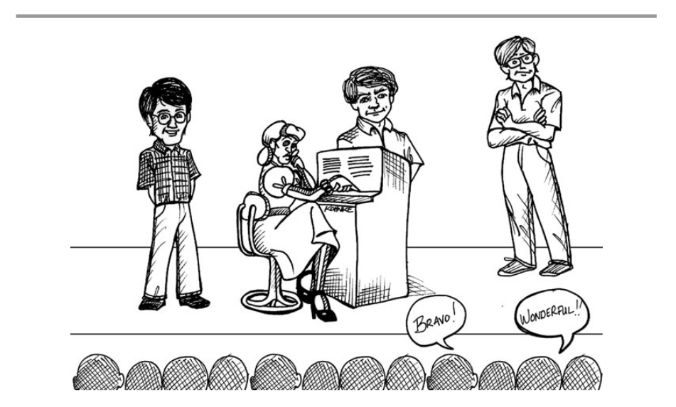

# Chương 3 Đồng thuận

Bạn có biết rằng tôi đã phát minh ra hộp thư thoại không? Đúng vậy. Trên thực tế, có 3 người nắm giữ bằng sáng chế hộp thư thoại. Ken Finder, Jerry Fitzpatrick và tôi. Vào đầu những năm 80, chúng tôi lúc đó đang làm việc ở một công ty có tên Teradyne. CEO ủy quyền cho chúng tôi nghiên cứu một loại sản phẩm mới và chúng tôi đã phát minh ra "Nhân viên lễ tân điện tử (The Electronic Receptionist)", viết tắt là ER.

Các bạn đều biết ER là gì. ER là một trong những cỗ máy khủng khiếp trả lời điện thoại tại các công ty. Hỏi bạn tất cả các câu hỏi mất-não được trả lời bằng cách bấm nút ("Chọn Tiếng Anh, bấm 1").

ER của chúng tôi trả lời điện thoại cho một công ty và yêu cầu bạn nhập vào tên người bạn muốn gặp. Nó sẽ yêu cầu bạn phát âm tên người đó, và sau đó nó sẽ gọi cho họ. Nó sẽ thông báo đến người nhận và kiểm tra xem họ có chấp nhận cuộc gọi không. Nếu có, nó sẽ kết nối và kết thúc cuộc gọi.

Bạn có thể cho ER biết bạn đang ở đâu. Bạn có thể cấp cho nó một vài số điện thoại để thử. Vậy nên, ER có thể tìm thấy bạn ở bất kỳ đâu, trong văn phòng của một người nào đó, ở nhà, ở một thành phố khác. Và, trong trường hợp ER không tìm thấy bạn, nó sẽ nhận được một tin nhắn. Đó là lúc hộp thư thoại vào cuộc.

Điều kỳ lạ là, Teradyne không tìm ra cách nào để bán ER. Dự án đã cạn ngân sách và được biến thành một thứ chúng tôi có thể bán được - CDS, Hệ thống điều phối thủ công (The Craft Dispatch System), để điều thợ sửa điện thoại đến công việc tiếp theo của họ. Và Teradyne cũng dừng đăng ký bằng sáng chế mà không cho chúng tôi biết. Chủ bằng sáng chế hiện tại đã nộp đơn sau chúng tôi tới 3 tháng.

Một thời gian sau khi chuyển ER thành CDS, nhưng rất lâu trước khi tôi phát hiện ra rằng bằng sáng chế bị dừng đăng ký. Tôi đợi CEO ở trước tòa nhà công ty, chúng tôi có một cây sồi lớn tại đó. Tôi trèo lên cây và đợi chiếc Jaguar của anh ta đi tới. Tôi gặp anh ta ở cửa công ty và ngỏ ý muốn gặp vài phút. Anh ta miễn cưỡng đồng ý.

Tôi nói rằng chúng ta thực sự cần tái khởi động dự án ER. Tôi khẳng định với anh ta chắc chắn nó có thể tạo ra lợi nhuận. Và anh ta làm tôi ngạc nhiên khi trả lời: "OK Bob, lập một kết hoạch đi. Cho tôi thấy cách tôi có thể tạo ra lợi nhuận. Nếu anh làm tôi tin vào điều đó, tôi sẽ tái khởi động dự án ER."

Tôi không hề lường trước việc này. Tôi kỳ vọng anh ta sẽ nói: "Anh nói đúng Bob. Tôi sẽ khởi động lại dự án, và tôi sẽ tìm cách để tạo ra lợi nhuận từ nó" Nhưng không. Anh ta chuyển gánh nặng này sang cho tôi. Và nó khiến tôi mâu thuẫn. Xét cho cùng, tôi là người làm ra phần mềm, không phải người làm ra tiền. Tôi muốn được thực hiện dự án ER, mà không cần quan tâm đến lãi và lỗ. Nhưng tôi không muốn thể hiện sự mâu thuẫn này. Nên tôi cảm ơn và rời văn phòng vời những lời này:

"Cảm ơn Russ. Tôi hứa là ... tôi chắc"

Bây giờ, để tôi giới thiệu cho bạn về Roy Osherove, người sẽ cho bạn biết câu nói đó thảm hại đến mức nào.

## Ngôn ngữ của sự cam kết

Viết bởi Roy Osherove

Nói. Là. Phải. Làm

Một sự cam kết sẽ có 3 phần.

1. Bạn _nói_ bạn sẽ làm điều đó
2. Bạn _thực lòng_ muốn làm điều đó
3. Bạn _thực sự_ làm điều đó

Nhưng người ta không bao giờ thực hiện đủ cả 3 bước. Và chắc bạn thường xuyên gặp phải những trường hợp này? (không phải chúng ta, tất nhiên!)

- **Bạn hỏi một anh chàng IT** tại sao mạng lại chậm như vậy và anh ta trả lời "Đúng. chúng ta thực sự cần thêm vài chiếc router mới" Và bạn _biết_ rằng sẽ không có gì xảy ra.

- **Bạn yêu cầu một thành viên trong team** thực hiện một số kiểm thử thủ công trước khi kiểm tra source code, và anh ta trả lời, "Chắc chắn rồi. Tôi hy vọng sẽ làm điều đó vào cuối ngày". Và bằng cách nào đó, bạn _cảm thấy_ rằng ngày mai bạn sẽ cần hỏi lại xem liệu có bất kỳ kiểm thử nào thực sự được chạy trước khi kiểm tra.

- **Sếp của bạn** đi loanh quanh trong phòng và lẩm bẩm, "chúng ta cần phải làm nhanh hơn". Và bạn _biết_ sếp thực sự muốn BẠN cần phải làm nhanh hơn. _Anh/cô ta_ sẽ không làm gì giúp tiến độ nhanh hơn.

Có rất ít người thực sự muốn và thực sự làm những điều họ nói. Có vài người khi nói ra điều gì đó, họ thực sự _muốn_ làm điều đó nhưng không bao giờ hoàn thành. Và có rất nhiều người hứa hẹn nhiều điều mà thậm chí họ không _muốn_ thực hiện nó. Bạn đã bao giờ nghe ai đó nói: "Anh bạn, tôi thực sự cần giảm cân một chút" và bạn biết họ sẽ không làm gì cả? Luôn là như vậy.

Tại sao trong hầu hết mọi lúc, bạn luôn có cảm giác kỳ lạ là mọi người không thực sự cam kết hoàn thành một việc gì đó?

Tệ hơn, trực giác thường khiến chúng ta thất vọng. Đôi khi chúng ta _muốn_ tin rằng ai đó thực sự muốn điều họ vừa nói ra trong khi họ thực sự không muốn. Chúng ta _muốn_ tin một lập trình viên khi họ nói, lúc đang bị dồn ép, họ có thể hoàn thành một công việc 2 tuần chỉ trong 1 tuần, nhưng chúng ta không nên tin điều đó.

Thay vì tin tưởng vào gan ruột mình, chúng ta có thể sử dụng một số thủ thuật liên quan đến ngôn ngữ để thử và tìm hiểu xem mọi người có thực sự muốn điều họ nói hay không. Và bằng cách thay đổi những gì chúng ta nói, chúng ta có thể bắt đầu thực hiện bước 1 và 2 của danh sách trên. Khi chúng ta _nói_ rằng chúng tôi sẽ cam kết với một điều gì đó, chúng ta thực sự _muốn_ điều đó.

### Dấu hiệu của sự "lươn lẹo"

Hãy để ý tới ngôn ngữ mà chúng ta dùng khi _cam kết_ làm một việc gì đó, nó sẽ là một dấu hiệu báo trước cho việc sắp xảy ra. Thực ra, chính xác hơn là để ý tới một số từ cụ thể trong những lời cam kết đó. Nếu bạn không thể tìm thấy những từ khóa kỳ diệu đó, rất có thể chúng tôi không thực sự muốn điều mình vừa nói, hoặc chúng tôi có thể không tin rằng chúng khả thi.

Dưới đây là vài ví dụ về những từ khóa và cụm từ cần tìm như một dấu hiệu nhận biết sự thất hứa.

- **Cần/Nên (Need\Should):** "Chúng ta cần hoàn thành việc này." "Tôi cần giảm cân." "Ai đó nên biến điều đó thành hiện thực."

- **Hy vọng/Ước (Hope/Wish):** "Tôi hy vọng có thể hoàn thành vào ngày mai." "Tôi hy vọng chúng ta có thể gặp lại vào ngày nào đó." "Tôi ước tôi có thời gian cho việc đó." "Tôi ước chiếc máy tính này nhanh hơn."

- **Hãy (Let's):** (không nói sau "Tôi...(I...)") "Hãy gặp nhau nhé." "Hãy hoàn thành việc này."

Khi bắt đầu để ý những từ này, bạn sẽ phát hiện ra chúng hầu hết ở mọi nơi quanh bạn, ngay cả trong những điều bạn nói.

Bạn sẽ thấy chúng ta có xu hướng rất bận rộn và không chịu trách nhiệm với mọi việc.

Và thật sự _không_ ổn nếu bạn hoặc người nào khác dựa vào những lời hứa đó như một phần của công việc. Tuy nhiên bạn đã thực hiện được bước đầu tiên - bắt đầu nhận biết được sự thiếu trung thực trong cam kết ở xung quanh và bên trong bạn.

Chúng ta đã nghe được âm thanh của sự thất hứa. Vậy còn những cam kết thực sự?

### Những cam kết thật sự nghe như thế nào?

Điểm chung của những cụm từ trong phần trước là họ cho rằng những thứ đó nằm ngoài tầm tay của "tôi" hoặc họ không có trách nhiệm cá nhân trong việc đó. Trong mỗi trường hợp, họ cư xử như đang là _nạn nhân_ của tình huống thay vì kiểm soát nó.

Sự thật là _bạn_, _bản thân bạn_, LUÔN LUÔN có điều gì đó nằm trong tầm kiểm soát _của mình_, vì vậy luôn có _điều gì đó_ bạn hoàn toàn có thể cam kết thực hiện.

Công thức bí mật để nhận ra lời cam kết trung thực là để ý tới những câu nghe giống như: Tôi sẽ ... vào ... (ví dụ: Tôi sẽ hoàn thành vào thứ 3)

Có gì quan trọng trong câu trên? _Bạn bắt đầu đối mặt với thực tế rằng BẠN cần làm một việc gì đó với thời gian hoàn thành rõ ràng._ Bạn đang _không_ nói về bất cứ ai khác ngoài bản thân bạn. Bạn đang nói về _hành động_ bạn _sẽ_ làm. Bạn không _"có thể"_ làm nó hoặc _"có thể đạt được"_, bạn _sẽ_ hoàn thành nó.

Không có cách nào (về mặt lý thuyết) thoát khỏi cam kết bằng câu nói trên. Bạn nói bạn sẽ làm nó và bây giờ chỉ có 2 trường hợp có thể xảy ra - bạn hoàn thành nó, hoặc không. Nếu bạn không hoàn thành, bạn sẽ làm thất vọng những người phụ thuộc lời hứa đó. Bạn sẽ cảm thấy _tồi tệ_ khi không hoàn thành. Bạn sẽ thấy _ngại_ khi nói chuyện với ai đó rằng bạn chưa xong việc (nếu người đó nghe được lời hứa của bạn)

Khá đáng sợ phải không nào?

Bạn đang chịu toàn bộ trách nhiệm về một việc gì đó, trước ít nhất một người. Không giống như bạn đang đứng trước gương, hoặc màn hình máy tính. Chính bạn, đối mặt với một người khác, và nói rằng bạn sẽ làm điều đó. Đó là khi cam kết sẽ bắt đầu. Đặt mình vào tình huống mà bạn buộc phải làm điều đó.

Bạn đã thay đổi ngôn ngữ bạn sử dụng thành ngôn ngữ của sự cam kết, và điều đó sẽ giúp bạn đi tới 2 bước tiếp theo: thực sự muốn, và làm theo.

Sau đây là một số lý do bạn có thể đưa ra khi _không_ muốn hoặc làm điều đó, và một số giải pháp.

#### Nó sẽ không hiệu quả vì tôi phải phụ thuộc vào người X để hoàn thành việc này.

Bạn có thể chỉ cam kết những việc bạn _toàn quyền kiểm soát_. Lấy ví dụ, nếu mục tiêu của bạn là hoàn thành một module phụ thuộc vào một đội khác, bạn không thể cam kết hoàn thành module đó với tích hợp đầy đủ của nhóm khác. Nhưng bạn _có thể_ cam kết thực hiện những hành động cụ thể sẽ đưa bạn đến mục tiêu của mình. Bạn có thể:

- Dành ra một giờ bàn bạc với Gary từ nhóm cơ sở hạ tầng để làm rõ sự phụ thuộc của bạn.
- Tạo một interface để trừu tượng hóa sự phụ thuộc module của bạn với cơ sở hạ tầng của nhóm khác.
- Gặp gỡ người dựng hệ thống ít nhất 3 lần trong tuần để đảm bảo các thay đổi của bạn hoạt động tốt trong hệ thống của công ty.
- Tạo bản dựng cá nhân của riêng bạn để chạy các kiểm thử tích hợp cho module.

Bạn đã thấy sự khác biệt chưa?

Nếu mục tiêu cuối cùng phụ thuộc vào một ai đó, bạn nên cam kết những hành động cụ thể sẽ đưa bạn đến gần hơn với mục tiêu cuối cùng.

#### Nó sẽ không hiệu quả vì tôi thực sự không biết liệu có thể thực hiện được hay không

Nếu không thể hoàn thành, bạn vẫn có thể cam kết những hành động sẽ đưa bạn đến gần mục tiêu hơn. Tìm hiểu xem có thể thực hiện hay không là một trong những hành động cần cam kết!

Thay vì cam kết sẽ sửa toàn bộ 25 lỗi còn lại trước khi phát hành sản phẩm (có thể bất khả thi), bạn có thể cam kết những hành động cụ thể sẽ đưa bạn đến gần mục tiêu hơn, như sau:

- Rà soát một lượt 25 lỗi và cố gắng tái hiện chúng.
- Nói chuyện với QA, người đã tìm ra những lỗi đó để xem bản tóm tắt của lỗi đó.
- Dành toàn bộ thời gian trong tuần của bạn để sửa từng lỗi một.

#### Nó sẽ không hiệu quả vì đôi lúc tôi sẽ không làm được.

Điều đó có thể xảy ra. Đôi khi những thứ không lường trước sẽ xảy ra, cuộc sống mà. Nhưng bạn luôn muốn sống theo sự kỳ vọng. Trong trường hợp đó, đã đến lúc thay đổi sự kỳ vọng đó, _ngay và luôn_.

Nếu bạn không thể thực hiện cam kết của mình, việc quan trọng nhất là báo động ngay và luôn cho những người mà bạn đã cam kết.

Bạn càng thông báo cho các bên liên quan sớm bao nhiêu, thì càng có nhiều khả năng và thời gian cho đội của bạn dừng lại, đánh giá lại các hành động hiện tại và quyết định xem có thể thực hiện hoặc thay đổi điều gì đó không (ví dụ như về mức độ ưu tiên). Bằng cách này, cam kết của bạn vẫn có thể hoàn thành, hoặc bạn có thể thay đổi thành một cam kết khác.

Dưới đây là một vài ví dụ:

- Nếu bạn lên lịch hẹn vào buổi chiều ở một quán cà phê tại khu trung tâm với một đồng nghiệp và bạn bị tắc đường, bạn lo rằng bạn khó có thể giữ cam kết đến đúng giờ của mình. Bạn nên gọi cho đồng nghiệp ngay khi nhận ra mình có thể đến trễ, và cho họ biết. Biết đâu bạn sẽ tìm được một địa điểm gần hơn, hoặc có thể hoãn buổi hẹn lại.

- Nếu bạn cam kết sửa một lỗi mà bạn nghĩ là có thể sửa được, nhưng sau đó bạn phát hiện ra có vài vấn đề còn ẩn giấu phức tạp hơn so với suy nghĩ ban đầu, bạn hãy nêu vấn đề đó lên. Cả đội có thể quyết định quá trình để thực hiện cam kết đó (cùng làm, brainstorming, ...) hoặc thay đổi mức độ ưu tiên và giao một lỗi khác đơn giản hơn cho bạn.

Điều quan trọng ở đây là: Nếu bạn không nói với ai về vấn đề tiềm tàng sớm nhất có thể, bạn sẽ không cho người khác cơ hội để giúp đỡ bạn hoàn thành cam kết của mình.

### Tóm lại

Tạo nên ngôn ngữ của sự cam kết nghe có đôi chút đáng sợ, nhưng nó có thể giúp xử lý rất nhiều vấn đề về trao đổi thông tin mà các lập trình viên phải đối mặt ngày nay - ước lượng (estimation), hạn chót, và giao tiếp mặt đối mặt. Bạn sẽ được coi là một lập trình viên nghiêm túc luôn giữ lời hứa, và đó là một trong những điều tốt nhất mà bạn có thể hy vọng trong ngành của chúng ta.

## Học cách để nói "Có"

Tôi đề nghị Roy đóng góp bài viết trên vì tôi ấn tượng với nó từ khá lâu. Tôi giảng về việc học cách nói "không" trong một thời gian dài. Nhưng điều quan trọng không kém là học cách để nói "có"

### Mặt khác của "cố gắng"

Hãy tưởng tượng Peter có trách nhiệm với một số sửa đổi của công cụ xếp hạng. Peter tự ước tính chúng sẽ mất khoảng 5 ~ 6 ngày. Anh ta cũng nghĩ đến việc viết tài liệu cho các sửa đổi sẽ mất vài giờ. Vào sáng thứ 2, quản lý của anh, Marge, hỏi về tình hình công việc.

Marge: "Peter, bạn sẽ hoàn thành các chỉnh sửa của công cụ xếp hạng vào thứ 6 chứ?"

Peter: "Tôi nghĩ là được"

Marge: "Nó sẽ đi cùng với tài liệu chứ?"

Peter: "Tôi sẽ cố để hoàn thành nó"

Có lẽ Marge không nghe thấy sự bối rối trong câu nói của Peter, nhưng chắc chắn anh ta không đưa ra nhiều cam kết. Marge đưa ra những câu hỏi cần câu trả lời có hoặc không, nhưng Peter trả lời khá mơ hồ.

Lưu ý việc lạm dụng từ "cố gắng". Trong chương trước, chúng tôi đã định nghĩa cố gắng như một "nỗ lực thêm". Ở đây, cách nói của Peter được hiểu là "có thể có, có thể không"

Tốt hơn Peter nên trả lời thế này:

Marge: "Peter, bạn sẽ hoàn thành các chỉnh sửa của công cụ xếp hạng vào thứ 6 chứ?"

Peter: "Có thể, nhưng có thể đến thứ 2"

Marge: "Nó sẽ đi cùng với tài liệu chứ?"

Peter: "Tôi cần vài giờ để làm tài liệu, nên có thể vào thứ 2, nhưng có thể sẽ đến cuối ngày thứ 3"

Trong trường hợp này, ngôn ngữ của Peter trung thực hơn. Anh ta mô tả sự không chắc chắn của mình cho Marge. Marge có thể đối phó với sự không chắc chắn đó. Trong trường hợp trước đó, cô ấy không hề biết gì về nó.

## Cam kết với kỷ luật

Marge: "Peter, tôi muốn một câu trả lời rõ ràng, có hoặc không. Anh sẽ có chức năng công cụ xếp hạng hoàn chỉnh cùng với tài liệu vào thứ 6 chứ?

Đây là một câu hỏi hoàn toàn hợp lý của Marge. Cô ấy có một lịch trình cần quan tâm và cô cần một câu trả lời có hoặc không về ngày thứ 6. Peter nên trả lời thế nào?

Peter: "Trong trường hợp này, Marge, tôi sẽ phải nói không. Thời điểm sớm nhất mà tôi _chắc chắn_ tôi sẽ hoàn thành chỉnh sửa cùng tài liệu là vào thứ 3."

Marge: "Vậy anh cam kết vào thứ 3."

Peter: "Đúng, tôi sẽ hoàn thành mọi thứ vào thứ 3."

Nhưng nếu Marge rất muốn điều chỉnh và tài liệu hoàn thành vào thứ 6?

Marge: "Peter, nếu là thứ 3 thì tôi sẽ thực sự gặp vấn đề. Willy, người viết tài liệu kỹ thuật, sẽ bắt đầu công việc vào thứ 2. Anh ta có 5 ngày để hoàn thành hướng dẫn người dùng. Nếu tôi không có tài liệu của công cụ xếp hạng vào sáng thứ 2, anh ta sẽ không thể hoàn thành hướng dẫn đúng hẹn. Anh có thể làm tài liệu trước không?

Peter: "Không, phần chỉnh sửa phải hoàn thành trước, vì chúng ta tạo ra tài liệu từ kết quả của những kiểm thử."

Marge: "Chà, vậy có cách nào anh hoàn thành chỉnh sửa và tài liệu trước sáng thứ 2 không?"

Bây giờ Peter cần phải ra quyết định. Có khả năng cao anh ta sẽ hoàn thành chỉnh sửa công cụ xếp hạng vào thứ 6, và anh ta có khả năng hoàn thành tài liệu trước khi về nhà cho cuối tuần. Anh ta có thể dành thêm vài giờ vào thứ 7 nếu mọi thứ cần nhiều thời gian hơn anh ta nghĩ. Vậy Peter nên trả lời Marge thế nào?

Peter: "Nghe này Marge, có khả năng cao là tôi có thể hoàn thành mọi thứ vào sáng thứ 2 nếu tôi có thể làm thêm vài giờ vào thứ 7."

Liệu có giải quyết vấn đề của Marge? Không, nó đơn giản là thay đổi sự kỳ lạ, và đó là thứ Peter phải nói cho cô ấy.

Marge: "Tôi có thể trông cậy vào sáng thứ 2 không?"

Peter: "Có thể, nhưng không chắc chắn."

Điều đó không đủ với Marge.

Marge: "Nghe này Peter, tôi thực sự cần sự chắc chắn. Có bất kỳ cách nào anh có thể cam kết hoàn thành trước sáng thứ 2 không?

Peter có thể bị cám dỗ để phá vỡ kỷ luật vào lúc này. Anh ta có thể hoàn thành nhanh hơn nếu anh ta bỏ qua các kiểm thử của mình. Anh ta có thể hoàn thành nhanh hơn nếu không refactor. Anh ta có thể hoàn thành nhanh hơn nếu anh ta không chạy đầy đủ hồi quy.

Đây là lúc người chuyên nghiệp xác định ranh giới. Trước hết, giả thiết của Peter không chính xác. Anh ta _sẽ không_ hoàn thành nhanh hơn nếu bỏ qua kiểm thử. Anh ta _sẽ không_ hoàn thành nhanh hơn nếu không refactor. Anh ta _sẽ không_ hoàn thành nhanh hơn nếu không chạy đầy đủ hồi quy. Kinh nghiệm nhiều năm đã dạy chúng tôi rằng vi phạm kỷ luật chỉ khiến chúng tôi chậm lại.

Nhưng thứ 2, với tư cách một chuyên gia, anh ta có trách nhiệm duy trì những tiêu chuẩn nhất định. Code của anh ta cần phải được kiểm thử, cần phải có kiểm thử, và cần được giữ sạch sẽ. Và anh ta phải chắc chắn mình không phá vỡ bất kỳ điều gì khác trong hệ thống.

Peter, là một người chuyên nghiệp, đã cam kết duy trì những tiêu chuẩn này. Tất cả các cam kết mà anh ta đưa ra phải tuân theo điều đó. Vì vậy, toàn bộ lý do này cần phải hủy bỏ.

Peter: "Không, Marge, tôi thực sự không thể chắc chắn bất kỳ hạn chót nào trước thứ 3. Tôi rất tiếc nếu điều đó làm xáo trộn lịch trình của bạn, nhưng đó là thực tế mà chúng ta phải đối mặt."

Marge: "Chết tiệt, tôi thực sự muốn sớm hơn. Anh chắc chứ?"

Peter: "Tôi chắc chắn rằng có thể xong vào muộn ngày thứ 3."

Marge: "OK, tôi nghĩ là tôi sẽ nói chuyện với Willy để xem anh ta có thể sắp xếp lại lịch trình của mình hay không."

Đó là trong trường hợp Marge chấp nhận câu trả lời của Peter và bắt đầu cân nhắc các lựa chọn khác. Nhưng sẽ ra sao nếu Marge không còn lựa chọn nào nữa, và Peter là hy vọng cuối cùng?

Marge: "Peter, nghe này, tôi biết đây là một sự áp đặt lớn, nhưng tôi thực sự cần anh tìm cách hoàn thành công việc này vào sáng thứ 2. Nó thực sự rất quan trọng. Anh không thể làm gì được sao?

Bây giờ Peter bắt đầu thực sự suy nghĩ về việc làm thêm giờ, có lẽ hầu hết vào các ngày cuối tuần. Peter cần phải rất thành thật với bản thân về khả năng chịu đựng và những gì còn lại của mình. Có thể dễ dàng _nói_ rằng bạn sẽ hoàn thành rất nhiều việc vào cuối tuần, nhưng sẽ khó hơn để thực sự tập hợp đủ năng lượng để làm công việc chất lượng cao.

Người chuyên nghiệp biết giới hạn của mình. Họ biết mình có thể làm thêm giờ bao lâu là hiệu quả nhất và cái giá cho việc đó là gì.

Trong trường hợp này, Peter cảm thấy khá tự tin rằng một vài giờ làm thêm trong tuần và một chút thời gian cuối tuần là đủ.

Peter: "OK, Marge, nghe tôi nói này. Tôi sẽ gọi về nhà và xác định thời gian làm thêm giờ với gia đình tôi. Nếu họ đồng ý, thì tôi sẽ hoàn thành công việc vào sáng thứ 2. Tôi sẽ đến vào sáng thứ 2 để chắc chắn rằng mọi thứ sẽ ổn với Willy. Nhưng sau đó tôi sẽ về nhà và chỉ quay trở lại vào thứ 4. Thỏa thuận như vậy nhé?"

Điều này hoàn toàn công bằng. Peter biết rằng anh ấy có thể hoàn thành các sửa đổi và tài liệu nếu anh ấy làm việc ngoài giờ. Anh ấy cũng biết mình sẽ vô dụng trong vài ngày sau đó.

## Kết luận

Người chuyên nghiệp không bắt buộc phải nói có với mọi thứ họ được yêu cầu. Tuy nhiên, họ nên làm việc chăm chỉ để tìm ra những cách sáng tạo giúp biến những câu trả lời "có" thành khả thi. Khi họ nói có, họ sử dụng ngôn ngữ của cam kết để không ai nghi ngờ về lời hứa của họ.
