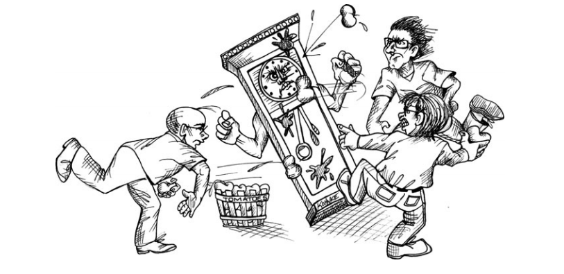

# Chương 9 Quản lý thời gian

8 tiếng là một khoảng thời gian thực sự ngắn. Nó chỉ là 480 phút hoặc 28800 giây. Là một chuyên gia, bạn muốn sử dụng những giây phút quý giá đó hiệu quả và hữu ích nhất có thể. Chiến thuật nào sẽ đảm bảo cho bạn không lãng phí thời gian ít ỏi của mình? Làm thế nào để bạn quản lý hiệu quả thời gian của mình?

Năm 1986 tôi đang sống ở Little Sandhurst, Surrey, Anh. Tôi quản lý bộ phận phát triển phần mềm gồm 15 người cho Teradyne ở Bracknell. Một ngày của tôi thường bị lấp đầy bởi các cuộc gọi, những cuộc họp ngẫu hứng, các vấn đề thực địa và sự gián đoạn. Vì vậy, để hoàn thành công việc, tôi phải áp dụng một số kỷ luật quản lý thời gian khá quyết liệt.

- Tôi thức dậy lúc 5h sáng mỗi ngày và đạp xe đến văn phòng ở Bracknell lúc 6h. Việc này cho tôi 2,5h yên tĩnh trước khi sự hỗn loạn của ngày mới bắt đầu.
- Khi đến nơi, tôi sẽ viết một lịch trình lên bảng. Tôi chia thời gian thành những khoảng 15 phút và điền hoạt động tôi sẽ làm trong khoảng thời gian đó.
- Tôi hoàn toàn lấp đầy 3h đầu tiên của lịch trình đó. Từ 9h sáng, tôi để trống 15 phút mỗi giờ, trong khoảng thời gian đó, tôi xử lý hầu hết các gián đoạn và quay trở lại làm việc.
- Tôi không lên lịch trình sau giờ ăn trưa vì tôi biết rằng sau giờ ăn trưa, mọi thứ sẽ loạn cào cào và tôi phải ở chế độ phản ứng trong suốt thời gian còn lại trong ngày. Trong những buổi chiều hiếm hoi không có sự hỗn loạn, tôi sẽ chọn làm việc quan trọng nhất cho đến khi hoàn thành.

Kế hoạch trên không phải lúc nào cũng thành công. Thức dậy vào lúc 5h sáng không phải lúc nào cũng khả thi, và đôi khi sự hỗn loạn phá vỡ mọi chiến lược của tôi và tiêu tốn cả ngày. Nhưng hơn hết là, tôi vẫn có thể xoay sở được.

## Các cuộc họp

Các cuộc họp tiêu tốn 200$ mỗi giờ với mỗi người tham dự. Điều này tính đến tiền lương, phúc lợi, chi phí cơ sở vật chất .v.v. Lần tới khi bạn tham gia một cuộc họp, hãy tính toàn chi phí của nó. Bạn sẽ ngạc nhiên đấy.

Có 2 sự thật về các cuộc họp.

1. Chúng cần thiết
2. Chúng rất tốn thời gian

Thường thì 2 sự thật này mô tả về cùng một cuộc họp. Một số người sẽ cảm thấy chúng vô giá; những người còn lại sẽ thấy chúng dư thừa và vô dụng.

Những chuyên gia nhận thức được chi phí cao của các cuộc họp. Họ cũng nhận thức được rằng thời gian của mình rất quý giá; họ còn code cần phải viết và kế hoạch cần hoàn thành. Do đó, họ tích cực phản đối việc tham dự các cuộc họp không mang lại lợi ích đáng kể và ngay lập tức.

### Từ chối

Bạn không cần phải tham gia tất cả các cuộc họp bạn được mời. Thực tế là, tham gia quá nhiều cuộc họp thể hiện sự thiếu chuyên nghiệp. Bạn cần sử dụng thời gian của mình thật thông minh. Vậy nên hãy thật cẩn thận lựa chọn cuộc họp nào nên tham gia và cuộc họp nào nên lịch sự từ chối.

Người mời bạn tham gia cuộc họp không có trách nhiệm quản lý thời gian của bạn. Chỉ có _bạn_ mới làm được điều đó. Vì vậy, khi nhận được một lời mời họp, đừng chấp nhận trừ khi sự tham gia của bạn là cần thiết ngay lập tức và có tầm quan trọng đáng kể với công việc bạn đang làm.

Đôi khi cuộc họp sẽ có vài thứ mà bạn quan tâm, nhưng nó không cần thiết ngay lập tức. Bạn sẽ phải cân nhắc xem bạn có đủ thời gian hay không. Hãy cẩn thận - có thể nó sẽ tiêu tốn cả ngày của bạn.

Đôi khi cuộc họp sẽ có thứ gì đó bạn đóng góp được nhưng không có ý nghĩa ngay lập tức với những gì bạn đang làm. Bạn phải cân nhắc xem liệu tổn thất đối với dự án của bạn có xứng đáng với lợi ích của họ hay không. Nghe có vẻ ích kỷ, nhưng trách nhiệm của bạn cần phải dành cho dự án _của bạn_ trước. Tuy nhiên, thường thì việc giúp đỡ này sẽ mang lại kết quả tốt, do đó, bạn có thể muốn thảo luận về sự tham gia của mình với nhóm và PM.

Đôi khi sự hiện diện của bạn trong cuộc họp được yêu cầu bởi người có thẩm quyền, chẳng hạn như một kỹ sư cấp rất cao trong một dự án khác hoặc PM của dự án khác. Bạn sẽ phải cân nhắc xem quyền hạn đó có vượt qua được lịch trình làm việc của bạn hay không. Một lần nữa, nhóm của bạn và người giám sát của bạn có thể giúp đỡ trong việc đưa ra quyết định.

Một trong những nghĩa vụ quan trọng nhất của người quản lý của bạn là giúp bạn _tránh khỏi_ những cuộc họp. Một người quản lý giỏi sẽ sẵn sàng bảo vệ quyết định từ chối tham dự của bạn vì người đó cũng quan tâm đến thời gian của bạn như chính bạn.

### Rời khỏi cuộc họp

Các cuộc họp không phải lúc nào cũng theo kế hoạch. Đôi khi trong cuộc họp bạn nhận ra rằng bạn nên từ chối từ đầu nếu biết thêm thông tin. Đôi khi các chủ đề mới được thêm vào, hoặc thú cưng của ai đó chiếm ưu thế trong các cuộc thảo luận. Trong nhiều năm, tôi đặt ra một quy tắc đơn giản: Khi một cuộc họp trở nên nhàm chán, hãy rời khỏi nó.

Một lần nữa, bạn có nghĩa vụ quản lý tốt thời gian của mình. Nếu bạn thấy mình bị mắc kẹt trong một cuộc họp không sử dụng tốt thời gian của mình. bạn cần tìm cách thoát khỏi cuộc họp đó một cách lịch sự.

Rõ ràng là bạn không muốn đứng dậy phũ phàng và thốt lên "Thật nhàm chán!". Không cần phải tỏ ra thô lỗ như vậy. Bạn chỉ cần hỏi, vào thời điểm thích hợp, nếu sự hiện diện của bạn vẫn cần thiết. Bạn có thể giải thích rằng bạn không thể dành nhiều thời gian hơn và hỏi có cách nào để xúc tiến cuộc thảo luận hay rút ngắn chương trình làm việc hay không.

Điều quan trọng bạn cần nhận ra là việc ở lại trong một cuộc họp đang lãng phí thời gian của bạn, và bạn không còn có thể đóng góp đáng kể vào cuộc họp, là không chuyên nghiệp. Bạn có nghĩa vụ tiết kiệm thời gian và tiền bạc cho chủ doanh nghiệp một cách khôn ngoan, vì vậy, hãy chọn một thời điểm thích hợp để thương lượng việc rời đi của bạn không phải là thiếu chuyên nghiệp.

### Cuộc họp có lịch trình và mục tiêu rõ ràng.

Lý do chúng ta sẵn sàng chịu đựng chi phí cho các cuộc họp là đôi khi chúng ta _cần_ những người tham gia ngồi lại cùng nhau để đạt được một mục tiêu cụ thể. Để sử dụng khôn ngoan thời gian của những người tham gia, cuộc họp cần phải có một lịch trình rõ ràng, có thời gian cho từng chủ đề và mục tiêu đã nêu.

Nếu bạn được mời tham gia một cuộc họp, hãy chắc chắn rằng bạn biết điều gì sẽ được đưa ra thảo luận, thời gian được phân bổ cho chúng là bao nhiêu, và mục tiêu cuối cùng đạt được là gì. Nếu bạn không có được câu trả lời rõ ràng cho những câu hỏi trên, thì hãy lịch sự từ chối tham gia.

Nếu bạn tham dự một buổi họp và bạn thấy rằng lịch trình đã bị quá tải hoặc bị bỏ qua, bạn nên yêu cầu bàn bạc một chủ đề mới và tuân theo lịch trình đặt ra. Nếu không thực hiện điều đó, bạn nên lịch sự rời đi khi có thể.

### Các cuộc họp đứng

Những cuộc họp này là một phần của phương pháp phát triển Agile. Tên của chúng đến từ thực tế, người tham gia sẽ đứng trong suốt thời gian họp. Mỗi người lần lượt trả lời 3 câu hỏi:
1. Tôi đã làm gì ngày hôm qua?
2. Tôi sẽ làm gì hôm nay?
3. Điều gì đang cản trở tôi?

Đó là tất cả. Mỗi câu hỏi trả lời _không quá_ 20 giây, nên mỗi người không được trả lời quá 1 phút. Ngay cả với một nhóm 10 người, cuộc họp này nên kết thúc tốt đẹp trước 10 phút.

### Các cuộc họp lập kế hoạch từng giai đoạn (Sprint)

Với phát triển Agile, những cuộc họp này là khó làm tốt nhất. Làm không tốt, chúng rất tốn thời gian. Cần có kỹ năng để cho những cuộc họp này diễn ra tốt đẹp, và kỹ năng đó rất đáng để học hỏi.

Họp lập kế hoạch trong giai đoạn tức là chọn những hạng mục trong danh sách tồn đọng (backlog) sẽ được thực hiện trong giai đoạn tiếp theo. Những hạng mục được chọn phải được ước lượng và hoàn thành đánh giá chức năng trước đó. Thậm chí, các cuộc họp được tổ chức tốt, các kiểm thử chấp nhận / thành phần đã được viết sẵn, hoặc ít nhất là phác thảo.

Cuộc họp nên tiến hành nhanh chóng với mỗi hạng mục được chọn, thảo luận ngắn gọn sau đó đưa ra kết luận lựa chọn hoặc loại bỏ. Không nên dành quá 5 hoặc 10 phút cho bất kỳ một hạng mục nào. Nếu cần thảo luận dài hơn, nó nên được lên lịch vào một thời điểm khác với một nhóm nhỏ hơn.

Theo kinh nghiệm của tôi thì cuộc họp này không nên kéo dài quá 5% tổng thời gian của một giai đoạn. Vì vậy, với giai đoạn 1 tuần (40 giờ) cuộc họ này nên thực hiện trong vòng 2 giờ.

### Các cuộc họp tổng kết (restrospective) và demo

Những cuộc họp này tiến hành vào mỗi cuối giai đoạn. Các thành viên thảo luận điều gì tốt và điều gì chưa tốt. Các bên liên quan xem bản demo về cách hoạt động của các tính năng mới. Các cuộc họp này có thể bị lạm dụng quá đáng và có thể làm mất rất nhiều thời gian, vì vậy hãy lên lịch cho chúng vào 45 phút trước khi hết giờ và vào ngày cuối cùng của giai đoạn. Phân bổ không quá 20 phút cho tổng kết và 25 phút cho demo. Hãy nhớ rằng, chỉ mới 1 hoặc 2 tuần nên không có nhiều điều để nói.

### Tranh cãi / Bất đồng

Kent Beck đã từng chia sẻ với tôi một điều sâu sắc như sau: "Bất kỳ cuộc tranh cãi nào không giải quyết được trong 5 phút sẽ không thể giải quyết được bằng tranh cãi". Lý do nó kéo dài như vậy là do cả 2 bên đều không có bằng chứng rõ ràng. Lập luận có thể dựa trên tôn giáo, trái ngược với thực tế.

Những bất đồng về mặt kỹ thuật có xu hướng trôi vào vô tận. Mỗi bên đều có đủ loại biện minh cho lập trường của mình nhưng hiếm khi có bất kỳ dữ liệu nào. Nếu không có dữ liệu, bất kỳ lập luận nào cũng không thể đi đến thỏa thuận trong vài phút (khoảng từ 5 đến 30 phút) và sẽ không được thỏa thuận. Điều duy nhất cần làm là đi xác minh dữ liệu.

Một số người cố gắng giành chiến thắng trong một cuộc tranh cãi bằng cách nhắm vào tính cách. Họ có thể la hét, nói thẳng vào mặt bạn hoặc cư xử trịnh thượng. Nó không quan trọng; sức mạnh ý chí không giải quyết được bất đồng trong thời gian dài. Dữ liệu thì làm được.

Một số người sẽ chọn xử lý hung hăng một cách bị động. Họ sẽ đồng ý để kết thúc tranh cãi, nhưng sau đó họ phá hoại kết quả bằng cách từ chối tham gia vào giải pháp. Họ sẽ nói với chính mình, "Đây là cách họ muốn và bây giờ họ sẽ đạt được những gì họ muốn". Đây có lẽ là loại hành vi thiếu chuyên nghiệp tồi tệ nhất. Không bao giờ, đừng bao giờ làm thế. Nếu bạn đồng ý, bạn phải tham gia.

Làm thế nào để có được dữ liệu bạn cần cho việc dàn xếp bất đồng? Đôi khi bạn có thể chạy thử nghiệm hoặc thực hiện một số mô phỏng. Nhưng đôi khi giải pháp thay thế tốt nhất là tung đồng xu để chọn 1 trong 2 cách được đề cập.

Nếu mọi thứ suôn sẻ, thì cách đó khả thi. Nếu bạn gặp phải rắc rối, bạn có thể lùi lại và làm theo cách còn lại. Sẽ khôn ngoan hơn nếu bạn thống nhất về thời gian cũng như các tiêu chí xác định khi nào nên từ bỏ cách đã chọn.

Hãy cẩn thận với những cuộc họp thực sự chỉ là nơi trút bỏ bất đồng và thu thập ủng hộ cho bên này hoặc bên kia. Và tránh những nơi chỉ có một trong những người tranh luận đang trình bày.

Nếu một cuộc tranh cãi thực sự được giải quyết, hãy yêu cầu mỗi người tranh luận trình bày trường hợp của họ trước nhóm trong 5 phút hoặc ít hơn. Sau đó cả nhóm sẽ bầu chọn. Toàn bộ cuộc họp sẽ diễn ra trong chưa đầy 15 phút.

## Ma-na tập trung

Thứ lỗi cho tôi nếu phần này nghe trừu tượng như New Age, hoặc có lẽ là Dungeons & Dragons. Đây chỉ là một cách tôi nghĩ về chủ đề này.

Lập trình là một hoạt động tri thức đòi hỏi kiên trì và tập trung trong một khoảng thời gian dài. Sự tập trung là một nguồn tài nguyên khan hiếm, giống như ma-na. Sau khi sử dụng hết ma-na tập trung, bạn cần phải nạp lại bằng cách thực hiện các hoạt động không đòi hỏi sự tập trung trong một giờ hoặc hơn.

Tôi không biết thứ ma-na tập trung này là gì, nhưng tôi có thể cảm nhận được nó như là một vật chất vật lý (hoặc sự thiếu hụt của nó) làm ảnh hưởng đến sự thay đổi và sự chú ý. Dù nó là cái gì, bạn có có thể _cảm thấy_ nó ở đó, và bạn có thể cảm thấy khi nó biến mất. Những lập trình viên chuyên nghiệp học cách quản trị thời gian để tận dụng ma-na tập trung tốt nhất có thể. Chúng ta viết code khi ma-na tập trung của chúng ta đang cao; và chúng ta làm những việc khác, ít đòi hỏi tập trung hơn khi nó thấp.

Ma-na tập trung cũng là một nguồn tài nguyên dễ mất đi. Nếu bạn không sử dụng nó khi nó ở đó, bạn có khả năng làm mất nó. Đó là một trong những lý do khiến các cuộc họp mang tính hủy hoại tàn khốc. Nếu bạn dùng toàn bộ ma-na tập trung cho một cuộc họp, bạn sẽ không còn lại gì để viết code.

Lo lắng và mất tập trung cũng làm hao phí ma-na tập trung. Cuộc tranh cãi với vợ/chồng bạn vào tối qua, vết lõm trên xe bạn gặp sáng nay, hoặc hóa đơn bạn quên trả tuần trước, tất cả sẽ bòn rút ma-na tập trung của bạn rất nhanh.

### Ngủ

Có lẽ tôi không cần phải nhấn mạnh việc này nữa. Tôi có đầy đủ ma-na tập trung nhất sau một đêm ngon giấc. Một giấc ngủ 7h trường giúp tôi có đủ 8h tập trung. Các lập trình viên chuyên nghiệp quản lý lịch trình ngủ của họ để đảm bảo rằng họ sẽ có hầu hết ma-na tập trung vào lúc đi làm buổi sáng.

### Caffeine

Không có gì khó hiểu khi vài người trong chúng ta sử dụng ma-na tập trung hiệu quả hơn khi uống một lượng vừa phải caffeine. Nhưng hãy cẩn thận. Caffeine cũng mang lại cảm giác "bồn chồn" cho sự tập trung của bạn. Quá nhiều caffeine có thể khiến sự tập trung của bạn đi theo những hướng rất lạ. Một lượng caffeine mạnh có thể khiến bạn lãng phí cả ngày tập trung cao độ vào những việc không đâu.

Sử dụng caffeine là chuyện cá nhân. Cá nhân tôi có sở thích uống một cốc coffee đậm vào buổi sáng và một cốc coke ăn kiêng vào buổi trưa. Đôi khi tôi tăng gấp đôi liều lượng, nhưng hiếm khi nhiều hơn thế.

### Sạc lại

Ma-na tập trung có thể nạp lại một phần bằng sự xao nhãng. Đi dạo một lúc, trò chuyện với bạn bè, hoặc dành thời gian chỉ nhìn ra ngoài cửa sổ đều có thể giúp bạn phục hồi lại ma-na tập trung.

Một số người thiền định. Vài người ngủ một giấc ngắn. Một số khác sẽ nghe podcast hoặc lướt qua vài tờ tạp chí.

Tôi nhận thấy rằng một khi ma-na đã cạn, bạn không thể ép mình phải tập trung. Bạn có thể vẫn viết được code, nhưng gần như chắc chắn bạn sẽ phải viết lại vào hôm sau, hoặc sống với một đống rác trong hàng tuần cho đến hàng tháng sau. Vậy nên tốt hơn là dành ra 30, thậm chí 60 phút để "xao nhãng".

### Tập trung thể chất

Có một số điều đặc biệt ở những hoạt động thể chất có tính kỷ luật như võ thuật, thái cực quyền hoặc yoga. Mặc dù những hoạt động này đòi hỏi sự tập trung đáng kể, nhưng vẫn là một loại tập trung khác so với coding. Nó không mang nhiều tính trí tuệ, nó là thể chất. Và bằng cách nào đó, sự tập trung thể chất giúp nạp lại tập trung tinh thần. Nó không chỉ là sự hồi phục thông thường. Tôi nhận thấy rằng với một chế độ tập trung thể chất hợp lý có thể tăng khả năng tập trung tinh thần.

Loại hình tập trung thể chất tôi lựa chọn là đạp xe. Tôi sẽ đạp xe từ một đến 2 giờ, đôi khi đi được khoảng 20 hoặc 30 dặm. Tôi đạp xe trên một con đường mòn song song với sông Des Plaines, nơi tôi không cần lo đến những chiếc xe ô tô.

Trong khi đạp xe tôi thường nghe podcast về thiên văn học hoặc chính trị. Đôi khi tôi chỉ nghe những bài hát ưa thích. Và đôi khi tôi chỉ lắng nghe thiên nhiên.

Có người dành thời gian để thực hiện những công việc thủ công. Họ có thể tận hưởng nghề mộc, xây dựng những mô hình, hoặc làm vườn. Dù là hoạt động nào, những hoạt động tập trung vào thể chất đều có thể nâng cao khả năng làm việc với trí óc của bạn.

### Đầu vào và đầu ra

Một điều khác tôi thấy cần thiết cho sự tập trung là cân bằng phù hợp giữa đầu ra và đầu vào. Viết phần mềm là một hoạt động _sáng tạo_. Tôi nhận thấy rằng tôi sáng tạo nhất khi tôi tiếp xúc với sự sáng tạo của người khác. Do đó, tôi đọc rất nhiều tiểu thuyết khoa học viễn tưởng. Sự sáng tạo của những tác giả đó phần nào kích thích sự sáng tạo của tôi dành cho phần mềm.

## Hộp thời gian và Quả cà chua

Có một cách rất hiệu quả tôi dùng để quản lý thời gian và tập trung là Pomodoro - một kỹ thuật rất phổ biến, hay còn được biết đến với cái tên _quả cà chua_. Ý tưởng căn bản rất đơn giản. Bạn sử dụng đồng hồ hẹn giờ nhà bếp tiêu chuẩn (thường có hình dạng giống quả cả chua) trong 25 phút. Trong thời gian đồng hồ chạy, bạn không để _bất cứ điều_ gì cản trở công việc bạn đang làm. Nếu điện thoại đổ chuông, bạn nhấc máy và lịch sự hỏi xem liệu bạn có thể gọi lại sau khoảng 25 phút nữa được không. Nếu giữa chừng có ai đó hỏi bạn một câu hỏi, bạn lịch sự hỏi xem bạn có thể trả lời sau khoảng 25 phút được không. Bất kể sự gián đoạn là gì, bạn đơn giản là hoãn chúng lại cho đến khi đồng hồ báo hết giờ. Rốt cuộc, có rất ít gián đoạn khẩn cấp đến mức chúng không thể đợi được 25 phút!

Khi đồng hồ cà chua kêu, bạn dừng công việc đang thực hiện _ngay lập tức_. Bạn xử lý những sự gián đoạn xảy ra trong khung thời gian cà chua. Rồi bạn nghỉ ngơi khoảng 5 phút. Sau đó bạn tiếp tục hẹn giờ đồng hồ 25 phút nữa và bắt đầu khung thời gian cà chua tiếp theo. Với 4 khung thời gian cà chua liên tiếp bạn sẽ nghỉ ngơi lâu hơn khoảng 30 phút.

Có khá nhiều bài viết về kỹ thuật này, và tôi khuyên bạn nên đọc nó. Tuy nhiên, mô tả ở trên đã cung cấp cho bạn những ý chính của kỹ thuật này.

Sử dụng kỹ thuật này, thời gian của bạn sẽ được chia ra thành thời gian cà chua và thời gian ngoài cà chua. Khoảng thời gian cà chua là khoảng thời gian năng suất. Trong thời gian này bạn hoàn thành những công việc thực sự. Thời gian ngoài cà chua ngược lại dành cho sự xao nhãng, họp hành, giải lao, và thời gian không dành cho công việc của bạn.

Bạn có thể thực hiện được bao nhiêu khung thời gian cà chua trong 1 ngày? Vào một ngày đẹp trời, bạn có thể thực hiện được 12 hoặc thậm chí là 14. Vào một ngày tệ hại, bạn có thể chỉ thực hiện được 2 hoặc 3. Nếu bạn đếm và theo dõi chúng theo biểu đồ, rất nhanh, bạn sẽ biết được thời gian hàng ngày bạn dành cho sự năng suất là bao nhiêu và thời gian dành cho những _việc khác_ là bao nhiêu.

Một vài người sẽ rất quen thuộc với kỹ thuật này đến mức họ ước tính nhiệm vụ của họ bằng cà chua và sau đó đánh giá bằng tốc độ/số lượng cà chua hàng tuần. Nhưng đây chỉ là một ứng dụng rất đơn giản. Lợi ích thực sự của kỹ thuật Pomodoro là trong khoảng thời gian 25 phút làm việc hiệu quả đó bạn tích cực bảo vệ sự năng suất trước mọi sự gián đoạn.

## Sự né tránh

Đôi khi bạn không thể đặt tâm trí vào công việc bạn đang làm. Có thể do bạn cảm thấy điều mình cần làm thật là đáng sợ, khó chịu hoặc nhàm chán. Có lẽ bạn nghĩ rằng nó sẽ buộc bạn nhảy vào một cuộc đối đầu hoặc dẫn bạn tới một hang chuột không lối thoát. Hoặc đơn giản là bạn không muốn làm điều đó.

### Đảo ngược ưu tiên

Bất kể lý do là gì, bạn luôn tìm được cách để trì hoãn những công việc thực sự. Bạn tự thuyết phục bản thân rằng có những thứ khác khẩn cấp hơn, và bạn sẽ làm điều đó, thay vì thực sự làm việc. Hiện tượng này được gọi là _đảo ngược ưu tiên_. Bạn nâng mức độ ưu tiên của một việc để trì hoãn một việc khác có mức độ ưu tiên thực sự. Đảo ngược ưu tiên là lời nói dối ta tự nói với bản thân. Chúng ta không thể đối mặt với thứ mình cần phải hoàn thành, vậy nên chúng ta tự thuyết phục bản thân rằng có một công việc khác quan trọng hơn. Chúng ta biết rằng không phải thế, nhưng chúng ta vẫn tự lừa dối bản thân.

Trên thực tế, chúng ta không tự lừa dối bản thân. Cái chúng ta thực sự làm là chuẩn bị một lời nói dối để biện minh khi có ai đó hỏi về việc chúng ta đang làm và tại sao chúng ta lại làm việc đó. Chúng ta đang xây dựng một phòng tuyến để bảo vệ mình khỏi sự đánh giá của người khác.

Rõ ràng đây là một hành động thiếu chuyên nghiệp. Những người chuyên nghiệp đánh giá sự ưu tiên của mỗi công việc, không quan tâm đến sự sợ hãi và mong muốn của bản thân, và thực thi những công việc đó theo thứ tự ưu tiên.

## Những ngõ cụt

Ngõ cụt là một thực tế cuộc sống cho mọi lập trình viên. Đôi khi bạn đưa ra quyết định và đi vào một lối mòn của những kỹ thuật sẽ không đưa bạn đến đâu. Bạn càng được đảm bảo trong quyết định của mình, bạn càng đắm chìm trong đó. Nếu bạn đã tạo dựng được danh tiếng trong lĩnh vực của mình, bạn sẽ lang thang mãi mãi.

Sự thận trọng và kinh nghiệm sẽ giúp bạn tránh được những ngõ cụt nhất định, nhưng bạn sẽ không bao giờ tránh được tất cả. Vì vậy, kỹ năng thực sự bạn cần là nhanh chóng nhận ra khi nào bạn đang ở trong tình trạng đó, và có đủ can đảm để rút lui. Điều này đôi khi được gọi là _Quy tắc những cái hang_: Khi bạn đang trong một cái hang, hãy ngừng đào bới.

Những người chuyên nghiệp tránh đưa ra một ý tưởng chắc chắn đến mức họ không thể từ bỏ và quay lại. Họ luôn chào đón những ý tưởng khác để khi đi vào ngõ cụ họ vẫn còn những lựa chọn khác.

## Các thể loại đầm lầy/lộn xộn

Tệ hơn cả ngõ cụt là lộn xộn. Lộn xộn sẽ làm bạn chậm lại, nhưng không khiến bạn dừng lại. Lộn xộn cản trở tiến trình của bạn, nhưng bạn vẫn có thể phát triển nhờ cục súc tay to. Lộn xộn tệ hơn ngõ cụt vì bạn luôn nhìn thấy con đường phía trước, và nó luôn có vẻ ngắn hơn đường trở lại (nhưng thực sự không phải vậy)

Tôi đã từng thấy những sản phẩm trở nên tàn tạ và những công ty bị hủy vì phần mềm lộn xộn. Tôi đã từng thấy năng suất của một số đội nhóm giảm từ khó khăn xuống tồi tệ chỉ trong vài tháng. Không có gì ảnh hưởng tiêu cực sâu sắc hoặc lâu dài đến năng suất hơn là một mớ hỗn độn. Không gì khác.

Vấn đề là việc vướng vào một mớ lộn xộn, cũng giống như ngõ cụt, là không thể tránh được. Kinh nghiệm và sự thận trọng có thể giúp bạn tránh được chúng, nhưng cuối cùng thì bạn vẫn sẽ có quyết định khiến sự lộn xộn xuất hiện.

Tiến trình dẫn đến sự lộn xộn diễn ra một cách âm thầm. Bạn có giải pháp cho một vấn đề đơn giản, cẩn thận giữ cho code thật đơn giản và sạch. Khi phạm vi và độ phức tạp của vấn đề phát triển, code sẽ được mở rộng theo, bạn vẫn giữ cho chúng sạch nhất có thể. Đến khi bạn nhận ra rằng bạn thiết kế sai ngay từ lúc đầu, và code của bạn không thể mở rộng tốt theo hướng mà những yêu cầu phát triển.

Đây là thời điểm nhạy cảm! Bạn có thể quay lại và sửa thiết kế. Nhưng bạn vẫn có thể tiếp tục tiến về phía trước. Quay lại nhìn có vẻ tốn kém vì bạn sẽ phải làm lại những phần đã thực hiện trước đó, nhưng quay trở lại sẽ không bao giờ dễ dàng hơn bây giờ. Nếu bạn tiếp tục tiến tới, bạn sẽ đưa cả hệ thống vào đầm lầy không có đường ra.

Những người chuyên nghiệp sợ sự lộn xộn hơn cả sợ những ngõ cụt. Họ luôn luôn đề phòng sự lộn xộn khi chúng bắt đầu phát triển mà không có ràng buộc, và sẽ dành mọi nỗ lực cần thiết để thoát khỏi chúng càng sớm và càng nhanh càng tốt.

## Kết luận

Lập trình viên phần mềm chuyên nghiệp rất tận tụy trong việc quản lý thời gian và sự tập trung của họ. Họ hiểu rõ sự cám dỗ của đảo ngược ưu tiên và chống lại chúng với danh dự của mình. Họ giữ cho các lựa chọn của mình luôn mở bằng cách giữ một tâm trí chào đón các giải pháp thay thế. Họ khong bao giờ tin tưởng vào một giải pháp đến mức họ không thể từ bỏ nó. Và họ luôn đề phòng những sự lộn xộn ngày một gia tăng, họ sẽ dọn dẹp chúng ngay khi được nhận ra. Không có cảnh tượng nào đáng buồn hơn việc một nhóm phát triển vượt qua vũng lầy ngày càng sâu mà không có kết quả.
