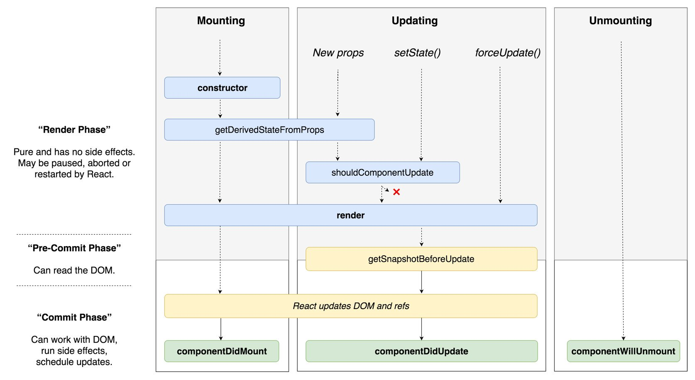
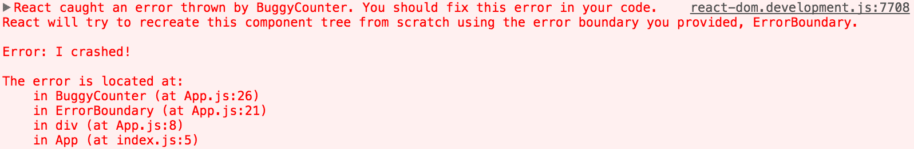

# Phỏng vấn ReactJS - Câu hỏi và trả lời

> Nguồn [React Interview Questions & Answers](https://github.com/sudheerj/reactjs-interview-questions).

> Tác giả [@SudheerJonna](https://twitter.com/SudheerJonna).

### Mục lục {#table-of-contents}

| STT | Câu hỏi                                                                                                                                                                                  |
| --- | ---------------------------------------------------------------------------------------------------------------------------------------------------------------------------------------- |
|     | **Core React**                                                                                                                                                                           |
| 1   | [React là gì?](#what-is-react)                                                                                                                                                           |
| 2   | [Những đặc trưng cơ bản của React?](#what-are-the-major-features-of-react)                                                                                                               |
| 3   | [JSX là gì?](#what-is-jsx)                                                                                                                                                               |
| 4   | [Phân biệt các thành phần Components, Elements và Instances?](#what-is-the-difference-between-components-elements-and-instances)                                                         |
| 5   | [Có bao nhiêu cách tạo ra component React?](#how-to-create-components-in-react)                                                                                                          |
| 6   | [Khi nào nên sử dụng Class components thay cho Function Components?](#when-to-use-a-class-component-over-a-function-component)                                                           |
| 7   | [Pure components là gì?](#what-are-pure-components)                                                                                                                                      |
| 8   | [State trong React là gì?](#what-is-state-in-react)                                                                                                                                      |
| 9   | [Props trong React là gì?](#what-are-props-in-react)                                                                                                                                     |
| 10  | [State và Props khác nhau như thế nào?](#what-is-the-difference-between-state-and-props)                                                                                                 |
| 11  | [Tại sao chúng ta không được trực tiếp thay đổi state?](#why-should-we-not-update-the-state-directly)                                                                                    |
| 12  | [Mục đích của hàm callback trong tham số của setState()?](#what-is-the-purpose-of-callback-function-as-an-argument-of-setState)                                                          |
| 13  | [Cho biết điểm khác biệt giữa việc xử lý sự kiện trong HTML và React?](#what-is-the-difference-between-html-and-react-event-handling)                                                    |
| 14  | [Làm thế nào để truyền phương thức hoặc xử lý sự kiện vào trong JSX callbacks?](#how-to-bind-methods-or-event-handlers-in-jsx-callbacks)                                                 |
| 15  | [Có những cách nào để truyền tham số vào hàm xử lý sự kiện hoặc callback?](#how-to-pass-a-parameter-to-an-event-handler-or-callback)                                                     |
| 16  | [Synthetic events trong ReactJS là gì?](#what-are-synthetic-events-in-react)                                                                                                             |
| 17  | [Biểu thức điều kiện nội tuyến (inline) là gì?](#what-is-inline-conditional-expressions)                                                                                                 |
| 18  | [Từ khóa "key" trong props là gì? và lợi ích của việc sử dụng nó trong mảng?](#what-are-key-props-and-what-is-the-benefit-of-using-them-in-arrays-of-elements)                           |
| 19  | [Cho biết tác dụng của refs?](#what-is-the-use-of-refs)                                                                                                                                  |
| 20  | [Có những cách nào để tạo ra refs?](#how-to-create-refs)                                                                                                                                 |
| 21  | [Refs fordwarding là gì?](#what-are-forward-refs)                                                                                                                                        |
| 22  | [Nên dùng callback refs hay finDOMNode()?](#which-is-preferred-option-with-in-callback-refs-and-finddomnode)                                                                             |
| 23  | [Tại sao string Refs không còn được sử dụng?](#why-are-string-refs-legacy)                                                                                                               |
| 24  | [Virtual DOM là gì?](#what-is-virtual-dom)                                                                                                                                               |
| 25  | [Virtual DOM hoạt động như thế nào?](#how-virtual-dom-works)                                                                                                                             |
| 26  | [Sự khác biệt giữa Shadow DOM và Virtual DOM là gì?](#what-is-the-difference-between-shadow-dom-and-virtual-dom)                                                                         |
| 27  | [React Fiber là gì?](#what-is-react-fiber)                                                                                                                                               |
| 28  | [Mục tiêu chính của của React Fiber là gì?](#what-is-the-main-goal-of-react-fiber)                                                                                                       |
| 29  | [Controlled component là gì?](#what-are-controlled-components)                                                                                                                           |
| 30  | [Uncontrolled components là gì?](#what-are-uncontrolled-components)                                                                                                                      |
| 31  | [createElement và cloneElement khác nhau như thế nào?](#what-is-the-difference-between-createelement-and-cloneelement)                                                                   |
| 32  | [Lifting State Up in React là gì?](#what-is-lifting-state-up-in-react)                                                                                                                   |
| 33  | [Các giai đoạn của component lifecycle khác nhau thế nào?](#what-are-the-different-phases-of-component-lifecycle)                                                                        |
| 34  | [Các phương thức lifecycle trong React là gì?](#what-are-the-lifecycle-methods-of-react)                                                                                                 |
| 35  | [Higher-Order components là gì?](#what-are-higher-order-components)                                                                                                                      |
| 36  | [Làm thế nào để tạo ra props proxy cho HOC component?](#how-to-create-props-proxy-for-hoc-component)                                                                                     |
| 37  | [Context là gì?](#what-is-context)                                                                                                                                                       |
| 38  | [Children prop là gì?](#what-is-children-prop)                                                                                                                                           |
| 39  | [Viết comments cho React như thế nào?](#how-to-write-comments-in-react)                                                                                                                  |
| 40  | [Mục đích của việc dùng hàm khởi tạo super với tham số props là gì?](#what-is-the-purpose-of-using-super-constructor-with-props-argument)                                                |
| 41  | [Reconciliation là gì?](#what-is-reconciliation)                                                                                                                                         |
| 42  | [Làm thế nào để gán giá trị cho state với key động?](#how-to-set-state-with-a-dynamic-key-name)                                                                                          |
| 43  | [Sai lầm thường gặp nào khiến hàm được thực thi mỗi khi component được render?](#what-would-be-the-common-mistake-of-function-being-called-every-time-the-component-renders)             |
| 44  | [Hàm lazy có hỗ trợ named exports hay không?](#is-lazy-function-supports-named-exports)                                                                                                  |
| 45  | [Vì sao React sử dụng className thay cho thuộc tính class?](#why-react-uses-classname-over-class-attribute)                                                                              |
| 46  | [Fragments là gì?](#what-are-fragments)                                                                                                                                                  |
| 47  | [Tại sao Fragments tốt hơn divs?](#why-fragments-are-better-than-container-divs)                                                                                                         |
| 48  | [Portals trong React là gì?](#what-are-portals-in-react)                                                                                                                                 |
| 49  | [Stateless components là gì?](#what-are-stateless-components)                                                                                                                            |
| 50  | [Stateful components là gì?](#what-are-stateful-components)                                                                                                                              |
| 51  | [Làm cách nào để áp dụng xác nhận đầu vào cho props?](#how-to-apply-validation-on-props-in-react)                                                                                        |
| 52  | [React có những lợi thế nào?](#what-are-the-advantages-of-react)                                                                                                                         |
| 53  | [React có những hạn chế nào?](#what-are-the-limitations-of-react)                                                                                                                        |
| 54  | [Error boundaries trong React v16 là gì?](#what-are-error-boundaries-in-react-v16)                                                                                                       |
| 55  | [Error boundaries ở React v15 hoạt động như thế nào?](#how-error-boundaries-handled-in-react-v15)                                                                                        |
| 56  | [Cách nào được khuyên dùng đề kiểm tra kiểu dữ liệu tĩnh?](#what-are-the-recommended-ways-for-static-type-checking)                                                                      |
| 57  | [Thư viện `react-dom` cung cấp những phương thức nào?](#what-is-the-use-of-react-dom-package)                                                                                            |
| 58  | [Mục đích của phương thức render trong `react-dom` là gì?](#what-is-the-purpose-of-render-method-of-react-dom)                                                                           |
| 59  | [ReactDOMServer là gì?](#what-is-reactdomserver)                                                                                                                                         |
| 60  | [Sử dụng innerHTML trong React như thế nào?](#how-to-use-innerhtml-in-react)                                                                                                             |
| 61  | [Đưa styles vào trong React như thế nào?](#how-to-use-styles-in-react)                                                                                                                   |
| 62  | [Xử lý sự kiện trong React có sự khác biệt nào?](#how-events-are-different-in-react)                                                                                                     |
| 63  | [Điều gì xảy ra khi dùng `setState()` bên trong constructor?](#what-will-happen-if-you-use-setstate-in-constructor)                                                                      |
| 64  | [Tác dụng của số thứ tự (keys) là gì?](#what-is-the-impact-of-indexes-as-keys)                                                                                                           |
| 65  | [Có thể sử dụng `setState()` trong `componentWillMount()` được không?](#is-it-good-to-use-setstate-in-componentwillmount-method)                                                         |
| 66  | [Nếu sử dụng props khi khởi tạo state thì chuyện gì sẽ xảy ra? ](#what-will-happen-if-you-use-props-in-initial-state)                                                                    |
| 67  | [Làm thế nào để render có điều kiện component?](#how-do-you-conditionally-render-components)                                                                                             |
| 68  | [Tại sao chúng ta phải cẩn thận khi sử dụng spreading với props trong DOM?](#why-we-need-to-be-careful-when-spreading-props-on-dom-elements)                                             |
| 69  | [Làm thế nào decorators trong React?](#how-you-use-decorators-in-react)                                                                                                                  |
| 70  | [Làm thế nào để ghi nhớ một component?](#how-do-you-memoize-a-component)                                                                                                                 |
| 71  | [Triển khai SSR như thế nào?](#how-you-implement-server-side-rendering-or-ssr)                                                                                                           |
| 72  | [Chuyển sang chế độ sản phẩm như thế nào?](#how-to-enable-production-mode-in-react)                                                                                                      |
| 73  | [CRA là gì và nó có những lợi ích nào?](#what-is-cra-and-its-benefits)                                                                                                                   |
| 74  | [Thứ tự của các _phương thức vòng đời_ của React ở gian đoạn mouting là gì?](#what-is-the-lifecycle-methods-order-in-mounting)                                                           |
| 75  | [Phương thức vòng đời nào sẽ bị loại bỏ ở React v16?](#what-are-the-lifecycle-methods-going-to-be-deprecated-in-react-v16)                                                               |
| 76  | [Mục đích của phương thức vòng đời `getDerivedStateFromProps()` là gì?](#what-is-the-purpose-of-getderivedstatefromprops-lifecycle-method)                                               |
| 77  | [Mục đích của phương thức vòng đời `getSnapshotBeforeUpdate()` là gì?](#what-is-the-purpose-of-getsnapshotbeforeupdate-lifecycle-method)                                                 |
| 78  | [Hooks sẽ thay thế cho kết xuất props hay Higher-Order Components?](#do-hooks-replace-render-props-and-higher-order-components)                                                          |
| 79  | [Nên đặt tên cho các component như thế nào?](#what-is-the-recommended-way-for-naming-components)                                                                                         |
| 80  | [Thứ tự các phương thức trong một component nên sắp xếp như thế nào?](#what-is-the-recommended-ordering-of-methods-in-component-class)                                                   |
| 81  | [Component chuyển đổi là gì?](#what-is-a-switching-component)                                                                                                                            |
| 82  | [Tại sao lại cần truyền hàm vào trong hàm `setState()`?](#why-we-need-to-pass-a-function-to-setstate)                                                                                    |
| 83  | [`strict mode` trong React là gì?](#what-is-strict-mode-in-react)                                                                                                                        |
| 84  | [React mixins là gì?](#what-are-react-mixins)                                                                                                                                            |
| 85  | [Tại sao `isMounted()` là một cách tiếp cận tồi và giải pháp thích hợp là gì?](#why-is-ismounted-an-anti-pattern-and-what-is-the-proper-solution)                                        |
| 86  | [Pointer Events hỗ trợ gì trong React?](#what-are-the-pointer-events-supported-in-react)                                                                                       |
| 87  | [Tại sao tên của component nên bắt đầu bằng chữ cái in hoa?](#why-should-component-names-start-with-capital-letter)                                                                           |
| 88  | [Các thuộc tính tùy biến trong DOM có được hỗ trợ ở React v16 không?](#are-custom-dom-attributes-supported-in-react-v16)                                                                                   |
| 89  | [Nêu những điểm khác nhau giữa constructor và getInitialState?](#what-is-the-difference-between-constructor-and-getinitialstate)                                                       |
| 90  | [Khi sử dụng class trong ES6, việc khai báo `super()` và `super(props)` có gì khác nhau?](#can-you-force-a-component-to-re-render-without-calling-setstate)                                                     |
| 91  | [What is the difference between super() and super(props) in React using ES6 classes?](#what-is-the-difference-between-super-and-superprops-in-react-using-es6-classes)                   |
| 92  | [Thực hiện lặp trong JSX như thế nào?](#how-to-loop-inside-jsx)                                                                                                                                       |
| 93  | [Đưa giá trị props vào giá trị của thuộc tính html như thế nào?](#how-do-you-access-props-in-attribute-quotes)                                                                                             |
| 94  | [Sử dụng proptype như thế nào với props là mảng có cấu trúc?](#what-is-react-proptype-array-with-shape)                                                                                                     |
| 95  | [Sử dụng điều kiện trong thuộc tính class như thế nào?](#how-to-conditionally-apply-class-attributes)                                                                                             |
| 96  | [React và ReactDom khác nhau ở những điểm nào?](#what-is-the-difference-between-react-and-reactdom)                                                                                 |
| 97  | [Tại sao ReactDOM lại nằm độc lập với React?](#why-reactdom-is-separated-from-react)                                                                                                           |
| 98  | [Sử dụng thẻ label trong React như thế nào?](#how-to-use-react-label-element)                                                                                                                       |
| 99  | [Làm thế nào để kết hợp được nhiều objects style inline?](#how-to-combine-multiple-inline-style-objects)                                                                                           |
| 100 | [Làm thể nào để tái kết xuất khi trình duyệt thay đổi kích thước?](#how-to-re-render-the-view-when-the-browser-is-resized)                                                                         |
| 101 | [Phương thức `setState()` và `replaceState()` khác nhau thế nào?](#what-is-the-difference-between-setstate-and-replacestate-methods)                                                   |
| 102 | [Làm thế nào để biết state thay đổi?](#how-to-listen-to-state-changes)                                                                                                                       |
| 103 | [Nên dùng cách gì để loại bỏ một phần từ của mảng nằm trong state?](#what-is-the-recommended-approach-of-removing-an-array-element-in-react-state)                           |
| 104 | [Có thể sử dụng React mà không cần phải kết xuất HTML không?](#is-it-possible-to-use-react-without-rendering-html)                                                                               |
| 105 | [Trích xuất ra chuỗi json theo định dạng với React như thế nào?](#how-to-pretty-print-json-with-react)                                                                                                             |
| 106 | [Tại sao không thể cập nhật props trong React?](#why-you-cant-update-props-in-react)                                                                                                              |
| 107 | [Làm thế nào để focus vào thẻ input khi loading trang?](#how-to-focus-an-input-element-on-page-load)                                                                                               |
| 108 | [Có những cách nào để cập nhật giá trị một objects trong state?](#what-are-the-possible-ways-of-updating-objects-in-state)                                                                     |
| 109 | [Tại sao nên sử dụng hàm thay vì object khi `setState()`?](#why-function-is-preferred-over-object-for-setstate)                                                                               |
| 110 | [Xem phiên bản của React khi chạy trên trình duyệt bằng cách nào?](#how-can-we-find-the-version-of-react-at-runtime-in-the-browser)                                                       |
| 111 | [Làm thế nào để sử dụng `create-react-app` cùng với polifills?](#what-are-the-approaches-to-include-polyfills-in-your-create-react-app)                                         |
| 112 | [Sử dụng https thay cho http với `create-react-app` như thế nào?](#how-to-use-https-instead-of-http-in-create-react-app)                                                                           |
| 113 | [Làm thế nào để tránh sử dụng đường dẫn liên quan khi import với `create-react-app`?](#how-to-avoid-using-relative-path-imports-in-create-react-app)                                                           |
| 114 | [Sử dụng Google Analytics trong React Router như thế nào?](#how-to-add-google-analytics-for-react-router)                                                                                           |
| 115 | [Làm thế nào để cập nhật component mỗi giây?](#how-to-update-a-component-every-second)                                                                                                       |
| 116 | [Sử dụng tiền tố vendor với style inline trong React như thế nào?](#how-do-you-apply-vendor-prefixes-to-inline-styles-in-react)                                                               |
| 117 | [Import và export component với ES6 trong React như thế nào?](#how-to-import-and-export-components-using-react-and-es6)                                                                     |
| 118 | [Đâu là ngoại lệ trong việc đặt tên React component?](#why-react-component-names-must-begin-with-a-capital-letter)                                                               |
| 119 | [Tại sao hàm khởi tạo (constructor) component chỉ được gọi 1 lần?](#why-is-a-component-constructor-called-only-once)                                                                                     |
| 120 | [Định nghĩa hằng số trong React như thế nào?](#how-to-define-constants-in-react)                                                                                                                   |
| 121 | [Làm thế nào để kích hoạt sự kiện click trong React?](#how-to-programmatically-trigger-click-event-in-react)                                                                           |
| 122 | [Có thể sử dụng async/await trong React được không? ](#is-it-possible-to-use-async-await-in-plain-react)                                                                                    |
| 123 | [Cấu trúc thư mục thông dụng của React như thế nào?](#what-are-the-common-folder-structures-for-react)                                                                                     |
| 124 | [Thư viện nào cho animation được dùng phổ biến?](#what-are-the-popular-packages-for-animation)                                                                                             |
| 125 | [Việc style theo module có lợi ích gì?](#what-is-the-benefit-of-styles-modules)                                                                                                         |
| 126 | [Công cụ linter (format code) nào phổ biến với React?](#what-are-the-popular-react-specific-linters)                                                                                             |
| 127 | [Gọi AJAX như thế nào và nên sử dụng trong phương thức vòng đời nào?](#how-to-make-ajax-call-and-in-which-component-lifecycle-methods-should-i-make-an-ajax-call) |
| 128 | [Thế nào là render props?](#what-are-render-props)                                                                                                                                         |
|     | **React Router**                                                                                                                                                                         |
| 129 | [React Router là gì?](#what-is-react-router)                                                                                                                                           |
| 130 | [React Router khác với những thư viện về history ra sao?](#how-react-router-is-different-from-history-library)                                                                               |
| 131 | [Có những component `<Router>` nào trong React Router v4?](#what-are-the-router-components-of-react-router-v4)                                                                              |
| 132 | [Mục đích của phương thức `push()` và `replace()` trong `history` là gì?](#what-is-the-purpose-of-push-and-replace-methods-of-history)                                                               |
| 133 | [Sử dụng React Router v4 để điều hướng như thế nào?](#how-do-you-programmatically-navigate-using-react-router-v4)                                                               |
| 134 | [Làm thế nào để lấy được tham số đầu vào trong query với React Router v4?](#how-to-get-query-parameters-in-react-router-v4)                                                                                        |
| 135 | [Bạn gặp phải cảnh báo “Router may have only one child element” khi nào?](#why-you-get-router-may-have-only-one-child-element-warning)                                                             |
| 136 | [Đưa tham số vào `history.push` trong React Router v4 như thế nào?](#how-to-pass-params-to-historypush-method-in-react-router-v4)                                                            |
| 137 | [Triển khai trang mặc định hoặc NotFound như thế nào?](#how-to-implement-default-or-notfound-page)                                                                                                 |
| 138 | [Lấy history trong React Router v4 như thế nào?](#how-to-get-history-on-react-router-v4)                                                                                                         |
| 139 | [Thực hiện tự động chuyển trang sau khi đăng nhập như thế nào?](#how-to-perform-automatic-redirect-after-login)                                                                                         |
|     | **React Internationalization**                                                                                                                                                           |
| 140 | [React Intl là gì?](#what-is-react-intl)                                                                                                                                               |
| 141 | [Các chức năng chính của React Intl là gì?](#what-are-the-main-features-of-react-intl)                                                                                                   |
| 142 | [Hai cách để định dạng trong React Intl là gì?](#what-are-the-two-ways-of-formatting-in-react-intl)                                                                                 |
| 143 | [Sử dụng để làm placeholders trong React Intl như thế nào?](#how-to-use-formattedmessage-as-placeholder-using-react-intl)                                                             |
| 144 | [Làm thế nào để định vị vị trí hiện tại với React Intl?](#how-to-access-current-locale-with-react-intl)                                                                                            |
| 145 | [Định dang ngày tháng với React Intl như thế nào?](#how-to-format-date-using-react-intl)                                                                                                             |
|     | **React Testing**                                                                                                                                                                        |
| 146 | [Kết xuất nông (Shallow Renderer) trong React Testing là gì?](#what-is-shallow-renderer-in-react-testing)                                                                                                 |
| 147 | [Thư viện TestRenderer trong React là gì?](#what-is-testrenderer-package-in-react)                                                                                                         |
| 148 | [Mục đích của thư viện ReactTestUtils là gì?](#what-is-the-purpose-of-reacttestutils-package)                                                                                         |
| 149 | [Jest là gì?](#what-is-jest)                                                                                                                                                           |
| 150 | [Lợi thế của Jest so với Jasmine là gì?](#what-are-the-advantages-of-jest-over-jasmine)                                                                                           |
| 151 | [Lấy ví dụ về kiểm thử với Jest?](#give-a-simple-example-of-jest-test-case)                                                                                                      |
|     | **React Redux**                                                                                                                                                                          |
| 152 | [Flux là gì?](#what-is-flux)                                                                                                                                                           |
| 153 | [Redux là gì?](#what-is-redux)                                                                                                                                                         |
| 154 | [Các nguyên tắc căn bản của Redux là gì?](#what-are-the-core-principles-of-redux)                                                                                                         |
| 155 | [Nhược điểm của Redux so với Flux là gì?](#what-are-the-downsides-of-redux-compared-to-flux)                                                                                   |
| 156 | [Điểm khác biệt cơ bản giữa `mapStateToProps()` và `mapDispatchToProps()` là gì?](#what-is-the-difference-between-mapstatetoprops-and-mapdispatchtoprops)                                     |
| 157 | [Có thể thực thi một action trong reducer được không?](#can-i-dispatch-an-action-in-reducer)                                                                                                             |
| 158 | [Truy cập vào store của Redux bên ngoài component như thế nào?](#how-to-access-redux-store-outside-a-component)                                                                                         |
| 159 | [Nhược điểm của mô hình MVW là gì?](#what-are-the-drawbacks-of-mvw-pattern)                                                                                                          |
| 160 | [Những điểm tương đồng của Redux và RxJS là gì?](#are-there-any-similarities-between-redux-and-rxjs)                                                                                 |
| 161 | [Thực thi một action khi tải trang như thế nào?](#how-to-dispatch-an-action-on-load)                                                                                                                 |
| 162 | [Sử dụng `connect()` trong React Redux như thế nào?](#how-to-use-connect-from-react-redux)                                                                                                             |
| 163 | [Đặt lại state với Redux như thế nào?](#how-to-reset-state-in-redux)                                                                                                                             |
| 164 | [Tác dụng của ký tự `@` trong Redux connect decorator là gì?](#whats-the-purpose-of-at-symbol-in-the-redux-connect-decorator)                                                         |
| 165 | [React Context và React Redux khác nhau như thế nào?](#what-is-the-difference-between-react-context-and-react-redux)                                                           |
| 166 | [Tại sao hàm thay đổi state trong Redux được gọi là Reducers?](#why-are-redux-state-functions-called-reducers)                                                                                         |
| 167 | [Thực hiện AJAX request trong Redux như thế nào?](#how-to-make-ajax-request-in-redux)                                                                                                                 |
| 168 | [Tôi có nên giữ tất cả state của component trong Redux store?](#should-i-keep-all-components-state-in-redux-store)                                                                                |
| 169 | [Cách thích hợp để truy cập vào store trong Redux là gì?](#what-is-the-proper-way-to-access-redux-store)                                                                                           |
| 170 | [Trong React Redux, component và container khác nhau thế nào?](#what-is-the-difference-between-component-and-container-in-react-redux)                                         |
| 171 | [Mục đích của hằng số trong Redux là gì?](#what-is-the-purpose-of-the-constants-in-redux)                                                                                        |
| 172 | [Có những cách nào để viết hàm `mapDispatchToProps()`?](#what-are-the-different-ways-to-write-mapdispatchtoprops)                                                                   |
| 173 | [Cách dùng của tham số ownProps trong `mapStateToProps()` và `mapDispatchToProps()`?](#what-is-the-use-of-the-ownprops-parameter-in-mapstatetoprops-and-mapdispatchtoprops)         |
| 174 | [Cấu trúc thư mục cấp cao cho một dự án Redux như thế nào?](#how-to-structure-redux-top-level-directories)                                                                                           |
| 175 | [redux-saga là gì?](#what-is-redux-saga)                                                                                                                                               |
| 176 | [Metal model trong Redux Saga là gì?](#what-is-the-mental-model-of-redux-saga)                                                                                                       |
| 177 | [`call()` và `put()` trong redux-saga khác nhau ra sao?](#what-are-the-differences-between-call-and-put-in-redux-saga)                                                              |
| 178 | [Redux Thunk là gì?](#what-is-redux-thunk)                                                                                                                                             |
| 179 | [redux-saga và redux-thunk khác nhau như thế nào?](#what-are-the-differences-between-redux-saga-and-redux-thunk)                                                              |
| 180 | [Redux DevTools là gì?](#what-is-redux-devtools)                                                                                                                                       |
| 181 | [Redux DevTools có những chức năng nào?](#what-are-the-features-of-redux-devtools)                                                                                                     |
| 182 | [Redux selectors là gì và sử dụng khi nào?](#what-are-redux-selectors-and-why-to-use-them)                                                                                           |
| 183 | [Redux Form là gì?](#what-is-redux-form)                                                                                                                                               |
| 184 | [Các chức năng chính của Redux Form là gì?](#what-are-the-main-features-of-redux-form)                                                                                                   |
| 185 | [Làm thế nào để thêm các chương trình trung gian vào Redux?](#how-to-add-multiple-middlewares-to-redux)                                                                                                   |
| 186 | [Cài đặt giá trị khởi tạo cho state trong Redux như thế nào?](#how-to-set-initial-state-in-redux)                                                                                                                 |
| 187 | [Relay khác với Redux như thế nào?](#how-relay-is-different-from-redux)                                                                                                                 |
|     | **React Native**                                                                                                                                                                         |
| 188 | [What is the difference between React Native and React?](#what-is-the-difference-between-react-native-and-react)                                                                         |
| 189 | [How to test React Native apps?](#how-to-test-react-native-apps)                                                                                                                         |
| 190 | [How to do logging in React Native?](#how-to-do-logging-in-react-native)                                                                                                                 |
| 191 | [How to debug your React Native?](#how-to-debug-your-react-native)                                                                                                                       |
|     | **React supported libraries and Integration**                                                                                                                                            |
| 192 | [reselect là gì và nó hoạt động thế nào?](#what-is-reselect-and-how-it-works)                                                                                                                 |
| 193 | [Flow là gì?](#what-is-flow)                                                                                                                                                           |
| 194 | [Flow và PropTypes có gì khác nhau?](#what-is-the-difference-between-flow-and-proptypes)                                                                                 |
| 195 | [Sử dụng icon của Font Awesome trong React như thế nào?](#how-to-use-font-awesome-icons-in-react)                                                                                                       |
| 196 | [React Dev Tools là gì?](#what-is-react-dev-tools)                                                                                                                                     |
| 197 | [Tại sao DevTools không dùng được với tập tin local?](#why-is-devtools-not-loading-in-chrome-for-local-files)                                                                         |
| 198 | [Sử dụng Polymer trong React như thế nào?](#how-to-use-polymer-in-react)                                                                                                                             |
| 199 | [React có những điểm mạnh nào so với Vue.js?](#what-are-the-advantages-of-react-over-vuejs)                                                                                            |
| 200 | [Những điểm khác biệt giữa React và Angular?](#what-is-the-difference-between-react-and-angular)                                                                                   |
| 201 | [Tại sao tab React không hiển thị trong DevTools?](#why-react-tab-is-not-showing-up-in-devtools)                                                                                             |
| 202 | [Styled Components là gì?](#what-are-styled-components)                                                                                                                               |
| 203 | [Lấy ví dụ về Styled Components?](#give-an-example-of-styled-components)                                                                                                           |
| 204 | [Relay là gì?](#what-is-relay)                                                                                                                                                         |
| 205 | [Sử dụng TypeScript với `create-react-app` như thế nào?](#how-to-use-typescript-in-create-react-app-application)                                                                         |
|     | **Miscellaneous**                                                                                                                                                                        |
| 206 | [Chức năng chính của thư viện Reselect là gì?](#what-are-the-main-features-of-reselect-library)                                                                                       |
| 207 | [Lấy một ví dụ về cách sử dụng Reselect?](#give-an-example-of-reselect-usage)                                                                                                                 |
| 208 | [Action trong Redux là gì?](#what-is-an-action-in-redux)                                                                                                                               |
| 209 | [Các đối tượng tĩnh (static object) có hoạt động với các lớp (classes) của ES6 trong React không?](#does-the-statics-object-work-with-es6-classes-in-react)                                                                       |
| 210 | [Redux chỉ hoạt động được với React đúng ko?](#can-redux-only-be-used-with-react)                                                                                                                 |
| 211 | [Có cần phải có một công cụ biên dịch cụ thể để sử dụng Redux ko?](#do-you-need-to-have-a-particular-build-tool-to-use-redux)                                                                   |
| 212 | [Giá trị khởi tạo (initialvalues) của Redux Form được cập nhật từ state như thế nào?](#how-redux-form-initialvalues-get-updated-from-state)                                                                             |
| 213 | [How React PropTypes allow different type for one prop?](#how-react-proptypes-allow-different-types-for-one-prop)                                                                        |
| 214 | [Can I import an SVG file as react component?](#can-i-import-an-svg-file-as-react-component)                                                                                             |
| 215 | [Why are inline ref callbacks or functions not recommended?](#why-are-inline-ref-callbacks-or-functions-not-recommended)                                                                 |
| 216 | [What is render hijacking in React?](#what-is-render-hijacking-in-react)                                                                                                                 |
| 217 | [What are HOC factory implementations?](#what-are-hoc-factory-implementations)                                                                                                           |
| 218 | [How to pass numbers to React component?](#how-to-pass-numbers-to-react-component)                                                                                                       |
| 219 | [Do I need to keep all my state into Redux? Should I ever use react internal state?](#do-i-need-to-keep-all-my-state-into-redux-should-i-ever-use-react-internal-state)                  |
| 220 | [What is the purpose of registerServiceWorker in React?](#what-is-the-purpose-of-registerserviceworker-in-react)                                                                         |
| 221 | [What is React memo function?](#what-is-react-memo-function)                                                                                                                             |
| 222 | [What is React lazy function?](#what-is-react-lazy-function)                                                                                                                             |
| 223 | [How to prevent unnecessary updates using setState?](#how-to-prevent-unnecessary-updates-using-setstate)                                                                                 |
| 224 | [How do you render Array, Strings and Numbers in React 16 Version?](#how-do-you-render-array-strings-and-numbers-in-react-16-version)                                                    |
| 225 | [How to use class field declarations syntax in React classes?](#how-to-use-class-field-declarations-syntax-in-react-classes)                                                             |
| 226 | [What are hooks?](#what-are-hooks)                                                                                                                                                       |
| 227 | [What are the rules needs to follow for hooks?](#what-are-the-rules-needs-to-follow-for-hooks)                                                                                           |
| 228 | [How to ensure hooks followed the rules in your project?](#how-to-ensure-hooks-followed-the-rules-in-your-project)                                                                       |
| 229 | [What are the differences between Flux and Redux?](#what-are-the-differences-between-flux-and-redux)                                                                                     |
| 230 | [What are the benefits of React Router V4?](#what-are-the-benefits-of-react-router-v4)                                                                                                   |
| 231 | [Can you describe about componentDidCatch lifecycle method signature?](#can-you-describe-about-componentdidcatch-lifecycle-method-signature)                                             |
| 232 | [In which scenarios error boundaries do not catch errors?](#in-which-scenarios-error-boundaries-do-not-catch-errors)                                                                     |
| 233 | [Why do not you need error boundaries for event handlers?](#why-do-not-you-need-error-boundaries-for-event-handlers)                                                                     |
| 234 | [What is the difference between try cath block and error boundaries?](#what-is-the-difference-between-try-catch-block-and-error-boundaries)                                              |
| 235 | [What is the behavior of uncaught errors in react 16?](#what-is-the-behavior-of-uncaught-errors-in-react-16)                                                                             |
| 236 | [What is the proper placement for error boundaries?](#what-is-the-proper-placement-for-error-boundaries)                                                                                 |
| 237 | [What is the benefit of component stack trace from error boundary?](#what-is-the-benefit-of-component-stack-trace-from-error-boundary)                                                   |
| 238 | [What is the required method to be defined for a class component?](#what-is-the-required-method-to-be-defined-for-a-class-component)                                                     |
| 239 | [What are the possible return types of render method?](#what-are-the-possible-return-types-of-render-method)                                                                             |
| 240 | [What is the main purpose of constructor?](#what-is-the-main-purpose-of-constructor)                                                                                                     |
| 241 | [Is it mandatory to define constructor for React component?](#is-it-mandatory-to-define-constructor-for-react-component)                                                                 |
| 242 | [What are default props?](#what-are-default-props)                                                                                                                                       |
| 243 | [Why should not call setState in componentWillUnmount?](#why-should-not-call-setstate-in-componentwillunmount)                                                                           |
| 244 | [What is the purpose of getDerivedStateFromError?](#what-is-the-purpose-of-getderivedstatefromerror)                                                                                     |
| 245 | [What is the methods order when component re-rendered?](#what-is-the-methods-order-when-component-re-rendered)                                                                           |
| 246 | [What are the methods invoked during error handling?](#what-are-the-methods-invoked-during-error-handling)                                                                               |
| 247 | [What is the purpose of displayName class property?](#what-is-the-purpose-of-displayname-class-property)                                                                                 |
| 248 | [What is the browser support for react applications?](#what-is-the-browser-support-for-react-applications)                                                                               |
| 249 | [What is the purpose of unmountComponentAtNode method?](#what-is-the-purpose-of-unmountcomponentatnode-method)                                                                           |
| 250 | [What is code-splitting?](#what-is-code-splitting)                                                                                                                                       |
| 251 | [What is the benefit of strict mode?](#what-is-the-benefit-of-strict-mode)                                                                                                               |
| 252 | [What are Keyed Fragments?](#what-are-keyed-fragments)                                                                                                                                   |
| 253 | [Does React support all HTML attributes?](#does-react-support-all-html-attributes)                                                                                                       |
| 254 | [What are the limitations with HOCs?](#what-are-the-limitations-with-hocs)                                                                                                               |
| 255 | [How to debug forwardRefs in DevTools?](#how-to-debug-forwardrefs-in-devtools)                                                                                                           |
| 256 | [When component props defaults to true?](#when-component-props-defaults-to-true)                                                                                                         |
| 257 | [What is NextJS and major features of it?](#what-is-nextjs-and-major-features-of-it)                                                                                                     |
| 258 | [How do you pass an event handler to a component?](#how-do-you-pass-an-event-handler-to-a-component)                                                                                     |
| 259 | [Is it good to use arrow functions in render methods?](#is-it-good-to-use-arrow-functions-in-render-methods)                                                                             |
| 260 | [How to prevent a function from being called multiple times?](#how-to-prevent-a-function-from-being-called-multiple-times)                                                               |
| 261 | [How JSX prevents Injection Attacks?](#how-jsx-prevents-injection-attacks)                                                                                                               |
| 262 | [How do you update rendered elements?](#how-do-you-update-rendered-elements)                                                                                                             |
| 263 | [How do you say that props are read only?](#how-do-you-say-that-props-are-read-only)                                                                                                     |
| 264 | [How do you say that state updates are merged?](#how-do-you-say-that-state-updates-are-merged)                                                                                           |
| 265 | [How do you pass arguments to an event handler?](#how-do-you-pass-arguments-to-an-event-handler)                                                                                         |
| 266 | [How to prevent component from rendering?](#how-to-prevent-component-from-rendering)                                                                                                     |
| 267 | [What are the conditions to safely use the index as a key?](#what-are-the-conditions-to-safely-use-the-index-as-a-key)                                                                   |
| 268 | [Is it keys should be globally unique?](#is-it-keys-should-be-globally-unique)                                                                                                           |
| 269 | [What is the popular choice for form handling?](#what-is-the-popular-choice-for-form-handling)                                                                                           |
| 270 | [What are the advantages of formik over redux form library?](#what-are-the-advantages-of-formik-over-redux-form-library)                                                                 |
| 271 | [Why do you not required to use inheritance?](#why-do-you-not-required-to-use-inheritance)                                                                                               |
| 272 | [Can I use web components in react application?](#can-i-use-web-components-in-react-application)                                                                                         |
| 273 | [What is dynamic import?](#what-is-dynamic-import)                                                                                                                                       |
| 274 | [What are loadable components?](#what-are-loadable-components)                                                                                                                           |
| 275 | [What is suspense component?](#what-is-suspense-component)                                                                                                                               |
| 276 | [What is route based code splitting?](#what-is-route-based-code-splitting)                                                                                                               |
| 277 | [Give an example on How to use context?](#give-an-example-on-how-to-use-context)                                                                                                         |
| 278 | [What is the purpose of default value in context?](#what-is-the-purpose-of-default-value-in-context)                                                                                     |
| 279 | [How do you use contextType?](#how-do-you-use-contexttype)                                                                                                                               |
| 280 | [What is a consumer?](#what-is-a-consumer)                                                                                                                                               |
| 281 | [How do you solve performance corner cases while using context?](#how-do-you-solve-performance-corner-cases-while-using-context)                                                         |
| 282 | [What is the purpose of forward ref in HOCs?](#what-is-the-purpose-of-forward-ref-in-hocs)                                                                                               |
| 283 | [Is it ref argument available for all functions or class components?](#is-it-ref-argument-available-for-all-functions-or-class-components)                                               |
| 284 | [Why do you need additional care for component libraries while using forward refs?](#why-do-you-need-additional-care-for-component-libraries-while-using-forward-refs)                   |
| 285 | [How to create react class components without ES6?](#how-to-create-react-class-components-without-es6)                                                                                   |
| 286 | [Is it possible to use react without JSX?](#is-it-possible-to-use-react-without-jsx)                                                                                                     |
| 287 | [What is diffing algorithm?](#what-is-diffing-algorithm)                                                                                                                                 |
| 288 | [What are the rules covered by diffing algorithm?](#what-are-the-rules-covered-by-diffing-algorithm)                                                                                     |
| 289 | [When do you need to use refs?](#when-do-you-need-to-use-refs)                                                                                                                           |
| 290 | [Is it prop must be named as render for render props?](#is-it-prop-must-be-named-as-render-for-render-props)                                                                             |
| 291 | [What are the problems of using render props with pure components?](#what-are-the-problems-of-using-render-props-with-pure-components)                                                   |
| 292 | [How do you create HOC using render props?](#how-do-you-create-hoc-using-render-props)                                                                                                   |
| 293 | [What is windowing technique?](#what-is-windowing-technique)                                                                                                                             |
| 294 | [How do you print falsy values in JSX?](#how-do-you-print-falsy-values-in-jsx)                                                                                                           |
| 295 | [What is the typical use case of portals?](#what-is-the-typical-use-case-of-portals?)                                                                                                    |
| 296 | [How do you set default value for uncontrolled component?](#how-do-you-set-default-value-for-uncontrolled-component)                                                                     |
| 297 | [What is your favorite React stack?](#what-is-your-favorite-react-stack)                                                                                                                 |
| 298 | [What is the difference between Real DOM and Virtual DOM?](#what-is-the-difference-between-real-dom-and-virtual-dom)                                                                     |
| 299 | [How to add Bootstrap to a react application?](#how-to-add-bootstrap-to-react-application)                                                                                               |
| 300 | [Can you list down top websites or applications using react as front end framework?](#can-you-list-down-top-websites-or-applications-using-react-as-front-end-framework)                 |
| 301 | [Is it recommended to use CSS In JS technique in React?](#is-it-recommended-to-use-css-in-js-technique-in-react)                                                                         |
| 302 | [Do I need to rewrite all my class components with hooks?](#do-i-need-to-rewrite-all-my-class-components-with-hooks)                                                                     |
| 303 | [How to fetch data with React Hooks?](#how-to-fetch-data-with-react-hooks)                                                                                                               |
| 304 | [Is Hooks cover all use cases for classes?](#is-hooks-cover-all-use-cases-for-classes)                                                                                                   |
| 305 | [What is the stable release for hooks support?](#what-is-the-stable-release-for-hooks-support)                                                                                           |
| 306 | [Why do we use array destructuring (square brackets notation) in useState?](#why-do-we-use-array-destructuring-square-brackets-notation-in-usestate)                                     |
| 307 | [What are the sources used for introducing hooks?](#what-are-the-sources-used-for-introducing-hooks)                                                                                     |
| 308 | [How do you access imperative API of web components?](#how-do-you-access-imperative-api-of-web-components)                                                                               |
| 309 | [What is formik?](#what-is-formik)                                                                                                                                                       |
| 310 | [What are typical middleware choices for handling asynchronous calls in Redux?](#what-are-typical-middleware-choices-for-handling-asynchronous-calls-in-redux)                           |
| 311 | [Is browsers understand JSX code?](#is-browsers-understand-jsx-code)                                                                                                                     |
| 312 | [Describe about data flow in react?](#describe-about-data-flow-in-react)                                                                                                                 |
| 313 | [What is react scripts?](#what-is-react-scripts)                                                                                                                                         |
| 314 | [What are the features of create react app?](#what-are-the-features-of-create-react-app)                                                                                                 |
| 315 | [What is the purpose of renderToNodeStream method?](#what-is-the-purpose-of-rendertonodestream-method)                                                                                   |
| 316 | [What is MobX?](#what-is-mobx)                                                                                                                                                           |
| 317 | [What are the differences between Redux and MobX?](#what-are-the-differences-between-redux-and-mobx)                                                                                     |
| 318 | [Should I learn ES6 before learning ReactJS?](#should-i-learn-es6-before-learning-reactjs)                                                                                               |
| 319 | [What is Concurrent Rendering?](#what-is-concurrent-rendering)                                                                                                                           |
| 320 | [What is the difference between async mode and concurrent mode?](#what-is-the-difference-between-async-mode-and-concurrent-mode)                                                         |
| 321 | [Can I use javascript urls in react16.9?](#can-i-use-javascript-urls-in-react16.9)                                                                                                       |
| 322 | [What is the purpose of eslint plugin for hooks?](#what-is-the-purpose-of-eslint-plugin-for-hooks)                                                                                       |
| 323 | [What is the difference between Imperative and Declarative in React?](#what-is-the-difference-between-imperative-and-declarative-in-react)                                               |
| 324 | (#) ?                                                                                                                                                                                    |

## Core React

1. ### React là gì? {#what-is-react}

   React là một **thư viện JavaScript mã nguồn mở về front-end** sử dụng để xây dựng giao diện người dùng đặc biệt là dành cho các ứng dụng đơn trang (SPA Single-page Application). React giúp xây dựng tầng Views của các ứng dụng web cũng như mobile. Được tạo ra bởi Jordan Walke, một kỹ sư phần mềm làm việc tại Facebook. React được sử dụng lần đầu tiên trên Facebook năm 2011 và trên Instagram năm 2012.

   **[⬆ Mục lục](#table-of-contents)**

2. ### Những đặc trưng cơ bản của React? {#what-are-the-major-features-of-react}

   Những đặc trưng cơ bản của React là:

   - Sử dụng **VirtualDOM** thay cho RealDOM giúp tăng hiệu năng của ứng dụng.
   - Hỗ trợ **server-side rendering**.
   - Sử dụng **One way data binding**.
   - Sử dụng các UI components có thể **tái sử dụng/tổ hợp**.

   **[⬆ Mục lục](#table-of-contents)**

3. ### JSX là gì? {#what-is-JSX}

   _JSX_ là một cú pháp mở rộng cho JavaScript (ECMAScript), có dạng gần giống như XML (JSX = JavaScript + XML). Cơ bản thì JSX cung cấp cú pháp thân thiện cho hàm `React.createElement()`, giúp chúng ta code ReactJS bằng cú pháp của XML (thay vì JavaScript), Các thành phần của XML sẽ được chuyển đổi thành các tham số truyền vào hàm `React.createElement()`.

   Ví dụ dưới đây sẽ cho thấy tại sao nên dùng JSX

   ```jsx
   class App extends React.Component {
     render() {
       return (
         <div>
           <h1>{'Welcome to React world!'}</h1>
         </div>
       );
     }
   }
   ```

   ```js
   React.createElement(App, null, React.createElement('div', null, React.createElement('h1', null, 'Welcome to React world!')));
   ```

   **[⬆ Mục lục](#table-of-contents)**

4. ### Phân biệt các thành phần Components, Elements và Instances? {#what-is-the-difference-between-components-elements-and-instances}

   Một _Element_ là một object mô tả, đại diện cho những gì bạn muốn thấy trên màn hình, có thể là một DOM node hoặc những components khác. _Elements_ có thể chứa các _Elements_ khác trong props của mình. Một khi element được tạo ra, nó sẽ không bao giờ bị thay đổi (mutated).

   Chú ý ở đây chỉ dùng từ đại diện, element không phải là instance của component, nó ko thực sự là những gì bạn sẽ nhìn thấy trên màn hình, nó đơn giản là một object đại diện cho component instance được tạo ra. Một object với các thuộc tính như _key_, _props_, _ref_ và _type_

   Ví dụ về object đại diện của React Element như sau:

   ```js
   const element = React.createElement('div', { id: 'login-btn' }, 'Login');
   ```

   Hàm `React.createElement()` bên trên sẽ trả về một object như sau:

   ```
   {
     type: 'div',
     props: {
       children: 'Login',
       id: 'login-btn'
     }
   }
   ```

   Và cuối cùng sẽ trả về một DOM node bằng việc sử dụng `ReactDOM.render()`:

   ```html
   <div id="login-btn">Login</div>
   ```

   Trong khi đó, **Components** là các khối xây dựng lên React. Nó có thể là một class với phương thức `render()`. Hoặc, đơn giản hơn, có thể định nghĩa dưới dạng function. Trong cả hai trường hợp, nó tiếp nhận các giá trị đầu vào làm próp, và trả về React element hay JSX tree:

   ```js
   const Button = ({ onLogin }) => (
     <div id={'login-btn'} onClick={onLogin}>
       Login
     </div>
   );
   ```

   JSX biên dịch thành hàm `React.createElement()`:

   ```js
   const Button = ({ onLogin }) => React.createElement('div', { id: 'login-btn', onClick: onLogin }, 'Login');
   ```

   Tham khảo thêm tại:

   [React Components, Elements, and Instances](https://reactjs.org/blog/2015/12/18/react-components-elements-and-instances.html).

   [React Elements vs React Components](https://tylermcginnis.com/react-elements-vs-react-components).

   **[⬆ Mục lục](#table-of-contents)**

5. ### Có bao nhiêu cách tạo ra component React? {#how-to-create-components-in-react}

   Có 2 cách để tạo nên một component

   1. **Function Components:** Đây là cách đơn giản nhất. Thuần túy sử dụng hàm trong JavaScript với props là tham số đầu tiên và trả về React elements:

      ```jsx
      function Greeting({ message }) {
        return <h1>{`Hello, ${message}`}</h1>;
      }
      ```

   2. **Class Components:** Bạn có thể sử dụng class trong ES6 để định nghĩa một component. Component ở trên có thể sử dụng class để khai báo như sau:

      ```jsx
      class Greeting extends React.Component {
        render() {
          return <h1>{`Hello, ${this.props.message}`}</h1>;
        }
      }
      ```

   **[⬆ Mục lục](#table-of-contents)**

6. ### Khi nào nên sử dụng Class components thay cho Function Components? {#when-to-use-a-class-component-over-a-function-component}

   Sử dụng Class components trong trường hợp component cần có _state hoặc các phương thức lifecycle_, nếu không hãy sử dụng Function components.

   _Tuy nhiên, từ phiên bản React 16.8, với sự bổ sung của Hooks, chúng ta đã có thể sử dụng state, các phương thức lifecycle cũng như các tính năng chỉ có ở Class components trong Function components._

   **[⬆ Mục lục](#table-of-contents)**

7. ### Pure components là gì? {#what-are-pure-components}

   _`React.PureComponent`_ hoàn toàn giống với _`React.Component`_ ngoại từ việc nó tự xử lý phương thức `shouldComponentUpdate()`. Khi props hoặc state thay đổi, _PureComponent_ sẽ thực hiện một phép so sánh nông (shallow comparison) đối với cả props và state. Mặt khác _Component_ sẽ không so sánh props và state của trước và sau thay đổi, mà sẽ mặc định render lại bất cứ khi nào `shouldComponentUpdate` được gọi.

   Tiền đề của _`React.PureComponent`_ là một phiên bản có hiệu suất cao hơn Component. Tại sao?
   Trước hết hãy tìm hiểu So sánh nông (Shallow Comparion) là gì? Nó là phép so sánh giữa state và nextState, cũng như props và nextProps, tuy nhiên chỉ so sánh value của các key của 2 input, ko tiếp tục so sánh đến các nhánh dưới nếu value là object, array.

   Trong một dự án bình thường, cây component có thể rất phức tạp, Shallow comparion lại là một hoạt động vô cùng rẻ tiền, rẻ hơn so với chi phí deep comparion và rẻ hơn rất nhiều so với chi phí render lại từng component con trong tree. Nhờ đó perfomance UI được cải thiện.

   **[⬆ Mục lục](#table-of-contents)**

8. ### State trong React là gì? {#what-is-state-in-react}

   _State_ của một component là một object chứa một số thông tin có thể thay đổi trong suốt vòng đời (lifecycle) của component. Chúng ta luôn phải giữ cho state đơn giản nhất có thể và giữ ở mức tối thiếu các component phụ thuộc vào state (stateful components). Ví dụ

   ```jsx
   class User extends React.Component {
     constructor(props) {
       super(props);

       this.state = {
         message: 'Welcome to React world',
       };
     }

     render() {
       return (
         <div>
           <h1>{this.state.message}</h1>
         </div>
       );
     }
   }
   ```

   

   State tương tụ như props, nhưng nó là riêng tư và được component toàn quyền kiếm soát. Tức là, state không thể truy cập bởi bất cứ component nào khác ngoài component sở hữu nó.

   **[⬆ Mục lục](#table-of-contents)**

9. ### Props trong React là gì? {#what-are-props-in-react}

   _Props_ là những giá trị đầu vào của components. Chúng là những giá trị đơn lẻ hoặc những object chứa những giá trị truyền vào trong components bằng cách sử dụng cách đặt tên tương tự các thuộc tình của HTML. Chúng là những dữ liệu được truyền từ component cha sang component con.

   Mục đích chính của props trong React là cung cấp chức năng của component như sau:

   1. Truyền dữ liệu cho component.
   2. Kích hoạt thay đổi state.
   3. Có thể sử dụng `this.props.reactProp` bên trong phương thức `render()` của component.

   Ví dụ, hãy tạo một element với thuộc tính `reactProp`:

   ```jsx
   <Element reactProp={'1'} />
   ```

   Thuộc tính `reactProp` này (hoặc bất cứ cái tên nào) sẽ trở thành một thuộc tính gắn với props của component.

   ```
   props.reactProp
   ```

   **[⬆ Mục lục](#table-of-contents)**

10. ### State và Props khác nhau như thế nào? {#what-is-the-difference-between-state-and-props}

    _props_ and _state_ đều là JavaScript objects. Mặc dù cả 2 đều chứa thông tin ảnh hưởng đến đầu ra của hàm render, nhưng chúng khác nhau về chức năng đối với component. Props truyền vào component tương tự như tham số của một hàm trong khi state được quản lý trong component tương tự như các biến được khai báo bên trong hàm.

    **[⬆ Mục lục](#table-of-contents)**

11. ### Tại sao chúng ta không được trực tiếp thay đổi state? {#why-should-we-not-update-the-state-directly}

    Nếu chúng ta trực tiếp thay đổi state thì component sẽ không được render lại.

    ```js
    // Sai
    this.state.message = 'Hello world';
    ```

    Thay vào đó phải sử dụng phương thức `setState()`. Nó sẽ cập nhật state của component. Khi state thay đổi, component sẽ được render lại.

    ```js
    // Đúng
    this.setState({ message: 'Hello World' });
    ```

    **Ghi chú:** Có thể trực tiếp gán giá trị cho state trong _constructor_ (hàm khởi tạo) hoặc sử dụng cú pháp khai báo mới nhất trong class của JavaScript.

    **[⬆ Mục lục](#table-of-contents)**

12. ### Mục đích của hàm callback trong tham số của setState()? {#what-is-the-purpose-of-callback-function-as-an-argument-of-setState}

    Hàm callback trong tham số sẽ chạy sau khi setState kết thúc và component đã được render lại. Trong trường hợp `setState()` là **asynchronous** (bất đồng bộ) hàm callback sẽ dùng cho những hành động sau đó.

    **Ghi chú:** Nên sử dụng các phương thức lifecycle thay vì dùng callback.

    ```js
    setState({ name: 'John' }, () => console.log('The name has updated and component re-rendered'));
    ```

    **[⬆ Mục lục](#table-of-contents)**

13. ### Cho biết điểm khác biệt giữa việc xử lý sự kiện trong HTML và React {#what-is-the-difference-between-html-and-react-event-handling}

    1. Với HTML, tên sự kiện phải viết _thường_ (_lowercase_):

       ```html
       <button onclick="activateLasers()"></button>
       ```

       Trong khi với React có thể sử dụng _camelCase_:

       ```html
       <button onClick="{activateLasers}"></button>
       ```

    2. Với HTML, có trên trả về `false` để bỏ qua hành động mặc định:

       ```html
       <a href="#" onclick='console.log("The link was clicked."); return false;' />
       ```

       Trong khi với React buộc phải sử dụng `preventDefault()`:

       ```js
       function handleClick(event) {
         event.preventDefault();
         console.log('The link was clicked.');
       }
       ```

    3. Với HTML, cần gọi hàm bằng cách nối thêm `()`
       Trong khi với React không được thêm `()` vào tên hàm. (tham khảo hàm activateLasers ở ví dụ 1)

    **[⬆ Mục lục](#table-of-contents)**

14. ### Làm thế nào để gán phương thức hoặc xử lý sự kiện vào trong JSX callbacks? {#how-to-bind-methods-or-event-handlers-in-jsx-callbacks}

    Có 3 cách như sau:

    1. **Gán trong in Constructor:** Với các class trong JavaScript, các phương thức không được gán mặc định. Tương tự đối với các hàm xử lý sự kiện. Và thường là chúng sẽ được gán trong hàm constructor.

       ```jsx
       class Component extends React.Componenet {
         constructor(props) {
           super(props);
           this.handleClick = this.handleClick.bind(this);
         }

         handleClick() {
           // ...
         }
       }
       ```

    2. **Public class fields syntax:** Nếu bạn không thích sử dụng `bind`, có thể thay bằng _public class fields syntax_.

       ```jsx
       handleClick = () => {
         console.log('this is:', this);
       };
       ```

       ```jsx
       <button onClick={this.handleClick}>{'Click me'}</button>
       ```

    3. **Arrow functions in callbacks:** Có thể trực tiếp sử dụng _arrow functions_.

       ```jsx
       <button onClick={(event) => this.handleClick(event)}>{'Click me'}</button>
       ```

    **Note:** Nếu callback truyền vào qua props từ component cha đến componentcon, components con có thể thực hiện nhiều lần render. Trong trường hợp nsy, để tránh ảnh hướng tới performance, nên sử dụng `.bind()` hoặc _public class fields syntax_.

    **[⬆ Mục lục](#table-of-contents)**

15. ### Có những cách nào để truyền tham số vào hàm xử lý sự kiện hoặc callback? {#how-to-pass-a-parameter-to-an-event-handler-or-callback}

    Có thể sử dụng _arrow function_ đối với _event handler_ và truyền tham số vào:

    ```jsx
    <button onClick={() => this.handleClick(id)} />
    ```

    Tương đương với việc sử dụng `.bind`:

    ```jsx
    <button onClick={this.handleClick.bind(this, id)} />
    ```

    Ngoài 2 cách này, có thể truyền tham số qua hàm được định nghĩa là một array function

    ```jsx
    <button onClick={this.handleClick(id)} />;
    handleClick = (id) => () => {
      console.log('Hello, your ticket number is', id);
    };
    ```

    **[⬆ Mục lục](#table-of-contents)**

16. ### Synthetic events trong ReactJS là gì? {#what-are-synthetic-events-in-react}

    `SyntheticEvent` là object mở rộng hơn của các sự kiện ban đầu của trình duyệt. Bao gồm toàn bộ API của các sự kiện ban đầu của trình duyệt cùng với `stopPropagation()` và `preventDefault()`, ngoại trừ các sự kiện giống nhau trên tất cả các trình duyệt.

    ```js
    function ActionLink() {
      function handleClick(e) {
        e.preventDefault();
        console.log('The link was clicked.');
      }

      return (
        <a href='#' onClick={handleClick}>
          Click me
        </a>
      );
    }
    ```

    Trong ví dụ trên, _e_ là một SyntheticEvent. Mọi SyntheticEvent đều bao gồm những thuộc tính sau:

    ```js
    boolean bubbles
    boolean cancelable
    DOMEventTarget currentTarget
    boolean defaultPrevented
    number eventPhase
    boolean isTrusted
    DOMEvent nativeEvent
    void preventDefault()
    boolean isDefaultPrevented()
    void stopPropagation()
    boolean isPropagationStopped()
    DOMEventTarget target
    number timeStamp
    string type
    ```

    **[⬆ Mục lục](#table-of-contents)**

17. ### Biểu thức điều kiện nội tuyến (inline) là gì? {#what-is-inline-conditional-expressions}

    Cả _câu điều kiện if_ và _toán tử điều kiện_ (toán tử ?) đều có thể sử dụng để làm điều kiện trong hàm render. Ngoài ra, bạn có thể nhúng bất kỳ biểu thức nào vào JSX bằng cách đặt chúng trong dấu ngoặc nhọn và kèm theo sau là toán từ logic `&&`.

    ```jsx
    <h1>Hello!</h1>;
    {
      messages.length > 0 && !isLogin ? (
        <h2>You have {messages.length} unread messages.</h2>
      ) : (
        <h2>You don't have unread messages.</h2>
      );
    }
    ```

    **[⬆ Mục lục](#table-of-contents)**

18. ### Từ khóa "key" trong props là gì? và lợi ích của việc sử dụng nó trong mảng? {#what-are-key-props-and-what-is-the-benefit-of-using-them-in-arrays-of-elements}

    `key` là một thuộc tính dạng string đặc biệt chúng ta **nên** thêm vào khi tạo một mảng. _Key_ giúp React xác định phần tử nào được thay đổi, được thêm vào hay bị loại bỏ.

    Chúng ta thưởng sử dụng IDs từ tập dữ liệu để làm _keys_:

    ```jsx
    const todoItems = todos.map((todo) => <li key={todo.id}>{todo.text}</li>);
    ```

    Nếu không có IDs, chúng ta có thể sử dụng _index_ của các phẩn từ trong mảng để làm _key_:

    ```jsx
    const todoItems = todos.map((todo, index) => <li key={index}>{todo.text}</li>);
    ```

    **Ghi chú:**

    1. **Không khuyến khích** sử dụng _indexes_ làm _keys_ nếu thứ tự của các phần tử có thể thay đổi. Điều này sẽ ảnh hướng xấu tới hiệu suất và một số vấn đề với state của component.
    2. Nếu bạn dựng nên một danh sách các component thì hãy dùng _keys_ cho danh sách đó thay vì thẻ `li`.
    3. Sẽ có cảnh báo (warning) ở console nếu `key` trong prop không xuất hiện trong danh sách các phần tử.

    **[⬆ Mục lục](#table-of-contents)**

19. ### Cho biết tác dụng của refs? {#what-is-the-use-of-refs}

    Sử dụng _ref_ sẽ trả về một tham chiếu đến một phần từ, có thể là một phần tử DOM hoặc component React. Chúng ta _nên tránh sử dụng_ trong hầu hết các trường hợp, tuy nhiên, chúng có thể hữu dụng khi bạn cần truy cập trực tiếp đến phần tử DOM hoặc instance của component.

    **[⬆ Mục lục](#table-of-contents)**

20. ### Có những cách nào để tạo ra refs? {#how-to-create-refs}

    Có 2 cách như sau:

    1. Đây là cách mới được thêm gần đây. _Refs_ được tạo ra khi sử dụng phương thức `React.createRef()` và được gắn vào component qua thuộc tính `ref`. Để sử dụng _refs_ bên trong component, chỉ cần gán _ref_ cho một thuộc tính của component trong constructor.

       ```jsx
       class MyComponent extends React.Component {
         constructor(props) {
           super(props);
           this.myRef = React.createRef();
         }
         render() {
           return <div ref={this.myRef} />;
         }
       }
       ```

    2. Bạn có thể sử dụng ref callback với mọi phiên bản React. Ví dụ như:
       ```jsx
       class SearchBar extends Component {
         constructor(props) {
           super(props);
           this.txtSearch = null;
           this.state = { term: '' };
           this.setInputSearchRef = (e) => {
             this.txtSearch = e;
           };
         }
         onInputChange(event) {
           this.setState({ term: this.txtSearch.value });
         }
         render() {
           return <input value={this.state.term} onChange={this.onInputChange.bind(this)} ref={this.setInputSearchRef} />;
         }
       }
       ```

    Bạn có thể sự dụng _refs_ trong hàm của components sử dụng **closures**.
    **Ghi chú:**: Bạn có thể sử dụng ref nội tuyến mặc dù không được khuyên dùng

    **Tham khảo:**
    [Refs in React : All you need to know!](https://hackernoon.com/refs-in-react-all-you-need-to-know-fb9c9e2aeb81).

    [Refs and the DOM](https://reactjs.org/docs/refs-and-the-dom.html).

    **[⬆ Mục lục](#table-of-contents)**

21. ### Refs forwarding là gì? {#what-are-forward-refs}

    _Ref forwarding_ (chuyển tiếp) là một tính năng cho phép một số component sử dụng _ref_ mà chúng nhận được, và truyền xuống cho component con.

    ```jsx
    const ButtonElement = React.forwardRef((props, ref) => (
      <button ref={ref} className='CustomButton'>
        {props.children}
      </button>
    ));

    // Create ref to the DOM button:
    const ref = React.createRef();
    <ButtonElement ref={ref}>{'Forward Ref'}</ButtonElement>;
    ```

    **[⬆ Mục lục](#table-of-contents)**

22. ### Nên dùng callback refs hay finDOMNode()? {#which-is-preferred-option-with-in-callback-refs-and-findDOMNode}

    Nên sử dụng _callback refs_ thay vì `findDOMNode()` API. Vì `findDOMNode()` sẽ ngăn sự cải tiến nhất định của React trong tương lai.

    Cách tiếp cận cũ sử dụng `findDOMNode`:

    ```js
    class MyComponent extends Component {
      componentDidMount() {
        findDOMNode(this).scrollIntoView();
      }

      render() {
        return <div />;
      }
    }
    ```

    Cách tiếp cận được đề xuất:

    ```js
    class MyComponent extends Component {
      constructor(props) {
        super(props);
        this.node = createRef();
      }
      componentDidMount() {
        this.node.current.scrollIntoView();
      }

      render() {
        return <div ref={this.node} />;
      }
    }
    ```

    **[⬆ Mục lục](#table-of-contents)**

23. ### Tại sao coi string Refs là đồ cổ? {#why-are-string-refs-legacy}

    Nếu bạn đã từng sử dụng React ở các phiên bản trước, bạn có thể biết trước đây thuộc tính `ref` đã được sử dụng với dạng string, như sau `ref={'textInput'}`, và DOM node được truy cập như sau `this.refs.textInput`. Chúng tôi khuyên bạn không nên sử dụng nó vì _string refs tồn tại những vấn đề dưới đây_. String refs đã bị **loại bỏ ở React v16**.

    1. Chúng _buộc React phải liên tục theo dõi component đang thực thi_. Đây là một vấn đề vì nó khiến react module trở thành stateful, do đó gây ra các mỗi lạ mỗi khi react module được sử dụng trùng lặp.
    2. Chúng _không thể ghép lại_ — nếu một thư viện truyền một ref cho một component con, người dùng không thể thêm ref vào component đó nữa. Callback refs hoàn toàn có thể ghép lại.
    3. Chúng _không làm việc với phân tích tĩnh_ như Flow. Flow không thể tìm được string nào xuất hiện trong `this.refs`, cũng như loại của nó. Về mặt này callback refs cũng tốt hơn.
    4. Không làm việc với hấu hều mọi người sử dụng mẫu "render callback" (ví dụ <DataGrid renderRow={this.renderRow} />)

       ```jsx
       class MyComponent extends Component {
         renderRow = (index) => {
           // Cách này không hoạt động. Ref sẽ được gắn vào DataTable thay vì MyComponent:
           return <input ref={'input-' + index} />;

           // Cách này hoạt động!.
           return <input ref={(input) => (this['input-' + index] = input)} />;
         };

         render() {
           return <DataTable data={this.props.data} renderRow={this.renderRow} />;
         }
       }
       ```

       **[⬆ Mục lục](#table-of-contents)**

24. ### Virtual DOM là gì? {#what-is-virtual-dom}

    _Virtual DOM_ (VDOM) một đại diện của _Real DOM_, được lưu trong bộ nhớ và được đồng bộ với "real" DOM. Bước đồng bộ được thực hiện sau khi hàm render thực thi trước khi hiện thị các phần tử hiện thị trên màn hình. Tất cả tiến trình này được gọi là _reconciliation_.

    **[⬆ Mục lục](#table-of-contents)**

25. ### Virtual DOM hoạt động như thế nào? {#how-virtual-dom-works}

    _Virtual DOM_ hoạt động với ba bước đơn giản:

    1. Bất cứ khi nào có sự thay đổi dữ liệu, toàn bộ UI được render lại với Virtual DOM.
       

    2. Sau đó sự khác biệt giữa 2 phiên bản của Virtual DOM - trước và sau dữ liệu thay đổi - được xác định.
       

    3. Khi đã xác định xong sự khác biệt, real DOM sẽ chỉ cập nhật những phần thực sự thay đổi.
       

    **[⬆ Mục lục](#table-of-contents)**

26. ### Sự khác biệt giữa Shadow DOM và Virtual DOM là gì? {#what-is-the-difference-between-shadow-dom-and-virtual-dom}

    _Shadow DOM_ là một công nghệ của trình duyệt chủ yếu dành cho các biến và CSS trong _web components_. _Virtual DOM_ là một khái niệm triển khai bởi các thư viện JavaScript dựa trên các APIs của trình duyệt.

    **[⬆ Mục lục](#table-of-contents)**

27. ### React Fiber là gì? {#what-is-react-fiber}

    Fiber là một phương pháp _reconciliation_ mới hay thuật toán lõi được viết lại của React v16. Với mục tiêu là tăng tính phù hợp cho các lĩnh vực animation, layout, gestures, khả năng tạm dừng, hủy bỏ, or sử dụng lại và ưu tiên cho các loại cập nhật khác nhau; and new concurrency primitives.

    **[⬆ Mục lục](#table-of-contents)**

28. ### Mục tiêu chính của của React Fiber là gì? {#what-is-the-main-goal-of-react-fiber}

    Mục tiêu chính của _React Fiber_ là tăng tính phù hợp với animation, layout, và gestures. Tính năng tiêu biểu của nó là **nâng cao khả năng rendering**: khả năng phân chia công việc thành nhiều phần và thành nhiều khung hình.

    **[⬆ Mục lục](#table-of-contents)**

29. ### Controlled component là gì? {#what-are-controlled-components}

    **Controlled component** là component ấy giá trị hiện tại thông qua **props** và thông báo sự thay đổi qua phương thức như là **onChange**. Nó cập nhật và lấy dữ liệu 1 cách liên tục chứ không phải chỉ lấy duy nhất 1 lần.

    Ví dụ:

    ```jsx
    class NameForm extends React.Component {
      constructor(props) {
        super(props);
        this.state = { value: '' };

        this.handleChange = this.handleChange.bind(this);
        this.handleSubmit = this.handleSubmit.bind(this);
      }

      handleChange(event) {
        this.setState({ value: event.target.value });
      }

      handleSubmit(event) {
        alert('A name was submitted: ' + this.state.value);
        event.preventDefault();
      }

      render() {
        return (
          <form onSubmit={this.handleSubmit}>
            <label>
              Name:
              <input type='text' value={this.state.value} onChange={this.handleChange} />
            </label>
            <input type='submit' value='Submit' />
          </form>
        );
      }
    }
    ```

    Giá trị của thẻ input sẽ luôn là _this.state.value_. Phương thức _handleChange_ sẽ cập nhật giá trị state mỗi khi form được gửi.

    Việc sử dụng Controlled Component thì mỗi biến state sẽ cần 1 hàm để xử lý cũng như cập nhật thay đổi. Điều này giúp cho việc thực hiện sửa đổi hay xác thực đầu vào 1 cách dễ dàng hơn. Ngoài ra thì các giá trị đầu vào đều có sẵn trong toàn bộ các component của React nên bạn không cần gọi sự kiện kích hoạt hoặc truy cập DOM để lấy giá trị.

    Tìm hiểu thêm:
    [Controlled Component và Uncontrolled Component trong React](https://viblo.asia/p/controlled-component-va-uncontrolled-component-trong-react-L4x5xpnm5BM).

    **[⬆ Mục lục](#table-of-contents)**

30. ### Uncontrolled components là gì? {#what-are-uncontrolled-components}

    **Uncontrolled Components** là những component có các giá trị đầu vào được nạp bằng các truy cập DOM hoặc từ một đối tượng sự kiện. Khá giống với HTML truyền thống.

    Ví dụ dưới đây sử dụng ref để truy cập tới giá trị input _name_:

    ```jsx
    class NameForm extends React.Component {
      constructor(props) {
        super(props);
        this.handleSubmit = this.handleSubmit.bind(this);
        this.input = React.createRef();
      }

      handleSubmit(event) {
        alert('A name was submitted: ' + this.input.current.value);
        event.preventDefault();
      }

      render() {
        return (
          <form onSubmit={this.handleSubmit}>
            <label>
              Name:
              <input type='text' ref={this.input} />
            </label>
            <input type='submit' value='Submit' />
          </form>
        );
      }
    }
    ```

    Trong phần lớn các trường hợp, khuyến khích sử dụng controlled component trong form.

    **[⬆ Mục lục](#table-of-contents)**

31. ### createElement và cloneElement khác nhau như thế nào? {#what-is-the-difference-between-createelement-and-cloneelement}

    Các phần tử JSX sẽ được biên dịch thành hàm `React.createElement()` để tạo ra các phần tử React sẽ được sử dụng để thể hiện các đối tượng UI. Trong khi `cloneElement` được sử dụng để nhân bản một phần tử và truyền vào props mới.

    **[⬆ Mục lục](#table-of-contents)**

32. ### Lifting State Up in React là gì? {#what-is-lifting-state-up-in-react}

    Khi có nhiều component cần chia sẻ sự thay đổi của cùng một dữ liệu thì nên _nâng state cần chia sẻ lên_ tới component cha gần nhất. Nghĩa là nếu 2 component con chia sẻ cùng một dữ liệu từ cha của chúng, thì nên đưa state lên component cha thay vì đặt ở 2 component con.

    **[⬆ Mục lục](#table-of-contents)**

33. ### Các giai đoạn của component lifecycle khác nhau thế nào? {#what-are-the-different-phases-of-component-lifecycle}

    Component lifecycle có 3 giai đoạn riêng biệt như sau:

    1. **Mounting:** Component sẵn sàng để gắn (mount) vào DOM của trình duyệt. Giai đoạn này bao gồm những phương thức: `constructor()`, `getDerivedStateFromProps()`, `render()`, và `componentDidMount()`.

    2. **Updating:** Trong giai đoạn này, component được cập nhật bằng 2 cách, nhận được props mới hoặc cập nhật state từ `setState()` hoặc `forceUpdate()`. Giai đoạn này bao gồm các phương thức: `getDerivedStateFromProps()`, `shouldComponentUpdate()`, `render()`, `getSnapshotBeforeUpdate()` và `componentDidUpdate()`.

    3. **Unmounting:** Đây là giai đoạn cuối cùng, component không còn cần thiết và bị gỡ khỏi DOM của trình duyệt. Giai đoạn này gồm các phương thức `componentWillUnmount()`.

    Ngoài ra còn có thể phân chia các giai đoạn theo sự thay đổi DOM. Chúng được phân tách như sau:

    1. **Render** Component sẽ render mà không kèm theo hiệu ứng phụ nào. Áp dụng cho các Pure Component và trong giai đoạn này, React có thể tạm dừng, hủy bỏ hoặc khởi động lại việc render.

    2. **Pre-commit** Trước khi component thực sự áp dụng sự thay đổi vói DOM, có một khoảng thời gian cho phép React có thể đọc từ DOM thông qua phương thức `getSnapshotBeforeUpdate()`.

    3. **Commit** React làm việc với DOM và thực hiện các phương thức lifecycle tương ứng `componentDidMount()` cho gắn (mount), `componentDidUpdate()` cho cập nhật, and `componentWillUnmount()` cho gỡ bỏ (unmount).

    Cách chia giai đoạn từ React 16.3+ ([Phiên bản có tương tác](http://projects.wojtekmaj.pl/react-lifecycle-methods-diagram/))

    

    Cách chia giai đoạn trước React 16.3

    

    **[⬆ Mục lục](#table-of-contents)**

34. ### Các phương thức lifecycle trong React là gì? {#what-are-the-lifecycle-methods-of-react}

    React 16.3+

    - **getDerivedStateFromProps:** Được gọi ngay trước khi gọi `render()` và được gọi với _mọi_ render. Phương thức này dành cho các trường hợp hiếm gặp, khi bạn cần trích dẫn state. Tham khảo nếu bạn cần [trích dẫn state](https://reactjs.org/blog/2018/06/07/you-probably-dont-need-derived-state.html).
    - **componentDidMount:** Được thực hiện sau khi render lần đầu tiên và tất cả AJAX requests, DOM hoặc cập nhật state, và thiết lập các sự kiện.
    - **shouldComponentUpdate:** Xác định xem component sẽ được cập nhật hay không. Mặc định trả về `true`. Nếu bạn chắc chắn component không cần render sau khi state hoặc props được cập nhật, bạn có thể trả về giá trị false. Đây là cách rất hiệu quả để cải thiện hiệu suất vì nó cho phép bạn ngăn việc render lại khi component nhận được props mới.
    - **getSnapshotBeforeUpdate:** Chạy ngay trước khi đầu ra của hàm render được gắn vào DOM. Mọi giá trị trả về từ hàm này đều được truyền vào `componentDidUpdate()`. Nó rất hữu dụng để nắm bắt thông tin từ DOM, ví dụ như vị trí của scroll.
    - **componentDidUpdate:** Chủ yếu sử dụng để cập nhật DOM trong khi props hoặc state thay đổi. Không chạy khi `shouldComponentUpdate()` trả về `false`.
    - **componentWillUnmount** Sử dụng để hủy mọi requests, hoặc loại bỏ mọi sự kiện liên kết với component.

    Before 16.3

    - **componentWillMount:** Chạy trước khi render và sử dụng để cấu hình ở mức toàn ứng dụng, trong component gốc.
    - **componentDidMount:** Được thực hiện sau khi render lần đầu tiên và tất cả AJAX requests, DOM hoặc cập nhật state, và thiết lập các sự kiện.
    - **componentWillReceiveProps:** Chạy khi cập nhật prop để kích hoạt thay đổi state.
    - **shouldComponentUpdate:** Xác định xem component sẽ được cập nhật hay không. Mặc định trả về `true`. Nếu bạn chắc chắn component không cần render sau khi state hoặc props được cập nhật, bạn có thể trả về giá trị false. Đây là cách rất hiệu quả để cải thiện hiệu suất vì nó cho phép bạn ngăn việc render lại khi component nhận được props mới.
    - **componentWillUpdate:** Chạy trước khi render lại component khi props và state thay đổi được xác nhận bởi `shouldComponentUpdate()` trả về.
    - **componentDidUpdate:** Chủ yếu sử dụng để cập nhật DOM trong khi props hoặc state thay đổi.
    - **componentWillUnmount:** Sử dụng để hủy mọi requests, hoặc loại bỏ mọi sự kiện liên kết với component.

    **[⬆ Mục lục](#table-of-contents)**

35. ### Higher-Order components là gì? {#what-are-higher-order-components}

    _higher-order component_ (_HOC_) là một hàm nhận tham số là một component và trả về một component mới. Về cơ bản, nó là một mô hình có bản chất từ các thành phần của React.

    Chúng còn gọi là **pure components** bởi vì chungs cho thể chấp nhận bất kỳ component con nào được cung cấp động nhưng chúng sẽ không thể thay đổi hay sao chép bất kỳ hành vi nào từ component làm tham số.

    ```js
    const EnhancedComponent = higherOrderComponent(WrappedComponent);
    ```

    HOC có thể sử dụng trong rất nhiều trường họp:

    1. Tái sử dụng code, logic và khởi tạo trừu tượng.
    2. Render hijacking.
    3. Trừu tượng hóa và điều khiển state.
    4. Điều khiển props.

    **[⬆ Mục lục](#table-of-contents)**

36. ### Làm thế nào để tạo ra props proxy cho HOC component? {#how-to-create-props-proxy-for-hoc-component}

    Chúng ta có thể thêm, sửa props truyền vào component sử dụng mẫu _props proxy_ như sau:

    ```jsx
    function HOC(WrappedComponent) {
      return class Test extends Component {
        render() {
          const newProps = {
            title: 'New Header',
            footer: false,
            showFeatureX: false,
            showFeatureY: true,
          };

          return <WrappedComponent {...this.props} {...newProps} />;
        }
      };
    }
    ```

    **[⬆ Mục lục](#table-of-contents)**

37. ### Context là gì? {#what-is-context}

    _Context_ cung cấp một cách để truyền dữ liệu qua cây component mà không phải truyền props xuống tất cả các code của cây. Lấy ví dụ về việc xác thực người dùng, ưu tiên địa phương, UI theme cần được truy cập trong ứng dụng bởi nhiều components.

    ```js
    const { Provider, Consumer } = React.createContext(defaultValue);
    ```

    **[⬆ Mục lục](#table-of-contents)**

38. ### Children prop là gì? {#what-is-children-prop}

    _Children_ là prop (`this.prop.children`) cho phép chúng ta truyền component dưới dạng dữ liệu cho những component khác, tương tự như props khác. Cây component đặt giữa thẻ mở và đóng của component sẽ được truyền vào component dưới dạng `children` prop.

    Có nhiều phương thức trong React API có thể sử dụng với kiểu prop này. Đó là `React.Children.map`, `React.Children.forEach`, `React.Children.count`, `React.Children.only`, `React.Children.toArray`.
    Dưới đây là một ví dụ đơn giản của children prop,

    ```jsx
    const MyDiv = React.createClass({
      render: function () {
        return <div>{this.props.children}</div>;
      },
    });

    ReactDOM.render(
      <MyDiv>
        <span>{'Hello'}</span>
        <span>{'World'}</span>
      </MyDiv>,
      node
    );
    ```

    **[⬆ Mục lục](#table-of-contents)**

39. ### Viết comments cho React như thế nào? {#how-to-write-comments-in-react}

    Comments trong React/JSX tương tự như trong JavaScript comments nhiều dòng nhưng được đặt trong dấu ngoặc nhọn.

    **Comments một dòng:**

    ```jsx
    <div>
      {/* Comments một dòng (trong JavaScript thuần, comments một dòng are được đặt sau 2 dấu chéo(//)) */}
      {`Welcome ${user}, let's play React`}
    </div>
    ```

    **Comments nhiều dòng:**

    ```jsx
    <div>
      {/* Multi-line comments for more than
       one line */}
      {`Welcome ${user}, let's play React`}
    </div>
    ```

    **[⬆ Mục lục](#table-of-contents)**

40. ### Mục đích của việc dùng hàm khởi tạo super với tham số props là gì? {#what-is-the-purpose-of-using-super-constructor-with-props-argument}

    Một constructor của class con không thể sử dụng biến `this` nếu phương thức `super()` chưa được gọi. Tương tự đối với các lớp con của ES6. Lý do chính của việc truyền props làm tham số của `super()` là có thể gọi được `this.props` bên trong constructor của component con.

    **Truyền props:**

    ```js
    class MyComponent extends React.Component {
      constructor(props) {
        super(props);

        console.log(this.props); // { name: 'John', age: 42 }
      }
    }
    ```

    **Không truyền props:**

    ```js
    class MyComponent extends React.Component {
      constructor(props) {
        super();

        console.log(this.props); // undefined

        // nhưng tham số props vẫn có thể sử dụng
        console.log(props); // { name: 'John', age: 42 }
      }

      render() {
        // không có khác biệt ở bên ngoài constructor
        console.log(this.props); // { name: 'John', age: 42 }
      }
    }
    ```

    Đoạn code trên cho thấy `this.props` chỉ là khác biệt bên trong hàm constructor. Còn bên ngoài hàm constructor sẽ như nhau.

    **[⬆ Mục lục](#table-of-contents)**

41. ### Reconciliation là gì? {#what-is-reconciliation}

    Khi props hoặc state của một component thay đổi, React quyết định việc có cần thiết phải cập nhật DOM hay không bằng việc so sánh phần tử trả về với phần tử render trước đó. Khi chúng không bằng nhau (có sự thay đổi), React sẽ cập nhật lại DOM. Quá trình so sánh và cập nhật này được gọi là _reconciliation_.

    **[⬆ Mục lục](#table-of-contents)**

42. ### Làm thế nào để gán giá trị cho state với key động? {#how-to-set-state-with-a-dynamic-key-name}

    Nếu chúng ta sử dụng ES6 hoặc trình biên dịch Babel để chuyển đổi JSX code thì có thể thực hiện việc này với _tên thuộc tính định tính_.

    ```js
    handleInputChange(event) {
      this.setState({ [event.target.id]: event.target.value })
    }
    ```

    **[⬆ Mục lục](#table-of-contents)**

43. ### Sai lầm thường gặp nào khiến hàm được thực thi mỗi khi component được render? {#what-would-be-the-common-mistake-of-function-being-called-every-time-the-component-renders}

    Bạn cần chắc chắn rằng hàm không được gọi khi được truyền vào hàm khác như một tham số.

    ```jsx
    render() {
      // Sai: handleClick được thực thi thay vì được truyền vào như một tham số!
      return <button onClick={this.handleClick()}>{'Click Me'}</button>
    }
    ```

    Thay vì đó, hãy truyền hàm mà không có đấu ngoặc đơn:

    ```jsx
    render() {
      // Đúng: handleClick được truyền vào như một tham sô!
      return <button onClick={this.handleClick}>{'Click Me'}</button>
    }
    ```

    **[⬆ Mục lục](#table-of-contents)**

44. ### Hàm lazy có hỗ trợ named exports hay không? {#is-lazy-function-supports-named-exports}

    Không, hiện tại hàm `React.lazy` chỉ hỗ trợ export mặc định. Nếu bạn muốn import module với named exports, bạn có thể tạo một module trung gian sẽ exports lại module đó dạng mặc định. Nó sẽ đảm bảo mọi thứ vẫn hoạt động và không động vào những components không được sử dụng.
    Lấy ví dự một component với exports nhiều named components,

    ```javascript
    // MoreComponents.js với named exports:
    export const SomeComponent = /* ... */;
    export const UnusedComponent = /* ... */;
    ```

    và export lại `MoreComponents.js` components trong một component trung gian `IntermediateComponent.js`

    ```javascript
    // IntermediateComponent.js
    export { SomeComponent as default } from './MoreComponents.js';
    ```

    Bây giờ bạn có thể import module với hàm lazy như dưới đây,

    ```javascript
    import React, { lazy } from 'react';
    const SomeComponent = lazy(() => import('./IntermediateComponent.js'));
    ```

    **[⬆ Mục lục](#table-of-contents)**

45. ### Vì sao React sử dụng `className` thay cho thuộc tính `class`? {#why-react-uses-classname-over-class-attribute}

    `class` là một từ khóa trong JavaScript, và JSX lại là mở rộng của JavaScript. Đó là lý do chính khiến React sử dụng `className` thay cho `class`. Truyền tham số dạng chuỗi vào prop `className`.

    ```jsx
    render() {
      return <span className={'menu navigation-menu'}>{'Menu'}</span>
    }
    ```

    **[⬆ Mục lục](#table-of-contents)**

46. ### Fragments là gì? {#what-are-fragments}

    Một mô hình chung của React được dùng trong component trả về nhiều thành phần. _Fragments_ giúp chúng ta nhóm các thành phần con lại mà không cần thêm DOM.

    ```jsx
    render() {
      return (
        <React.Fragment>
          <ChildA />
          <ChildB />
          <ChildC />
        </React.Fragment>
      )
    }
    ```

    Có một dang _viết_tắt_, nhưng không được hỗ trợ trên nhiều công cụ:

    ```jsx
    render() {
      return (
        <>
          <ChildA />
          <ChildB />
          <ChildC />
        </>
      )
    }
    ```

    **[⬆ Mục lục](#table-of-contents)**

47. ### Tại sao Fragments tốt hơn divs? {#why-fragments-are-better-than-container-divs}

    1. Fragments sẽ nhanh hơn một chút và sử dụng ít bộ nhớ hơn vì không cần tạo thêm DOM. Có tác dụng rất lớn đối với những cây DOM càng lớn.
    2. Một số cơ chế CSS như _Flexbox_ và _CSS Grid_ có mối quan hệ đặc biệt giữa phần tử cha-con, và thêm divs vào giữa sẽ rất khó để dựng layout như ý.
    3. Debug dễ hơn với DOM Inspector.

    **[⬆ Mục lục](#table-of-contents)**

48. ### Portals trong React là gì? {#what-are-portals-in-react}

    _Portal_ được khuyên dùng khi render component con vào trong DOM nằm ngoài hệ thống DOM của component cha.

    ```javascript
    ReactDOM.createPortal(child, container);
    ```

    Tham số đầu tiên là phần tử React render được, ví dụ như một component, chuỗi, hoặc fragment. Tham số thứ 2 là phần tử DOM.

    **[⬆ Mục lục](#table-of-contents)**

49. ### Stateless components là gì? {#what-are-stateless-components}

    Nếu một component có hành vi độc lập với state thì nó là một stateless component. Chúng ta có thể sử dụng hàm (function) hoặc lớp (class) để tạo ra một stateless component. Nhưng nếu bạn không cần sử dụng các hàm lifecycle, bạn nên sử dụng hàm. Có rất nhiều lợi ích khi sử dụng hàm như dễ viết, dễ hiểu và kiểm thử , nhanh hơn và bạn sẽ không cần bận tâm đến từ khóa `this`.

    **[⬆ Mục lục](#table-of-contents)**

50. ### Stateful components là gì? {#what-are-stateful-components}

    Nếu hành vi của component phụ thuộc vào _state_ của component đó thì nó được coi là stateful component. Những _stateful components_ này luôn sử dụng _class components_ và có state được khởi tạo trong `constructor`.

    ```javascript
    class App extends Component {
      constructor(props) {
        super(props);
        this.state = { count: 0 };
      }

      render() {
        // ...
      }
    }
    ```

    **Đối với React 16.8:**
    Hooks sẽ giúp bạn dùng state và các tính năng khác của React mà không cần viết component dạng lớp.

    _Tương đương với Functional Component_

    ```javascript
    import React, {useState} from 'react';

    const App = (props) => {
      const [count, setCount] = useState(0);

      return (
        // JSX
      )
    }
    ```

    **[⬆ Mục lục](#table-of-contents)**

51. ### Làm cách nào để áp dụng xác nhận đầu vào cho props? {#how-to-apply-validation-on-props-in-react}

    Khi ứng dụng đang trong giai đoạn phát triển (_development mode_), React sẽ tự động kiểm tra tất cả props chúng ta đưa vào trong components để chắc chắn rằng chúng được truyền vào _đúng kiểu biến_. Nếu kiểu biến không đúng, React sẽ có tạo ra một cảnh bảo (warning) ở console. Việc này bị loại bỏ khi ứng dụng được đưa vào sử dụng (_production mode_) vì ảnh hưởng đến hiệu suất. Những props bắt buộc được định nghĩa với `isRequired`.

    Tập các kiểu props xác định trước:

    1. `PropTypes.number`
    2. `PropTypes.string`
    3. `PropTypes.array`
    4. `PropTypes.object`
    5. `PropTypes.func`
    6. `PropTypes.node`
    7. `PropTypes.element`
    8. `PropTypes.bool`
    9. `PropTypes.symbol`
    10. `PropTypes.any`

    Ví dụ dưới định nghĩa `propTypes` cho `User` component:

    ```jsx
    import React from 'react';
    import PropTypes from 'prop-types';

    class User extends React.Component {
      static propTypes = {
        name: PropTypes.string.isRequired,
        age: PropTypes.number.isRequired,
      };

      render() {
        return (
          <>
            <h1>{`Welcome, ${this.props.name}`}</h1>
            <h2>{`Age, ${this.props.age}`}</h2>
          </>
        );
      }
    }
    ```

    **Ghi chú:** Từ React v15.5 _PropTypes_ được chuyển từ `React.PropTypes` sang `prop-types`.

    **[⬆ Mục lục](#table-of-contents)**

52. ### React có những lợi thế nào? {#what-are-the-advantages-of-react}

    1. Tăng hiệu năng ứng dụng với việc sử dụng _Virtual DOM_.
    2. Code dễ đọc và viết hơn với JSX.
    3. Có thể renders ở cả client và server (_SSR_).
    4. Dễ dang tích hợp với các framework khác (Angular, Backbone) khi chỉ là một thư viện.
    5. Dễ dàng viết unit và integration tests với nhiều tool như Jest.

    **[⬆ Mục lục](#table-of-contents)**

53. ### React có những hạn chế nào? {#what-are-the-limitations-of-react}

    1. React chỉ là một thư viện tầng view, không phải một framework đầy đủ.
    2. Cần một quá trình học hỏi cho những người mới bắt đầu với phát triển web.
    3. Tích hợp React vào một framework MVC truyền thống cần đòi hỏi thêm một số cấu hình khác.
    4. Tăng độ phức tạp của code với khuôn mẫu nội tuyến (inline templating) và JSX.
    5. Quá nhiều component nhỏ có thể làm phức tạp hóa vấn đề không cần thiết (over engineering).

    **[⬆ Mục lục](#table-of-contents)**

54. ### Error boundaries trong React v16 là gì? {#what-are-error-boundaries-in-react-v16}

    _Error boundaries_ là component trong React giúp bắt các lỗi JavaScript trong các component con của nó, ghi lại những lỗi đó, và hiển thị UI dự phòng, ứng dụng vẫn hoạt động bình thường, không bị dừng vì lỗi.

    Một class component trở thành một error boundary nếu chúng định nghĩa một phương thức lifecycle mới gọi là `componentDidCatch(error, info)` hoặc `static getDerivedStateFromError()`:

    ```jsx
    class ErrorBoundary extends React.Component {
      constructor(props) {
        super(props);
        this.state = { hasError: false };
      }

      componentDidCatch(error, info) {
        // You can also log the error to an error reporting service
        logErrorToMyService(error, info);
      }

      static getDerivedStateFromError(error) {
        // Update state so the next render will show the fallback UI.
        return { hasError: true };
      }

      render() {
        if (this.state.hasError) {
          // You can render any custom fallback UI
          return <h1>{'Something went wrong.'}</h1>;
        }
        return this.props.children;
      }
    }
    ```

    Sau đó sử dụng chúng như một component bình thường:

    ```jsx
    <ErrorBoundary>
      <MyWidget />
    </ErrorBoundary>
    ```

    **[⬆ Mục lục](#table-of-contents)**

55. ### Error boundaries ở React v15 hoạt động như thế nào? {#how-error-boundaries-handled-in-react-v15}

    React v15 hỗ trợ rất cơ bản cho _error boundaries_ khi sử dụng phương thức `unstable_handleError`. Phương thức này đã được đổi tên thành `componentDidCatch` trong React v16.

    **[⬆ Mục lục](#table-of-contents)**

56. ### Cách nào được khuyên dùng đề kiểm tra kiểu dữ liệu tĩnh? {#what-are-the-recommended-ways-for-static-type-checking}

    Thông thường chúng ta sử dụng thư viện _PropTypes_ (`React.PropTypes` được chuyển thành `prop-types` từ React v15.5) cho việc _kiểm tra kiểu dữ liệu_ trong ứng dụng React. Với một tập mã nguồn lớn, nên sử dụng _kiểm tra kiểu dữ liệu tĩnh_ như Flow hoặc TypeScript, việc kiểm tra sẽ được thực hiện tại thời điểm biên dịch và cung cấp các tính năng auto-completion.

    **[⬆ Mục lục](#table-of-contents)**

57. ### Thư viện `react-dom` cung cấp những phương thức nào? {#what-is-the-use-of-react-dom-package}

    Thư viện `react-dom` chung cấp những _phương thức riêng cho DOM_ được sử dụng ở cấp cao nhất trong ứng dụng của bạn. Hầu hết các component không yêu cầu sử dụng module này. Một vài phương thức của thư viện này là:

    1. `render()`
    2. `hydrate()`
    3. `unmountComponentAtNode()`
    4. `findDOMNode()`
    5. `createPortal()`

    **[⬆ Mục lục](#table-of-contents)**

58. ### Mục đích của phương thức render trong `react-dom` là gì? {#what-is-the-purpose-of-render-method-of-react-dom}

    Phương thức này dùng để render một phần tử React vào trong DOM trong contaner được cung cấp và trả về một tham chiếu tới component đó. Nếu phần tử React đó đã được render trước đó trong container, nó sẽ thực hiện cập nhật và chỉ thay đổi DOM khi cần cập nhật những thay đổi mới nhất.

    ```
    ReactDOM.render(element, container[, callback])
    ```

    Nếu cung cấp callback, hàm này sẽ được thực thi sau khi component được render hoặc cập nhật.

    **[⬆ Mục lục](#table-of-contents)**

59. ### ReactDOMServer là gì? {#what-is-reactdomserver}

    `ReactDOMServer` là một object cho phép bạn render component thành dạng văn bản tĩnh (thường được sử dụng trên node server). Object này chủ yếu được sử dụng trong _server-side rendering_ (SSR). Những phương thức duwois có thể sử dụng ở cả môi trường server và trình duyệt:

    1. `renderToString()`
    2. `renderToStaticMarkup()`

    Lấy ví dụ, bạn tạo một ứng dụng web server với NodeJS như Express, Hapi, hoặc Koa, và bạn gọi phương thức `renderToString` để render ứng dụng của bạn thành dạng chuỗi, sau đó sẽ được trả về cho trình duyệt.

    ```javascript
    // using Express
    import { renderToString } from 'react-dom/server';
    import MyPage from './MyPage';

    app.get('/', (req, res) => {
      res.write('<!DOCTYPE html><html><head><title>My Page</title></head><body>');
      res.write('<div id="content">');
      res.write(renderToString(<MyPage />));
      res.write('</div></body></html>');
      res.end();
    });
    ```

    **[⬆ Mục lục](#table-of-contents)**

60. ### Sử dụng innerHTML trong React như thế nào? {#how-to-use-innerhtml-in-react}

    Thuộc tính `dangerouslySetInnerHTML` trong React là sự thay thế cho việc sử dụng `innerHTML` trong DOM của trình duyệt. Cũng giống như `innerHTML`, nhưng sử dụng thuộc tính này khá rủi ro vì có thể gặp phải tấn công XSS (considering cross-site). Bạn chỉ nên truyền vào một object với `__html` là key và văn bản HTML là giá trị.

    Trong ví dụ này, component MyComponent sử dụng thuộc tính `dangerouslySetInnerHTML` để truyền văn bản HTML vào:

    ```jsx
    function createMarkup() {
      return { __html: 'First &middot; Second' };
    }

    function MyComponent() {
      return <div dangerouslySetInnerHTML={createMarkup()} />;
    }
    ```

    **[⬆ Mục lục](#table-of-contents)**

61. ### Đưa styles vào trong React như thế nào? {#how-to-use-styles-in-react}

    Thuộc tính `style` chấp nhận một object JavaScript với tính chất camelCased thay vì một chuỗi CSS. Việc này phù hợp với thuộc tính Javascript kiểu DOM, hiệu quả hơn, và ngăn chặn lỗ hổng bảo mật XSS.

    ```jsx
    const divStyle = {
      color: 'blue',
      backgroundImage: 'url(' + imgUrl + ')',
    };

    function HelloWorldComponent() {
      return <div style={divStyle}>Hello World!</div>;
    }
    ```

    Key của object Style có dạng camelCased để phù hợp với việc truy cập các thuộc tính trong DOM của JavaScript (Ví dụ. `node.style.backgroundImage`).

    **[⬆ Mục lục](#table-of-contents)**

62. ### Xử lý sự kiện trong React có sự khác biệt nào? {#how-events-are-different-in-react}

    Xử lý những sự kiện với các phẩn tử trong React có một số khác biệt về cú pháp:

    1. Hàm xử lý sự kiện trong React được đặt tên theo camelCase, thay vì lowercase.
    2. Với JSX truyền vào một hàm như xử lý sự kiện, thay vì một chuỗi.

    **[⬆ Mục lục](#table-of-contents)**

63. ### Điều gì xảy ra khi dùng `setState()` bên trong constructor? {#what-will-happen-if-you-use-setstate-in-constructor}

    Khi sử dụng `setState()`, ngoài việc gán state cho component, React còn render lại component đó và toàn bộ component con. Do đó sẽ gặp phải lỗi: _Can only update a mounted or mounting component_. Do đó chúng ta chỉ nên sử dụng `this.state` để khởi tạo các giá trị state bên trong constructor.

    **[⬆ Mục lục](#table-of-contents)**

64. ### Tác dụng của số thứ tự (keys) là gì? {#what-is-the-impact-of-indexes-as-keys}

    Keys cần phải ổn định, dự đoán được và duy nhất để React có thể theo dõi được các thành phần.

    Trong đoạn mã dưới đây, key của mỗi phần từ dựa trên số thứ tự của mảng, thay vì gắn với dữ liệu được trình bày. Điều này giới hạn việc tối ưu hóa mà React có thể làm.

    ```jsx
    {
      todos.map((todo, index) => <Todo {...todo} key={index} />);
    }
    ```

    Nếu sử dụng thuộc tính của dữ liệu làm key duy nhất, ví dụ như todo.id là duy nhất trong mảng và có tính ổn định, React có thể sắp xếp lại các thành phần mà không cần phải đánh giá lại chúng quá nhiều.

    ```jsx
    {
      todos.map((todo) => <Todo {...todo} key={todo.id} />);
    }
    ```

    **[⬆ Mục lục](#table-of-contents)**

65. ### Có thể sử dụng `setState()` trong `componentWillMount()` được không? {#is-it-good-to-use-setstate-in-componentwillmount-method}

    Nên tránh khởi tạo phương thức async trong phương thức lifecycle `componentWillMount()`. `componentWillMount()` sẽ được gọi ngay trước khi mount xảy ra. Nó được gọi trước khi `render()`, do đó việc thiết lập state trong phương thức này sẽ không kích hoạt re-render. Tránh đưa vào bất kỳ hiệu ứng phụ hoặc bất đồng bộ nào trong phương thức này. Cần chắc chắn rằng mọi hàm async được gọi trong component đều nằm trong `componentDidMount()` thay vì `componentWillMount()`.

    ```jsx
    componentDidMount() {
      axios.get(`api/todos`)
        .then((result) => {
          this.setState({
            messages: [...result.data]
          })
        })
    }
    ```

    **[⬆ Mục lục](#table-of-contents)**

66. ### Nếu sử dụng props khi khởi tạo state thì chuyện gì sẽ xảy ra? {#what-will-happen-if-you-use-props-in-initial-state}

    Nếu props của component được thay đổi mà component không được render lại, thì giá trị prop mới của prop sẽ không được hiển thị vì hàm constructor sẽ không cập nhật state hiện tại của component. Giá trị khởi tạo của state từ props chỉ chạy khi component được tạo lần đầu tiên.

    Component dưới đây sẽ không hiển thị giá trị prop được cập nhật:

    ```jsx
    class MyComponent extends React.Component {
      constructor(props) {
        super(props);

        this.state = {
          records: [],
          inputValue: this.props.inputValue,
        };
      }

      render() {
        return <div>{this.state.inputValue}</div>;
      }
    }
    ```

    Sử dụng props bên trong phương thức render để cập nhật được giá trị:

    ```jsx
    class MyComponent extends React.Component {
      constructor(props) {
        super(props);

        this.state = {
          record: [],
        };
      }

      render() {
        return <div>{this.props.inputValue}</div>;
      }
    }
    ```

    **[⬆ Mục lục](#table-of-contents)**

67. ### Làm thế nào để render có điều kiện component? {#how-do-you-conditionally-render-components}

    Trong một số trường hợp bạn muốn render component tùy theo giá trị của state. JSX không render giá trị `false` hoặc `undefined`, nên bạn có thể sử dụng phép toán _điều kiện rút gọn_ để render một phần nhất định của component khi điều kiện đúng.

    ```jsx
    const MyComponent = ({ name, address }) => (
      <div>
        <h2>{name}</h2>
        {address && <p>{address}</p>}
      </div>
    );
    ```

    Nếu cần sử dụng điều kiện `if-else` có thể dùng _phép toán ba ngôi_.

    ```jsx
    const MyComponent = ({ name, address }) => (
      <div>
        <h2>{name}</h2>
        {address ? <p>{address}</p> : <p>{'Address is not available'}</p>}
      </div>
    );
    ```

    **[⬆ Mục lục](#table-of-contents)**

68. ### Tại sao chúng ta phải cẩn thận khi sử dụng spreading với props trong DOM??? {#why-we-need-to-be-careful-when-spreading-props-on-dom-elements}

    Khi dùng spread operator với props chúng ta sẽ gặp rủi ro khi thêm vào những thuộc tính HTML không xác định, một cách làm không tốt. Thay vào đó, chúng ta nên sử dụng tính năng phá hủy prop với toán tử `...rest`, nó sẽ chỉ thêm các props cần thiết. Ví dụ,

    ```jsx
    const ComponentA = () => <ComponentB isDisplay={true} className={'componentStyle'} />;

    const ComponentB = ({ isDisplay, ...domProps }) => <div {...domProps}>{'ComponentB'}</div>;
    ```

    **[⬆ Mục lục](#table-of-contents)**

69. ### Làm thế nào decorators trong React? {#how-you-use-decorators-in-react}

    Bạn có thể _decorate_ được _class_ components, tương tự như việc truyền component vào trong hàm. **Decorators** là một cách linh hoạt và dễ đọc để sửa đổi chức năng một component.

    ```jsx
    @setTitle('Profile')
    class Profile extends React.Component {
      //....
    }

    /*
      title là một chuỗi sẽ được đặt làm tiêu đề tài liệu
      WrappedComponent là những decorator sẽ nhận được khi đặt trực tiếp component trên
      vào ví dự dưới đây 
    */
    const setTitle = (title) => (WrappedComponent) => {
      return class extends React.Component {
        componentDidMount() {
          document.title = title;
        }

        render() {
          return <WrappedComponent {...this.props} />;
        }
      };
    };
    ```

    **Ghi chú:** Decorators không có trong ES7, nhưng đang được _đề xuất giai đoạn 2_.

    **[⬆ Mục lục](#table-of-contents)**

70. ### Làm thế nào để ghi nhớ một component? {#how-do-you-memoize-a-component}

    Có một số thư viện có sẵn có thể sử dụng với components dạng hàm. Ví dụ như thư viện `moize` có thể ghi nhớ một component trong một component khác.

    ```jsx
    import moize from 'moize';
    import Component from './components/Component'; // module này trích xuất một component không-ghi nhớ

    const MemoizedFoo = moize.react(Component);

    const Consumer = () => {
      <div>
        {'I will memoize the following entry:'}
        <MemoizedFoo />
      </div>;
    };
    ```

    **[⬆ Mục lục](#table-of-contents)**

71. ### Triển khai SSR như thế nào? {#how-you-implement-server-side-rendering-or-ssr}

    React đã được trang bị để xử lý render trên một máy chủ Node. Tạo ra một phiên bản kết xuất sẵn DOM, theo mô hình tương tự như ở trên máy khách.

    ```jsx
    import ReactDOMServer from 'react-dom/server';
    import App from './App';

    ReactDOMServer.renderToString(<App />);
    ```

    Phương thức này sẽ tạo ra một chuỗi HTML thông thường, sau đó đặt bên trong thân trang như một phản hồi của máy chủ. Về phía client, React nhận biết nội dung được kết xuất và tiếp tục thực hiện.

    **[⬆ Mục lục](#table-of-contents)**

72. ### Chuyển sang chế độ sản phẩm như thế nào? {#how-to-enable-production-mode-in-react}

    Sử dụng phương thức `DefinePlugin` của Webpack và gán giá trị `production` cho `NODE_ENV`, bằng cách này sẽ loại bỏ xác thực propType, cảnh báo và một số thứ khác. Ngoài ra, nếu bạn tối giản code, ví dụ, loại bỏ mã chết của Uglify để loại bỏ comment và mã đang phát triển, sẽ làm giảm đáng kể kích thước dự án của bạn.

    **[⬆ Mục lục](#table-of-contents)**

73. ### CRA là gì và nó có những lợi ích nào? {#what-is-cra-and-its-benefits}

    CRA `create-react-app` là công cụ thao tác dòng lện (CLI) cho phép bạn nhanh chóng tạo và chạy một ứng dụng React mà không cần phải cấu hình quá nhiều bước.

    Các bước tạo dựng một ứng dụng đơn giản bằng _CRA_ rất đơn giản:

    ```console
    # Cài đặt
    $ npm install -g create-react-app

    # Tạo dự án mới
    $ create-react-app todo-app
    $ cd todo-app

    # Dựng, test và chạy
    $ npm run build
    $ npm run test
    $ npm start
    ```

    Nó bao gồm mọi thứ chúng ta cần để xây dựng một ứng dụng React:

    1. Hỗ trợ cú pháp React, JSX, ES6, và Flow.
    2. Ngôn ngữ bổ sung ngoài ES6 như toán tử spread.
    3. Tự động bổ sung tiền tố cho CSS, bạn không cần thêm -webkit- hoặc một số tiền tố khác.
    4. Chạy unit test nhanh cùng với báo cáo độ phủ test được dựng sẵn.
    5. Môi trường phát triển tiện lợi, cảnh báo nhiều lỗi phổ biến.
    6. Tập lệnh dựng sẵn để đóng gói JS, CSS, và hình ảnh cho sản phẩm, cùng với các giá trị băm (hashs) và sourcemaps.

    **[⬆ Mục lục](#table-of-contents)**

74. ### Thứ tự của các _phương thức vòng đời_ của React ở gian đoạn mouting là gì? {#what-is-the-lifecycle-methods-order-in-mounting}

    Trong quá trình mounting, một component được tạo ra và chèn vào trong DOM, các phương thức vòng đời trong giai đoạn này được gọi theo thứ tự sau:

    1. `constructor()`
    2. `static getDerivedStateFromProps()`
    3. `render()`
    4. `componentDidMount()`

    **[⬆ Mục lục](#table-of-contents)**

75. ### Phương thức vòng đời nào sẽ bị loại bỏ ở React v16? {#what-are-the-lifecycle-methods-going-to-be-deprecated-in-react-v16}

    Các phương thức dòng đời dưới đây thực hiện những đoạn mã không an toàn và sẽ gặp nhiều vấn đề với kết xuất không đồng bộ (async rendering).

    1. `componentWillMount()`
    2. `componentWillReceiveProps()`
    3. `componentWillUpdate()`

    Bắt đầu từ React v16.3, những phương thức này được đánh dấu với tiền tố `UNSAFE_`, và sẽ bị loại bỏ ở React v17.

    **[⬆ Mục lục](#table-of-contents)**

76. ### Mục đích của phương thức vòng đời `getDerivedStateFromProps()` là gì? {#what-is-the-purpose-of-getderivedstatefromprops-lifecycle-method}

    Phương thức vòng đời mới `getDerivedStateFromProps()` là một phương thức tĩnh được gọi sau khi một component được khởi tạo cũng như trước khi component được kết xuất lại. Nó sẽ trả về một đối tượng để cập nhật state, hoặc giá trị `null` nếu props mới không có cập nhật nào.

    ```javascript
    class MyComponent extends React.Component {
      static getDerivedStateFromProps(props, state) {
        // ...
      }
    }
    ```

    Phương thức này cùng với `componentDidUpdate()` sẽ thay thế cho `componentWillReceiveProps()`.

    **[⬆ Mục lục](#table-of-contents)**

77. ### Mục đích của phương thức vòng đời `getSnapshotBeforeUpdate()` là gì? {#what-is-the-purpose-of-getsnapshotbeforeupdate-lifecycle-method}

    `getSnapshotBeforeUpdate()` là phương thức vòng đời mới được gọi ngay trước khi DOM được cập nhật. Giá trị trả về của phương thức này sẽ được truyền vào tham số thứ 3 của phương thức `componentDidUpdate()`.

    ```javascript
    class MyComponent extends React.Component {
      getSnapshotBeforeUpdate(prevProps, prevState) {
        // ...
      }
    }
    ```

    Phương thức này cùng với `componentDidUpdate()` sẽ thay thế cho `componentWillUpdate()`.

    **[⬆ Mục lục](#table-of-contents)**

78. ### Hooks sẽ thay thế cho kết xuất props hay Higher-Order Components? {#do-hooks-replace-render-props-and-higher-order-components}

    Kết xuất props và higher-order components chỉ kết xuất duy nhật một component con nhưng trong phần lớn các trường hợp, Hooks là một cách đơn giản hơn cho việc kết xuất nhờ vào việc đơn giản hóa cây DOM.

    **[⬆ Mục lục](#table-of-contents)**

79. ### Nên đặt tên cho các component như thế nào? {#what-is-the-recommended-way-for-naming-components}

    Nên đặt tên cho component theo tham chiếu thay vì sử dụng thuộc tính `displayName`.

    Sử dụng `displayName` để đặt tên cho component:

    ```javascript
    export default React.createClass({
      displayName: 'TodoApp',
      // ...
    });
    ```

    Nên sử dụng cách sau:

    ```javascript
    export default class TodoApp extends React.Component {
      // ...
    }
    ```

    **[⬆ Mục lục](#table-of-contents)**

80. ### Thứ tự các phương thức trong một component nên sắp xếp như thế nào? {#what-is-the-recommended-ordering-of-methods-in-component-class}

    _Khuyến nghị_ sắp xếp các phương thức theo thứ tự từ giai đoạn _mounting_ đến giai đoạn _kết xuất_:

    1. các phương thức `static`
    2. `constructor()`
    3. `getChildContext()`
    4. `componentWillMount()`
    5. `componentDidMount()`
    6. `componentWillReceiveProps()`
    7. `shouldComponentUpdate()`
    8. `componentWillUpdate()`
    9. `componentDidUpdate()`
    10. `componentWillUnmount()`
    11. các phương thức xử lý sự kiện `onClick()`, `onClickSubmit()` hoặc `onChangeDescription()`
    12. các phương thức getter cho kết xuất như `getSelectReason()` hoặc `getFooterContent()`
    13. các phương thức kết xuất không bắt buộc như `renderNavigation()` hoặc `renderProfilePicture()`
    14. `render()`

    **[⬆ Mục lục](#table-of-contents)**

81. ### Component chuyển đổi là gì? {#what-is-a-switching-component}

    Một _component chuyển đổi_ là một component kết xuất một trong nhiều component tùy điều kiện. Chúng ta cần sử dụng đối tượng để xác định component được kết xuất.

    Ví dụ, một component chuyển đổi dùng để hiển thị những trang khác nhau dựa theo giá trị `page` trong prop:

    ```jsx
    import HomePage from './HomePage';
    import AboutPage from './AboutPage';
    import ServicesPage from './ServicesPage';
    import ContactPage from './ContactPage';

    const PAGES = {
      home: HomePage,
      about: AboutPage,
      services: ServicesPage,
      contact: ContactPage,
    };

    const Page = (props) => {
      const Handler = PAGES[props.page] || ContactPage;

      return <Handler {...props} />;
    };

    // Các keys của đối tượng PAGES có thể sử dụng trong prop types để bắt lỗi trong lúc phát triển.
    Page.propTypes = {
      page: PropTypes.oneOf(Object.keys(PAGES)).isRequired,
    };
    ```

    **[⬆ Mục lục](#table-of-contents)**

82. ### Tại sao lại cần truyền hàm vào trong hàm `setState()`? {#why-we-need-to-pass-a-function-to-setstate}

    Lý do là vì `setState()` hoạt động theo cơ chế bất đồng bộ. React thay đổi state hàng loạt vì lý do hiệu suất, vậy nên giá trị trong state có thể không thay đổi ngay sau khi `setState()` được gọi. Điều đó có nghĩa rằng bạn không nên dựa vào giá trị hiện tại của state khi thực hiện gọi `setState()` vì bạn không thể chắc chắn giá trị tại thời điểm đó là gì. Giải pháp đưa ra là truyền vào `setState()` một hàm, với một tham số là giá trị cũ của state. Bằng cách này, bạn có thể tránh được các vấn đề với người dùng khi nhận được giá trị cũ của state do tính bất đồng bộ của `setState()`.

    Giả sử giá trị `count` ban đầu là 0. Sau 3 thao tác tăng liên tiếp, nhưng giá trị chỉ tăng lên 1.

    ```javascript
    // giả định this.state.count === 0
    this.setState({ count: this.state.count + 1 });
    this.setState({ count: this.state.count + 1 });
    this.setState({ count: this.state.count + 1 });
    // nhưng this.state.count === 1, không phải 3
    ```

    Nếu chúng ta truyền một hàm vào `setState()`, giá trị count được tính toán chính xác.

    ```javascript
    this.setState((prevState, props) => ({
      count: prevState.count + props.increment,
    }));
    // this.state.count === 3 như mong đợi
    ```

    **[⬆ Mục lục](#table-of-contents)**

83. ### `strict mode` trong React là gì? {#what-is-strict-mode-in-react}

    `React.StrictMode` là một component hữu ích để làm nổi bật các vấn đề tiềm ẩn của một ứng dụng. Giống như `<Fragment>`, `<StrictMode>` không kết xuất thêm phần tử DOM bổ sung nào. Nó sẽ kích hoạt kiểm trả bổ sung và cảnh báo cho những phần tử con. Các kiểm tra này chỉ áp dụng khi ở _chế độ phát triển_.

    ```jsx
    import React from 'react';

    function ExampleApplication() {
      return (
        <div>
          <Header />
          <React.StrictMode>
            <div>
              <ComponentOne />
              <ComponentTwo />
            </div>
          </React.StrictMode>
          <Footer />
        </div>
      );
    }
    ```

    Ở ví dụ trên, _strict mode_ chỉ áp dụng cho `<ComponentOne>` và `<ComponentTwo>` components.

    **[⬆ Mục lục](#table-of-contents)**

84. ### React mixins là gì? {#what-are-react-mixins}

    _Mixins_ là một cách để tách biệt hoàn toàn các components có một chức năng chung. **Không nên được sử dụng** mixins và có thể thay thế bởi _higher-order components_ hoặc _decorators_.

    Một trong những mixins phổ biến nhất là `PureRenderMixin`. Bạn có thể sử dụng chúng trong một số component để ngăn việc tái kết xuất không cần thiết khi props và state không đổi so với props và state trước đó (so sánh nông):

    ```javascript
    const PureRenderMixin = require('react-addons-pure-render-mixin');

    const Button = React.createClass({
      mixins: [PureRenderMixin],
      // ...
    });
    ```

    <!-- TODO: mixins đã bị loại bỏ -->

    **[⬆ Mục lục](#table-of-contents)**

85. ### Tại sao `isMounted()` là một cách tiếp cận tồi và giải pháp thích hợp là gì? {#why-is-ismounted-an-anti-pattern-and-what-is-the-proper-solution}

    Mục đích chính khi sử dụng `isMounted()` là tránh gọi `setState()` sau khi một component bị loại (việc này sẽ xuất hiện một cảnh báo).

    ```javascript
    if (this.isMounted()) {
      this.setState({...})
    }
    ```

    Kiểm tra `isMounted()` trước khi gọi `setState()` không loại bỏ cảnh báo, nhưng nó cũng làm mất đi mục đích của việc cảnh báo. Sử dụng `isMounted()` khiến code có mùi vì lý do duy nhất để kiểm tra là vì chúng ta nghĩ rằng chúng ta có thể đang tiếp tục sử dụng một component khi đã được loại khỏi DOM.

    Một giải pháp tối ưu hơn là tìm những nơi `setState()` có thể được gọi sau khi component bị loại, và sửa chúng. Những tình huống này xảy ra chủ yếu do việc callback, khi một component đang đợi một số dữ liệu và bị loại trước khi nhận được data. Cách lý tưởng nhất là tất cả các callback đều bị hủy trong phương thức `componentWillUnmount()`, trước khi bị loại.

    **[⬆ Mục lục](#table-of-contents)**

86. ### Pointer Events hỗ trợ gì trong React? {#what-are-the-pointer-events-supported-in-react}

    _Pointer Events_ cung cấp một cách thống nhất để xử lý sự kiện đầu vào. Trước kia, chúng ta chỉ có những sự kiện của con trỏ chuột nhưng giờ đây có rất nhiều sự kiện của thiết bị khác không liên quan đến con chuột, ví dụ như smart phone với touch hoặc pen. Chúng ta cần lưu ý rằng những sự kiện này sẽ chỉ hoạt động trong các trình duyệt hỗ trợ đặc tả _Pointer Events_.

    Những sự kiện dưới đây đang có sẵn trong _React DOM_:

    1. `onPointerDown`
    2. `onPointerMove`
    3. `onPointerUp`
    4. `onPointerCancel`
    5. `onGotPointerCapture`
    6. `onLostPointerCaptur`
    7. `onPointerEnter`
    8. `onPointerLeave`
    9. `onPointerOver`
    10. `onPointerOut`

    **[⬆ Mục lục](#table-of-contents)**

87. ### Tại sao tên của component nên bắt đầu bằng chữ cái in hoa? {#why-should-component-names-start-with-capital-letter}

    Nếu bạn kết xuất component với JSX, tên của component phải bắt đầu bằng chữ in hoa nếu không React sẽ thông báo một lỗi không công nhận tên tag. Vì theo quy ước chỉ có các thẻ thuộc tính trong HTML và thẻ SVG có thể bắt đầu với chữ cái thường.

    ```jsx
    class SomeComponent extends Component {
      // Code goes here
    }
    ```

    Bạn có thể định nghĩa component dạng class với tên bắt đầu bằng chữ cái thường, nhưng khi import thì phải dùng chữ cái in hoa. Xem xét ví dụ dưới đây:

    ```jsx
    class myComponent extends Component {
      render() {
        return <div />;
      }
    }

    export default myComponent;
    ```

    Khi được import vào một component khác, chúng cần phải được bắt đầu bằng chữ in hoa:

    ```jsx
    import MyComponent from './MyComponent';
    ```

    **[⬆ Mục lục](#table-of-contents)**

88. ### Các thuộc tính tùy biến trong DOM có được hỗ trợ ở React v16 không? {#are-custom-dom-attributes-supported-in-react-v16}

    Có. Trước đây, React đã từng bỏ qua những thuộc tính DOM không được định nghĩa. Nếu bạn viết một thuộc tính trong JSX mà React không nhận ra, React sẽ bỏ qua. Xét ví dụ dưới đây:

    ```jsx
    <div mycustomattribute={'something'} />
    ```

    Sẽ hiển thị một thẻ div trống trong DOM với React v15:

    ```html
    <div />
    ```

    Với React v16 mọi thuộc tính không xác định đều được hiển thị trong DOM:

    ```html
    <div mycustomattribute="something" />
    ```

    Điều này rất hữu ích để cung cấp các thuộc tính không chuẩn dành riêng cho trình duyệt, thử nghiệm DOM APIs mới, và tích hợp với các thư viện của bên thứ 3.

    **[⬆ Mục lục](#table-of-contents)**

89. ### Nêu những điểm khác nhau giữa constructor và getInitialState? {#what-is-the-difference-between-constructor-and-getinitialstate}

    Bạn có thể khởi tạo giá trị của state trong constructor khi sử sụng class trong ES6, và phương thức `getInitialState()` khi sử dụng `React.createClass()`.

    Đối với class trong ES6:

    ```javascript
    class MyComponent extends React.Component {
      constructor(props) {
        super(props);
        this.state = {
          /* giá trị khởi tạo của state */
        };
      }
    }
    ```

    Sử dụng `React.createClass()`:

    ```javascript
    const MyComponent = React.createClass({
      getInitialState() {
        return {
          /* giá trị khởi tạo của state */
        };
      },
    });
    ```

    **Ghi chú:** `React.createClass()` không còn được sử dụng và đã được loại bỏ ở React v16. Được thay thế bởi class trong ES6.

    **[⬆ Mục lục](#table-of-contents)**

90. ### Có thể tái kết xuất một component mà không cần gọi hàm setState? {#can-you-force-a-component-to-re-render-without-calling-setstate}

    Bình thường, khi state hoặc props của component phát sinh thay đổi, component đó sẽ thực hiện tái kết xuất. Nếu phương thức `render()` của component phụ thuộc vào một sỗ dữ liệu khác, chúng ta có thể yêu cầu React tái kết xuất component bằng cách gọi phương thức `forceUpdate()`.

    ```javascript
    component.forceUpdate(callback);
    ```

    Khuyến cáo nên tránh sử dụng `forceUpdate()` và chỉ đọc dữ liệu từ `this.props` và `this.state` trong phương thức `render()`.

    **[⬆ Mục lục](#table-of-contents)**

91. ### Khi sử dụng class trong ES6, việc khai báo `super()` và `super(props)` có gì khác nhau? {#what-is-the-difference-between-super-and-super-props-in-react-using-es6-classes}

    Khi muốn sử dụng `this.props` trong `constructor()`, chúng ta cần truyền props vào phương thức `super()`.

    Sử dụng `super(props)`:

    ```javascript
    class MyComponent extends React.Component {
      constructor(props) {
        super(props);
        console.log(this.props); // { name: 'John', ... }
      }
    }
    ```

    Sử dụng `super()`:

    ```javascript
    class MyComponent extends React.Component {
      constructor(props) {
        super();
        console.log(this.props); // undefined
      }
    }
    ```

    Bên ngoài `constructor()`, cả 2 sẽ hiển thị `this.props` như nhau.

    **[⬆ Mục lục](#table-of-contents)**

92. ### Thực hiện lặp trong JSX như thế nào? {#how-to-loop-inside-jsx}

    Bạn có thể sử dụng `Array.prototype.map` với cú pháp _hàm arrow_ trong ES6. Ví dụ, một mảng `items`chứa các đối tượng được `map` thành một mảng các component:

    ```jsx
    <tbody>
      {items.map((item) => (
        <SomeComponent key={item.id} name={item.name} />
      ))}
    </tbody>
    ```

    Bạn không thể sử dụng vòng lặp `for`:

    ```jsx
    <tbody>
      for (let i = 0; i < items.length; i++) {
        <SomeComponent key={items[i].id} name={items[i].name} />
      }
    </tbody>
    ```

    Bởi vì các thẻ JSX được biên dịch thành dạng _function_, và bạn không thể sử dụng các câu lệnh bên trong các biểu thức. Điều này có thể thay đổi nhờ các biểu thức `do` là _stage 1 proposal_.

    **[⬆ Mục lục](#table-of-contents)**

93. ### Đưa giá trị props vào giá trị của thuộc tính html như thế nào? {#how-do-you-access-props-in-attribute-quotes}

    React (hoặc JSX) không hỗ trợ đưa giá trị trong props vào giá trị của thuộc tính theo cách dưới:

    ```jsx
    
    ```

    Nhưng bạn có thể đặt bất kỳ biểu thức nào bên trong dấu ngoặc nhọn để làm giá trị thuộc tính. Ví dụ như biểu thức dưới đây:

    ```jsx
    
    ```

    Một cách khác là sử dụng _template strings_:

    ```jsx
    
    ```

    **[⬆ Mục lục](#table-of-contents)**

94. ### Sử dụng proptype như thế nào với props là mảng có cấu trúc? {#what-is-React-proptype-array-with-shape}

    Để truyền một mảng các cấu trúc xác định vào một component, `React.PropTypes.shape()` sẽ thực hiện việc này khi đặt trong `React.PropTypes.arrayOf()`. Xét ví dụ sau:

    ```javascript
    ReactComponent.propTypes = {
      arrayWithShape: React.PropTypes.arrayOf(
        React.PropTypes.shape({
          color: React.PropTypes.string.isRequired,
          fontSize: React.PropTypes.number.isRequired,
        })
      ).isRequired,
    };
    ```

    **[⬆ Mục lục](#table-of-contents)**

95. ### Sử dụng điều kiện trong thuộc tính class như thế nào? {#how-to-conditionally-apply-class-attributes}

    Bạn không thể sử dụng dấu ngoặc nhọn hoặc dấu ngoặc kép vì sẽ được hiểu là một chuỗi.

    ```jsx
    <div className="btn-panel {this.props.visible ? 'show' : 'hidden'}">
    ```

    Thay vào đó, bạn nên đưa dấu ngoặc nhọn ra ngoài (đừng quên khoảng cách giữa các class):

    ```jsx
    <div className={'btn-panel ' + (this.props.visible ? 'show' : 'hidden')}>
    ```

    Tuy nhiên, khuyến khích sử dụng _Template strings_:

    ```jsx
    <div className={`btn-panel ${this.props.visible ? 'show' : 'hidden'}`}>
    ```

    **[⬆ Mục lục](#table-of-contents)**

96. ### React và ReactDom khác nhau ở những điểm nào? {#what-is-the-difference-between-react-and-reactdom}

    Gói thư viện `react` bao gồm `React.createElement()`, `React.Component`, `React.Children`, và một số phương thức hỗ trợ liên quan đến các thuộc tính và component. Có thể coi chúng như là các phương thức hỗ trợ cần thiết để xây dựng nên component. Gói thư viện `react-dom` bao gồm `ReactDOM.render()`, và trong `react-dom/server` chúng ta có _kết xuất server-side_ hỗ trợ bởi `ReactDOMServer.renderToString()` và `ReactDOMServer.renderToStaticMarkup()`.

    **[⬆ Mục lục](#table-of-contents)**

97. ### Tại sao ReactDOM lại nằm độc lập với React? {#why-reactdom-is-separated-from-react}

    Đội phát triển React đã tách tất cả những chức năng liên quan đến DOM ra thành 1 thư viện riêng biệt với tên gọi _ReactDOM_. React v0.14 là phiên bản đầu tiên 2 thư viện này nằm độc lập. Với sự xuất hiện của các gói thư viện như, `react-native`, `react-art`, `react-canvas`, và `react-three`, có thể thấy rõ ràng rằng bản chất React không nên có liên quan tới DOM. Để xây dựng thêm nhiều môi trường mà React có thể kết xuất được, đội phát triển React đã tách gói React chính ra thành 2 phần: `react` và `react-dom`. Điều này tạo điều kiện cho việc viết các component có thể chia sẻ giữa React và React Native.

    **[⬆ Mục lục](#table-of-contents)**

98. ### Sử dụng thẻ label trong React như thế nào? {#how-to-use-react-label-element}

    Nếu bạn sử dụng thẻ `<label>` với liên kết với một thẻ input dạng text qua việc dùng thuộc tính `for`, thì React kết xuất ra HTML và xuất hiện cảnh bảo trong console.

    ```jsx
    <label for={'user'}>{'User'}</label>
    <input type={'text'} id={'user'} />
    ```

    Vì `for` là một từ khóa kín  trong JavaScript, thay vào đó hãy sử dụng `htmlFor`.

    ```jsx
    <label htmlFor={'user'}>{'User'}</label>
    <input type={'text'} id={'user'} />
    ```

    **[⬆ Mục lục](#table-of-contents)**

99. ### Làm thế nào để kết hợp được nhiều objects style inline? {#how-to-combine-multiple-inline-style-objects}

    Có thử sử dụng _spread operator_:

    ```jsx
    <button style={{ ...styles.panel.button, ...styles.panel.submitButton }}>{'Submit'}</button>
    ```

    Trong React Native bạn có thể sử dụng mảng notation:

    ```jsx
    <button style={[styles.panel.button, styles.panel.submitButton]}>{'Submit'}</button>
    ```

    **[⬆ Mục lục](#table-of-contents)**

100.  ### Làm thể nào để tái kết xuất khi trình duyệt thay đổi kích thước? {#how-to-re-render-the-view-when-the-browser-is-resized}
    
      Bạn có thể `lắng nghe` sự kiện `resize` trong `componentDidMount()` sau đó cập nhật kích thước `rộng` và `dài`. Bạn nên loại bỏ phương thức xử lý sự kiện bên trong phương thức `componentWillUnmount()`.  
        
      ```jsx
      class WindowDimensions extends React.Component {
          constructor(props){
              super(props);
              this.updateDimensions = this.updateDimensions.bind(this);
          }

          componentWillMount() {
              this.updateDimensions()
          }

          componentDidMount() {
              window.addEventListener('resize', this.updateDimensions)
          }

          componentWillUnmount() {
              window.removeEventListener('resize', this.updateDimensions)
          }

          updateDimensions() {
              this.setState({width: window.innerWidth, height: window.innerHeight})
          }

          render() {
              return <span>{this.state.width} x {this.state.height}</span>
          }
      }
      ```

      **[⬆ Mục lục](#table-of-contents)**

101. ### Phương thức `setState()` và `replaceState()` khác nhau thế nào? {#what-is-the-difference-between-setstate-and-replacestate-methods}

      Khi sử dụng `setState()`, các giá trị state hiện tại và mới sẽ sát nhập lại. Còn `replaceState()` loại bỏ state hiện tại, và thay thế bằng những gì được cung cấp. `setState()` được sử dụng thường xuyên hơn trừ khi bạn thực sự cần loại bỏ tất cả những giá trị hiện tại vì lý do nào đó. Bạn cũng có thể dùng `false`/`null` với `setState()` để thay cho `replaceState()`.


      **[⬆ Mục lục](#table-of-contents)**

102. ### Làm thế nào để biết state thay đổi {#how-to-listen-to-state-changes}

      Những phương thức vòng đời dưới đây sẽ được gọi khi state có thay đổi. Bạn có thể so sánh state và props giữa mới và cũ để xác định những thay đổi.

      ```
      componentWillUpdate(object nextProps, object nextState)
      componentDidUpdate(object prevProps, object prevState)
      ```


      **[⬆ Mục lục](#table-of-contents)**

103. ### Nên dùng cách gì để loại bỏ một phần từ của mảng nằm trong state? {#what-is-the-recommended-approach-of-removing-an-array-element-in-react-state}

      Các tốt nhất là sử dụng phương thức `Array.prototype.filter()`.

      Ví dụ, có thể tạo một phương thức `removeItem()` để cập nhật lại state.

      ```javascript
      removeItem(index) {
        this.setState({
          data: this.state.data.filter((item, i) => i !== index)
        })
      }
      ```


      **[⬆ Mục lục](#table-of-contents)**

104. ### Có thể sử dụng React mà không cần phải kết xuất HTML không? {#is-it-possible-to-use-react-without-rendering-html}

      Với phiên bản mới nhất (>=16.2) điều này là có thể. Dưới đây là một số ví dụ:

      ```jsx
      render() {
        return false
      }
      ```

      ```jsx
      render() {
        return null
      }
      ```

      ```jsx
      render() {
        return []
      }
      ```

      ```jsx
      render() {
        return <React.Fragment></React.Fragment>
      }
      ```

      ```jsx
      render() {
        return <></>
      }
      ```

      Chỉ có `undefined` là không hợp lệ.


      **[⬆ Mục lục](#table-of-contents)**

105. ### Trích xuất ra chuỗi json theo định dạng với React như thế nào? {#how-to-pretty-print-json-with-react}

      Sử dụng thẻ `<pre>` để định dạng của `JSON.stringify()` được giữ lại:

      ```jsx
      const data = { name: 'John', age: 42 };

      class User extends React.Component {
        render() {
          return <pre>{JSON.stringify(data, null, 2)}</pre>;
        }
      }

      React.render(<User />, document.getElementById('container'));
      ```


      **[⬆ Mục lục](#table-of-contents)**

106. ### Tại sao không thể cập nhật props trong React? {#why-you-cant-update-props-in-react}

      Theo tư tưởng của React, props phải có _tính bất biến_ (_immutable_) và _được truyền từ trên xuống_ (_top-down_). Có nghĩa là compoent cha có thể truyền bất kỳ giá trị nào cho component con nhưng component con không thể thay đổi giá trị trong props nhận được.


      **[⬆ Mục lục](#table-of-contents)**

107. ### Làm thế nào để focus vào thẻ input khi loading trang? {#how-to-focus-an-input-element-on-page-load}

      Tạo _ref_ với thẻ `input` và sử dụng trong phương thức `componentDidMount()`:

      ```jsx
      class App extends React.Component {
        componentDidMount() {
          this.nameInput.focus();
        }

        render() {
          return (
            <div>
              <input defaultValue={"Won't focus"} />
              <input ref={(input) => (this.nameInput = input)} defaultValue={'Will focus'} />
            </div>
          );
        }
      }

      ReactDOM.render(<App />, document.getElementById('app'));
      ```


      **[⬆ Mục lục](#table-of-contents)**

108. ### Có những cách nào để cập nhật giá trị một objects trong state? {#what-are-the-possible-ways-of-updating-objects-in-state}

      1. **Gọi phương thức `setState()` với một object sẽ được hợp vào trong state:**

        - Sử dụng `Object.assign()` để tạo ra một bản sao của object:

          ```javascript
          const user = Object.assign({}, this.state.user, { age: 42 });
          this.setState({ user });
          ```

        - Sử dụng _spread operator_:

          ```javascript
          const user = { ...this.state.user, age: 42 };
          this.setState({ user });
          ```

      2. **Gọi phương thức `setState()` với một hàm:**

        ```javascript
        this.setState((prevState) => ({
          user: {
            ...prevState.user,
            age: 42,
          },
        }));
        ```


      **[⬆ Mục lục](#table-of-contents)**

109. ### Tại sao nên sử dụng hàm thay vì object khi `setState()`? {#why-function-is-preferred-over-object-for-setstate}

      React có thể gọi nhiều lần hàm `setState()` trong một lần cập nhật để đảm bảo hiệu năng. Vì `this.props` và `this.state` có thể được cập nhật không đồng bộ, bạn không nên dựa vào giá trị của chúng và tính toán cho state tiếp theo.

      Ví dụ về phép tính dưới đây cho ra kết quả sai:

      ```javascript
      // Wrong
      this.setState({
        counter: this.state.counter + this.props.increment,
      });
      ```

      Cách tiếp cận tốt hơn khi gọi `setState()` là sử dụng hàm thay vì object. Hàm này sẽ nhận state cũ làm tham số đầu tiên và props tại thời điểm cập nhật làm tham số thứ 2.

      ```javascript
      // Correct
      this.setState((prevState, props) => ({
        counter: prevState.counter + props.increment,
      }));
      ```


      **[⬆ Mục lục](#table-of-contents)**

110. ### Xem phiên bản của React khi chạy trên trình duyệt bằng cách nào? {#how-can-we-find-the-version-of-react-at-runtime-in-the-browser}

      Có thể sử dụng `React.version` để lấy thông tin phiên bản.

      ```jsx
      const REACT_VERSION = React.version;

      ReactDOM.render(<div>{`React version: ${REACT_VERSION}`}</div>, document.getElementById('app'));
      ```


      **[⬆ Mục lục](#table-of-contents)**

111. ### Làm thế nào để sử dụng `create-react-app` cùng với polifills? {#what-are-the-approaches-to-include-polyfills-in-your-create-react-app}

      1. **Import trực tiếp từ `core-js`:**

        Tạo một file với có tên (không bắt buộc) là `polyfills.js` và import vào file gốc `index.js`. Chạy lệnh `npm install core-js` hoặc `yarn add core-js` và import chức năng nào cần thiết.

        ```javascript
        import 'core-js/fn/array/find';
        import 'core-js/fn/array/includes';
        import 'core-js/fn/number/is-nan';
        ```

      2. **Sử dụng service của Polyfill:**

        Sử dụng CDN của polyfill.io để truy xuất các tùy chỉnh, thêm những polyfills cần thiết bằng việc thêm dòng này vào `index.html`:

        ```html
        <script src="https://cdn.polyfill.io/v2/polyfill.min.js?features=default,Array.prototype.includes"></script>
        ```

        Trong đoạn script trên, chúng ta yêu cầu rõ ràng tính năng `Array.prototype.includes` vì nó không nằm trong bộ tính năng mặc định.


      **[⬆ Mục lục](#table-of-contents)**

112. ### Sử dụng https thay cho http với `create-react-app` như thế nào? {#how-to-use-https-instead-of-http-in-create-react-app}

      Bạn phải sử dụng cấu hình `HTTPS=true`. Bạn có thể sửa trong `package.json` như sau:

      ```json
      "scripts": {
        "start": "set HTTPS=true && react-scripts start"
      }
      ```

      hoặc chạy trực tiếp `set HTTPS=true && npm start`   


      **[⬆ Mục lục](#table-of-contents)**

113. ### Làm thế nào để tránh sử dụng đường dẫn liên quan khi import với `create-react-app`? {#how-to-avoid-using-relative-path-imports-in-create-react-app}

      Tạo một file có tên là `.env` trong thư mục gốc của dự án và cấu hình đường dẫn import:

      ```
      NODE_PATH=src/app
      ```

      Sau khi khởi động lại, có thể import tất cả mọi thứ bên trong thư mục `src/app` bằng đường dẫn tuyệt đối.


      **[⬆ Mục lục](#table-of-contents)**

114. ### Sử dụng Google Analytics trong React Router như thế nào? {#how-to-add-google-analytics-for-react-router}

      Thêm một listener trong đối tượng `history` để ghi lại những trang được xem:

      ```javascript
      history.listen(function (location) {
        window.ga('set', 'page', location.pathname + location.search);
        window.ga('send', 'pageview', location.pathname + location.search);
      });
      ```


      **[⬆ Mục lục](#table-of-contents)**

115. ### Làm thế nào để cập nhật component mỗi giây? {#how-to-update-a-component-every-second}

      Sử dụng `setInterval()` để kích hoạt sự thay đổi, nhưng cần sử dụng `clearInterval()`để xóa bộ hẹn giờ khi component bị ngắt để tránh lỗi và ảnh hưởng bộ nhớ.

      ```javascript
      componentDidMount() {
        this.interval = setInterval(() => this.setState({ time: Date.now() }), 1000)
      }

      componentWillUnmount() {
        clearInterval(this.interval)
      }
      ```


      **[⬆ Mục lục](#table-of-contents)**

116. ### Sử dụng tiền tố vendor với style inline trong React như thế nào? {#how-do-you-apply-vendor-prefixes-to-inline-styles-in-react}

      React _không_ tự động áp dụng _vendor prefixes_. Bạn cần phải thêm thủ công.

      ```jsx
      <div style={
          transform: 'rotate(90deg)',
          WebkitTransform: 'rotate(90deg)', // note the capital 'W' here
          msTransform: 'rotate(90deg)', // 'ms' is the only lowercase vendor prefix
        }/>
      ```


      **[⬆ Mục lục](#table-of-contents)**

117. ### Import và export component với ES6 trong React như thế nào? {#how-to-import-and-export-components-using-react-and-es6}

      Sử dụng từ khóa `default` để export components

      ```jsx
      import React from 'react';
      import User from 'user';

      export default class MyProfile extends React.Component {
        render() {
          return <User type='customer'>//...</User>;
        }
      }
      ```

      Với cách trên, component MyProfile trở thành một thành viên, trích xuất vào module này và có thể import ở component khác mà không cần đề cập tới tên của component.


      **[⬆ Mục lục](#table-of-contents)**

118. ### Đâu là ngoại lệ trong việc đặt tên React component? {#what-are-the-exceptions-on-react-component-naming}

      Tên của component nên được bắt đầu bằng chữ cái viết hoa nhưng có một vài ngoại lệ với quy ước này. Tên viết thường có dấu chấm (truy cập thuộc tính) vẫn được coi là tên component hợp lệ.
      Trong ví dụ dưới đây, tên component có thể được biên dịch thành một thành phần hợp lệ,

      ```javascript
      render(){
        return (
            <obj.component /> // `React.createElement(obj.component)`
            )
      } 
      ```

      **[⬆ Mục lục](#table-of-contents)**

119. ### Tại sao hàm khởi tạo (constructor) component chỉ được gọi 1 lần? {#why-is-a-component-constructor-called-only-once}

      Thuật toàn trong React's _reconciliation_ giả định rằng khi không có bất kỳ thông tin nào truyền ngược lại, nếu một component tùy chỉnh xuất hiện ở cùng 1 vị trí trong lần kết xuất tiếp theo, thì component đó sẽ được coi là component trước đó, ví thế hãy sử dụng lại phiên bản cũ trước đó thay vì tạo ra một component mới.


      **[⬆ Mục lục](#table-of-contents)**

120. ### Định nghĩa hằng số trong React như thế nào? {#how-to-define-constants-in-react}

      Có thể sử dụng từ khóa `static` trong ES5 để định nghĩa hằng số.

      ```javascript
      class MyComponent extends React.Component {
        static DEFAULT_PAGINATION = 10;
      }
      ```

      _Static fields_ là một phần của _Class Fields_ đang ở giai đoạn để xuất số 3.


      **[⬆ Mục lục](#table-of-contents)**

121. ### Làm thế nào để kích hoạt sự kiện click trong React? {#how-to-programmatically-trigger-click-event-in-react}

      Bạn có thể sử dụng thuộc tính ref để có được một liên kết tới đối tượng `HTMLInputElement` thông qua callback, liên kết này được đặt trong component như một thuộc tính class, có thể sử dụng liên kết này để kích hoạt sự liện click khi sử dụng phương thức `HTMLElement.click`. 
      Việc này được thực hiện qua 2 bước:

      1. Tạo ref trong phương thức kết xuất:

        ```jsx
        <input ref={(input) => (this.inputElement = input)} />
        ```

      2. Áp dụng sự kiện nhấp chuột trong:

        ```javascript
        this.inputElement.click();
        ```


      **[⬆ Mục lục](#table-of-contents)**

122. ### Có thể sử dụng async/await trong React được không? {#is-it-possible-to-use-async-await-in-plain-react}

      Nếu bạn muốn sử dụng `async`/`await` trong React, bạn cần sử dụng _Babel_ và plugin [chuyển-từ-async-sang-generator](https://babeljs.io/docs/en/babel-plugin-transform-async-to-generator). React Native được sử dụng cùng Babel và những plugin trên.


      **[⬆ Mục lục](#table-of-contents)**

123. ### Cấu trúc thư mục thông dụng của React như thế nào? {#what-are-the-common-folder-structures-for-react}

      Có 2 loại cấu trúc thư mục thường được dùng trong React.

      1. **Nhóm bởi chức năng hoặc đường dẫn:**

        Các thông dụng đầu tiên là đưa tất cả CSS, JS và test vừa một chức năng hoặc router vào trong 1 thư mục.

        ```
        common/
        ├─ Avatar.js
        ├─ Avatar.css
        ├─ APIUtils.js
        └─ APIUtils.test.js
        feed/
        ├─ index.js
        ├─ Feed.js
        ├─ Feed.css
        ├─ FeedStory.js
        ├─ FeedStory.test.js
        └─ FeedAPI.js
        profile/
        ├─ index.js
        ├─ Profile.js
        ├─ ProfileHeader.js
        ├─ ProfileHeader.css
        └─ ProfileAPI.js
        ```

      2. **Nhóm theo từng loại:**

        Một các thông dụng khác là nhóm thư mục theo loại tập tin.

        ```
        api/
        ├─ APIUtils.js
        ├─ APIUtils.test.js
        ├─ ProfileAPI.js
        └─ UserAPI.js
        components/
        ├─ Avatar.js
        ├─ Avatar.css
        ├─ Feed.js
        ├─ Feed.css
        ├─ FeedStory.js
        ├─ FeedStory.test.js
        ├─ Profile.js
        ├─ ProfileHeader.js
        └─ ProfileHeader.css
        ```


      **[⬆ Mục lục](#table-of-contents)**

124. ### Thư viện nào cho animation được dùng phổ biến {#what-are-the-popular-packages-for-animation}

      _React Transition Group_ và _React Motion_ và những thư viện animation phổ biến được dùng trong React.


      **[⬆ Mục lục](#table-of-contents)**

125. ### Việc style theo module có lợi ích gì? {#what-is-the-benefit-of-styles-modules}

      Nên tránh đặt các giá trị style hard code trong component. Bất cứ giá trị nào có khả năng được sử dụng trên các thành phần UI khác nhau sẽ được trích xuất vào các module của riêng chúng.

      Ví dụ, những styles dưới đây có thể trích xuất trong những component khác nhau:

      ```javascript
      export const colors = {
        white,
        black,
        blue,
      };

      export const space = [0, 8, 16, 32, 64];
      ```

      Và sau đó nhâp riêng lẻ ở những component khác:

      ```javascript
      import { space, colors } from './styles';
      ```


      **[⬆ Mục lục](#table-of-contents)**

126. ### Công cụ linter (format code) nào phổ biến với React? {#what-are-the-popular-react-specific-linters}

      ESLint là một linter phổ biến với JavaScript. Có các plugins có sẵn để phân tích các kiểu mã cụ thể. Một trong các plugin phổ biến nhất cho React là `eslint-plugin-react`. Theo mặc định, plugin này sẽ check một số best practices, cùng với những quy tắc kiểm tra từ khóa trong vòng lặp đến bộ hoàn chỉnh các kiểu biến trong props. Một plugin phổ biến nữa là `eslint-plugin-jsx-a11y`, nó sẽ giúp sửa những sự cố phổ biến với khả năng truy cập tốt. Vì JSX cung cấp cú pháp hơi khác so với HTML thông thường, ví dụ như vấn đề với `alt` và `tabindex`, sẽ không được các plugin thông thường khắc phục.


      **[⬆ Mục lục](#table-of-contents)**

127. ### Gọi AJAX như thế nào và nên sử dụng trong phương thức vòng đời nào? {#how-to-make-ajax-call-and-in-which-component-lifecycle-methods-should-i-make-an-ajax-call}

      Bạn có thể sử dụng thư viện của AJAX như Axios, jQuery AJAX, và `fetch`. Bạn nên lấy dữ liệu trong phương thức vòng đời `componentDidMount()`. Trong phương thức này bạn có thể sử dụng `setState()` để cập nhật component sau khi nhận được dữ liệu trả về.

      Ví dụ, danh sách nhân viên (employees) được lấy từ API và đặt vào state:

      ```jsx
      class MyComponent extends React.Component {
        constructor(props) {
          super(props);
          this.state = {
            employees: [],
            error: null,
          };
        }

        componentDidMount() {
          fetch('https://api.example.com/items')
            .then((res) => res.json())
            .then(
              (result) => {
                this.setState({
                  employees: result.employees,
                });
              },
              (error) => {
                this.setState({ error });
              }
            );
        }

        render() {
          const { error, employees } = this.state;
          if (error) {
            return <div>Error: {error.message}</div>;
          } else {
            return (
              <ul>
                {employees.map((item) => (
                  <li key={employee.name}>
                    {employee.name}-{employees.experience}
                  </li>
                ))}
              </ul>
            );
          }
        }
      }
      ```


      **[⬆ Mục lục](#table-of-contents)**

128. ### Thế nào là render props? {#what-are-render-props}

      **Render Props** là một kỹ thuật đơn giản để chia sẻ code giữa các component với nhau bằng cách sử dụng prop có giá trị là một hàm. Component dưới đây sử dụng render prop và trả về một phần tử React.

      ```jsx
      <DataProvider render={(data) => <h1>{`Hello ${data.target}`}</h1>} />
      ```

      Một số thư viện như React Router và DownShift đang sử dụng phương pháp này.


      **[⬆ Mục lục](#table-of-contents)**
### React Router

129. ### React Router là gì? {#what-is-react-router}

      React Router là một thư viện routing mạnh mẽ sử dụng trong React, giúp ứng dụng React chuyển đổi giữa các màn hình một cách nhanh chóng, đồng thời giữ URL đồng bộ với ứng dụng đang hiển thị.


      **[⬆ Mục lục](#table-of-contents)**

130. ### React Router khác với những thư viện về history ra sao? {#how-react-router-is-different-from-history-library}

      React Router bao gồm các thư viện về `history`, sẽ xử lý tương tác với `window.history` của trình duyệt. Nó cũng cung cấp lịch sử bộ nhớ hữu ích cho các môi trường không có lịch sử toàn cục (global), như các ứng dụng mobile (React Native) và unit test với Node.


      **[⬆ Mục lục](#table-of-contents)**

131. ### Có những component `<Router>` nào trong React Router v4?  {#what-are-the-router-components-of-react-router-v4}

      React Router v4 cung cấp 3 `<Router>` components dưới đây:

      1. `<BrowserRouter>`
      2. `<HashRouter>`
      3. `<MemoryRouter>`

      Những components trên sẽ tạo lần lượt những ví dụ về _browser_, _hash_, và _memory_. React Router v4 tạo những thuộc tính và phương thức dành cho ví dụ `history` được liên hết với bộ định tuyến có sẵn thông qua ngữ cảnh của đổi tượng `router`.


      **[⬆ Mục lục](#table-of-contents)**

132. ### Mục đích của phương thức `push()` và `replace()` trong `history` là gì? {#what-is-the-purpose-of-push-and-replace-methods-of-history}

      Trong history có 2 phương thức có mục đích điều hướng là:

      1. `push()`
      2. `replace()`

      Nếu coi history là một mảng của những địa chỉ đã duyệt, `push()` sẽ thêm mới một địa chỉ và `replace()` sẽ thay đổi địa chỉ hiện tại bằng một địa chỉ mới.


      **[⬆ Mục lục](#table-of-contents)**

133. ### Sử dụng React Router v4 để điều hướng như thế nào? {#how-do-you-programmatically-navigate-using-react-router-v4}

      Có 3 cách khác nhau để điều hướng với components.

      1. **Sử dụng hàm higher-order `withRouter()`:**

        Hàm higher-order `withRouter()` sẽ đưa đối tượng history vào component như một prop. Đối tượng này cung cấp phương thức `push()` và `replace()` để tránh sử dụng bối cảnh.

        ```jsx
        import { withRouter } from 'react-router-dom'; // cũng làm việc với 'react-router-native'

        const Button = withRouter(({ history }) => (
          <button
            type='button'
            onClick={() => {
              history.push('/new-location');
            }}
          >
            {'Click Me!'}
          </button>
        ));
        ```

      2. **Sử dụng component `<Route>` và mẫu trích xuất props:**

        Component `<Route>` truyền cùng một props như `withRouter()`, nên bạn có thể truy cập tới phương thức history qua history trong prop.

        ```jsx
        import { Route } from 'react-router-dom';

        const Button = () => (
          <Route
            render={({ history }) => (
              <button
                type='button'
                onClick={() => {
                  history.push('/new-location');
                }}
              >
                {'Click Me!'}
              </button>
            )}
          />
        );
        ```

      3. **Sử dụng context:**

        Cách này không được khuyên dung và được coi là API không ổn định.

        ```jsx
        const Button = (props, context) => (
          <button
            type='button'
            onClick={() => {
              context.history.push('/new-location');
            }}
          >
            {'Click Me!'}
          </button>
        );

        Button.contextTypes = {
          history: React.PropTypes.shape({
            push: React.PropTypes.func.isRequired,
          }),
        };
        ```


      **[⬆ Mục lục](#table-of-contents)**

134. ### Làm thế nào để lấy được tham số đầu vào trong query với React Router v4? {#how-to-get-query-parameters-in-react-router-v4}

      Khả năng phân tích chuỗi truy vấn đã bị loại bỏ khỏi React Router v4 vì đã có nhiều yêu cầu của người dùng trong nhiều năm qua để hỗ trợ những cách tiếp cận khác nhau. Vì vậy, quyết định được đưa ra là cho người dùng chủ động chọn các tiếp cận mà họ muốn. Các tiếp cận được để xuất là sử dụng thư viện chuỗi truy vấn.

      ```javascript
      const queryString = require('query-string');
      const parsed = queryString.parse(props.location.search);
      ```

      Bạn có thể sử dụng `URLSearchParams` nếu bạn muốn sử dụng gì đó tự nhiên:

      ```javascript
      const params = new URLSearchParams(props.location.search);
      const foo = params.get('name');
      ```

      Nên sử dụng _polyfill_ cho IE11.


      **[⬆ Mục lục](#table-of-contents)**

135. ### Bạn gặp phải cảnh báo "Router may have only one child element" khi nào? {#why-you-get-router-may-have-only-one-child-element-warning}

      Bạn cần phải đặt toàn bộ Route's vào trong một component `<Switch>` duy nhất và sẽ được trích xuất ra một bộ định tuyến duy nhất.

      Đầu tiên, bạn cần import `Switch`:

      ```javascript
      import { Switch, Router, Route } from 'react-router';
      ``` 

      Sau đó định nghĩa các định tuyến trong `<Switch>`:

      ```jsx
      <Router>
        <Switch>
          <Route {/* ... */} />
          <Route {/* ... */} />
        </Switch>
      </Router>
      ```


      **[⬆ Mục lục](#table-of-contents)**

136. ### Đưa tham số vào `history.push` trong React Router v4 như thế nào? {#how-to-pass-params-to-history-push-method-in-react-router-v4}

      Trong khi điều hướng, bạn có thể truyền prop vào đối tượng `history`:

      ```javascript
      this.props.history.push({
        pathname: '/template',
        search: '?name=sudheer',
        state: { detail: response.data },
      });
      ```

      Thuộc tính `search` được sử dụng để truyền tham số query vào phương thức `push()`.


      **[⬆ Mục lục](#table-of-contents)**

137. ### Triển khai trang _mặc định_ hoặc _NotFound_ như thế nào? {#how-to-implement-default-or-notfound-page}

      Component `<Switch>` sẽ kết xuất component `<Route>` đầu tiên có path khớp. Một component `<Route>` không có path luôn luôn khớp. Cho nên chỉ cần bỏ thuộc tính path như dưới đây

      ```jsx
      <Switch>
        <Route exact path='/' component={Home} />
        <Route path='/user' component={User} />
        <Route component={NotFound} />
      </Switch>
      ```


      **[⬆ Mục lục](#table-of-contents)**

138. ### Lấy history trong React Router v4 như thế nào? {#how-to-get-history-on-react-router-v4}

      1. Tạo module export đối tượng `history` và import module này vào dự án.

        Ví dụ, tạo tập tin `history.js`:

        ```javascript
        import { createBrowserHistory } from 'history';

        export default createBrowserHistory({
          /* Đưa cấu hình vào đây */
        });
        ```

      2. Bạn nên dùng component `<Router>` thay vì routers dựng sẵn. Imported `history.js` bên trong `index.js`:

        ```jsx
        import { Router } from 'react-router-dom';
        import history from './history';
        import App from './App';

        ReactDOM.render(
          <Router history={history}>
            <App />
          </Router>,
          holder
        );
        ```

      3. Bạn có thể sử dụng phương thức push của đối tượng `history` tương tự như đối với đối tượng history dựng sẵn:

        ```javascript
        // some-other-file.js
        import history from './history';

        history.push('/go-here');
        ```


      **[⬆ Mục lục](#table-of-contents)**

139. ### Thực hiện tự động chuyển trang sau khi đăng nhập như thế nào? {#how-to-perform-automatic-redirect-after-login}

      Thư viện `react-router` cung cấp component `<Redirect>` trong React Router. Kết xuất một component `<Redirect>` sẽ điều hướng tới một địa chỉ mới. Giống như điều hướng từ phía server, địa chỉ mới sẽ ghi đè lên điạ chỉ hiện tại trong hàng đợi history.

      ```javascript
      import React, { Component } from 'react';
      import { Redirect } from 'react-router';

      export default class LoginComponent extends Component {
        render() {
          if (this.state.isLoggedIn === true) {
            return <Redirect to='/your/redirect/page' />;
          } else {
            return <div>{'Login Please'}</div>;
          }
        }
      }
      ```


      **[⬆ Mục lục](#table-of-contents)**
### React Internationalization

140. ### React Intl là gì? {#what-is-react-intl}

      Thư viện _React Intl_ làm việc biên dịch trong React trở nên đơn giản, với các component có sẵn và API có thể xử lý mọi thứ, từ định dạng chuỗi, ngày và số, cho đến số nhiều. React Intl là một phần của _FormatJS_ cung cấp các ràng buộc cho React thông qua các thành phần và API của nó.


      **[⬆ Mục lục](#table-of-contents)**

141. ### Các chức năng chính của React Intl là gì? {#what-are-the-main-features-of-react-intl}

      1. Hiển thị số có dấu phân cách.
      2. Hiển thị ngày tháng và giờ chính xác.
      3. Hiển thị ngày liên quan đến "hiện tại".
      4. Gắn số nhiều cho một chuỗi.
      5. Hỗ trợ trên 150 ngôn ngữ.
      6. Chạy trên mọi trình duyệt và Node.
      7. Dựng sẵn tiêu chuẩn.


      **[⬆ Mục lục](#table-of-contents)**

142. ### Hai cách để định dạng trong React Intl là gì? {#what-are-the-two-ways-of-formatting-in-react-intl}

      Thư viện cung cấp 2 cách để định dạng các chuỗi, số và ngày tháng: component hoặc API.

      ```jsx
      <FormattedMessage id={'account'} defaultMessage={'The amount is less than minimum balance.'} />
      ```

      ```javascript
      const messages = defineMessages({
        accountMessage: {
          id: 'account',
          defaultMessage: 'The amount is less than minimum balance.',
        },
      });

      formatMessage(messages.accountMessage);
      ```


      **[⬆ Mục lục](#table-of-contents)**

143. ### Sử dụng <FormattedMessage> để làm placeholders trong React Intl như thế nào? {#how-to-use-formattedmessage-as-placeholder-using-react-intl}

      Component `<Formatted... />` của `react-intl` trả về  những phẩn tử, không phải văn bản thô, nên không thể sử dụng để làm placeholders, văn bản, etc. Trong trường hợp này, bạn nên sử dụng dạng thấp hơn là API `formatMessage()`. Bạn có thể truyền đối tượng `intl` vào trong component sử dụng higher-order component `injectIntl()` và sau đó định dạng thông điệp sử dụng `formatMessage()` có sẵn trong đối tượng đó.
          
      ```jsx
      import React from 'react';
      import { injectIntl, intlShape } from 'react-intl';

      const MyComponent = ({ intl }) => {
        const placeholder = intl.formatMessage({ id: 'messageId' });
        return <input placeholder={placeholder} />;
      };

      MyComponent.propTypes = {
        intl: intlShape.isRequired,
      };

      export default injectIntl(MyComponent);
      ```


      **[⬆ Mục lục](#table-of-contents)**

144. ### Làm thế nào để định vị vị trí hiện tại với React Intl? {#how-to-access-current-locale-with-react-intl}

      Bạn có thể định vị được vị trí hiện tại trong bất kỳ component nào bằng việc sử dụng `injectIntl()`:

      ```jsx
      import { injectIntl, intlShape } from 'react-intl';

      const MyComponent = ({ intl }) => <div>{`The current locale is ${intl.locale}`}</div>;

      MyComponent.propTypes = {
        intl: intlShape.isRequired,
      };

      export default injectIntl(MyComponent);
      ```


      **[⬆ Mục lục](#table-of-contents)**

145. ### Định dang ngày tháng với React Intl như thế nào? {#how-to-format-date-using-react-intl}

      Higher-order component `injectIntl()` sẽ cung cấp cho bạn phương thức `formatDate()` bên trong props của component. Phương thức này sử dụng các thực thể của `FormattedDate` và trả về chuỗi ngày tháng được định dạng.

      ```jsx
      import { injectIntl, intlShape } from 'react-intl';

      const stringDate = this.props.intl.formatDate(date, {
        year: 'numeric',
        month: 'numeric',
        day: 'numeric',
      });

      const MyComponent = ({ intl }) => <div>{`The formatted date is ${stringDate}`}</div>;

      MyComponent.propTypes = {
        intl: intlShape.isRequired,
      };

      export default injectIntl(MyComponent);
      ```


      **[⬆ Mục lục](#table-of-contents)**
### React Testing

146. ### Kết xuất nông (Shallow Renderer) trong React Testing là gì?  {#what-is-shallow-renderer-in-react-testing}

      _Kết xuất nông_ (_Shallow rendering_) rất hữu ích khi viết unit test trong React. Nó cho phép kết xuất một component với chỉ _1 cấp độ sâu_ và kiểm tra những gì phương thức kết xuất trả về, mà không cần lo lắng về hành vì của những component con, khi chúng không được khởi tạo hoặc kết xuất.

      Ví dụ về component dưới đây:

      ```javascript
      function MyComponent() {
        return (
          <div>
            <span className={'heading'}>{'Title'}</span>
            <span className={'description'}>{'Description'}</span>
          </div>
        );
      }
      ```

      Bạn có thể kiểm thử như sau:

      ```jsx
      import ShallowRenderer from 'react-test-renderer/shallow';

      // in your test
      const renderer = new ShallowRenderer();
      renderer.render(<MyComponent />);

      const result = renderer.getRenderOutput();

      expect(result.type).toBe('div');
      expect(result.props.children).toEqual([
        <span className={'heading'}>{'Title'}</span>,
        <span className={'description'}>{'Description'}</span>,
      ]);
      ```


      **[⬆ Mục lục](#table-of-contents)**

147. ### Thư viện TestRenderer trong React là gì? {#what-is-testrenderer-package-in-react}

      Thư viện này cung cấp một trình kết xuất có thể sử dụng để kết xuất các component thành các đối tượng JavaScript thuần túy, không phụ thuộc vào DOM cũng như môi trường mobile. Thư viện này dễ dàng lấy một spanshot của hệ thống phân cấp (tương tự như cây phân cấp DOM) được kết xuất bởi ReactDOM hoặc React Native mà không cần sử dụng trình duyệt hoặc `jsdom`.

      ```jsx
      import TestRenderer from 'react-test-renderer';

      const Link = ({ page, children }) => <a href={page}>{children}</a>;

      const testRenderer = TestRenderer.create(<Link page={'https://www.facebook.com/'}>{'Facebook'}</Link>);

      console.log(testRenderer.toJSON());
      // {
      //   type: 'a',
      //   props: { href: 'https://www.facebook.com/' },
      //   children: [ 'Facebook' ]
      // }
      ```


      **[⬆ Mục lục](#table-of-contents)**

148. ### Mục đích của thư viện ReactTestUtils là gì? {#what-is-the-purpose-of-ReactTestUtils-package}

      _ReactTestUtils_ được cung cấp trong thư viện `with-addons` và cho phép bạn thực hiện hành động chống lại việc mô phỏng DOM cho mục đích unit testing.


      **[⬆ Mục lục](#table-of-contents)**

149. ### Jest là gì? {#what-is-jest}

      _Jest_ là một framework JavaScript unit test tạo bởi Facebook dựa trên Jasmine và cung cấp phương thức tạo component ảo tự động và một môi trường `jsdom`. Thường được sử dụng để kiểm thử components.


      **[⬆ Mục lục](#table-of-contents)**

150. ### Lợi thế của Jest so với Jasmine là gì? {#what-are-the-advantages-of-jest-over-jasmine}

      So với Jasmine, Jest có một vài lợi thế như sau:

      - Tự động tìm kiếm test để thực thi mã nguồn.
      - Tự động tạo thư viện ảo khi chạy kiểm thử.
      - Cho phép chạy kiểm thử mã nguồn không đồng bộ.
      - Chạy kiểm thử với DOM giả (như `jsdom`) nên kiểm thử có thể chạy bằng dòng lệnh.
      - Chạy kiểm thử theo tiến trình song song để hoàn thành sớm hơn.


      **[⬆ Mục lục](#table-of-contents)**

151. ### Lấy ví dụ về kiểm thử với Jest? {#give-a-simple-example-of-jest-test-case}

      Lấy ví dụ về trường hợp kiểm thử cho hàm cộng 2 số trong tập tin `sum.js`:

      ```javascript
      const sum = (a, b) => a + b;

      export default sum;
      ```

      Tạo file với tên `sum.test.js` chứa trường hợp kiểm thử:

      ```javascript
      import sum from './sum';

      test('adds 1 + 2 to equal 3', () => {
        expect(sum(1, 2)).toBe(3);
      });
      ```

      Sau đó thêm dòng lệnh dưới đây vào trong `package.json`:

      ```json
      {
        "scripts": {
          "test": "jest"
        }
      }
      ```

      Cuối cùng, chạy lệnh `yarn test` hoặc `npm test` và Jest sẽ in ra kết quả:

      ```console
      $ yarn test
      PASS ./sum.test.js
      ✓ adds 1 + 2 to equal 3 (2ms)
      ```


      **[⬆ Mục lục](#table-of-contents)**
### React Redux

152. ### Flux là gì? {#what-is-flux}

      _Flux_ là một _mô hình thiết kế ứng dụng_ (_application design paradigm_) sử dụng để thay thế cho mô hình MVC truyền thống. Nó không phải một framework hay thư viện mà là một kiểu kiến trúc mới bổ sung cho React và đưa ra khái niệm về luồng dữ liệu đơn hướng (Unidirectional Data Flow). Facebook sử dụng khuôn mẫu này để làm việc với React trong nội bộ.

      Quy trình làm việc giữa dispatcher, stores và các component views với các đầu vào đầu ra riêng biệt như sau:

      


      **[⬆ Mục lục](#table-of-contents)**

153. ### Redux là gì? {#what-is-redux}

      _Redux_ là một container chứa state dự đoán được (predictable state) dành cho ứng dụng JavaScript dựa trên _khuôn mẫu thiết kế Flux_ (_Flux design pattern_). Redux có thể sử dụng cùng với React hoặc bất kỳ các thư viện frontend khác. Nó rất nhẹ (chỉ khoảng 2kB) và không có thành phần phụ thuộc.


      **[⬆ Mục lục](#table-of-contents)**

154. ### Các nguyên tắc căn bản của Redux là gì? {#what-are-the-core-principles-of-redux}

      Redux tuân theo 3 nguyên tắc cơ bản:

      1. **Tin tưởng vào một nguồn duy nhất (Single source of truth):** State của toàn bộ ứng dụng được đặt trong một cây đối tượng trong một store duy nhất. Cây state duy nhất thuận tiện hơn trong việc theo dõi những thay đổi theo thời gian và gỡ lỗi (debug) hoặc kiểm tra ứng dụng.
      2. **State chỉ có thể đọc:** Cách duy nhất để thay đổi state là thực hiện một action, một đối tượng mô tả những gì xảy ra. Điều này đảm bảo tầng views và tầng networks không thể trực tiếp thay đổi state.
      3. **Thay đổi được thực hiện bởi các hàm pure:** Để chỉ định cách cây trạng thái thay đổi bởi actions, bạn sẽ viết những reduce. Reducers là các hàm pure nhận trạng thái trước đó và một action làm tham số và trả về trạng thái tiếp theo.


      **[⬆ Mục lục](#table-of-contents)**

155. ### Nhược điểm của Redux so với Flux là gì? {#what-are-the-downsides-of-redux-compared-to-flux}

      Thay vì nhược điểm, chúng ta có thể nói Redux có một vài điểm thỏa hiệp với Flux như sau:

      1. **Bạn cần  học cách tránh đột biến:** Flux không quan tâm đến việc đột biến dữ liệu, nhưng Redux không thích sự đột biến và và nhiều gói bổ sung cho Redux giả định rằng bạn không bao giờ thay đổi đột biến state. Bạn có thể thực thi điều này với các gói chỉ dành cho việc phát triển như `redux-immutable-state-invariant`, Immutable.js, hoặc hướng dẫn team của bạn viết code không gây đột biến state.
      2. **Bạn sẽ cẩn thận hơn trong việc chọn gói hỗ trợ:** Trong khi Flux rõ ràng không cố gắng giải quyết các vấn đề như undo/redo, persistence, hay forms, thì Redux có các điểm mở rộng hơn như middleware và store ưu việt, điều đó tạo nên một hệ sinh thái phong phú.
      3. **Không có phương thức tích hợp:** Flux hiện tại cho phép bạn thực hiện kiểm tra kiểu tĩnh khá tốt nhưng Redux thì chưa hỗ trợ.


      **[⬆ Mục lục](#table-of-contents)**

156. ### Điểm khác biệt cơ bản giữa `mapStateToProps()` và `mapDispatchToProps()` là gì? {#what-is-the-difference-between-mapstatetoprops-and-mapdispatchtoprops}

      `mapStateToProps()` là một tiện ích giúp component của bạn có được cập nhật của state (khi được cập nhật bởi những component khác):

      ```javascript
      const mapStateToProps = (state) => {
        return {
          todos: getVisibleTodos(state.todos, state.visibilityFilter),
        };
      };
      ```

      `mapDispatchToProps()` là một tiện ích giúp component của bạn có thể thực thi một sự kiện action (hành động có thể gây thay đổi state của ứng dụng):

      ```javascript
      const mapDispatchToProps = (dispatch) => {
        return {
          onTodoClick: (id) => {
            dispatch(toggleTodo(id));
          },
        };
      };
      ```

      Khuyến nghị luôn sử dụng dạng viết tắt cho `mapDispatchToProps`

      Redux bọc nó trong một hàm khác tương tự như (…args) => dispatch(onTodoClick(…args)), và truyền hàm được bọc đó vào prop của component.

      ```javascript
      const mapDispatchToProps = {
        onTodoClick,
      };
      ```


      **[⬆ Mục lục](#table-of-contents)**

157. ### Có thể thực thi một action trong reducer được không? {#can-i-dispatch-an-action-in-reducer}

      Thực thi một action trong một reducer là một phản mô hình (**anti-pattern**). Reducer phải được thực thi mà không có hiệu ứng phụ, chỉ cần xử lý tham số truyền vào của action và trả về một đối tượng state mới. Thêm listeners và thực thi action bên trong reducer có thể dẫn đến thực thi hành động dây chuyền và những hiệu ứng phụ khác.


      **[⬆ Mục lục](#table-of-contents)**

158. ### Truy cập vào store của Redux bên ngoài component như thế nào? {#how-to-access-redux-store-outside-a-component}

      Bạn chỉ cần export store tại nơi nó được khởi tạo bằng `createStore()`. Ngoài ra, nó không nên làm ảnh hướng đến biến toàn cục window.

      ```javascript
      store = createStore(myReducer);

      export default store;
      ```


      **[⬆ Mục lục](#table-of-contents)**

159. ### Nhược điểm của mô hình MVW là gì? {#what-are-the-drawbacks-of-mvw-pattern}

      1. Thao tác với DOM rất tốn kém khiến ứng dụng hoạt động chậm và không hiệu quả.
      2. Do phụ thuộc lẫn nhau, làm phức tạp hơn xung quanh models và views.
      3. Rất nhiều dữ liệu thay đổi xảy ra cho các ứng dụng hợp tác (như Google Docs).
      4. Không thể hoàn tác dễ dàng mà không cần thêm nhiều mã code.


      **[⬆ Mục lục](#table-of-contents)**

160. ### Những điểm tương đồng của Redux và RxJS là gì? {#are-there-any-similarities-between-redux-and-rxjs}

      Những thư viện này rất khác nhau do có mục đích khác nhau, nhưng có một vài điểm tương đồng mơ hồ.

      Redux là một công cụ quản lý state trong suốt một ứng dụng. Nó thường được sử dụng như một kiến trúc cho UI. Hãy nghĩ rằng nó dùng để thay thế cho (một nửa) Angular. RxJS là một thư viện lập trình phản ứng. Nó thường được sử dụng như một công cụ để thực hiện tác vụ không đồng bộ trong JavaScript. Hãy nghĩ rằng nó được dùng để thay thế cho Promises. Redux sử dụng mô hình Phản ứng vì Store là phản ứng. Store quan sát các hoạt động và tự thay đổi. RxJS cũng sử dụng mô hình Phản ứng, nhưng thay vì xây dựng một kiến trúc, nó cung cấp những khối cơ bản để quan sát và thực hiện mô hình này.


      **[⬆ Mục lục](#table-of-contents)**

161. ### Thực thi một action khi tải trang như thế nào? {#how-to-dispatch-an-action-on-load}

      Bạn có thể thực thi một action trong phương thức `componentDidMount()` và trong phương thức `render()` bạn có thể xác thực được dữ liệu đó.

      ```javascript
      class App extends Component {
        componentDidMount() {
          this.props.fetchData();
        }

        render() {
          return this.props.isLoaded ? <div>{'Loaded'}</div> : <div>{'Not Loaded'}</div>;
        }
      }

      const mapStateToProps = (state) => ({
        isLoaded: state.isLoaded,
      });

      const mapDispatchToProps = { fetchData };

      export default connect(mapStateToProps, mapDispatchToProps)(App);
      ```


      **[⬆ Mục lục](#table-of-contents)**

162. ### Sử dụng `connect()` trong React Redux như thế nào? {#how-to-use-connect-from-react-redux}

      Bạn cần làm theo 2 bước để sử dụng store trong container:

      1. **Sử dụng `mapStateToProps()`:** Nó sẽ đưa những giá trị được bạn chỉ định trong store vào trong props.
      2. **Kết nối props ở trên với container:** Hàm `mapStateToProps` trả về một đối tượng được kết nối với container. Bạn có thể import `connect()` từ `react-redux`.

      ```jsx
      import React from 'react';
      import { connect } from 'react-redux';

      class App extends React.Component {
        render() {
          return <div>{this.props.containerData}</div>;
        }
      }

      function mapStateToProps(state) {
        return { containerData: state.data };
      }

      export default connect(mapStateToProps)(App);
      ```


      **[⬆ Mục lục](#table-of-contents)**

163. ### Đặt lại state với Redux như thế nào? {#how-to-reset-state-in-redux}

      Bạn cần phải có một _root reducer_ trong ứng dụng của bạn, ủy nhiệm xử lý action với reducer bằng `combineReducers()`.

      Ví dụ, chúng ta dùng `rootReducer()` để trả về trạng thái ban đầu sau action `USER_LOGOUT`. Như đã biết, reducers sẽ trả về trạng thái ban đầu của state khi chúng được gọi với tham số đầu tiên là `undefined`, bất kể hành động nào.

      ```javascript
      const appReducer = combineReducers({
        /* your app's top-level reducers */
      });

      const rootReducer = (state, action) => {
        if (action.type === 'USER_LOGOUT') {
          state = undefined;
        }

        return appReducer(state, action);
      };
      ```

      Trong trường họp sử dụng `redux-persist`, bạn có thể cần phải dọn dẹp bộ nhớ. `redux-persist` sẽ giữ một bản sao của state trong bộ nhớ. Trước tiên, bạn cần nhập công cụ lưu trữ thích hợp và sau đó, phân tích state trước khi đặt thành undefined và làm sạch từng khóa trạng thái lưu trữ.

      ```javascript
      const appReducer = combineReducers({
        /* your app's top-level reducers */
      });

      const rootReducer = (state, action) => {
        if (action.type === 'USER_LOGOUT') {
          Object.keys(state).forEach((key) => {
            storage.removeItem(`persist:${key}`);
          });

          state = undefined;
        }

        return appReducer(state, action);
      };
      ```


      **[⬆ Mục lục](#table-of-contents)**

164. ### Tác dụng của ký tự `@` trong Redux connect decorator là gì? {#whats-the-purpose-of-at-symbol-in-the-redux-connect-decorator}

      Ký hiệu **@** trong thực tế được JavaScript sử dụng để biểu thị các decorators. _Decorators_ giúp chú thích và sửa đổi các lớp và thuộc tính tại thời điểm ban đầu.

      Hãy lấy một ví dụ sử dụng Redux không có decorator.

      - **Không có decorator:**

        ```javascript
        import React from 'react';
        import * as actionCreators from './actionCreators';
        import { bindActionCreators } from 'redux';
        import { connect } from 'react-redux';

        function mapStateToProps(state) {
          return { todos: state.todos };
        }

        function mapDispatchToProps(dispatch) {
          return { actions: bindActionCreators(actionCreators, dispatch) };
        }

        class MyApp extends React.Component {
          // ...define your main app here
        }

        export default connect(mapStateToProps, mapDispatchToProps)(MyApp);
        ```

      - **Với decorator:**

        ```javascript
        import React from 'react';
        import * as actionCreators from './actionCreators';
        import { bindActionCreators } from 'redux';
        import { connect } from 'react-redux';

        function mapStateToProps(state) {
          return { todos: state.todos };
        }

        function mapDispatchToProps(dispatch) {
          return { actions: bindActionCreators(actionCreators, dispatch) };
        }

        @connect(mapStateToProps, mapDispatchToProps)
        export default class MyApp extends React.Component {
          // ...define your main app here
        }
        ```

      Các ví dụ ở trên gần như tương tự ngoại trừ việc sử dụng decorator. Cú pháp của decorator chưa được tích hợp vào trong JavaScript, vẫn có đang trong thời gian thử nghiệm, và có thể thay đổi. Bạn có thể sử dụng babel để hỗ trợ decorators.


      **[⬆ Mục lục](#table-of-contents)**

165. ### React Context và React Redux khác nhau như thế nào? {#what-is-the-difference-between-react-context-and-react-redux}

      Bạn có thể sử dụng **Context** trực tiếp trong ứng dụng của mình, được thiết kế để sử dụng khi quả khi truyền dữ liệu đến các thành phần lồng sâu. Trong khi đó **Redux** mạnh hơn nhiều và cung cấp rất nhiều tính năng mà Context API không có. Ngoài ra, bên trong React Redux có sử dụng context nhưng không công khai ngoài API.


      **[⬆ Mục lục](#table-of-contents)**

166. ### Tại sao hàm thay đổi state trong Redux được gọi là Reducers? {#why-are-Redux-state-functions-called-reducers}

      Reducers luôn trả về các giá trị State mới (dựa trên tất cả những State trước đó và những action hiện tại). Do đó, nó hoạt động giống như một công cụ giảm (reducer) state. Mỗi lần Redux reducer được gọi, state và action được truyền vào như các tham số. State sau đó được cắt giảm (hoặc thêm) dựa trên action, và sau đó state mới được trả về. Bạn có thể _reduce_ một tập hợp các hành động và trạng thái ban đầu (của store) để thực hiện các hành động này để có được state cuối cùng.


      **[⬆ Mục lục](#table-of-contents)**

167. ### Thực hiện AJAX request trong Redux như thế nào? {#how-to-make-ajax-request-in-redux}

      Có thể sử dụng `redux-thunk` cho phép bạn thực hiện các action bất đồng bộ.

      Lấy ví dụ về việc lấy dữ liệu của một tài khoản cụ thể bằng việc gọi một AJAX request sử dụng _fetch API_:

      ```javascript
      export function fetchAccount(id) {
        return (dispatch) => {
          dispatch(setLoadingAccountState()); // Hiển thị trạng thái đang tải
          fetch(`/account/${id}`, (response) => {
            dispatch(doneFetchingAccount()); // Ẩn trạng thái đang tải
            if (response.status === 200) {
              dispatch(setAccount(response.json)); // Sử dụng chức năng bình thường để đặt lại state
            } else {
              dispatch(someError);
            }
          });
        };
      }

      function setAccount(data) {
        return { type: 'SET_Account', data: data };
      }
      ```


      **[⬆ Mục lục](#table-of-contents)**

168. ### Tôi có nên giữ tất cả state của component trong Redux store? {#should-i-keep-all-components-state-in-redux-store}

      Lưu dữ liệu của bạn trong Redux store, và state liên quan đến UI bên trong component.


      **[⬆ Mục lục](#table-of-contents)**

169. ### Cách thích hợp để truy cập vào store trong Redux là gì? {#what-is-the-proper-way-to-access-redux-store}

      Cách tốt nhất để truy cập store trong một component là sử dụng hàm `connect()`, hàm này sẽ tạo một component mới bao bọc lấy component của bạn. Mô hình này được gọi là _Higher-Order Components_, và đây là cách ức thích để mở rộng chức năng của một component trong React. Điều này cho phép bạn liên kết state và actions tới component của bạn, để chúng tự cập tự hoạt động khi store của bạn cập nhật.

      Lấy một ví dụ về component `<FilterLink>` sử dụng connnect:

      ```javascript
      import { connect } from 'react-redux';
      import { setVisibilityFilter } from '../actions';
      import Link from '../components/Link';

      const mapStateToProps = (state, ownProps) => ({
        active: ownProps.filter === state.visibilityFilter,
      });

      const mapDispatchToProps = (dispatch, ownProps) => ({
        onClick: () => dispatch(setVisibilityFilter(ownProps.filter)),
      });

      const FilterLink = connect(mapStateToProps, mapDispatchToProps)(Link);

      export default FilterLink;
      ```

      Do có khá nhiều tối ưu về hiệu suất và ít xảy ra lỗi nên các developer của Redux luôn khuyên bạn sử dụng `connect()` thay vì truy cập trực tiếp vào store (sử dụng context API).

      ```javascript
      class MyComponent {
        someMethod() {
          doSomethingWith(this.context.store);
        }
      }
      ```


      **[⬆ Mục lục](#table-of-contents)**

170. ### Trong React Redux, component và container khác nhau thế nào? {#what-is-the-difference-between-component-and-container-in-react-redux}

      **Component** là một lớp hoặc hàm mô tả phần giao diện ứng dụng của bạn.

      **Container** là một thuật ngữ không chính thức cho một component có sự kết nối với Redux store. Containers _đăng ký nhận_ các cập nhật của Redux state updates và _thực thi_ các actions, và chúng thường không hiển thị các phần tử DOM, chúng ủy thác kết xuất cho các component con.


      **[⬆ Mục lục](#table-of-contents)**

171. ### Mục đích của hằng số trong Redux là gì? {#what-is-the-purpose-of-the-constants-in-redux}

      Hằng số cho phép bạn dễ dàng tìm thấy tất cả các cách dùng chức năng cụ thể đó trong toàn dự án khi bạn sử dụng IDE. Nó cũng ngăn bạn tạo ra các lỗi ngớ ngẩn do lỗi chính tả - trong trường họp đó bạn sẽ nhận được một `ReferenceError` ngay lập tức.

      Thông thường, các hằng số sẽ được lưu vào trong một file duy nhất (`constants.js` hoặc `actionTypes.js`).

      ```javascript
      export const ADD_TODO = 'ADD_TODO';
      export const DELETE_TODO = 'DELETE_TODO';
      export const EDIT_TODO = 'EDIT_TODO';
      export const COMPLETE_TODO = 'COMPLETE_TODO';
      export const COMPLETE_ALL = 'COMPLETE_ALL';
      export const CLEAR_COMPLETED = 'CLEAR_COMPLETED';
      ```

      Trong Redux, chúng ta sử dụng chúng ở 2 nơi:

      1. **Trong quá trình tạo action:**

          Lấy `actions.js` làm ví dụ:

          ```javascript
          import { ADD_TODO } from './actionTypes';

          export function addTodo(text) {
            return { type: ADD_TODO, text };
          }
          ```

      2. **Và trong reducers:**

          Ví dụ về `reducer.js`:

          ```javascript
          import { ADD_TODO } from './actionTypes';

          export default (state = [], action) => {
            switch (action.type) {
              case ADD_TODO:
                return [
                  ...state,
                  {
                    text: action.text,
                    completed: false,
                  },
                ];
              default:
                return state;
            }
          };
          ```


      **[⬆ Mục lục](#table-of-contents)**

172. ### Có những cách nào để viết hàm `mapDispatchToProps()`? {#what-are-the-different-ways-to-write-mapdispatchtoprops}

      Có vài cách để đưa _action_ và trong `dispatch()` của `mapDispatchToProps()`. Dưới đây là một vài lựa chọn:

      ```javascript
      const mapDispatchToProps = (dispatch) => ({
        action: () => dispatch(action()),
      });
      ```

      ```javascript
      const mapDispatchToProps = (dispatch) => ({
        action: bindActionCreators(action, dispatch),
      });
      ```

      ```javascript
      const mapDispatchToProps = { action };
      ```

      The third option is just a shorthand for the first one.


      **[⬆ Mục lục](#table-of-contents)**

173. ### Cách dùng của tham số ownProps trong `mapStateToProps()` và `mapDispatchToProps()`? {#what-is-the-use-of-the-ownprops-parameter-in-mapstatetoprops-and-mapdispatchtoprops}

      Nếu tham số `ownProps` được xác định, React Redux sẽ truyền props của component và trong hàm  _connect_. Nên, khi bạn sử dụng component liên kết với store:

      ```jsx
      import ConnectedComponent from './containers/ConnectedComponent';

      <ConnectedComponent user={'john'} />;
      ```

      Tham số `ownProps` bên trong hàm `mapStateToProps()` và `mapDispatchToProps()` sẽ là một đối tượng:

      ```javascript
      {
        user: 'john';
      }
      ```

      Bạn có thể sử dụng đối tượng này để quyết định sẽ trả về những gì với hai hàm trên.


      **[⬆ Mục lục](#table-of-contents)**

174. ### Cấu trúc thư mục cấp cao cho một dự án Redux như thế nào? {#how-to-structure-redux-top-level-directories}

      Hầu hết các ứng dụng đều có một số thư mục cấp cao như dưới đây:

      1. **Components**: Chứa các _dumb_ components không liên quan đến Redux.
      2. **Containers**: Chức các _smart_ components liên kết với Redux.
      3. **Actions**: Chức tất cả các action, trong đó tên tệp tương ứng với một phần của ứng dụng.
      4. **Reducers**: Chứa tất cả các reducers, trong đó tên tệp ứng mỗi từ khóa trong state.
      5. **Store**: Nơi khởi tạo store.

      Cấu trúc này hoạt động tốt với những ứng dụng vừa và nhỏ.


      **[⬆ Mục lục](#table-of-contents)**

175. ### redux-saga là gì? {#what-is-redux-saga}

      `redux-saga` là một thư viện với mục đích tạo ra các hiệu ứng phụ (side effects) (các tác vụ bất đồng bộ như lấy dữ liệu từ API hoặc truy cập vào cache của trình duyệt) trong ứng dụng React/Redux dễ dàng và hiệu quả hơn.

      Có sẵn trong NPM:

      ```console
      $ npm install --save redux-saga
      ```


      **[⬆ Mục lục](#table-of-contents)**

176. ### Metal model trong Redux Saga là gì? {#what-is-the-mental-model-of-redux-saga}

      _Saga_ giống như một luồng riêng biệt trong ứng dụng của bạn, chỉ chịu trách nhiệm với các hiệu ứng phụ. `redux-saga` là một chương trình trung gian của (_middleware_), luồng này có thể được khởi động, tạm dừng và hủy trong ứng dụng với các action của Redux thông thường, nó có quyền truy cập đẩy đủ tới store trong ứng dụng Redux và cũng có thể thực thi action của Redux.


      **[⬆ Mục lục](#table-of-contents)**

177. ### `call()` và `put()` trong redux-saga khác nhau ra sao? {#what-are-the-differences-between-call-and-put-in-redux-saga}

      Cả `call()` và `put()` đều là những hàm tạo ra hiệu ứng. Hàm `call()`được sử dụng để tạo ra mô tả cho hiệu ứng, hướng dẫn chương trình trung gian gọi promise. Hàm `put()` sử dụng để tạo ra hiệu ứng, hướng dẫn chường trình trung gian thực thi action với store.

      Hãy lấy một ví dụ về cách các hiệu ứng này hoạt động để tải về dữ liệu người dùng.

      ```javascript
      function* fetchUserSaga(action) {
        // `call` function accepts rest arguments, which will be passed to `api.fetchUser` function.
        // Instructing middleware to call promise, it resolved value will be assigned to `userData` variable
        const userData = yield call(api.fetchUser, action.userId);

        // Instructing middleware to dispatch corresponding action.
        yield put({
          type: 'FETCH_USER_SUCCESS',
          userData,
        });
      }
      ```


      **[⬆ Mục lục](#table-of-contents)**

178. ### Redux Thunk là gì? {#what-is-redux-thunk}

      _Redux Thunk_ là một chương tình trung gian cho phép bạn viết action creators trả về một hàm thay vì trả về action. Thunk có thể sử dụng để trì hoãn hành vi thực hiện action, hoặc thực hiện khi đạt được điều kiện nhất định. Hàm bên trọng nhận các phương thức liên quan đến store như `dispatch()` và `getState()` làm tham số.


      **[⬆ Mục lục](#table-of-contents)**

179. ### redux-saga và redux-thunk khác nhau như thế nào? {#what-are-the-differences-between-redux-saga-and-redux-thunk}

      _Redux Thunk_ và _Redux Saga_ đều sinh ra để xử lý các tác vụ phụ. Trong hầu hết mọi trường hợp, Thunk sử dụng _Promises_ để thực hiện các tác vụ phụ, trong khi Saga sử dụng _Generators_. Thunk rất dễ sử dụng và Promises rất quen thuộc với nhiều lập trình viên, Sagas/Generators là công cụ mạnh mẽ hơn nhưng bạn sẽ phải học thêm một chút về chúng. Nhưng cả hai đều có thể cùng tồn tại, vậy nên bạn có thể bắt đầu với Thunks và tìm hiểu về Sagas khi/nếu bạn cần đến.


      **[⬆ Mục lục](#table-of-contents)**

180. ### Redux DevTools là gì? {#what-is-redux-devtools}

      _Redux DevTools_ là công cụ chỉnh sửa trực tiếp theo thời gian thật cho Redux với các tính năng cập nhật liên tục, tái hiện hành động, và tùy chính giao diện. Nếu bạn không muốn bận tâm đến việc cài đặt Redux DevTools và muốn tích hợp nó vào dự án của bạn, hãy xem xét việc sử dụng Redux DevTools Extension cho trình duyệt Chrome và Firefox.


      **[⬆ Mục lục](#table-of-contents)**

181. ### Redux DevTools có những chức năng nào? {#what-are-the-features-of-redux-devtools}

      1. Cho phép bạn kiểm tra toàn bộ state và các action được thực thi.
      2. Cho pehps bạn kiểm tra lại toàn bộ trình tự thời gian quá trình thực hiện action.
      3. Nếu bạn thay đổi reducer, mỗi action _staged_ sẽ được đánh giá lại.
      4. Nếu reducers có lỗi, bạn sẽ nhìn thấy lỗi đó khi action thực hiện.
      5. Với bộ tăng lưu trữ store `persistState()`, bạn có thể duy trì debug kể cả khi trang được tải lại.


      **[⬆ Mục lục](#table-of-contents)**

182. ### Redux selectors là gì và sử dụng khi nào? {#what-are-redux-selectors-and-why-to-use-them}

      _Selectors_ là những hàm nhận Redux state làm tham số và trả về dữ liệu trong state để truyền vào trong component.

      Ví dụ, để lấy chi tiết người dùng trong state:

      ```javascript
      const getUserData = (state) => state.user.data;
      ```


      **[⬆ Mục lục](#table-of-contents)**

183. ### Redux Form là gì? {#what-is-Redux-Form}

      _Redux Form_ làm việc với React và Redux để sử dụng một form trong React sử dụng Redux để chứa toàn bộ dữ liệu trong state. Redux Form có thể sử dụng với input HTML5 thô, nhưng cũng làm việc rất tốt với những frameworks thông dụng về UI như Material UI, React Widgets và React Bootstrap.


      **[⬆ Mục lục](#table-of-contents)**

184. ### Các chức năng chính của Redux Form là gì? {#what-are-the-main-features-of-redux-form}

      1. Giá trị của các trường nằm trong Redux store.
      2. Validation (sync/async) và submission.
      3. Định dạng, phân tích và chuẩn hóa giá trị của các trường.


      **[⬆ Mục lục](#table-of-contents)**

185. ### Làm thế nào để thêm các chương trình trung gian vào Redux? {#how-to-add-multiple-middlewares-to-redux}

      Bạn có thể sử dụng `applyMiddleware()`.

      Lấy ví dụ, bạn có thể sử dụng`redux-thunk` và `logger` như những tham số để truyền vào hàm `applyMiddleware()`:

      ```javascript
      import { createStore, applyMiddleware } from 'redux';
      const createStoreWithMiddleware = applyMiddleware(ReduxThunk, logger)(createStore);
      ```


      **[⬆ Mục lục](#table-of-contents)**

186. ### Cài đặt giá trị khởi tạo cho state trong Redux như thế nào? {#how-to-set-initial-state-in-redux}

      Bạn phải truyền giá trị khởi tạo của state vào tham số thứ 2 của hàm createStore:

      ```javascript
      const rootReducer = combineReducers({
        todos: todos,
        visibilityFilter: visibilityFilter,
      });

      const initialState = {
        todos: [{ id: 123, name: 'example', completed: false }],
      };

      const store = createStore(rootReducer, initialState);
      ```


      **[⬆ Mục lục](#table-of-contents)**

187. ### Relay khác với Redux như thế nào? {#how-relay-is-different-from-redux}

      Relay và Redux có điểm giống nhau là đều sử dụng duy nhất một store. Sự khác biệt chính là Relay chỉ quản lý state bắt nguồn từ server, và tất cả quyền truy cập vào state đều thông qua truy vấn _GraphQL_ (để đọc dữ liệu) và mutations (để thay đổi dữ liệu). Relay caches dữ liệu cho bạn và tối ưu hóa việc lấy dữ liệu cho bạn, bằng cách chỉ lấy dữ liệu đã thay đổi và không làm gì khác.


      **[⬆ Mục lục](#table-of-contents)**
### React Native

188. ### What is the difference between React Native and React?

      **React** is a JavaScript library, supporting both front end web and being run on the server, for building user interfaces and web applications.

      **React Native** is a mobile framework that compiles to native app components, allowing you to build native mobile applications (iOS, Android, and Windows) in JavaScript that allows you to use React to build your components, and implements React under the hood.


      **[⬆ Mục lục](#table-of-contents)**

189. ### How to test React Native apps?

      React Native can be tested only in mobile simulators like iOS and Android. You can run the app in your mobile using expo app (https://expo.io) Where it syncs using QR code, your mobile and computer should be in same wireless network.


      **[⬆ Mục lục](#table-of-contents)**

190. ### How to do logging in React Native?

      You can use `console.log`, `console.warn`, etc. As of React Native v0.29 you can simply run the following to see logs in the console:

      ```
      $ react-native log-ios
      $ react-native log-android
      ```


      **[⬆ Mục lục](#table-of-contents)**

191. ### How to debug your React Native?

      Follow the below steps to debug React Native app:

      1. Run your application in the iOS simulator.
      2. Press `Command + D` and a webpage should open up at `http://localhost:8081/debugger-ui`.
      3. Enable _Pause On Caught Exceptions_ for a better debugging experience.
      4. Press `Command + Option + I` to open the Chrome Developer tools, or open it via `View` -> `Developer` -> `Developer Tools`.
      5. You should now be able to debug as you normally would.


      **[⬆ Mục lục](#table-of-contents)**
### Thư viện hỗ trợ React và tích hợp

192. ### reselect là gì và nó hoạt động thế nào? {#what-is-reselect-and-how-it-works}

      _Reselect_ là một **thư viện chọn loc** (**selector library**) (cho Redux) sử dụng ý tưởng từ _memoization_. Ban đầu, nó được sinh ra để tính toán dữ liệu xuất phát từ state của các ứng dụng giống Redux, nhưng nó không bị ràng buộc bởi bất kỳ kiến trúc hoặc thư viện nào.

      Reselect giữ lại một bản sao của kết quả đầu vào / đầu ra của lần gọi cuối cùng, và tính toán lại kết quả chỉ khi một trong các giá trị đó thay đổi. Nếu các đầu vào giống nhau được cung cấp 2 lần liên tiếp, Reselect sẽ trả về giá trị được cached lại. Memoization và Cache có thể tùy chỉnh toàn bộ.


      **[⬆ Mục lục](#table-of-contents)**

193. ### Flow là gì? {#what-is-flow}

      _Flow_ là một _trình kiểm tra kiểu tĩnh_ (_static type checker_) được thiết kế để tìm kiểu lỗi trong JavaScript. Các kiểu của Flow thể hiện sự khác biệt rõ rệt với hệ thống kiểu truyền thống. Ví dụ, Flow giúp bạn các lỗi liên quan đến `null`, không giống hầu hết các hệ thống khác.


      **[⬆ Mục lục](#table-of-contents)**

194. ### Flow và PropTypes có gì khác nhau? {#what-is-the-difference-between-flow-and-proptypes}

      Flow là một _trình kiểm tra kiểu tĩnh_ (_static analysis tool_) (kiểm tra tĩnh) sử dụng tập lớn các ngôn ngữ, cho phép bạn thêm chú thích kiểu vào tất cả code của bạn và bắt được tất cả các lỗi tại thời điểm biên dịch. PropTypes là một _trình kiểm tra kiểu cơ bản_ (_basic type checker_) (kiểm tra khi chạy) đi kèm với React. Nó không thể kiểm tra thứ gì khác ngoài kiểu của props được truyền cho component. Nếu bạn muốn toàn bộ dự án kiểm tra kiểu linh hoạt hơn thì Flow hoặc TypeScript là những lựa chọn hợp lý.


      **[⬆ Mục lục](#table-of-contents)**

195. ### Sử dụng icon của Font Awesome trong React như thế nào? {#how-to-use-font-awesome-icons-in-react}

      Thực hiện các bước dưới đây để sử dụng Font Awesome trong React:

      1. Cài đặt `font-awesome`:

      ```console
      $ npm install --save font-awesome
      ```

      2. Import `font-awesome` vào `index.js`:

      ```javascript
      import 'font-awesome/css/font-awesome.min.css';
      ```

      3. Sử dụng các class của Font Awesome trong `className`:

      ```javascript
      render() {
        return <div><i className={'fa fa-spinner'} /></div>
      }
      ```


      **[⬆ Mục lục](#table-of-contents)**

196. ### React Dev Tools là gì? {#what-is-react-dev-tools}

      _React Developer Tools_ cho phép bạn xem xét cây component trong ứng dụng, bao gồm prop và state của component. Nó tồn tại dưới dạng tiện ích mở rộng của trình duyệt (với Chrome và Firefox), và một như một ứng dụng độc lập (với môi trường Safari, IE, và React Native).

      Các tiện ích mở rộng chính thức có sẵn cho các trình duyệt hoặc môi trường khác nhau.

      1. **Chrome**
      2. **Firefox**
      3. **Ứng dụng độc lập** (Safari, React Native, etc)


      **[⬆ Mục lục](#table-of-contents)**

197. ### Tại sao DevTools không dùng được với tập tin local? {#why-is-devtools-not-loading-in-chrome-for-local-files}

      Nếu bạn mở một tập tin HTML local trên trình duyệt (`file://...`) thì trước tiên cần phải mở _Chrome Extensions_ và check `Allow access to file URLs`.


      **[⬆ Mục lục](#table-of-contents)**

198. ### Sử dụng Polymer trong React như thế nào? {#how-to-use-polymer-in-react}

      1. Tạo một phần tử Polymer:

        ```jsx
        <link rel='import' href='../../bower_components/polymer/polymer.html' />;
        Polymer({
          is: 'calender-element',
          ready: function () {
            this.textContent = 'I am a calender';
          },
        });
        ```

      2. Tạo thẻ HTML với component Polymer bằng cách nhập nó vào một HTML document, ví dụ: nhập nó vào `index.html` trong ứng dụng React của bạn:

        ```html
        <link rel="import" href="./src/polymer-components/calender-element.html" />
        ```

      3. Sử dụng thành phần đó trong JSX:

        ```javascript
        import React from 'react';

        class MyComponent extends React.Component {
          render() {
            return <calender-element />;
          }
        }

        export default MyComponent;
        ```


      **[⬆ Mục lục](#table-of-contents)**

199. ### React có những điểm mạnh nào so với Vue.js? {#what-are-the-advantages-of-react-over-vue-js}

      So với Vue.js, React có những điểm mạnh như dưới đây:

      1. Mang lại sự linh hoạt trong phát triển ứng dụng lớn.
      2. Dễ dàng kiểm thử.
      3. Thích hợp cho việc tạo ứng dụng di động.
      4. Có nhiều thông tin và giải pháp hơn.


      **[⬆ Mục lục](#table-of-contents)**

200. ### Những điểm khác biệt giữa React và Angular? {#what-is-the-difference-between-react-and-angular}

      | React | Angular |
      | ------------------------------------------------------------------------------------------- | ---------------------------------------------------------------------------------------------------------------------------------- |
      | React là một thư viện và chỉ có chức năng cho tầng View | Angular là một framework và có đẩy đủ chức năng cho mô hình MVC |
      | React có thể thực hiện kết xuất phía server | AngularJS chỉ kết xuất ở dưới client nhưng từ Angular 2 kết xuất ở phía server |
      | React sử dụng JSX, trong giống như HTML trong JS, điều này dễ gây hiểu lầm | Angular sử dụng template thân thiện với HTML, điều này làm code ngắn hơn và dễ hiểu hơn |
      | React Native, tương tự như React nhưng dùng để xây dựng ứng dụng mobile, nhanh hơn và ổn định hơn | Ionic, ứng dụng dựa trên Angular cho nền tảng mobile, chậm và kém ổn định hơn |
      | Với React, các luồng dữ liệu chỉ theo một hướng duy nhất, do đó dễ dàng debug hơn | Với Angular, các luồng dữ liệu đi theo 2 hướng giữa phần tử cha và con, điều này khiến việc debug trở nên khó hơn |


      **[⬆ Mục lục](#table-of-contents)**

201. ### Tại sao tab React không hiển thị trong DevTools? {#why-react-tab-is-not-showing-up-in-devtools}

      Khi đang tải trang, _React DevTools_ đặt một biến toàn cục với tên `__REACT_DEVTOOLS_GLOBAL_HOOK__`, sau đó React giao tiếp với liên kết này trong quá trình khởi tạo. Nếu trang web không sử dụng React hoặc React không giao tiếp với DevTools thì nó sẽ không hiển thị tab này.


      **[⬆ Mục lục](#table-of-contents)**

202. ### Styled Components là gì? {#what-are-styled-components}

      `styled-components` là một thư viện JavaScript thực hiện style trong ứng dụng React. Nó loại bỏ việc liên kết giữa style và component, cho phép bạn trực tiếp sử dụng CSS trong JavaScript.


      **[⬆ Mục lục](#table-of-contents)**

203. ### Lấy ví dụ về Styled Components? {#give-an-example-of-styled-components}

      Tạo 2 component `<Title>` và `<Wrapper>` với những style khác nhau.

      ```javascript  
      import React from 'react';
      import styled from 'styled-components';

      // Tạo một <Title> component kết xuất thẻ <h1> được căn giữa, màu đỏ và cỡ font 1.5em
      const Title = styled.h1`
        font-size: 1.5em;
        text-align: center;
        color: palevioletred;
      `;

      // Tạo một <Wrapper> component kết xuất thẻ <section> với padding và nền papayawhip
      const Wrapper = styled.section`
        padding: 4em;
        background: papayawhip;
      `;
      ```

      Ở đây có 2 giá trị, `Title` và `Wrapper`, là những component như những component React khác.

      ```jsx
      <Wrapper>
        <Title>{'Lets start first styled component!'}</Title>
      </Wrapper>
      ```


      **[⬆ Mục lục](#table-of-contents)**

204. ### Relay là gì? {#what-is-relay}

      Relay là một framework bằng JavaScript cung cấp dữ liệu và kết nối giữa client với server dành cho các ứng dụng web bằng cách sử dụng các lớp view React.


      **[⬆ Mục lục](#table-of-contents)**

205. ### Sử dụng TypeScript với `create-react-app` như thế nào? {#how-to-use-typescript-in-create-react-app-application}

      TypeScript được hỗ trợ sẵn với create-react-app bắt đầu từ react-scripts@2.1.0 trở đi. Chỉ cần thêm tùy chọn `--typescript` như dưới đây

      ```bash
      npx create-react-app my-app --typescript

      # or

      yarn create react-app my-app --typescript
      ```

      Với những phiên bản thấp hơn của react scripts, sử dụng tùy chọn `--scripts-version` như là `react-scripts-ts` khi tạo dự án mới. `react-scripts-ts` là một tập hợp các điều chỉnh để giúp các dự án `create-react-app` tiêu chuẩn có thể hỗ trợ TypeScript.

      Khi đó, bố cục dự án sẽ như sau:

      ```
      my-app/
      ├─ .gitignore
      ├─ images.d.ts
      ├─ node_modules/
      ├─ public/
      ├─ src/
      │  └─ ...
      ├─ package.json
      ├─ tsconfig.json
      ├─ tsconfig.prod.json
      ├─ tsconfig.test.json
      └─ tslint.json
      ```


      **[⬆ Mục lục](#table-of-contents)**
### Miscellaneous

206. ### Chức năng chính của thư viện Reselect là gì? {#what-are-the-main-features-of-reselect-library}

      1. Selectors có thể tính toán dữ liệu gốc, cho phép Redux lưu trữ state tối thiểu có thể.
      2. Selectors rất hiệu quả. Một selector sẽ không cần tính toán lại trừ khi một trong các tham số của nó thay đổi.
      3. Selectors có thể kết hợp được. Có thể sử dụng làm đầu vào cho các selectors khác.

207. #### Lấy một ví dụ về cách sử dụng Reselect? {#give-an-example-of-reselect-usage}

      Lấy ví dụ về việc tính toán số lượng khác nhau của một đơn đặt hàng với việc sử dụng Reselect:

      ```javascript
      import { createSelector } from 'reselect';

      const shopItemsSelector = (state) => state.shop.items;
      const taxPercentSelector = (state) => state.shop.taxPercent;

      const subtotalSelector = createSelector(shopItemsSelector, (items) => items.reduce((acc, item) => acc + item.value, 0));

      const taxSelector = createSelector(
        subtotalSelector,
        taxPercentSelector,
        (subtotal, taxPercent) => subtotal * (taxPercent / 100)
      );

      export const totalSelector = createSelector(subtotalSelector, taxSelector, (subtotal, tax) => ({
        total: subtotal + tax,
      }));

      let exampleState = {
        shop: {
          taxPercent: 8,
          items: [
            { name: 'apple', value: 1.2 },
            { name: 'orange', value: 0.95 },
          ],
        },
      };

      console.log(subtotalSelector(exampleState)); // 2.15
      console.log(taxSelector(exampleState)); // 0.172
      console.log(totalSelector(exampleState)); // { total: 2.322 }
      ```


      **[⬆ Mục lục](#table-of-contents)**

208. ### Action trong Redux là gì? {#what-is-an-action-in-redux}

      _Actions_ là các đối tượng JavaScript đơn giản hoặc những gói thông tin sẽ gửi thông tin từ ứng dụng của bạn đến store. Chúng là nguồn thông tin duy nhất của store. Actions phải có thuộc tính xác định kiểu cho biết action đang được thực hiện là hành động gì.

      Lấy ví dụ về một action sẽ thêm mục vào trong danh sách todo:

      ```
      {
        type: ADD_TODO,
        text: 'Add todo item'
      }
      ```


      **[⬆ Mục lục](#table-of-contents)**

209. ### Các đối tượng tĩnh (static object) có hoạt động với các lớp (classes) của ES6 trong React không? {#does-the-statics-object-work-with-es6-classes-in-react}

      Không, các đối tượng tĩnh (`statics`) chỉ hoạt động với `React.createClass()`:

      ```javascript
      someComponent = React.createClass({
        statics: {
          someMethod: function () {
            // ..
          },
        },
      });
      ```

      Nhưng vẫn có thể sử dụng biến tĩnh bên trong các lớp ES6+ hoặc viết chúng bên ngoài class như dưới đây,

      ```javascript
      class Component extends React.Component {
        static propTypes = {
          // ...
        };

        static someMethod() {
          // ...
        }
      }
      ```

      ```javascript
      class Component extends React.Component {
          ....
      }

      Component.propTypes = {...}
      Component.someMethod = function(){....}
      ```


      **[⬆ Mục lục](#table-of-contents)**

210. ### Redux chỉ hoạt động được với React đúng ko? {#can-redux-only-be-used-with-react}

      Redux có thể sử dụng như một công cụ lưu trữ dữ liệu với bất kỳ thư viện/framework UI nào. React và React Native là 2 thư viện sử dụng Redux phổ biến nhất, những hoàn toàn có thể sử dụng được với Angular, Angular 2, Vue, Mithril, và nhiều hơn nữa. Redux đơn giản cung cấp một cơ chế đăng ký có thể sử dụng với nhiều thư viện/framework khác nhau.


      **[⬆ Mục lục](#table-of-contents)**

211. ### Có cần phải có một công cụ biên dịch cụ thể để sử dụng Redux ko? {#do-you-need-to-have-a-particular-build-tool-to-use-redux}

      Redux ban đầu được viết bằng ES6 và được biên dịch thành ES5 trên môi trường production thông qua Webpack và Babel. Bạn có thể sử dụng Redux với bất kỳ trình xây dựng JavaScript nào. Redux cũng cung cấp một bản UMD có thể sử dụng trực tiếp mà không cần quá trình xây dựng.


      **[⬆ Mục lục](#table-of-contents)**

212. ### Giá trị khởi tạo (`initialvalues`) của Redux Form được cập nhật từ state như thế nào?  {#how-redux-form-initialvalues-get-updated-from-state}

      Bạn phải sử dụng cài đặt `enableReinitialize : true` cho Redux Form.

      ```javascript
      const InitializeFromStateForm = reduxForm({
        form: 'initializeFromState',
        enableReinitialize: true,
      })(UserEdit);
      ```

      Nếu `initialValues` từ prop được cập nhật, các giá trị trong form cũng đc cập nhật.


      **[⬆ Mục lục](#table-of-contents)**

213. ### Làm thế nào PropTypes cho phép nhiều hơn 1 loại kiểu biến? {#how-react-proptypes-allow-different-types-for-one-prop}

      Sử dụng phương thức `oneOfType()` của `PropTypes` để cho phép nhiều kiểu biến.

      Lấy ví dụ, thuộc tính height có thể nhận kiểu `string` hoặc `number` như dưới đây:

      ```javascript
      Component.PropTypes = {
        size: PropTypes.oneOfType([PropTypes.string, PropTypes.number]),
      };
      ```


      **[⬆ Mục lục](#table-of-contents)**

214. ### Có thể import một file SVG vào React component được ko? {#can-i-import-an-svg-file-as-react-component}

      Có thể import trực tiếp file SVG thay vì tải như một file. Chức năng này có từ phiên bản `react-scripts@2.0.0` trở đi.

      ```jsx
      import { ReactComponent as Logo } from './logo.svg';

      const App = () => (
        <div>
          {/* Logo is an actual react component */}
          <Logo />
        </div>
      );
      ```

      **Note**: Đừng quên dấu ngoặc nhọn khi import.


      **[⬆ Mục lục](#table-of-contents)**

215. ### Tại sao ref không khuyến khích truyền vào hàm hoặc callbacks? {#why-are-inline-ref-callbacks-or-functions-not-recommended}

      Nếu callback của ref là một hàm nội tuyến, nó có thể bị gọi 2 lần khi có cập nhật, lần đầu tiên với null và sau đó với DOM. Vì mỗi lần kết xuất, một phiên bản mới của hàm lại được tạo ra, vì vậy React cần phải xóa những ref cũ và thiết lập những ref mới.

      ```jsx
      class UserForm extends Component {
        handleSubmit = () => {
          console.log("Input Value is: ", this.input.value)
        }


        render () {
          return (
            <form onSubmit={this.handleSubmit}>
              <input
                type='text'
                ref={(input) => this.input = input} /> // Access DOM input in handle submit
              <button type='submit'>Submit</button>
            </form>
          )
        }
      }
      ```

      Nhưng chúng ta kỳ vọng callback của ref chỉ được gọi 1 lần, khi component kết xuất lần đầu. Một các khắc phục nhanh là sử dụng cú pháp class với ES7

      ```jsx
      class UserForm extends Component {
        handleSubmit = () => {
          console.log("Input Value is: ", this.input.value)
        }

        setSearchInput = (input) => {
          this.input = input
        }

        render () {
          return (
            <form onSubmit={this.handleSubmit}>
              <input
                type='text'
                ref={this.setSearchInput} /> // Access DOM input in handle submit
              <button type='submit'>Submit</button>
            </form>
          )
        }
      }
      ```

      **[⬆ Mục lục](#table-of-contents)**

216. ### Kết xuất hijacking trong React là gì? {#what-is-render-hijacking-in-react}

      Khái niệm render hijacking là khả năng kiếm soát component nào sẽ là đầu ra của một component khác. Thực sự có nghĩa là bạn sẽ gói một component vào trong một Higher-Order component. Bằng cách này, bạn có thể thêm các props bổ sung hoặc các thay đổi khác, gây ảnh hưởng đến quá trình kết xuất. Nó không thực sự cho phép chiếm quyền, nhưng bằng cách sử dụng HOC bạn làm component của mình hoạt động theo cách khác.


      **[⬆ Mục lục](#table-of-contents)**

217. ### HOC factory là gì? {#what-are-hoc-factory-implementations}

      Có 2 cách chính để làm việc với HOCs trong React. 1. Props Proxy (PP) và 2. Inheritance Inversion (II). Chúng tuân theo các cách tiếp cận khác nhau để kết xuất _WrappedComponent_.

      **Props Proxy**

      Với cách này, phương thức kết xuất của HOC sẽ trả về một thành phần React thuộc loại WrappedComponent. Chúng ta truyền vào props mà HOC nhận được, do đó có tên là **Props Proxy**.

      ```jsx
      function ppHOC(WrappedComponent) {
        return class PP extends React.Component {
          render() {
            return <WrappedComponent {...this.props} />;
          }
        };
      }
      ```

      **Inheritance Inversion**

      Với cách này, lớp HOC trả về (Enhancer) là kết thừa của WrappedComponent. Lý do nó được gọi là Inheritance Inversion do thay vì WrappedComponent mở rộng một số lớp Enhancer, nó mở rộng bị động bởi Enhancer. Theo cách này, mối quan hệ giữa chúng có vẻ **nghịch đảo**.

      ```jsx
      function iiHOC(WrappedComponent) {
        return class Enhancer extends WrappedComponent {
          render() {
            return super.render();
          }
        };
      }
      ```

      **[⬆ Mục lục](#table-of-contents)**

218. ### Truyền số vào trong React component như thế nào? {#how-to-pass-numbers-to-react-component}

      Sử dụng dấu ngoặc nhọn để truyền số vào prop của component, nếu là chuỗi, cần thêm dấu nháy đơn

      ```jsx
      React.render(<User age={30} department={'IT'} />, document.getElementById('container'));
      ```

      **[⬆ Mục lục](#table-of-contents)**

219. ### Có cần lưu tất cả state trong Redux? Có nên sử dựng state thông thường? {#do-i-need-to-keep-all-my-state-into-redux?-should-i-ever-use-react-internal-state}

      Điều này tùy thuộc vào quyết định của developer. Việc của developer là xác định nhưng state nào sẽ tạo nên ứng dụng của bạn và nơi mỗi state sẽ được sử dụng. Một số muốn giữ tất cả dữ liệu state trong Redux, để duy trì ứng dụng của họ được tuần tự và kiểm soát hoàn toàn. Một số khác thích giữ những trạng thái không quan trọng hoặc state về UI, chẳng hạn như “menu dropdown đang được thả xuống”, bên trong state nội tuyển component.

      Dưới đây là các quy tắc xác định các dạng dữ liệu nào được đưa vào trong Redux

      1. Các phần khác của ứng dụng có quan tâm đến dữ liệu này hay không?
      2. Bạn có cần tạo thêm dữ liệu liên quan đến những dữ liệu gốc này không?
      3. Có phải cùng một dữ liệu được sử dụng với nhiều component hay không?
      4. Có giá trị nào đối với bạn có thể phục hồi lại state này tại một thời điểm nào đó không?
      5. Bạn có muốn lưu dũ liệu này vào bộ nhớ tạm (tức là sử dụng các giá trị trong state thay vì request lại dữ liệu)?


      **[⬆ Mục lục](#table-of-contents)**

220. ### Mục đích của registerServiceWorker trong React là gì? {#what-is-the-purpose-of-registerserviceworker-in-react}

      React mặc định tạo ra một service worker mà không cần bạn phải cấu hình gì. Service worker là một web API giúp bạn lưu vào bộ nhớ cache nội dung và các file khác để khi người dùng ngoại tuyến hoặc trên mạng chậm, họ vẫn có thể xem kết quả trên màn hình, do đó giúp bạn xây dựng trải nghiệm người dùng tốt hơn, đó là những gì bạn cần biết về service worker. Tất cả để tăng thêm khả năng trải nghiệm ngoại tuyến cho trang web của bạn.

      ```jsx
      import React from 'react';
      import ReactDOM from 'react-dom';
      import App from './App';
      import registerServiceWorker from './registerServiceWorker';

      ReactDOM.render(<App />, document.getElementById('root'));
      registerServiceWorker();
      ```

      **[⬆ Mục lục](#table-of-contents)**

221. ### Hàm memo trong React là gì? {#what-is-react-memo-function}

      Class components có thể bị hạn chế hiển thị khi tái kết xuất trong trường hợp props đầu vào không đổi (do sử dụng **PureComponent hoặc shouldComponentUpdate**). Để tăng hiệu năng, có thể đưa sử dụng tương tự với function components trong **React.memo**.

      ```jsx
      const MyComponent = React.memo(function MyComponent(props) {
        /* only rerenders if props change */
      });
      ```

      **[⬆ Mục lục](#table-of-contents)**

222. ### Hàm lazy trong React là gì? {#what-is-react-lazy-function}

      Hàm React.lazy cho phép bạn kết xuất một import động như một component bình thường. Nó sẽ tự động tải gói chứa OtherComponent khi component được kết xuất. Sau đó trả về một Promise trả về một module sẽ render component React.

      ```jsx
      const OtherComponent = React.lazy(() => import('./OtherComponent'));

      function MyComponent() {
        return (
          <div>
            <OtherComponent />
          </div>
        );
      }
      ```

      **Note:**
      React.lazy và Suspense không hiện tại không sử dụng được với kết xuất từ server. Nếu bạn muốn tách biệt giữa với kết xuất server, có thể sử dụng React Loadable.
      **[⬆ Mục lục](#table-of-contents)**

223. ### Tránh cập nhật không cần thiết với setState như thế nào? {#how-to-prevent-unnecessary-updates-using-setstate}

      Bạn có thể so sánh giá trị hiện tại của state với giá trị cập nhật và quyết định xem có kết xuất lại page hay không. Nếu các giá trị không thay đổi, hãy trả về  **null** để ngăn việc hết xuất lại thay vì trả về giá trị cuối cùng của state. Lấy ví dụ, thông tin hồ sơ người dùng được hiển thị có điều kiện như sau,

      ```jsx
      getUserProfile = (user) => {
        const latestAddress = user.address;
        this.setState((state) => {
          if (state.address === latestAddress) {
            return null;
          } else {
            return { title: latestAddress };
          }
        });
      };
      ```

      **[⬆ Mục lục](#table-of-contents)**

224. ### Kết xuất mảng, chuỗi và số với React 16 như thế nào? {#how-do-you-render-array,-strings-and-numbers-in-react-16-version}

      **Mảng**: Không giống như những phiên bản trước đó, phương thức **render** không cần phải trả về một phần tử duy nhất với React16. Bạn cũng có thể trả về nhiều phần tử đồng cấp mà không cần phải đưa phần tử vào hàm return. Hãy lấy một ví dụ về danh sách các developer,

      ```jsx
      const ReactJSDevs = () => {
        return [<li key='1'>John</li>, <li key='2'>Jackie</li>, <li key='3'>Jordan</li>];
      };
      ```

      Bạn có thể hợp nhất component trên vào trong một mảng khác

      ```jsx
      const JSDevs = () => {
        return (
          <ul>
            <li>Brad</li>
            <li>Brodge</li>
            <ReactJSDevs />
            <li>Brandon</li>
          </ul>
        );
      };
      ```

      **Chuỗi và Số:** Bạn có thể trả về kiểu chuỗi và số trong phương thức render

      ```jsx
      render() {
        return 'Welcome to ReactJS questions';
      }
      // Number
      render() {
        return 2018;
      }
      ```

      **[⬆ Mục lục](#table-of-contents)**

225. ### {#how-to-use-class-field-declarations-syntax-in-react-classes}

      React Class Components được khai báo ngắn gọn hơn nhiều vì sử dụng các khai báo lớp. Bạn có thể khởi tạo giá trị ban đầu của state mà không cần sử dụng hàm constructor và khai báo các phương thức bằng hàm arrow mà không cần sử dụng bind. Lấy một ví dự về khai báo component với chức năng đếm mà không sử dụng hàm constructor và phương thức không cần binding,

      ```jsx
      class Counter extends Component {
        state = { value: 0 };

        handleIncrement = () => {
          this.setState((prevState) => ({
            value: prevState.value + 1,
          }));
        };

        handleDecrement = () => {
          this.setState((prevState) => ({
            value: prevState.value - 1,
          }));
        };

        render() {
          return (
            <div>
              {this.state.value}

              <button onClick={this.handleIncrement}>+</button>
              <button onClick={this.handleDecrement}>-</button>
            </div>
          );
        }
      }
      ```

      **[⬆ Mục lục](#table-of-contents)**

226. ### Hooks là gì? {#what-are-hooks}

      Hooks là một chức năng mới cho phép bạn sử dụng state và các chức năng khác của React mà khong cần sử dụng class. Dưới đây là một ví dụ về hook useState,

      ```jsx
      import { useState } from 'react';

      function Example() {
        // Khai báo một giá trị state mới là "count"
        const [count, setCount] = useState(0);

        return (
          <div>
            <p>You clicked {count} times</p>
            <button onClick={() => setCount(count + 1)}>Click me</button>
          </div>
        );
      }
      ```

      **[⬆ Mục lục](#table-of-contents)**

227. ### Có các quy tắc nào cần tuân theo khi sử dụng hooks? {#what-are-the-rules-needs-to-follow-for-hooks}

      Có 2 quy tắc cần tuân theo khi sử dụng hooks

      1. Chỉ gọi Hooks khi bắt đầu mỗi hàm. Tức là, bạn không được gọi Hooks bên trong vòng lặp, câu điều kiện hoặc các hàm lồng nhau. Điều này sẽ đảm bảo các Hooks được gọi theo cùng một thứ tự mỗi khi một component kết xuất và duy trì state của Hooks mỗi khi useState và useEffect chạy nhiều lần.
      2. Chỉ gọi Hooks trong Hàm React Functions. Tức là, Bạn không nên gọi Hooks từ hàm JavaScript thông thường.


      **[⬆ Mục lục](#table-of-contents)**

228. ### Làm cách nào để chắc chắn hook tuân theo những nguyên tắc trong dự án? {#how-to-ensure-hooks-followed-the-rules-in-your-project}
      React team đưa ra một thư viện ESLint là **eslint-plugin-react-hooks** thực thi 2 quy tắc của hooks. Bạn có thể thêm thư viện này vào dự án như sau,
      ```javascript
      npm install eslint-plugin-react-hooks@next
      ```
      Sau đó thêm vào cài đặt của ESLint,
      ```javascript
      // Your ESLint configuration
      {
        "plugins": [
          // ...
          "react-hooks"
        ],
        "rules": {
          // ...
          "react-hooks/rules-of-hooks": "error"
        }
      }
      ```
      **Note:** Thư viện này có sẵn khi sử dụng Create React App.


      **[⬆ Mục lục](#table-of-contents)**

229. ### So sánh Flux và Redux? {#what-are-the-differences-between-flux-and-redux}

      Dưới đây là những điểm khác biệt chính của Flux và Redux

      | Flux                                           | Redux                                      |
      | ---------------------------------------------- | ------------------------------------------ |
      | State của Flux mutable                         | State của Redux immutable                  |
      | Store của Flux chứa cả state và ch���c năng thay đổi state | Store của Redux và thay đổi state tách biệt |
      | Có thể có nhiều stores cùng tồn tại            | Chỉ có 1 store duy nhất                    |
      | Tất cả store không liên kết với nhau và phẳn   | Một store với cấu trúc phân tầng           |
      | Có một dispatcher                              | Không có dispatcher                        |
      | React components đăng ký (subscribe) với store | Container components sử dụng hàm kết nối   |

      **[⬆ Mục lục](#table-of-contents)**

230. ### Nêu những lợi ích của React Route V4? {#what-are-the-benefits-of-react-router-v4}

      Dưới đây là những lợi ích chính của React Router V4,

      1. Với React Router v4, toàn bộ API đều ở dạng component. Một router được biểu diễn dưới dạng một component (<BrowserRouter>) chứa những router component con (<Route>).
      2. Bạn không cần phải tự gán history. Router sẽ quan tâm tới history bằng cách bọc những routes vào trong <BrowserRouter> component.
      3. Kích thước của ứng dụng được giảm đi vì chỉ sử dụng những module router cụ thể (Web, core, or native)
      
      **[⬆ Mục lục](#table-of-contents)**

231. ### Mô tả phương thức componentDidCatch? {#can-you-describe-about-componentdidcatch-lifecycle-method-signature}

      Phương thức **componentDidCatch** được gọi sau khi một lỗi xuất hiện ở một component con. Phương thức nhận 2 tham số,

      1. error: - Đối tượng error xuất hiện
      2. info: - Đối tượng chưa thông tin lỗi.

      Dưới đây là ví dụ

      ```javascript
      componentDidCatch(error, info);
      ```

      **[⬆ Mục lục](#table-of-contents)**

232. ### Trong trường hợp nào error boundaries không bắt được lỗi? {#in-which-scenarios-error-boundaries-do-not-catch-errors}

      Dưới đây là những trường hợp error boundaries sẽ không hoạt động

      1. Bên trong hàm xử lý sự kiện
      2. Mã bất đồng bộ sử dụng **setTimeout hoặc requestAnimationFrame** callbacks
      3. Trong thời gian kết xuất từ Server
      4. Không bắt được lỗi từ error boundary
      
      **[⬆ Mục lục](#table-of-contents)**

233. ### Tại sao bạn cần Error Boundarites cho xử lý sự kiện? {#why-do-not-you-need-error-boundaries-for-event-handlers}

      Error boundaries sẽ không bắt được lỗi bên trong xử lý event. Trình xử lý sự kiện không được gọi hoặc làm việc trong thời gian kết xuất như phương thức kết xuất hoặc phương thức vòng đời. Vì vậy React biết cách khôi phục những kiểu lỗi này trong trình xử lý sự kiện.
      Nếu bạn vẫn muốn bắt được lỗi trong trình xử lý sự kiện, sử dụng phương thức try / catch thông thường của JavaScript

      ```javascript
      class MyComponent extends React.Component {
        constructor(props) {
          super(props);
          this.state = { error: null };
        }

        handleClick = () => {
          try {
            // Do something that could throw
          } catch (error) {
            this.setState({ error });
          }
        };

        render() {
          if (this.state.error) {
            return <h1>Caught an error.</h1>;
          }
          return <div onClick={this.handleClick}>Click Me</div>;
        }
      }
      ```

      Đoạn code trên bắt lỗi sử dụng javascript try/catch thay cho error boundaries.
      
      **[⬆ Mục lục](#table-of-contents)**

234. ### Try catch và error boundaries khác nhau thế nào? {#what-is-the-difference-between-try-catch-block-and-error-boundaries}
      Try catch block làm việc với đoạn mã mệnh lệnh trong khi error boundaries muốn hiện thị lỗi lên giao diện.
      Dưới đây là ví dụ về try catch hoạt động với mã code mệnh lệnh
      ```javascript
      try {
        showButton();
      } catch (error) {
        // ...
      }
      ```
      Trong khi error boundaries được khai báo như bên dưới,
      ```javascript
      <ErrorBoundary>
        <MyComponent />
      </ErrorBoundary>
      ```
      Vì thế nếu có lỗi xảy ra ở phương thức **componentDidUpdate** vì một **setState** đâu đó trong cấu trúc cây state, nó sẽ vẫn đưa đến error boundary gần nhất.

      **[⬆ Mục lục](#table-of-contents)**

235. ### Hành vi không tính là lỗi ở React 16 là gì? {#what-is-the-behavior-of-uncaught-errors-in-react-16}

      Với React 16, những lỗi không bắt được bởi error boundary sẽ bị loại khỏi cây component trong React. Lý do là vì việc để cho giao diện người dùng (UI) bị lỗi tại chỗ tệ hơn việc xóa hoàn toàn lỗi đó. Ví dụ, việc ứng dụng thanh toán hiện thị sai số tiền tệ hơn rất nhiều việc không hiển thị gì.
      
      **[⬆ Mục lục](#table-of-contents)**

236. ### Vị trí thích hợp để đặt error boundaries? {#what-is-the-proper-placement-for-error-boundaries}

      Mức độ chi tiết của việc sử dụng error boundaries tùy thuộc vào developer và nhu cầu dự án. Bạn có thể làm theo một trong các cách tiếp cận dưới đây,

      1. Bạn có thể bọc route component cấp cao nhất để hiển thị thông báo lỗi chung cho toàn bộ ứng dụng.
      2. Bạn cũng có thể bọc các component riêng lẻ trong một error boundary để tránh chúng làm hỏng phần còn lại của hệ thống.

      **[⬆ Mục lục](#table-of-contents)**

237. ### Lợi ích của component stack trace từ error boundary là gì? {#what-is-the-benefit-of-component-stack-trace-from-error-boundary}

      Ngoài việc báo lỗi và stack javascript, React16 sẽ hiển thị component truy dấu lỗi theo tên file và số dòng code sử dụng error boundary. Ví dụ, BuggyCounter component hiện thị truy dấu lỗi như dưới đây

      

      **[⬆ Mục lục](#table-of-contents)**

238. ### Phương thức bắt buộc để định nghĩa một class component là gì? {#what-is-the-required-method-to-be-defined-for-a-class-component}

      Phương thức render() là phương thức bắt buộc duy nhất của một class component. từc là, Tất cả các phương thức khác không phải phương thức render là đều không bắt buộc.
     
      **[⬆ Mục lục](#table-of-contents)**

239. ### Phương thức render có thể trả về những kiểu nào? {#what-are-the-possible-return-types-of-render-method}
      
      Dưới đây là danh sách những kiểu trả về của phương thức render,
      1. **Phần tử React:** Các phần tử mà từ đó React kết xuất thành DOM. Bao gồm nhưng phần từ html như `<div/>` và các phần tử người dùng định nghĩa.
      2. **Arrays và fragments:** Trả về nhiều phần tử được kết xuất dưới dạng Arrays và Fragments để bọc nhiều phần tử.
      3. **Portals:** Kết xuất phần tử con vào trong một cây DOM khác.
      4. **String và numbers:** Kết xuất Strings và Numbers như những đoạn văn bản trong DOM
      5. **Booleans hoặc null:** Không kết xuất gì nhưng để hiện thị nội dung có điều kiện.

      **[⬆ Mục lục](#table-of-contents)**

240. ### Mục đích chính của hàm constructor là gì? {#what-is-the-main-purpose-of-constructor}

      Hàm constructor có 2 mục đích chính,

      1. Khởi tạo giá trị state nội bộ component và gán cho biến this.state
      2. Gán phương thức xử lý sự kiện cho phần tử
      
      Ví dụ, đoạn code dưới đây bao hàm cả 2 mục đích trên,

      ```javascript
      constructor(props) {
        super(props);
        // Không được sử dụng this.setState() ở đây!
        this.state = { counter: 0 };
        this.handleClick = this.handleClick.bind(this);
      }
      ```

      **[⬆ Mục lục](#table-of-contents)**

241. ### Có bắt buộc phải định nghĩa hàm constructor trong React component? {#is-it-mandatory-to-define-constructor-for-react-component}

      Không, điều này không bắt buộc. tức là, nếu bạn không cần khởi tạo giá trị state nội bộ, và không cần gán phương thức xử lý hành động, bạn không cần phải viết hàm constructor bên trong React component.
     
      **[⬆ Mục lục](#table-of-contents)**

242. ### Giá trị mặc định của props là gì? {#what-are-default-props}

      Đối tượng defaultProps được định nghĩa như một thành phần của component chứa những giá trị mặc định của props. Sử dụng cho những props không được định nghĩa (undefined), nhưng không dành cho giá trị null. Ví dụ, tạo một component với nút bấm có màu mặc định,

      ```javascript
      class MyButton extends React.Component {
        // ...
      }

      MyButton.defaultProps = {
        color: 'red',
      };
      ```

      Nếu props.color không được cung cấp thì sẽ nhận giá trị mặc định là 'red'. 

      ```javascript
      render() {
          return <MyButton /> ; // props.color được đặt là red
        }
      ```

      **Note:** Nếu bạn cung cấp giá trị null, props sẽ nhận giá trị null.

      **[⬆ Mục lục](#table-of-contents)**

243. ### Có nên gọi setState() trong componentWillUnmount() không? {#why-should-not-call-setstate-in-componentwillunmount}

      Không nên gọi setState() trong componentWillUnmount() vì một khi component unmounted, nó sẽ không bao giờ có thể mounted lại.
      
      **[⬆ Mục lục](#table-of-contents)**

244. ### Mục đích của getDerivedStateFromError() là gì? {#what-is-the-purpose-of-getderivedstatefromerror}

      Phương thức vòng đời này được gọi sau khi một component đưa ra một lỗi. Nó nhận được lỗi đưa ra dưới dạn một tham số và sẽ trả về một giá trị để cập nhật state. Phương thức này được sử dụng như sau,

      ```javascript
      static getDerivedStateFromError(error)
      ```

      Trong TH sử dụng error boundary cùng với phương thức trên để làm rõ hơn mục đích,

      ```javascript
      class ErrorBoundary extends React.Component {
        constructor(props) {
          super(props);
          this.state = { hasError: false };
        }

        static getDerivedStateFromError(error) {
          // Cập nhật state để khi kết xuất lại UI sẽ hiển thị lỗi.
          return { hasError: true };
        }

        render() {
          if (this.state.hasError) {
            // Có thể kết xuất bất kỳ UI nào
            return <h1>Something went wrong.</h1>;
          }

          return this.props.children;
        }
      }
      ```

      **[⬆ Mục lục](#table-of-contents)**

245. ### Thứ tự phương thức khi component tái kết xuất? {#what-is-the-methods-order-when-component-re-rendered}
      Cập nhật được thực hiện khi props hoặc state thay đổi. Những phương thức sẽ được gọi theo thứ tự dưới đây khi component được tái kết xuất.
      
      1. static getDerivedStateFromProps()
      2. shouldComponentUpdate()
      3. render()
      4. getSnapshotBeforeUpdate()
      5. componentDidUpdate()

      **[⬆ Mục lục](#table-of-contents)**

246. ### Những phương thức nào được sử dụng trong quá trình xử lý lỗi? {#what-are-the-methods-invoked-during-error-handling}

      Dưới đây là những phương thức sẽ được sử dụng khi một lỗi phát sinh trong quá trình kết xuất, trong phương thức vòng đời, hoặc trong constructor của bất kỳ component con nào.

      1. static getDerivedStateFromError()
      2. componentDidCatch()

      **[⬆ Mục lục](#table-of-contents)**

247. ### Mục đích của thuộc tính displayName là gì? {#what-is-the-purpose-of-displayname-class-property}

      Thuộc tính displayName được sử dụng làm thông tin debug. Thông thường, bạn không cần phải đặt một giá trị rõ ràng vì nó được suy ra từ tên của hàm hoặc lớp định nghĩa component. Bạn có thể muốn đặt nó rõ ràng neneus bạn muốn hiển thị một tên khác cho mục đích debug hoặc khi tạo ra một higher-order component.
      
      Ví dụ, để dễ dàng debug, chọn một tên hiển thị thông báo kết quả của HOC withSubscription.

        ```javascript
        function withSubscription(WrappedComponent) {
          class WithSubscription extends React.Component {
            /* ... */
          }
        WithSubscription.displayName = `WithSubscription(${getDisplayName(WrappedComponent)})`;
        return WithSubscription;
      }
      function getDisplayName(WrappedComponent) {
        return WrappedComponent.displayName || WrappedComponent.name || 'Component';
      }
      ```

      **[⬆ Mục lục](#table-of-contents)**

248. ### Những trình duyệt nào hỗ trợ ứng dụng React? {#what-is-the-browser-support-for-react-applications}

      React hỗ trợ tất cả các trình duyệt phổ biến, bao gồm cả IE 9 trở lên, mặc dù một số polyfills dùng được với trình duyệt cũ hơn như IE 9 và IE 10. Nếu bạn sử dụng polyfill **es5-shim và es5-sham**, có thể hỗ trợ được những trình duyệt cũ không hỗ trợ chuẩn ES5.
     
      **[⬆ Mục lục](#table-of-contents)**

249. ### Mục đích của phương thức unmountComponentAtNode là gì? {#what-is-the-purpose-of-unmountcomponentatnode-method}

      Phương thức này có sẵn trong gói react-dom, nó loại bỏ một React component khỏi DOM và dọn dẹp các trình xử lý sự kiện và state. Nếu không có component nào, hàm này sẽ không làm gì khi được gọi. Trả về true nếu một component được loại bỏ và false nếu không có component nào bị loại bỏ.
      
      Phương thức này được gọi như sau,

      ```javascript
      ReactDOM.unmountComponentAtNode(container);
      ```

      **[⬆ Mục lục](#table-of-contents)**

250. ### Code-splitting là gì? {#what-is-code-splitting}

      Code-Splitting là một chức năng được có trong Webpack hoặc Browserify, hỗ trợ tạo các gói được tải động vào thời điểm chạy. Dự án react hỗ trợ code splitting thông qua tính năng import() động.
      
      Ví dụ, trong đoạn code dưới đây, sẽ tạo ra moduleA.js và tất cả các phụ phuộc duy nhất của nó thành một đoạn riêng biệt chỉ tải sau khi người dùng bấm vào nút 'Load'.
      
      **moduleA.js**
      ```javascript
      const moduleA = 'Hello';

      export { moduleA };
      ```

      **App.js**
      ```javascript
      import React, { Component } from 'react';

      class App extends Component {
        handleClick = () => {
          import('./moduleA')
            .then(({ moduleA }) => {
              // Use moduleA
            })
            .catch((err) => {
              // Handle failure
            });
        };

        render() {
          return (
            <div>
              <button onClick={this.handleClick}>Load</button>
            </div>
          );
        }
      }

      export default App;
      ```

      **[⬆ Mục lục](#table-of-contents)**

251. ### Lợi ích của strict mode là gì? {#what-is-the-benefit-of-strict-mode}

      <StrictMode> có lợi ích trong những trường hợp dưới đây

      1. Xác định các components với các **phương thức vòng đời không an toàn**.
      2. Cảnh báo về việc sử dụng API **legacy string ref**.
      3. Phát hiện các **hiệu ứng phụ** không mong muốn.
      4. Phát hiện **legacy context** API.
      5. Cảnh báo về việc sử dụng findDOMNode
        
      **[⬆ Mục lục](#table-of-contents)**

252. ### Tác dụng của thuộc tính key với Fragments? {#what-are-keyed-fragments}

      Component Fragments được khai báo với cú pháp <React.Fragment> có thể có thuộc tính key. Thường sử dụng trong trường hợp ánh xạ một tập hợp thành một mảng các frament như dưới đây,

      ```javascript
      function Glossary(props) {
        return (
          <dl>
            {props.items.map((item) => (
              // nếu không có `key`, React sẽ xuất hiện cảnh báo
              <React.Fragment key={item.id}>
                <dt>{item.term}</dt>
                <dd>{item.description}</dd>
              </React.Fragment>
            ))}
          </dl>
        );
      }
      ```

      **Ghi chú:** key là thuộc tính duy nhất có thể sử dụng với Fragment. Trong tương lai, có thể hỗ trợ những thuộc tính khác, như xử lý lỗi.
     
      **[⬆ Mục lục](#table-of-contents)**

253. ### React có hỗ trợ tất cả các thuộc tính trong HTML không? {does-React-support-all-HTML-attributes}

      Với React 16, tất cả các thuộc tính HTML cơ bản và tùy biến đều được hỗ trợ. Vì React components thường nhận biến tùy chỉnh và liên quan đến DOM làm props, React sử dụng quy ước camelCase tương tự như DOM APIs. Dưới đây là một số ví dụ liên quan đến thuộc tính HTML cơ bản,

      ```javascript
      <div tabIndex="-1" />      // Giống như node.tabIndex DOM API
      <div className="Button" /> // Giống như node.className DOM API
      <input readOnly={true} />  // Giống như node.readOnly DOM API
      ```

      Những props này hoạt động tương tự như những thuộc tính HTML tương ứng, vẫn có một số trường hợp ngoại lệ. Hỗ trợ tất cả thuộc tính của thẻ SVG.
      
      **[⬆ Mục lục](#table-of-contents)**

254. ### HOC có những giới hạn nào? {#what-are-the-limitations-with-hocs}

      Higher-order components đi kèm với một số lưu ý ngoài những lợi ích của nó. Dưới đây là một số các lưu ý đó

      1. **Không dùng HOCs bên trong phương thức kết xuất:**
        Không nên áp dụng HOC cho một component bên trong phương thức kết xuất của một component khác.
        ```javascript
          render() {
            // Một phiên bản mới của EnhancedComponent sẽ được tạo ra mỗi lần kết xuất 
            // EnhancedComponent1 !== EnhancedComponent2
            const EnhancedComponent = enhance(MyComponent);
            // Vì toàn bộ cây con sẽ được unmount/remount mỗi lần kết xuất!
            return <EnhancedComponent />;
          }
        ```
        Đoạn code ở trên ảnh hướng đến hiệu năng khi remounting một component và state của component đó và tất cả các component con sẽ bị mất. Thay vào đó, sử dụng HOCs bên ngoài phần định nghĩa component để nó chỉ có thể tạo ra 1 lần duy nhất
      2. **Phương thức tĩnh phải được sao chép lại:**
        Khi bạn sử dụng một HOC cho một component, component mới sẽ không có bất kỳ một phương thức tĩnh nào của component ban đầu
        ```javascript
          // Định nghĩa một phương thức tĩnh
          WrappedComponent.staticMethod = function () {
            /*...*/
          };
          // Sử dụng HOC
          const EnhancedComponent = enhance(WrappedComponent);

          // Component mới tạo ra không có phương thức tĩnh
          typeof EnhancedComponent.staticMethod === 'undefined'; // true
        ```
        Bạn có thể khắc phục bằng cách sao chép những phương thức tĩnh vào container trước khi trả về 
        ```javascript
          function enhance(WrappedComponent) {
            class Enhance extends React.Component {
              /*...*/
            }
            // Cần phải biết chắc chắn phương thức sẽ sao chép
            Enhance.staticMethod = WrappedComponent.staticMethod;
            return Enhance;
          }
        ```
      3. **Refs sẽ không được đưa sang:**
        Đối với HOCs, bạn cần truyền tất cả props đến component wrapped nhưng nó không hoạt động với refs. Bởi vì ref không thực sự là một prop tương tự như key. Trong trường hợp này bạn cần sử dụng React.forwardRef API
      
      **[⬆ Mục lục](#table-of-contents)**

255. ### Làm sao để debug forwardRefs trong DevTools? {#how-to-debug-forwardrefs-in-devtools}

      **React.forwardRef** chấp nhận một hàm kết xuất làm tham số và DevTools dùng hàm này để xác định những gì sẽ hiển thị cho ref chuyển tiếp của component. Ví dụ, Nếu bạn không đặt tên cho hàm kết xuất hoặc không sử dụng thuộc tính displayName thì nó sẽ xuất hiện dưới dạn ”ForwardRef” trong DevTools,

      ```javascript
      const WrappedComponent = React.forwardRef((props, ref) => {
        return <LogProps {...props} forwardedRef={ref} />;
      });
      ```

      Nhưng nếu bạn đặt tên cho hàm kết xuất thì nó sẽ xuất hiện dưới dạng **”ForwardRef(myFunction)”**

      ```javascript
      const WrappedComponent = React.forwardRef(function myFunction(props, ref) {
        return <LogProps {...props} forwardedRef={ref} />;
      });
      ```

      Thay vào đó bạn có thể sử dụng thuộc tính displayName cho hàm forwardRef,

      ```javascript
      function logProps(Component) {
        class LogProps extends React.Component {
          // ...
        }

        function forwardRef(props, ref) {
          return <LogProps {...props} forwardedRef={ref} />;
        }

        // Give this component a more helpful display name in DevTools.
        // e.g. "ForwardRef(logProps(MyComponent))"
        const name = Component.displayName || Component.name;
        forwardRef.displayName = `logProps(${name})`;

        return React.forwardRef(forwardRef);
      }
      ```

      **[⬆ Mục lục](#table-of-contents)**

256. ### Trong trường hợp nào giá trị của prop mặc định là true? {#when-component-props-defaults-to-true}

      Nếu bạn không truyền giá trị vào prop, nó sẽ mặc định nhận giá trị true. Hành vi này để phù hợp với HTML. Ví dụ, các biểu thức dưới đây tương đương

      ```javascript
      <MyInput autocomplete />

      <MyInput autocomplete={true} />
      ```

      **Note:** Không khuyến khích sử dụng cách này vì có thể bị nhầm lẫn với cách viết tắt đối tượng ở ES6 (ví dụ, {name} là viết tắt của {name: name})
      
      **[⬆ Mục lục](#table-of-contents)**

257. ### NextJS là gì và các chức năng chính của nó? {#what-is-NextJS-and-major-features-of-it}

      Next.js là một framework nhẹ và phổ biến cho các ứng dụng tĩnh và kết xuất từ server xây dựng bằng React. Nó cũng cung cấp các giải pháp styling và định tuyến. Dưới đây là các tính năng chính NextJS cung cấp

      1. Mặc định kết xuất từ Server
      2. Tự động tách mã để tải trang nhanh hơn
      3. Bộ định tuyến đơn giản (dựa trên page)
      4. Môi trường phát triển dựa trên Webpack (HMR)
      5. Có thể triển khai với Express hoặc bất kỳ máy chủ Node.js HTTP nào khác
      6. Tùy chỉnh cấu hình Babel và Webpack
      
      **[⬆ Mục lục](#table-of-contents)** 

258. ### Làm thế nào để truyền một hàm xử lý sự kiện vào một component?   {#how-do-you-pass-an-event-handler-to-a-component}

      Bạn có thể truyền hàm xử lý sự kiện hay các hàm khác vào prop của component con. Nó có thể sử dụng trong component con như dưới đây,

      ```
      <button onClick={this.handleClick}>
      ```

      **[⬆ Mục lục](#table-of-contents)**

259. ### Sử dụng hàm arrow trong phương thức kết xuất có tốt không? {#is-it-good-to-use-arrow-functions-in-render-methods}

      Có, bạn có thể dùng. Là một cách dễ dàng và thông dụng khi muốn truyền tham số vào hàm callback. Nhưng bạn cần phải tối ưu được hiệu năng khi sử dụng chúng.

      ```javascript
      class Foo extends Component {
        handleClick() {
          console.log('Click happened');
        }
        render() {
          return <button onClick={() => this.handleClick()}>Click Me</button>;
        }
      }
      ```

      **Note:** Sử dụng hàm arrow trong phương thức kết xuất sẽ tạo một hàm mới mỗi khi component kết xuất, điều này sẽ ảnh hưởng đến hiệu năng của ứng dụng
     
      **[⬆ Mục lục](#table-of-contents)**

260. ### Làm thế nào để ngăn việc gọi một hàm nhiều lần? {#how-to-prevent-a-function-from-being-called-multiple-times}

      Nếu bạn sử dụng một hàm xử lý sự kiện như **onClick hoặc onScroll** và muốn ngăn sự kiện callback khi hàm được gọi nhiều lần, thì bạn nên ngăn chặn số lần gọi callback được thực hiện. Điều này có thể thực hiện bằng những cách dưới đây,

      1. **Throttling:** Thay đổi tần suất dựa trên thời gian. Ví dụ, có thể sử dụng hàm throttle của lodash
      2. **Debouncing:** Thay đổi sau đó một khoảng thời gian dừng. Ví dụ, có thể sử dụng hàm debounce của  lodash
      3. **RequestAnimationFrame throttling:** Thay đổi dựa trên requestAnimationFrame. Ví dụ, có thể sử dụng hàm raf-schd của lodash
      
      **[⬆ Mục lục](#table-of-contents)**

261. ### JSX ngăn chặn tấn công injection bằng cách nào? {#how-jsx-prevents-injection-attacks}

      React DOM xử lý mọi giá trị được nhúng vào JSX trước khi kết xuất. Do đó, đảm bảo rằng bạn không bao giờ có thể đưa bất kỳ thứ gì không rõ ràng vào ứng dụng của mình. Mọi thứ đều đước chuyể đổi thành chuỗi trước khi được kết xuất. Như ví dụ dưới đây,

      ```javascript
      const name = response.potentiallyMaliciousInput;
      const element = <h1>{name}</h1>;
      ```

      Bằng cách này bạn có thể ngăn chặn tấn công XSS(Cross-site-scripting) trong ứng dụng.
      
      **[⬆ Mục lục](#table-of-contents)**

262. ### Cập nhật những phần tử đã kết xuất như thế nào? {#how-do-you-update-rendered-elements}

      Bạn có thể cập nhật UI (đại diện bởi phần tử đã kết xuất) bằng cách truyền một phần tử mới vào phương thức kết xuất của ReactDOM. Lấy ví dụ về ứng dụng đồng hồ chạy giây, mỗi khi cập nhật thời gian bằng cách gọi phương thức kết xuất nhiều lần,

      ```javascript
      function tick() {
        const element = (
          <div>
            <h1>Hello, world!</h1>
            <h2>It is {new Date().toLocaleTimeString()}.</h2>
          </div>
        );
        ReactDOM.render(element, document.getElementById('root'));
      }

      setInterval(tick, 1000);
      ```

      **[⬆ Mục lục](#table-of-contents)**

263. ### Giải thích việc props của component không thể cập được cập nhật? {#how-do-you-say-that-props-are-read-only}

      Khi bạn khai báo một component với một hàm hoặc một lớp, không bao giờ được thay đổi props của chính nó. Ví dụ như một hàm tính tổng dưới đây,

      ```javascript
      function capital(amount, interest) {
        return amount + interest;
      }
      ```

      Hàm trên được gọi là “pure” vì nó không cố gắng thay đổi giá trị đầu vào và luôn trả về cùng một kết quả cho cùng những giá trị đầu vào. Do đó, React có một quy tắc duy nhất : "Mọi React components phải hoạt động giống như những hàm pure functions với props của chúng."
     
      **[⬆ Mục lục](#table-of-contents)**

264. ### Giải thích việc cập nhật state được gọi là hợp nhất? {#how-do-you-say-that-state-updates-are-merged}

      Khi gọi setState() bên trong component, React sẽ hợp nhất đối tượng bang cung cấp với state hiện tại. Lấy ví dụ về state với thông tin người dùng facebook và những bài đăng, bình luận,

      ```javascript
        constructor(props) {
          super(props);
          this.state = {
            posts: [],
            comments: []
          };
        }
      ```

      Bạn có thể cập nhật chúng riêng biệt với các lệnh gọi setState() như dưới đây,

      ```javascript
        componentDidMount() {
          fetchPosts().then(response => {
            this.setState({
              posts: response.posts
            });
          });

          fetchComments().then(response => {
            this.setState({
              comments: response.comments
            });
          });
        }
      ```

      Như đã đề cập ở trên, this.setState({comments}) sẽ chỉ cập nhật biến comments mà không sửa hay thay đổi biến posts.
      
      **[⬆ Mục lục](#table-of-contents)**

265. ### Truyền tham số vào hàm xử lý sự kiện như thế nào? {#how-do-you-pass-arguments-to-an-event-handler}

      Trong các vòng lặp, thông thường 1 tham số sẽ được truyền thêm cho trình xử lý sự kiện. Việc truyền thêm có thể sử dụng hàm arrow hoặc phương thức bind. Xem ví dụ dưới đây,

      ```javascript
      <button onClick={(e) => this.updateUser(userId, e)}>Update User details</button>
      <button onClick={this.updateUser.bind(this, userId)}>Update User details</button>
      ```

      Trong cả 2 cách tiếp cận, đều có tham số thứ 2 là đối số tổng hợp e. Bạn cần truyền nó rõ ràng cho các hàm arrow và nó được chuyển tiếp tự động cho phương thức ràng buộc.
     
      **[⬆ Mục lục](#table-of-contents)**

266. ### Làm cách nào để ngăn component kết xuất? {#how-to-prevent-component-from-rendering}

      Bạn có thể ngăn component kết xuất bằng cách trả về null theo điều kiện nhất định. You can prevent component from rendering by returning null based on specific condition. Cách này dùng để kết xuất component có điều kiện.

      ```javascript
      function Greeting(props) {
        if (!props.loggedIn) {
          return null;
        }

        return <div className='greeting'>welcome, {props.name}</div>;
      }
      ```

      ```javascript
      class User extends React.Component {
        constructor(props) {
          super(props);
          this.state = {loggedIn: false, name: 'John'};
        }

        render() {
          return (
              <div>
                // Ngăn component kết xuất nếu chưa đăng nhập
                <Greeting loggedIn={this.state.loggedIn} />
                <UserDetails name={this.state.name}>
              </div>
          );
        }
      ```

      Trong ví dụ ở trên, component greeting bỏ qua việc kết xuất theo điều kiện và trả về giá trị null.
     
      **[⬆ Mục lục](#table-of-contents)**

267. ### Điều kiện an toàn của index làm key là gì? {what-are-the-conditions-to-safely-use-the-index-as-a-key}
      Có 3 điều kiện đảm bảo cho việc sử dụng index làm key.
      1. Danh sách dạng tĩnh - Không dựa trên tính toán và không thay đổi
      2. Các item trong danh sách không có id
      3. Danh sách không bao giờ được sắp xếp hoặc lọc.

      **[⬆ Mục lục](#table-of-contents)**

268. ### Các key cos cần duy nhất trên toàn cục không? {#is-it-keys-should-be-globally-unique}

      Keys trong một mảng phải là duy nhất đối với các thành phần đồng cấp nhưng không cần duy nhất trên toàn cục. Bạn có thể sử dụng cùng một tập key với 2 mảng khác nhau. Ví dụ, component dưới đây sử dụng 2 mảng với khác nhau,

      ```javascript
      function Book(props) {
        const index = (
          <ul>
            {props.pages.map((page) => (
              <li key={page.id}>{page.title}</li>
            ))}
          </ul>
        );
        const content = props.pages.map((page) => (
          <div key={page.id}>
            <h3>{page.title}</h3>
            <p>{page.content}</p>
            <p>{page.pageNumber}</p>
          </div>
        ));
        return (
          <div>
            {index}
            <hr />
            {content}
          </div>
        );
      }
      ```

      **[⬆ Mục lục](#table-of-contents)**

269. ### Lựa chọn nào phổ biến cho xử lý form? {#what-is-the-popular-choice-for-form-handling}

      Formik là một thư viện xử lý form của React cung cấp một số giải pháp cho việc chuẩn hóa dữ liệu, thao dõi xử lý trường, và xử lý việc gửi đi của form. Cụ thể, bạn có thể tham khảo danh sách dưới đây,

      1. Lấy dữ liệu ra và vào từ state
      2. Chuẩn hóa và hiển thị lỗi
      3. Xử lý submit form

      Giúp form dễ mở rộng, hiệu suất cao với API tối thiếu giải quyết những vấn đề khó chịu.
     
      **[⬆ Mục lục](#table-of-contents)**

270. ### Những ưu điểm của formil so với thư viện form redux? {#what-are-the-advantages-of-formik-over-redux-form-library}
      Dưới đây là những lý do khiến formik tốt hơn thư viện form redux
      1. State trong form là ngắn hạn và cục bộ, vì vậy việc theo dõi state trong Redux (hoặc Flux) là không cần thiết.
      2. Redux-Form gọi reducer nhiều lần mỗi khi có bất kỳ thay đổi dữ liệu trong form. Việc này làm tăng độ trễ đầu vào rất lớn.
      3. Redux-Form nặng 22.5 kB trong khi Formik chỉ có 12.7 kB

      **[⬆ Mục lục](#table-of-contents)**

271. ### Tại sao bạn không cần bắt buộc sử dụng kế thừa? {#why-do-you-not-required-to-use-inheritance}

      Trong React, để sử dụng lại code giữa các component, bạn nên sử dụng kết hợp component (composition) thay vì kế thừa. Cả Props và composition cung cấp cho bạn tất cả sự linh hoạt cần thiết để tùy chính giao diện và hành vi của component theo cách rõ ràng và an toàn nhất.
      
      Trong khi, Nếu bạn muốn sử dụng lại chức năng không có giao diện giữa các component, bạn nên đưa vào một module JavaScript riêng. Các component sau này sẽ import và sử dụng hàm, đối tượng hoặc lớp đó mà không cần mở rộng.
      
      **[⬆ Mục lục](#table-of-contents)**

272. ### Có thể sử dụng web component trong React component hay không? {#can-i-use-web-components-in-react-application}

      Có, bạn có thể sử dụng components trong một ứng dụng react. Mặc dù nhiều developers không sử dụng sự kết hợp này, nó có thể có một vài yêu cầu đặc biệt nếu ban sử dụng component UI của bên thứ 3 có sử dụng Web Components. Lấy ví dụ về component Vaadin (chọn ngày tháng) dưới đây,

      ```javascript
      import React, { Component } from 'react';
      import './App.css';
      import '@vaadin/vaadin-date-picker';
      class App extends Component {
        render() {
          return (
            <div className='App'>
              <vaadin-date-picker label='When were you born?'></vaadin-date-picker>
            </div>
          );
        }
      }
      export default App;
      ```

      **[⬆ Mục lục](#table-of-contents)**

273. ### Dynamic import là gì? {#what-is-dynamic-import}

      Cú pháp dynamic import() là một đề xuất của ECMAScript, hiện không phải là một phần tiêu chuẩn. Dữ kiến sẽ được chấp nhận trong tương lai gần. Bạn có thể tách mã vào ứng dụng bằng cách sử dụng dynamic import(). Lấy ví dụ về phép cộng,

      1. **Import thông thường**

      ```javascript
      import { add } from './math';
      console.log(add(10, 20));
      ```

      2. **Dynamic Import**

      ```javascript
      import('./math').then((math) => {
        console.log(math.add(10, 20));
      });
      ```

      **[⬆ Mục lục](#table-of-contents)**

274. ### Loadable component là gì? {#what-are-loadable-components}

      Nếu bạn muốn phân tách code cho một ứng dụng kết xuất từ server, bạn nên sử dụng Loadable Components vì React.lazy và Suspense chưa có sẵn khi kết xuất từ server. Loadable cho phép bạn kết xuất import động như một component thông thường. Ví dụ,

      ```javascript
      import loadable from '@loadable/component';

      const OtherComponent = loadable(() => import('./OtherComponent'));

      function MyComponent() {
        return (
          <div>
            <OtherComponent />
          </div>
        );
      }
      ```

      OtherComponent sẽ được tải trong một bundle khác
      
      **[⬆ Mục lục](#table-of-contents)**

275. ### Suspense component là gì? {#what-is-suspense-component}

      Nếu một module chứa import động (dynamic import) chưa được tải khi component cha kết xuất, bạn cần hiển thị một số nội dung dự phòng trong khi chờ component đó tải xong bằng cách sử dụng một chỉ báo tải. **Suspense** component có thể hỗ trợ việc này. Ví dụ, đoạn code dưới đây sử dụng suspense component,

      ```javascript
      const OtherComponent = React.lazy(() => import('./OtherComponent'));

      function MyComponent() {
        return (
          <div>
            <Suspense fallback={<div>Loading...</div>}>
              <OtherComponent />
            </Suspense>
          </div>
        );
      }
      ```

      Như được đề cập ở trên, Suspense được bọc bên ngoài component lazy load.
      
      **[⬆ Mục lục](#table-of-contents)**

276. ### Chia code dựa theo định tuyến là gì? {#what-is-route-based-code-splitting}

      Một trong những nơi tốt nhất để thực hiện tách code là bộ định tuyến. Toàn bộ trang sẽ tái kết xuất cùng một lúc nên người dùng không có khả năng tương tác với các thành phần khác trong trang cùng một lúc. Dó đó, trải nghiệm người dùng sẽ không bị xáo trộn. Lấy một ví dụ về React Router và React.lazy,

      ```javascript
      import { BrowserRouter as Router, Route, Switch } from 'react-router-dom';
      import React, { Suspense, lazy } from 'react';

      const Home = lazy(() => import('./routes/Home'));
      const About = lazy(() => import('./routes/About'));

      const App = () => (
        <Router>
          <Suspense fallback={<div>Loading...</div>}>
            <Switch>
              <Route exact path='/' component={Home} />
              <Route path='/about' component={About} />
            </Switch>
          </Suspense>
        </Router>
      );
      ```

      Trong đoạn code bên trên, code được chia được thực hiện với mỗi cấp độ định tuyến.
      
      **[⬆ Mục lục](#table-of-contents)**

277. ### Lấy ví dụ về cách sử dụng context? {#give-an-example-on-how-to-use-context}

      **Context** được thiết kế để chia sẻ dữ liệu được coi là **toàn cầu** cho các component React trong một cây component. Ví dụ, trong đoạn code bên dưới, cho phép ghép chuỗi thủ công qua props “theme” để style cho component Button.

      ```javascript
      // Tạo một context với giá trị mặc định của theme: "luna"
      const ThemeContext = React.createContext('luna');
      // Tạo component App sử dụng provider để truyền giá trị theme vào cây component
      class App extends React.Component {
        render() {
          return (
            <ThemeContext.Provider value='nova'>
              <Toolbar />
            </ThemeContext.Provider>
          );
        }
      }
      // Một component trung gian không cần dùng đến theme
      function Toolbar(props) {
        return (
          <div>
            <ThemedButton />
          </div>
        );
      }
      // Đọc giá trị của theme trong component button để sử dụng 
      class ThemedButton extends React.Component {
        static contextType = ThemeContext;
        render() {
          return <Button theme={this.context} />;
        }
      }
      ```

      **[⬆ Mục lục](#table-of-contents)**

278. ### Mục đích của giá trị mặc định của context là gì? {#what-is-the-purpose-of-default-value-in-context}

      Tham số defaultValue chỉ được sử dụng khi một component không có Provider phù hợp trong cây component. Điều này sẽ hữu ích cho việc kiểm thử các component riêng mà không cần bọc chúng lại. Trong đoạn code dưới đây, giá trị mặc định của theme là Luna.

      ```javascript
      const MyContext = React.createContext(defaultValue);
      ```

      **[⬆ Mục lục](#table-of-contents)**

279. ### Sử dụng contextType như thế nào? {#how-do-you-use-contexttype}

      ContextType sử dụng với đối tượng context. Thuộc tính contextType có thể được sử dụng theo 2 cách,

      1. **contextType sử dụng như một thuộc tính của class:**
        Thuộc tính contextType trong một class có thể được gán một đối tượng Context tạo bởi React.createContext(). Sau đó, bạn có thể sử dụng giá trị hiện tại gần nhất của Context bằng cách sử dụng this.context tron bất kỳ phương thức vòng đời và hàm kết xuất nào.
        Xem ví dụ dưới đây, gán thuộc tính contextType cho MyClass,

      ```javascript
      class MyClass extends React.Component {
        componentDidMount() {
          let value = this.context;
          /* perform a side-effect at mount using the value of MyContext */
        }
        componentDidUpdate() {
          let value = this.context;
          /* ... */
        }
        componentWillUnmount() {
          let value = this.context;
          /* ... */
        }
        render() {
          let value = this.context;
          /* render something based on the value of MyContext */
        }
      }
      MyClass.contextType = MyContext;
      ```

      2. **Trường tĩnh**
        Bạn có thể sử dụng trường tĩnh để khởi tạo contextType bằng cú pháp trường tĩnh public.

      ```javascript
      class MyClass extends React.Component {
        static contextType = MyContext;
        render() {
          let value = this.context;
          /* render something based on the value */
        }
      }
      ```

      **[⬆ Mục lục](#table-of-contents)**

280. ### Consumer là gì? {#what-is-a-consumer}

      Consumer là một component React đăng ký nhận sự thay đổi của context. Nó yêu cầu một hàm con nhận giá trị context hiện tại làm tham số và trả về một phần tử react. Giá trị tham số truyền vào sẽ bằng với giá trị prop của Provider gần nhất cho context ở trong cây. Lấy một ví dụ đơn giản dưới đây,

      ```javascript
      <MyContext.Consumer>
        {value => /* kết xuất dựa trên giá trị của context */}
      </MyContext.Consumer>
      ```

      **[⬆ Mục lục](#table-of-contents)**

281. ### Xử lý vấn đề hiệu xuất khi sử dụng context như thế nào? {#how-do-you-solve-performance-corner-cases-while-using-context}

      Context sủ dụng danh tính tham chiếu để xác định thời điểm tái kết xuất, có một số lỗi có thể kích hoạt không chủ định kết xuất trong comsumer khi component cha cung cấp tái kết xuất. Ví dụ, đoạn code dưới đây sẽ tái kết xuất tất cả comsumer mỗi khi Provider tái kết xuất bì mỗi đối tượng mới sẽ tạo ra giá trị riêng.

      ```javascript
      class App extends React.Component {
        render() {
          return (
            <Provider value={{ something: 'something' }}>
              <Toolbar />
            </Provider>
          );
        }
      }
      ```

      Việc này có thể giải quyết được bằng cách nâng giá trị đó lên state của component cha,

      ```javascript
      class App extends React.Component {
        constructor(props) {
          super(props);
          this.state = {
            value: { something: 'something' },
          };
        }

        render() {
          return (
            <Provider value={this.state.value}>
              <Toolbar />
            </Provider>
          );
        }
      }
      ```

      **[⬆ Mục lục](#table-of-contents)**

282. ### Mục đích của chuyển tiếp ref trong HOCs là gì? {#what-is-the-purpose-of-forward-ref-in-HOCs}

      Refs sẽ không được truyền xuống vì ref không phải là một prop. Nó được xử lý theo một cách khác, tương tự như **key**. Nếu bạn thêm một ref trong một HOC, ref sẽ viện dẫn đến component ở ngoài cùng, không phải component được bọc bên trong. Trong trường hợp này, bạn có thể sử dụng Forward Ref API. Ví dụ, chúng ta có thể chuyển tiếp refs cho các thành phần bên trong component FancyButton sử dụng React.forwardRef API.
      HOC dưới đây sẽ ghi lại tất cả props,

      ```javascript
      function logProps(Component) {
        class LogProps extends React.Component {
          componentDidUpdate(prevProps) {
            console.log('old props:', prevProps);
            console.log('new props:', this.props);
          }

          render() {
            const { forwardedRef, ...rest } = this.props;

            // Assign the custom prop "forwardedRef" as a ref
            return <Component ref={forwardedRef} {...rest} />;
          }
        }

        return React.forwardRef((props, ref) => {
          return <LogProps {...props} forwardedRef={ref} />;
        });
      }
      ```

      Sử dụng HOC này để ghi lại toàn bộ props được truyền vào component “fancy button”,

      ```javascript
      class FancyButton extends React.Component {
        focus() {
          // ...
        }

        // ...
      }
      export default logProps(FancyButton);
      ```

      Tạo một ref và truyền nó vào component FancyButton. Trong trường hợp này, bạn có thể tập trung vào button.

      ```javascript
      import FancyButton from './FancyButton';

      const ref = React.createRef();
      ref.current.focus();
      <FancyButton label='Click Me' handleClick={handleClick} ref={ref} />;
      ```

      **[⬆ Mục lục](#table-of-contents)**

283. ### Đối số ref có sẵn cho tất cả component hay không? {#is-it-ref-argument-available-for-all-functions-or-class-components}

      Component hàm hoặc lớp thông thường không nhận được tham số là ref, và ref cũng không có sẵn trong props. Tham số  thứ 2 ref chỉ tồn tại khi bạn xác định trong component khi sử dụng lệnh gọi React.forwardRef.
      
      **[⬆ Mục lục](#table-of-contents)**

284. ### Tại sao bạn cần quan tâm đến các component thư viện khi sử dụng forward refs? {#why-do-you-need-additional-care-for-component-libraries-while-using-forward-refs}

      Khi bạn bắt đầu sử dụng forwardRef trong một thư viện, bạn nên coi nó là một thay đổi lớn và đưa ra một phiên bản chính mới cho thư viện của bạn. Vì thư viện của bạn có thể có một hành vi khác, chẳng hạn như những refs được gán cho và những kiểu được xuất ra. Nhưng thay đổi này có thể phá vỡ các ứng dụng và thư viện khác phụ thuộc vào hành vi cũ.
      
      **[⬆ Mục lục](#table-of-contents)**

285. ### Tạo component class không sử dụng ES6 như thế nào?{#how-to-create-react-class-components-without-es6}

      Nếu không sử dụng ES6 bạn có thể sử dụng create-react-class. Với props mặc định, bạn cẩn sử dụng getDefaultProps() như một hàm trong class. Đối với giá trị ban đầu của state, bạn sử dụng phương thức getInitialState().

      ```javascript
      var Greeting = createReactClass({
        getDefaultProps: function () {
          return {
            name: 'Jhohn',
          };
        },
        getInitialState: function () {
          return { message: this.props.message };
        },
        handleClick: function () {
          console.log(this.state.message);
        },
        render: function () {
          return <h1>Hello, {this.props.name}</h1>;
        },
      });
      ```

      **Note:** Nếu bạn sử dụng createReactClass thì autobinding sẽ có sẵn với mọi phương thức. Khi đó, bạn không cần sử dụng .bind(this) trong constructor để xử lý hành động.
      
      **[⬆ Mục lục](#table-of-contents)**

286. ### Có thể sử dụng react không có JSX được không? {#is-it-possible-to-use-react-without-jsx}

      Có, sử dụng React không bắt buộc cùng JSX. Thực ra, nó sẽ tiện lợi hơn khi bạn không muốn cài đặt trình biên soạn trong môi trường. Mỗi phần tử JSX chỉ là một cú pháp để gọi phương thức React.createElement(component, props, ...children). Xét ví dụ sau, đoạn code dưới đây sử dụng JSX

      ```javascript
      class Greeting extends React.Component {
        render() {
          return <div>Hello {this.props.message}</div>;
        }
      }

      ReactDOM.render(<Greeting message='World' />, document.getElementById('root'));
      ```

      Bạn có thể viết lại mà không dùng JSX như sau,

      ```javascript
      class Greeting extends React.Component {
        render() {
          return React.createElement('div', null, `Hello ${this.props.message}`);
        }
      }

      ReactDOM.render(React.createElement(Greeting, { message: 'World' }, null), document.getElementById('root'));
      ```

      **[⬆ Mục lục](#table-of-contents)**

287. ### Thuật toán nào được sử dụng để so sánh trong React? {#what-is-diffing-algorithm}

      React cần phải sử dụng các thuật toán để cập nhật UI hiệu quả nhất và phù hợp với mọi kiểu cây UI. Những thuật toán so sánh này sẽ biến đổi cây UI với số phép tính nhỏ nhất. Tuy nhiên, các thuật toán có độ phức tạp theo thứ tự O(n3) với n là số phần tử trong cây.
      Trong trường hợp này, để hiển thị 1000 phẩn tử sẽ cần 1 tỷ phép so sánh. Điều này quá đắt. Thay vào đó, React thực hiện một thuật toán có độ phức tạp O(n) algorithm dựa trên 2 giả định:

      1. 2 phẩn tử khác kiểu đại diện cho 2 cây khác nhau.
      2. Mỗi phần tử con có thể gắn với giá trị key trong props để định danh giúp ổn định kết xuất.
        
      **[⬆ Mục lục](#table-of-contents)**

288. ### Những quy tắc nào được sử dụng trong thuật toán so sánh? {#what-are-the-rules-covered-by-diffing-algorithm}

      Khi so sánh 2 cây UI, React sẽ so sánh 2 phần tử gốc trước. Hành vi tiếp theo sẽ tùy thuộc vào loại của các phần tử làm gốc. Bao gồm các quy tắc dưới đây trong thuật toán điều chỉnh,

      1. **Các phần tử có các loại khác nhau:**
        Mỗi khi các phần tử gốc có loại khác nhau, React sẽ loại bỏ hoàn toàn cây cũ và xây dựng cây mới từ đầu. Ví dụ, phần tử <a> thành , hoặc từ <Article> thành <Comment> sẽ được xây dựng lại hoàn toàn.
      2. **Các phần tử DOM có cùng loại:**
        Khi so sánh 2 phần tử React DOM có cùng loại, React sẽ xem xét các thuộc tính của cả 2, giữ lại những thuộc tính DOM giống nhau, và chỉ cập nhật những thuộc tính bị thay đổi. Xét ví dụ dưới đây, chỉ có thuộc tính className thay đổi

          ```javascript
          <div className="show" title="ReactJS" />

          <div className="hide" title="ReactJS" />
          ```
        
      3. **Các phần tử Component có cùng loại:**
        Khi một component cập nhật, thực thể của nó được giữ nguyên, do đó state cũng giữ nguyên khi kết xuất. React cập nhật props của thực thể để khớp với phẩn tử mới, và gọi hàm componentWillReceiveProps() và componentWillUpdate() bên trong thực thể. Sau đó, phương thức kết xuất được gọi và thuật toán so sánh sẽ so sánh kết quả cũ và kết quả mới.
      4. **Đệ quy trong phần tử con:**
        Khi thực hiện đệ quy bên trong phần tử DOM con, React chỉ lặp lại trên danh sách cùng 1 lúc và tạo ra thay đổi bất cứ khi nào có sự khác biệt. Ví dụ, khi thêm một phần tử vào cuối danh sách.

          ```javascript
          <ul>
            <li>first</li>
            <li>second</li>
          </ul>

          <ul>
            <li>first</li>
            <li>second</li>
            <li>third</li>
          </ul>
          ```

      5. **Sử dụng keys:**
        React hỗ trợ thuộc tính key. Khi phần tử con có keys, React sử dụng key này để khớp phần tử con trong cây bang đầu với phần tử con trong cây tiếp theo. Ví dự dưới đây cho thấy nếu thêm key sẽ làm tăng hiệu năng khi thay đổi,

          ```javascript
          <ul>
            <li key="2015">Duke</li>
            <li key="2016">Villanova</li>
          </ul>

          <ul>
            <li key="2014">Connecticut</li>
            <li key="2015">Duke</li>
            <li key="2016">Villanova</li>
          </ul>
          ```

      **[⬆ Mục lục](#table-of-contents)**

289. ### Khi nào bạn nên sử dụng refs? {#when-do-you-need-to-use-refs}

      Có một vài trường hợp bạn nên sử dụng refs

      1. Quản lý việc focus input, đánh dấu văn bản, hoặc điều chỉnh nhạc/video.
      2. Kích hoạt mệnh lệnh cho hiệu ứng chuyển động.
      3. Tích hợp với thư viện DOM của bên thứ 3.
      
      **[⬆ Mục lục](#table-of-contents)**

290. ### Có phải lúc nào cũng phải đặt tên cho prop? {#is-it-prop-must-be-named-as-render-for-render-props}

      Mặc dù có mẫu đặt tên cho prop, nhưng không nhất thiết phải đặt tên theo mẫu này. Tức là, mọi prop có dạng hàm component sử dụng về kỹ thuật đều được hiểu là prop để kết xuất. Xét ví dụ dưới đây,

      ```javascript
      <Mouse
        children={(mouse) => (
          <p>
            The mouse position is {mouse.x}, {mouse.y}
          </p>
        )}
      />
      ```

      Thực ra prop phần tử con không nhất thiết phải đặt tên theo danh sách "thuộc tính" trong JSX. Thay vào đó, bạn chỉ cần đưa trực tiếp vào thuộc tính,

      ```javascript
      <Mouse>
        {(mouse) => (
          <p>
            The mouse position is {mouse.x}, {mouse.y}
          </p>
        )}
      </Mouse>
      ```

      Với kỹ thuật trên (không sử dụng tên), cần bắt buộc phải có đầu vào children trong PropTypes.

      ```javascript
      Mouse.propTypes = {
        children: PropTypes.func.isRequired,
      };
      ```

      **[⬆ Mục lục](#table-of-contents)**

291. ### Sử dụng props kết xuất với pure component có những vấn đề gì? {#what-are-the-problems-of-using-render-props-with-pure-components}

      Nếu bạn tạo hàm bên trong phương thức kết xuất, nó sẽ đi ngược lại với mục đích sử dụng pure component. Bởi vì so sánh prop nông luôn trả về false cho prop mới, và mỗi kết xuất trong trường hợp này sẽ tạo ra một giá trị mới cho prop kết xuất. Bạn có thể xử lý vấn đề này bằng cách định nghĩa hàm kết xuất như một phương thức instance.
     
      **[⬆ Mục lục](#table-of-contents)**

292. ### Tạo HOC với render prop như thế nào? {#how-do-you-create-hoc-using-render-props}

      Bạn có thể triển khai phần lớn higher-order components (HOC) khi sử dụng component thông thường với render prop. Ví dụ, nếu bạn muốn HOC withMouse thay vì component <Mouse>, bạn có thể dễ dàng tạo một HOC sử dụng <Mouse> thông thường với render prop.

      ```javascript
      function withMouse(Component) {
        return class extends React.Component {
          render() {
            return <Mouse render={(mouse) => <Component {...this.props} mouse={mouse} />} />;
          }
        };
      }
      ```

      Cách này có thể kết xuất props nhận được với những cách khác nhau.
      
      **[⬆ Mục lục](#table-of-contents)**

293. ### Kỹ thuật windoing là gì? {#what-is-windowing-technique}

      Windowing là kỹ thuật chỉ kết xuất một phần nhỏ của danh sách, và có thể giảm thiếu thời gian cần thiết để tái kết xuất tùy theo số phần tử DOM. Nếu ứng dụng của bạn kết xuất một danh sách dữ liệu dài thì nên sử dụng kỹ thuật này. react-window và react-virtualized là 2 thư viện thông dụng sử dụng windowing và cung cấp nhiều component có thể tái sử dụng để hiện thị danh sách, lưới và bảng dữ liệu.
      
      **[⬆ Mục lục](#table-of-contents)**

294. ### In giá trị falsy ra trong JSX thế nào? {#how-do-you-print-falsy-values-in-jsx}

      Các giá trị phủ định như false, null, undefined, và true là những phần  tử con hợp lệ nhưng chúng không kết xuất ra gì hết. Nếu bạn vẫn muốn hiển thị chúng thì bạn cần chuyển chúng sang dạng chuỗi. Xét ví dụ dưới đây,

      ```javascript
      <div>My JavaScript variable is {String(myVariable)}.</div>
      ```

      **[⬆ Mục lục](#table-of-contents)**

295. ### Trường hợp sử dụng điển hình của cổng thông tin (portals) là gì? {#what-is-the-typical-use-case-of-portals}

      React portals rất hữu dụng khi compoenent cha bị tràn: ẩn hoặc các thuộc tính ảnh hướng đến dữ liệu xếp chồng (z-index, position, opacity vv.vv) và bạn cần hiển thị thoát ra khỏi vùng chứa đó. Ví dụ, dialogs, thông báo chung, hovercards, và tooltips.
      
      **[⬆ Mục lục](#table-of-contents)**

296. ### Đặt giá trị mặc định cho component không điều khiển như thế nào? {#how-do-you-set-default-value-for-uncontrolled-component}

      Với React, giá trị thuộc tính của các thành phần trong form sẽ ghi đè lên giá trị trong DOM. Với component không điều khiển, bạn có thể muốn React xác định giá trị ban đầu, nhưng không khiểm soát các cập nhật tiếp theo. Để xử lý trường hợp này, sử dụng thuộc tính **defaultValue** thay cho **value**.

      ```javascript
      render() {
        return (
          <form onSubmit={this.handleSubmit}>
            <label>
              User Name:
              <input
                defaultValue="John"
                type="text"
                ref={this.input} />
            </label>
            <input type="submit" value="Submit" />
          </form>
        );
      }
      ```

      Tương tự đối với `select` và `textArea`. Sử dụng **defaultChecked** với `checkbox` và `radio`.
      
      **[⬆ Mục lục](#table-of-contents)**

297. ### React stack ưa thích của bạn là gì? {#what-is-your-favorite-react-stack}

      Mặc dù rất stack công nghệ rất đa dạng, nhưng phần lớn stack phổ biến thường sử dụng react boilerplate. Chủ yếu sử dụng Redux và redux-saga để quản lý state và hiệu ứng bất đồng bộ, react-router để điều hướng, styled-components cho styling, axios dùng với REST api, và những ứng dụng hỗ trợ khác như webpack, reselect, ESNext, Babel.
      Bạn có thể sử dụng dự án tại đây https://github.com/react-boilerplate/react-boilerplate và bắt đầu làm việt với bất kỳ sự án react nào.
      
      **[⬆ Mục lục](#table-of-contents)**

298. ### Nêu những điểm khác biệt của DOM thực và DOM ảo? {#what-is-the-difference-between-Real-DOM-and-Virtual-DOM}

      Dưới đây là những điểm khác biệt căn bản giữa DOM thực và DOM ảo,

      | DOM Thực                             | DOM ảo                               |
      | ------------------------------------ | ------------------------------------ |
      | Cập nhật chậm                        | Cập nhật nhanh                       |
      | Các thao tác rất tốn kém.            | Thao tác dễ dàng                     |
      | Có thể trực tiếp cập nhật HTML.      | Không thể trực tiếp cập nhật HTML    |
      | Tốn kèm nhiều bộ nhớ lãng phí        | Không tốn bộ nhớ lãng phí            |
      | Tạo một DOM mới nếu phần tử cập nhật | Cập nhật JSX nếu phần tử cập nhật    |

      **[⬆ Mục lục](#table-of-contents)**

299. ### Sử dụng Bootstrap trong dự án React như thế nào? {#how-to-add-bootstrap-to-a-react-application}

      Bootstrap có thể được sử dụng trong ứng dụng React theo 3 cách dưới đây

      1. Sử dụng Bootstrap CDN: 
        Đây là cách dễ nhất để sử dụng bootstrap. Và tất cả tài nguyên của bootstrap CSS và JS nằm trong thẻ head.
      2. Sử dụng như một thành phần phụ thuộc: 
        Nếu bạn sử dụng một công cụ xây dựng hoặc gói quản lý thư viện như Webpack, thì đây là cách nên sử dụng để dùng Bootstrap trong ứng dụng React
          ```javascript
          npm install bootstrap
          ``
          ```
      3. Thư viện React Bootstrap: 
        Trong trường hợp này, bạn có thể sử dụng Bootstrap trong ứng dụng React bằng cách sử dụng thư viện dựng sẵn những Bootstrap components hoạt động như những React components. Dưới đây là những thư viện phổ biến, 
        1. react-bootstrap 
        2. reactstrap
      
      **[⬆ Mục lục](#table-of-contents)**

300. ### Danh sách websites và ứng dụng sử dụng React? {#can-you-list-down-top-websites-or-applications-using-react-as-front-end-framework}

      Dưới đây là `top 10 websites` sử dụng React,

      1. Facebook
      2. Uber
      3. Instagram
      4. WhatsApp
      5. Khan Academy
      6. Airbnb
      7. Dropbox
      8. Flipboard
      9. Netflix
      10. PayPal

      **[⬆ Mục lục](#table-of-contents)**

301. ### Kỹ thuật CSS-In-JS có được khuyên dùng trong React không? {#is-it-recommended-to-use-css-in-js-technique-in-react}

      React không có lựa chọn nào về việc styles được định nghĩa như thế nào nhưng nếu bạn là người mới bắt đầu sử dụng React thì nên bắt đầu với file *.css riêng biệt kết hợp sử dụng className. Chức năng này không phải là một phần của React mà đến từ các thư viện của bên thứ 3. Nhưng nếu bạn muốn thử một cách tiếp khác (CSS-In-JS) thì thư viện styled-components là một lựa chọn tốt.
      
      **[⬆ Mục lục](#table-of-contents)**

302. ### Tôi có cần viết lại toàn bộ class components với hooks? {#do-i-need-to-rewrite-all-my-class-components-with-hooks}

      Không. Nhưng bạn cần thử Hooks trong một vài components (hoặc những components mới) mà không viết lại component trước đó. Vì không có kế hoạch loại bỏ classes trong ReactJS.
      
      **[⬆ Mục lục](#table-of-contents)**

303. ### Lấy dữ liệu với React Hooks như thế nào? {#how-to-fetch-data-with-react-hooks}

      Hook với tên gọi `useEffect` sử dụng để lấy dữ liệu với axios từ API và gán dữ liệu cho state của  component với hàm update của hook.
      Lấy ví dụ việc lấy danh sách bài viết từ API

      ```javascript
      import React, { useState, useEffect } from 'react';
      import axios from 'axios';

      function App() {
        const [data, setData] = useState({ hits: [] });

        useEffect(async () => {
          const result = await axios('http://hn.algolia.com/api/v1/search?query=react');

          setData(result.data);
        }, []);

        return (
          <ul>
            {data.hits.map((item) => (
              <li key={item.objectID}>
                <a href={item.url}>{item.title}</a>
              </li>
            ))}
          </ul>
        );
      }

      export default App;
      ```

      Nhớ rằng chúng ta cung cấp một mảng rỗng làm tham số thứ 2 để hook tránh chạy lại khi component cập nhật, chỉ chạy khi component được loadt. Tức là, chỉ lấy dữ liệu khi component được tải.
      
      **[⬆ Mục lục](#table-of-contents)**

304. ### Hooks có phủ được toàn bộ các trường hợp với class? {#is-hooks-cover-all-use-cases-for-classes}

      Hooks không phủ được toàn bộ các trường hợp của class nhưng có kế hoạch hoàn chỉnh sớm. Hiện tại không có Hook thay thế những hàm không thông dụng như **getSnapshotBeforeUpdate** và **componentDidCatch**.
      
      **[⬆ Mục lục](#table-of-contents)**

305. ### Phiên bản ổn định hỗ trợ hook? {#what-is-the-stable-release-for-hooks-support}

      React hỗ trợ ổn định cho React Hooks từ phiên bản 16.8 cùng với các gói dưới đây

      1. React DOM
      2. React DOM Server
      3. React Test Renderer
      4. React Shallow Renderer
      
      **[⬆ Mục lục](#table-of-contents)**

306. ### Tại sao chúng ta lại sử dụng array destructuring với useState? {#why-do-we-use-array-destructuring-square-brackets-notation-in-usestate}
      
      Khi khai báo giá trị state với `useState`, hàm trả về một cặp - một mảng với 2 phần tử. Phần tử đầu tiên là giá trị hiện tại, và phần tử thứ 2 là một hàm sẽ cập nhật giá trị đó. Sử dụng [0] và [1] để lấy chúng ra sẽ dễ gây nhầm lẫn do chúng có ý nghĩa cụ thể. Đây là lý do vì sao chúng ta sử dụng array destructuring.
      Ví dụ, sử dụng chỉ mục mảng sẽ như dưới đây:
      ```javascript
      var userStateVariable = useState('userProfile'); // Trả về một mảng 2 phần tử
      var user = userStateVariable[0]; // Lấy phần tử đầu tiên
      var setUser = userStateVariable[1]; // Lấy phần tử thứ 2
      ```
      Trong khi đó với array destructuring, các giá trị có thể được khai báo như sau:
      ```javascript
      const [user, setUser] = useState('userProfile');
      ```


    **[⬆ Mục lục](#table-of-contents)**

307. ### Các nguồn để giới thiệu Hooks? {#what-are-the-sources-used-for-introducing-hooks}

      Hooks được lấy ý tưởng từ nhiều nguồn khác nhau. Dưới đây là một trong số chúng,

      1. Các thử nghiệm trước đây với các APIs của thư viện react-future
      2. Các thử nghiệm cộng đồng với các APIs như trong Reactions Component
      3. Các biến state và ô state trong DisplayScript.
      4. Subscriptions trong Rx.
      5. Reducer components trong ReasonReact.
      
      **[⬆ Mục lục](#table-of-contents)**

308. ### Truy cập API mệnh lệnh của web components như thế nào?{#how-do-you-access-imperative-api-of-web-components}

      Web Components thường cung cấp một API mệnh lệnh để thực hiện những hành động của mình. Bạn cần sử dụng một **ref** để tương tác trực tiếp với DOM nếu bạn muốn truy cập vào API mệnh lệnh của một web component. Nhưng nếu bạn sử dụng thư viện thứ 2 của Web Components, cách tốt nhất là việt một React component hoạt động như một **wrapper** với Web Component của bạn.
      
      **[⬆ Mục lục](#table-of-contents)**

309. ### Formik là gì? {#what-is-formik}
      Formik là một thư viện React nhỏ về form hỗ trợ bạn 3 vấn đề chính,
      1. Gán giá trị trong và ngoài state của form
      2. Thẩm định và quản lý lỗi
      3. Xử lý sự kiện nhập form

      **[⬆ Mục lục](#table-of-contents)**

310. ### What are typical middleware choices for handling asynchronous calls in Redux?

     Some of the popular middleware choices for handling asynchronous calls in Redux eco system are `Redux Thunk, Redux Promise, Redux Saga`.
     **[⬆ Mục lục](#table-of-contents)**

311. ### Is browsers understand JSX code?

     No, browsers can't understand JSX code. You need a transpiler to convert your JSX to regular Javascript that browsers can understand. The most widely used transpiler right now is Babel.
     **[⬆ Mục lục](#table-of-contents)**

312. ### Describe about data flow in react?

     React implements one-way reactive data flow using props which reduce boilerplate and is easier to understand than traditional two-way data binding.
     **[⬆ Mục lục](#table-of-contents)**

313. ### What is react scripts?

     The `react-scripts` package is a set of scripts from the create-react-app starter pack which helps you kick off projects without configuring. The `react-scripts start` command sets up the development environment and starts a server, as well as hot module reloading.
     **[⬆ Mục lục](#table-of-contents)**

314. ### What are the features of create react app?
     Below are the list of some of the features provided by create react app.
     1. React, JSX, ES6, Typescript and Flow syntax support.
     2. Autoprefixed CSS
     3. CSS Reset/Normalize
     4. A live development server
     5. A fast interactive unit test runner with built-in support for coverage reporting
     6. A build script to bundle JS, CSS, and images for production, with hashes and sourcemaps
     7. An offline-first service worker and a web app manifest, meeting all the Progressive Web App criteria.


    **[⬆ Mục lục](#table-of-contents)**

315. ### What is the purpose of renderToNodeStream method?

     The `ReactDOMServer#renderToNodeStream` method is used to generate HTML on the server and send the markup down on the initial request for faster page loads. It also helps search engines to crawl your pages easily for SEO purposes.
     **Note:** Remember this method is not available in the browser but only server.
     **[⬆ Mục lục](#table-of-contents)**

316. ### What is MobX?

     MobX is a simple, scalable and battle tested state management solution for applying functional reactive programming (TFRP). For reactJs application, you need to install below packages,

     ```bash
     npm install mobx --save
     npm install mobx-react --save
     ```

     **[⬆ Mục lục](#table-of-contents)**

317. ### What are the differences between Redux and MobX?

     Below are the main differences between Redux and MobX,

     | Topic         | Redux                                                         | MobX                                                                   |
     | ------------- | ------------------------------------------------------------- | ---------------------------------------------------------------------- |
     | Definition    | It is a javascript library for managing the application state | It is a library for reactively managing the state of your applications |
     | Programming   | It is mainly written in ES6                                   | It is written in JavaScript(ES5)                                       |
     | Data Store    | There is only one large store exist for data storage          | There is more than one store for storage                               |
     | Usage         | Mainly used for large and complex applications                | Used for simple applications                                           |
     | Performance   | Need to be improved                                           | Provides better performance                                            |
     | How it stores | Uses JS Object to store                                       | Uses observable to store the data                                      |


    **[⬆ Mục lục](#table-of-contents)**

318. ### Should I learn ES6 before learning ReactJS?

     No, you don’t have to learn es2015/es6 to learn react. But you may find many resources or React ecosystem uses ES6 extensively. Let's see some of the frequently used ES6 features,

     1. Destructuring: To get props and use them in a component

     ```javascript
     // in es 5
     var someData = this.props.someData;
     var dispatch = this.props.dispatch;

     // in es6
     const { someData, dispatch } = this.props;
     ```

     2. Spread operator: Helps in passing props down into a component

     ```javascript
     // in es 5
     <SomeComponent someData={this.props.someData} dispatch={this.props.dispatch} />

     // in es6
     <SomeComponent {...this.props} />
     ```

     3. Arrow functions: Makes compact syntax

     ```javascript
     // es 5
     var users = usersList.map(function (user) {
       return <li>{user.name}</li>;
     });
     // es 6
     const users = usersList.map((user) => <li>{user.name}</li>);
     ```

     **[⬆ Mục lục](#table-of-contents)**

319. ### What is Concurrent Rendering?

     The Concurrent rendering makes React apps to be more responsive by rendering component trees without blocking the main UI thread. It allows React to interrupt a long-running render to handle a high-priority event. i.e, When you enabled concurrent Mode, React will keep an eye on other tasks that need to be done, and if there's something with a higher priority it will pause what it is currently rendering and let the other task finish first. You can enable this in two ways,

     ```javascript
     // 1. Part of an app by wrapping with ConcurrentMode
     <React.unstable_ConcurrentMode>
       <Something />
     </React.unstable_ConcurrentMode>;

     // 2. Whole app using createRoot
     ReactDOM.unstable_createRoot(domNode).render(<App />);
     ```

     **[⬆ Mục lục](#table-of-contents)**

320. ### What is the difference between async mode and concurrent mode?

     Both refers the same thing. Previously concurrent Mode being referred to as "Async Mode" by React team. The name has been changed to highlight React’s ability to perform work on different priority levels. So it avoids the confusion from other approaches to Async Rendering.
     **[⬆ Mục lục](#table-of-contents)**

321. ### Can I use javascript urls in react16.9?

     Yes, you can use javascript: URLs but it will log a warning in the console. Because URLs starting with javascript: are dangerous by including unsanitized output in a tag like <a href> and create a security hole.

     ```javascript
     const companyProfile = {
       website: "javascript: alert('Your website is hacked')",
     };
     // It will log a warning
     <a href={companyProfile.website}>More details</a>;
     ```

     Remember that the future versions will throw an error for javascript URLs.
     **[⬆ Mục lục](#table-of-contents)**

322. ### What is the purpose of eslint plugin for hooks?

     The ESLint plugin enforces rules of Hooks to avoid bugs. It assumes that any function starting with ”use” and a capital letter right after it is a Hook. In particular, the rule enforces that,

     1. Calls to Hooks are either inside a PascalCase function (assumed to be a component) or another useSomething function (assumed to be a custom Hook).
     2. Hooks are called in the same order on every render.
        **[⬆ Mục lục](#table-of-contents)**

323. ### What is the difference between Imperative and Declarative in React?
     Imagine a simple UI component, such as a "Like" button. When you tap it, it turns blue if it was previously grey, and grey if it was previously blue.

The imperative way of doing this would be:

            ```javascript
            if( user.likes() ) {
                if( hasBlue() ) {
                    removeBlue();
                    addGrey();
                } else {
                    removeGrey();
                    addBlue();
                }
            }```

Basically, you have to check what is currently on the screen and handle all the changes necessary to redraw it with the current state, including undoing the changes from the previous state. You can imagine how complex this could be in a real-world scenario.

In contrast, the declarative approach would be:

            ```javascript
            if( this.state.liked ) {
                return <blueLike />;
            } else {
                return <greyLike />;
            }```

Because the declarative approach separates concerns, this part of it only needs to handle how the UI should look in a sepecific state, and is therefore much simpler to understand.
**[⬆ Mục lục](#table-of-contents)**

324. ### ?
