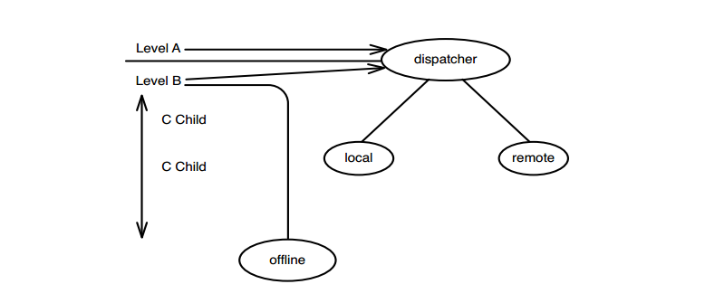

# Chương 16 Tôi không hiểu code đủ rõ để thay đổi nó

Bước vào những dòng code không quen thuộc, đặc biệt là code kế thừa, có thể đáng sợ. Theo thời gian, một vài người trở nên tương đối miễn dịch với sự sợ hãi. Họ phát triển sự tự tin khi đối đầu và tiêu diệt quái vật trong code hết lần này đến lần khác, nhưng rất khó để trở nên không sợ hãi. Tất cả chúng ta thỉnh thoảng gặp phải những con quái vật không thể tiêu diệt được. Nếu bạn tập trung vào nó trước khi bắt đầu xem code, sẽ khiến nó trở nên tồi tệ hơn. Bạn không bao giờ biết liệu một sự thay đổi sẽ trở nên đơn giản hay sẽ phải vò đầu cả tuần và khiến bạn nguyền rủa hệ thống, hoàn cảnh của mình và gần như mọi thứ xung quanh bạn. Nếu chúng ta hiểu mọi thứ cần biết để thực hiện các thay đổi của mình, mọi thứ sẽ suôn sẻ hơn. Làm thế nào chúng ta có thể có được sự hiểu biết đó?

Đây là một trường hợp điển hình. Bạn tìm hiểu về một tính năng mà bạn cần thêm vào hệ thống. Bạn ngồi xuống và bắt đầu tìm hiểu code. Đôi khi bạn có thể tìm ra mọi thứ mình cần biết một cách nhanh chóng, nhưng với code kế thừa, có thể mất nhiều thời gian hơn. Trong phần lớn thời gian, bạn lập một danh sách trong đầu về những việc bạn phải làm, đánh đổi cách tiếp cận này với cách tiếp cận khác. Đến một thời điểm nào đó, bạn cảm thấy mình có tiến độ và cảm thấy đủ tự tin để bắt đầu. Trong những trường hợp khác, bạn có thể bắt đầu chóng mặt vì tất cả những thứ mà bạn đang cố gắng tiếp thu. Việc đọc code của bạn dường như không giúp ích gì và bạn bắt đầu làm việc chỉ với những gì bạn biết, và hy vọng điều tốt nhất.

Có nhiều cách khác nhau để có được sự hiểu biết, nhưng rất nhiều người không sử dụng chúng vì họ bị cuốn vào việc cố gắng hiểu code theo cách tức thì nhất mà họ có thể. Cuối cùng, việc dành thời gian để cố gắng hiểu một thứ khó hiểu có vẻ không hiệu quả. Nếu chúng ta có thể hiểu rất nhanh, chúng ta thực sự có thể bắt đầu kiếm được tiền. Điều đó nghe có vẻ ngớ ngẩn? Tôi cũng vậy, nhưng mọi người thường hành động theo cách đó—và thật không may vì chúng ta có thể làm một số việc đơn giản, công nghệ thấp để bắt đầu công việc trên một nền tảng vững chắc hơn.

## Ghi chú/Phác thảo

Khi việc đọc code trở nên khó hiểu, bạn nên bắt đầu vẽ tranh và ghi chú. Viết tên của thứ quan trọng cuối cùng bạn vừa nhìn thấy, và sau đó viết tên của thứ tiếp theo. Nếu bạn thấy mối quan hệ giữa chúng, hãy vẽ một đường thẳng. Những bản phác thảo này không nhất thiết phải là sơ đồ UML đầy đủ hoặc đồ thị gọi hàm sử dụng một số ký hiệu đặc biệt—mặc dù, nếu mọi thứ trở nên khó hiểu hơn, bạn có thể muốn sắp xếp suy nghĩ của mình trang trọng hơn hoặc gọn gàng hơn. Phác thảo mọi thứ thường giúp chúng ta nhìn mọi thứ theo một cách khác. Đó cũng là một cách tuyệt vời để duy trì trạng thái tinh thần của chúng ta khi đang cố gắng hiểu điều gì đó đặc biệt phức tạp.

Hình 16.1 là bản dựng lại của phác thảo mà tôi cùng với một lập trình viên khác vẽ vào ngày hôm trước khi chúng tôi tìm hiểu code. Chúng tôi đã vẽ nó ở mặt sau của một bản ghi nhớ (tên trong bản phác thảo đã được thay đổi để bảo vệ những người vô tội).

Bản phác thảo lúc đó (như trong ảnh) không dễ hiểu lắm, nhưng nó vẫn ổn với cuộc trò chuyện của chúng tôi. Chúng tôi đã học được thêm một chút và bắt đầu tiếp cận công việc của mình.

Không phải tất cả mọi người làm điều này sao? Đúng thế, có và không. Ít người sử dụng nó thường xuyên. Tôi nghi ngờ lý do thực sự là vì không có bất kỳ hướng dẫn nào cho cách này và thật cám dỗ khi nghĩ rằng mỗi khi đặt bút viết, chúng ta nên viết một đoạn code hoặc sử dụng cú pháp UML. UML cũng tốt, nhưng các đốm màu, đường kẻ và hình dạng cũng vậy,chúng giống nhau ở chỗ bất kỳ ai không có mặt ở đó khi chúng tôi vẽ chúng cũng không thể hiểu được. Độ chính xác không cần phải quá cao. Đó chỉ là một công cụ giúp cuộc trò chuyện trở nên dễ dàng hơn và giúp chúng ta ghi nhớ các khái niệm đang được thảo luận và học hỏi.

Điều thực sự tuyệt vời của việc phác thảo các thành phần của thiết kế khi bạn đang cố gắng hiểu hệ thống là chúng không chính thống và dễ lan tỏa. Nếu bạn thấy kỹ thuật này hữu ích, bạn không cần phải thúc đẩy nhóm của mình biến nó thành một phần trong quy trình của nhóm. Tất cả những gì bạn phải làm là: Chờ cho đến khi bạn đang làm việc với một người đang cố gắng hiểu đoạn code bất kỳ, sau đó phác thảo về những gì bạn đang xem khi cố gắng giải thích nó. Nếu đối tác của bạn cũng thực sự tham gia vào việc học phần đó của hệ thống, họ sẽ xem bản phác thảo và trao đổi thêm với bạn.

Khi bạn bắt đầu thực hiện các bản phác thảo cục bộ của một hệ thống, bạn sẽ muốn dành thời gian để tìm hiểu bức tranh toàn cảnh. Hãy xem _Chương 17, Ứng dụng của tôi không có cấu trúc_, để biết một tập hợp các kỹ thuật giúp dễ hiểu hơn và hướng tới một cơ sở code lớn.

## Danh sách đánh dấu

Phác thảo không phải là thứ duy nhất hỗ trợ việc tìm hiểu. Một kỹ thuật khác mà tôi thường sử dụng là _danh sách đánh dấu_. Nó đặc biệt hữu ích với các phương thức vô cùng dài. Ý tưởng rất đơn giản và hầu như ai cũng đã sử dụng nó lúc này hay lúc khác, nhưng thành thật mà nói, tôi nghĩ nó chưa được đánh giá đúng mức.

Cách đánh dấu một danh sách phụ thuộc vào những gì bạn muốn hiểu. Bước đầu tiên là in code mà bạn muốn làm việc. Sau đó, bạn sử dụng danh sách đánh dấu để thực hiện bất kỳ hoạt động nào dưới đây.

### Phân tách trách nhiệm

Nếu bạn muốn phân tách các trách nhiệm, sử dụng một dấu để nhóm chúng với nhau. Nếu một số thứ thuộc về nhau, hãy đặt một ký hiệu đặc biệt bên cạnh chúng để bạn có thể xác định chúng. Sử dụng nhiều màu, nếu bạn có thể.

### Hiểu cấu trúc phương thức

Nếu bạn muốn hiểu một phương thức lớn, hãy sắp xếp các khối. Thông thường việc thụt lề trong các phương thức dài có thể khiến chúng không thể đọc được. Bạn có thể sắp xếp chúng bằng cách vẽ các đường từ đầu khối đến cuối hoặc ghi chú phần cuối của khối bằng phần mở đầu của vòng lặp hoặc điều kiện bắt đầu chúng.

Cách dễ nhất để sắp xếp các khối là từ trong ra ngoài. Ví dụ: khi bạn đang làm việc với một trong các ngôn ngữ thuộc họ C, chỉ cần bắt đầu đọc từ đầu danh sách qua mỗi dấu ngoặc nhọn mở cho đến khi bạn gặp được dấu ngoặc nhọn đóng đầu tiên. Đánh dấu nó, sau đó quay lại và đánh dấu đoạn mở tương ứng. Tiếp tục đọc cho đến khi bạn đến dấu ngoặc nhọn tiếp theo và làm điều tương tự. Quay lại cho đến khi bạn thấy dấu ngoặc nhọn mở phù hợp với nó.
