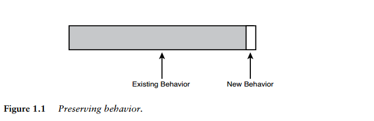

# Chương 1 Thay đổi phần mềm

Thay đổi code là một việc tuyệt vời. Đó là những gì chúng ta làm để kiếm sống. Nhưng có những cách thay đổi code khiến cuộc sống trở nên khó khăn và có những cách khiến nó trở nên dễ dàng hơn nhiều. Trong ngành này, chúng ta chưa nói nhiều về điều đó. Điều gần nhất mà chúng ta nhận được là tài liệu về tái cấu trúc. Tôi nghĩ chúng ta có thể mở rộng cuộc thảo luận ra một chút và nói về cách xử lý code trong những tình huống khó khăn nhất. Để làm được điều đó, chúng ta phải tìm hiểu sâu hơn về cơ chế của sự thay đổi.

## Bốn lý do để thay đổi phần mềm

Hãy xem xét bốn lý do chính để thay đổi phần mềm.

1. Thêm tính năng
2. Sửa lỗi
3. Cải thiện thiết kế
4. Tối ưu hóa việc sử dụng tài nguyên

### Thêm tính năng và Sửa lỗi

Thêm một tính năng có vẻ như là loại thay đổi đơn giản nhất để thực hiện. Phần mềm hoạt động theo một cách và người dùng nói rằng hệ thống cần phải làm thêm một điều gì đó khác.

Giả sử chúng ta đang làm việc với một ứng dụng web và một quản lý nói với chúng ta rằng cô ấy muốn logo công ty được chuyển từ bên trái của trang sang bên phải. Chúng ta nói chuyện với cô ấy về điều đó và phát hiện ra rằng nó không chỉ đơn giản như vậy. Cô ấy muốn di chuyển logo, nhưng cô ấy cũng muốn những thay đổi khác. Cô ấy muốn nó phải sống động cho lần phát hành tiếp theo. Đây là sửa lỗi hay là thêm tính năng mới? Nó còn tùy vào quan điểm của bạn. Từ quan điểm của khách hàng, cô ấy chắc chắn đang yêu cầu chúng ta khắc phục sự cố. Có thể cô ấy đã xem trang web và tham dự một cuộc họp với những người trong bộ phận của cô ấy, và họ quyết định thay đổi vị trí đặt logo đồng thời yêu cầu thêm một chút chức năng. Từ quan điểm của lập trình viên, thay đổi đó có thể được coi là một tính năng hoàn toàn mới. "Nếu họ ngừng thay đổi yêu cầu, thì chúng ta đã xong việc rồi." Nhưng trong một số tổ chức, việc di chuyển logo chỉ được coi là một sửa lỗi, bất kể thực tế là nhóm sẽ phải làm rất nhiều công việc mới.

Thật dễ để kết luận rằng tất cả những điều trên chỉ mang tính chủ quan. Bạn xem nó như một bản sửa lỗi, còn tôi xem nó như một tính năng, và không có gì phải bàn. Tuy nhiên, đáng buồn là trong nhiều tổ chức, các bản sửa lỗi và tính năng được theo dõi và hạch toán riêng vì liên quan đến các hợp đồng hoặc sáng kiến chất lượng. Ở cấp độ con người, chúng ta có thể nói đi nói lại không ngừng về việc có phải chúng ta có đang thêm mới các tính năng hay sửa lỗi hay không, nhưng tất cả chỉ là thay đổi code và các tạo phẩm khác. Thật không may, câu chuyện về sửa lỗi và bổ sung tính năng này che giấu một thứ quan trọng hơn nhiều đối với chúng ta về mặt kỹ thuật: thay đổi hành vi. Có một sự khác biệt lớn giữa việc thêm hành vi mới và thay đổi hành vi cũ.

Hành vi là thứ quan trọng nhất của phần mềm. Đó là những gì người dùng phụ thuộc vào. Người dùng thích khi chúng ta thêm hành vi (miễn đó là điều họ thực sự muốn), nhưng nếu chúng tôi thay đổi hoặc xóa hành vi mà họ đang phụ thuộc(khi đứng trước lỗi), thì họ sẽ ngừng tin tưởng chúng ta.

Quay lại ví dụ về logo của công ty, chúng ta có thêm hành vi không? Có. Sau khi thay đổi, hệ thống sẽ hiển thị logo ở bên phải trang. Chúng ta có đang loại bỏ bất kỳ hành vi nào không? Có, sẽ không có logo ở phía bên trái.

Hãy xem xét một tình huống khó hơn. Giả sử một khách hàng muốn thêm một logo vào phía bên phải của trang nhưng ban đầu không có biểu tượng nào ở phía bên trái. Có, chúng tôi đang thêm hành vi, nhưng chúng tôi có xóa bất kỳ hành vi nào không? Có bất cứ thứ gì được hiển thị ở nơi sắp hiển thị logo không?

Chúng ta đang thay đổi hành vi, thêm nó hay cả hai?

Hóa ra, đối với chúng ta, có thể nhận một sự khác biệt hữu ích hơn cho chúng ta với tư cách là các lập trình viên. Nếu chúng ta phải sửa đổi code (kể cả HTML cũng được tính là code), chúng ta có thể thay đổi hành vi. Nếu chúng ta chỉ thêm code và gọi nó, chúng ta thường thêm hành vi. Hãy xem một ví dụ khác. Đây là một phương thức trên một lớp Java:

```
public class CDPlayer
{
	public void addTrackListing(Track track) {
    ...
  }
  ...
}
```

Lớp này có một phương thức cho phép chúng ta thêm danh sách bản nhạc. Hãy thêm một phương thức khác cho phép chúng ta thay thế danh sách bản nhạc.

```
public class CDPlayer
{
  public void addTrackListing(Track track) {
    ...
  }

  public void replaceTrackListing(String name, Track track) {
    ...
  }
  ...
}
```

Khi chúng ta thêm phương thức đó, chúng ta đã thêm hành vi mới vào ứng dụng của mình hay thay đổi nó? Câu trả lời là: không. Việc thêm một phương thức không thay đổi hành vi trừ khi phương thức đó được gọi bằng cách nào đó.

Hãy thực hiện một thay đổi code khác. Hãy đặt một nút mới trên giao diện người dùng cho đầu đĩa CD. Nút này cho phép người dùng thay thế danh sách bản nhạc. Với động thái đó, chúng tôi sẽ thêm hành vi mà chúng tôi đã chỉ định trong phương thức `replaceTrackListing`, nhưng chúng tôi cũng đang thay đổi hành vi một cách tinh vi. Giao diện người dùng sẽ hiển thị khác với nút mới đó. Rất có thể, giao diện người dùng sẽ mất khoảng một phần triệu giây để hiển thị. Có vẻ như gần như không thể thêm hành vi mà không thay đổi nó ở một mức độ nào đó.

### Cải thiện thiết kế

Cải thiện thiết kế là một loại thay đổi khác. Khi chúng ta muốn thay đổi cấu trúc phần mềm để chúng có thể dễ bảo trì hơn, và nhìn chung chúng ta cũng muốn giữ nguyên hành vi của nó. Khi chúng ta loại bỏ hành vi trong quy trình đó, chúng ta thường gọi đó là lỗi. Một trong những lý do chính khiến nhiều lập trình viên không cố gắng cải thiện thiết kế thường xuyên là vì tương đối dễ mất hành vi hoặc tạo ra hành vi xấu trong quá trình thực hiện.

Việc cải thiện thiết kế mà không thay đổi hành vi được gọi là _tái cấu trúc_. Ý tưởng đằng sau tái cấu trúc là chúng ta có thể làm cho phần mềm dễ bảo trì hơn mà không thay đổi hành vi nếu chúng ta viết các kiểm thử để đảm bảo rằng hành vi hiện tại không thay đổi và thực hiện các bước nhỏ để xác minh điều đó trong suốt quá trình. Mọi người đã dọn dẹp code trong các hệ thống trong nhiều năm, nhưng chỉ trong vài năm gần đây, việc tái cấu trúc mới được thực hiện. Tái cấu trúc khác với dọn dẹp nói chung ở chỗ chúng ta không chỉ làm những việc có rủi ro thấp như định dạng lại code hoặc những việc xâm lấn và rủi ro như viết lại các đoạn của nó. Thay vào đó, chúng ta đang thực hiện một loạt sửa đổi cấu trúc nhỏ, được hỗ trợ bởi kiểm thử để giúp code dễ thay đổi hơn. Điều quan trọng về tái cấu trúc từ quan điểm thay đổi là không có bất kỳ thay đổi chức năng nào khi bạn tái cấu trúc (mặc dù hành vi có thể thay đổi phần nào vì những thay đổi cấu trúc mà bạn thực hiện có thể thay đổi hiệu suất, tốt hơn hoặc xấu hơn)

### Tối ưu hóa

Tối ưu hóa cũng giống như tái cấu trúc, nhưng khi thực hiện, chúng ta có một mục tiêu khác. Đối với cả tái cấu trúc và tối ưu hóa, chúng ta đều nói, "Chúng ta sẽ giữ nguyên chức năng khi chúng ta thực hiện các thay đổi, nhưng chúng ta sẽ thay đổi một thứ khác." Trong tái cấu trúc, "cái gì khác" là cấu trúc chương trình; chúng tôi muốn làm cho nó dễ bảo trì hơn. Trong tối ưu hóa, "cái gì khác" là một số tài nguyên được chương trình sử dụng, thường là thời gian hoặc bộ nhớ.

### Khi gộp tất cả lại

Có vẻ lạ khi tái cấu trúc và tối ưu hóa lại giống nhau. Chúng có vẻ gần gũi với nhau hơn là thêm tính năng hoặc sửa lỗi. Nhưng điều này có thực sự đúng? Điểm chung giữa tái cấu trúc và tối ưu hóa là chúng ta giữ chức năng bất biến trong khi chúng ta để thứ khác thay đổi.

Nhìn chung, có ba thứ có thể thay đổi khi chúng ta làm việc trong một hệ thống: cấu trúc, chức năng và sử dụng tài nguyên.

Hãy xem điều gì thường thay đổi và điều gì ít nhiều được giữ nguyên khi chúng ta thực hiện bốn loại thay đổi khác nhau (thường thì cả ba sẽ thay đổi, nhưng hãy xem xét những gì điển hình):

|             | Thêm chức năng | Sửa lỗi | Tái cấu trúc | Tối ưu hóa |
| ----------- | -------------- | ------- | ------------ | ---------- |
| Cấu trúc    | Thay đổi       |Thay đổi | Thay đổi     |            |
| Chức năng   | Thay đổi       |Thay đổi |              |            |
| Sử dụng tài nguyên |         |         |              | Thay  đổi  |

Thoạt nhìn, tái cấu trúc và tối ưu hóa trông rất giống nhau. Chúng không làm thay đổi chức năng. Nhưng điều gì sẽ xảy ra khi chúng ta tách riêng chức năng mới ra? Khi chúng ta thêm một tính năng, chúng ta thường thêm chức năng mới, nhưng không thay đổi chức năng hiện có.

|               | Thêm chức năng | Sửa lỗi | Tái cấu trúc | Tối ưu hóa |
| ------------- | -------------- | ------- | ------------ | ---------- |
| Cấu trúc      | Thay đổi       |Thay đổi | Thay đổi     |            |
| Chức năng mới | Thay đổi       |         |              |            |
| Chức năng     |                |Thay đổi |              |            |
| Sử dụng tài nguyên |           |         |              | Thay  đổi  |

Việc thêm các tính năng, tái cấu trúc và tối ưu hóa đều giữ chức năng hiện có không đổi. Trên thực tế, nếu chúng ta xem xét kỹ lưỡng việc sửa lỗi, đúng, nó có thay đổi chức năng, nhưng những thay đổi đó thường rất nhỏ so với số lượng chức năng không bị thay đổi hiện có.

Bổ sung tính năng và sửa lỗi rất giống với tái cấu trúc và tối ưu hóa. Trong cả bốn trường hợp, chúng ta muốn thay đổi một số chức năng, một số hành vi, nhưng chúng ta muốn bảo tồn nhiều hơn nữa (xem Hình 1.1).



Đó là một góc nhìn khá hay về những gì sẽ xảy ra khi chúng ta thực hiện các thay đổi, nhưng thực tế thì nó có ý nghĩa gì với chúng ta? Về mặt tích cực, nó dường như cho chúng ta biết chúng ta phải tập trung vào điều gì. Chúng ta phải đảm bảo rằng một số lượng nhỏ những thứ mà chúng ta thay đổi phải được thay đổi chính xác. Về mặt tiêu cực, đó không phải là điều duy nhất chúng ta phải tập trung vào. Chúng ta phải tìm ra cách giữ nguyên phần hành vi còn lại. Thật không may, việc giữ nguyên hành vi liên quan đến nhiều thứ hơn là chỉ để nguyên code. Chúng ta phải biết rằng hành vi không thay đổi và điều đó có thể khó khăn. Lượng hành vi mà chúng ta phải giữ gìn thường rất lớn, nhưng đó không phải là vấn đề lớn. Vấn đề lớn là chúng ta thường không biết mức độ nguy hiểm của hành vi đó khi chúng ta thực hiện các thay đổi của mình. Nếu chúng tôi biết, chúng tôi có thể tập trung vào hành vi đó và không quan tâm đến phần còn lại. Hiểu biết là điều quan trọng mà chúng ta cần thực hiện thay đổi một cách an toàn

Duy trì hành vi hiện có là một trong những thách thức lớn nhất trong phát triển phần mềm. Ngay cả khi chúng ta đang thay đổi các tính năng chính, chúng ta thường có một lượng hành vi rất lớn cần phải phải bảo tồn.

## Rủi ro khi thay đổi

Giữ gìn hành vi là một thách thức lớn. Khi chúng ta cần thực hiện các thay đổi và duy trì hành vi, nó có thể dẫn đến những rủi ro đáng kể.

Để giảm thiểu rủi ro, chúng ta phải đặt ra ba câu hỏi:
1. Chúng ta phải thực hiện những thay đổi nào?
2. Làm thế nào biết rằng chúng ta đã thực hiện chúng một cách chính xác?
3. Làm sao biết rằng chúng ta không làm hỏng bất cứ thứ gì?

Bạn đủ khả năng thực hiện bao nhiêu thay đổi nếu chúng có rủi ro?
