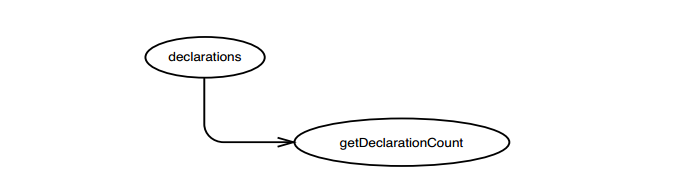
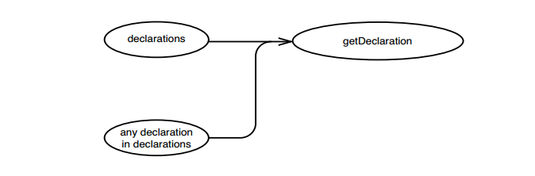
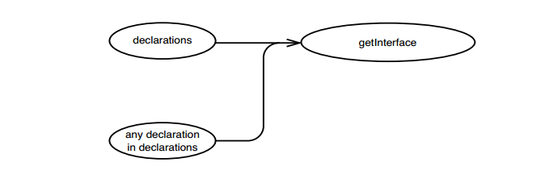
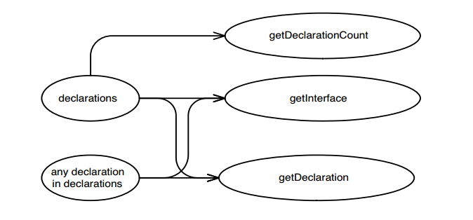
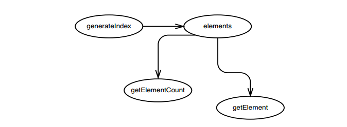
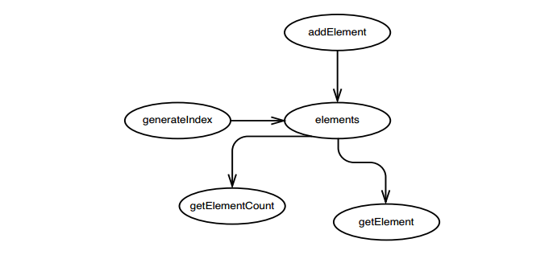
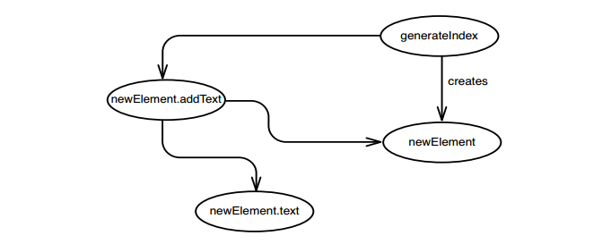
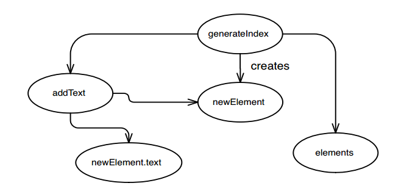

# Chương 11, Tôi Cần Thực Hiện Thay Đổi. Tôi nên kiểm thử những phương thức nào?

Chúng ta cần thực hiện một số thay đổi và chúng ta cần viết các _kiểm thử đặc tính_ (186) để xác định các hành vi đã có. Chúng ta nên viết chúng ở đâu? Câu trả lời đơn giản nhất là viết kiểm thử cho từng phương thức mà chúng ta thay đổi. Nhưng vậy đã đủ chưa? Có thể, nếu code đơn giản và dễ hiểu, nhưng trong code kế thừa, thường thì không có gì là chắc chắn cả. Một thay đổi ở một nơi có thể ảnh hưởng đến hành vi ở một nơi khác; trừ khi chúng ta có một kiểm thử tại chỗ đó, chúng ta có thể không bao giờ biết được.

Khi tôi cần thực hiện thay đổi trong code kế thừa đặc biệt rắc rối, tôi thường dành thời gian cố gắng tìm ra nơi tôi nên viết các kiểm thử của mình. Điều này liên quan đến việc suy nghĩ về sự thay đổi mà tôi sẽ thực hiện, xem nó sẽ ảnh hưởng đến điều gì, và những thứ bị ảnh hưởng sẽ ảnh hưởng đến điều gì, v.v. Kiểu lý luận này không có gì mới; mọi người đã làm điều đó kể từ buổi bình minh của thời đại máy tính.

Các lập trình viên ngồi xuống và suy luận về các chương trình của họ vì nhiều lý do. Điều buồn cười là, chúng ta không nói nhiều về nó. Chúng ta giả định rằng mọi người đều biết cách làm và điều đó "là một phần của lập trình viên." Thật không may, điều đó không giúp ích gì nhiều cho chúng ta khi phải đối mặt với những đoạn code rắc rối khủng khiếp, vượt xa khả năng suy luận dễ dàng của chúng ta về nó. Chúng ta biết rằng chúng ta nên tái cấu trúc lại nó để làm cho nó dễ hiểu hơn, nhưng sau đó lại xảy ra vấn đề với việc kiểm thử lại. Nếu chúng ta không có các kiểm thử, làm sao chúng tôi biết rằng chúng ta đang tái cấu trúc chính xác?

Tôi đã viết các kỹ thuật trong chương này để thu hẹp khoảng cách. Thường thì chúng ta phải suy luận về các hiệu ứng theo những cách khác thường để tìm ra nơi tốt nhất để kiểm thử.

## Lý luận về hiệu ứng

Trong ngành này, chúng ta không nói về điều này thường xuyên, nhưng đối với mỗi thay đổi chức năng trong phần mềm, sẽ có một số chuỗi tác động liên quan. Chẳng hạn, nếu đổi từ 3 thành 4 trong đoạn code C# dưới đây, nó sẽ thay đổi kết quả của phương thức khi nó được gọi. Nó cũng có thể thay đổi kết quả của các phương thức gọi phương thức đó, v.v., và cứ thế, tất cả quay trở về một số ranh giới của hệ thống. Mặc dù vậy, nhiều phần của code sẽ không có hành vi khác. Chúng sẽ không tạo ra các kết quả khác nhau vì chúng không gọi trực tiếp hoặc gián tiếp `getBalancePoint()`.

```C
int getBalancePoint() {
	const int SCALE_FACTOR = 3;
	int result = startingLoad + (LOAD_FACTOR * residual * SCALE_FACTOR);
	foreach(Load load in loads) {
		result += load.getPointWeight() * SCALE_FACTOR;
	}
	return result;
}
```

> IDE hỗ trợ việc phân tích hiệu ứng
> Đôi khi tôi ước mình có một IDE hỗ trợ tôi biết được các hiệu ứng trong code kế thừa. Tôi có thể đánh dấu một đoạn code và nhấn một phím nóng. Sau đó, IDE sẽ cung cấp cho tôi danh sách tất cả các biến và phương thức có thể bị ảnh hưởng khi tôi thay đổi đoạn code đã chọn.
> Có lẽ một ngày nào đó sẽ có người phát triển một công cụ như vậy. Trong khi chờ đợi, chúng ta phải suy luận các hiệu ứng mà không có công cụ. Đó là một kỹ năng rất dễ học, nhưng thật khó để biết khi nào chúng ta đã hiểu đúng.

Cách tốt nhất để hiểu được lý luận về hiệu ứng có tác dụng như thế nào là xem xét một ví dụ. Xem xét một lớp Java là một phần của ứng dụng thao tác ngôn ngữ C++. Nghe có vẻ khá chuyên sâu về miền phải không? Nhưng kiến thức miền không quan trọng khi chúng ta suy luận các hiệu ứng.

Hãy thử một bài tập nhỏ. Lập danh sách tất cả những thứ có thể thay đổi sau khi đối tượng `CppClass` được tạo sẽ ảnh hưởng đến kết quả được trả về bởi bất kỳ phương thức nào của nó.

```Java
public class CppClass {
	private String name;
	private List declarations;

	public CppClass(String name, List declarations) {
		this.name = name;
		this.declarations = declarations;
	}

	public int getDeclarationCount() {
		return declarations.size();
	}

	public String getName() {
		return name;
	}

	public Declaration getDeclaration(int index) {
		return ((Declaration)declarations.get(index));
	}

	public String getInterface(String interfaceName, int [] indices) {
		String result = "class " + interfaceName + " {\npublic:\n";
		for (int n = 0; n < indices.length; n++) {
			Declaration virtualFunction = (Declaration)(declarations.get(indices[n]));
			result += "\t" + virtualFunction.asAbstract() + "\n";
		}
		result += "};\n";
		return result;
	}
}
```

Danh sách đó sẽ giống như thế này:

1. Ai đó có thể thêm các phần tử bổ sung vào danh sách khai báo sau khi chuyển nó tới hàm khởi tạo. Vì danh sách được giữ theo tham chiếu nên những thay đổi được thực hiện đối với danh sách có thể thay đổi kết quả của `getInterface`, `getDeclaration` và `getDeclarationCount`.
2. Ai đó có thể thay đổi một trong các đối tượng được giữ trong danh sách khai báo hoặc thay thế một trong các phần tử của nó, ảnh hưởng đến các phương thức tương tự.

> Một số người nhìn vào phương thức `getName` và nghi ngờ rằng nó có thể trả về một giá trị khác nếu bất kỳ ai thay đổi chuỗi `name`, nhưng trong Java, các đối tượng `String` là bất biến. Bạn không thể thay đổi giá trị của chúng sau khi chúng được tạo. Sau khi một đối tượng `CppClass` được tạo, `getName` luôn trả về cùng một giá trị chuỗi.

Chúng ta tạo một bản phác thảo cho thấy những thay đổi trong `declarations` có ảnh hưởng đến `getDeclarationCount()` (xem Hình 11.1)


Hình 11.1 `declarations` tác động đến `getDeclarationCount`.

Bản phác thảo này cho thấy rằng nếu `declarations` thay đổi theo một cách nào đó - ví dụ: nếu kích thước của nó tăng lên - `getDeclarationCount()` có thể trả về một giá trị khác.

Chúng ta cũng có thể tạo một bản phác thảo cho cho `getDeclaration(int index)` (xem Hình 11.2).

Các giá trị trả về của lệnh gọi `getDeclaration(int index)` có thể thay đổi nếu có điều gì đó khiến `declarations` thay đổi hoặc nếu các khai báo bên trong nó thay đổi.

Hình 11.3 cho thấy những điều tương tự cũng ảnh hưởng đến phương thức `getInterface`.

Chúng ta có thể gộp tất cả các bản phác thảo này lại với nhau thành một bản phác thảo lớn hơn (xem Hình 11.4)


Hình 11.2 `declarations` và các đối tượng mà nó nắm giữ tác động đến `getDeclarationCount`


Hình 11.3 Những thứ ảnh hưởng đến `getInterface`


Hình 11.4 Tổng hợp các bản phác thảo

Không có nhiều cú pháp trong các sơ đồ này. Tôi chỉ gọi chúng là _các bản phác thảo hiệu ứng_. Điều quan trọng là có một thành phần riêng cho từng biến có thể bị ảnh hưởng và từng phương thức có giá trị trả về có thể thay đổi. Đôi khi các biến nằm trên cùng một đối tượng và đôi khi chúng nằm trên các đối tượng khác nhau. Điều đó không thành vấn đề: Chúng tôi chỉ tạo thành phần cho những thứ sẽ thay đổi và vẽ một mũi tên tới mọi thứ có giá trị có thể thay đổi trong thời gian chạy bởi vì chúng.

> Nếu code của bạn được cấu trúc tốt, hầu hết các phương thức trong ứng dụng của bạn đều có cấu trúc hiệu ứng đơn giản. Trên thực tế, một thước đo mức độ tốt của ứng dụng là các hiệu ứng khá phức tạp đối với thế giới bên ngoài là tổng của một tập hợp các hiệu ứng đơn giản hơn nhiều bên trong code. Hầu như bất cứ điều gì bạn có thể làm khiến cho bản phác thảo hiệu ứng đơn giản hơn cho một đoạn code đều khiến nó trở nên dễ hiểu và dễ bảo trì hơn.

Hãy mở rộng bức tranh của chúng ta về hệ thống mà lớp trước hình thành và nhìn vào một bức tranh hiệu ứng lớn hơn. Các đối tượng `CppClass` được tạo trong một lớp có tên là `ClassReader`. Trên thực tế, chúng tôi có thể xác định rằng chúng chỉ được tạo trong `ClassReader`.

```Java
public class ClassReader {
	private boolean inPublicSection = false;
	private CppClass parsedClass;
	private List declarations = new ArrayList();
	private Reader reader;

	public ClassReader(Reader reader) {
		this.reader = reader;
	}

	public void parse() throws Exception {
		TokenReader source = new TokenReader(reader);
		Token classToken = source.readToken();
		Token className = source.readToken();

		Token lbrace = source.readToken();
		matchBody(source);
		Token rbrace = source.readToken();

		Token semicolon = source.readToken();

		if (classToken.getType() == Token.CLASS && className.getType() == Token.IDENT && lbrace.getType() == Token.LBRACE && rbrace.getType() == Token.RBRACE && semicolon.getType() == Token.SEMIC) {
				parsedClass = new CppClass(className.getText(),declarations);
		}
	}
	...
}
```

Hãy nhớ những gì chúng ta đã học về `CppClass`? Chúng ta có biết rằng danh sách khai báo sẽ không bao giờ thay đổi sau khi `CppClass` được tạo không? Chúng ta không thực sự khẳng định được với những gì đã biết. Chúng ta cần tìm ra cách danh sách khai báo được điền. Nếu chúng ta xem xét nhiều hơn về lớp, chúng ta có thể thấy rằng các khai báo chỉ được thêm vào một vị trí trong `CppClass`, một phương thức có tên là `matchVirtualDeclaration` được gọi bởi `matchBody`.

```Java
private void matchVirtualDeclaration(TokenReader source)
throws IOException {
	if (!source.peekToken().getType() == Token.VIRTUAL)
		return;
	List declarationTokens = new ArrayList();
	declarationTokens.add(source.readToken());
	while(source.peekToken().getType() != Token.SEMIC) {
		declarationTokens.add(source.readToken());
	}
	declarationTokens.add(source.readToken());
	if (inPublicSection)
		declarations.add(new Declaration(declarationTokens));
}
```

Có vẻ như tất cả các thay đổi xảy ra với danh sách này xảy ra trước khi đối tượng `CppClass` được tạo. Bởi vì chúng ta thêm các khai báo mới vào danh sách và không giữ bất kỳ tham chiếu nào đến chúng, nên các khai báo cũng sẽ không thay đổi.

Hãy nghĩ về những thứ nằm trong danh sách khai báo. Phương thức `readToken` của `TokenReader` trả về các đối tượng `token` chỉ chứa một chuỗi và một số nguyên không bao giờ thay đổi. Tôi không trình bày nó ở đây, nhưng nhìn lướt qua lớp `Declaration` cho thấy rằng không có gì khác có thể thay đổi trạng thái của nó sau khi được tạo, vì vậy chúng ta có thể cảm thấy khá thoải mái khi nói rằng khi một đối tượng `CppClass` được tạo, danh sách khai báo và danh sách nội dung của nó sẽ không thay đổi.

Điều này sẽ giúp chúng ta thế nào? Nếu chúng ta nhận được các giá trị không mong muốn từ `CppClass`, chúng ta biết rằng chỉ cần xem xét một vài điều. Nhìn chung, chúng ta có thể bắt đầu thực sự nhìn lại những nơi mà các đối tượng con của `CppClass` được tạo ra để tìm ra điều gì đang xảy ra. Chúng ta cũng có thể làm cho code rõ ràng hơn bằng cách bắt đầu đánh dấu một số tham chiếu trong hằng số `CppClass` bằng cách sử dụng từ khóa `final` của Java.

Trong các chương trình không được viết tốt, chúng ta thường thấy rất khó hiểu tại sao kết quả mà chúng ta đang xem xét lại như vậy. Khi chúng ta đang ở vào hoàn cảnh đó, chúng ta có một vấn đề cần gỡ lỗi và phải suy luận ngược từ vấn đề đến nguồn gốc của nó. Khi làm việc với code kế thừa, chúng ta thường phải đặt một câu hỏi khác: Nếu chúng ta thực hiện một thay đổi cụ thể, nó có thể ảnh hưởng đến phần kết quả còn lại của chương trình như thế nào?

Điều này liên quan đến suy luận tịnh tiến từ các điểm thay đổi. Khi bạn xử lý tốt kiểu lập luận này, bạn sẽ bắt đầu có một kỹ thuật để tìm ra những chỗ hợp lý để viết kiểm thử.

## Suy luận tịnh tiến

Trong ví dụ trước, chúng ta đã cố gắng tìm ra tập hợp các đối tượng ảnh hưởng đến các giá trị tại một vị trí cụ thể trong code. Khi viết các _kiểm thử đặc tính_ (186), chúng ta sẽ đảo ngược quá trình này. Chúng ta xem xét một tập hợp các đối tượng và cố gắng tìm ra điều gì sẽ thay đổi sau khi chúng ngừng hoạt động. Đây là một ví dụ. Lớp sau đây là một phần của hệ thống tệp trong bộ nhớ. Chúng ta không có bất kỳ kiểm thử nào cho nó, nhưng chúng ta muốn thực hiện một số thay đổi.

```Java
public class InMemoryDirectory {
	private List elements = new ArrayList();

	public void addElement(Element newElement) {
		elements.add(newElement);
	}

	public void generateIndex() {
		Element index = new Element("index");
		for (Iterator it = elements.iterator(); it.hasNext(); ) {
			Element current = (Element)it.next();
			index.addText(current.getName() + "\n");
		}
		addElement(index);
	}

	public int getElementCount() {
		return elements.size();
	}

	public Element getElement(String name) {
		for (Iterator it = elements.iterator(); it.hasNext(); ) {
			Element current = (Element)it.next();
			if (current.getName().equals(name)) {
				return current;
			}
		}
		return null;
	}
}
```

`InMemoryDirectory` là một lớp Java nhỏ. Chúng ta có thể tạo một đối tượng `InMemoryDirectory`, thêm các phần tử vào đó, tạo một chỉ mục (index) và sau đó truy cập các phần tử. `Elements` là các đối tượng chứa văn bản, giống như các tệp. Khi chúng tôi tạo một chỉ mục, chúng tôi tạo một phần tử có tên là `index` và nối thêm tên của tất cả các phần tử khác vào nội dung của nó.

Một tính năng kỳ lạ của `InMemoryDirectory` là chúng ta không thể gọi `generateIndex` hai lần mà không làm hỏng mọi thứ. Nếu chúng ta gọi `generateIndex` hai lần, chúng ta sẽ có hai phần tử chỉ mục (phần tử thứ hai được tạo sẽ liệt kê phần tử đầu tiên là một phần tử của thư mục).

May mắn thay, ứng dụng sử dụng `InMemoryDirectory` theo một cách rất hạn chế. Nó tạo ra các thư mục, lấp đầy chúng bằng các phần tử, gọi `generateIndex`, sau đó chuyển thư mục đi khắp nơi để các phần khác của ứng dụng có thể truy cập các phần tử của nó. Tất cả đều hoạt động tốt ngay bây giờ, nhưng chúng ta cần phải thay đổi. Chúng ta cần sửa đổi phần mềm để cho phép mọi người thêm các phần tử vào bất kỳ lúc nào trong thời gian tồn tại của thư mục.

Lý tưởng nhất là chúng ta muốn việc tạo và bảo trì chỉ mục diễn ra như một tác dụng phụ của việc thêm các phần tử. Lần đầu tiên thêm một phần tử, phần tử chỉ mục sẽ được tạo và nó phải chứa tên của phần tử đã được thêm vào. Lần thứ hai, phần tử chỉ mục đó sẽ được cập nhật với tên của phần tử được thêm vào. Sẽ dễ dàng để viết các kiểm thử cho hành vi mới và code thỏa mãn chúng, nhưng chúng tôi không có bất kỳ kiểm thử nào cho hành vi hiện tại. Làm thế nào để chúng ta tìm ra nơi để đặt chúng?

Trong ví dụ này, câu trả lời đã đủ rõ ràng: Chúng ta cần một loạt kiểm thử gọi `addElement` theo nhiều cách khác nhau, tạo chỉ mục và sau đó lấy các phần tử khác nhau để xem chúng có đúng không. Làm thế nào chúng ta biết những phương pháp nào là phù hợp để sử dụng? Trong trường hợp này, vấn đề rất đơn giản. Các kiểm thử chỉ là mô tả về cách chúng ta muốn sử dụng thư mục. Chúng ta có thể viết chúng mà không cần nhìn vào code thư mục vì chúng ta biết rõ thư mục phải làm gì. Thật không may, việc tìm ra vị trí viết kiểm thử không phải lúc nào cũng đơn giản như vậy. Tôi có thể sử dụng một lớp lớn phức tạp để làm ví dụ, một lớp giống như những lớp thường ẩn trong các hệ thống cũ, nhưng bạn sẽ cảm thấy nhàm chán và đóng cuốn sách lại. Vì vậy, hãy giả sử rằng đây là một vấn đề khó và xem cách chúng ta có thể tìm ra những gì cần kiểm thử bằng cách xem code. Cách lập luận tương tự cũng áp dụng cho những vấn đề hóc búa hơn.

Trong ví dụ này, điều đầu tiên chúng ta cần làm là tìm ra nơi chúng ta sẽ thực hiện các thay đổi của mình. Chúng ta cần xóa chức năng khỏi `generateIndex` và thêm chức năng vào `addElement`. Khi chúng ta đã xác định đó là những điểm thay đổi, chúng ta có thể bắt đầu phác thảo các hiệu ứng.

Hãy bắt đầu với `generateIndex`. Cái gì sẽ gọi nó? Không có phương pháp nào khác trong lớp làm việc đó. Phương thức này chỉ được gọi bởi các lớp khác. Chúng ta có sửa đổi bất cứ điều gì trong `generateIndex` không? Chúng ta tạo một phần tử mới và thêm nó vào thư mục, vì vậy, `generateIndex` có thể có ảnh hưởng đến tập hợp các `elements` trong lớp (xem Hình 11.5).

Bây giờ chúng ta có thể xem xét tập hợp `elements` và xem nó có thể ảnh hưởng đến những gì. Những nơi nó được sử dụng? Có vẻ như nó được sử dụng trong `getElementCount` và `getElement`. Tập hợp `elements` cũng được sử dụng trong `addElement`, nhưng chúng ta không cần tính đến điều đó vì `addElement` hoạt động theo cùng một cách, bất kể chúng ta làm gì với tập hợp `elements`: Không người dùng `addElements` nào có thể bị ảnh hưởng bởi bất kỳ điều gì chúng ta làm với tập hợp `elements` (xem Hình 11.6).


Hình 11.5 `generateIndex` ảnh hưởng đến `elements`


Hình 11.6 Các tác động khác của các thay đổi trong `generateIndex`.

Như thế đã đủ chưa? Chưa, điểm thay đổi của chúng ta là phương thức `generateIndex` và phương thức `addElement`, vì vậy chúng ta cần xem xét ảnh hưởng của `addElement` đến xung quanh. Có vẻ như `addElement` ảnh hưởng đến tập hợp `elements` (xem Hình 11.7).

Chúng ta có thể xem điều gì ảnh hướng đến những phần tử, nhưng chúng ta đã làm điều đó rồi vì `generateIndex` ảnh hưởng đến `elements`.

Hình 11.8. gồm toàn bộ phác thảo


Hình 11.7 `addElement` ảnh hưởng đến `elements`

Khi sử dụng của lớp `InMemoryDirectory`, cách duy nhất để cảm nhận được sự ảnh hưởng là thông qua các phương thức `getElementCount` và `getElement`. Nếu chúng ta có thể viết kiểm thử cho các phương thức đó, có lẽ chúng ta sẽ có thể bao phủ được tất cả các tác động tạo ra từ sự thay đổi của chúng ta.


Hình 11.8 Phác thảo ảnh hưởng của lớp `InMemoryDirectory`

Nhưng có khả năng chúng ta bỏ lỡ điều gì đó không? Còn các lớp cha và lớp con thì sao? Nếu bất kỳ dữ liệu nào trong `InMemoryDirectory` là công khai, bảo vệ hoặc nằm trong phạm vi gói, thì một phương thức của lớp con có thể sửa đổi dữ liệu đó theo cách chúng ta không thể biết. Trong ví dụ này, các biến thể hiện trong `InMemoryDirectory` là riêng tư, vì vậy chúng ta không phải lo lắng về điều đó.

> Khi bạn đang phác thảo các hiệu ứng, hãy đảm bảo rằng bạn đã tìm thấy tất cả vị trí sử dụng của lớp bạn đang kiểm tra. Nếu lớp của bạn có một lớp cha hoặc các lớp con, thì có thể có vị trí khác mà bạn chưa xem xét.

Bây giờ thì sao? Chà, có một điều mà chúng tôi đã che đậy hoàn toàn. Chúng tôi đang sử dụng lớp `Element` trong thư mục, nhưng nó không nằm trong bản phác thảo hiệu ứng của chúng tôi. Hãy xem xét nó kỹ hơn.

Khi chúng ta gọi `generateIndex`, chúng ta tạo một `Element` và liên tục gọi `addText` trên đó. Hãy xem code của `Element`:

```Java
public class Element {
	private String name;
	private String text = "";

	public Element(String name) {
		this.name = name;
	}

	public String getName() {
		return name;
	}

	public void addText(String newText) {
		text += newText;
	}

	public String getText() {
		return text;
	}
}
```

Thật may mắn, nó rất đơn giản. Hãy tạo một hình ảnh cho một phần tử mới mà `generateIndex` tạo ra (xem Hình 11.9).

Khi chúng ta có một phần tử mới và nó chứa đầy văn bản, `generateIndex` sẽ thêm phần tử đó vào tập hợp, vì vậy phần tử mới sẽ ảnh hưởng đến tập hợp (xem Hình 11.10)


Hình 11.9 Các tác động tới lớp `Element`


Hình 11.10 `generateIndex` tác động tới tập hợp `elements`.

Chúng ta đã biết rằng phương thức `addText` ảnh hưởng đến tập hợp `elements`, do đó, ảnh hưởng đến các giá trị trả về của `getElement` và `getElementCount`. Nếu chúng ta muốn thấy văn bản được tạo chính xác, chúng ta có thể gọi `getText` trên một phần tử được trả về bởi `getElement`. Đó là nơi duy nhất phải viết kiểm thử để phát hiện tác động từ những thay đổi của chúng ta.

Như tôi đã đề cập trước đó, đây là một ví dụ khá nhỏ, nhưng nó rất tiêu biểu cho cách lập luận chúng ta cần thực hiện khi đánh giá tác động của những thay đổi trong code kế thừa. Chúng ta cần tìm những nơi viết kiểm thử và bước đầu tiên là tìm ra nơi có thể phát hiện ra sự thay đổi: tác động của sự thay đổi là gì. Khi chúng ta biết nơi có thể phát hiện các ảnh hưởng, chúng tôi có thể chọn ở trong số chúng nơi chúng ta viết kiểm thử của mình.

## Hiệu ứng lan truyền

Có một số cách lan truyền hiệu ứng dễ nhận thấy hơn những cách khác. Trong ví dụ về `InMemoryDirectory` ở phần trước, cuối cùng chúng ta cùng tìm thấy các phương thức trả về giá trị cho trình gọi. Mặc dù bắt đầu bằng cách theo dõi các hiệu ứng từ các điểm thay đổi, những nơi đang thực hiện thay đổi, nhưng tôi cũng thường chú ý đến các phương thức có giá trị trả về trước tiên. Trừ khi các giá trị trả về của chúng không được sử dụng, chúng sẽ truyền các hiệu ứng tới code gọi chúng.

Các hiệu ứng cũng có thể lan truyền theo những cách thầm lặng, lén lút. Nếu chúng ta có một đối tượng nhận một số đối tượng khác làm tham số, nó có thể sửa đổi trạng thái của nó và thay đổi sẽ phản ánh trở lại phần còn lại của ứng dụng.

> Mỗi ngôn ngữ có các quy tắc riêng về cách xử lý tham số cho các phương thức. Mặc định trong nhiều trường hợp là truyền các tham chiếu đến các đối tượng theo giá trị. Đây là mặc định trong Java và C#. Các đối tượng không được truyền cho các phương thức; thay vào đó, chúng cho phép truyền vào các đối tượng đã qua "xử lý". Kết quả là bất kỳ phương thức nào cũng có thể thay đổi trạng thái của đối tượng thông "đã qua xử lý" truyền vào. Một số ngôn ngữ này có các từ khóa mà bạn có thể sử dụng để không thể sửa đổi trạng thái của một đối tượng được truyền cho chúng. Trong C++, từ khóa `const` thực hiện điều này khi bạn sử dụng nó trong phần khai báo tham số phương thức.

Cách lén lút nhất mà một đoạn code có thể ảnh hưởng đến code khác là thông qua dữ liệu tĩnh hoặc toàn cục. Đây là một ví dụ:

```Java
public class Element {
	private String name;
	private String text = "";

	public Element(String name) {
		this.name = name;
	}

	public String getName() {
		return name;
	}

	public void addText(String newText) {
		text += newText;
		View.getCurrentDisplay().addText(newText);
	}

	public String getText() {
		return text;
	}
}
```

Lớp này gần giống như lớp `Element` mà chúng ta đã sử dụng trong ví dụ `InMemoryDirectory`. Trên thực tế, chỉ có một dòng code là khác: dòng thứ hai trong `addText`. Nhìn vào đặc trưng của các phương thức trong `Element` sẽ không giúp chúng ta tìm ra tác động của các phần tử. Ẩn thông tin là rất tốt, trừ khi đó là thông tin mà chúng ta cần biết.

> Các hiệu ứng lan truyền trong code theo ba cách cơ bản:
> 1. Qua các giá trị trả về
> 2. Thay đổi các đối tượng được truyền dưới dạng tham số được
> 3. Thay đổi dữ liệu tĩnh hoặc toàn cục

> Một số ngôn ngữ cung cấp các cơ chế bổ sung. Chẳng hạn, trong các ngôn ngữ hướng khía cạnh, lập trình viên có thể viết các cấu trúc được gọi là các khía cạnh ảnh hưởng đến hành vi của code trong các khu vực khác của hệ thống

Đây là kinh nghiệm tôi sử dụng khi tìm kiếm các hiệu ứng:

1. Xác định một phương thức sẽ thay đổi.
2. Nếu phương thức đó có giá trị trả về, hãy xem xét những nơi gọi nó.
3. Xem phương thức có sửa đổi bất kỳ giá trị nào không. Nếu có, hãy xem các phương thức sử dụng các giá trị đó và các phương thức sử dụng các phương thức đó.
4. Đảm bảo rằng bạn tìm kiếm các lớp cha và lớp con có thể là người dùng của các biến thể hiện và phương thức này.
5. Xem các tham số của các phương thức. Xem liệu chúng hoặc bất kỳ đối tượng nào mà phương thức của chúng trả về có được code mà bạn muốn thay đổi sử dụng hay không.
6. Tìm kiếm các biến toàn cục và dữ liệu tĩnh được sửa đổi theo bất kỳ phương pháp nào bạn đã xác định.

## Công cụ xác định ảnh hưởng

Công cụ quan trọng nhất mà chúng ta cần có là kiến thức về ngôn ngữ lập trình. Trong mọi ngôn ngữ, đều có những "tường lửa" nhỏ, những thứ ngăn cản sự lan truyền ảnh hưởng. Nếu biết được chúng là gì, chúng ta sẽ biết không cần phải bỏ qua chúng.

Giả sử rằng chúng ta sắp thay đổi cách biểu diễn của lớp tọa độ sau đây. Chúng ta muốn chuyển sang sử dụng một vectơ để giữ các giá trị x và y vì muốn khái quát hóa lớp `Coordinate` giúp nó có thể biểu diễn các tọa độ ba và bốn chiều. Trong đoạn code Java sau, chúng ta không cần phải xem xét kỹ hơn lớp này để hiểu tác động của sự thay đổi:

```Java
public class Coordinate {
	private double x = 0;
	private double y = 0;

	public Coordinate() {}

	public Coordinate(double x, double y) {
		this.x = x; this.y = x;
	}

	public double distance(Coordinate other) {
		return Math.sqrt(Math.pow(other.x - x, 2.0) + Math.pow(other.y - y, 2.0));
	}
}
```

Đây là đoạn mà chúng ta phải xem xét kỹ hơn:

```Java
public class Coordinate {
	double x = 0;
	double y = 0;

	public Coordinate() {}
	public Coordinate(double x, double y) {
		this.x = x; this.y = x;
	}

	public double distance(Coordinate other) {
		return Math.sqrt(Math.pow(other.x - x, 2.0) + Math.pow(other.y - y, 2.0));
	}
}
```

Sự khác biệt là gì? Nó tinh tế. Trong phiên bản đầu tiên, các biến x và y là riêng tư. Trong phiên bản thứ 2, chúng có phạm vi gói. Trong phiên bản đầu tiên, nếu chúng ta làm bất cứ điều gì thay đổi biến x và y, thì nó chỉ tác động đến bên ngoài thông qua hàm `distance`, bất kể sử dụng `Coordinate` hay một lớp con của `Coordinate`. Trong phiên bản thứ hai, từ bên ngoài có thể truy cập trực tiếp vào các biến. Chúng ta nên tìm kiếm điều này hoặc thử đặt chúng ở chế độ riêng tư để đảm bảo rằng chúng ảnh hưởng đến bên ngoài. Các lớp con của `Coordinate` cũng có thể sử dụng các biến thể hiện, vì vậy chúng ta phải xem xét chúng và xem liệu chúng có đang được sử dụng trong các phương thức của bất kỳ lớp con nào không.

Việc hiểu biết ngôn ngữ của chúng ta rất quan trọng bởi vì các quy tắc tinh vi thường có thể khiến chúng ta mắc sai lầm. Hãy xem một ví dụ về C++:

```Cpp
class PolarCoordinate : public Coordinate {
public:
	PolarCoordinate();
	double getRho() const;
	double getTheta() const;
};
```

Trong C++, khi từ khóa `const` xuất hiện sau một phương thức khai báo, thì phương thức đó không thể sửa đổi các biến thể hiện của đối tượng. Hay nó có thể? Giả sử rằng lớp cha của `PolarCoordin` trông như thế này:

```Cpp
class Coordinate {
protected:
	mutable double first, second;
};
```

Trong C++, khi từ khóa `mutable` được sử dụng trong khai báo, điều đó có nghĩa là các biến đó có thể được sửa đổi trong các phương thức `const`. Phải thừa nhận rằng việc sử dụng khả năng thay đổi này đặc biệt kỳ lạ, nhưng khi cần tìm ra những gì có thể và không thể thay đổi trong một chương trình mà chúng ta không biết rõ, chúng ta phải tìm kiếm các ảnh hưởng bất kể chúng có thể kỳ lạ đến mức nào. Lấy `const` có nghĩa là `const` trong C++ mà không thực sự kiểm tra có thể nguy hiểm. Điều này cũng đúng với các cấu trúc ngôn ngữ khác có thể bị phá vỡ.

> Hiểu ngôn ngữ của bạn.
