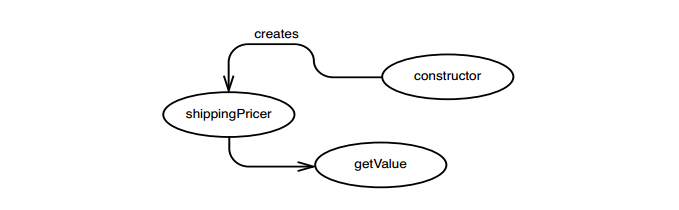
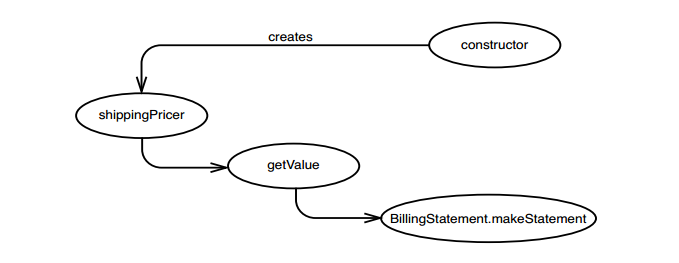
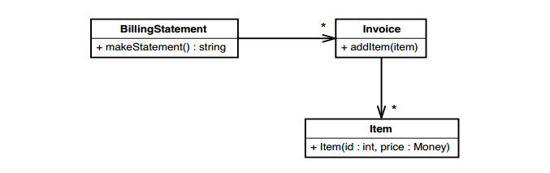
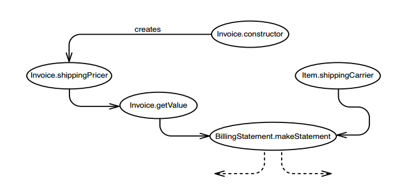
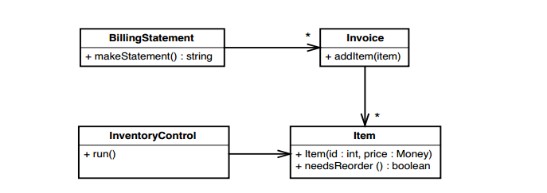
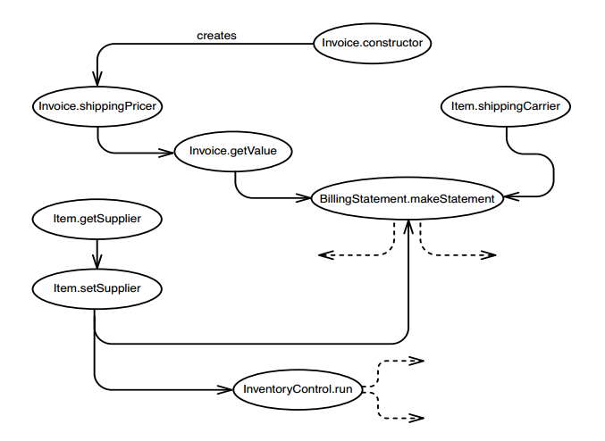

# Chương 12, Tôi cần thực hiện nhiều thay đổi trong một khu vực. Tôi có phải phá vỡ các phụ thuộc của tất cả các lớp liên quan không?

Trong một số trường hợp, rất dễ dàng để bắt đầu viết kiểm thử cho một lớp. Nhưng với code kế thừa thì thường là khó hơn. Sự phụ thuộc có thể khá khó để phá vỡ. Khi bạn cam kết đưa các lớp vào kiểm thử khai thác để giúp công việc dễ dàng hơn, một trong những điều khó chịu nhất có thể gặp phải là những thay đổi rải rác. Bạn cần thêm một tính năng mới vào hệ thống và thấy rằng mình phải sửa ba hoặc bốn lớp có liên quan chặt chẽ với nhau. Mỗi lớp sẽ mất vài giờ để kiểm thử. Chắc chắn rằng, bạn biết đến cuối cùng code sẽ tốt hơn, nhưng bạn có thực sự phải phá vỡ tất cả những phụ thuộc đó một cách riêng lẻ không? Có thể không.

Thông thường, việc kiểm thử "lùi một cấp độ" sẽ đáng để tìm một nơi có thể viết các kiểm thử cho một số thay đổi cùng một lúc. Chúng ta có thể viết các kiểm thử tại một phương thức công khai duy nhất để thay đổi một số phương thức riêng tư hoặc chúng ta có thể viết các kiểm thử tại giao diện của một đối tượng để cộng tác với một số đối tượng mà nó nắm giữ. Khi làm điều này, chúng ta có thể kiểm thử những thay đổi đang thực hiện, nhưng cũng tạo cho mình một số "vỏ bọc" để tái cấu trúc nhiều hơn trong khu vực. Cấu trúc code bên dưới các kiểm thử có thể thay đổi hoàn toàn miễn là các kiểm thử xác định hành vi của chúng.

> Các kiểm thử cấp cao hơn có thể hữu ích trong việc tái cấu trúc. Mọi người thường thích chúng hơn các kiểm thử chi tiết ở mỗi lớp vì họ nghĩ rằng thay đổi khó hơn khi có nhiều kiểm thử nhỏ được viết trên một giao diện phải thay đổi. Trên thực tế, các thay đổi thường dễ dàng hơn bạn mong đợi vì bạn có thể thực hiện các thay đổi đối với các kiểm thử và sau đó thực hiện các thay đổi đối với code, di chuyển cấu trúc theo từng bước nhỏ an toàn.

> Mặc dù các kiểm thử cấp cao hơn là một công cụ quan trọng, nhưng chúng không nên thay thế cho các kiểm thử đơn vị. Thay vào đó, chúng nên là bước đầu tiên để thực hiện các kiểm thử đơn vị.

Làm cách nào để có được những “kiểm thử bao phủ này? Điều đầu tiên mà chúng ta phải tìm ra là nơi để viết chúng. Nếu bạn chưa xem, hãy xem _Chương 11, Tôi Cần Thực Hiện Thay Đổi. Tôi nên kiểm thử những phương thức nào?_ Chương đó mô tả _các bản phác thảo hiệu ứng_ (155), một công cụ mạnh mẽ mà bạn có thể sử dụng để tìm ra nơi viết kiểm thử. Trong chương này, tôi mô tả khái niệm về _điểm đánh chặn_ và chỉ ra cách tìm ra chúng. Tôi cũng mô tả loại điểm đánh chặn tốt nhất mà bạn có thể tìm thấy trong code, _điểm chèn ép_. Tôi chỉ cho bạn cách tìm chúng và cách chúng có thể giúp bạn khi bạn muốn viết kiểm thử để bao phủ code bạn sắp thay đổi.

## Điểm chặn

_Điểm chặn_ đơn giản là một điểm trong chương trình của bạn, nơi bạn có thể phát hiện tác động của một thay đổi cụ thể. Trong một số ứng dụng, việc tìm chúng khó khăn hơn so với những ứng dụng khác. Nếu bạn có một ứng dụng với các thành phần kết dính với nhau mà không có nhiều liên kết tự nhiên, thì việc tìm kiếm một _điểm chặn_ phù hợp có thể là một vấn đề khó. Thường thì nó đòi hỏi một số suy luận về tác động và phá vỡ rất nhiều sự phụ thuộc. Chúng ta bắt đầu như thế nào?

Cách tốt nhất để bắt đầu là xác định những nơi bạn cần thực hiện thay đổi và bắt đầu theo dõi các tác động bên ngoài từ những điểm thay đổi đó. Mỗi nơi mà bạn có thể phát hiện các hiệu ứng là một _điểm chặn_, nhưng đó có thể không phải là _điểm chặn_ tốt nhất. Bạn phải thực hiện các lần gọi phán đoán trong suốt quá trình.

### Trường hợp đơn giản

Tưởng tượng rằng chúng ta phải sửa đổi một lớp Java có tên là `Invoice`, để thay đổi cách tính chi phí. Phương pháp tính toán tất cả các chi phí cho `Invoice` gọi là `getValue`.

```Java
public class Invoice
{
	...
	public Money getValue() {
		Money total = itemsSum();
		if (billingDate.after(Date.yearEnd(openingDate))) {
			if (originator.getState().equals("FL") || originator.getState().equals("NY"))
				total.add(getLocalShipping());
			else
				total.add(getDefaultShipping());
		}
		else
			total.add(getSpanningShipping());

		total.add(getTax());
		return total;
	}
	...
}
```

Chúng ta cần thay đổi cách tính chi phí vận chuyển cho New York. Cơ quan lập pháp vừa thêm một loại thuế ảnh hưởng đến hoạt động vận chuyển của chúng ta ở đó, và thật không may, chúng ta phải chuyển chi phí cho người tiêu dùng. Trong quá trình này, chúng ta sẽ trích xuất logic tính chi phí vận chuyển vào một lớp mới có tên là ``ShippingPricer``. Khi hoàn thành, code sẽ trông như thế này:

```Java
public class Invoice
{
	public Money getValue() {
		Money total = itemsSum();
		total.add(`shippingPricer`.getPrice());
		total.add(getTax());
		return total;
	}
}
```

Tất cả công việc được thực hiện trong `getValue` đều do ``Shippingpricer`` thực hiện. Chúng ta cũng sẽ phải thay đổi hàm tạo cho `Invoice` để tạo một ``ShippingPricer`` biết về ngày lập hóa đơn.

Để tìm các điểm chặn, chúng ta phải bắt đầu theo dõi các tác động chuyển tiếp từ các điểm thay đổi. Phương thức `getValue` sẽ có kết quả khác. Hóa ra là không có phương thức nào trong `Invoice` sử dụng `getValue`, nhưng `getValue` được sử dụng trong một lớp khác: Phương thức `makeStatement` của một lớp có tên `BillingStatement` sử dụng nó. Điều này được thể hiện trong Hình 12.1.


Hình 12.1 `getValue` tác động đến `BillingStatement.makeStatement`

Chúng ta cũng sẽ sửa đổi hàm khởi tạo, vì vậy chúng tôi phải xem phần code phụ thuộc vào nó. Trong trường hợp này, chúng ta sẽ tạo một đối tượng mới trong hàm khởi tạo, một ``ShippingPricer``. Nó sẽ không ảnh hưởng đến bất cứ điều gì khác ngoại trừ các phương thức sử dụng nó và phương thức duy nhất sẽ sử dụng nó là phương thức `getValue`. Hình 12.2 cho thấy tác động này.


Hình 12.2 Các tác động lên `getValue`

Chúng ta có thể ghép các bản phác thảo lại với nhau như trong Hình 12.3.


Hình 12.3 Chuỗi tác động

Vì vậy, đâu là điểm chặn của chúng ta? Thực sự thì, chúng ta có thể sử dụng bất kỳ bong bóng nào trong sơ đồ trên làm _điểm chặn_, miễn là chúng ta có quyền truy cập vào bất kỳ thứ gì chúng đại diện. Chúng ta có thể thử kiểm thử thông qua biến `shippingPricer`, nhưng nó là một biến riêng tư (private) trong lớp `Invoice` nên chúng ta không có quyền truy cập vào nó. Ngay cả khi nó có thể truy cập được để kiểm tra, `shippingPricer` là một _điểm chặn_ khá hẹp. Chúng ta có thể cảm nhận được những gì đã làm với hàm khởi tạo (tạo `shippingPricer`) và đảm bảo rằng `shippingPricer` thực hiện những gì nó phải làm, nhưng chúng ta không thể sử dụng nó để đảm bảo rằng `getValue` không thay đổi theo chiều hướng xấu .

Chúng ta có thể viết kiểm thử thực thi phương thức `makeStatement` của `BillingStatement` và kiểm tra giá trị trả về của nó để đảm bảo rằng chúng ta đã thực hiện các thay đổi của mình một cách chính xác. Nhưng tốt hơn hết, chúng ta nên viết kiểm thử thực thi `getValue` trong `Invoice` và kiểm tra ở đó. Thậm chí có thể ít việc hơn. Chắc chắn, sẽ rất tuyệt nếu kiểm thử `BillingStatement`, nhưng điều đó không cần thiết vào lúc này. Nếu chúng tôi phải thực hiện thay đổi đối với `BillingStatement` sau này, chúng tôi có thể kiểm tra nó sau đó.

Nói chung, bạn nên chọn _điểm chặn_ càng gần với các điểm thay đổi của mình càng tốt, vì một vài lý do sau. Lý do đầu tiên là sự an toàn. Mỗi bước giữa điểm thay đổi và điểm chặn giống như một bước trong lập luận logic. Về cơ bản, chúng ta đang nói, "Chúng tôi có thể kiểm thử ở đây vì điều này tác động đến điều này và điều kia tác động đến điều khác, do đó tác động đến điều mà chúng tôi đang kiểm thử." Bạn càng có nhiều bước như vậy, thì càng khó có thể biết rằng bạn đúng hay không. Đôi khi, cách duy nhất bạn có thể chắc chắn là viết kiểm thử tại _điểm chặn_ và sau đó quay lại điểm thay đổi để thay đổi code một chút và xem liệu kiểm thử có thất bại hay không. Đôi khi bạn phải sử dụng lại kỹ thuật đó, nhưng bạn không cần phải làm điều đó mọi lúc. Một lý do khác khiến các điểm chặn xa trở nên kém hơn là việc thiết lập các kiểm thử tại chúng thường khó hơn. Điều này không phải lúc nào cũng đúng; nó phụ thuộc vào code. Một lần nữa, điều có thể làm cho nó khó hơn là số bước giữa sự thay đổi và điểm chặn. Thường thì bạn phải "tưởng tượng" trong đầu để biết rằng một kiểm thử bao gồm một số chức năng xa vời.

Trong ví dụ này, những thay đổi mà chúng ta muốn thực hiện đối với `Invoice` có thể được kiểm thử tốt nhất ở đó. Chúng tôi có thể tạo `Invoice` trong kiểm thử khai thác, thiết lập nó theo nhiều cách khác nhau và gọi `getValue` để xác định hành vi của nó trong khi chúng ta thực hiện các thay đổi của mình.

### Điểm chặn cấp cao hơn

Trong hầu hết các trường hợp, _điểm chặn_ tốt nhất chúng ta có thể có cho một thay đổi là một phương thức công khai trong lớp đang thay đổi. Những điểm chặn này rất dễ tìm và dễ sử dụng, nhưng đôi khi chúng không phải là lựa chọn tốt nhất. Chúng ta có thể thấy điều này nếu chúng ta mở rộng ví dụ về `Invoice` thêm một chút.

Giả sử rằng, ngoài việc thay đổi cách tính chi phí vận chuyển cho `Invoice`, chúng ta phải sửa đổi một lớp có tên `Item` để lớp này chứa một trường mới để lưu giữ hãng vận chuyển. Chúng ta cũng cần tách riêng từng người gửi hàng trong `BillingStatement`. Hình 12.4 cho thấy thiết kế hiện tại của chúng ta trông như thế nào trong UML.



Hình 12.4 Mở rộng hệ thống thanh toán.

Nếu không có lớp nào trong số này có kiểm thử, chúng ta có thể bắt đầu bằng cách viết kiểm thử cho từng lớp riêng lẻ và thực hiện các thay đổi mà chúng ta cần. Điều đó sẽ hiệu quả, nhưng sẽ hiệu quả hơn nếu bắt đầu bằng cách cố gắng tìm một _điểm chặn_ cấp cao hơn mà chúng ta có thể sử dụng để mô tả vùng code này. Việc này mang lại lợi ích kép: Chúng ta ít phải phá bỏ sự phụ thuộc hơn và chúng ta cũng đang nắm giữ một phần lớn hơn trong ê tô(?). Với các kiểm thử đặc trưng trong nhóm lớp này, chúng ta có nhiều cơ hội tái cấu trúc hơn. Chúng ta có thể thay đổi cấu trúc của `Invoice` và `Item` bằng cách sử dụng các kiểm thử đã có tại `BillingStatement` như một bất biến. Đây là một kiểm thử khởi đầu tốt để mô tả `BillingStatement`, `Invoice` và `Item` cùng nhau:

```Java
void testSimpleStatement() {
	Invoice invoice = new Invoice();
	invoice.addItem(new Item(0,new Money(10));
	BillingStatement statement = new BillingStatement();
	statement.addInvoice(invoice);
	assertEquals("", statement.makeStatement());
}
```

Chúng ta có thể tìm hiểu những gì `BillingStatement` tạo ra cho hóa đơn của một mặt hàng và thay đổi kiểm thử để sử dụng giá trị đó. Sau đó, chúng ta có thể thêm nhiều kiểm thử hơn để xem cách định dạng câu lệnh diễn ra như thế nào đối với các kết hợp hóa đơn và mặt hàng khác nhau. Chúng ta nên đặc biệt cẩn thận khi viết các trường hợp thực hiện các vùng code mà chúng ta sẽ giới thiệu các đường nối.

Điều gì làm cho `BillingStatement` trở thành một điểm chặn lý tưởng ở đây? Đó là một điểm duy nhất mà chúng ta có thể sử dụng để phát hiện các tác động từ những thay đổi trong một cụm lớp. Hình 12.5 cho thấy bản phác thảo tác động cho những thay đổi mà chúng ta sẽ thực hiện.


Hình 12.5 Phác thảo hệ thống thanh toán

Lưu ý rằng tất cả các tác động đều được phát hiện thông qua `makeStatement`. Chúng có thể không dễ phát hiện thông qua `makeStatement`, nhưng ít nhất, đây là một nơi có thể phát hiện ra tất cả chúng. Thuật ngữ tôi sử dụng cho một nơi như thế này trong một thiết kế là _điểm mấu chốt_. Một _điểm mấu chốt_ là một điểm thu hẹp trong _bản phác thảo tác động_ (155), một nơi có thể viết các kiểm thử bao quát một loạt các thay đổi. Nếu bạn có thể tìm thấy một _điểm mấu chốt_ trong một thiết kế, nó có thể giúp công việc của bạn dễ dàng hơn rất nhiều.

Tuy nhiên, điều quan trọng cần nhớ về các _điểm mấu chốt_ là chúng được xác định bởi các điểm thay đổi. Một tập hợp các thay đổi đối với một lớp có thể có điểm mấu chốt tốt ngay cả khi lớp đó có nhiều chỗ gọi. Để thấy điều này, chúng ta hãy xem xét hệ thống hóa đơn một cách rộng hơn như trong Hình 12.6.


Hình 12.6 Hệ thống thanh toán với kho.

Chúng tôi đã không nhận thấy điều này sớm hơn, nhưng `Item` cũng có một phương thức có tên là `needReorder`. Lớp `InventoryControl` gọi nó bất cứ khi nào cần tìm hiểu xem có cần đặt hàng hay không. Điều này có thay đổi bản phác thảo tác động của chúng ta cho những thay đổi mà cần thực hiện không? Không một chút nào. Việc thêm trường `shippingCarrier` vào `Item` hoàn toàn không ảnh hưởng đến phương thức `needsReorder`, vì vậy `BillingStatement` vẫn là `điểm mấu chốt` của chúng ta, một vị trí hẹp mà chúng ta có thể kiểm tra.

Hãy thay đổi kịch bản thêm một chút. Giả sử rằng chúng ta có một thay đổi khác cần thực hiện. Chúng ta phải thêm các phương thức vào `Item` cho phép chúng ta lấy và gán nhà cung cấp cho một `Item`. Lớp `InventoryControl` và `BillingStatement` sẽ sử dụng tên của nhà cung cấp đó. Hình 12.7 cho thấy điều này có tác dụng gì với bản phác thảo tác động của chúng ta.

Mọi thứ bây giờ trông không tốt lắm. Tác động bởi các thay đổi của chúng ta được phát hiện thông qua phương thức `makeStatement` trong `BillingStatement` và thông qua các biến bị ảnh hưởng bởi phương thức `run` của `InventoryControl`, nhưng không còn một điểm chặn nào nữa. Tuy nhiên, khi kết hợp với nhau, phương thức `run` và phương thức `makeStatement` có thể được coi là điểm mấu chốt; cùng nhau, chúng chỉ là hai phương thức và đó là nơi hẹp hơn để phát hiện vấn đề so với tám phương thức và các biến phải được động chạm để thực hiện các thay đổi. Nếu chúng ta có các kiểm thử ở đó, chúng ta sẽ bao phủ được rất nhiều sự thay đổi.

> Điểm mấu chốt
> Điểm mấu chốt là một điểm hẹp trong một bản phác thảo tác động, đặt kiểm thử với một vài phương thức tại đó có thể tìm ra những thay đổi trong nhiều phương thức khác.

Trong một số phần mềm, khá dễ dàng để tìm ra điểm mấu chốt cho các tập hợp thay đổi, nhưng trong nhiều trường hợp, điều đó gần như là không thể. Một lớp hoặc phương thức đơn lẻ có thể ảnh hưởng trực tiếp đến hàng tá thứ khác và một bản phác thảo tác động được vẽ từ nó có thể trông giống như một cái cây lớn rối rắm. Chúng ta có thể làm gì với nó? Một điều chúng ta cần làm là xem lại các điểm thay đổi. Có thể chúng ta đang cố gắng làm quá nhiều việc cùng một lúc. Xem xét việc tìm các _điểm mấu chốt_ chỉ của một hoặc hai thay đổi tại một thời điểm. Nếu bạn hoàn toàn không tìm thấy một điểm mấu chốt nào, cần cố gắng viết các kiểm thử cho các thay đổi riêng lẻ càng gần càng tốt.


Hình 12.7 Toàn cảnh hệ thống thanh toán

Một cách khác để tìm điểm mấu chốt là tìm cách sử dụng phổ biến trên _bản phác thảo tác động_ (155). Một phương thức hoặc biến có thể có ba người dùng, nhưng điều đó không có nghĩa là nó đang được sử dụng theo ba cách riêng biệt. Ví dụ, giả sử chúng ta cần thực hiện tái cấu trúc phương thức `needReorder` của lớp `Item` trong ví dụ trước. Tôi chưa cho bạn xem code, nhưng nếu phác thảo các tác động, chúng ta sẽ thấy rằng có thể thu được điểm mấu chốt gồm phương thức `run` của `InventoryControl` và phương thức `makeStatement` của `BillingStatement`, nhưng chúng ta thực sự không thể thu hẹp hơn nữa. Liệu có ổn không nếu chỉ viết kiểm thử ở một trong những lớp đó chứ không phải lớp khác? Câu hỏi quan trọng cần đặt ra là, "Nếu tôi phá vỡ phương thức đó, liệu tôi có thể cảm nhận được nó ở nơi này không?" Câu trả lời phụ thuộc vào phương thức được sử dụng như thế nào. Nếu nó được sử dụng theo cùng một cách trên các đối tượng có giá trị tương đương, thì có thể kiểm thử ở chỗ này chứ không phải chỗ khác. Hãy phân tích thêm với đồng nghiệp của bạn.

## Đánh giá thiết kế với các điểm mấu chốt

Trong phần trước, chúng ta đã nói về sự hữu ích của _điểm mấu chốt_ trong kiểm thử, nhưng chúng cũng có những cách sử dụng khác nữa. Nếu bạn chú ý đến vị trí các điểm mấu chốt của mình, chúng có thể cho bạn gợi ý về cách làm cho code của bạn tốt hơn.

Thực sự thì _điểm mấu chốt_ là gì? Đó là một ranh giới đóng gói tự nhiên. Khi bạn tìm thấy một _điểm mấu chốt_, bạn đã tìm thấy một cái phễu hẹp chứa tất cả các tác động của một đoạn code lớn. Nếu phương thức `BillingStatement.makeStatement` là điểm mấu chốt đối với một loạt invoice và item, thì chúng ta biết phải tìm ở đâu khi xác nhận kiểm thử không như mong đợi. Vấn đề phải là do lớp `BillingStatement` hoặc invoice và item. Tương tự, chúng ta không cần biết về invoice và item để gọi `makeStatement`. Đây gần như là định nghĩa của sự đóng gói: Chúng ta không cần quan tâm đến phần bên trong, nhưng khi cần, chúng ta không cần phải nhìn vào phần bên ngoài để hiểu chúng. Thông thường, khi tôi tìm kiếm các điểm mấu chốt, tôi có thể thấy được cách phân bổ lại trách nhiệm giữa các lớp như thế nào để đóng gói tốt hơn.

> Sử dụng bản phác thảo tác động để tìm các lớp ẩn
>
> Đôi khi, khi bạn có một lớp lớn, bạn có thể sử dụng bản phác thảo tác động để tìm cách cách chia lớp đó thành nhiều lớp nhỏ hơn. Đây là một ví dụ nhỏ trong Java. Chúng ta có một lớp gọi là `Parser` có phương thức công khai `parseExpression`.
>
>```Java
>public class Parser
>{
>	private Node root;
>	private int currentPosition;
>	private String stringToParse;
>	public void parseExpression(String expression) { .. }
>	private Token getToken() { .. }
>	private boolean hasMoreTokens() { .. }
>}
>```
>	Nếu chúng ta vẽ một bản phác thảo tác động cho lớp này, chúng ta sẽ thấy rằng `parseExpression` phụ thuộc vào `getToken` và `hasMoreTokens`, nhưng nó không phụ thuộc trực tiếp vào `stringToParse` hoặc `currentPosition`, mặc dù `getToken` và `hasMoreTokens` có phụ thuộc. Những gì chúng ta có ở đây là một ranh giới đóng gói tự nhiên, mặc dù nó không thực sự hẹp (hai phương pháp ẩn hai mẩu thông tin). Chúng ta có thể trích xuất các phương thức và trường đó thành một lớp có tên là `Tokenizer` và cuối cùng lớp `Parser` trở nên đơn giản hơn.
>
> Đây không phải là cách duy nhất để tìm ra cách phân chia trách nhiệm cho một lớp; đôi khi những cái tên sẽ gợi ý cho bạn, như trong trường hợp này (chúng ta có hai phương thức với từ `Token` trong tên của chúng). Điều này có thể giúp bạn nhìn một lớp lớn theo một cách khác và điều đó có thể dẫn giúp việc trích xuất lớp tốt hơn.
>
> Như một bài tập, hãy tạo bản phác thảo tác động cho những thay đổi trong một lớp lớn và quên tên của các bong bóng. Chỉ cần nhìn cách chúng được nhóm lại. Có bất kỳ ranh giới đóng gói tự nhiên nào không? Nếu có, hãy nhìn vào các bong bóng bên trong ranh giới. Hãy suy nghĩ về tên mà bạn sẽ sử dụng cho cụm phương thức và biến đó: Tên đó có thể trở thành tên của lớp mới. Hãy suy nghĩ về việc thay đổi bất kỳ tên nào sẽ giúp ích.
>
> Khi bạn làm điều này, hãy làm điều đó với đồng nghiệp của bạn. Những cuộc thảo luận về việc đặt tên có lợi ích vượt xa công việc mà bạn hiện đang làm. Chúng giúp bạn và nhóm của bạn phát triển một quan điểm chung về hệ thống là gì và nó có thể trở thành gì.

Viết kiểm thử tại các _điểm mấu chốt_ là một cách lý tưởng để bắt đầu một số công việc xâm lấn trong một phần của chương trình. Bạn đầu tư bằng cách tạo ra một tập hợp các lớp và đưa chúng đến điểm mà bạn có thể khởi tạo chúng cùng nhau trong kiểm thử khai thác. Sau khi bạn viết các _kiểm thử đặc tính_ của mình (186), bạn có thể thực hiện các thay đổi mà không cảm thấy tội lỗi. Bạn đã tạo ra một ốc đảo nhỏ trong ứng dụng của mình, nơi công việc trở nên dễ dàng hơn. Nhưng hãy cẩn thận - nó có thể là một cái bẫy.

## Cái bẫy của điểm mấu chốt

Đôi lúc chúng ta có thể gặp rắc rối khi viết kiểm thử đơn vị. Một trong số đó là khi kiểm thử đơn vị từ từ phát triển thành kiểm thử tích hợp nhỏ. Chúng ta cần kiểm tra một lớp, vì vậy chúng ta khởi tạo một số cộng tác viên của nó và truyền chúng vào lớp. Chúng ta kiểm thử một số giá trị và có thể cảm thấy tự tin rằng toàn bộ cụm đối tượng hoạt động tốt với nhau. Nhược điểm là, nếu làm điều này quá thường xuyên, chúng ta sẽ kết thúc với rất nhiều kiểm thử đơn vị lớn, cồng kềnh và mất thời gian để chạy. Thủ thuật khi chúng ta viết kiểm thử đơn vị cho code mới là kiểm thử các lớp càng độc lập càng tốt. Khi bạn bắt đầu nhận thấy rằng các kiểm thử của mình quá lớn, bạn nên chia nhỏ lớp mà bạn đang kiểm thử để tạo các phần độc lập nhỏ hơn có thể kiểm thử dễ dàng hơn. Đôi khi, bạn sẽ phải đánh lừa các cộng tác viên vì công việc của một kiểm thử đơn vị không phải là xem cách một nhóm đối tượng hoạt động cùng nhau, mà là cách một đối tượng hoạt động. Chúng ta có thể kiểm thử điều đó dễ dàng hơn thông qua hàng giả.

Khi chúng ta viết kiểm thử cho code hiện có, các bảng sẽ được lật. Đôi khi, việc tạo ra một phần của ứng dụng và dựng nó bằng các kiểm thử là đáng giá. Khi chúng ta có các kiểm thử đó, có thể dễ dàng viết các kiểm thử đơn vị hẹp hơn cho từng lớp mà chúng ta tiếp xúc khi thực hiện công việc của mình. Cuối cùng, các kiểm thử tại _điểm mấu chốt_ có thể biến mất.

Các kiểm thử tại các _điểm mấu chốt_ giống như đi bộ vài bước vào một khu rừng và vẽ một đường thẳng, nói rằng "Tôi sở hữu tất cả khu vực này." Sau khi bạn biết rằng mình sở hữu tất cả khu vực đó, bạn có thể phát triển nó bằng cách tái cấu trúc và viết thêm các kiểm thử. Theo thời gian, bạn có thể xóa các kiểm thử tại _điểm mấu chốt_ và để các kiểm thử cho mỗi lớp hỗ trợ công việc phát triển của bạn.
