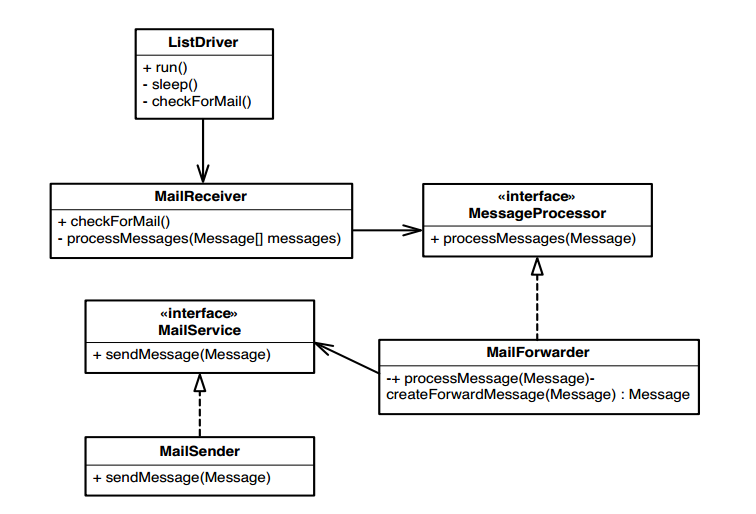

# Chương 15 - Toàn bộ ứng dụng của tôi chỉ gồm các lệnh gọi API

Xây dựng, mua hoặc mượn. Đó là những lựa chọn mà tất cả chúng ta phải thực hiện khi phát triển phần mềm. Rất nhiều lần khi đang làm việc với một ứng dụng, chúng ta nghi ngờ rằng mình có thể tiết kiệm thời gian và công sức bằng cách mua một số thư viện của nhà cung cấp, sử dụng một số nguồn mở hoặc thậm chí chỉ sử dụng những đoạn code đáng kể từ các thư viện đi kèm với nền tảng của chúng ta (J2EE, .NET, v.v.). Có rất nhiều thứ cần cân nhắc khi chọn tích hợp code chúng ta không thể thay đổi. Chúng ta phải biết nó ổn định đến mức nào, có đủ và dễ sử dụng hay không. Và cuối cùng khi quyết định sử dụng code của bên thứ 3, chúng ta thường gặp phải một vấn đề khác. Đến cuối cùng các ứng dụng trông giống như chẳng có gì ngoài lời gọi lặp đi lặp lại đến thư viện của bên thứ 3. Làm cách nào để chúng ta thực hiện những thay đổi trong code như vậy?

Sự cám dỗ ngay lập tức nói rằng chúng ta không thực sự cần kiểm thử. Suy cho cùng, chúng ta không thực sự làm được điều gì đáng kể; chúng ta chỉ gọi một phương thức ở đây và ở kia và code của chúng ta rất đơn giản. Nó thực sự đơn giản. Làm sao có thể sai được?

Nhiều dự án kế thừa bắt đầu từ những khởi đầu khiêm tốn đó. Code ngày càng phát triển và mọi thứ không còn đơn giản nữa. Theo thời gian, chúng ta vẫn có thể thấy các vùng code không chạm vào API nhưng chúng được nhúng trong một tập hợp code không thể kiểm thử được. Chúng ta phải chạy ứng dụng mỗi khi thay đổi thứ gì đó để đảm bảo rằng nó vẫn hoạt động và lại rơi vào tình thế tiến thoái lưỡng nan của người viết hệ thống cũ. Những thay đổi là không chắc chắn; chúng ta không viết hết code nhưng phải bảo trì nó.

Ở nhiều khía cạnh, các hệ thống tràn ngập lệnh gọi thư viện khó xử lý hơn so với các hệ thống tự xây dựng. Lý do đầu tiên là thường rất khó để làm cho cấu trúc tốt hơn vì tất cả những gì bạn thấy là các lệnh gọi API. Bất cứ điều gì có thể là gợi ý về một thiết kế đều không có ở đó. Lý do thứ hai khiến các hệ thống sử dụng nhiều API gặp khó khăn là do chúng ta không sở hữu API. Nếu làm vậy, chúng ta có thể đổi tên các giao diện, lớp và phương thức để làm cho mọi thứ rõ ràng hơn hoặc thêm các phương thức vào các lớp để cung cấp chúng cho các phần khác nhau của code.

Dưới đây là một ví dụ. Đây là đoạn code được viết rất kém cho máy chủ gửi danh sách thư. Chúng tôi thậm chí còn không biết chắc nó hoạt động hay không.

```java
import java.io.IOException;
import java.util.Properties;

import javax.mail.*;
import javax.mail.internet.*;

public class MailingListServer
{
  public static final String SUBJECT_MARKER = "[list]";
  public static final String LOOP_HEADER = "X-Loop";

  public static void main (String [] args) {
    if (args.length != 8) {
      System.err.println ("Usage: java MailingList <popHost> " +
          "<smtpHost> <pop3user> <pop3password> " +
          "<smtpuser> <smtppassword> <listname> " +
          "<relayinterval>");
      return;
    }

    HostInformation host = new HostInformation (
          args [0], args [1], args [2], args [3],
          args [4], args [5]);
    String listAddress = args[6];
    int interval = new Integer (args [7]).intValue ();
    Roster roster = null;
    try {
      roster = new FileRoster("roster.txt");
    } catch (Exception e) {
      System.err.println ("unable to open roster.txt");
      return;
    }
    try {
      do {
        try {
          Properties properties = System.getProperties ();
          Session session = Session.getDefaultInstance (properties, null);
          Store store = session.getStore ("pop3");
          store.connect (host.pop3Host, -1, host.pop3User, host.pop3Password);
          Folder defaultFolder = store.getDefaultFolder();
          if (defaultFolder == null) {
            System.err.println("Unable to open default folder");
            return;
          }
          Folder folder = defaultFolder.getFolder ("INBOX");
          if (folder == null) {
            System.err.println("Unable to get: " + defaultFolder);
            return;
          }
          folder.open (Folder.READ_WRITE);
          process(host, listAddress, roster, session, store, folder);
        } catch (Exception e) {
          System.err.println(e);
          System.err.println ("(retrying mail check)");
        }
        System.err.print (".");
        try { Thread.sleep (interval * 1000); }
        catch (InterruptedException e) {}
      } while (true);
    }
    catch (Exception e) {
      e.printStackTrace ();
    }
  }

  private static void process(
      HostInformation host,
      String listAddress,
      Roster roster,
      Session session,
      Store store,
      Folder folder)
          throws MessagingException {
    try {
      if (folder.getMessageCount() != 0) {
        Message[] messages = folder.getMessages ();
        doMessage(host, listAddress, roster, session, folder, messages);
      }
    } catch (Exception e) {
      System.err.println ("message handling error");
      e.printStackTrace (System.err);
    }
    finally {
      folder.close (true);
      store.close ();
    }
  }

  private static void doMessage(
      HostInformation host,
      String listAddress,
      Roster roster,
      Session session,
      Folder folder,
      Message[] messages)
          throws MessagingException, AddressException, IOException,
          NoSuchProviderException {
    FetchProfile fp = new FetchProfile ();
    fp.add (FetchProfile.Item.ENVELOPE);
    fp.add (FetchProfile.Item.FLAGS);
    fp.add ("X-Mailer");
    folder.fetch (messages, fp);
    for (int i = 0; i < messages.length; i++) {
      Message message = messages [i];
      if (message.getFlags ().contains (Flags.Flag.DELETED))
        continue;
      System.out.println("message received: " + message.getSubject ());
      if (!roster.containsOneOf (message.getFrom ()))
        continue;
      MimeMessage forward = new MimeMessage (session);
      InternetAddress result = null;
      Address [] fromAddress = message.getFrom ();
      if (fromAddress != null && fromAddress.length > 0)
        result = new InternetAddress (fromAddress [0].toString ());
      InternetAddress from = result;
      forward.setFrom (from);
      forward.setReplyTo (new Address [] { new InternetAddress (listAddress) });
      forward.addRecipients (Message.RecipientType.TO, listAddress);
      forward.addRecipients (Message.RecipientType.BCC, roster.getAddresses ());
      String subject = message.getSubject();
      if (-1 == message.getSubject().indexOf (SUBJECT_MARKER))
        subject = SUBJECT_MARKER + " " + message.getSubject();
      forward.setSubject (subject);
      forward.setSentDate (message.getSentDate ());
      forward.addHeader (LOOP_HEADER, listAddress);
      Object content = message.getContent ();
      if (content instanceof Multipart)
        forward.setContent ((Multipart)content);
      else
        forward.setText ((String)content);

      Properties props = new Properties ();
      props.put ("mail.smtp.host", host.smtpHost);

      Session smtpSession = Session.getDefaultInstance (props, null);
      Transport transport = smtpSession.getTransport ("smtp");
      transport.connect (host.smtpHost, host.smtpUser, host.smtpPassword);
      transport.sendMessage (forward, roster.getAddresses ());
      message.setFlag (Flags.Flag.DELETED, true);
    }
  }
}
```

Đây là một đoạn code khá nhỏ nhưng không rõ ràng lắm. Thật khó để thấy bất kỳ dòng code nào không sử dụng API. Liệu nó có thể được cấu trúc tốt hơn? Liệu nó có thể được cấu trúc theo cách giúp thay đổi dễ dàng hơn không?

Có, nó có thể.

Bước đầu tiên là xác định cốt lõi của code: Đoạn code này thực sự làm được gì cho chúng ta?

Sẽ hữu ích nếu bạn thử viết mô tả ngắn gọn về chức năng của nó:

> Đoạn code này đọc thông tin cấu hình từ dòng lệnh và danh sách địa chỉ email từ một tệp. Nó kiểm tra thư định kỳ. Khi tìm thấy thư, nó sẽ chuyển tiếp thư đến từng địa chỉ email trong tệp.

Ban đầu có vẻ chương trình này chủ yếu là về đầu vào và đầu ra, nhưng vẫn còn nhiều hơn thế một chút. Chúng ta đang chạy một luồng trong code. Nó "ngủ đông" và sau đó thức dậy định kỳ để kiểm tra thư. Ngoài ra, chúng ta không chỉ gửi lại các thư đến; chúng ta đang tạo tin nhắn mới dựa trên tin nhắn đến. Chúng ta phải đặt tất cả các trường, sau đó kiểm tra và thay đổi dòng chủ đề để nó hiển thị rằng thư đến từ danh sách gửi thư. Vì vậy, chúng ta đang làm một số công việc thực tế.

Nếu cố gắng tách biệt trách nhiệm của code, chúng ta có thể sẽ nhận được kết quả như sau:
1. Chúng ta cần thứ gì đó có thể nhận từng tin nhắn đến và đưa nó vào hệ thống.
2. Chúng ta cần thứ gì đó có thể gửi tin nhắn qua thư.
3. Chúng ta cần thứ gì đó có thể tạo tin nhắn mới cho mỗi tin nhắn đến, dựa trên danh sách người nhận trong danh sách của chúng ta.
4. Chúng ta cần thứ gì đó "ngủ đông" hầu hết thời gian nhưng thỉnh thoảng thức dậy để xem có thêm thư hay không.

Bây giờ, khi chúng ta xem xét những trách nhiệm đó, có vẻ như một số trách nhiệm đó gắn chặt với Java Mail API hơn những trách nhiệm khác phải không? Trách nhiệm 1 và 2 chắc chắn được gắn với mail API. Trách nhiệm 3 phức tạp hơn một chút. Các lớp thông báo mà chúng ta cần là một phần của mail API, nhưng chúng ta có thể kiểm thử trách nhiệm một cách độc lập bằng cách tạo các thư đến giả. Trách nhiệm 4 thực sự không liên quan gì đến thư tín; nó chỉ yêu cầu một luồng được thiết lập để thức dậy vào những khoảng thời gian nhất định.

Hình 15.1 cho thấy một thiết kế nhỏ tách biệt những trách nhiệm này.


Hình 15.1 Thiết kế tốt hơn

`ListDriver` điều khiển hệ thống. Nó có một luồng ngủ hầu hết thời gian và thức dậy định kỳ để kiểm tra thư. `ListDriver` kiểm tra thư bằng cách yêu cầu `MailReceiver` kiểm tra thư. `MailReceiver` đọc thư và gửi từng tin nhắn đến `MessageForwarder`. `MessageForwarder` tạo thư cho từng người nhận trong danh sách và gửi thư cho họ bằng `MailSender`.

Thiết kế này khá ổn. Các giao diện `MessageProcessor` và `MailService` rất tiện lợi vì chúng cho phép chúng ta kiểm thử các lớp một cách độc lập. Đặc biệt, thật tuyệt vời khi có thể làm việc với lớp `MessageFowarder` trong kiểm thử khai thác mà không thực sự gửi thư. Điều đó có thể dễ dàng đạt được nếu chúng ta tạo một lớp `FakeMailSender` triển khai giao diện `MailService`.

Gần như mọi hệ thống đều có một số logic cốt lõi có thể được tránh được lệnh gọi API. Mặc dù trường hợp này nhỏ nhưng nó thực sự tồi tệ hơn hầu hết. `MessageForwarder` là một phần của hệ thống có trách nhiệm độc lập nhất với cơ chế gửi và nhận thư nhưng nó vẫn sử dụng các lớp thông báo của JavaMail API. Có vẻ như không có nhiều nơi dành cho các lớp Java cũ đơn giản. Bất chấp điều đó, việc chia hệ thống thành bốn lớp và hai giao diện trong sơ đồ sẽ mang lại cho chúng ta một số phân lớp. Logic chính của gửi thư danh sách nằm trong lớp `MessageForwarder` và chúng ta có thể kiểm thử nó. Trong code ban đầu, nó bị chôn vùi và không thể tiếp cận được. Gần như không thể chia một hệ thống thành những phần nhỏ hơn mà không tạo ra một số phần "ở cấp độ cao hơn" những phần khác.

Khi chúng ta có một hệ thống trông giống như không có gì khác ngoài các lệnh gọi API, sẽ hữu ích khi tưởng tượng rằng đó chỉ là một đối tượng lớn và sau đó áp dụng các phương pháp phỏng đoán phân tách trách nhiệm trong Chương 20, Lớp này quá lớn và tôi không muốn nó lớn hơn nữa. Chúng ta có thể không thể hướng tới một thiết kế tốt hơn ngay lập tức, nhưng chỉ hành động xác định trách nhiệm cũng có thể giúp chúng ta đưa ra quyết định tốt hơn và dễ dàng hơn khi tiến về phía trước.

Bây giờ thìmột thiết kế tốt hơn sẽ trông như thế nào. Thật vui khi biết điều đó là có thể, nhưng hãy quay lại với thực tế: Làm cách nào để chúng ta tiến về phía trước? Về cơ bản có hai cách tiếp cận:
1. Gỡ và bọc API
2. Trích xuất dựa trên trách nhiệm

Khi _Gỡ và bọc API_, chúng ta tạo các giao diện phản chiếu API gần nhất có thể, sau đó tạo các trình bao bọc xung quanh các lớp thư viện. Để giảm thiểu khả năng mắc lỗi, chúng ta có thể _Bảo toàn Chữ ký (312)_ khi làm việc. Một lợi thế của việc tạo giao diện và gói API là chúng ta có thể không phụ thuộc vào code API cơ bản. Trình bao bọc của chúng ta có thể sử dụng API thực trong code sản xuất và API giả trong quá trình kiểm thử.

Chúng ta có thể sử dụng kỹ thuật này với code gửi thư theo danh sách không?

Đây là code trong máy chủ gửi thư theo danh sách thực sự gửi thư:

```java
	...
	Session smtpSession = Session.getDefaultInstance (props, null);
	Transport transport = smtpSession.getTransport ("smtp");
	transport.connect (host.smtpHost, host.smtpUser,
	host.smtpPassword);
	transport.sendMessage (forward, roster.getAddresses ());
	...
```

Nếu muốn phá vỡ sự phụ thuộc vào lớp `Transport`, chúng ta có thể tạo một trình bao bọc cho nó, nhưng trong code này, chúng ta không tạo đối tượng `Transport`; chúng ta lấy nó từ lớp `Session`. Chúng ta có thể tạo trình bao bọc cho `Session` không? Không hẳn - `Session` là lớp `final`. Trong Java, các lớp `final` không thể được phân lớp (cằn nhằn, càu nhàu).

Code gửi thư theo danh sách này thực sự là một ứng cử viên kém cho việc gỡ API vì chúng tương đối phức tạp. Nhưng nếu chúng ta không có sẵn bất kỳ công cụ tái cấu trúc nào thì đó có thể là cách an toàn nhất.

May mắn là Java có sẵn các công cụ tái cấu trúc, vì vậy chúng ta có thể thực hiện được một cách khác gọi là _Trích xuất dựa trên trách nhiệm_. Trong _Trích xuất dựa trên trách nhiệm_, chúng ta xác định các trách nhiệm trong code và bắt đầu các trích xuất phương thức với chúng.

Trách nhiệm trong đoạn code trước đó là gì? Đúng vậy, mục tiêu tổng thể của nó là gửi tin nhắn. Nó cần làm gì để làm điều này? Nó cần một phiên SMTP và một phương tiện vận chuyển được kết nối. Trong đoạn code sau, chúng ta đã tách trách nhiệm gửi thư vào phương thức riêng của nó và thêm phương thức đó vào một lớp mới: `MailSender`.

```java
import javax.mail.*;
import javax.mail.internet.InternetAddress;
import java.util.Properties;

public class MailSender
{
	private HostInformation host;
	private Roster roster;

	public MailSender (HostInformation host, Roster roster) {
		this.host = host;
		this.roster = roster;
	}

	public void sendMessage (Message message) throws Exception {
		Transport transport
		= getSMTPSession ().getTransport ("smtp");
		transport.connect (host.smtpHost,
		host.smtpUser, host.smtpPassword);
		transport.sendMessage (message, roster.getAddresses ());
	}

	private Session getSMTPSession () {
		Properties props = new Properties ();
		props.put ("mail.smtp.host", host.smtpHost);
		return Session.getDefaultInstance (props, null);
	}
}
```

Làm cách nào để chúng tôi lựa chọn giữa _Gỡ và bọc API_ và _Trích xuất dựa trên trách nhiệm_?

_Gỡ và bọc API_ phù hợp trong những trường hợp sau:

- API tương đối nhỏ.
- Bạn muốn tách biệt hoàn toàn các phần phụ thuộc vào thư viện của bên thứ ba.
- Bạn không có kiểm thử và bạn không thể viết chúng vì bạn không thể kiểm thử thông qua API.

Khi chúng ta _Gỡ và bọc API_, chúng ta có cơ hội kiểm thử tất cả code của mình ngoại trừ một lớp ủy quyền mỏng từ trình bao bọc đến các lớp API thực.

_Trích xuất dựa trên trách nhiệm_ phù hợp trong những trường hợp sau:

- API phức tạp hơn.
- Bạn có một công cụ hỗ trợ trích xuất phương thức an toàn hoặc bạn cảm thấy tự tin rằng mình có thể thực hiện trích xuất một cách an toàn bằng tay.

Cân bằng những ưu điểm và nhược điểm của những kỹ thuật này là một việc khó khăn. _Gỡ và bọc API_ tốn nhiều công sức hơn nhưng có thể rất hữu ích khi chúng ta muốn tách mình khỏi các thư viện của bên thứ ba và nhu cầu đó thường xuyên xuất hiện. Xem _Chương 14, Sự phụ thuộc vào thư viện đang giết chết tôi_ để biết thêm chi tiết. Khi sử dụng _Trích xuất dựa trên trách nhiệm_, cuối cùng chúng ta có thể trích xuất một số logic của riêng mình bằng code API để có thể trích xuất một phương thức có tên cấp cao hơn. Nếu làm như vậy, code của chúng ta có thể phụ thuộc vào các giao diện cấp cao hơn thay vì các lệnh gọi API cấp thấp, nhưng chúng ta có thể không lấy được code mà chúng tôi đã trích xuất khi kiểm thử.

Nhiều nhóm sử dụng cả hai kỹ thuật: trình bao bọc mỏng để thử nghiệm và trình bao bọc cấp cao hơn để trình bày giao diện tốt hơn cho ứng dụng của họ.
