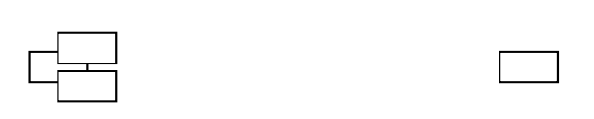
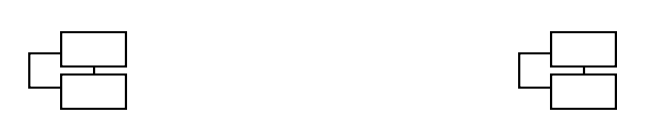
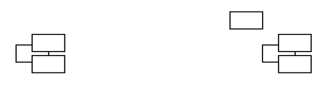
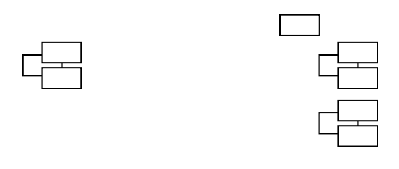

# Chương 17 Ứng dụng của tôi không có kiến trúc

Các ứng dụng tồn tại quá lâu có xu hướng trở nên lộn xộn. Họ có thể đã bắt đầu với một kiến trúc được-cân-nhắc-kỹ-lưỡng, nhưng qua nhiều năm, dưới áp lực về tiến độ, họ có thể đi đến giai đoạn không một ai thực sự hiểu được toàn bộ cấu trúc. Người ta có thể làm việc nhiều năm trong một dự án và không biết các tính năng mới sẽ đi đến đâu; họ chỉ biết những đoạn hack đã được đặt trong hệ thống gần đây. Khi họ thêm các tính năng mới, họ sẽ chuyển đến "điểm hack" vì đó là nơi mà họ hiểu rõ nhất.

Không có biện pháp nào có thể khắc phục dễ dàng tình trạng này và mức độ khẩn cấp của mỗi tình huống rất khác nhau. Trong một số trường hợp, các lập trình viên như đụng phải một bức tường. Rất khó để thêm tính năng mới và điều đó khiến toàn bộ tổ chức rơi vào khủng hoảng. Mọi người được giao nhiệm vụ tìm hiểu xem liệu giữa thiết kế lại hoặc viết lại hệ thống thì cách nào sẽ tốt hơn. Trong các tổ chức khác, hệ thống hoạt động khập khiễng trong nhiều năm. Vâng, phải mất nhiều thời gian hơn mức cần thiết để thêm tính năng mới, nhưng đó chỉ được coi là cái giá của việc kinh doanh. Không ai biết nó có thể tốt hơn bao nhiêu hoặc mất bao nhiêu tiền vì cấu trúc kém.

Khi các nhóm không nhận thức được kiến trúc của họ, nó có xu hướng xuống cấp. Điều gì cản trở sự nhận thức này?

- Hệ thống có thể phức tạp đến mức phải mất nhiều thời gian để có được bức tranh toàn cảnh.
- Hệ thống có thể phức tạp đến mức không có bức tranh toàn cảnh.
- Nhóm đang ở trong một chế độ phản ứng gấp gáp, giải quyết hết trường hợp khẩn cấp này đến trường hợp khẩn cấp khác đến mức họ đánh mất tầm nhìn tổng thể.

Thông thường, nhiều tổ chức sử dụng vai trò kiến trúc sư hệ thống để giải quyết những vấn đề này. Họ thường được giao nhiệm vụ dựng lên bức tranh toàn cảnh và đưa ra các quyết định giúp bảo tồn nó cho cả nhóm. Cách làm này có thể hoạt động, nhưng có một cảnh báo khá rõ ràng. Kiến trúc sư hệ thống phải ở trong nhóm đó, làm việc với các thành viên hàng ngày, nếu không code sẽ rẽ sang hướng khác so với bức tranh toàn cảnh. Điều này có thể xảy ra theo hai hướng: Ai đó có thể đang làm một việc không phù hợp trong code hoặc bản thân bức tranh toàn cảnh có thể cần phải được sửa đổi. Trong một số tình huống tồi tệ nhất mà tôi gặp phải với các nhóm, kiến trúc sư hệ thống có cái nhìn hoàn toàn khác về hệ thống so với các lập trình viên. Điều này thường xảy ra khi kiến trúc sư hệ thống có các trách nhiệm khác và không thể trực tiếp làm việc với code hoặc không trao đổi với các thành viên còn lại của nhóm đủ thường xuyên để thực sự biết những gì đang diễn ra. Kết quả là, việc trao đổi thông tin bị phá vỡ trong toàn bộ tổ chức.

Có một sự thật phũ phàng là kiến trúc hệ thống quá quan trọng để giao cho một số ít người. Có một kiến trúc sư hệ thống cũng tốt, nhưng việc cốt lõi để giữ cho một kiến trúc nguyên vẹn là đảm bảo mọi người trong nhóm biết nó là gì và tất cả đều có trách nhiệm với nó. Mọi người làm việc với code nên biết kiến trúc của nó và những người khác có thể hưởng lợi từ những gì họ học được. Khi mọi người làm việc với cùng một nhóm ý tưởng, trí thông minh hệ thống tổng thể của nhóm sẽ được khuếch đại. Giả sử, nếu bạn có một nhóm gồm 20 người và chỉ có 3 người biết chi tiết về kiến trúc hệ thống, thì 3 người đó phải làm rất nhiều việc để giữ cho 17 người còn lại đi đúng hướng hoặc 17 người còn lại mắc sai lầm do không quen với bức tranh toàn cảnh.

Làm thế nào chúng ta có được bức tranh toàn cảnh về một hệ thống lớn? Có rất nhiều cách để làm điều này. Cuốn sách _Các mẫu mô hình tái cấu trúc hướng đối tượng (Object-Oriented Reengineering Patterns)_, của Serge Demeyer, Stephane Ducasse, và Oscar M. Nierstrasz (Nhà xuất bản Morgan Kaufmann, 2002), chứa một danh sách các kỹ thuật chỉ để giải quyết vấn đề này. Ở đây tôi cũng mô tả một số kỹ thuật khác mạnh mẽ không kém. Nếu bạn thực hành chúng thường xuyên trong một nhóm, chúng sẽ giúp duy trì mối quan tâm về kiến trúc trong nhóm - và đó có lẽ là điều quan trọng nhất bạn có thể làm để bảo tồn kiến trúc. Thật khó để chú ý đến điều gì đó mà bạn không nghĩ đến thường xuyên.

## Kể câu chuyện về hệ thống

Khi làm việc theo nhóm, tôi thường sử dụng một kỹ thuật mà tôi gọi là "kể câu chuyện về hệ thống". Để làm tốt, bạn cần ít nhất hai người. Một người bắt đầu bằng cách hỏi người kia, "Cấu trúc của hệ thống là gì?" Sau đó, người kia cố gắng giải thích kiến trúc của hệ thống chỉ bằng một vài khái niệm, có thể chỉ là hai hoặc ba khái niệm. Nếu bạn là người giải thích, bạn phải giả vờ rằng người kia không biết gì về hệ thống. Chỉ trong một vài câu, bạn phải giải thích các phần của thiết kế là gì và chúng tương tác với nhau như thế nào. Sau đó, bạn nên nói rõ những gì bạn cảm thấy là thiết yếu nhất của hệ thống. Tiếp theo, bạn chọn những điều quan trọng nhất tiếp theo. Bạn tiếp tục cho đến khi trình bày mọi thứ quan trọng về thiết kế lõi của hệ thống.

Khi bạn bắt đầu làm việc này, bạn sẽ nhận thấy một cảm giác kỳ lạ. Để thực sự truyền đạt kiến trúc hệ thống một cách ngắn gọn, trước hết bạn phải đơn giản hóa chúng. Bạn có thể nói, "Cổng lấy các bộ quy tắc từ cơ sở dữ liệu đang hoạt động," nhưng khi bạn nói vậy, một phần trong bạn có thể hét lên, "Không! Cổng lấy các bộ quy tắc từ cơ sở dữ liệu đang hoạt động, nhưng nó cũng lấy chúng từ bộ đang hoạt động hiện tại." Khi bạn nói điều đơn giản hơn, có vẻ như bạn đang nói dối; bạn chỉ không kể toàn bộ câu chuyện. Nhưng bạn đang kể một câu chuyện đơn giản hơn mô tả một kiến trúc dễ-hiểu-hơn. Chẳng hạn, tại sao cổng phải lấy các bộ quy tắc từ nhiều nơi? Sẽ không đơn giản hơn nếu nó được thống nhất?

Tính thực dụng thường giữ lại mọi thứ thay vì khiến chúng trở nên đơn giản, nhưng việc trình bày rõ ràng quan điểm đơn giản cũng có giá trị không nhỏ. Ít nhất, nó giúp mọi người hiểu điều gì là lý tưởng và điều gì là thiết thực. Điều quan trọng khác về kỹ thuật này là nó thực sự buộc bạn phải suy nghĩ về điều gì là quan trọng trong hệ thống. Những điều quan trọng nhất để giao tiếp là gì?

Các nhóm chỉ lạc lối khi hệ thống đang làm việc là một bí ẩn đối với họ. Theo một cách kỳ quặc, việc có một câu chuyện đơn giản về cách thức hoạt động của một hệ thống đóng vai trò như một lộ trình, một cách giúp bạn hiểu rõ hơn khi tìm kiếm những vị trí phù hợp để thêm các tính năng. Nó cũng có thể làm cho một hệ thống bớt đáng sợ hơn rất nhiều.

Trong nhóm của bạn, hãy thường xuyên kể câu chuyện về hệ thống, qua đó bạn chia sẻ quan điểm. Kể nó theo những cách khác nhau. Đánh giá xem khái niệm này có quan trọng hơn khái niệm khác hay không. Khi xem xét các thay đổi đối với hệ thống, bạn sẽ nhận thấy rằng một số thay đổi phù hợp hơn với câu chuyện. Qua đó, họ làm cho câu chuyện ngắn gọn ít giống lời nói dối hơn. Nếu bạn phải chọn giữa hai cách để làm một việc gì đó, thì câu chuyện có thể là một cách hay để xem cách nào sẽ dẫn đến một hệ thống dễ hiểu hơn.

Dưới đây là một ví dụ về cách kể chuyện này trong thực tế. Đây là một phiên thảo luận về JUnit. Nó giả định rằng bạn biết một chút về kiến trúc của JUnit. Nếu không, hãy dành một chút thời gian để xem mã nguồn của JUnit. Bạn có thể tải xuống từ www.junit.org

> ###### Kiến trúc của JUnit là gì?
> JUnit có hai lớp chính. Lớp đầu tiên gọi là `Test` và lớp còn lại gọi là `TestResult`. Người dùng tạo kiểm thử và chạy chúng, truyền vào một `TestResult`. Khi một kiểm thử không vượt qua, nó sẽ báo cho `TestResult` về điều đó. Sau đó, mọi người có thể hỏi `TestResult` về tất cả các lỗi đã xảy ra.
>
> Hãy liệt kê các đơn giản hóa:
> 1. Có nhiều lớp khác trong JUnit. Tôi đang nói rằng `Test` và `TestResult` chỉ là chính bởi vì tôi nghĩ vậy. Đối với tôi, tương tác của chúng là tương tác cốt lõi trong hệ thống. Những người khác cũng có thể có cách nhìn khác về kiến trúc hệ thống.
> 2. Người dùng không tạo đối tượng kiểm thử. Các đối tượng kiểm thử được tạo từ các lớp trường hợp kiểm thử thông qua tương phản.
> 3. Kiểm thử không phải là một lớp; mà là một giao diện. Các kiểm thử chạy trong `JUnit` thường được viết trong các lớp con của lớp có tên `TestCase`, lớp này thực thi lớp `Test`.
> 4. Mọi người thường không hỏi `TestResults` về lỗi khi chạy kiểm thử. `TestResults` có một trình lắng nghe, nó được thông báo bất cứ khi nào `TestResult` nhận được thông tin từ một kiểm thử.
> 5. Báo cáo kiểm thử không chỉ có lỗi: Chúng báo cáo số lần chạy kiểm thử và số lỗi. (Lỗi là sự cố xảy ra trong quá trình kiểm thử mà không được kiểm tra rõ ràng. Thất bại là kiểm tra không thành công.)
>
> Những đơn giản hóa này có cung cấp cho chúng ta bất kỳ thông tin chi tiết nào về cách JUnit có thể đơn giản hơn không? Một chút. Một số framework kiểm thử `xUnit` đơn giản hơn biến `Test` thành một lớp và loại bỏ hoàn toàn `TestCase`. Các framework khác hợp nhất các lỗi và thất bại để chúng được báo cáo theo cùng một cách
>
> Quay trở lại câu chuyện của chúng ta
> _Đó đã là tất cả chưa?_
>
> Chưa. Các kiểm thử có thể được nhóm thành các đối tượng được gọi là bộ (suites). Chúng ta có thể chạy một bộ kiểm thử với kết quả giống như một kiểm thử đơn lẻ. Tất cả các kiểm thử bên trong nó đều chạy và cho biết kết quả kiểm thử khi chúng không thành công.
>
> Chúng ta có những đơn giản hóa nào ở đây?
> 1. `TestSuites` làm được nhiều việc hơn là chỉ nhóm và chạy một tập hợp các kiểm thử. Chúng cũng tạo các thực thể của các lớp có nguồn gốc từ `TestCase` thông qua tương phản.
> 2. Có một cách đơn giản hóa khác, phần còn lại của đơn giản hóa đầu tiên. Các kiểm thử không thực sự tự chạy. Chúng tự chuyển đến lớp `TestResult`, đến lượt nó, gọi lại phương thức thực hiện kiểm thử trên chính kiểm thử đó. Việc qua lại này diễn ra ở mức độ khá thấp. Nghĩ một cách đơn giản sẽ thuật tiện hơn. Nó hơi dối trá, nhưng nó thực sự là cách `JUnit` đã từng sử dụng khi nó đơn giản hơn một chút.
> Đó là tất cả?
> Không. Trên thực tế, `Test` là một giao diện. Có một lớp gọi là `TestCase` thực thi `Test`. Người dùng phân lớp `TestCase` và sau đó viết các bài kiểm tra của họ dưới dạng các phương thức void công khai bắt đầu bằng từ kiểm tra trong lớp con của họ. Lớp `TestSuite` sử dụng tương phản để xây dựng một nhóm các bài kiểm tra có thể chạy trong một lần gọi phương thức chạy của `TestSuite`.

Chúng ta có đi sâu hơn, nhưng những gì tôi đã trình bày cho đến giờ đã giúp bạn có được cảm giác về kỹ thuật này. Chúng tôi bắt đầu bằng một mô tả ngắn gọn. Khi chúng ta đơn giản hóa và loại bỏ sự chi tiết để mô tả một hệ thống, chúng ta đang thực sự trừu tượng hóa. Thông thường, khi chúng ta buộc mình phải truyền đạt một quan điểm rất đơn giản về một hệ thống, chúng ta có thể tìm thấy những khái niệm trừu tượng mới.

Nếu một hệ thống không đơn giản như câu chuyện đơn giản nhất mà chúng ta có thể kể về nó, thì điều đó có nghĩa là nó tệ không? Không. Lúc nào cũng vậy, khi các hệ thống phát triển, chúng trở nên phức tạp hơn. Câu chuyện góp phần hướng dẫn cho chúng ta.

Giả sử rằng chúng ta sẽ thêm một tính năng mới vào `JUnit`. Chúng tôi muốn tạo một báo cáo về tất cả các kiểm thử mà không gọi bất kỳ xác nhận nào khi chúng tôi chạy chúng. Những lựa chọn nào chúng ta đã đưa ra những gì đã được mô tả trong `JUnit`?

Một lựa chọn là thêm một phương thức vào lớp `TestCase` có tên là `buildUsageReport` chạy từng phương thức và sau đó xây dựng một báo cáo về tất cả các phương thức không gọi phương thức `asser (xác nhận)`. Đó có phải là một cách hay để thêm tính năng này không? Nó sẽ làm gì với câu chuyện của chúng ta? Chà, nó sẽ thêm một "lời nói dối thiếu sót" nhỏ khác từ mô tả ngắn gọn nhất của chúng tôi về hệ thống:

> JUnit có hai lớp chính. Lớp đầu tiên gọi là `Test` và lớp còn lại gọi là `TestResult`. Người dùng tạo kiểm thử và chạy chúng, truyền vào một `TestResult`. Khi một kiểm thử không vượt qua, nó sẽ báo cho `TestResult` về điều đó. Sau đó, mọi người có thể hỏi `TestResult` về tất cả các thất bại đã xảy ra.

Có vẻ như `Test` hiện có trách nhiệm hoàn toàn khác: tạo báo cáo, điều mà chúng tôi chưa bao giờ đề cập đến.

Điều gì sẽ xảy ra nếu chúng ta thêm tính năng này theo một cách khác? Chúng tôi có thể thay đổi sự tương tác giữa `TestCase` và `TestResult` để `TestResult` nhận được số lượng xác nhận chạy bất cứ khi nào chạy kiểm thử. Sau đó, chúng ta có thể tạo một lớp xây dựng báo cáo và đăng ký nó với `TestResult` với tư cách là người nghe. Điều đó ảnh hưởng đến câu chuyện của hệ thống như thế nào? Nó có thể là một lý do tốt để khái quát hóa nó một chút. Các kiểm thử không chỉ cho `TestResults` biết về số lần thất bại; nó cũng cho biết về số lỗi, số lần chạy kiểm thử và số lần chạy xác nhận. Chúng ta có thể thay đổi câu chuyện ngắn gọn thành thế này:

> JUnit có hai lớp chính. Lớp đầu tiên gọi là `Test` và lớp còn lại gọi là `TestResult`. Người dùng tạo kiểm thử và chạy chúng, truyền vào một `TestResult`. Khi một kiểm thử không vượt qua, nó sẽ báo cho `TestResult` về điều đó. Sau đó, mọi người có thể hỏi `TestResult` về tất cả các **thông tin** về tất cả các kiểm thử đã chạy.

Đã tốt hơn chưa? Thành thật mà nói, tôi thích bản gốc hơn, phiên bản mô tả bản ghi thất bại. Đối với tôi, đó là một trong những hành vi cốt lõi của `JUnit`. Nếu chúng ta thay đổi code để `TestResults` ghi lại số lượng xác nhận đã chạy, thì chúng ta vẫn nói dối một chút, nhưng chúng ta đã che đậy thông tin khác mà chúng tôi gửi từ kiểm thử đến kết quả kiểm thử. Giải pháp thay thế là, đặt trách nhiệm chạy một loạt trường hợp và xây dựng báo cáo từ chúng trên `TestCase`, sẽ là một lời nói dối táo bạo hơn: Chúng ta hoàn toàn không nói về trách nhiệm bổ sung này của `TestCase`. Tốt hơn hết là chúng ta nên có một báo cáo kiểm thử gồm số lượng xác nhận chạy khi chúng được thực thi. Câu chuyện đầu tiên của chúng ta được khái quát hóa hơn một chút nhưng ít nhất về cơ bản nó vẫn là sự thật. Điều đó có nghĩa là những thay đổi của chúng ta đang thực hiện phù hợp hơn với kiến trúc của hệ thống.

## CRC trần

Khi hướng đối tượng bắt đầu xuất hiện, rất nhiều người phải vật lộn với vấn đề thiết kế. Thật khó để làm quen với hướng đối tượng khi phần lớn kinh nghiệm lập trình của bạn là sử dụng các ngôn ngữ thủ tục. Nói một cách đơn giản, cách bạn nghĩ về code khá khác biệt. Tôi nhớ lần đầu tiên khi có người cố gắng cho tôi xem một thiết kế hướng đối tượng trên một tờ giấy. Tôi nhìn vào tất cả các hình dạng và đường nét và nghe mô tả, nhưng câu hỏi mà tôi vẫn muốn hỏi là "`Main()` ở đâu? Đâu là điểm khởi đầu cho tất cả những thứ gọi là đối tượng mới này?" Tôi ngơ ngác một lúc, nhưng rồi nó bắt đầu nhảy số. Tuy nhiên, vấn đề không chỉ của mình tôi. Có vẻ như hầu hết ngành công nghiệp đang phải vật lộn với những vấn đề tương tự gần như cùng một lúc. Thành thật mà nói, những người mới trong ngành hàng ngày phải đối mặt với vấn đề trên khi họ gặp code hướng đối tượng lần đầu tiên.

Vào những năm 1980, Ward Cunningham và Kent Beck đã giải quyết vấn đề này. Họ đang cố gắng giúp mọi người bắt đầu nghĩ về thiết kế dưới dạng các đối tượng. Vào thời điểm đó, Ward đang sử dụng một công cụ có tên là Hypercard, cho phép bạn tạo các thẻ trên màn hình máy tính và tạo liên kết giữa chúng. Đột nhiên, một tầm nhìn thấu suốt được mở ra. Tại sao không sử dụng thẻ chỉ mục thực sự để đại diện cho các lớp? Nó sẽ làm cho chúng hữu hình và dễ dàng để thảo luận. Chúng ta có nên nói về lớp `Transaction` không? Chắc chắn rồi, đây là thẻ của nó - trên đó chúng ta có trách nhiệm và các cộng tác viên của nó.

CRC là viết tắt của Lớp (Class), Trách nhiệm (Responsibility) và Collaborations (Cộng tác). Bạn sử dụng một tấm thẻ và điền tên lớp, trách nhiệm của nó và danh sách cộng tác viên của nó (các lớp khác mà lớp này giao tiếp). Nếu bạn nghĩ rằng một trách nhiệm không thuộc về một lớp cụ thể, hãy gạch bỏ nó và viết nó trên một thẻ lớp khác hoặc tạo một thẻ lớp mới hoàn toàn.

Mặc dù CRC đã trở nên khá phổ biến trong một thời gian, nhưng cuối cùng đã có một sự chuyển dịch lớn về phía các sơ đồ. Gần như tất cả mọi người dạy hướng đối tượng trên hành tinh này đều có ký hiệu riêng cho các lớp và các mối quan hệ. Cuối cùng, đã có một nỗ lực lớn trong nhiều năm để hợp nhất các ký hiệu. UML chính là kết quả, và nhiều người cho rằng nó đã kết thúc bất kỳ cuộc nói chuyện nào về cách thiết kế hệ thống. Mọi người bắt đầu nghĩ rằng ký hiệu là một phương pháp, rằng UML là một cách để phát triển các hệ thống: Vẽ thật nhiều sơ đồ, rồi viết code sau đó. Phải mất một thời gian để mọi người nhận ra rằng mặc dù UML là có một bộ ký hiệu tốt cho các hệ thống tài liệu, nhưng nó không phải là cách duy nhất để làm việc với các ý tưởng mà chúng ta sử dụng để xây dựng các hệ thống. Vào lúc này, tôi biết rằng có một cách tốt hơn nhiều để trao đổi về thiết kế trong một nhóm. Đó là một kỹ thuật mà một số người bạn làm kiểm thử của tôi gọi là CRC Trần vì nó giống như CRC, ngoại trừ việc bạn không viết trên thẻ. Thật không may, nó không hề dễ dàng để mô tả trong một cuốn sách. Sau đây là nỗ lực tốt nhất của tôi.

Vài năm trước, tôi gặp Ron Jeffries tại một hội nghị. Anh ấy hứa sẽ chỉ cho tôi cách anh ấy dùng để giải thích kiến trúc hệ thống qua việc sử dụng các tấm thẻ, khiến cho chúng tương tác với nhau một cách sinh động và đáng nhớ. Và chắc chắn là anh ấy đã giữ lời hứa. Đây là cách mà nó hoạt động. Người mô tả hệ thống sử dụng một tập hợp các thẻ chỉ mục trống và đặt từng thẻ một lên bàn. Anh ấy hoặc cô ấy có thể di chuyển các thẻ, chỉ vào chúng hoặc làm bất cứ điều gì khác cần thiết để truyền đạt các đối tượng điển hình trong hệ thống và cách chúng tương tác.

Dưới đây là một ví dụ, mô tả về một hệ thống bỏ phiếu trực tuyến:

"Đây là cách hệ thống bỏ phiếu thời gian thực hoạt động. Đây là phiên khách hàng" (chỉ vào thẻ).

"Mỗi phiên có hai kết nối, một kết nối đến và một kết nối đi" (đặt từng thẻ trên thẻ ban đầu và lần lượt chỉ vào từng thẻ).

"Khi hệ thống khởi động, một phiên sẽ được tạo trên máy chủ ở đây" (đặt thẻ bên phải xuống).

"Mỗi phiên máy chủ cũng có hai kết nối" (đặt hai thẻ biểu thị các kết nối trên thẻ bên phải xuống)

"Khi một phiên máy chủ xuất hiện, nó sẽ đăng ký với người quản lý phiếu bầu (đặt thẻ cho người quản lý phiếu bầu phía trên phiên máy chủ)

"Chúng ta có thể có nhiều phiên ở phía máy chủ" (đặt một bộ thẻ khác cho phiên máy chủ mới và các kết nối của nó)

"Khi khách hàng bỏ phiếu, phiếu bầu sẽ được gửi đến phiên ở phía máy chủ" (chuyển động bằng tay từ một trong các kết nối ở phiên phía máy khách đến kết nối ở phiên phía máy chủ).

"Phiên máy chủ trả lời bằng một xác nhận và sau đó ghi lại phiếu bầu với trình quản lý phiếu bầu" (trỏ từ phiên máy chủ trở lại phiên máy khách, sau đó trỏ từ phiên máy chủ đó đến trình quản lý phiếu bầu).

"Sau đó, trình quản lý phiếu bầu yêu cầu mỗi phiên máy chủ thông báo cho phiên máy khách của mình số lượng phiếu bầu mới là bao nhiêu" (lần lượt chỉ từ thẻ trình quản lý phiếu bầu cho từng phiên máy chủ).

Tôi chắc chắn rằng phần mô tả này còn thiếu điều gì đó vì tôi không thể di chuyển các quân bài trên bàn hoặc chỉ vào chúng theo cách mà tôi sẽ làm nếu chúng tôi ngồi cùng bàn với nhau. Tuy nhiên, kỹ thuật này là khá mạnh mẽ. Nó làm cho các phần của một hệ thống thành những thứ hữu hình. Bạn không cần phải sử dụng thẻ; bất cứ thứ gì tiện dụng đều được. Điều quan trọng là bạn có thể sử dụng chuyển động và vị trí để chỉ ra cách các bộ phận của hệ thống tương tác với nhau. Thường thì hai điều đó có thể làm cho các tình huống liên quan dễ nắm bắt hơn. Vì một số lý do, những phiên thảo luận này cũng làm cho thiết kế hệ thống trở nên dễ nhớ hơn.

Chỉ có hai hướng dẫn trong CRC trần:
1. Các thẻ đại diện cho các thực thể, không phải các lớp.
2. Các thẻ xếp chồng lên nhau để hiển thị bộ sưu tập của chúng

## Giám sát cuộc hội thoại

Trong code kế thừa, thật hấp dẫn để bỏ qua sự trừu tượng. Khi tôi xem xét bốn hoặc năm lớp với khoảng một nghìn dòng code cho mỗi lớp, tôi sẽ cố gắng tìm ra điều gì phải thay đổi thay vì nghĩ đến việc thêm các lớp mới.

Bởi vì chúng ta quá phân tâm khi cố gắng tìm ra điều đó, và thường bỏ lỡ những điều có thể cho chúng ta thêm ý tưởng. Đây là một ví dụ. Tôi đã từng làm việc với một số thành viên trong nhóm và họ đang thực hiện bài tập tạo ra một đoạn code lớn có thể thực thi được từ nhiều luồng. Đoạn code này khá phức tạp và có nhiều khả năng dẫn đến bế tắc. Chúng tôi nhận ra rằng nếu có thể đảm bảo rằng các tài nguyên được khóa và mở khóa theo một thứ tự cụ thể, thì có thể tránh được bế tắc. Chúng tôi bắt đầu xem xét cách chúng tôi có thể sửa đổi code để kích hoạt tính năng này. Trong suốt khoảng thời gian đó, chúng tôi đã nói về kế hoạch mới về khóa này và tìm cách duy trì số đếm trong các mảng để kích hoạt nó. Khi một trong những lập trình viên khác bắt đầu viết code, tôi nói: "Đợi đã, chúng ta đang nói về chính sách khóa phải không? Tại sao chúng ta không tạo một lớp có tên là `LockingPolicy` và duy trì số đếm trong đó? Chúng ta có thể sử dụng các tên phương thức thực sự mô tả những gì chúng ta đang cố gắng thực hiện và điều đó sẽ rõ ràng hơn so với dùng một mảng."

Điều tệ hại là nhóm đó không hề thiếu kinh nghiệm. Có một số thành viên còn nắm rất rõ về cơ sở code, nhưng có điều gì đó mê hoặc về những khối code thủ tục lớn: Chúng dường như cầu xin nhiều hơn nữa.

Lắng nghe các cuộc trò chuyện về thiết kế của bạn. Các khái niệm bạn đang sử dụng trong cuộc trò chuyện có giống với các khái niệm dùng trong code không? Tôi không mong đợi chúng được áp dụng toàn bộ. Phần mềm phải đáp ứng các ràng buộc mạnh mẽ hơn là chỉ dễ nói về nó, nhưng nếu không có sự giao thoa mạnh mẽ giữa các cuộc trò chuyện và code, thì bạn phải tự đặt câu hỏi tại sao, điều đó rất quan trọng. Câu trả lời thường là sự kết hợp của hai điều: Code không thích ứng với cách hiểu của nhóm hoặc nhóm cần hiểu nó theo cách khác. Trong mọi trường hợp, việc điều chỉnh theo các khái niệm mà mọi người đang sử dụng một cách tự nhiên để mô tả thiết kế là rất hiệu quả. Khi mọi người nói về thiết kế, họ đang cố gắng làm cho người khác hiểu họ. Hãy đưa những hiểu biết đó vào code.

Trong chương này, tôi đã mô tả một số kỹ thuật để khám phá và truyền đạt kiến trúc của hệ thống lớn hiện có. Nhiều kỹ thuật cũng là những cách hoàn toàn tốt để thiết kế các hệ thống mới. Thiết kế là thiết kế, bất kể nó diễn ra khi nào trong chu kỳ phát triển. Một trong những sai lầm tồi tệ nhất mà một nhóm có thể mắc phải là cảm thấy việc thiết kế đã kết thúc tại một thời điểm nào đó trong quá trình phát triển. Nếu thiết kế đã “kết thúc” và mọi người vẫn đang tiếp tục thực hiện các thay đổi, thì rất có thể code mới sẽ xuất hiện ở những chỗ khó hiểu và các lớp sẽ phình to vì không ai cảm thấy thoải mái khi phát triển khái niệm trừu tượng mới. Đó chắc chắn là cách khiến một hệ thống cũ trở nên tồi tệ hơn.
