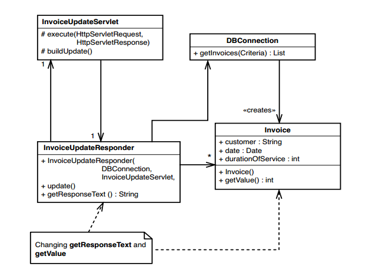
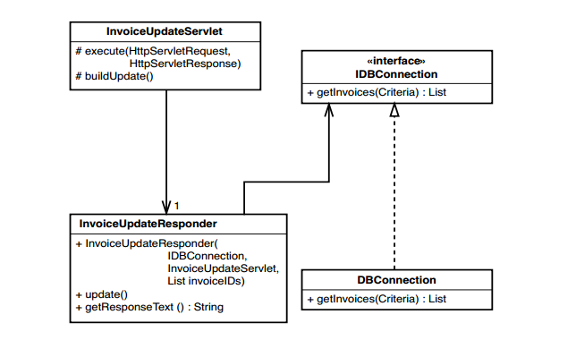

# Chương 2 Làm việc với phản hồi

Những thay đổi trong một hệ thống có thể được thực hiện theo hai cách chính. Tôi thích gọi chúng là _Chỉnh sửa và Cầu nguyện_ và _Bao phủ và Sửa đổi_. Thật không may, _Chỉnh sửa và Cầu nguyện_ gần như là tiêu chuẩn của ngành. Khi bạn sử dụng _Chỉnh sửa và Cầu nguyện_, bạn cẩn thận lập kế hoạch cho những thay đổi bạn sẽ thực hiện, bạn đảm bảo rằng bạn hiểu code mà bạn sẽ sửa đổi, sau đó bạn bắt đầu thực hiện các thay đổi. Khi hoàn tất, bạn chạy hệ thống để xem liệu thay đổi đã được kích hoạt hay chưa, sau đó bạn xem xét kỹ hơn để đảm bảo rằng bạn không làm hỏng bất kỳ thứ gì. Việc xem xét xung quanh là điều cần thiết. Khi bạn thực hiện các thay đổi của mình, bạn đang hy vọng và cầu nguyện, sau đó dành thêm thời gian khi đã hoàn thành để đảm bảo rằng bạn đã thực hiện đúng.

Nhìn bề ngoài, _Chỉnh sửa và Cầu nguyện_ có vẻ giống "làm việc cẩn thận", một cách làm rất chuyên nghiệp. Sự "cẩn thận" mà bạn thực hiện luôn được đặt lên hàng đầu và bạn càng cẩn thận hơn khi thực hiện những thay đổi mang tính xâm lấn vì rất có thể xảy ra nhiều sai sót. Nhưng để an toàn thì cẩn thận thôi là không đủ. Tôi không nghĩ rằng bất kỳ ai trong chúng ta sẽ chọn một bác sĩ phẫu thuật mổ bằng dao cắt bơ chỉ vì anh ta làm việc cẩn thận. Thay đổi phần mềm hiệu quả, giống như phẫu thuật hiệu quả, thực sự cần đến các kỹ năng sâu hơn. Làm việc cẩn thận sẽ không giúp được gì nhiều cho bạn nếu bạn không sử dụng các công cụ và kỹ thuật phù hợp.

_Bao phủ và Sửa đổi_ là một cách khác để thực hiện thay đổi. Ý tưởng đằng sau đó là chúng ta có thể làm việc với một _mạng lưới an toàn_ khi thay đổi phần mềm. Lưới an toàn sử dụng ở đây không phải là thứ mà chúng ta đặt bên dưới bàn để đỡ nếu chúng ta ngã khỏi ghế. Thay vào đó, nó giống như một chiếc áo choàng được phủ lên code mà chúng ta đang làm việc để đảm bảo rằng những thay đổi kém chất lượng không bị rò rỉ ra ngoài và ảnh hưởng đến phần còn lại của phần mềm. Bao phủ phần mềm có nghĩa là bao phủ nó bằng các bài kiểm thử. Khi chúng ta có một tập hợp các bài kiểm thử tốt xung quanh một đoạn code, chúng ta có thể thực hiện các thay đổi và tìm ra rất nhanh xem chúng có tác động tốt hay xấu. Chúng tôi vẫn áp dụng cách làm cẩn thận tương tự, nhưng với phản hồi nhận được, chúng tôi có thể thực hiện các thay đổi cẩn thận hơn.

Nếu bạn không quen với việc sử dụng kiểm thử kiểu này, thì tất cả những điều trên nghe có vẻ hơi kỳ quặc. Thông thường, kiểm thử được viết và thực hiện sau phát triển. Một nhóm lập trình viên viết code và một nhóm kiểm thử sẽ chạy thử code, sau đó kết luận xem nó có đáp ứng một số đặc điểm kỹ thuật hay không. Trong số tổ chức truyền thống, đây là cách thông thường để phát triển phần mềm. Nhóm có thể nhận được phản hồi, nhưng thời gian vòng phản hồi rất lớn. Thường là trong vài tuần hoặc vài tháng, sau đó những người trong nhóm khác mới cho bạn biết liệu bạn đã làm đúng hay chưa.

Kiểm thử thực hiện theo cách này thực sự là "kiểm thử để cố gắng chứng minh tính đúng đắn". Mặc dù đó là một mục tiêu tốt, nhưng các kiểm thử cũng có thể được sử dụng theo một cách rất khác. Chúng ta có thể thực hiện "kiểm thử để phát hiện sự thay đổi”.

Theo thuật ngữ truyền thống, điều này được gọi là kiểm thử hồi quy. Chúng ta định kỳ chạy kiểm thử với những hành vi tốt đã biết, kiểm tra và tìm hiểu xem phần mềm của chúng ta có còn hoạt động như trước đây hay không.

Khi bạn có kiểm thử xung quanh vùng mà bạn sẽ thực hiện thay đổi, chúng sẽ hoạt động như một bàn kẹp cho phần mềm. Bạn có thể cố định hầu hết các hành vi và biết rằng bạn chỉ đang thay đổi những gì bạn dự định.

(Bàn kẹp cho phần mềm)

Kiểm thử hồi quy là một ý tưởng tuyệt vời. Tại sao mọi người không làm điều đó thường xuyên hơn? Có một vấn đề nhỏ với kiểm thử hồi quy. Thường khi thực hành nó, mọi người hay thực hiện ở giao diện ứng dụng. Không quan trọng đó là ứng dụng web, ứng dụng dòng lệnh hay ứng dụng dựa trên GUI; kiểm thử hồi quy theo truyền thống được coi là một phong cách kiểm thử cấp ứng dụng. Nhưng điều này thật đáng tiếc. Thông tin phản hồi chúng tôi có thể nhận được từ nó là rất hữu ích. Nó trả tiền để làm điều đó ở mức độ chi tiết hơn.

Hãy thực hiện một thí nghiệm nhỏ về trong suy nghĩ. Chúng ta đang bước vào một chức năng lớn chứa một lượng lớn logic phức tạp. Chúng ta phân tích, chúng ta nghĩ, chúng ta nói chuyện với những người biết nhiều về đoạn code đó hơn chúng ta, và sau đó chúng ta thực hiện thay đổi. Chúng ta muốn đảm bảo rằng thay đổi không phá vỡ bất cứ điều gì, nhưng chúng ta làm điều đó như thế nào? May mắn thay, chúng ta có một nhóm chất lượng với bộ kiểm tra hồi quy có thể chạy qua đêm. Chúng ta gọi điện và yêu cầu họ lên lịch chạy thử, và họ nói rằng, vâng, họ có thể chạy kiểm thử qua đêm, nhưng thật tốt là chúng ta đã gọi sớm. Các nhóm khác thường cố gắng lên lịch chạy hồi quy vào giữa tuần và nếu chúng ta đợi lâu hơn, có thể không có khung thời gian và máy móc cho chúng ta. Chúng ta thở phào nhẹ nhõm rồi quay lại làm việc. Còn khoảng năm thay đổi nữa để thực hiện giống như thay đổi cuối cùng. Tất cả chúng đều ở những khu vực phức tạp như nhau. Và chúng ta không đơn độc. Chúng ta biết rằng một số khác cũng đang thực hiện các thay đổi.

Sáng hôm sau, chúng tôi nhận được một cú điện thoại. Trong quá trình kiểm thử cho chúng tôi, Daiva cho biết kiểm thử AE1021 và AE1029 đã thất bại vào đêm qua. Cô ấy không chắc liệu đó có phải do những thay đổi của chúng tôi hay không, nhưng cô ấy gọi cho chúng tôi vì cô ấy biết chúng tôi sẽ lo việc đó cho cô ấy. Chúng tôi sẽ gỡ lỗi và xem liệu các lỗi này là do một trong những thay đổi của chúng tôi hay của người khác.

Điều này có nghe có thực không? Thật không may, nó rất thực tế.

Hãy xem xét một kịch bản khác.

Chúng tôi cần thực hiện thay đổi đối với một chức năng khá dài và phức tạp. May mắn thay, chúng tôi tìm thấy một tập hợp các kiểm thử đơn vị dành cho nó. Những người cuối cùng chạm vào code đã viết một tập khoảng 20 kiểm thử đơn vị để tìm hiểu nó một cách kỹ lưỡng. Chúng tôi chạy chúng và phát hiện ra rằng tất cả chúng đều vượt qua. Tiếp theo, chúng tôi xem qua các kiểm thử để hiểu hành vi thực tế của code là gì.

Chúng tôi đã sẵn sàng để thực hiện thay đổi của mình, nhưng sau đó nhận ra rằng khá khó để tìm ra cách thay đổi nó. Code này không rõ ràng và chúng tôi thực sự muốn hiểu rõ hơn về code này trước khi thực hiện thay đổi của mình. Các kiểm thử không nắm bắt mọi thứ, vì vậy chúng tôi muốn làm cho code thật rõ ràng để có thể tự tin hơn vào thay đổi của mình. Bên cạnh đó, chúng tôi không muốn bản thân hoặc bất kỳ ai khác phải trải qua công việc chúng tôi đang làm để cố gắng hiểu nó. Thật sự lãng phí thời gian!

Chúng tôi bắt đầu tái cấu trúc một chút. Chúng tôi trích xuất một số phương thức và di chuyển một số logic điều kiện. Sau mỗi thay đổi nhỏ mà chúng tôi thực hiện, chúng tôi chạy lại tập kiểm thử đơn vị nhỏ đó. Chúng vượt qua hầu hết mọi lần chúng tôi chạy chúng. Một vài phút trước, chúng tôi đã mắc lỗi và đảo ngược logic theo một điều kiện, nhưng kiểm thử không thành công và chúng tôi đã khôi phục sau khoảng một phút. Khi chúng tôi tái cấu trúc xong, code đã rõ ràng hơn nhiều. Chúng tôi thực hiện thay đổi mình đặt ra và tin tưởng rằng điều đó là đúng. Chúng tôi đã thêm một số kiểm thử để xác minh hành vi mới. Các lập trình viên tiếp theo làm việc với đoạn code này sẽ tiếp cận dễ hơn và có các kiểm thử về chức năng của nó.

Bạn muốn có phản hồi trong một phút hay qua đêm? Kịch bản nào hiệu quả hơn?

Kiểm thử đơn vị là một trong những thành phần quan trọng nhất trong công việc code kế thừa. Hệ thống phân cấp mà các kiểm thử hồi quy cung cấp rất tuyệt vời, nhưng các kiểm thử nhỏ, cục bộ là vô giá. Chúng có thể cung cấp cho bạn thông tin phản hồi khi bạn phát triển và cho phép bạn tái cấu trúc an toàn hơn nhiều.

## Kiểm thử đơn vị là gì?

Thuật ngữ kiểm thử đơn vị có một lịch sử lâu dài trong phát triển phần mềm. Khái niệm phổ biến nhất về kiểm thử đơn vị là ý tưởng cho rằng chúng là các kiểm thử tách biệt các thành phần riêng lẻ trong phần mềm. Các thành phần là gì? Có nhiều định nghĩa khác nhau, nhưng trong kiểm thử đơn vị, chúng ta thường quan tâm đến các đơn vị hành vi nhỏ nhất của một hệ thống. Trong lập trình thủ tục, các đơn vị thường là hàm. Trong lập trình hướng đối tượng, các đơn vị là các lớp

> Kiểm thử khai thác (Test Harness)
> Trong cuốn sách này, tôi sử dụng thuật ngữ _kiểm thử khai thác_ như một thuật ngữ chung cho code kiểm thử chúng tôi viết dùng trong một số phần mềm và code cần thiết để chạy chúng. Chúng tôi có thể sử dụng nhiều loại kiểm thử khai thác khác nhau trong code của mình. Trong Chương 5, _Công cụ_, tôi thảo luận về framework kiểm thử xUnit và framework FIT. Cả hai đều có thể được sử dụng để thực hiện kiểm thử mà tôi mô tả trong cuốn sách này.

Chúng ta có thể chỉ kiểm thử một hàm hoặc một lớp được không? Trong các hệ thống thủ tục, thường khó để kiểm thử được hàm một cách độc lập. Các hàm cấp cao nhất gọi các hàm thấp hơn, các hàm này lại gọi các hàm khác, tiếp tục như vậy cho đến cấp thấp nhất. Trong các hệ thống hướng đối tượng, việc kiểm thử các lớp một cách cô lập sẽ dễ dàng hơn một chút, nhưng thực tế là các lớp thường không tồn tại trong sự cô lập. Thử nhớ lại tất cả các lớp mà bạn đã từng viết mà không sử dụng các lớp khác. Chúng khá hiếm phải không? Thông thường chúng là các lớp dữ liệu nhỏ hoặc các lớp cấu trúc dữ liệu như ngăn xếp (stacks) và hàng đợi (queue) (và thậm chí chúng vẫn có thể sử dụng các lớp khác).

Kiểm thử độc lập là một phần quan trọng trong định nghĩa của kiểm thử đơn vị, nhưng tại sao nó lại quan trọng? Rốt cuộc, nhiều lỗi có thể xảy ra khi các thành phần được tích hợp lại với nhau. Không phải các kiểm thử lớn gồm nhiều chức năng của code quan trọng hơn sao? Chà, chúng rất quan trọng, tôi không phủ nhận điều đó, nhưng có một vài vấn đề với các kiểm thử lớn:

- **Khoanh vùng lỗi** — Khi các kiểm thử tiến xa hơn so với những gì chúng kiểm tra, sẽ khó xác định ý nghĩa của một kiểm thử thất bại. Thông thường, phải mất nhiều công sức để xác định nguồn gốc của kiểm thử lỗi. Bạn phải xem xét các đầu vào của kiểm thử, xem xét lỗi và xác định vị trí xảy ra lỗi trên đường dẫn từ đầu vào đến đầu ra. Vâng, chúng tôi cũng phải làm điều đó với kiểm thử đơn vị, nhưng thường thì công việc này rất vặt vãnh.

- **Thời gian chạy** — Các kiểm thử lớn có xu hướng mất nhiều thời gian hơn để chạy. Điều này có xu hướng làm nản lòng mỗi lần chạy kiểm thử. Các kiểm thử mất quá nhiều thời gian để chạy thường sẽ không được chạy.

- **Độ phủ** — Thật khó để thấy mối liên hệ giữa một đoạn code và các giá trị nó thực hiện. Chúng ta thường có thể tìm hiểu xem một đoạn code có được thực thi hay không bằng cách sử dụng các công cụ kiểm tra độ phủ phù hợp, nhưng khi chúng ta thêm code mới, chúng ta có thể phải thực hiện nhiều công việc để tạo các kiểm thử cấp cao thực hiện code mới.

> Một trong những điều khó chịu nhất về các kiểm thử lớn là chúng ta có thể khoanh vùng lỗi nếu chạy kiểm thử thường xuyên hơn, nhưng điều này rất khó thực hiện. Nếu chúng ta chạy kiểm thử và chúng vượt qua, sau đó chúng ta thực hiện một thay đổi nhỏ và chúng không vượt qua, thì chúng ta biết chính xác vấn đề đã xảy ra ở đâu. Đó là điều chúng ta đã làm trong lần thay đổi nhỏ cuối cùng đó. Chúng ta có thể khôi phục thay đổi và thử lại. Nhưng với các kiểm thử lớn, thời gian thực hiện có thể quá dài; xu hướng thường gặp là tránh chạy kiểm thử quá thường xuyên chỉ để khoanh vùng lỗi.

Các kiểm thử đơn vị bù đắp những khiếm khuyết mà các kiểm thử lớn không làm được. Chúng ta có thể kiểm thử các đoạn code một cách độc lập; chúng ta có thể nhóm các kiểm thử lại để có thể chạy một số kiểm thử trong các điều kiện này và một số khác trong những điều kiện khác. Với chúng, chúng ta có thể khoanh vùng lỗi một cách nhanh chóng. Nếu chúng ta nghĩ rằng có lỗi trong một số đoạn code cụ thể và chúng ta có thể sử dụng nó trong kiểm thử khai thác, chúng tôi thường có thể nhanh chóng viết code kiểm thử để xem liệu có thực sự có lỗi hay không.

Dưới đây là những phẩm chất của bài kiểm thử đơn vị tốt:

1. Chúng chạy nhanh.
2. Chúng giúp chúng ta khoanh vùng các vấn đề.

Trong ngành này, mọi người thường nói đi nói lại về việc liệu các kiểm thử cụ thể có phải là kiểm thử đơn vị hay không. Một kiểm thử có thực sự là kiểm thử đơn vị không nếu nó sử dụng một lớp sản phẩm khác? Tôi nhắc lại hai phẩm chất: Kiểm thử đó có chạy nhanh không? Nó có giúp chúng ta khoanh vùng lỗi một cách nhanh chóng không? Đương nhiên, có một số ngoại lệ. Một số kiểm thử có thể lớn và sử dụng nhiều lớp cùng lúc. Trên thực tế, chúng có thể là những kiểm thử tích hợp nhỏ. Bản thân chúng có vẻ chạy nhanh, nhưng điều gì xảy ra khi bạn chạy tất cả chúng cùng nhau? Khi bạn có một kiểm thử chạy trên một lớp cùng với một số cộng tác viên của nó, nó có xu hướng nở to ra. Nếu bạn chưa dành thời gian để tạo một lớp có thể khởi tạo riêng biệt trong kiểm thử khai thác, thì sẽ dễ dàng như thế nào khi bạn thêm nhiều code hơn? Nó không bao giờ dễ dàng hơn. Mọi người sẽ tắt nó đi. Theo thời gian, kiểm thử có thể mất tới 1/10 giây để thực hiện.

> Một kiểm thử đơn vị mất 1/10 giây để thực hiện là một kiểm thử đơn vị chậm

Đúng vậy, tôi rất nghiêm túc. Tại thời điểm viết cuốn sách này, 1/10 giây là một kỷ nguyên cho một kiểm thử đơn vị. Hãy làm một phép toán. Nếu bạn có một dự án với 3.000 lớp và có khoảng 10 kiểm thử cho mỗi lớp, thì sẽ có 30.000 kiểm thử. Sẽ mất bao lâu để chạy tất cả các kiểm thử đó nếu mỗi kiểm thử mất 1/10 giây? Gần một giờ. Đó là một thời gian dài để chờ đợi phản hồi. Bạn không có 3.000 lớp? Hãy chia đôi ra. Vẫn còn nửa tiếng. Mặt khác, nếu mỗi kiểm thử mất 1/100 giây thì sao? Bây giờ chúng ta đang nói về 5 đến 10 phút. Khi chúng mất nhiều thời gian như vậy, tôi đảm bảo rằng tôi sẽ sử dụng một tập con trong đó để làm việc, nhưng tôi không ngại chạy tất cả chúng sau mỗi vài giờ.

Với sự trợ giúp của Định luật Moore, tôi hy vọng sẽ thấy phản hồi kiểm thử gần như ngay lập tức đối với cả những hệ thống lớn nhất trong đời tôi. Tôi nghi ngờ rằng làm việc trong những hệ thống đó sẽ giống như làm việc với code có thể cắn trả. Nó sẽ có khả năng cho chúng ta biết khi nào nó đang bị thay đổi theo chiều hướng xấu.

> Kiểm thử đơn vị chạy nhanh. Nếu chúng không chạy nhanh, chúng không phải là kiểm thử đơn vị.
>
> Một số loại kiểm thử khác thường bị nhầm lẫn là kiểm thử đơn vị. Một kiểm thử không phải là một kiểm thử đơn vị khi:
> 1. Chúng giao tiếp với cơ sở dữ liệu.
> 2. Chúng giao tiếp qua mạng.
> 3. Chúng chạm vào hệ thống tập tin.
> 4. Bạn phải thực hiện những điều đặc biệt đối với môi trường của mình (chẳng hạn như chỉnh sửa tệp cấu hình) để chạy chúng.
>
> Những kiểm thử làm những điều này không phải là xấu. Thường thì chúng đáng để viết và bạn thường sẽ viết chúng trong các kiểm thử khai thác đơn vị. Tuy nhiên, điều quan trọng là có thể tách chúng ra khỏi các kiểm thử đơn vị thật sự, để bạn có thể giữ một tập hợp các kiểm thử mà bạn có thể chạy _nhanh_ bất cứ khi nào bạn thực hiện các thay đổi.

## Kiểm thử cấp cao

Các kiểm thử đơn vị rất tuyệt, nhưng vẫn có chỗ dành cho các kiểm thử cấp cao, chúng bao gồm các kịch bản và tương tác trong một ứng dụng. Các kiểm thử cấp cao có thể được sử dụng để xác định hành vi cho một tập hợp các lớp tại một thời điểm. Khi bạn có thể làm điều đó, thường thì bạn có thể viết kiểm thử cho các lớp riêng lẻ dễ dàng hơn.

## Độ phủ kiểm thử

Vậy làm thế nào để tiến hành các thay đổi với dự án được kế thừa? Điều đầu tiên cần lưu ý là, nếu được lựa chọn, sẽ luôn an toàn hơn nếu có các kiểm thử xung quanh những thay đổi mà chúng ta thực hiện. Khi chúng ta thay đổi code, chúng có thể gây ra lỗi; xét cho cùng, tất cả chúng ta đều là con người. Nhưng khi chúng ta phủ code của mình bằng kiểm thử trước khi thay đổi code, chúng ta có nhiều khả năng phát hiện được mọi lỗi nào mà chúng ta có thể mắc phải.

Hình 2.1 cho chúng ta thấy một tập hợp nhỏ các lớp. Chúng ta muốn thay đổi phương thức `getResponseText` của `InvoiceUpdateResponder` và phương thức `getValue` của `Invoice`. Những phương thức đó là điểm thay đổi của chúng ta. Chúng ta có thể bao phủ chúng bằng cách viết kiểm thử cho các lớp chứa chúng.

Để viết và chạy kiểm thử, chúng ta phải có khả năng tạo các thực thể của `InvoiceUpdateResponder` và `Invoice`. Chúng ta có thể làm được điều đó không? Chà, có vẻ khá dễ dàng để tạo ra `Invoice`; nó có một hàm khởi tạo không có tham số. Tuy nhiên, `InvoiceUpdateResponder` thì lại khá phức tạp. Nó nhận `DBConnection`, một kết nối trực tiếp với cơ sở dữ liệu. Làm thế nào chúng ta sẽ xử lý điều đó trong một kiểm thử? Chúng ta có phải thiết lập cơ sở dữ liệu với cùng dữ liệu cho các kiểm thử của mình không? Có quá nhiều việc. Kiểm thử thông qua cơ sở dữ liệu có bị chậm không? Hiện tại chúng tôi không đặc biệt quan tâm đến cơ sở dữ liệu; chúng tôi chỉ muốn đề cập đến các thay đổi của mình trong `InvoiceUpdateResponder` và `Invoice`. Chúng tôi còn một vấn đề lớn hơn. Hàm khởi tạo cho của `InvoiceUpdateResponder` cần có `InvoiceUpdateServlet` làm tham số. Liệu có dễ để tạo được chúng? Chúng ta có thể thay đổi code để chúng không sử dụng servlet đó nữa. Nếu `InvoiceUpdateResponder` chỉ cần một chút thông tin từ `InvoiceUpdateServlet`, chúng ta có thể truyền thông tin đó thay vì truyền toàn bộ servlet vào, nhưng chúng ta có nên kiểm thử tại chỗ để đảm bảo rằng chúng ta đã thực hiện thay đổi đó một cách chính xác không?

Hình 2.1 Lớp `Invoice` sau khi cập nhật

Tất cả những vấn đề này đều bắt nguồn từ sự phụ thuộc. Khi các lớp phụ thuộc trực tiếp vào những thứ khó sử dụng trong kiểm thử, chúng khó sửa đổi và khó làm việc.

> Sự phụ thuộc là một trong những vấn đề quan trọng nhất trong phát triển phần mềm. Khi làm việc với code kế thừa,  nhiều khi khối lượng lớn công việc là phá vỡ các phụ thuộc, để sau đó có thể dễ dàng thay đổi hơn.

Vì vậy, chúng ta phải làm như thế nào? Làm cách nào để chúng ta viết được các kiểm thử đúng chỗ mà không cần thay đổi code? Một thực tế đáng buồn là, trong nhiều trường hợp, nó không thực tế lắm. Trong một số trường hợp, thậm chí có thể là không thể. Trong ví dụ ở trên, chúng ta có thể cố gắng vượt qua vấn đề `DBConnection` bằng cách sử dụng cơ sở dữ liệu thực, nhưng vấn đề về `servlet` thì sao? Chúng ta có phải tạo một `servlet` đầy đủ và chuyển nó tới hàm khởi tạo của `InvoiceUpdateResponder` không? Chúng ta có thể đưa nó vào đúng trạng thái không? Có thể là khả thi. Chúng ta sẽ làm gì nếu đang làm việc trong ứng dụng GUI trên máy tính để bàn? Chúng ta có thể không có
bất kỳ giao diện có lập trình nào. Logic có thể được gắn ngay vào các lớp GUI. Chúng ta phải làm sao bây giờ?

> Song đề của code kế thừa
> Khi chúng ta thay đổi code, chúng ta nên có các kiểm thử tại đó. Để thực hiện các kiểm thử, chúng ta thường phải thay đổi code.

Trong ví dụ về lớp `Invoice`, chúng ta có thể thử kiểm thử ở cấp độ cao hơn. Nếu quá khó để viết kiểm thử mà không thay đổi một lớp cụ thể, thì đôi khi việc kiểm thử một lớp sử dụng nó sẽ dễ dàng hơn; chưa kể, chúng ta thường phải phá bỏ sự phụ thuộc giữa các lớp ở đâu đó. Trong trường hợp này, chúng ta có thể phá bỏ sự phụ thuộc vào `InvoiceUpdateServlet` bằng cách truyền cho `InvoiceUpdateResponder` tham số nó thực sự cần. Đó là tập hợp ID của các hóa đơn mà `InvoiceUpdateServlet` nắm giữ. Chúng tôi cũng có thể phá bỏ sự phụ thuộc của `InvoiceUpdateResponder` với `DBConnection` bằng cách sử dụng một lớp giao diện (`IDBConnection`) và thay đổi `InvoiceUpdateResponder` để nó sử dụng lớp giao diện này thay vì `DBConnection`. Hình 2.2 cho thấy trạng thái của các lớp trong ví dụ trên sau khi thay đổi.

Hình 2.2 Lớp `Invoice` sau khi cập nhật với các ràng buộc bị phá bỏ

Liệu có an toàn để thực hiện tái cấu trúc như trên mà không cần kiểm thử không? Có thể. Việc tái cấu trúc như vậy được đặt tên lần lượt là _Ưu tiên hóa tham số (Primitivize Parameter)_ (385) và _Trích xuất giao diện (Extract Interface)_ (362). Chúng được mô tả trong danh mục các kỹ thuật phá bỏ sự phụ thuộc ở cuối cuốn sách. Khi chúng ta phá vỡ các quan hệ phụ thuộc, chúng ta thường có thể viết kiểm thử giúp thực hiện các thay đổi mang tính xâm lấn cao một cách an toàn hơn. Bí quyết là thực hiện những lần tái cấu trúc ban đầu này một cách thận trọng.

Trở nên bảo thủ là điều nên làm khi chúng ta có khả năng gây ra lỗi, nhưng có những lúc, khi chúng ta phá vỡ các thành phần phụ thuộc để bao phủ code, thì kết quả không tốt như những gì chúng ta đã làm trong ví dụ trước. Chúng ta có thể sử dụng các tham số với các phương thức không thực sự cần thiết trong code sản phẩm hoặc có thể chia nhỏ các lớp theo những cách kỳ quặc chỉ để có thể viết được kiểm thử. Khi chúng ta làm điều đó, cuối cùng có thể làm cho code trông kém hơn một chút trong khu vực đó. Nếu ít bảo thủ hơn, chúng ta sẽ sửa nó ngay lập tức. Chúng ta có thể làm điều đó, nhưng nó phụ thuộc vào mức độ rủi ro có liên quan. Khi sai sót gây ra hậu quả lớn, và thường là như vậy, thì bạn nên thận trọng.

> Khi bạn phá bỏ sự phụ thuộc trong code kế thừa, bạn thường phải ngăn cảm giác thẩm mỹ của mình lại một chút. Một số phụ thuộc được loại bỏ sạch sẽ; một số khác cuối cùng trông kém lý tưởng hơn khi nhìn nhận từ quan điểm thiết kế. Chúng giống như những vệt khâu trong phẫu thuật: Có thể để lại vết sẹo trong code của bạn, nhưng mọi thứ bên dưới có thể trở nên tốt hơn.
> Nếu sau này bạn có thể bao phủ code xung quanh vị trí bạn đã phá vỡ các phụ thuộc, thì bạn cũng có thể chữa lành vết sẹo đó.

## Thuật toán thay đổi với code kế thừa

Khi bạn cần phải thực hiện một thay đổi với code kế thừa, đây là một thuật toán bạn có thể sử dụng.

1. Xác định điểm thay đổi
2. Tìm vị trí viết kiểm thử
3. Phá bỏ sự phụ thuộc
4. Viết kiểm thử
5. Thực hiện thay đổi và tái cấu trúc

Mục tiêu hàng ngày trong code kế thừa là tạo ra các thay đổi, nhưng không phải bất kỳ thay đổi nào cũng được. Chúng ta muốn thực hiện các thay đổi chức năng mang lại giá trị đồng thời bao phủ hệ thống nhiều hơn bởi kiểm thử. Vào cuối mỗi đợt phát triển, không những chúng ta có thể cung cấp một số tính năng mới mà còn cả các kiểm thử của nó. Theo thời gian, các khu vực được kiểm thử của hệ thống giống như những hòn đảo nhô lên khỏi đại dương. Công việc trên những hòn đảo này trở nên dễ dàng hơn nhiều. Theo thời gian, các hòn đảo trở thành những vùng đất rộng lớn. Cuối cùng, bạn sẽ có thể làm việc ở các lục địa có code được kiểm thử.

Hãy xem xét từng bước của thuật toán trên và cách cuốn sách sẽ giúp bạn thực hiện chúng.

### Xác định điểm thay đổi

Những nơi cần thực hiện thay đổi phụ thuộc rất nhiều vào cách chúng ta thiết kế chương trình. Nếu bạn không hiểu rõ thiết kế của mình tốt đến mức cảm thấy các thay đổi đang được thực hiện đúng chỗ, thì hãy xem _Chương 16, Tôi không hiểu code đủ rõ để thay đổi nó_ và _Chương 17, Ứng dụng của tôi không có kiến trúc_.

### Tìm vị trí viết kiểm thử

Trong một số trường hợp, việc tìm vị trí để viết kiểm thử rất dễ dàng, nhưng với code kế thừa, điều đó thường khá khó khăn. Hãy xem _Chương 11, Tôi Cần Thực Hiện Thay Đổi. Tôi nên kiểm thử những phương thức nào?_, và _Chương 12, Tôi cần thực hiện nhiều thay đổi trong một khu vực. Tôi có phải phá vỡ các phụ thuộc của tất cả các lớp liên quan không?_ Các chương này cung cấp cho bạn các kỹ thuật có thể sử dụng để xác định nơi bạn cần viết kiểm thử cho những thay đổi cụ thể.

### Phá bỏ sự phụ thuộc

Sự phụ thuộc thường là trở ngại rõ ràng nhất đối với kiểm thử. Hai trở ngại chính do vấn đề này gây ra là khó khởi tạo các đối tượng và khó chạy các phương thức trong kiểm thử khai thác. Thông thường trong code kế thừa, bạn phải phá vỡ các phụ thuộc để có các kiểm thử đúng chỗ. Lý tưởng nhất là chúng ta sẽ có các kiểm thử cho biết liệu những việc chúng ta làm để phá bỏ sự phụ thuộc có gây ra vấn đề hay không, nhưng thường thì chúng ta không làm vậy. Hãy xem _Chương 23, Làm thế nào để biết rằng tôi không làm phá vỡ bất cứ thứ gì?_, để biết một số phương pháp có thể được sử dụng để tạo ra những vết rạch đầu tiên, khiến hệ thống an toàn trước hơn khi bạn bắt đầu kiểm thử nó. Khi bạn đã hoàn thành chương này, hãy xem _Chương 9, Tôi không thể đưa lớp này vào kiểm thử khai thác_ và _Chương 10, Tôi không thể chạy được phương thức này trong kiểm thử khai thác_, để biết các tình huống cụ thể và cách vượt qua vấn đề phụ thuộc. Các phần này trích dẫn rất nhiều từ *danh mục các kỹ thuật phá bỏ sự phụ thuộc* ở cuối cuốn sách, nhưng chúng không đề cập đến tất cả các kỹ thuật. Hãy dành chút thời gian xem qua danh mục đó để có thêm ý tưởng về cách phá vỡ các phụ thuộc.

Sự phụ thuộc cũng xuất hiện khi chúng ta có ý tưởng cho một kiểm thử nhưng không thể viết nó một cách dễ dàng. Nếu bạn thấy rằng bạn không thể viết kiểm thử do sự phụ thuộc vào các phương thức lớn, hãy xem _Chương 22, Tôi Cần Thay đổi một Phương thức "Quái vật" và Tôi Không thể Viết Kiểm thử cho Nó_. Nếu bạn thấy rằng bạn có thể phá vỡ các phụ thuộc, nhưng lại mất quá nhiều thời gian để viết các kiểm thử của mình, hãy xem _Chương 7, Mất quá nhiều thời gian để tạo ra một sự thay đổi_. Chương đó mô tả công việc bổ sung để phá bỏ sự phụ thuộc mà bạn có thể thực hiện, giúp thời gian xây dựng trung bình của bạn nhanh hơn.

### Viết kiểm thử

Tôi thấy rằng kiểm thử tôi viết với code kế thừa hơi khác so với kiểm thử tôi viết cho code mới. Hãy xem _Chương 13, Tôi cần thực hiện thay đổi nhưng tôi không biết kiểm thử nào phải viết_, để tìm hiểu thêm về vai trò của các kiểm thử trong công việc viết code kế thừa.

### Thực hiện thay đổi và tái cấu trúc

Tôi ủng hộ việc sử dụng phát triển dựa trên kiểm thử (TDD) khi thêm các tính năng vào code kế thừa. Mô tả về TDD và một số kỹ thuật thêm mới tính năng khác được đề cập trong _Chương 8, Làm thế nào để tôi thêm một tính năng?_ Sau khi thực hiện các thay đổi trong code kế thừa, chúng ta thường hiểu rõ hơn về các vấn đề của nó và các kiểm thử chúng ta viết để thêm các tính năng thường cung cấp thêm sự bao phủ giúp tái cấu trúc tốt hơn. _Chương 20, Lớp này quá lớn và tôi không muốn nó lớn hơn nữa_; _Chương 22, Tôi Cần Thay đổi một Phương thức "Quái vật" và Tôi Không thể Viết Kiểm thử cho Nó_; và _Chương 21, Tôi đang thay đổi cùng một đoạn code ở khắp mọi nơi_ đề cập đến nhiều kỹ thuật bạn có thể sử dụng để bắt đầu chuyển code kế thừa của mình sang cấu trúc tốt hơn. Hãy nhớ rằng những điều tôi mô tả trong các chương này là “những bước chập chững”. Chúng không chỉ ra cách làm cho thiết kế của bạn trở nên lý tưởng, sạch sẽ hoặc hình mẫu đa dạng. Rất nhiều cuốn sách hướng dẫn cách thực hiện những điều đó và khi bạn có cơ hội sử dụng những kỹ thuật này, tôi khuyến khích bạn nên làm như vậy. Các chương này chỉ cho bạn cách làm cho thiết kế tốt hơn, trong đó “tốt hơn” phụ thuộc vào ngữ cảnh và thường chỉ đơn giản là một vài bước để dễ bảo trì hơn so với thiết kế trước đây. Nhưng đừng đánh giá thấp các bước này. Thông thường, những điều đơn giản nhất, chẳng hạn như chia nhỏ một lớp lớn để dễ làm việc hơn, có thể tạo ra sự khác biệt đáng kể trong các ứng dụng, mặc dù hơi máy móc.

### Phần còn lại của cuốn sách

Phần còn lại của cuốn sách này chỉ cho bạn cách thực hiện các thay đổi trong code kế thừa. Hai chương tiếp theo chứa một số tài liệu cơ bản về ba khái niệm quan trọng trong công việc kế thừa: cảm biến, phân tách và đường nối.
