# Chương 20, Lớp này quá lớn và tôi không muốn nó lớn hơn nữa

Nhiều tính năng mà mọi người thêm vào hệ thống là những điều chỉnh nhỏ. Chúng yêu cầu thêm một đoạn code nhỏ và có thể là một vài phương thức. Thật hấp dẫn khi chỉ thực hiện những thay đổi này đối với một lớp hiện có. Rất có thể, code mà bạn cần thêm phải sử dụng dữ liệu từ một số lớp hiện có và điều dễ dàng nhất là chỉ cần thêm code vào đó. Thật không may, cách thực hiện thay đổi dễ dàng này có thể dẫn đến một số rắc rối nghiêm trọng. Khi tiếp tục thêm code vào các lớp hiện có, chúng ta sẽ dần tạo nên các phương thức dài và các lớp lớn. Chương trình của chúng ta dần biến thành một đầm lầy và phải mất nhiều thời gian hơn để hiểu cách thêm các tính năng mới hoặc thậm chí chỉ hiểu cách hoạt động của các tính năng cũ.

Tôi đã từng đến thăm một nhóm có kiến trúc đẹp trên giấy tờ. Họ cho tôi biết các lớp sơ cấp là gì và cách họ giao tiếp với nhau trong những trường hợp bình thường. Sau đó, họ cho tôi xem một vài sơ đồ UML đẹp mắt thể hiện cấu trúc. Tôi đã rất ngạc nhiên khi bắt đầu xem code. Mỗi lớp của họ thực sự có thể được chia thành khoảng 10 lớp con hoặc hơn, và làm như vậy sẽ giúp họ vượt qua những vấn đề cấp bách nhất của mình.

Các vấn đề với các lớp lớn là gì? Đầu tiên là sự nhầm lẫn. Khi bạn có 50 hoặc 60 phương thức trong một lớp, thường rất khó để biết bạn phải thay đổi điều gì và liệu điều đó có ảnh hưởng đến điều gì khác hay không. Trong trường hợp xấu nhất, các lớp lớn có số lượng biến thể hiện đáng kinh ngạc và thật khó để biết tác động của việc thay đổi một biến. Một vấn đề khác là lập lịch trình nhiệm vụ. Khi một lớp có khoảng 20 trách nhiệm trở lên, rất có thể bạn sẽ có vô số lý do đáng kinh ngạc để thay đổi nó. Trong cùng một lần lặp lại, bạn có thể có một số lập trình viên phải làm những việc khác nhau cho lớp. Nếu chúng hoạt động đồng thời, điều này có thể dẫn đến một số xung đột nghiêm trọng, đặc biệt là do vấn đề thứ ba: Các lớp lớn rất khó kiểm thử. Đóng gói là một điều tốt, đúng không? Chà, đừng hỏi người kiểm thử điều đó; họ có khả năng ngắt đầu của bạn. Các lớp quá lớn thường che giấu quá nhiều. Đóng gói là điều tuyệt vời khi nó giúp chúng ta suy luận về code của mình và khi chúng ta biết rằng một số thứ chỉ có thể được thay đổi trong những trường hợp nhất định. Tuy nhiên, khi chúng ta đóng gói quá nhiều, những thứ bên trong sẽ bị thối rữa và mưng mủ. Không có cách nào dễ dàng để cảm nhận tác động của sự thay đổi, vì vậy mọi người quay trở lại lập trình _Chỉnh sửa và Cầu nguyện (9)_. Tại thời điểm đó, các thay đổi mất quá nhiều thời gian hoặc số lượng lỗi tăng lên. Bạn phải trả giá cho sự thiếu rõ ràng bằng cách nào đó.

Vấn đề đầu tiên phải đối mặt khi có những lớp lớn là: Làm thế nào có thể phát triển mà không làm mọi thứ trở nên tệ hơn? Các chiến thuật chính có thể sử dụng ở đây là _Sprout Class (63)_ và _Sprout Method (59)_. Khi phải thực hiện các thay đổi, chúng ta nên cân nhắc đưa code vào một lớp mới hoặc một phương thức mới. _Sprout Class(63)_ thực sự giúp mọi thứ không trở nên tệ hơn. Khi bạn đặt code mới vào một lớp mới, chắc chắn, bạn có thể phải ủy quyền từ lớp ban đầu, nhưng ít nhất bạn không làm cho nó lớn hơn. _Sprout Method (59)_ cũng giúp ích, nhưng theo một cách tinh tế hơn. Nếu bạn thêm code vào một phương thức mới, vâng, bạn sẽ có một phương thức bổ sung, nhưng ít nhất, bạn đang xác định và đặt tên cho một thứ khác mà lớp thực hiện; thường thì tên của các phương thức có thể cho bạn gợi ý về cách chia một lớp thành các phần nhỏ hơn.

Biện pháp khắc phục chính cho các lớp lớn là tái cấu trúc. Nó giúp chia nhỏ các lớp thành tập hợp các lớp nhỏ hơn. Nhưng vấn đề lớn nhất là xác định những lớp nhỏ hơn trông như thế nào. May mắn thay, chúng ta có một số phương hướng sau đây.

> Nguyên tắc đơn nhiệm (Single-Responsibility Principle - SRP)
> Mỗi lớp nên có một trách nhiệm duy nhất: Nó nên có một mục đích duy nhất trong hệ thống và chỉ nên có một lý do để thay đổi nó.

Nguyên tắc đơn nhiệm hơi khó mô diễn vì ý tưởng đơn nhiệm khá mơ hồ. Nếu chúng ta nhìn nó một cách đơn giản, chúng ta có thể nói, "Ồ, điều đó có nghĩa là mỗi lớp chỉ nên có một phương thức duy nhất, phải không?" Vâng, phương thức có thể được coi là trách nhiệm. Một `Task` chịu trách nhiệm chạy bằng phương thức `run` của nó, để cho chúng ta biết nó có bao nhiêu tác vụ con bằng phương thức `taskCount`, v.v. Nhưng ý nghĩa của trách nhiệm thực sự được chú trọng khi chúng ta nói về _mục đích chính_. Hình 20.1 cho thấy một ví dụ


Hình 20.1 `Rule parser.`.

Chúng ta có một lớp nhỏ có thể đánh giá các chuỗi chứa các biểu thức quy tắc trong một số ngôn ngữ tối nghĩa. Nó có trách nhiệm gì? Chúng ta có thể nhìn vào tên của lớp để tìm một trách nhiệm: Nó phân tích cú pháp. Nhưng đó có phải là mục đích chính của nó? Dường như không phải phân tích cú pháp. Cũng có vẻ như nó đang đánh giá.

Nó còn làm gì nữa? Nó giữ một chuỗi hiện tại, chuỗi mà nó đang phân tích cú pháp. Nó cũng giữ một trường cho biết vị trí hiện tại trong khi nó đang phân tích cú pháp. Cả hai trách nhiệm nhỏ đó dường như phù hợp với danh mục phân tích cú pháp.

Hãy xem một biến khác, trường `variables`. Nó giữ một tập hợp các biến mà trình phân tích cú pháp sử dụng để có thể đánh giá các biểu thức số học trong các quy tắc, chẳng hạn như `a + 3`. Nếu ai đó gọi phương thức `addVariable` với các đối số `a` và `1`, thì biểu thức `a + 3` sẽ đánh giá bằng `4`. Vì vậy, có vẻ như có một trách nhiệm khác, quản lý biến, trong lớp này.


Phương thức `evaluate` là một đầu vào của lớp. Đây là một trong hai phương thức công khai duy nhất và nó biểu thị trách nhiệm chính của lớp: đánh giá. Tất cả các phương thức kết thúc bằng hậu tố `Expression` đều giống nhau. Chúng không chỉ được đặt tên giống nhau mà còn chấp nhận `Nodes` làm tham số và trả về một giá trị `int` cho biết giá trị của biểu thức con. Các phương thức `nextTerm` và `hasMoreTerms` cũng tương tự. Chúng có vẻ là một số hình thức code thông báo đặc biệt cho các điều khoản. Như đã nói trước đó, phương thức `addVariable` liên quan đến việc quản lý biến.

Tóm lại, có vẻ như `Parser` có các trách nhiệm sau:
• Phân tích cú pháp
• Đánh giá biểu hiện
• Thông báo có thời hạn
• Quản lý biến

Nếu chúng ta phải đưa ra một thiết kế từ đầu tách rời tất cả các trách nhiệm này, thì nó có thể trông giống như Hình 20.2.

Như vậy có phải là quá mức cần thiết? Có thể. Thông thường, mọi người ít sử dụng ngôn ngữ thông dịch hợp nhất để phân tích cú pháp và đánh giá biểu thức; họ chỉ đánh giá khi họ phân tích cú pháp. Mặc dù điều đó có thể thuận tiện, nhưng thường thì nó không có tính mở rộng tốt khi ngôn ngữ phát triển. Một trách nhiệm khác ít ỏi là của `SymbolTable`. Nếu trách nhiệm duy nhất của `SymbolTable` là ánh xạ tên biến thành số nguyên, thì lớp này không mang lại cho chúng ta nhiều lợi thế so với việc chỉ sử dụng bảng băm hoặc danh sách. Thiết kế đẹp, nhưng đoán xem? Khá là lý thuyết. Trừ khi chúng ta chọn viết lại phần này của hệ thống, thiết kế nhiều lớp nhỏ của chúng ta là rất phi thực tế.


Hình 20.2 `Các lớp quy tắc với các trách nhiệm được phân tách`.

Trong trường hợp thực tế của các lớp lớn, điều quan trọng là phải xác định các trách nhiệm khác nhau và sau đó tìm ra cách để dần chuyển sang các trách nhiệm tập trung hơn.

## Xác định trách nhiệm

Trong ví dụ về `RuleParser` ở phần trước, tôi đã chỉ ra sự phân chia cụ thể một lớp thành các lớp nhỏ hơn. Khi tôi thực hiện việc chia tách đó, có cảm giác như tôi đang học vẹt. Tôi liệt kê tất cả các phương thức và bắt đầu nghĩ xem mục đích của chúng là gì. Các câu hỏi tôi đặt ra là "Tại sao phương thức này lại ở đây?" và “Nó đang làm gì cho lớp này?” Sau đó, tôi nhóm chúng thành các danh sách, tập hợp các phương thức có cùng lý do tồn tại ở đó.

Tôi gọi đây là cách xác định trách nhiệm theo nhóm phương thức. Đó chỉ là một trong nhiều cách để xác định trách nhiệm trong code hiện có.

Học cách xác định trách nhiệm là một kỹ năng thiết kế quan trọng và cần phải thực hành. Có vẻ kỳ lạ khi nói về kỹ năng thiết kế trong bối cảnh làm việc với code kế thừa này, nhưng thực sự có rất ít sự khác biệt giữa việc khám phá trách nhiệm trong code hiện có và xây dựng chúng cho code mà bạn chưa viết. Điều quan trọng là có thể xác định trách nhiệm và học cách phân chia chúng cho tốt. Thậm chí, code kế thừa còn cung cấp nhiều khả năng áp dụng kỹ năng thiết kế hơn cả các tính năng mới. Sẽ dễ dàng hơn để nói về sự cân bằng trong thiết kế khi bạn có thể thấy code bị ảnh hưởng và cũng dễ dàng hơn để xem liệu cấu trúc có phù hợp trong một ngữ cảnh nhất định hay không vì ngữ cảnh đó là có thật và ở ngay trước mắt chúng ta.

Phần này mô tả tập hợp các kinh nghiệm mà chúng ta có thể sử dụng để xác định trách nhiệm trong code hiện có. Lưu ý rằng chúng ta không phát minh ra trách nhiệm; chúng ta chỉ đang khám phá ra những gì đang ở đó. Bất kể code kế thừa có cấu trúc gì, các thành phần của nó làm những việc có thể nhận dạng được. Đôi khi chúng khó nhìn thấy, nhưng những kỹ thuật này có thể hữu ích. Cố gắng áp dụng chúng ngay cả với code mà bạn không phải thay đổi ngay lập tức. Bạn càng xác định các trách nhiệm vốn có trong code nhiều bao nhiêu, thì bạn càng hiểu hơn về nó bấy nhiêu.

> Kinh nghiệm #1: Nhóm phương thức
> Tìm tên phương thức tương tự. Viết ra tất cả các phương thức trên một lớp, cùng với các loại truy cập của chúng (công khai, riêng tư, v.v.) và cố gắng tìm những phương thức có vẻ là đi cùng nhau.

Kỹ thuật này, nhóm phương thức, là một khởi đầu tốt, đặc biệt là với các lớp rất lớn. Điều quan trọng là nhận ra bạn không cần phải phân loại tất cả các tên thành các lớp mới. Chỉ cần xem liệu bạn có thể tìm thấy một số phương thức có vẻ như là một phần của trách nhiệm chung hay không. Nếu bạn có thể xác định một số trách nhiệm hơi khác với trách nhiệm chính của lớp, thì bạn có hướng để có thể xử lý code về sau. Chờ cho đến khi bạn phải sửa đổi một trong các phương thức mà bạn đã phân loại, rồi hãy quyết định xem có cần trích xuất một lớp tại đó hay không.

Nhóm phương thức cũng là một bài tập nhóm tuyệt vời. Đặt bảng áp phích trong phòng nhóm của bạn với danh sách tên phương thức cho từng lớp chính của bạn. Các thành viên trong nhóm có thể đánh dấu các áp phích theo thời gian, hiển thị các nhóm phương thức khác nhau. Cả nhóm có thể băm ra những nhóm nào tốt hơn và quyết định hướng đi tiếp theo cho code.

> Kinh nghiệp #2: Tìm các phương thức ẩn
> Hãy chú ý đến các phương thức private và protected. Nếu một lớp có nhiều phương thức như vậy, điều đó thường cho thấy rằng có một lớp khác trong lớp đó muốn thoát ra.

Các lớp lớn có thể che giấu rất nhiều thứ. Câu hỏi này lặp đi lặp lại với những người mới bắt đầu tiếp cận kiểm thử đơn vị: "Làm cách nào để kiểm thử các phương thức private?" Nhiều người dành nhiều thời gian để cố gắng tìm ra cách giải quyết vấn đề này, nhưng, như tôi đã đề cập trong chương trước, câu trả lời thực sự là nếu bạn muốn thử nghiệm một phương thức private, thì phương thức đó không nên private; nếu việc công khai phương thức làm phiền bạn, rất có thể, đó là vì nó thuộc một phần trách nhiệm riêng biệt khác. Nó nên ở trên một lớp khác.

Lớp `RuleParser` trước đó trong phần này là ví dụ tinh túy về điều này. Nó có hai phương thức công khai: `evaluate` và `addVariable`. Mọi thứ khác là private. Lớp `RuleParser` sẽ như thế nào nếu chúng ta công khai `nextTerm` và `hasMoreTerms`? Chà, nghe có vẻ khá kỳ quặc. Người dùng trình phân tích cú pháp có thể hiểu rằng họ phải sử dụng hai phương thức đó cùng với `evaluate` để phân tích cú pháp và đánh giá các biểu thức. Sẽ là kỳ lạ nếu công khai các phương thức đó trên lớp `RuleParser`, nhưng sẽ ít kỳ lạ hơn nhiều—và, thực ra, hoàn toàn ổn— để biến chúng thành các phương thức công khai trên lớp `TermTokenizer`. Điều này không làm cho `RuleParser` giảm đi tính đóng gói. Mặc dù `nextTerm` và `hasMoreTerms` được công khai trên `TermTokenizer` nhưng chúng được truy cập private trong `parser`. Điều này được thể hiện trong Hình 20.3.

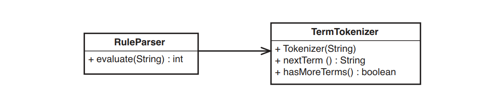
Hình 20.3 `RuleParser` và `TermTokenizer`.

> Kinh nghiệm #3: Tìm kiếm những quyết định có thể thay đổi
> Tìm kiếm những quyết định — không phải các quyết định mà bạn đang thực hiện trong, mà là các quyết định đã thực hiện. Có phần chức năng nào đó (giao tiếp với cơ sở dữ liệu, giao tiếp với một nhóm đối tượng khác, v.v.) có vẻ đang bị code cứng không? Bạn có thể tưởng tượng nó sẽ thay đổi như thế nào?

Khi bạn đang cố gắng chia nhỏ một lớp lớn, bạn rất dễ mất nhiều thời gian với tên của các phương thức. Rốt cuộc thì, chúng là một trong những điều đáng chú ý nhất trong một lớp. Nhưng tên của các phương thức không nói lên toàn bộ câu chuyện. Các lớp lớn thường chứa các phương thức thực hiện nhiều việc ở nhiều mức độ trừu tượng khác nhau. Chẳng hạn, một phương thức có tên `updateScreen()` có thể tạo văn bản cho một màn hình, định dạng nó và gửi nó tới một số đối tượng GUI khác nhau. Chỉ nhìn vào tên phương thức, bạn sẽ không biết có bao nhiêu công việc đang diễn ra và bao nhiêu trách nhiệm được đặt trong đó.

Vì lý do này, bạn nên thực hiện đôi chút tái cấu trúc trích xuất phương thức trước khi thực sự giải quyết các lớp để trích xuất. Những phương thức nào bạn nên trích xuất? Tôi xử lý việc này bằng cách tìm kiếm các quyết định. Có bao nhiêu điều được giả định trong code? Là các phương thức được gọi từ một API cụ thể? Có giả định rằng nó sẽ luôn truy cập cùng một cơ sở dữ liệu hay không? Nếu code đang thực hiện những điều này, bạn nên trích xuất các phương thức phản ánh những gì bạn giả định ở mức cao. Nếu bạn đang lấy thông tin cụ thể từ cơ sở dữ liệu, hãy trích xuất một phương thức được đặt tên theo thông tin bạn đang nhận. Khi bạn thực hiện các thao tác trích xuất này, bạn có nhiều phương thức hơn, nhưng bạn cũng có thể thấy rằng việc nhóm các phương thức đó sẽ dễ dàng hơn. Hơn thế nữa, bạn có thể thấy rằng mình đã đóng gói hoàn toàn một số tài nguyên đằng sau một tập hợp các phương thức. Khi bạn trích xuất một lớp cho chúng, bạn sẽ phá vỡ một số phụ thuộc vào các chi tiết cấp thấp.

> Kinh nghiệm #4: Tìm kiếm các liên kết bên trong
> Tìm các liên kết giữa các biến đối tượng và phương thức. Có phải các biến đối tượng nhất định được sử dụng bởi một số phương thức này chứ không phải các phương thức khác?

Thật khó để tìm thấy các lớp mà trong đó tất cả các phương thức đều sử dụng tất cả các biến đối tượng. Thông thường có một số loại "gộp" trong một lớp. Hai hoặc ba phương thức có thể là những phương thức duy nhất sử dụng bộ ba biến. Thường thì những cái tên sẽ giúp bạn thấy điều này. Chẳng hạn, trong lớp `RulerParser`, có một biến danh sách tên là `variables` và phương thức có tên là `addVariable`. Điều này thấy có một mối quan hệ rõ ràng giữa phương thức và biến đó. Nó không cho chúng ta biết rằng không có phương thức nào khác truy cập vào biến đó, nhưng ít nhất chúng ta có một nơi để bắt đầu tìm kiếm.

Một kỹ thuật khác mà chúng ta có thể sử dụng để tìm những "khối u" này là tạo một bản phác thảo nhỏ về các mối quan hệ bên trong một lớp. Chúng được gọi là bản phác thảo tính năng. Chúng hiển thị các phương thức và biến thể hiện mà mỗi phương thức trong một lớp sử dụng và chúng khá dễ thực hiện. Đây là một ví dụ:

```java
class Reservation
{
  private int duration;
  private int dailyRate;
  private Date date;
  private Customer customer;
  private List fees = new ArrayList();

  public Reservation(Customer customer, int duration, int dailyRate, Date date) {
    this.customer = customer;
    this.duration = duration;
    this.dailyRate = dailyRate;
    this.date = date;
  }

  public void extend(int additionalDays) {
    duration += additionalDays;
  }

  public void extendForWeek() {
    int weekRemainder = RentalCalendar.weekRemainderFor(date);
    final int DAYS_PER_WEEK = 7;
    extend(weekRemainder);
    dailyRate = RateCalculator.computeWeekly(customer.getRateCode()) / DAYS_PER_WEEK;
  }

  public void addFee(FeeRider rider) {
    fees.add(rider);
  }

  int getAdditionalFees() {
    int total = 0;
    for(Iterator it = fees.iterator(); it.hasNext(); ) {
      total += ((FeeRider)(it.next())).getAmount();
    }
    return total;
  }

  int getPrincipalFee() {
    return dailyRate * RateCalculator.rateBase(customer) * duration;
  }

  public int getTotalFee() {
    return getPrincipalFee() + getAdditionalFees();
  }
}
```

Bước đầu tiên là vẽ các vòng tròn cho từng biến, như trong Hình 20.4.

Tiếp theo, chúng ta xem xét từng phương thức và cho nó một vòng tròn. Sau đó, chúng ta nối vòng tròn phương thức đến các vòng tròn của biến thể hiện mà phương thức đó truy cập hoặc sửa đổi. Có thể bỏ qua các hàm khởi tạo. Nói chung, chúng sửa đổi từng biến thể hiện.

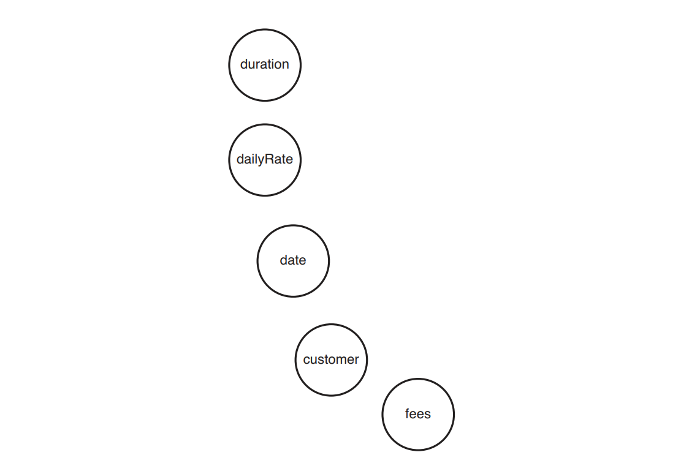
Hình 20.4 Các biến trong lớp `Reservation`.

Hình 20.5 hiển thị sơ đồ sau khi thêm một vòng tròn cho phương thức `extend`:

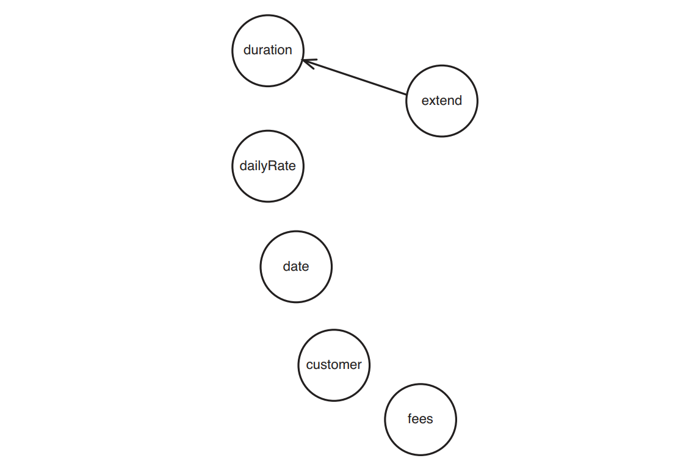
Hình 20.5 phương thức `extend` sử dụng biến `duration`.

> Nếu bạn đã đọc các chương mô tả về phác thảo hiệu ứng, bạn có thể thấy rằng _phác thảo tính năng_ trông rất giống _phác thảo hiệu ứng (155)_. Về cơ bản, chúng khá giống nhau. Sự khác biệt chính là hướng các mũi tên được đảo ngược. Trong các bản _phác thảo tính năng_, các mũi tên đi theo hướng của một phương thức hoặc biến được sử dụng bởi một phương thức hoặc biến khác. Trong các bản _phác thảo hiệu ứng_, mũi tên chỉ vào các phương thức hoặc biến bị ảnh hưởng bởi các phương thức và biến khác.
>
> Đây là hai cách khác nhau, hoàn toàn hợp lý để xem xét các tương tác trong một hệ thống. Bản _phác thảo tính năng_ là tuyệt vời để lập bản đồ cấu trúc bên trong của các lớp. Bản _phác thảo hiệu ứng (155)_ rất lý tưởng để suy diễn từ một điểm thay đổi.
>
> Có khó hiểu khi chúng trông hơi giống nhau không? Không thực sự. Những bản phác thảo này là những công cụ dùng một lần. Chúng là thứ mà bạn ngồi xuống và thảo luận với một đồng nghiệp trong khoảng 10 phút trước khi bạn thực hiện các thay đổi của mình. Sau đó, bạn ném chúng đi. Có rất ít giá trị trong việc giữ chúng về sau, vì vậy có rất ít khả năng chúng sẽ bị nhầm lẫn với nhau.

Hình 20.6 hiển thị bản phác thảo sau khi thêm các vòng tròn cho từng chức năng và các đường kẻ cho tất cả các đối tượng mà chúng sử dụng:

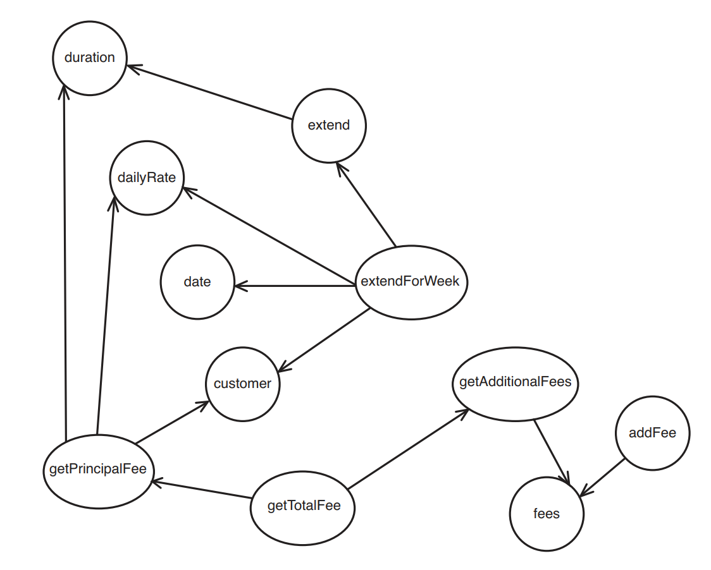
Hình 20.6 Phác thảo tính năng cho lớp `Reservation`.

Chúng ta có thể thấy được gì từ bản phác thảo này? Một điều hiển nhiên là có một chút phân cụm trong lớp này. Các biến `duration`, `dailyRate`, `date` và `customer` được sử dụng chủ yếu bởi `getPrincipalFee`, `extend` và `extendForWeek`. Có bất kỳ phương thức nào trong số này được công khai không? Có, `extend` và `extendForWeek`, nhưng `getPrincipalFee` thì không. Hệ thống của chúng ta sẽ như thế nào nếu chúng ta biến cụm này thành lớp riêng của nó (xem Hình 20.7)?

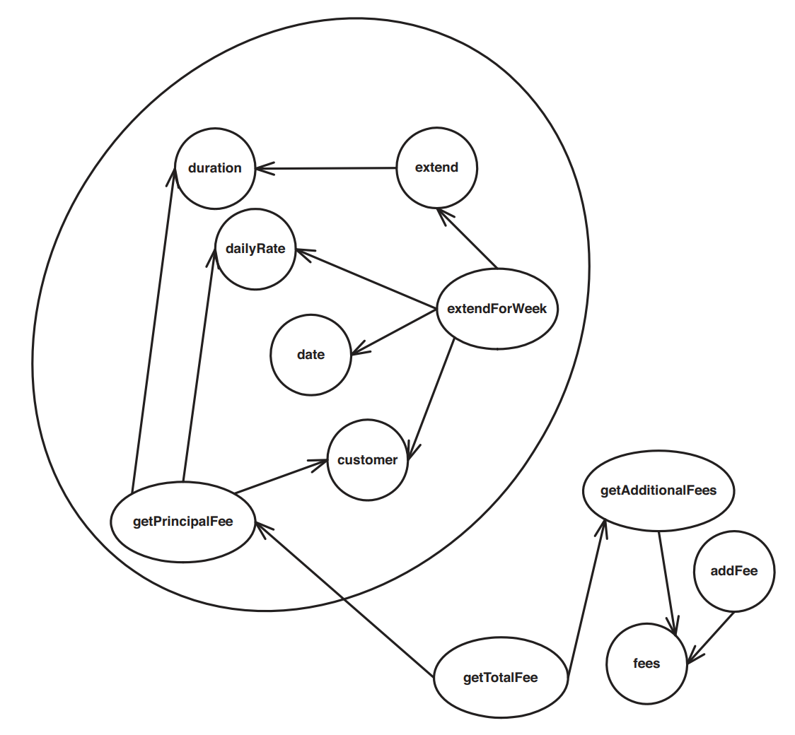
Hình 20.7 Một cụm bên trong lớp `Reservation`.


Hình tròn lớn trong sơ đồ có thể là một lớp mới. Nó cần phải có phương thức `extend`, `extendForWeek` và `getPrincipalFee` làm phương thức public, nhưng tất cả các phương thức khác có thể là private. Chúng ta có thể giữ `fees`, `addFee`, `getAdditionalFees`, và `getTotalFee` trong lớp `Reservation` và ủy quyền cho lớp mới (xem Hình 20.8)

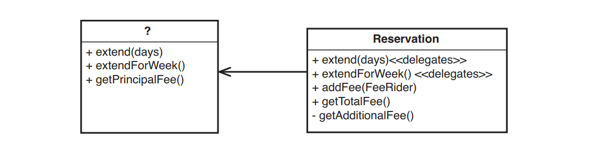
Hình 20.8 `Reservation` sử dụng lớp mới.

Điều quan trọng cần tìm hiểu trước khi thử thực hiện việc này là liệu lớp mới có trách nhiệm rõ ràng và tốt hơn hay không. Chúng ta có thể nghĩ ra một cái tên cho nó không? Nó dường như làm hai việc: gia hạn đặt chỗ và tính phí gốc. Có vẻ như `Reservation` là một cái tên hay, nhưng đã được sử dụng cho lớp ban đầu.

Có một khả năng khác. Chúng ta có thể thử cách khác. Thay vì trích xuất tất cả code trong vòng tròn lớn, chúng ta có thể trích xuất phần khác, như trong Hình 20.9.

Chúng ta có thể gọi lớp được trích xuất `FeeCalculator`. Điều đó có thể hiệu quả, nhưng phương thức `getTotalFee` cần gọi `getPrincipalFee` trên `Reservation` — phải không nhỉ?

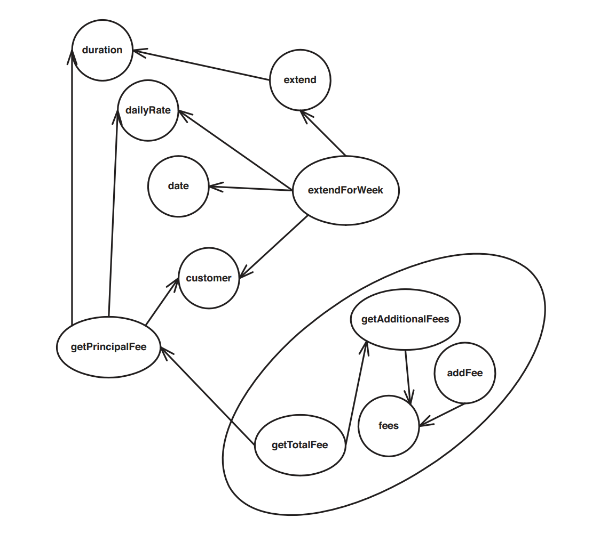
Hình 20.9 Nhìn nhập `Reservation` theo một cách khác.

Điều gì sẽ xảy ra nếu chúng ta gọi `getPrincipalFee` trong `Reservation` và sau đó truyền giá trị đó vào `FeeCalculator`? Đây là một bản phác thảo của khác:

```java
public class Reservation
{
  ...
  private FeeCalculator calculator = new FeeCalculator();

  private int getPrincipalFee() {
    ...
  }

  public Reservation(Customer customer, int duration, int dailyRate, Date date) {
    this.customer = customer;
    this.duration = duration;
    this.dailyRate = dailyRate;
    this.date = date;
  }

  ...

  public void addFee(FeeRider fee) {
    calculator.addFee(fee);
  }

  public getTotalFee() {
    int baseFee = getPrincipalFee();
    return calculator.getTotalFee(baseFee);
  }
}
```

Cuối cùng chúng ta sẽ thu được cấu trúc như Hình 20.10.

Chúng ta thậm chí có thể xem xét việc chuyển `getPrincipalFee` sang `FeeCalculator` để làm cho trách nhiệm phù hợp hơn với tên lớp, nhưng nhận thấy `getPrincipalFee` phụ thuộc vào một số biến trong `Reservation`, nên tốt hơn là giữ nguyên vị trí cho nó.

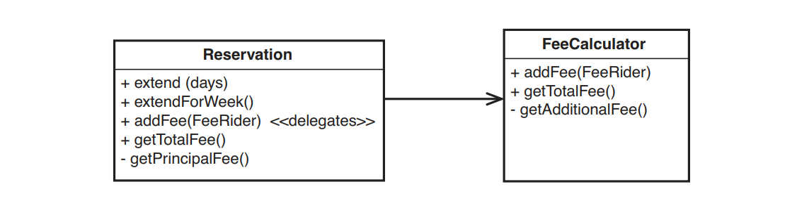
Hình 20.10 `Reservation` sử dụng `FeeCalculator`

Bản phác thảo tính năng là một công cụ tuyệt vời để tìm trách nhiệm riêng biệt của lớp. Chúng ta có thể nhóm các tính năng lại và tìm ra những lớp có thể trích xuất dựa theo tên. Nhưng ngoài việc tìm ra trách nhiệm, các bản phác thảo tính năng còn cho phép chúng ta xác định cấu trúc phụ thuộc bên trong các lớp và điều đó thường quan trọng ngang với trách nhiệm khi quyết định trích xuất lớp con. Trong ví dụ này, có hai cụm biến và phương thức tách biệt rõ ràng. Mối liên hệ duy nhất giữa chúng là lệnh gọi `getPrincipalFee` bên trong `getTotalFee`. Trong các bản phác thảo tính năng, chúng ta thường thấy các kết nối này là một tập hợp nhỏ các đường kết nối các cụm lớn hơn. Tôi gọi đây là _điểm mấu chốt (180)_, và tôi sẽ nói về chúng nhiều hơn trong _Chương 12, Tôi cần thực hiện nhiều thay đổi trong một khu vực. Tôi có phải phá vỡ các phụ thuộc của tất cả các lớp liên quan không?_

Đôi khi sau khi vẽ một bản phác thảo, bạn không tìm thấy bất kỳ điểm mấu chốt nào. Không phải lúc nào chúng cũng tồn tại. Nhưng ít nhất, việc xem tên và sự phụ thuộc giữa các tính năng hoàn toàn hữu ích.

Khi có bản phác thảo, bạn có thể thử các cách chia lớp khác nhau. Để làm điều này, hãy khoanh vùng các nhóm tính năng, các đường giao nhau có thể xác định giao diện của một lớp mới. Khi khoanh vùng, hãy cố gắng nghĩ ra tên lớp cho mỗi nhóm. Thành thật mà nói, ngoài bất cứ điều gì bạn chọn làm hoặc không làm khi trích xuất các lớp con, đây là một cách tuyệt vời để nâng cao kỹ năng đặt tên của bạn. Đó cũng là một cách tốt để khám phá các lựa chọn thay thế thiết kế.

> Kinh nghiệm #5: Tìm kiếm trách nhiệm chính
>
> Cố gắng mô tả trách nhiệm của lớp trong một câu duy nhất.

_Nguyên tắc Trách nhiệm Duy nhất_ quy định rằng các lớp nên có một trách nhiệm duy nhất. Nếu đúng như vậy, sẽ dễ dàng viết ra trong một câu. Hãy thử cách này với một trong những lớp lớn trong hệ thống của bạn. Nghĩ về những gì khách hàng cần và mong đợi từ một lớp, từ đó thêm các mệnh đề vào câu. Lớp đó làm cái này, cái này, cái này, cái kia. Có điều gì trông có vẻ quan trọng hơn bất cứ những điều khác không? Nếu có, bạn có thể đã tìm thấy trách nhiệm chính của lớp. Các trách nhiệm khác có lẽ nên được đưa vào các lớp khác.

Có hai cách khiến _Nguyên tắc Trách nhiệm Duy nhất_ bị vi phạm. Nó có thể bị vi phạm ở cấp độ giao diện và ở cấp độ triển khai. SRP bị vi phạm ở cấp độ giao diện khi một lớp trình bày một giao diện làm cho có vẻ như nó chịu trách nhiệm cho một số lượng rất lớn mọi thứ. Chẳng hạn, giao diện của lớp này (xem Hình 20.11) trông giống như nó có thể được chia thành ba hoặc bốn lớp.

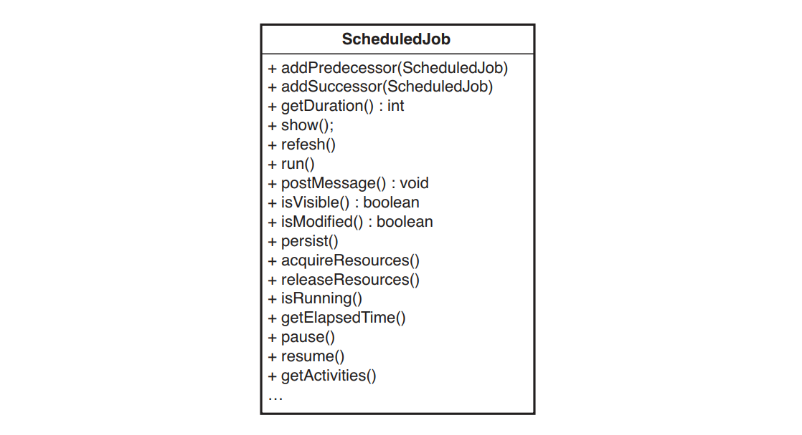
Hình 20.11 Lớp `ScheduledJob`

Vi phạm SRP mà chúng ta quan tâm nhất là vi phạm ở cấp độ triển khai. Nói một cách đơn giản, chúng ta quan tâm liệu lớp đó có thực sự triển khai tất cả những việc đó hay không hay nó chỉ ủy quyền cho một vài lớp khác. Nếu nó đại biểu, chúng ta không có một lớp nguyên khối lớn; chúng ta chỉ có một lớp là mặt tiền, giao diện người dùng cho một loạt các lớp nhỏ và điều đó có thể dễ quản lý hơn.

Hình 20.12 cho thấy lớp `ScheduledJob` với các trách nhiệm được giao cho một vài lớp khác.

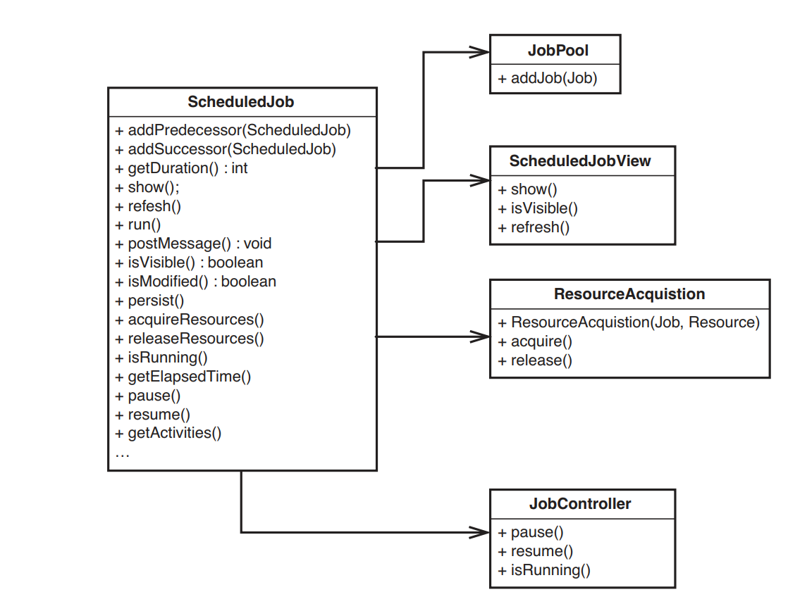
Hình 20.12 `ScheduledJob` với các lớp con được trích xuất.

_Nguyên tắc Trách nhiệm Duy nhất_ vẫn bị vi phạm ở cấp độ giao diện, nhưng ở cấp độ triển khai, mọi thứ đã tốt hơn một chút.

Làm thế nào chúng ta sẽ giải quyết vấn đề ở cấp độ giao diện? Điều này khó hơn một chút. Cách tiếp cận chung là xem liệu các lớp được ủy quyền có thực sự được sử dụng trực tiếp ở lệnh gọi hay không. Ví dụ: nếu chỉ có một số lệnh gọi quan tâm đến việc chạy `ScheduledJobs`, chúng ta có thể cấu trúc lại theo hướng như thế này:

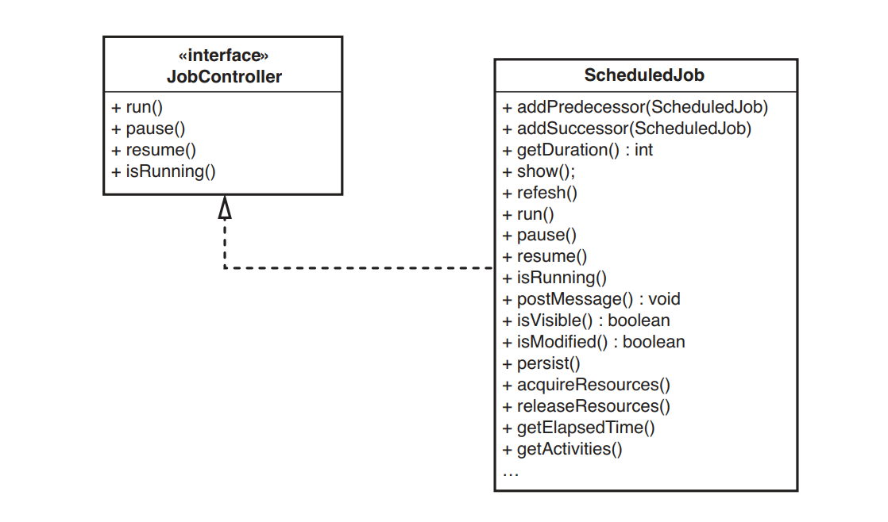
Hình 20.13 Giao diện dành riêng cho lệnh gọi của `ScheduledJob`.

Giờ đây, lệnh gọi chỉ cần quan tâm đến việc kiểm soát `jobs` chấp nhận `ScheduledJobs` như `JobControllers`. Kỹ thuật tạo giao diện cho một nhóm lệnh gọi cụ thể này giữ cho thiết kế phù hợp với _Nguyên tắc phân chia Giao diện_.

> Nguyên tắc Phân chia Giao diện (ISP)
>
> Với một lớp lớn, hiếm khi tất cả các lệnh gọi của nó sử dụng tất cả các phương thức của nó. Thông thường chúng ta có thể thấy các nhóm phương pháp khác nhau mà các lệnh gọi cụ thể sử dụng. Nếu chúng ta tạo một giao diện cho từng nhóm này và yêu cầu lớp lớn triển khai các giao diện đó thì mỗi khách hàng có thể thấy lớp lớn thông qua giao diện cụ thể đó. Điều này giúp chúng ta ẩn thông tin đồng thời giảm sự phụ thuộc vào hệ thống. Các lệnh gọi không phải biên dịch lại khi lớp lớn triển khai.

Khi có giao diện cho các nhóm lệnh gọi cụ thể, chúng ta thường có thể bắt đầu chuyển code từ lớp lớn sang lớp mới sử dụng lớp gốc, như bạn có thể thấy trong Hình 20.14.

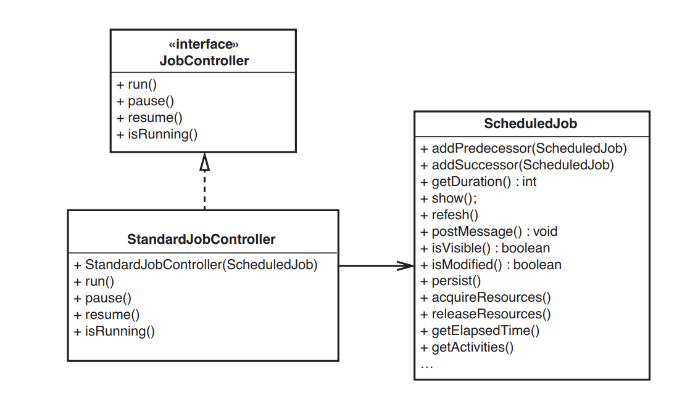
Hình 20.14 Phân chia giao diện của `ScheduledJob`

Thay vì ủy quyền `ScheduledJob` cho `JobController`, chúng ta đã ủy quyền `JobController` cho `ScheduledJob`. Giờ đây, bất cứ khi nào lệnh gọi muốn chạy một `ScheduledJob`, nó sẽ tạo một `JobController`, truyền nó vào một `ScheduledJob` và sử dụng `JobController` để xử lý việc thực thi của nó.

Kiểu tái cấu trúc này hầu như luôn khó hơn so với mô ta của nó. Thông thường, để làm điều này, bạn phải hiển thị nhiều phương thức hơn trong giao diện chung của lớp ban đầu `(ScheduledJob)` để giao diện mới `(StandardJobController)` có quyền truy cập vào mọi thứ nó cần để thực hiện công việc của mình. Thường thì phải mất khá nhiều công sức để tạo ra sự thay đổi như thế này. Code lệnh gọi bây giờ phải được thay đổi để sử dụng lớp mới thay vì lớp cũ; để làm điều đó một cách an toàn, bạn cần có các kiểm thử với những lệnh gọi đó. Tuy nhiên, điểm thú vị về việc tái cấu trúc này là nó cho phép bạn loại bỏ giao diện của một lớp lớn. Lưu ý rằng `ScheduledJob` không còn có các phương thức trong `JobController`.

> Kinh nghiệm số 6: Khi tất cả các cách khác đều thất bại, hãy thực tái cấu trúc từ đầu
>
> Nếu bạn gặp nhiều khó khăn khi xem xét trách nhiệm trong một lớp, hãy tái cấu trúc từ đầu

_Tái cấu trúc từ đầu (212)_ là một công cụ mạnh mẽ. Chỉ cần nhớ rằng đó là một bài tập nhân tạo. Những thứ bạn nhìn thấy khi "cào" là
những thứ bạn sẽ đạt được khi tái cấu trúc.

> Kinh nghiệm #7: Tập trung vào công việc hiện tại
>
> Hãy chú ý đến những gì bạn đang phải làm. Nếu bạn đang đưa ra một cách làm khác, bạn có thể đã xác định được trách nhiệm mà bạn nên trích xuất và sau đó cho phép thay thế.

Rất dễ bị quá tải bởi số lượng trách nhiệm riêng biệt có thể xác định trong một lớp. Hãy nhớ rằng những thay đổi bạn đang thực hiện đang cho biết về một số cách cụ thể mà phần mềm có thể thay đổi. Thông thường chỉ cần nhận ra cách thay đổi đó là đủ để xem đoạn code mới mà bạn viết là một trách nhiệm riêng.

## Các phương pháp khác

Các phương pháp phỏng đoán để xác định trách nhiệm thực sự có thể giúp bạn đào sâu và tìm ra những khái niệm trừu tượng mới trong các lớp cũ, nhưng chúng chỉ là những thủ thuật. Cách để thực sự giỏi hơn trong việc nhận dạng là đọc nhiều hơn. Đọc sách về các mẫu thiết kế. Quan trọng hơn, hãy đọc code của người khác. Hãy xem xét các dự án nguồn mở và dành chút thời gian để duyệt xem người khác thực hiện mọi việc như thế nào. Hãy chú ý đến cách các lớp được đặt tên và sự tương ứng giữa tên lớp và tên của các phương thức. Theo thời gian, bạn sẽ giỏi hơn trong việc xác định các trách nhiệm ẩn giấu và bạn sẽ bắt đầu nhìn thấy chúng khi duyệt qua code lạ.

## Tiến về phía trước

Khi bạn đã xác định được nhiều trách nhiệm khác nhau trong một lớp lớn, vẫn còn hai vấn đề khác cần giải quyết: chiến lược và chiến thuật. Trước tiên hãy nói về chiến lược.

### Chiến lược

Chúng ta nên làm gì khi đã xác định được tất cả những trách nhiệm riêng biệt của lớp? Chúng ta có nên dành một tuần để "tấn công" các lớp lớn trong hệ thống không? Chúng ta có nên chia chúng thành từng phần nhỏ không? Nếu bạn có thời gian để làm điều đó thì thật tuyệt, nhưng hiếm khi có thể. Điều này cũng có thể có rủi ro. Trong hầu hết mọi trường hợp mà tôi đã thấy, khi các nhóm thực hiện quá trình tái cấu trúc lớn, độ ổn định của hệ thống sẽ bị phá vỡ trong một thời gian ngắn, ngay cả khi họ cẩn thận và viết kiểm thử trong toàn bộ quá trình thực hiện. Nếu bạn đang ở giai đoạn đầu của chu kỳ phát hành, sẵn sàng chấp nhận rủi ro và có thời gian, thì việc tái cấu trúc có thể ổn. Chỉ cần đừng để các lỗi ngăn cản bạn thực hiện việc tái cấu trúc khác.

Cách tốt nhất để chia nhỏ các lớp lớn là xác định trách nhiệm, đảm bảo rằng mọi người khác trong nhóm đều hiểu chúng và sau đó chia nhỏ lớp khi cần thiết. Khi làm điều đó, bạn sẽ phân tán rủi ro về những thay đổi và có thể hoàn thành công việc khác khi thực hiện.

### Chiến thuật

Trong hầu hết các hệ thống cũ, điều mà bạn có thể hy vọng nhất lúc ban đầu là bắt đầu áp dụng SRP ở cấp triển khai: Về cơ bản là trích xuất các lớp con từ lớp lớn của bạn và ủy quyền cho chúng. Việc áp dụng SRP ở cấp độ giao diện đòi hỏi khối lượng công việc nhiều hơn. Các lệnh gọi của lớp phải thay đổi và bạn cần các kiểm thử cho chúng. Thật thú vị, việc áp dụng SRP ở cấp triển khai giúp việc áp dụng nó ở cấp giao diện sau này dễ dàng hơn. Trước tiên hãy xem xét cấp độ triển khai.

Các kỹ thuật mà bạn sử dụng để trích xuất lớp con phụ thuộc vào một số yếu tố. Một là bạn có thể dễ dàng xác định các kiểm thử với các phương thức có thể bị ảnh hưởng. Bạn nên xem qua lớp và liệt kê tất cả các biến thực thể cũng như phương thức sẽ phải di chuyển. Từ đó, bạn sẽ có ý tưởng tốt về những phương thức bạn nên viết kiểm thử. Trong trường hợp lớp `RuleParser` đã xem xét trước đây, nếu chúng ta đang cân nhắc việc tách một lớp `TermTokenizer`, thì chúng ta muốn di chuyển các biến dạng chuỗi có tên là `current` và `currentPosition`, cũng như `hasMoreTerms` và `nextTerm`. Thực tế, `hasMoreTerms` và `nextTerm` là privated có nghĩa là chúng ta thực sự không thể viết kiểm thử trực tiếp cho chúng. Chúng ta có thể công khai chúng (dù sao chúng cũng sẽ bị di chuyển), nhưng việc tạo một `RuleParser` trong kiểm thử khai thác và cung cấp cho nó một tập hợp các chuỗi để đánh giá cũng có thể dễ dàng như vậy. Nếu làm như vậy, chúng ta sẽ có các kiểm thử bao gồm `hasMoreTerms` và `nextTerm`, đồng thời chúng ta sẽ có thể chuyển chúng sang lớp mới một cách an toàn.

Thật không may, nhiều lớp lớn khó khởi tạo trong kiểm thử khai thác. Xem _Chương 9, Tôi không thể đưa lớp này vào kiểm thử khai thác_ để biết một số mẹo có thể sử dụng để tiến về phía trước. Nếu bạn có thể khởi tạo lớp, bạn có thể cần sử dụng đến các mẹo trong _Chương 10 - Tôi không thể đưa lớp này vào kiểm thử khai thác_, để thực hiện các kiểm thử.

Nếu bạn có thể thực hiện các kiểm thử tại chỗ, bạn có thể bắt đầu trích xuất một lớp theo cách rất đơn giản, bằng cách sử dụng phép tái cấu trúc _Trích xuất lớp_ được mô tả trong cuốn sách _Refactoring: Improving the Design of Existing Code (Addison Wesley, 1999)_. Tuy nhiên, nếu bạn không thể thực hiện các kiểm thử tại chỗ, bạn vẫn có thể tiến về phía trước, mặc dù theo cách rủi ro hơn một chút. Đây là một cách tiếp cận rất thận trọng và nó hoạt động bất kể bạn có công cụ tái cấu trúc hay không. Dưới đây là các bước thực hiện:

1. Xác định trách nhiệm mà bạn muốn tách thành một lớp khác.
2. Tìm xem có bất kỳ biến thực thể nào cần phải chuyển sang lớp mới. Nếu có, hãy đưa chúng vào một phần riêng trong khai báo lớp, tách biệt với các biến thực thể khác.
3. Nếu bạn có toàn bộ phương thức mà bạn muốn chuyển sang lớp mới, hãy trích xuất nội dung của từng phương thức đó sang các phương thức mới. Tên của mỗi phương thức mới phải giống với tên cũ của nó, nhưng có một tiền tố chung duy nhất ở phía trước tên, giống như `MOVING`, tất cả đều bằng chữ in hoa. Nếu bạn không sử dụng công cụ tái cấu trúc, hãy nhớ _Bảo toàn chữ ký (312)_ khi bạn trích xuất các phương thức. Khi bạn trích xuất từng phương thức, hãy đặt nó vào phần riêng biệt của phần khai báo lớp, bên cạnh các biến đang di chuyển.
4. Nếu các phần của phương thức phải chuyển sang lớp khác, hãy trích xuất chúng từ các phương thức ban đầu. Sử dụng lại tiền tố MOVING cho tên của chúng và đặt vào phần riêng biệt.
5. Tại thời điểm này, bạn nên có một phần trong lớp có các biến thực thể, cùng với một loạt các phương thức cần di chuyển. Thực hiện tìm kiếm trong lớp hiện tại và tất cả các lớp con của nó, để đảm bảo rằng không có biến sắp di chuyển nào được sử dụng bên ngoài các phương thức sắp di chuyển. Điều quan trọng là không _Dựa vào Trình biên dịch (315)_ trong bước này. Trong nhiều ngôn ngữ OO, một lớp dẫn xuất có thể khai báo các biến có cùng tên với các biến trong lớp cơ sở. Thông thường điều này được gọi là _đổ bóng (shadowing)_. Nếu lớp của bạn ẩn chứa bất kỳ biến nào như vậy và cách sử dụng khác của các biến đó, bạn có thể thay đổi hành vi của code khi di chuyển các biến đó. Tương tự như vậy, nếu bạn _Dựa vào Trình biên dịch (315)_ để tìm cách sử dụng một biến đang che dấu một biến khác, bạn sẽ không tìm thấy tất cả các vị trí mà nó đang được sử dụng. Việc nhận xét việc khai báo một biến bị che khuất chỉ làm cho biến bị che bóng hiển thị.
6. Tại thời điểm này, bạn có thể trực tiếp di chuyển tất cả các biến thể hiện và phương thức mà bạn đã tách sang lớp mới. Tạo một thực thể của lớp mới trong lớp cũ và _Dựa vào Trình biên dịch (315)_ để tìm những vị trí mà các phương thức đã di chuyển phải được gọi trên thực thể thay vì trên lớp cũ.
7. Sau khi thực hiện di chuyển và biên dịch code, bạn có thể bắt đầu xóa tiền tố MOVING trên tất cả các phương thức đã di chuyển. _Dựa vào Trình biên dịch (315)_ để điều hướng đến những nơi bạn cần thay đổi tên.

Các bước tái cấu trúc này khá phức tạp, nhưng nếu bạn đang làm việc trong một đoạn code rất phức tạp thì chúng là cần thiết nếu bạn muốn trích xuất các lớp một cách an toàn mà không cần kiểm thử.

Có vài điều có thể xảy ra sai sót khi bạn trích xuất các lớp mà không kiểm thử. Các lỗi tinh vi nhất mà chúng ta có thể gây ra là các lỗi liên quan đến tính kế thừa. Di chuyển một phương thức từ lớp này sang lớp khác là khá an toàn. Bạn có thể _Dựa vào Trình biên dịch (xx)_ để hỗ trợ công việc của mình, nhưng trong hầu hết các ngôn ngữ, mọi thứ đều có thể xảy ra nếu bạn cố gắng di chuyển một phương thức ghi đè một phương thức khác. Nếu bạn làm vậy, giờ đây lệnh gọi phương thức lớp ban đầu sẽ gọi một phương thức có cùng tên từ lớp cơ sở. Tình huống tương tự có thể xảy ra với các biến. Một biến trong lớp con có thể ẩn một biến có cùng tên trong lớp cha. Di chuyển nó chỉ làm cho cái bị ẩn được hiển thị.

Để vượt qua những vấn đề này, chúng ta hoàn toàn không nên di chuyển các phương thức ban đầu. Chúng ta tạo ra các phương thức mới bằng cách trích xuất nội dung của các phương thức cũ. Tiền tố chỉ là một cách cơ học để tạo tên mới và đảm bảo rằng nó không xung đột với các tên khác trước khi di chuyển. Các biến phiên bản phức tạp hơn một chút: Chúng ta thực hiện bước thủ công là tìm kiếm cách sử dụng các biến trước khi sử dụng chúng. Có thể phạm sai lầm với điều này. Hãy thật cẩn thận và làm điều đó với đồng nghiệp.

## Sau lớp trích xuất

Trích xuất các lớp con từ một lớp lớn thường là bước đầu tiên. Trên thực tế, mối nguy lớn nhất khi các nhóm làm việc này là họ trở nên quá tham vọng. Bạn có thể thực hiện _Tái cấu trúc Scratch (212)_ hoặc phát triển một số góc nhìn khác về giao diện của hệ thống. Nhưng hãy nhớ, cấu trúc bạn có trong ứng dụng của mình vẫn hoạt động. Nó hỗ trợ chức năng; nó chỉ có thể không được điều chỉnh để tiến về phía trước. Đôi khi điều tốt nhất bạn có thể làm là xây dựng một quan điểm về cách một lớp lớn sẽ xử lý việc tái cấu trúc và sau đó quên nó đi. Bạn đã làm điều đó để khám phá những gì có thể. Để tiến về phía trước, bạn phải nhạy cảm với những gì đang có và không nhất thiết phải hướng tới thiết kế lý tưởng mà ít nhất là theo hướng tốt hơn.
