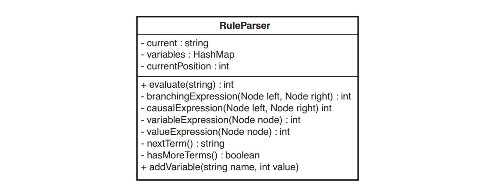
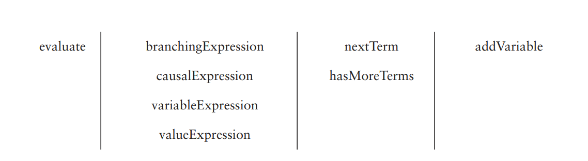
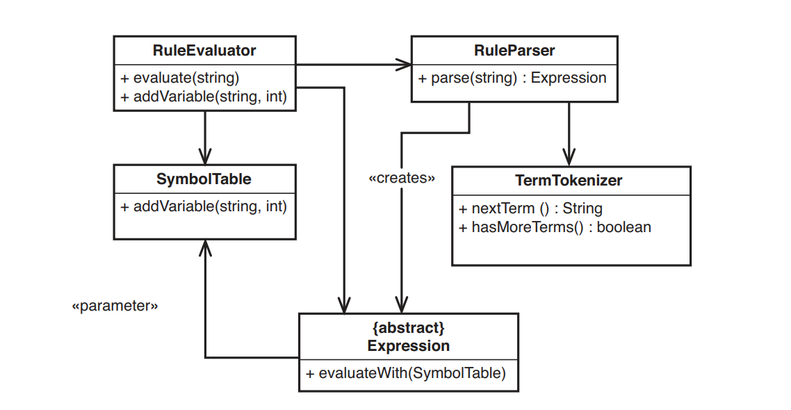

# Chương 20, Lớp này quá lớn và tôi không muốn nó lớn hơn nữa

Nhiều tính năng mà mọi người thêm vào hệ thống là những điều chỉnh nhỏ. Chúng yêu cầu thêm một đoạn code nhỏ và có thể là một vài phương thức. Thật hấp dẫn khi chỉ thực hiện những thay đổi này đối với một lớp hiện có. Rất có thể, code mà bạn cần thêm phải sử dụng dữ liệu từ một số lớp hiện có và điều dễ dàng nhất là chỉ cần thêm code vào đó. Thật không may, cách thực hiện thay đổi dễ dàng này có thể dẫn đến một số rắc rối nghiêm trọng. Khi tiếp tục thêm code vào các lớp hiện có, chúng ta sẽ dần tạo nên các phương thức dài và các lớp lớn. Chương trình của chúng ta dần biến thành một đầm lầy và phải mất nhiều thời gian hơn để hiểu cách thêm các tính năng mới hoặc thậm chí chỉ hiểu cách hoạt động của các tính năng cũ.

Tôi đã từng đến thăm một nhóm có kiến trúc đẹp trên giấy tờ. Họ cho tôi biết các lớp sơ cấp là gì và cách họ giao tiếp với nhau trong những trường hợp bình thường. Sau đó, họ cho tôi xem một vài sơ đồ UML đẹp mắt thể hiện cấu trúc. Tôi đã rất ngạc nhiên khi bắt đầu xem code. Mỗi lớp của họ thực sự có thể được chia thành khoảng 10 lớp con hoặc hơn, và làm như vậy sẽ giúp họ vượt qua những vấn đề cấp bách nhất của mình.

Các vấn đề với các lớp lớn là gì? Đầu tiên là sự nhầm lẫn. Khi bạn có 50 hoặc 60 phương thức trong một lớp, thường rất khó để biết bạn phải thay đổi điều gì và liệu điều đó có ảnh hưởng đến điều gì khác hay không. Trong trường hợp xấu nhất, các lớp lớn có số lượng biến thể hiện đáng kinh ngạc và thật khó để biết tác động của việc thay đổi một biến. Một vấn đề khác là lập lịch trình nhiệm vụ. Khi một lớp có khoảng 20 trách nhiệm trở lên, rất có thể bạn sẽ có vô số lý do đáng kinh ngạc để thay đổi nó. Trong cùng một lần lặp lại, bạn có thể có một số lập trình viên phải làm những việc khác nhau cho lớp. Nếu chúng hoạt động đồng thời, điều này có thể dẫn đến một số xung đột nghiêm trọng, đặc biệt là do vấn đề thứ ba: Các lớp lớn rất khó kiểm thử. Đóng gói là một điều tốt, đúng không? Chà, đừng hỏi người kiểm thử điều đó; họ có khả năng ngắt đầu của bạn. Các lớp quá lớn thường che giấu quá nhiều. Đóng gói là điều tuyệt vời khi nó giúp chúng ta suy luận về code của mình và khi chúng ta biết rằng một số thứ chỉ có thể được thay đổi trong những trường hợp nhất định. Tuy nhiên, khi chúng ta đóng gói quá nhiều, những thứ bên trong sẽ bị thối rữa và mưng mủ. Không có cách nào dễ dàng để cảm nhận tác động của sự thay đổi, vì vậy mọi người quay trở lại lập trình _Chỉnh sửa và Cầu nguyện (9)_. Tại thời điểm đó, các thay đổi mất quá nhiều thời gian hoặc số lượng lỗi tăng lên. Bạn phải trả giá cho sự thiếu rõ ràng bằng cách nào đó.

Vấn đề đầu tiên phải đối mặt khi có những lớp lớn là: Làm thế nào có thể phát triển mà không làm mọi thứ trở nên tệ hơn? Các chiến thuật chính có thể sử dụng ở đây là _Sprout Class (63)_ và _Sprout Method (59)_. Khi phải thực hiện các thay đổi, chúng ta nên cân nhắc đưa code vào một lớp mới hoặc một phương thức mới. _Sprout Class(63)_ thực sự giúp mọi thứ không trở nên tệ hơn. Khi bạn đặt code mới vào một lớp mới, chắc chắn, bạn có thể phải ủy quyền từ lớp ban đầu, nhưng ít nhất bạn không làm cho nó lớn hơn. _Sprout Method (59)_ cũng giúp ích, nhưng theo một cách tinh tế hơn. Nếu bạn thêm code vào một phương thức mới, vâng, bạn sẽ có một phương thức bổ sung, nhưng ít nhất, bạn đang xác định và đặt tên cho một thứ khác mà lớp thực hiện; thường thì tên của các phương thức có thể cho bạn gợi ý về cách chia một lớp thành các phần nhỏ hơn.

Biện pháp khắc phục chính cho các lớp lớn là tái cấu trúc. Nó giúp chia nhỏ các lớp thành tập hợp các lớp nhỏ hơn. Nhưng vấn đề lớn nhất là xác định những lớp nhỏ hơn trông như thế nào. May mắn thay, chúng ta có một số phương hướng sau đây.

> Nguyên tắc đơn nhiệm (Single-Responsibility Principle - SRP)
> Mỗi lớp nên có một trách nhiệm duy nhất: Nó nên có một mục đích duy nhất trong hệ thống và chỉ nên có một lý do để thay đổi nó.

Nguyên tắc đơn nhiệm hơi khó mô diễn vì ý tưởng đơn nhiệm khá mơ hồ. Nếu chúng ta nhìn nó một cách đơn giản, chúng ta có thể nói, "Ồ, điều đó có nghĩa là mỗi lớp chỉ nên có một phương thức duy nhất, phải không?" Vâng, phương thức có thể được coi là trách nhiệm. Một `Task` chịu trách nhiệm chạy bằng phương thức `run` của nó, để cho chúng ta biết nó có bao nhiêu tác vụ con bằng phương thức `taskCount`, v.v. Nhưng ý nghĩa của trách nhiệm thực sự được chú trọng khi chúng ta nói về _mục đích chính_. Hình 20.1 cho thấy một ví dụ

Hình 20.1 `Rule parser.`.

Chúng ta có một lớp nhỏ có thể đánh giá các chuỗi chứa các biểu thức quy tắc trong một số ngôn ngữ tối nghĩa. Nó có trách nhiệm gì? Chúng ta có thể nhìn vào tên của lớp để tìm một trách nhiệm: Nó phân tích cú pháp. Nhưng đó có phải là mục đích chính của nó? Dường như không phải phân tích cú pháp. Cũng có vẻ như nó đang đánh giá.

Nó còn làm gì nữa? Nó giữ một chuỗi hiện tại, chuỗi mà nó đang phân tích cú pháp. Nó cũng giữ một trường cho biết vị trí hiện tại trong khi nó đang phân tích cú pháp. Cả hai trách nhiệm nhỏ đó dường như phù hợp với danh mục phân tích cú pháp.

Hãy xem một biến khác, trường `variables`. Nó giữ một tập hợp các biến mà trình phân tích cú pháp sử dụng để có thể đánh giá các biểu thức số học trong các quy tắc, chẳng hạn như `a + 3`. Nếu ai đó gọi phương thức `addVariable` với các đối số `a` và `1`, thì biểu thức `a + 3` sẽ đánh giá bằng `4`. Vì vậy, có vẻ như có một trách nhiệm khác, quản lý biến, trong lớp này.

Phương thức `evaluate` là một đầu vào của lớp. Đây là một trong hai phương thức công khai duy nhất và nó biểu thị trách nhiệm chính của lớp: đánh giá. Tất cả các phương thức kết thúc bằng hậu tố `Expression` đều giống nhau. Chúng không chỉ được đặt tên giống nhau mà còn chấp nhận `Nodes` làm tham số và trả về một giá trị `int` cho biết giá trị của biểu thức con. Các phương thức `nextTerm` và `hasMoreTerms` cũng tương tự. Chúng có vẻ là một số hình thức code thông báo đặc biệt cho các điều khoản. Như đã nói trước đó, phương thức `addVariable` liên quan đến việc quản lý biến.

Tóm lại, có vẻ như `Parser` có các trách nhiệm sau:
• Phân tích cú pháp
• Đánh giá biểu hiện
• Thông báo có thời hạn
• Quản lý biến

Nếu chúng ta phải đưa ra một thiết kế từ đầu tách rời tất cả các trách nhiệm này, thì nó có thể trông giống như Hình 20.2.

Như vậy có phải là quá mức cần thiết? Có thể. Thông thường, mọi người ít sử dụng ngôn ngữ thông dịch hợp nhất để phân tích cú pháp và đánh giá biểu thức; họ chỉ đánh giá khi họ phân tích cú pháp. Mặc dù điều đó có thể thuận tiện, nhưng thường thì nó không có tính mở rộng tốt khi ngôn ngữ phát triển. Một trách nhiệm khác ít ỏi là của `SymbolTable`. Nếu trách nhiệm duy nhất của `SymbolTable` là ánh xạ tên biến thành số nguyên, thì lớp này không mang lại cho chúng ta nhiều lợi thế so với việc chỉ sử dụng bảng băm hoặc danh sách. Thiết kế đẹp, nhưng đoán xem? Khá là lý thuyết. Trừ khi chúng ta chọn viết lại phần này của hệ thống, thiết kế nhiều lớp nhỏ của chúng ta là rất phi thực tế.

Hình 20.2 `Các lớp quy tắc với các trách nhiệm được phân tách`.

Trong trường hợp thực tế của các lớp lớn, điều quan trọng là phải xác định các trách nhiệm khác nhau và sau đó tìm ra cách để dần chuyển sang các trách nhiệm tập trung hơn.