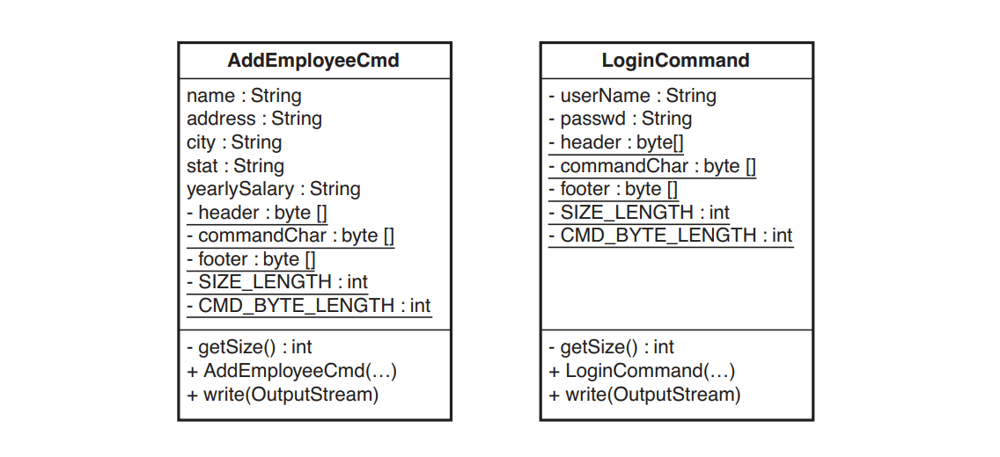

# Chương 21 - Tôi đang thay đổi cùng một đoạn code ở khắp mọi nơi

Đây có thể là một trong những điều khó chịu nhất trong các hệ thống cũ. Bạn cần thực hiện một sự thay đổi và bạn nghĩ, "Ồ, chỉ thế thôi." Sau đó, bạn phát hiện ra rằng bạn phải thực hiện đi thực hiện lại cùng một thay đổi vì có khoảng chục địa điểm có code tương tự như vậy trong hệ thống. Bạn có cảm giác rằng nếu bạn tái thiết kế hoặc tái cấu trúc hệ thống, có thể không gặp phải vấn đề này nữa, nhưng làm gì có thời gian cho việc đó? Vì vậy, bạn còn lại một điểm nhức nhối khác trong hệ thống, một điều gì đó nhìn chung làm tăng thêm sự tồi tệ.

Nếu bạn biết về tái cấu trúc, bạn sẽ có nhiều lợi thế hơn. Bạn biết rằng việc loại bỏ sự trùng lặp không nhất thiết phải đòi hỏi nỗ lực lớn lao chẳng hạn như tái thiết kế hoặc tái cấu trúc. Bạn hoàn toàn có thể cải thiện từng phần nhỏ trong khi thực hiện công việc của mình. Theo thời gian, hệ thống sẽ trở nên tốt hơn miễn là mọi người không tạo nên sự trùng lặp sau lưng bạn. Nếu là như vậy, bạn có thể thực hiện các bước với chúng mà không cần đến bạo lực, nhưng đó lại là một vấn đề khác. Câu hỏi quan trọng là nó có đáng không? Chúng ta nhận được gì khi nhiệt tình loại bỏ sự trùng lặp khỏi một vùng code? Kết quả thật đáng ngạc nhiên. Chúng ta hãy xem một ví dụ.

Chúng ta có một hệ thống mạng nhỏ dựa trên Java và phải gửi lệnh đến máy chủ. Hai lệnh mà chúng ta có được gọi là `AddEmployeeCmd` và `LogonCommand`. Khi cần đưa ra một lệnh, chúng ta sẽ khởi tạo nó và chuyển luồng đầu ra tới phương thức `write` của nó.

Dưới đây là danh sách của cả hai lớp lệnh. Bạn có thấy sự trùng lặp ở đây không?

```java
import java.io.OutputStream;

public class AddEmployeeCmd {
  String name;
  String address;
  String city;
  String state;
  String yearlySalary;

  private static final byte[] header = {(byte)0xde, (byte)0xad};
  private static final byte[] commandChar = {0x02};
  private static final byte[] footer = {(byte)0xbe, (byte)0xef};
  private static final int SIZE_LENGTH = 1;
  private static final int CMD_BYTE_LENGTH = 1;

  private int getSize() {
    return header.length +
      SIZE_LENGTH +
      CMD_BYTE_LENGTH +
      footer.length +
      name.getBytes().length + 1 +
      address.getBytes().length + 1 +
      city.getBytes().length + 1 +
      state.getBytes().length + 1 +
      yearlySalary.getBytes().length + 1;
  }

  public AddEmployeeCmd(String name, String address, String city, String state, int yearlySalary) {
    this.name = name;
    this.address = address;
    this.city = city;
    this.state = state;
    this.yearlySalary = Integer.toString(yearlySalary);
  }

  public void write(OutputStream outputStream) throws Exception {
    outputStream.write(header);
    outputStream.write(getSize());
    outputStream.write(commandChar);
    outputStream.write(name.getBytes());
    outputStream.write(0x00);
    outputStream.write(address.getBytes());
    outputStream.write(0x00);
    outputStream.write(city.getBytes());
    outputStream.write(0x00);
    outputStream.write(state.getBytes());
    outputStream.write(0x00);
    outputStream.write(yearlySalary.getBytes());
    outputStream.write(0x00);
    outputStream.write(footer);
  }
}
```

```java
import java.io.OutputStream;

public class LoginCommand {
  private String userName;
  private String passwd;
  private static final byte[] header = {(byte)0xde, (byte)0xad};
  private static final byte[] commandChar = {0x01};
  private static final byte[] footer = {(byte)0xbe, (byte)0xef};
  private static final int SIZE_LENGTH = 1;
  private static final int CMD_BYTE_LENGTH = 1;

  public LoginCommand(String userName, String passwd) {
    this.userName = userName;
    this.passwd = passwd;
  }

  private int getSize() {
    return header.length + SIZE_LENGTH + CMD_BYTE_LENGTH + footer.length + userName.getBytes().length + 1 + passwd.getBytes().length + 1;
  }

  public void write(OutputStream outputStream) throws Exception {
    outputStream.write(header);
    outputStream.write(getSize());
    outputStream.write(commandChar);
    outputStream.write(userName.getBytes());
    outputStream.write(0x00);
    outputStream.write(passwd.getBytes());
    outputStream.write(0x00);
    outputStream.write(footer);
  }
}
```


Hình 21.1 `AddEmployeeCmd` và `LoginCommand`

Có vẻ như có rất nhiều sự trùng lặp, nhưng vậy thì sao? Khối lượng code khá nhỏ. Chúng ta có thể cấu trúc lại nó, loại bỏ sự trùng lặp và làm cho nó nhỏ gọn hơn, nhưng liệu điều đó có giúp cuộc sống của chúng ta dễ dàng hơn không? Có thể có có thể không; thật khó để nói chỉ bằng cách nhìn vào nó.

Hãy thử xác định những phần trùng lặp và loại bỏ nó, rồi xem cuối cùng chúng ta sẽ thu được điều gì. Sau đó, chúng ta có thể quyết định xem việc loại bỏ trùng lặp có thực sự hữu ích hay không.

Điều đầu tiên chúng ta cần là một bộ kiểm thử để chạy sau mỗi lần tái cấu trúc. Để ngắn gọn, chúng ta sẽ không mô tả nhưng hãy nhớ rằng chúng có ở đó.

## Bước thứ nhất

Phản ứng đầu tiên của tôi khi gặp phải sự trùng lặp là lùi lại và tìm hiểu toàn bộ phạm vi của nó. Khi bắt đầu làm điều này, tôi suy nghĩ về loại lớp sẽ thu được và những phần trùng lặp được trích xuất sẽ trông như thế nào. Sau đó tôi nhận ra rằng mình thực sự đã suy nghĩ quá nhiều về chuyện đó. Việc loại bỏ các phần trùng lặp nhỏ sẽ giúp ích và giúp bạn dễ dàng nhìn thấy các phần trùng lặp lớn hơn sau này. Ví dụ: trong phương thức ghi của `loginCommand`, chúng ta có code này:

```java
  outputStream.write(userName.getBytes());
  outputStream.write(0x00);
  outputStream.write(passwd.getBytes());
  outputStream.write(0x00);
```

Khi chúng ta viết ra một chuỗi, chúng ta cũng viết một ký tự `null` kết thúc `(0x00)`. Chúng ta có thể trích xuất phần trùng lặp này như thế này. Tạo một phương thức có tên `writeField` có đầu ra và đầu vào dạng chuỗi. Sau đó, phương thức này ghi chuỗi vào đầu ra và kết thúc bằng cách ghi một giá trị rỗng.

```java
void writeField(OutputStream outputStream, String field) {
  outputStream.write(field.getBytes());
  outputStream.write(0x00);
}
```

> Chọn vị trí bắt đầu
> 
> Khi thực hiện một loạt các phép tái cấu trúc để loại bỏ sự trùng lặp, chúng ta có thể có được các cấu trúc khác nhau, tùy thuộc vào nơi chúng ta bắt đầu. Ví dụ, hãy tưởng tượng rằng chúng ta có một phương thức như thế này:
>
> void c() { a(); a(); b(); a(); b(); b(); }
> 
> Nó có thể được chia nhỏ như thế này:
> 
> void c() { aa(); b(); a(); bb(); }
> 
> hoặc như thế này:
> 
> void c() { a(); ab(); ab(); b(); }
> 
> Vậy chúng ta nên chọn cái nào? Sự thật là nó không tạo ra nhiều khác biệt về mặt cấu trúc. Cả hai đều tốt hơn những gì chúng ta đang có và có thể tiếp tục cấu trúc lại chúng thành nhóm khác nếu cần. Đây không phải là quyết định cuối cùng. Thay vào đó, tôi quyết định sẽ chú ý đến những cái tên được sử dụng. Nếu có thể tìm thấy tên cho hai lệnh gọi lặp lại tới a(), thì trong ngữ cảnh này, điều đó có ý nghĩa hơn là tên cho lệnh gọi đến a() theo sau là lệnh gọi đến b(), và tôi sẽ sử dụng tên đó.
> 
> Một phương pháp phỏng đoán khác mà tôi sử dụng là bắt đầu từ việc nhỏ. Nếu tôi có thể loại bỏ những phần trùng lặp nhỏ, tôi sẽ làm những phần đó trước vì nó thường làm cho bức tranh lớn rõ ràng hơn.

Khi có phương thức đó, chúng ta có thể thay thế từng cặp ghi chuỗi/null, chạy kiểm thử định kỳ để đảm bảo rằng chúng ta không làm hỏng bất kỳ điều gì. Đây là phương thức ghi của `loginCommand` sau khi thay đổi:

```java
public void write(OutputStream outputStream) throws Exception {
  outputStream.write(header);
  outputStream.write(getSize());
  outputStream.write(commandChar);
  writeField(outputstream, username);
  writeField(outputStream, passwd);
  outputStream.write(footer);
}
```