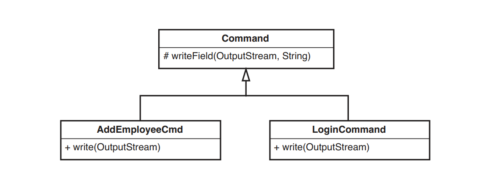
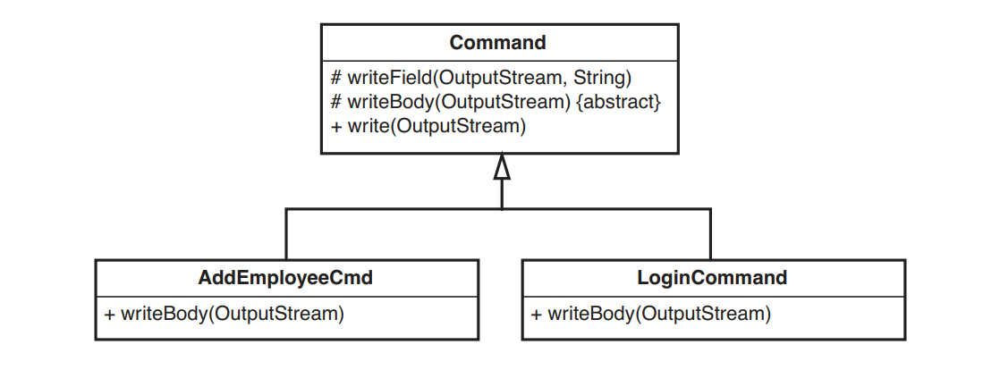
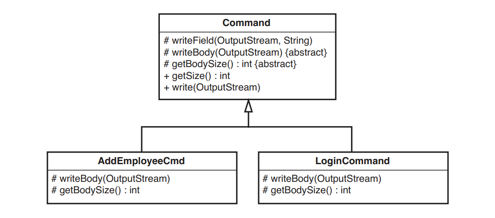
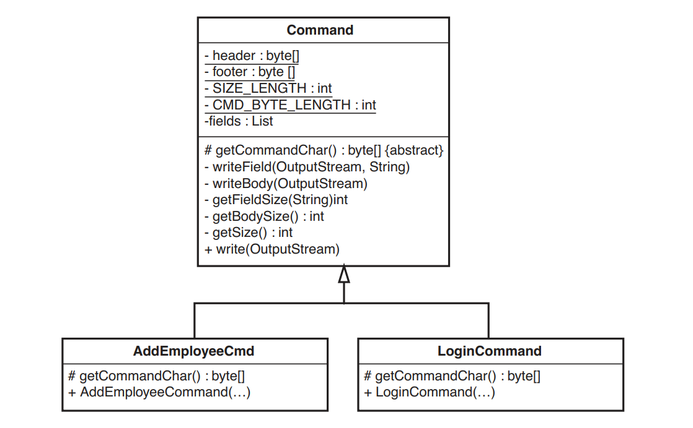

# Chương 21 - Tôi đang thay đổi cùng một đoạn code ở khắp mọi nơi

Đây có thể là một trong những điều khó chịu nhất trong các hệ thống cũ. Bạn cần thực hiện một sự thay đổi và bạn nghĩ, "Ồ, chỉ thế thôi." Sau đó, bạn phát hiện ra rằng bạn phải thực hiện đi thực hiện lại cùng một thay đổi vì có khoảng chục địa điểm có code tương tự như vậy trong hệ thống. Bạn có cảm giác rằng nếu bạn tái thiết kế hoặc tái cấu trúc hệ thống, có thể không gặp phải vấn đề này nữa, nhưng làm gì có thời gian cho việc đó? Vì vậy, bạn còn lại một điểm nhức nhối khác trong hệ thống, một điều gì đó nhìn chung làm tăng thêm sự tồi tệ.

Nếu bạn biết về tái cấu trúc, bạn sẽ có nhiều lợi thế hơn. Bạn biết rằng việc loại bỏ trùng lặp không nhất thiết phải đòi hỏi nỗ lực lớn lao chẳng hạn như tái thiết kế hoặc tái cấu trúc. Bạn hoàn toàn có thể cải thiện từng phần nhỏ trong khi thực hiện công việc của mình. Theo thời gian, hệ thống sẽ trở nên tốt hơn miễn là mọi người không tạo nên trùng lặp sau lưng bạn. Nếu là như vậy, bạn có thể thực hiện các bước với chúng mà không cần đến bạo lực, nhưng đó lại là một vấn đề khác. Câu hỏi quan trọng là nó có đáng không? Chúng ta nhận được gì khi nhiệt tình loại bỏ trùng lặp khỏi một vùng code? Kết quả thật đáng ngạc nhiên. Chúng ta hãy xem một ví dụ.

Chúng ta có một hệ thống mạng nhỏ dựa trên Java và phải gửi lệnh đến máy chủ. Hai lệnh mà chúng ta có được gọi là `AddEmployeeCmd` và `LogonCommand`. Khi cần đưa ra một lệnh, chúng ta sẽ khởi tạo nó và chuyển luồng đầu ra tới phương thức `write` của nó.

Dưới đây là danh sách của cả hai lớp lệnh. Bạn có thấy trùng lặp ở đây không?

```java
import java.io.OutputStream;

public class AddEmployeeCmd {
  String name;
  String address;
  String city;
  String state;
  String yearlySalary;

  private static final byte[] header = {(byte)0xde, (byte)0xad};
  private static final byte[] commandChar = {0x02};
  private static final byte[] footer = {(byte)0xbe, (byte)0xef};
  private static final int SIZE_LENGTH = 1;
  private static final int CMD_BYTE_LENGTH = 1;

  private int getSize() {
    return header.length +
      SIZE_LENGTH +
      CMD_BYTE_LENGTH +
      footer.length +
      name.getBytes().length + 1 +
      address.getBytes().length + 1 +
      city.getBytes().length + 1 +
      state.getBytes().length + 1 +
      yearlySalary.getBytes().length + 1;
  }

  public AddEmployeeCmd(String name, String address, String city, String state, int yearlySalary) {
    this.name = name;
    this.address = address;
    this.city = city;
    this.state = state;
    this.yearlySalary = Integer.toString(yearlySalary);
  }

  public void write(OutputStream outputStream) throws Exception {
    outputStream.write(header);
    outputStream.write(getSize());
    outputStream.write(commandChar);
    outputStream.write(name.getBytes());
    outputStream.write(0x00);
    outputStream.write(address.getBytes());
    outputStream.write(0x00);
    outputStream.write(city.getBytes());
    outputStream.write(0x00);
    outputStream.write(state.getBytes());
    outputStream.write(0x00);
    outputStream.write(yearlySalary.getBytes());
    outputStream.write(0x00);
    outputStream.write(footer);
  }
}
```

```java
import java.io.OutputStream;

public class LoginCommand {
  private String userName;
  private String passwd;
  private static final byte[] header = {(byte)0xde, (byte)0xad};
  private static final byte[] commandChar = {0x01};
  private static final byte[] footer = {(byte)0xbe, (byte)0xef};
  private static final int SIZE_LENGTH = 1;
  private static final int CMD_BYTE_LENGTH = 1;

  public LoginCommand(String userName, String passwd) {
    this.userName = userName;
    this.passwd = passwd;
  }

  private int getSize() {
    return header.length + SIZE_LENGTH + CMD_BYTE_LENGTH + footer.length + userName.getBytes().length + 1 + passwd.getBytes().length + 1;
  }

  public void write(OutputStream outputStream) throws Exception {
    outputStream.write(header);
    outputStream.write(getSize());
    outputStream.write(commandChar);
    outputStream.write(userName.getBytes());
    outputStream.write(0x00);
    outputStream.write(passwd.getBytes());
    outputStream.write(0x00);
    outputStream.write(footer);
  }
}
```


Hình 21.1 `AddEmployeeCmd` và `LoginCommand`

Có vẻ như có rất nhiều trùng lặp, nhưng vậy thì sao? Khối lượng code khá nhỏ. Chúng ta có thể cấu trúc lại nó, loại bỏ trùng lặp và làm cho nó nhỏ gọn hơn, nhưng liệu điều đó có giúp cuộc sống của chúng ta dễ dàng hơn không? Có thể có có thể không; thật khó để nói chỉ bằng cách nhìn vào nó.

Hãy thử xác định những phần trùng lặp và loại bỏ nó, rồi xem cuối cùng chúng ta sẽ thu được điều gì. Sau đó, chúng ta có thể quyết định xem việc loại bỏ trùng lặp có thực sự hữu ích hay không.

Điều đầu tiên chúng ta cần là một bộ kiểm thử để chạy sau mỗi lần tái cấu trúc. Để ngắn gọn, chúng ta sẽ không mô tả nhưng hãy nhớ rằng chúng có ở đó.

## Bước thứ nhất

Phản ứng đầu tiên của tôi khi gặp phải trùng lặp là lùi lại và tìm hiểu toàn bộ phạm vi của nó. Khi bắt đầu làm điều này, tôi suy nghĩ về loại lớp sẽ thu được và những phần trùng lặp được trích xuất sẽ trông như thế nào. Sau đó tôi nhận ra rằng mình thực sự đã suy nghĩ quá nhiều về chuyện đó. Việc loại bỏ các phần trùng lặp nhỏ sẽ giúp ích và giúp bạn dễ dàng nhìn thấy các phần trùng lặp lớn hơn sau này. Ví dụ: trong phương thức ghi của `loginCommand`, chúng ta có code này:

```java
  outputStream.write(userName.getBytes());
  outputStream.write(0x00);
  outputStream.write(passwd.getBytes());
  outputStream.write(0x00);
```

Khi chúng ta viết ra một chuỗi, chúng ta cũng viết một ký tự `null` kết thúc `(0x00)`. Chúng ta có thể trích xuất phần trùng lặp này như thế này. Tạo một phương thức có tên `writeField` có đầu ra và đầu vào dạng chuỗi. Sau đó, phương thức này ghi chuỗi vào đầu ra và kết thúc bằng cách ghi một giá trị rỗng.

```java
void writeField(OutputStream outputStream, String field) {
  outputStream.write(field.getBytes());
  outputStream.write(0x00);
}
```

> Chọn vị trí bắt đầu
> 
> Khi thực hiện một loạt các phép tái cấu trúc để loại bỏ trùng lặp, chúng ta có thể có được các cấu trúc khác nhau, tùy thuộc vào nơi chúng ta bắt đầu. Ví dụ, hãy tưởng tượng rằng chúng ta có một phương thức như thế này:
>
> void c() { a(); a(); b(); a(); b(); b(); }
> 
> Nó có thể được chia nhỏ như thế này:
> 
> void c() { aa(); b(); a(); bb(); }
> 
> hoặc như thế này:
> 
> void c() { a(); ab(); ab(); b(); }
> 
> Vậy chúng ta nên chọn cái nào? Sự thật là nó không tạo ra nhiều khác biệt về mặt cấu trúc. Cả hai đều tốt hơn những gì chúng ta đang có và có thể tiếp tục cấu trúc lại chúng thành nhóm khác nếu cần. Đây không phải là quyết định cuối cùng. Thay vào đó, tôi quyết định sẽ chú ý đến những cái tên được sử dụng. Nếu có thể tìm thấy tên cho hai lệnh gọi lặp lại tới a(), thì trong ngữ cảnh này, điều đó có ý nghĩa hơn là tên cho lệnh gọi đến a() theo sau là lệnh gọi đến b(), và tôi sẽ sử dụng tên đó.
> 
> Một phương pháp phỏng đoán khác mà tôi sử dụng là bắt đầu từ việc nhỏ. Nếu tôi có thể loại bỏ những phần trùng lặp nhỏ, tôi sẽ làm những phần đó trước vì nó thường làm cho bức tranh lớn rõ ràng hơn.

Khi có phương thức đó, chúng ta có thể thay thế từng cặp ghi chuỗi/null, chạy kiểm thử định kỳ để đảm bảo rằng chúng ta không làm hỏng bất kỳ điều gì. Đây là phương thức ghi của `loginCommand` sau khi thay đổi:

```java
public void write(OutputStream outputStream) throws Exception {
  outputStream.write(header);
  outputStream.write(getSize());
  outputStream.write(commandChar);
  writeField(outputstream, username);
  writeField(outputStream, passwd);
  outputStream.write(footer);
}
```

Cách trên giải quyết được vấn đề cho lớp `loginCommand`, nhưng không giúp ích gì cho lớp `AddEmployeeCmd`. `AddEmployeeCmd` cũng có các chuỗi ghi chuỗi/null lặp lại tương tự trong phương thức `write` của nó. Vì cả hai lớp đều là `Command` nên chúng ta có thể thiết lập một siêu lớp cho chúng có tên là `Command`. Với lớp này, chúng ta có thể kéo `writeField` lên siêu lớp để có thể sử dụng nó trong cả hai lớp `Command` (xem Hình 21.2).


Hình 21.2 Hệ thống phân cấp `Command`.

Bây giờ chúng ta có thể quay lại `AddEmployeeCmd` và thay thế việc ghi chuỗi/null của nó bằng lệnh gọi tới `writeField`. Khi chúng ta hoàn tất, phương thức ghi cho `AddEmployeeCmd` sẽ trông như thế này:

```java
public void write(OutputStream outputStream) throws Exception {
  outputStream.write(header);
  outputStream.write(getSize());
  outputStream.write(commandChar);
  writeField(outputStream, name);
  writeField(outputStream, address);
  writeField(outputStream, city);
  writeField(outputStream, state);
  writeField(outputStream, yearlySalary);
  outputStream.write(footer);
}
```

Phương thức `write` của `LoginCommand` sẽ như thế này:

```java
public void write(OutputStream outputStream) throws Exception {
  outputStream.write(header);
  outputStream.write(getSize());
  outputStream.write(commandChar);
  writeField(outputstream, userName);
  writeField(outputStream, passwd);
  outputStream.write(footer);
}
```

Code đã sạch hơn một chút nhưng vẫn còn việc phải làm. Các phương thức `write` cho `AddEmployeeCmd` và `loginCommand` có cùng dạng: ghi `header`, `size` và command `char`; sau đó viết một loạt các trường; và cuối cùng là viết phần `footer`. Nếu chúng ta có thể trích xuất sự khác biệt bằng cách viết các trường, thì chúng ta sẽ có một phương thức `write` `loginCommand` trông như thế này:

```java
public void write(OutputStream outputStream) throws Exception {
  outputStream.write(header);
  outputStream.write(getSize());
  outputStream.write(commandChar);
  writeBody(outputstream);
  outputStream.write(footer);
}
```

Còn đây là `writeBody` được trích xuất:

```java
private void writeBody(OutputStream outputStream) throws Exception {
  writeField(outputstream, userName);
  writeField(outputStream, passwd);
}
```

Phương thức `write` của `AddEmployeeCmd` tương tự như vậy, nhưng `writeBody` của nó trông như thế này:

```java
private void writeBody(OutputStream outputStream) throws Exception {
  writeField(outputStream, name);
  writeField(outputStream, address);
  writeField(outputStream, city);
  writeField(outputStream, state);
  writeField(outputStream, yearlySalary);
}
```

> Khi hai phương thức trông gần giống nhau, hãy trích xuất những điểm khác biệt so với các phương thức khác.
> 
> Khi bạn làm điều đó, bạn thường có thể làm cho chúng giống hệt nhau và loại bỏ một cái.

Phương thức `write` của cả hai lớp trông giống hệt nhau. Chúng ta có thể chuyển phương thức ghi lên lớp `Command` không? Hiện tại thì chưa. Mặc dù cả hai trông giống nhau nhưng chúng sử dụng dữ liệu từ các lớp của chúng: `header`, `footer` và `commandChar`. Nếu chúng ta cố gắng tạo một phương thức ghi duy nhất, nó sẽ phải gọi các phương thức từ các lớp con để lấy dữ liệu đó. Chúng ta hãy xem các biến trong `AddEmployeeCmd` và `loginCommand`:

```java
public class AddEmployeeCmd extends Command {
  String name;
  String address;
  String city;
  String state;
  String yearlySalary;

  private static final byte[] header = {(byte)0xde, (byte)0xad};
  private static final byte[] commandChar = {0x02};
  private static final byte[] footer = {(byte)0xbe, (byte)0xef};
  private static final int SIZE_LENGTH = 1;
  private static final int CMD_BYTE_LENGTH = 1;
  ...
}

public class LoginCommand extends Command {
  private String userName;
  private String passwd;
  private static final byte[] header = {(byte)0xde, (byte)0xad};
  private static final byte[] commandChar = {0x01};
  private static final byte[] footer = {(byte)0xbe, (byte)0xef};
  private static final int SIZE_LENGTH = 1;
  private static final int CMD_BYTE_LENGTH = 1;
  ...
}
```

Cả hai lớp đều có rất nhiều dữ liệu chung. Chúng ta có thể đưa `header`, `footer`, `SIZE_LENGTH` và `CMD_BYTE_LENGTH` lên lớp `Command` vì tất cả chúng đều có cùng giá trị. Tôi sẽ tạm thời chuyển chúng thành protected để có thể biên dịch lại và kiểm thử:

```java
public class Command {
  protected static final byte[] header = {(byte)0xde, (byte)0xad};
  protected static final byte[] footer = {(byte)0xbe, (byte)0xef};
  protected static final int SIZE_LENGTH = 1;
  protected static final int CMD_BYTE_LENGTH = 1;
  ...
}
```

Bây giờ chúng ta chỉ còn lại biến `commandChar` trong cả hai lớp con. Nó có giá trị khác nhau trong mỗi lớp con. Một cách đơn giản để xử lý việc này là sử dụng getter trừu tượng trong lớp `Command`:

```java
public class Command {
  protected static final byte[] header = {(byte)0xde, (byte)0xad};
  protected static final byte[] footer = {(byte)0xbe, (byte)0xef};
  protected static final int SIZE_LENGTH = 1;
  protected static final int CMD_BYTE_LENGTH = 1;
  protected abstract char [] getCommandChar();
  ...
}
```

Bây giờ chúng ta có thể thay thế các biến `commandChar` trên mỗi lớp con bằng phương thức `getCommandChar`:

```java
public class AddEmployeeCmd extends Command {
  protected char [] getCommandChar() {
    return new char [] { 0x02};
  }
  ...
}

public class LoginCommand extends Command {
  protected char [] getCommandChar() {
    return new char [] { 0x01};
  }
  ...
}
```

Được rồi, bây giờ đã an toàn để xác định phương thức `write`. Sau đó, chúng ta sẽ có một lớp `Command` trông như thế này:

```java
public class Command {
  protected static final byte[] header = {(byte)0xde, (byte)0xad};
  protected static final byte[] footer = {(byte)0xbe, (byte)0xef};
  protected static final int SIZE_LENGTH = 1;
  protected static final int CMD_BYTE_LENGTH = 1;
  protected abstract char [] getCommandChar();
  protected abstract void writeBody(OutputStream outputStream);
  
  protected void writeField(OutputStream outputStream, String field) {
    outputStream.write(field.getBytes());
    outputStream.write(0x00);
  }

  public void write(OutputStream outputStream) throws Exception {
    outputStream.write(header);
    outputStream.write(getSize());
    outputStream.write(commandChar);
    writeBody(outputstream);
    outputStream.write(footer);
  }
}
```

Lưu ý rằng chúng tôi phải xác định một phương thức trừu tượng cho `writeBody` và đưa nó vào `Command` (xem Hình 21.3)


Hình 21.3 Đưa `writeField` lên

Sau khi chúng ta đưa phương thức `write` lên lớp cơ sở, những thứ duy nhất còn lại trong mỗi lớp con là các phương thức `getSize`, phương thức `getCommandChar` và các hàm khởi tạo. Đây là lớp `loginCommand`:

```java
public class LoginCommand extends Command {
  private String userName;
  private String passwd;

  public LoginCommand(String userName, String passwd) {
    this.userName = userName;
    this.passwd = passwd;
  }

  protected char [] getCommandChar() {
    return new char [] { 0x01};
  }

  protected int getSize() {
    return header.length + SIZE_LENGTH + CMD_BYTE_LENGTH + footer.length + userName.getBytes().length + 1 + passwd.getBytes().length + 1;
  }
}
```

Đó là một lớp khá ngắn. `AddEmployeeCmd` cũng tương tự, có phương thức `getSize` và `getCommandChar`, và không có gì khác. Hãy xem xét các phương thức `getSize` kỹ hơn một chút:

Đây là phương thức của `loginCommand`:

```java
protected int getSize() {
  return header.length +
      SIZE_LENGTH +
      CMD_BYTE_LENGTH +
      footer.length +
      userName.getBytes().length + 1 +
      passwd.getBytes().length + 1;
}
```

Còn đây là của `AddEmployeeCmd`

```java
private int getSize() {
  return header.length + SIZE_LENGTH +
      CMD_BYTE_LENGTH + footer.length +
      name.getBytes().length + 1 +
      address.getBytes().length + 1 +
      city.getBytes().length + 1 +
      state.getBytes().length + 1 +
      yearlySalary.getBytes().length + 1;
}
```

Vậy có cái gì giống nhau và khác nhau? Có vẻ như cả hai đều thêm `header`, độ dài của kích thước, độ dài của byte lệnh và độ dài `footer`. Sau đó, chúng thêm kích thước của từng trường của chúng. Điều gì sẽ xảy ra nếu chúng ta trích xuất những gì được tính toán khác nhau: kích thước của các trường? Chúng tôi gọi phương thức kết quả là `getBodySize()`.

```java
private int getSize() {
  return header.length + SIZE_LENGTH + CMD_BYTE_LENGTH + footer.length + getBodySize();
}
```

Nếu làm như vậy, chúng ta sẽ có cùng một đoạn code trong mỗi phương thức. Chúng ta cộng kích thước của tất cả dữ liệu kế toán, sau đó chúng ta cộng kích thước của phần nội dung, là tổng kích thước của tất cả các trường. Sau khi thực hiện việc này, chúng ta có thể chuyển `getSize` lên lớp `Command` và có các cách triển khai khác nhau cho `getBodySize` trong mỗi lớp con (xem Hình 21.4)


Hình 21.4 Đưa `getSize` lên

Hãy nhìn vào vị trí hiện tại của chúng ta. Chúng ta có triển khai `getBody` này trong `AddEmployeeCmd`:

```java
protected int getBodySize() {
  return name.getBytes().length + 1 +
      address.getBytes().length + 1 +
      city.getBytes().length + 1 +
      state.getBytes().length + 1 +
      yearlySalary.getBytes().length + 1;
}
```

Chúng ta đã bỏ qua một số trùng lặp khá rõ ràng ở đây. Chúng hơi nhỏ nhưng các bạn hãy nhiệt tình loại bỏ nó hoàn toàn nhé:

```java
protected int getFieldSize(String field) {
  return field.getBytes().length + 1;
}

protected int getBodySize() {
  return getFieldSize(name) +
      getFieldSize(address) +
      getFieldSize(city) +
      getFieldSize(state) +
      getFieldSize(yearlySalary);
}
```

Nếu chúng ta di chuyển phương thức `getFieldSize` lên lớp `Command`, chúng ta cũng có thể sử dụng nó trong phương thức `getBodySize` của `loginCommand`:

```java
protected int getBodySize() {
  return getFieldSize(name) + getFieldSize(password);
}
```

Còn trùng lặp nào nữa không? Thực ra là có, nhưng chỉ một ít thôi. Cả `loginCommand` và `AddEmployeeCmd` đều chấp nhận một danh sách các tham số, lấy kích thước của chúng và ghi nó ra. Ngoại trừ biến `commandChar`, biến này giải thích cho tất cả những khác biệt còn lại giữa hai lớp: Điều gì sẽ xảy ra nếu chúng ta loại bỏ trùng lặp bằng cách khái quát hóa nó một chút? Nếu chúng ta khai báo một danh sách trong lớp cơ sở, chúng ta có thể thêm vào danh sách đó trong mỗi hàm khởi tạo của lớp con như sau:

```java
class LoginCommand extends Command
{
  ...
  public AddEmployeeCmd(String name, String password) {
    fields.add(name);
    fields.add(password);
  }
  ...
}
```

Khi chúng ta thêm vào danh sách `fields` trong mỗi lớp con, chúng ta có thể sử dụng cùng một đoạn code để lấy kích thước nội dung:

```java
int getBodySize() {
  int result = 0;
  for(Iterator it = fields.iterator(); it.hasNext(); ) {
    String field = (String)it.next();
    result += getFieldSize(field);
  } 
  return result;
}
```

Tương tự, phương thức `writeBody` có thể sẽ như thế này:

```java
void writeBody(Outputstream outputstream) {
  for(Iterator it = fields.iterator(); it.hasNext(); ) {
    String field = (String)it.next();
    writeField(outputStream, field);
  }
}
```

Chúng ta có thể đưa các phương thức đó lên siêu lớp. Khi thực hiện xong, chúng ta thực sự đã loại bỏ tất cả trùng lặp. Lớp `Command` sẽ trông như thế này. Để làm cho mọi thứ trở nên hợp lý hơn, chúng ta đặt tất cả các phương thức không còn được truy cập trong các lớp con ở chế độ privated:

```java
public class Command {
  private static final byte[] header = {(byte)0xde, (byte)0xad};
  private static final byte[] footer = {(byte)0xbe, (byte)0xef};
  private static final int SIZE_LENGTH = 1;
  private static final int CMD_BYTE_LENGTH = 1;
  protected List fields = new ArrayList();
  protected abstract char [] getCommandChar();

  private void writeBody(Outputstream outputstream) {
    for(Iterator it = fields.iterator(); it.hasNext(); ) {
      String field = (String)it.next();
      writeField(outputStream, field);
    }
  }

  private int getFieldSize(String field) {
    return field.getBytes().length + 1;
  }

  private int getBodySize() {
    int result = 0;
    for(Iterator it = fields.iterator(); it.hasNext(); ) {
      String field = (String)it.next();
      result += getFieldSize(field);
    }
    return result;
  }

  private int getSize() {
  return header.length + 
    SIZE_LENGTH + 
    CMD_BYTE_LENGTH + 
    footer.length + 
    getBodySize();
  }

  private void writeField(OutputStream outputStream, String field) {
    outputStream.write(field.getBytes());
    outputStream.write(0x00);
  }

  public void write(OutputStream outputStream) throws Exception {
    outputStream.write(header);
    outputStream.write(getSize());
    outputStream.write(commandChar);
    writeBody(outputstream);
    outputStream.write(footer);
  }
}
```

Các lớp `loginCommand` và `AddEmployeeCmd` trở nên cực kỳ ngắn:

```java
public class LoginCommand extends Command {
  public LoginCommand(String userName, String passwd) {
    fields.add(username);
    fields.add(passwd);
  }

  protected char [] getCommandChar() {
    return new char [] { 0x01};
  }
}

public class AddEmployeeCmd extends Command {
  public AddEmployeeCmd(String name, String address, String city, String state, int yearlySalary) {
    fields.add(name);
    fields.add(address);
    fields.add(city);
    fields.add(state);
    fields.add(Integer.toString(yearlySalary));
  }

  protected char [] getCommandChar() {
    return new char [] { 0x02 };
  }
}
```

Hình 21.5 là sơ đồ UML cho thấy những gì chúng ta sẽ thu được.


Hình 21.5 Hệ thống phân cấp `Command` sau khi trùng lặp được đưa lên lớp cơ sở

Được rồi, vậy bây giờ chúng ta đang ở đâu? Chúng ta đã loại bỏ rất nhiều trùng lặp đến mức một số lớp chỉ còn lại vỏ. Tất cả các chức năng đều nằm trong lớp `Command`. Trên thực tế, thật hợp lý khi tự hỏi liệu chúng ta có thực sự cần các lớp riêng biệt cho hai lớp `Command` này hay không. Có lựa chọn nào thay thế không?

Chúng ta có thể loại bỏ các lớp con và thêm một phương thức tĩnh vào lớp `Command` cho phép chúng ta gửi `command`:

```java
  List arguments = new ArrayList();
  arguments.add("Mike");
  arguments.add("asdsad");
  Command.send(stream, 0x01, arguments);
```

Nhưng sẽ phát sinh rất nhiều công việc khi thực hiện gọi. Một điều chắc chắn là: Chúng ta phải truyền vào hai ký tự command khác nhau và chúng ta không muốn nơi thực hiện lời gọi phải để ý đến chúng.

Thay vào đó, chúng ta có thể thêm một phương thức tĩnh khác cho mỗi `command` mà chúng ta muốn gọi:

```java
  Command.SendAddEmployee(stream, "Mike", "122 Elm St", "Miami", "FL", 10000);
  Command.SendLogin(stream, "Mike", "asdsad");
```

Nhưng điều đó sẽ buộc tất cả code gọi đến `Command` phải thay đổi. Hiện tại, có nhiều vị trí trong code sử dụng các đối tượng `AddEmployeeCmd` và `loginCommand`.

Có lẽ tốt hơn hết là chúng ta nên để các lớp như hiện tại. Có thể các lớp con khá nhỏ, nhưng điều đó có thực sự gây tổn hại gì không? Gần như không.

Chúng ta làm xong chưa? Chưa, vẫn có một việc nhỏ mà chúng ta cần phải làm ngay bây giờ, một việc mà lẽ ra chúng ta nên làm sớm hơn. Chúng ta có thể đổi tên `AddEmployeeCmd` thành `AddEmployeeCommand`. Điều đó sẽ làm cho tên của hai lớp con nhất quán. Chúng ta ít có khả năng mắc sai lầm khi sử dụng tên một cách nhất quán.

> Viết tắt
> 
> Chữ viết tắt trong tên lớp và phương thức thường có vấn đề. Chúng có thể ổn khi được sử dụng một cách nhất quán, nhưng nói chung, tôi không thích sử dụng chúng.
> 
> Một nhóm mà tôi làm việc cùng cố gắng sử dụng từ `manager` và `management` trong hầu hết mọi tên lớp trong hệ thống. Cách đặt tên đó không giúp được gì nhiều, nhưng điều khiến nó tệ hơn là họ viết tắt `manager` và `management` theo nhiều cách khác nhau. Ví dụ: một số lớp được đặt tên là `XXXXMgr` và các lớp khác được đặt tên là `XXXXMngr`. Khi muốn sử dụng một lớp, bạn thực sự phải dành hầu hết thời gian để tra cứu xem liệu tên bạn có đúng hay không. Hơn 50% thời gian, tôi đã sai khi cố đoán hậu tố nào được sử dụng cho một lớp cụ thể.

Vậy là, chúng ta đã loại bỏ tất cả trùng lặp. Mọi thứ trở nên tốt hơn hay tồi tệ hơn? Hãy xét thử một vài tình huống. Điều gì xảy ra khi chúng ta cần thêm một `command` mới? Chà, chúng ta chỉ cần phân lớp `Command` và tạo ra nó. Hãy so sánh điều đó với những gì chúng ta sẽ phải làm với thiết kế ban đầu. Chúng ta có thể tạo một `command` mới, sau đó cắt/sao chép và dán code từ một `command` khác, thay đổi tất cả các biến. Nhưng nếu làm vậy, chúng ta đang tạo ra nhiều trùng lặp hơn và khiến mọi thứ trở nên tồi tệ hơn. Ngoài ra, nó dễ sinh ra lỗi. Chúng ta có thể làm xáo trộn việc sử dụng các biến và gây nhầm lẫn. Không, chắc chắn sẽ mất nhiều thời gian hơn một chút để thực hiện việc này trước khi chúng ta loại bỏ trùng lặp.

Chúng ta có mất đi sự linh hoạt với những gì đã làm không? Điều gì sẽ xảy ra nếu chúng ta phải gửi các `command` được tạo thành từ thứ gì đó không phải là chuỗi? Theo một cách nào đó, chúng ta đã giải quyết được vấn đề đó. Lớp `AddEmployeeCommand` đã chấp nhận một số nguyên và chúng ta chuyển đổi nó thành một chuỗi để gửi nó dưới dạng `command`. Chúng ta có thể làm điều tương tự với bất kỳ kiểu dữ liệu nào khác. Chúng ta phải chuyển đổi nó thành một chuỗi bằng cách nào đó để gửi chúng đi. Chúng ta có thể làm điều đó trong hàm khởi tạo của bất kỳ lớp con mới nào.

Điều gì sẽ xảy ra nếu chúng ta có một `command` có định dạng khác? Giả sử chúng ta cần một loại `command` mới có thể lồng các `command` khác vào trong phần thân của nó. Chúng ta có thể làm điều đó một cách dễ dàng bằng cách phân lớp `Command` và ghi đè phương thức `writeBody` của nó:

```java
public class AggregateCommand extends Command
{
  private List commands = new ArrayList();
    protected char [] getCommandChar() {
    return new char [] { 0x03 };
  }

  public void appendCommand(Command newCommand) {
    commands.add(newCommand);
  }

  protected void writeBody(OutputStream out) {
    out.write(commands.getSize());
    for(Iterator it = commands.iterator(); it.hasNext(); ) {
      Command innerCommand = (Command)it.next();
      innerCommand.write(out);
    }
  }
}
```

Mọi thứ đều hoạt động.

Hãy tưởng tượng khi làm những việc trên khi chúng ta không loại bỏ trùng lặp.

Ví dụ cuối cùng này nêu bật một điều rất quan trọng. Khi bạn loại bỏ trùng lặp giữa các lớp, bạn sẽ thu được các phương thức tập trung hơn và nhỏ hơn. Mỗi phương thức đều thực hiện một việc mà không phương thức nào khác làm được và điều đó mang lại cho chúng ta một lợi thế đáng kinh ngạc: tính trực giao.

Tính trực giao là một từ ưa thích để chỉ sự độc lập. Nếu bạn muốn thay đổi hành vi hiện tại trong code và biết chính xác nơi bạn phải tìm đến để thực hiện thay đổi đó, thì bạn đã có tính trực giao. Nó giống như việc coi ứng dụng của bạn là một cái hộp lớn với các nút bấm bao quanh bên ngoài. Nếu hệ thống của bạn chỉ có một nút xoay cho mỗi hành vi thì bạn có thể dễ dàng thực hiện các thay đổi. Khi bạn có tràn lan các trùng lặp, bạn có nhiều nút điều khiển cho mỗi hành vi. Hãy suy nghĩ về các trường `write`. Với thiết kế ban đầu, nếu chúng ta thay đổi ký tự kết thúc `0x01` thay cho `0x00`, thì chúng ta sẽ phải duyệt qua code và thực hiện thay đổi đó ở nhiều chỗ. Hãy tưởng tượng nếu ai đó yêu cầu chúng ta viết ra hai dấu kết thúc `0x00` cho mỗi trường. Điều đó cũng khá tệ: không có nút bấm dành cho một mục đích duy nhất. Nhưng trong code đã tái cấu trúc, chúng ta có thể chỉnh sửa hoặc ghi đè `writeField` nếu muốn thay đổi cách viết các trường và chúng ta có thể ghi đè `writeBody` khi cần xử lý các trường hợp đặc biệt như tổng hợp lệnh. Khi hành vi được nội địa hóa theo các phương thức đơn lẻ, bạn có thể dễ dàng thay thế hoặc thêm vào hành vi đó.

Trong ví dụ này, chúng ta đã làm khá nhiều việc — di chuyển các phương thức và biến từ lớp này sang lớp khác, chia nhỏ các phương thức — nhưng hầu hết đều mang tính máy móc. Chúng ta chỉ chú ý đến trùng lặp và loại bỏ nó. Điều sáng tạo duy nhất chúng ta thực sự làm là đặt tên cho các phương thức mới. Code ban đầu không có khái niệm về trường hoặc nội dung lệnh, nhưng theo một cách nào đó, khái niệm này đã có trong code. Ví dụ: một số biến được xử lý khác nhau và chúng ta gọi chúng là trường. Khi kết thúc quá trình, chúng ta thu được một thiết kế trực giao gọn gàng hơn nhiều, nhưng không có cảm giác như chúng ta đang thiết kế. Nó giống như chúng ta đang chú ý đến có những gì ở đó và đưa code đến gần hơn với bản chất thực sự của nó.

Một trong những điều đáng kinh ngạc mà bạn khám phá ra khi bắt đầu nhiệt tình loại bỏ sự trùng lặp là các thiết kế xuất hiện. Bạn không cần phải lập kế hoạch cho hầu hết các nút bấm trong ứng dụng của mình; chúng cứ thể xảy ra. Chúng không hoàn hảo. Chẳng hạn, sẽ thật tuyệt nếu phương thức này trong `Command`:

```java
public void write(OutputStream outputStream) throws Exception {
  outputStream.write(header);
  outputStream.write(getSize());
  outputStream.write(commandChar);
  writeBody(outputstream);
  outputStream.write(footer);
}
```

Được viết như thế này

```java
public void write(OutputStream outputStream) throws Exception {
  writeHeader(outputStream);
  writeBody(outputstream);
  writeFooter(outputStream);
}
```

Bây giờ chúng ta có một nút để viết `header` và một nút khác để viết `footer`. Chúng ta có thể thêm các nút bấm khác nếu cần, nhưng thật tuyệt khi chúng diễn ra một cách tự nhiên.

Loại bỏ trùng lặp là một cách mạnh mẽ để chắt lọc một thiết kế. Nó không chỉ làm cho thiết kế linh hoạt hơn mà còn giúp thay đổi nhanh hơn và dễ dàng hơn.

> Nguyên tắc Đóng/Mở
> 
> Nguyên tắc Đóng/Mở là nguyên tắc được đưa ra bởi Bertrand Meyer. Ý tưởng đằng sau nó là code phải được mở để mở rộng nhưng không được phép sửa đổi. Điều đó nghĩa là gì? Điều đó có nghĩa là khi chúng ta có thiết kế tốt, chúng ta không cần phải thay đổi code nhiều để thêm các tính năng mới.
> 
> Đoạn code chúng ta thu được trong chương này có thuộc tính này không? Có. Chúng ta vừa xem xét một số kịch bản thay đổi. Trong nhiều trường hợp, rất ít phương thức phải thay đổi. Trong một số trường hợp, chúng ta có thể thêm tính năng chỉ bằng cách phân lớp con. Tất nhiên, sau khi phân lớp con, điều quan trọng là phải loại bỏ sự trùng lặp (xem _Lập trình theo sự khác biệt (101)_ để biết thêm thông tin về cách thêm các tính năng bằng cách phân lớp con và tích hợp chúng bằng cách tái cấu trúc).
> 
> Khi loại bỏ trùng lặp, code của chúng ta thường bắt đầu tuân thủ _Nguyên tắc Đóng/Mở_ một cách tự nhiên.