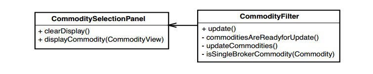

# Chương 22 - Tôi Cần Thay đổi một Phương thức "Quái vật" và Tôi Không thể Viết Kiểm thử cho Nó

Một trong những điều khó khăn nhất khi làm việc với code kế thừa là xử lý các phương thức lớn. Trong nhiều trường hợp, bạn có thể tránh tái cấu trúc các phương thức lớn bằng cách sử dụng các kỹ thuật _Sprout Method (59)_ và _Sprout Class (63)_. Tuy nhiên, ngay cả khi bạn có thể tránh được nó, thì thật đáng tiếc khi bạn phải làm vậy. Các phương thức lớn là vũng lầy trong một cơ sở code. Bất cứ khi nào bạn phải thay đổi chúng, bạn phải quay lại và cố gắng hiểu lại chúng, sau đó bạn phải thực hiện các thay đổi của mình. Thường thì điều đó mất nhiều thời gian hơn cần thiết.

Phương thức lớn là một nỗi đau, nhưng phương thức "quái vật" còn tồi tệ hơn. Một phương thức "quái vật" là một phương thức quá dài và phức tạp đến mức bạn thực sự cảm thấy không thoải mái khi chạm vào nó. Các phương thức "quái vật" có thể dài hàng trăm hoặc hàng nghìn dòng, với vô số dấu vết rải rác khiến việc điều hướng thành gần như không thể. Khi bạn có những phương thức "quái vật", bạn có xu hướng muốn in chúng lên một vài thước giấy liên tục và đặt chúng ở hành lang để bạn cùng đồng nghiệp có thể cùng tìm hiểu chúng.

Một lần, tôi đang trên đường tham dự một cuộc họp, và khi đang đi bộ về phòng khách sạn, một người bạn của tôi nói: "Này, anh phải xem cái này." Anh ấy đi vào phòng, lôi máy tính xách tay ra và chỉ cho tôi một phương thức dài hơn một nghìn dòng. Bạn tôi biết tôi đang nghiên cứu về tái cấu trúc và nói, "Làm thế quái nào anh có thể tái cấu trúc thứ này?" Chúng tôi bắt đầu suy nghĩ về nó. Chúng tôi biết rằng kiểm thử là chìa khóa, nhưng bạn sẽ phải bắt đầu từ đâu với một phương thức lớn như vậy?

Chương này phác thảo những gì tôi đã học được kể từ đó.

## Các loại "quái vật"
Phương thức "quái vật" có nhiều loại. Không nhất thiết phải là các loại khác biệt rõ rệt. Các phương thức này giống như thú mỏ vịt — là sự kết hợp của nhiều loại.

### Phương thức gạch đầu dòng
Phương thức gạch đầu dòng là phương thức gần như không có dấu thụt đầu dòng. Nó chỉ là một chuỗi các đoạn code khiến bạn nghĩ về một danh sách có dấu đầu dòng. Có một số đoạn code trong các khối có thể được thụt vào, nhưng bản thân phương thức không có nhiều đoạn thụt đầu dòng. Khi bạn nhìn vào một phương thức gạch đầu dòng và nheo mắt lại, bạn sẽ thấy giống như Ví dụ 22.1.

Đây là dạng chung của phương thức gạch đầu dòng. Nếu bạn may mắn, ai đó sẽ đặt thêm dòng trống giữa các phần hoặc nhận xét để cho bạn thấy rằng họ làm điều gì đó khác biệt ở đây. Trong một thế giới lý tưởng, bạn có thể chỉ cần trích xuất từng phần thành cách phương thức khác nhau, nhưng thường thì chúng không dễ dàng tái cấu trúc theo cách đó. Khoảng cách giữa các phần cũng dễ gây nhầm lẫn vì các biến tạm thời thường được khai báo ở phần này và được sử dụng trong phần tiếp theo. Chia nhỏ phương thức thường không dễ dàng như chỉ cần sao chép và dán code. Mặc dù vậy, các phương thức gạch đầu dòng ít đáng sợ hơn một chút so với các phương thức khác, chủ yếu là do việc không có dấu thụt đầu dòng cho phép chúng ta giữ vững phương hướng của mình.

```java
void Reservation::extend(int additionalDays)
{
	int status = RIXInterface::checkAvailable(type, location, startingDate);

	int identCookie = -1;
	switch(status) {
		case NOT_AVAILABLE_UPGRADE_LUXURY:
			identCookie = RIXInterface::holdReservation(Luxury,location,startingDate,
			additionalDays +dditionalDays);
			break;
		case NOT_AVAILABLE_UPGRADE_SUV:
		{
			int theDays = additionalDays + additionalDays;
			if (RIXInterface::getOpCode(customerID) != 0)
			theDays++;
			identCookie = RIXInterface::holdReservation(SUV,location,startingDate, theDays);
		}
		break;
		case NOT_AVAILABLE_UPGRADE_VAN:
			identCookie = RIXInterface::holdReservation(Van,
			location,startingDate, additionalDays + additionalDays);
			break;
		case AVAILABLE:
		default:
			RIXInterface::holdReservation(type,location,startingDate);
			break;
	}

	if (identCookie != -1 && state == Initial) {
		RIXInterface::waitlistReservation(type,location,startingDate);
	}

	Customer c = res_db.getCustomer(customerID);

	if (c.vipProgramStatus == VIP_DIAMOND) {
		upgradeQuery = true;
	}

	if (!upgradeQuery)
		RIXInterface::extend(lastCookie, days + additionalDays);
	else {
		RIXInterface::waitlistReservation(type,location,startingDate);
		RIXInterface::extend(lastCookie, days + additionalDays +1);
	}
	...
}
```
Ví dụ 22.1 Phương thức gạch đầu dòng

### Phương thức hỗn loạn

Một phương thức hỗn loạn là một phương thức chỉ có một đoạn thụt đầu dòng lớn duy nhất. Trường hợp đơn giản nhất là một phương thức có một câu lệnh điều kiện lớn, như trong ví dụ 22.2.

```java
Reservation::Reservation(VehicleType type, int customerID, long startingDate, int days, XLocation l)
: type(type), customerID(customerID), startingDate(startingDate), days(days), lastCookie(-1),
state(Initial), tempTotal(0)
{
	location = l;
	upgradeQuery = false;

	if (!RIXInterface::available()) {
		RIXInterface::doEvents(100);
		PostLogMessage(0, 0, "delay on reservation creation");
		int holdCookie = -1;
		switch(status) {
			case NOT_AVAILABLE_UPGRADE_LUXURY:
				holdCookie = RIXInterface::holdReservation(Luxury,l,startingDate);
				if (holdCookie != -1) {
					holdCookie |= 9;
				}
				break;
			case NOT_AVAILABLE_UPGRADE_SUV:
				holdCookie = RIXInterface::holdReservation(SUV,l,startingDate);
				break;
			case NOT_AVAILABLE_UPGRADE_VAN:
				holdCookie = RIXInterface::holdReservation(Van,l,startingDate);
				break;
			case AVAILABLE:
			default:
				RIXInterface::holdReservation;
				state = Held;
				break;
		}
	}
	...
}
```
Ví dụ 22.2 Phương thức hỗn loạn đơn giản

Nhưng kiểu hỗn loạn trên gần giống như phương thức gạch đầu dòng. Những kiểu hỗn loạn đòi hỏi yêu cầu cao là những phương thức có dạng như trong Ví dụ 22.3.

Cách tốt nhất để biết liệu phương thức có hỗn loạn hay không là cố gắng sắp xếp các khối theo một phương thức dài. Nếu bạn bắt đầu cảm thấy chóng mặt, bạn đã gặp phải một phương thức hỗn loạn.

```java
Reservation::Reservation(VehicleType type, int customerID, long startingDate, int days, XLocation l)
: type(type), customerID(customerID), startingDate(startingDate), days(days), lastCookie(-1),
state(Initial), tempTotal(0)
{
	location = l;
	upgradeQuery = false;

	while(!RIXInterface::available()) {
		RIXInterface::doEvents(100);
		PostLogMessage(0, 0, "delay on reservation creation");
		int holdCookie = -1;
		switch(status) {
			case NOT_AVAILABLE_UPGRADE_LUXURY:
			holdCookie = RIXInterface::holdReservation(Luxury,l,startingDate);
			if (holdCookie != -1) {
				if (l == GIG && customerID == 45) {
					// Special #1222
					while (RIXInterface::notBusy()) {
						int code =
						RIXInterface::getOpCode(customerID);
						if (code == 1 || customerID > 0)) {
							PostLogMessage(1, 0, "QEX PID");
							for (int n = 0; n < 12; n++) {
								int total = 2000;
								if (state == Initial || state == Held)
								{
									total += getTotalByLocation(location);
									tempTotal = total;
									if (location == GIG && days > 2)
									{
										if (state == Held)
											total += 30;
									}
								}
								RIXInterface::serveIDCode(n, total);
							}
						} else {
							RIXInterface::serveCode(customerID);
						}
					}
				}
			}
			break;
				case NOT_AVAILABLE_UPGRADE_SUV:
				holdCookie =
				RIXInterface::holdReservation(SUV,l,startingDate);
				break;
			case NOT_AVAILABLE_UPGRADE_VAN:
				holdCookie =
				RIXInterface::holdReservation(Van,l,startingDate);
				break;
			case AVAILABLE:
			default:
				RIXInterface::holdReservation(type,l,startingDate);
				state = Held;
				break;
		}
	}
	...
}
```

Hầu hết các phương thức không hoàn toàn là gạch đầu dòng hoặc hỗn loạn, mà là một cái gì đó ở giữa. Nhiều phương thức hỗn loạn có các phần dấu đầu dòng dài ẩn sâu bên trong chúng, nhưng vì chúng được lồng vào nhau nên khó có thể viết kiểm thử xác định hành vi của chúng. Hỗn loạn đưa ra những thách thức riêng biệt.

Khi tái cấu trúc các phương thức dài, việc có hay không có công cụ tái cấu trúc sẽ tạo nên sự khác biệt. Gần như mọi công cụ tái cấu trúc đều hỗ trợ tái cấu trúc trích xuất phương thức vì có một lượng đòn bẩy đáng kinh ngạc trong sự hỗ trợ đó. Nếu một công cụ có thể trích xuất các phương thức cho bạn một cách an toàn, thì bạn không cần kiểm thử để xác minh việc trích xuất của mình. Công cụ này thực hiện phân tích cho bạn và tất cả những gì còn lại là học cách sử dụng các trích xuất để đưa một phương thức vào dạng phù hợp cho công việc tiếp theo.

Khi bạn không có hỗ trợ trích xuất phương thức, việc dọn dẹp các phương thức "quái vật" sẽ khó khăn hơn. Bạn thường phải thận trọng hơn vì công việc của bạn bị giới hạn bởi các kiểm thử mà bạn có thể đạt được.

## Xử lý Phương thức Quái vật với Công cụ Hỗ trợ Tái cấu trúc Tự động

Khi bạn có một công cụ trích xuất các phương thức, bạn phải hiểu rõ những gì nó có thể và không thể. Hầu hết các công cụ tái cấu trúc ngày nay đều thực hiện các phương thức trích xuất đơn giản và một loạt các phép tái cấu trúc khác, nhưng chúng không xử lý tất cả các phép tái cấu trúc phụ trợ mà mọi người thường muốn thực hiện khi chia nhỏ các phương thức lớn. Chẳng hạn, chúng ta thường muốn sắp xếp lại các câu lệnh để nhóm chúng lại khi trích xuất. Không có công cụ hiện tại nào thực hiện phân tích cần thiết để xem liệu việc sắp xếp lại có thể được thực hiện một cách an toàn hay không. Đó là một nỗi hổ thẹn vì nó có thể là một nguồn lỗi.

Để sử dụng các công cụ tái cấu trúc một cách hiệu quả với các phương thức lớn, bạn nên thực hiện một loạt thay đổi chỉ với công cụ đó và tránh tất cả các chỉnh sửa khác đối với nguồn. Điều này có thể giống như tự hạn chế công cụ tái cấu trúc, nhưng nó mang lại cho bạn sự tách biệt rõ ràng giữa những thay đổi an toàn và những thay đổi không an toàn. Khi bạn tái cấu trúc như vậy, bạn nên tránh ngay cả những điều đơn giản, chẳng hạn như sắp xếp lại các câu lệnh và tách rời các biểu thức. Nếu công cụ của bạn hỗ trợ đổi tên biến, điều đó thật tuyệt, nhưng nếu không, hãy tạm dừng việc đó lại sau.

> Khi thực hiện tái cấu trúc tự động mà không có kiểm thử, hãy sử dụng riêng công cụ này. Sau một loạt các lần tái cấu trúc tự động, bạn thường có thể có được một số kiểm thử tại chỗ mà bạn có thể sử dụng để xác minh bất kỳ chỉnh sửa thủ công nào mà bạn thực hiện.

Khi bạn thực hiện trích xuất, bạn cần thực hiện được những mục tiêu chính sau:
1. Tách logic ra khỏi những phụ thuộc khó xử lý
2. Giới thiệu các liên kết giúp dễ dàng viết kiểm thử tại chỗ để tái cấu trúc nhiều hơn

Đây là một ví dụ:

```java
class CommoditySelectionPanel
{
	...
	public void update() {
		if (commodities.size() > 0 && commodities.GetSource().equals("local")) {
			listbox.clear();
			for (Iterator it = commodities.iterator(); it.hasNext(); ) {
				Commodity current = (Commodity)it.next();
				if (commodity.isTwilight() && !commodity.match(broker))
					listbox.add(commodity.getView());
			}
		}
		...
	}
	...
}
```

Trong phương thức này, rất nhiều thứ có thể cải thiện được. Một trong những điều kỳ lạ là kiểu công việc lọc này lại diễn ra trong một lớp bảng điều khiển, trong khi lý tưởng nhất là chúng chỉ chịu trách nhiệm hiển thị. Gỡ rối code này chắc chắn là khó khăn. Nếu muốn viết kiểm thử cho phương thức hiện tại, chúng ta có thể viết theo danh sách trạng thái, nhưng điều đó sẽ không giúp được nhiều trong việc làm cho thiết kế tốt hơn.

Với sự hỗ trợ tái cấu trúc, chúng ta có thể bắt đầu đặt tên cho các phần cấp cao của phương thức và phá vỡ các phụ thuộc cùng một lúc. Đây là code sẽ trông như thế này sau một loạt các lần trích xuất.

```java
class CommoditySelectionPanel
{
	...
	public void update() {
		if (commoditiesAreReadyForUpdate()) {
			clearDisplay();
			updateCommodities();
		}
		...
	}

	private boolean commoditiesAreReadyForUpdate() {
		return commodities.size() > 0 && commodities.GetSource().equals("local");
	}

	private void clearDisplay() {
		listbox.clear();
	}

	private void updateCommodities() {
		for (Iterator it = commodities.iterator(); it.hasNext();) {
			Commodity current = (Commodity)it.next();
			if (singleBrokerCommodity(commodity)) {
				displayCommodity(current.getView());
			}
		}
	}

	private boolean singleBrokerCommodity(Commodity commodity) {
		return commodity.isTwilight() && !commodity.match(broker);
	}

	private void displayCommodity(CommodityView view) {
		listbox.add(view);
	}
	...
}
```

Thành thật mà nói, bản cập nhật trông không khác lắm về cấu trúc; nó vẫn chỉ là một câu điều kiện `if` với một số công việc bên trong. Nhưng giờ công việc đã được giao cho các phương thức. Phương thức `update` trông giống như một bộ khung để code thực thi. Còn cách đặt tên thì sao? Chúng có vẻ hơi giả tạo, phải không? Nhưng đó là một điểm khởi đầu tốt. Ít nhất, chúng cho phép code giao tiếp ở cấp độ cao hơn và chúng giới thiệu các liên kết cho phép chúng ta phá vỡ các phụ thuộc. Chúng ta có thể _Chia class con và Ghi đè Phương thức (401)_ để hiểu được `displayCommodity` và `clearDisplay`. Sau đó, có thể xem xét khả năng tạo một lớp hiển thị và di chuyển các phương thức hiển thị vào trong nó, sử dụng các kiểm thử đó làm đòn bẩy. Tuy nhiên, trong trường hợp này, sẽ phù hợp hơn nếu chúng ta có thể chuyển `update` và `updateCommodities` sang một lớp khác và để `ClearDisplay` và `displayCommodity` ở đây để có thể tận dụng thực tế rằng lớp này là một bảng điều khiển, một màn hình. Chúng ta có thể đổi tên các phương thức sau này khi chúng ổn định. Sau khi tái cấu trúc bổ sung, thiết kế của chúng ta có thể trông giống như Hình 22.4.


Hình 22.4 Logig trích xuất lớp `CommoditySelectionPanel`.

Điều quan trọng cần nhớ khi sử dụng một công cụ tự động để trích xuất các phương thức là bạn có thể thực hiện nhiều công việc thô một cách an toàn và xử lý các chi tiết sau khi bạn thực hiện các kiểm thử khác. Đừng quá lo lắng về các phương thức có vẻ như chúng không phù hợp với lớp. Thường thì họ chỉ ra nhu cầu trích xuất một lớp mới sau này. Xem _Chương 20 Lớp này quá lớn và tôi không muốn nó lớn hơn nữa_, để biết thêm ý tưởng về cách thực hiện điều này.

## Thử thách tái cấu trúc thủ công

Khi bạn có công cụ hỗ trợ tái cấu trúc tự động, bạn không cần phải làm gì đặc biệt để bắt đầu chia nhỏ các phương thức lớn. Các công cụ tái cấu trúc tốt sẽ kiểm tra từng lần tái cấu trúc mà bạn thực hiện và không cho phép việc tái cấu trúc không an toàn. Nhưng khi bạn không có công cụ tái cấu trúc, tính chính xác là thứ bạn phải nỗ lực duy trì và các kiểm thử là công cụ mạnh nhất của bạn.

Các phương thức "quái vật" làm cho việc kiểm thử, tái cấu trúc và bổ sung tính năng trở nên rất khó khăn. Nếu bạn có thể tạo các thực thể của lớp chứa phương thức trong kiểm thử khai thác, bạn có thể cố gắng tạo ra một số trường hợp kiểm thử sẽ mang lại cho bạn sự tự tin khi thực hiện chia nhỏ phương thức. Nếu logic trong phương thức đặc biệt phức tạp, đây có thể là một cơn ác mộng. May mắn thay, trong những trường hợp đó, chúng ta có thể sử dụng một số kỹ thuật. Tuy nhiên, trước khi xem xét chúng, hãy xem điều gì có thể đi sai hướng khi chúng ta trích xuất các phương thức.

Xem xét danh sách ngắn gọn dưới đây. Nó không chứa mọi lỗi có thể xảy ra, nhưng nó có những lỗi phổ biến nhất:

1. Chúng ta có thể quên truyền một biến vào phương thức được trích xuất. Thông thường, trình biên dịch sẽ cho chúng ta biết về biến bị thiếu (trừ khi nó có cùng tên với một biến thể hiện), nhưng chúng ta có thể nghĩ rằng nó cần phải là một biến cục bộ và khai báo nó trong phương thức mới.

2. Chúng ta có thể đặt tên cho phương thức được trích xuất để ẩn hoặc ghi đè phương thức có cùng tên trong lớp cơ sở.

3. Chúng ta có thể mắc lỗi khi truyền tham số hoặc gán giá trị trả về. Chúng ta có thể làm điều gì đó thực sự ngớ ngẩn, chẳng hạn như trả về giá trị sai. Tinh vi hơn, chúng ta có thể trả lại hoặc chấp nhận các kiểu biến sai trong phương thức mới.

Khá nhiều điều có thể gây ra sai sót. Các kỹ thuật trong phần này có thể giúp việc trích xuất ít rủi ro hơn khi chúng ta không có sẵn các kiểm thử.

## Sử dụng Biến số cảm biến

Chúng ta không muốn thêm các tính năng vào code sản phẩm khi thực hiện tái cấu trúc, nhưng không có nghĩa là không thể viết thêm bất kỳ code nào. Đôi khi, sẽ rất hữu ích nếu thêm biến vào một lớp và sử dụng nó để cảm nhận các điều kiện trong phương thức đang được tái cấu trúc. Khi thực hiện xong việc tái cấu trúc, chúng ta có thể loại bỏ biến đó và code sẽ lại ở trạng thái sạch. Kỹ thuật này được gọi là _Sử dụng biến số cảm biến_. Dưới đây là một ví dụ. Chúng ta bắt đầu với một phương thức trong lớp Java có tên là `DOMBuilder`. Chúng ta muốn dọn dẹp nó, nhưng thật không may là chúng ta không có công cụ tái cấu trúc:

```java
public class DOMBuilder
{
	...
	void processNode(XDOMNSnippet root, List childNodes)
	{
		if (root != null) {
			if (childNodes != null)
				root.addNode(new XDOMNSnippet(childNodes));
			root.addChild(XDOMNSnippet.NullSnippet);
		}
		List paraList = new ArrayList();
		XDOMNSnippet snippet = new XDOMNReSnippet();
		snippet.setSource(m_state);
		for (Iterator it = childNodes.iterator(); it.hasNext();) {
			XDOMNNode node = (XDOMNNode)it.next();
			if (node.type() == TF_G || node.type() == TF_H || (node.type() == TF_GLOT && node.isChild())) {
				paraList.addNode(node);
			}
			...
		}
		...
	}
	...
}
```

Trong ví dụ trên, có vẻ như rất nhiều công việc trong phương thức thực thi bởi `XDOMNSnippet`. Điều đó có nghĩa là chúng ta có thể viết bất kỳ kiểm thử nào chúng ta cần bằng cách chuyển các giá trị khác nhau làm đối số cho phương thức này. Tuy nhiên, trên thực tế, rất nhiều công việc xảy ra một cách gián tiếp, chúng chỉ có thể được cảm nhận theo một cách rất gián tiếp. Trong tình huống như thế này, chúng ta có thể sử dụng các biến số cảm biến để hỗ trợ công việc của mình; chúng ta có thể sử dụng một biến thực thể để thấy rằng một nút được thêm vào `paraList` khi nó có loại nút phù hợp

```java
public class DOMBuilder
{
	public boolean nodeAdded = false;
	...
	void processNode(XDOMNSnippet root, List childNodes)
	{
	if (root != null) {
		if (childNodes != null)
			root.addNode(new XDOMNSnippet(childNodes));
		root.addChild(XDOMNSnippet.NullSnippet);
	}
	List paraList = new ArrayList();
	XDOMNSnippet snippet = new XDOMNReSnippet();
	snippet.setSource(m_state);
	for (Iterator it = childNodes.iterator(); it.hasNext(); ) {
		XDOMNNode node = (XDOMNNode)it.next();
		if (node.type() == TF_G || node.type() == TF_H || (node.type() == TF_GLOT && node.isChild())) {
			paraList.add(node);
			nodeAdded = true;
			}
			...
		}
		...
	}
	...
}
```

Khi có biến đó, chúng ta vẫn thiết kế đầu vào để tạo ra một trường hợp bao gồm điều kiện đó. Khi làm như vậy, chúng ta có thể trích xuất đoạn logic đó và các kiểm thử của vẫn sẽ vượt qua.

Đây là một kiểm thử cho thấy rằng chúng ta thêm một nút khi loại nút là `TF_G`:

```java
void testAddNodeOnBasicChild()
{
	DOMBuilder builder = new DomBuilder();
	List children = new ArrayList();
	children.add(new XDOMNNode(XDOMNNode.TF_G));
	Builder.processNode(new XDOMNSnippet(), children);

	assertTrue(builder.nodeAdded);
}
```

Đây là một kiểm thử cho thấy không được thêm một nút khi loại nút sai:

```java
void testNoAddNodeOnNonBasicChild()
{
	DOMBuilder builder = new DomBuilder();
	List children = new ArrayList();
	children.add(new XDOMNNode(XDOMNNode.TF_A));
	Builder.processNode(new XDOMNSnippet(), children);

	assertTrue(!builder.nodeAdded);
}
```

Với những kiểm thử này, chúng ta sẽ cảm thấy đỡ lo lắng hơn khi trích xuất phần thân của điều kiện xác định xem các nút có được thêm vào hay không. Chúng ta đang sao chép toàn bộ điều kiện và kiểm thử cho thấy rằng nút đã được thêm vào khi điều kiện thỏa mãn.

```java
public class DOMBuilder
{
	void processNode(XDOMNSnippet root, List childNodes)
	{
		if (root != null) {
			if (childNodes != null)
				root.addNode(new XDOMNSnippet(childNodes));
			root.addChild(XDOMNSnippet.NullSnippet);
		}
		List paraList = new ArrayList();
		XDOMNSnippet snippet = new XDOMNReSnippet();
		snippet.setSource(m_state);
		for (Iterator it = childNodes.iterator(); it.hasNext();) {
			XDOMNNode node = (XDOMNNode)it.next();
			if (isBasicChild(node)) {
				paraList.addNode(node);
				nodeAdded = true;
			}
			...
		}
		...
	}
	private boolean isBasicChild(XDOMNNode node) {
		return node.type() == TF_G
			|| node.type() == TF_H
			|| node.type() == TF_GLOT && node.isChild());
	}
	...
}
```

Sau đó, chúng ta có thể xóa cờ và kiểm thử.

Trong trường hợp này, tôi đã sử dụng một biến boolean. Tôi chỉ muốn xem liệu nút đó có còn được thêm vào sau khi trích xuất điều kiện hay không. Tôi cảm thấy khá tự tin rằng mình có thể trích xuất toàn bộ nội dung của điều kiện mà không gây ra lỗi, vì vậy tôi không kiểm thử tất cả logic của điều kiện. Các kiểm thử này chỉ cung cấp một cách kiểm tra nhanh để đảm bảo rằng điều kiện vẫn là một phần của code sau khi trích xuất. Để có thêm hướng dẫn về số lượng kiểm thử cần thực hiện trong quá trình trích xuất phương thức, hãy xem _Kiểm Thử nhắm mục tiêu (189)_ trong _Chương 13, Tôi cần thực hiện thay đổi nhưng tôi không biết kiểm thử nào phải viết_.

Khi bạn đang sử dụng _biến số cảm biến_, bạn nên giữ chúng trong lớp khi đang thực hiện tái cấu trúc và chỉ xóa chúng sau đó. Tôi thường làm điều này để có thể xem tất cả các kiểm thử tôi viết khi thực hiện trích xuất và hoàn tác chúng dễ dàng nếu thấy rằng tôi muốn trích xuất theo một cách khác. Khi tôi hoàn thành, tôi sẽ xóa các kiểm thử này hoặc tái cấu trúc để chúng kiểm tra các phương thức tôi trích xuất thay vì phương thức ban đầu.

Các biến số cảm biến là một công cụ quan trọng để chia nhỏ các phương thức quái vật. Bạn có thể dùng để tái cấu trúc sâu bên trong các phương thức hỗn loạn, và bạn cũng có thể dùng để loại bỏ dần dần các phương thức hỗn loạn. Ví dụ: nếu chúng ta có một phương thức lồng hầu hết code của nó vào sâu bên trong một tập hợp các câu lệnh có điều kiện, chúng ta có thể sử dụng các biến số cảm biến để trích xuất các câu lệnh có điều kiện hoặc trích xuất nội dung của các câu lệnh có điều kiện vào các phương thức mới. Chúng ta cũng có thể sử dụng các biến số cảm biến để làm việc trên các phương thức mới đó cho đến khi loại bỏ hoàn toàn sự hỗn loạn.

### Trích xuất những gì bạn biết

Một chiến lược khác có thể sử dụng khi làm việc với các phương thức "quái vật" là bắt đầu từ quy mô nhỏ và tìm những đoạn code ngắn có thể trích xuất một cách tự tin mà không cần kiểm thử, sau đó thêm các kiểm thử để bao phủ chúng. OK, tôi sẽ nói điều này theo một cách khác bởi vì khái niệm "ngắn" với mỗi người có sự khác nhau. Khi tôi nói "ngắn", ý tôi là hai hoặc ba dòng - nhiều nhất là năm dòng, một đoạn code mà bạn có thể dễ dàng gọi tên. Điều quan trọng cần chú ý khi bạn thực hiện các thao tác trích xuất ngắn này là _số khớp nối_ của quá trình trích xuất. _Số khớp nối_ là số lượng giá trị truyền vào và trả về từ phương thức mà bạn đang trích xuất. Ví dụ: nếu chúng ta trích xuất một phương thức `max` từ phương thức sau, số lượng của nó sẽ là `3`:

```cpp
void process(int a, int b, int c) {
	int maximum;
	if (a > b)
		maximum = a;
	else
		maximum = b;
	...
}
```

Đây là code sau khi trích xuất:

```cpp
void process(int a, int b, int c) {
	int maximum = max(a,b);
	...
}
```
