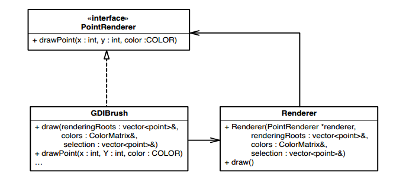
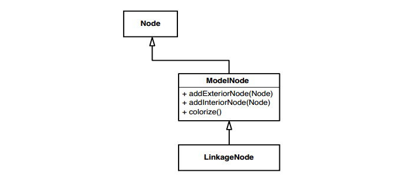
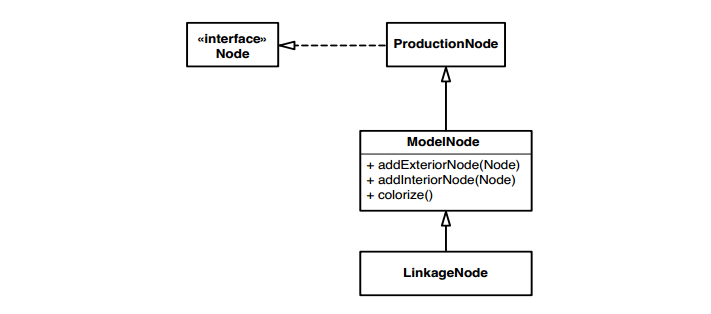
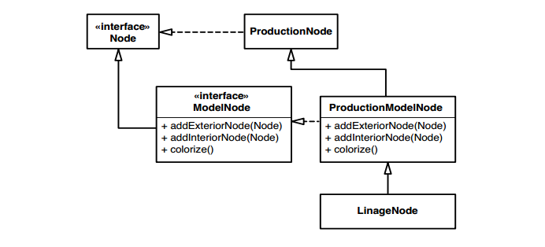

# Chương 25, Các kỹ thuật phá bỏ sự phụ thuộc

Trong chương này, tôi sẽ trình bày về các kỹ thuật phá bỏ sự phụ thuộc. Danh sách này không đầy đủ; đây chỉ là một số kỹ thuật mà tôi đã sử dụng với các nhóm để phân tách các lớp một cách đủ tốt để kiểm thử chúng. Về mặt lý thuyết, những kỹ thuật này là tái cấu trúc — mỗi kỹ thuật đều bảo toàn hành vi. Nhưng không giống như hầu hết các hoạt động tái cấu trúc được viết trong ngành cho đến nay, những hoạt động tái cấu trúc này được thực hiện mà không cần kiểm thử, để có được các kiểm thử tại chỗ. Trong hầu hết các trường hợp, nếu bạn làm theo các bước này một cách cẩn thận thì khả năng xảy ra sai sót là rất nhỏ. Điều này không có nghĩa là chúng hoàn toàn an toàn. Bạn vẫn có thể mắc lỗi khi thực hiện chúng, vì vậy bạn nên cẩn thận khi sử dụng chúng. Trước khi bạn sử dụng những phép tái cấu trúc này, hãy xem _Chương 23, Làm thế nào để biết rằng tôi không làm phá vỡ bất cứ thứ gì?_ Những lời khuyên trong chương đó có thể giúp bạn sử dụng những kỹ thuật này một cách an toàn để bạn có thể viết kiểm thử đúng vị trí. Khi làm như vậy, bạn sẽ có thể thực hiện những thay đổi sâu rộng hơn và tự tin hơn rằng mình không vi phạm bất kỳ điều gì.

Những kỹ thuật này không ngay lập tức làm cho thiết kế của bạn tốt hơn. Trên thực tế, nếu bạn có khả năng thiết kế tốt, một số kỹ thuật này sẽ khiến bạn lo lắng. Những kỹ thuật này có thể giúp bạn có được các phương thức, lớp và cụm lớp được kiểm thử và nhờ đó hệ thống của bạn sẽ dễ bảo trì hơn. Tại thời điểm đó, bạn có thể sử dụng các phép tái cấu trúc được hỗ trợ kiểm thử để làm cho thiết kế rõ ràng hơn

> Một số cách tái cấu trúc trong chương này đã được Martin Fowler mô tả trong cuốn sách _Tái cấu trúc: Cải thiện thiết kế mã hiện có (Refactoring: Improving the Design of Existing Code)_ (Addison-Wesley, 1999). Tôi đã đưa chúng vào đây với một số thay đổi. Chúng đã được thiết kế riêng để có thể sử dụng an toàn mà không cần kiểm thử.

## Tham số thích ứng (Adapt Parameter)

Khi thực hiện thay đổi với các phương thức, vấn đề đau đầu tôi thường gặp phải là sự phụ thuộc do các tham số của phương thức gây ra. Đôi khi tôi cảm thấy khó tạo được tham số mình cần; hoặc là, tôi cần kiểm thử tác động của phương thức lên tham số. Trong nhiều trường hợp, điều đó không hề dễ dàng với lớp của tham số. Nếu lớp đó là lớp mà tôi có thể sửa đổi, tôi có thể sử dụng _Trích xuất Giao diện (362)_ để phá bỏ sự phụ thuộc. _Trích xuất Giao diện_ thường là lựa chọn tốt nhất khi muốn phá bỏ sự phụ thuộc của tham số.

Nói chung, chúng ta muốn làm điều gì đó thật đơn giản để phá bỏ các phần phụ thuộc cản trở việc kiểm thử, một điều gì đó không có khả năng xảy ra lỗi. Tuy nhiên, trong một số trường hợp, _Trích xuất Giao diện (362)_ hoạt động không tốt lắm. Nếu loại tham số ở mức khá thấp hoặc dành riêng cho một số công nghệ triển khai thì việc trích xuất giao diện có thể phản tác dụng hoặc không thể thực hiện được.

> Sử dụng _Tham số thích ứng_ khi bạn không thể sử dụng _Trích xuất Giao diện (362)_ với lớp của tham số hoặc khi tham số đó khó giả mạo.

Dưới đây là một ví dụ:

```java
public class ARMDispatcher
{
  public void populate(HttpServletRequest request) {
    String [] values = request.getParameterValues(pageStateName);

    if (values != null && values.length > 0)
    {
      marketBindings.put(pageStateName + getDateStamp(), values[0]);
    }
    ...
  }
  ...
}
```

Trong lớp trên, phương thức `populate` nhận `HttpServletRequest` làm tham số. `HttpServletRequest` là giao diện thuộc chuẩn J2EE của Sun dành cho Java. Nếu hiện tại muốn kiểm thử `populate`, chúng ta sẽ phải tạo một lớp triển khai `HttpServletRequest` và cung cấp một số cách để truyền các giá trị tham số mà nó cần để có kết quả trả về khi kiểm thử. Tài liệu Java SDK hiện tại cho thấy có khoảng 23 phương thức khai báo trong `HttpServletRequest` và không tính các khai báo từ siêu giao diện của nó mà chúng ta phải triển khai. Sẽ thật tuyệt nếu sử dụng _Trích xuất Giao diện (362)_ để tạo một giao diện hẹp hơn, chỉ cung cấp các phương thức chúng ta cần, nhưng chúng ta không thể trích xuất giao diện từ giao diện khác. Trong Java, chúng ta cần có `HttpServletRequest` mở rộng giao diện chúng ta đang trích xuất và không thể sửa đổi giao diện chuẩn theo cách đó. May mắn thay, chúng ta có những lựa chọn khác.

Một số thư viện đối tượng giả lập có sẵn cho J2EE. Nếu tải xuống một trong số chúng, chúng ta có thể sử dụng mô hình cho `HttpServletRequest` và thực hiện kiểm thử chúng ta cần thực hiện. Điều này có thể tiết kiệm khá nhiều thời gian; nếu theo cách này, chúng ta sẽ không phải mất thời gian để tự thực hiện lệnh gọi servlet giả. Vì vậy, có vẻ như chúng ta đã có giải pháp — hoặc không?

Khi tôi phá bỏ sự phụ thuộc, tôi luôn cố gắng nhìn về phía trước và xem kết quả liệu sẽ như thế nào. Sau đó tôi có thể quyết định xem tôi có thể sống chung với nó hay không. Trong trường hợp này, code sản xuất của chúng ta sẽ trông khá giống nhau và chúng ta sẽ phải làm rất nhiều việc để duy trì `HttpServletRequest`, một giao diện API, tại chỗ. Có cách nào để làm cho code trông đẹp hơn và làm cho việc phá bỏ phần phụ thuộc dễ dàng hơn không? Trên thực tế là có. Chúng ta có thể gói tham số lại và phá bỏ hoàn toàn sự phụ thuộc của chúng ta vào giao diện API. Khi chúng ta hoàn thành việc đó, code sẽ trông như thế này:

```java
public class ARMDispatcher {
  public void populate(ParameterSource source) {
    String values = source.getParameterForName(pageStateName);
    if (value != null) {
      marketBindings.put(pageStateName + getDateStamp(),
      value);
    }
    ...
  }
}
```

Ở đây chúng ta đã làm gì? Chúng ta đã sử dụng một giao diện mới có tên `ParameterSource`. Vào lúc này, phương thức duy nhất mà nó có là phương thức có tên `getParameterForName`. Không giống như phương thức `HttpServletRequest getParmeterValue`, `getParameterForName` chỉ trả về một `String`. Chúng ta viết phương thức theo cách đó vì chúng ta chỉ quan tâm đến tham số đầu tiên trong ngữ cảnh này.

> Hướng tới các giao diện truyền đạt trách nhiệm hơn là chi tiết triển khai. Điều này làm cho code dễ đọc hơn và dễ bảo trì hơn.

Đây là một lớp giả triển khai `ParameterSource`. Chúng ta có thể sử dụng nó trong kiểm thử của mình:

```java
class FakeParameterSource implements ParameterSource
{
  public String value;
  public String getParameterForName(String name) {
    return value;
  }
}
```

Và nguồn tham số cho code sản xuất trông như thế này:

```java
class ServletParameterSource implements ParameterSource
{
  private HttpServletRequest request;

  public ServletParameterSource(HttpServletRequest request) {
    this.request = request;
  }

  String getParameterValue(String name) {
    String [] values = request.getParameterValues(name);
    if (values == null || values.length < 1)
      return null;
    return values[0];
  }
}
```

Nhìn bề ngoài, việc này có vẻ giống như chúng ta đang làm mọi thứ trở nên đẹp đẽ chỉ để cho đẹp, nhưng một vấn đề phổ biến trong các code base kế thừa là thường không có bất kỳ lớp trừu tượng nào; phần code quan trọng nhất trong hệ thống thường nằm xen kẽ với các lệnh gọi API cấp thấp. Chúng ta đã thấy điều này có thể gây khó khăn cho việc kiểm thử như thế nào, nhưng vấn đề còn vượt xa việc kiểm thử. Code khó hiểu hơn khi nó tràn ngập các giao diện lớn chứa hàng tá phương thức không được sử dụng. Khi bạn tạo các phần trừu tượng hẹp với mục tiêu nhắm đến những gì bạn cần, code của bạn sẽ giao tiếp tốt hơn và bạn sẽ có được đường nối tốt hơn.

Nếu chúng ta chuyển sang sử dụng `ParameterSource` trong ví dụ này, chúng ta sẽ tách logic tổng hợp khỏi các nguồn cụ thể. Chúng ta sẽ không bị ràng buộc với các giao diện J2EE cụ thể nữa.

> Tham số thích ứng là một trường hợp trong đó chúng ta không _Bảo toàn chữ ký (312)_. Hãy sử dụng cẩn thận.

Tham số thích ứng có thể gặp rủi ro nếu giao diện đơn giản hóa mà bạn đang tạo cho lớp của tham số quá khác với giao diện hiện tại của tham số. Nếu không cẩn thận khi thực hiện những thay đổi đó, chúng ta có thể gây ra những lỗi nhỏ. Như mọi khi, hãy nhớ rằng mục tiêu là phá vỡ các phần phụ thuộc đủ tốt để thực hiện các kiểm thử. Bạn nên thiên về việc thực hiện những thay đổi mà bạn cảm thấy tự tin hơn là những thay đổi mang lại cho bạn cấu trúc tốt nhất. Những điều đó có thể đến sau khi bạn đã có kiểm thử. Ví dụ: trong trường hợp này, chúng ta có thể muốn thay đổi `ParameterSource` để các lệnh gọi của nó không phải kiểm thử null khi họ gọi các phương thức của nó (xem _Mẫu đối tượng Null (112)_ để biết chi tiết).

> An toàn là trên hết. Sau khi thực hiện các kiểm thử, bạn có thể thực hiện các thay đổi mang tính xâm lấn một cách tự tin hơn nhiều.

### Các bước thực hiện

Để sử dụng _Thông số thích ứng_, hãy thực hiện các bước sau:

1. Tạo giao diện mới mà bạn sẽ sử dụng trong phương thức này. Làm cho nó đơn giản và dễ hiểu nhất có thể, nhưng cố gắng không tạo ra một giao diện đòi hỏi nhiều hơn những thay đổi nhỏ nhặt trong phương thức.

2. Tạo trình triển khai sản xuất cho giao diện mới.

3. Tạo trình triển khai giả lập cho giao diện.

4. Viết một trường hợp kiểm thử đơn giản, truyền giả lập vào phương thức.

5. Thực hiện những thay đổi bạn cần trong phương thức sử dụng tham số mới.

6. Chạy kiểm thử để xác minh rằng bạn có thể kiểm thử phương thức bằng cách sử dụng phương thức giả lập.

## Phá vỡ đối tượng phương thức

Trong nhiều ứng dụng, rất khó để làm việc với các phương thức lớn. Thông thường, nếu bạn có thể khởi tạo lớp chứa chúng và đưa chúng vào kiểm thử khai thác, bạn có thể bắt đầu viết kiểm thử. Trong một số trường hợp, công việc cần thiết để tạo một lớp riêng biệt có thể rất nhiều. Nó thậm chí có thể quá mức cần thiết cho những thay đổi bạn cần thực hiện. Nếu phương thức bạn cần làm việc có kích thước nhỏ và không sử dụng dữ liệu phiên bản, hãy sử dụng _Tìm kiếm Phương thức Tĩnh (345)_ để kiểm thử các thay đổi của bạn. Mặt khác, nếu phương thức của bạn lớn hoặc sử dụng dữ liệu và phương thức phiên bản, hãy cân nhắc sử dụng _Phá vỡ đối tượng phương thức_. Nói ngắn gọn, ý tưởng đằng sau cách tái cấu trúc này là chuyển một phương thức lớn sang một lớp mới. Các đối tượng mà bạn tạo bằng cách sử dụng lớp mới đó được gọi là đối tượng phương thức vì chúng thể hiện code của một phương thức duy nhất. Sau khi sử dụng _Phá vỡ đối tượng phương thức_, bạn thường có thể viết kiểm thử cho lớp mới dễ dàng hơn so với phương thức cũ. Các biến cục bộ trong phương thức cũ có thể trở thành biến thể hiện trong lớp mới. Thông thường, điều đó giúp việc phá bỏ các phần phụ thuộc dễ dàng hơn và chuyển code sang trạng thái tốt hơn.

Đây là một ví dụ trong C++ (các phần lớn của lớp và phương thức đã bị loại bỏ để bảo tồn cây):

```cpp
class GDIBrush
{
  public:
    void draw(vector<point>& renderingRoots, ColorMatrix& colors, vector<point>& selection);
    ...

  private:
    void drawPoint(int x, int y, COLOR color);
    ...
};

void GDIBrush::draw(vector<point>& renderingRoots, ColorMatrix& colors, vector<point>& selection)
{
  for(vector<points>::iterator it = renderingRoots.begin(); it != renderingRoots.end(); ++it) {
    point p = *it;
    ...

    drawPoint(p.x, p.y, colors[n]);
  }
  ...
}
```

Lớp `GDIBrush` có một phương thức lớn tên là `draw`. Chúng ta không thể dễ dàng viết kiểm thử cho nó và sẽ rất khó để tạo một phiên bản `GDIBrush` trong bộ kiểm thử khai thác. Hãy sử dụng _Phá vỡ đối tượng phương thức_ để di chuyển `draw` sang một lớp mới.

Bước đầu tiên là tạo một lớp mới sẽ thực hiện công việc 'draw'. Chúng ta có thể gọi nó là `Renderer`. Sau khi tạo xong, chúng ta tạo cho nó một hàm khởi tạo công khai. Các tham số của hàm khởi tạo này phải tham chiếu đến lớp gốc và các tham số của phương thức gốc. Chúng ta cần _Bảo toàn Chữ ký (312)_ về sau.

```cpp
class Renderer
{
public:
  Renderer(GBIBrush *brush, vector<point>& renderingRoots, ColorMatrix &colors, vector<point>& selection);
  ...
}
```

Sau khi tạo hàm khởi tạo, chúng ta thêm các biến thể hiện cho từng tham số của hàm khởi tạo và khởi tạo chúng. Chúng ta cũng thực hiện việc này như một tập hợp các thao tác cắt/sao chép/dán để _Bảo toàn Chữ ký (312)_.

```cpp
class Renderer
{
private:
  GDIBrush *brush;
  vector<point>& renderingRoots;
  ColorMatrix& colors;
  vector<point>& selection;

public:
  Renderer(GDIBrush *brush, vector<point>& renderingRoots, ColorMatrix& colors, vector<point>& selection)
  : brush(brush), renderingRoots(renderingRoots), colors(colors), selection(selection)
  {}
}
```

Bạn có thể nhìn và nói, "Hmmm, có vẻ như chúng ta sẽ rơi vào tình thế tương tự. Chúng ta đang chấp nhận một tham chiếu đến `GDIBrush` và chúng ta không thể khởi tạo một trong những tham chiếu đó trong kiểm thử khai thác của mình. Điều này có ích gì cho chúng ta?" Chờ đã, chúng ta sẽ có kết quả ở một nơi khác.

Sau khi tạo xong hàm khởi tạo, chúng ta có thể thêm một phương thức khác vào lớp, một phương thức sẽ thực hiện công việc đã được thực hiện trong phương thức `draw()`. Chúng ta cũng có thể gọi nó là `draw()`

```cpp
class Renderer
{
private:
  GDIBrush *brush;
  vector<point>& renderingRoots;
  ColorMatrix& colors;
  vector<point>& selection;

public:
  Renderer(GDIBrush *brush, vector<point>& renderingRoots, ColorMatrix& colors, vector<point>& selection)
  : brush(brush), renderingRoots(renderingRoots), colors(colors), selection(selection)
  {}

	void draw();
}
```

Bây giờ chúng ta thêm phần thân của phương thức `draw()` vào `Renderer`. Chúng ta sao chép nội dung của phương thức `draw()` cũ sang phương thức mới và _Dựa vào Trình biên dịch (315)_

```cpp
void Renderer::draw()
{
	for(vector<points>::iterator it = renderingRoots.begin(); it != renderingRoots.end(); ++it) {
		point p = *it;
		...
		drawPoint(p.x, p.y, colors[n]);
	}
	...
}
```

Nếu `draw()` trong `Renderer` có bất kỳ tham chiếu nào đến các biến thể hiện hoặc phương thức của `GDIBrush`, quá trình biên dịch của chúng ta sẽ thất bại. Để làm cho nó thành công, chúng ta có thể tạo `getters` cho các biến và tạo các phương thức mà nó phụ thuộc vào thành public. Trong trường hợp này, chỉ có một phương thức phụ thuộc duy nhất, một phương thức privated có tên `drawPoint`. Sau khi công khai nó trên `GDIBrush`, chúng ta có thể truy cập nó từ một tham chiếu đến lớp `Renderer` và biên dịch code.

Bây giờ chúng ta có thể ủy quyền phương thức `draw` của `GDIBrush` cho `Renderer`

```cpp
void GDIBrush::draw(vector<point>& renderingRoots, ColorMatrix &colors, vector<point>& selection)
{
	Renderer renderer(this, renderingRoots, colors, selection);
	renderer.draw();
}
```

Bây giờ quay lại phần phụ thuộc `GDIBrush`. Nếu không thể khởi tạo `GDIBrush` trong kiểm thử khai thác, chúng ta có thể sử dụng _Trích xuất Giao diện_ để loại bỏ hoàn toàn sự phụ thuộc vào `GDIBrush`. Phần trên _Trích xuát Giao diện (362)_ có chi tiết, nhưng tóm tắt lại, chúng ta tạo một lớp giao diện trống và yêu cầu `GDIBrush` triển khai nó. Trong trường hợp này, chúng ta có thể gọi nó là `PointRenderer` vì `drawPoint` là phương thức trên `GDIBrush` mà chúng ta thực sự cần quyền truy cập trong `Renderer`. Sau đó, chúng ta thay đổi tham chiếu mà `Renderer` giữ từ `GDIBrush` sang `PointRenderer`, biên dịch và để trình biên dịch cho chúng ta biết những phương thức nào phải có trên giao diện. Đây là code cuối cùng thu được:

```cpp
class PointRenderer
{
	public:
		virtual void drawPoint(int x, int y, COLOR color) = 0;
};

class GDIBrush : public PointRenderer
{
	public:
		void drawPoint(int x, int y, COLOR color);
	...
}
class Renderer
{
	private:
		PointRender *pointRenderer;
		vector<point>& renderingRoots;
		ColorMatrix& colors;
		vector<point>& selection;

	public:
		Renderer(PointRenderer *renderer, vector<point>& renderingRoots, ColorMatrix& colors, vector<point>& selection)
		: pointRenderer(pointRenderer), renderingRoots(renderingRoots) colors(colors), selection(selection)
		{}

	void draw();
};

void Renderer::draw()
{
	for(vector<points>::iterator it = renderingRoots.begin(); it != renderingRoots.end(); ++it) {
		point p = *it;
		...
		pointRenderer->drawPoint(p.x,p.y,colors[n]);
	}
	...
}
```

Hình 25.1 cho thấy nó trông như thế nào bằng UML


Hình 25.1 `GDIBrush` sau khi sử dụng _Phá vỡ đối tượng phương thức_.

Những gì chúng ta thu được có vẻ hơi kỳ lạ. Chúng ta có một lớp `(GDIBrush)` triển khai giao diện mới `(PointRenderer)` và được sử dụng duy nhất bởi một đối tượng `(Renderer)` do lớp đó tạo ra. Bạn có thể cảm thấy khó chịu vì chúng ta đã public các một số phương thức privated trong lớp ban đầu để có thể sử dụng kỹ thuật này. Giờ đây, phương thức privated `drawPoint` của `GDIBrush` đã được public. Điều quan trọng cần lưu ý là đây không thực sự đã là hoàn thành.

Theo thời gian, bạn sẽ cảm thấy chán ghét thực tế là bạn không thể khởi tạo lớp ban đầu trong bộ kiểm thử khai thác và bạn sẽ phá bỏ các phần phụ thuộc khác để có thể làm được. Sau đó, bạn sẽ xem xét các lựa chọn khác. Ví dụ: `PointRenderer` có cần phải là một giao diện không? Nó có thể là một lớp chứa `GDIBrush` không? Nếu có thể, có lẽ bạn có thể bắt đầu chuyển sang thiết kế dựa trên khái niệm mới này về `Renderers`.

Đó chỉ là một trong những cách tái cấu trúc đơn giản mà chúng ta có thể thực hiện khi kiểm thử lớp này. Cấu trúc kết quả có thể mời nhiều hơn nữa.

> Đối tượng phương thức _Phá vỡ đối tượng phương thức_. Trong trường hợp đơn giản nhất, phương thức gốc không sử dụng bất kỳ biến thể hiện hoặc phương thức nào từ lớp gốc. Chúng ta không cần truyền cho nó một tham chiếu đến lớp ban đầu.
>
> Trong các trường hợp khác, phương thức chỉ sử dụng dữ liệu từ lớp gốc. Đôi khi, việc đặt dữ liệu này vào một lớp lưu giữ dữ liệu mới và chuyển nó làm tham số cho đối tượng phương thức là điều hợp lý.
>
> Trường hợp tôi trình bày ở phần này là trường hợp xấu nhất; chúng ta cần sử dụng các phương thức trên lớp gốc, vì vậy chúng ta sử dụng `Trích xuất Giao diện (362)` và bắt đầu xây dựng một số tính trừu tượng giữa đối tượng phương thức và lớp gốc.

### Các bước thực hiện

Bạn có thể sử dụng các bước sau để thực hiện _Phá vỡ đối tượng phương thức_ một cách an toàn mà không cần kiểm tra:

1. Tạo một lớp sẽ chứa code của phương thức.

2. Tạo một hàm khởi tạo cho lớp và _Bảo tồn Chữ ký (312)_ để cung cấp cho nó một bản sao chính xác của các tham số được phương thức sử dụng. Nếu phương thức sử dụng dữ liệu cá thể hoặc các phương thức từ lớp gốc, hãy thêm một tham chiếu đến lớp gốc làm tham số đầu tiên cho hàm khởi tạo.

3. Đối với mỗi tham số trong hàm khởi tạo, hãy khai báo một biến thực thể và cung cấp cho nó cùng kiểu với biến đó. _Bảo tồn Chữ ký (312)_ bằng cách sao chép tất cả các tham số trực tiếp vào lớp và định dạng chúng dưới dạng khai báo biến thể hiện. Gán tất cả các tham số cho các biến thể hiện trong hàm khởi tạo.

4. Tạo một phương thức thực thi trống trên lớp mới. Thông thường phương thức này được gọi là `run()`. Chúng t đã sử dụng tên `draw` trong ví dụ.

5. Sao chép phần thân của phương thức cũ vào phương thức thực thi và biên dịch thành _Dựa vào Trình biên dịch (315)_.

6. Các thông báo lỗi từ trình biên dịch sẽ cho biết phương thức vẫn đang sử dụng các phương thức hoặc biến từ lớp cũ ở đâu. Trong mỗi trường hợp này, hãy thực hiện những gì cần thiết để biên dịch phương thức. Trong một số trường hợp, điều này đơn giản như việc thay đổi lệnh gọi để sử dụng tham chiếu đến lớp ban đầu. Trong các trường hợp khác, bạn có thể phải đặt các phương thức ở chế độ public trên lớp gốc hoặc giới thiệu các `getters` để không phải đặt các biến thể hiện ở chế độ public.

7. Sau khi lớp mới biên dịch, hãy quay lại phương thức ban đầu và thay đổi nó để nó tạo một thể hiện của lớp mới và ủy thác công việc của nó cho nó.

8. Nếu cần, hãy sử dụng _Trích xuất Giao diện (362)_ để thoát khỏi sự phụ thuộc vào lớp gốc

## Hoàn thành định nghĩa

Trong một số ngôn ngữ, chúng ta có thể khai báo kiểu biến ở một nơi và định nghĩa nó ở một nơi khác. Các ngôn ngữ có khả năng này rõ ràng nhất là C và C++. Trong cả hai ngôn ngữ này, chúng ta có thể khai báo một hàm hoặc phương thức ở một nơi và định nghĩa nó ở một nơi khác, thường là trong một tệp triển khai. Khi có khả năng này, chúng ta có thể sử dụng nó để phá bỏ sự phụ thuộc.

Đây là một ví dụ:

```cpp
class CLateBindingDispatchDriver : public CDispatchDriver
{
public:
    CLateBindingDispatchDriver ();
  virtual ~CLateBindingDispatchDriver ();
    ROOTID GetROOTID (int id) const;
  void BindName (int id, OLECHAR FAR *name);
  ...

private:
  CArray<ROOTID, ROOTID& > rootids;
}
```

Đây là lời khai báo của một lớp nhỏ trong ứng dụng C++. Người dùng tạo `CLateBindingDispatchDrivers` rồi sử dụng phương thức `BindName` để liên kết tên với ID. Chúng ta muốn cung cấp một cách khác để liên kết tên khi sử dụng lớp này trong kiểm thử. Trong C++, chúng ta có thể thực hiện việc này bằng cách sử dụng _Hoàn thành định nghĩa_. Phương thức `BindName` đã được khai báo trong tệp tiêu đề của lớp. Làm thế nào chúng ta có thể đưa ra một định nghĩa khác khi kiểm thử? Chúng ta đưa tiêu đề chứa khai báo lớp này vào tệp kiểm thử và cung cấp các định nghĩa thay thế cho các phương thức trước khi kiểm thử.

```cpp
#include "LateBindingDispatchDriver.h"

CLateBindingDispatchDriver::CLateBindingDispatchDriver() {}

CLateBindingDispatchDriver::~CLateBindingDispatchDriver() {}

ROOTID GetROOTID (int id) const { return ROOTID(-1); }

void BindName(int id, OLECHAR FAR *name) {}

TEST(AddOrder,BOMTreeCtrl)
{
  CLateBindingDispatchDriver driver;
  CBOMTreeCtrl ctrl(&driver);
  ctrl.AddOrder(COrderFactory::makeDefault());
  LONGS_EQUAL(1, ctrl.OrderCount());
}
```

Khi xác định các phương thức này trực tiếp trong tệp kiểm thử, chúng ta đang cung cấp các định nghĩa sẽ được sử dụng trong kiểm thử. Chúng ta có thể cung cấp nội dung rỗng cho các phương thức mà chúng ta không quan tâm hoặc đưa vào các phương thức cảm biến có thể được sử dụng trong tất cả các kiểm thử của chúng ta.

Khi sử dụng _Hoàn thành định nghĩa_ trong C hoặc C++, chúng ta gần như có nghĩa vụ phải tạo một tệp thực thi riêng cho các kiểm thử sử dụng các định nghĩa đã hoàn thành. Nếu không, chúng sẽ xung đột với các định nghĩa thực tại thời điểm liên kết. Một nhược điểm khác là hiện tại chúng ta có hai bộ định nghĩa khác nhau cho các phương thức của một lớp, một trong tệp nguồn kiểm thử và một trong tệp nguồn sản xuất. Đây có thể là một gánh nặng bảo trì lớn. Nó cũng có thể gây nhầm lẫn cho trình gỡ lỗi nếu chúng ta không thiết lập môi trường chính xác. Vì những lý do này, tôi không khuyên bạn nên sử dụng _Hoàn thành định nghĩa_ ngoại trừ trong những tình huống phụ thuộc tồi tệ nhất. Thậm chí sau đó, tôi khuyên bạn nên làm điều đó chỉ để phá bỏ sự phụ thuộc ban đầu.

Sau đó, bạn nên nhanh chóng kiểm thử lớp đó để có thể loại bỏ các định nghĩa trùng lặp.

### Các bước thực hiện

Để sử dụng _Hoàn thành Định nghĩa_ trong C++, hãy làm theo các bước sau:

1. Xác định lớp có định nghĩa mà bạn muốn thay thế.

2. Xác minh rằng các định nghĩa phương thức nằm trong tệp nguồn chứ không phải trong tiêu đề.

3. Include tiêu đề trong tệp nguồn kiểm thử của lớp bạn đang kiểm thử.

4. Xác minh rằng các tệp nguồn của lớp không phải là một phần của bản dựng.

5. Xây dựng để tìm các phương thức còn thiếu.

6. Thêm định nghĩa phương thức vào tệp nguồn kiểm thử cho đến khi bạn có bản dựng hoàn chỉnh.

## Đóng gói tham khảo toàn cục

Khi bạn đang cố gắng kiểm thử code có vấn đề với sự phụ thuộc trên toàn cục, về cơ bản bạn có ba lựa chọn. Bạn có thể cố gắng làm cho các thành phần toàn cục hoạt động khác nhau khi kiểm thử, bạn có thể liên kết với các thành phần toàn cục khác nhau hoặc bạn có thể đóng gói các thành phần toàn cục để có thể tách rời mọi thứ ra hơn nữa. Tùy chọn cuối cùng được gọi là _Đóng gói tham khảo toàn cục_. Đây là một ví dụ trong C++:

```cpp
bool AGG230_activeframe[AGG230_SIZE];
bool AGG230_suspendedframe[AGG230_SIZE];

void AGGController::suspend_frame()
{
	frame_copy(AGG230_suspendedframe,
	AGG230_activeframe);
	clear(AGG230_activeframe);
	flush_frame_buffers();
}

void AGGController::flush_frame_buffers()
{
	for (int n = 0; n < AGG230_SIZE; ++n) {
		AGG230_activeframe[n] = false;
		AGG230_suspendedframe[n] = false;
	}
}
```

Trong ví dụ này, chúng ta có một số đoạn code hoạt động với một số mảng toàn cục. Phương thức `Suspend_frame` cần truy cập vào các khung đang hoạt động và bị treo. Thoạt nhìn, có vẻ như chúng ta có thể tạo các khung thành viên của lớp `AGGController`, nhưng một số lớp khác (không hiển thị) lại sử dụng khung. Chúng ta có thể làm gì?

Một ý nghĩ ngay lập tức là chúng ta có thể truyền chúng vào dưới dạng tham số cho phương thức `Suspend_frame` bằng cách sử dụng _Tham số hóa Phương thức (383)_, nhưng sau khi thực hiện điều đó, chúng ta sẽ phải chuyển chúng dưới dạng tham số cho bất kỳ phương thức nào mà lệnh gọi `Susp_frame` sử dụng chúng làm toàn cục. Trong trường hợp này, `Flush_frame_buffer` là kẻ tội đồ.

Tùy chọn tiếp theo là chuyển cả hai khung làm tham số hàm tạo cho `AGGController`. Chúng ta có thể làm điều đó, nhưng cũng đáng để xem xét những nơi khác mà chúng được sử dụng. Nếu có vẻ như bất cứ khi nào chúng ta sử dụng cái này thì chúng ta cũng đang sử dụng cái kia, chúng ta có thể gộp chúng lại với nhau

> Nếu một số biến toàn cục luôn được sử dụng hoặc được sửa đổi gần nhau thì chúng thuộc cùng một lớp.

Cách tốt nhất để xử lý tình huống này là xem xét dữ liệu, các khung đang hoạt động và bị treo, đồng thời suy nghĩ xem liệu chúng ta có thể nghĩ ra một cái tên hay cho một lớp "thông minh" mới có thể chứa cả hai khung đó hay không. Đôi khi điều này hơi phức tạp một chút. Chúng ta phải suy nghĩ về ý nghĩa của dữ liệu đó trong thiết kế và sau đó xem xét lý do tại sao nó lại ở đó. Nếu chúng ta tạo một lớp mới, cuối cùng chúng ta sẽ chuyển các phương thức vào đó và rất có thể mã cho các phương thức đó đã tồn tại ở một nơi khác nơi dữ liệu được sử dụng.

> Khi đặt tên một lớp, hãy nghĩ về các phương thức cuối cùng sẽ tồn tại trên đó. Cái tên phải hay nhưng không cần phải hoàn hảo. Hãy nhớ rằng bạn luôn có thể đổi tên lớp sau này.

Trong ví dụ trước, tôi mong đợi rằng, theo thời gian, các phương thức `frame_copy` và `clear` có thể chuyển sang lớp mới mà chúng ta sắp tạo. Có công việc nào chung giữa khung treo và khung hoạt động không? Có vẻ như có, trong trường hợp này. Hàm `Suspending_frame` trên `AGGController` có thể chuyển sang một lớp mới miễn là nó chứa cả mảng `posted_frame` và mảng `active_frame`. Chúng ta có thể gọi lớp học mới này là gì? Chúng ta chỉ có thể gọi nó là `Frame` và nói rằng mỗi khung có một bộ đệm hoạt động và một bộ đệm bị treo. Điều này đòi hỏi chúng ta phải thay đổi khái niệm và đổi tên các biến một chút, nhưng đổi lại những gì chúng ta sẽ nhận được là một lớp thông minh hơn ẩn chứa nhiều chi tiết hơn.

> Tên lớp bạn tìm thấy có thể đã được sử dụng. Nếu vậy, hãy cân nhắc xem bạn có thể đổi tên bất cứ thứ gì đang sử dụng tên đó hay không.

Đây là cách chúng ta thực hiện, từng bước một.

Đầu tiên, chúng ta tạo một lớp trông như thế này:

```cpp
class Frame
{
public:
	// declare AGG230_SIZE as a constant
	enum { AGG230_SIZE = 256 };
	bool AGG230_activeframe[AGG230_SIZE];
	bool AGG230_suspendedframe[AGG230_SIZE];
}
```

Chúng ta đã cố tình giữ nguyên tên của dữ liệu chỉ để giúp bước tiếp theo dễ dàng hơn. Tiếp theo, chúng ta khai báo một thể hiện toàn cục của lớp `Frame`:

```cpp
Frame frameForAGG230;
```

Tiếp theo, chúng ta bỏ các khai báo ban đầu của dữ liệu và cố gắng xây dựng:

```cpp
// bool AGG230_activeframe[AGG230_SIZE];
// bool AGG230_suspendsframe[AGG230_SIZE];
```

Vào lúc này, chúng ta nhận được tất cả các loại lỗi biên dịch cho biết `AGG_activeframe` và `AGG230_suspendsframe` không tồn tại, đe dọa chúng ta với những hậu quả khủng khiếp. Nếu hệ thống xây dựng đủ nhỏ, nó sẽ hoàn thiện mọi thứ bằng nỗ lực liên kết, để lại cho chúng ta khoảng 10 trang lỗi liên kết chưa được giải quyết. Chúng ta có thể buồn bã, nhưng chúng ta đã mong đợi tất cả những điều đó sẽ xảy ra, phải không?

Để khắc phục tất cả các lỗi đó, chúng ta có thể dừng lại ở từng lỗi và đặt `frameForAGG230`, trước mỗi tài liệu tham khảo đang gây rắc rối.

```cpp
void AGGController::suspend_frame()
{
	frame_copy(frameForAGG230.AGG230_suspendedframe,
	frameForAGG230.AGG230_activeframe);
	clear(frameForAGG20.AGG230_activeframe);
	flush_frame_buffer();
}
```

Khi hoàn thành việc đó, chúng ta có code xấu hơn, nhưng tất cả sẽ biên dịch và hoạt động chính xác, vì vậy đây là một phép chuyển đổi bảo toàn hành vi. Bây giờ khi đã hoàn thành nó, chúng ta có thể chuyển một đối tượng `Frame` thông qua hàm tạo của lớp `AGGController` và nhận được sự phân tách mà chúng ta cần để tiếp tục.

> Tham chiếu một thành viên của một lớp thay vì một toàn cục đơn giản chỉ là bước đầu tiên. Sau đó, hãy cân nhắc xem bạn nên sử dụng _Sử dụng Setter Tĩnh (372)_ hay tham số hóa code bằng cách sử dụng _Tham số hóa Hàm khởi tạo (379)_ hoặc _Tham số hóa phương thức (383)_.

Vì vậy, chúng ta sử dụng một lớp mới bằng cách thêm các biến toàn cục vào một lớp mới và đặt chúng ở chế độ công khai. Tại sao chúng ta lại làm theo cách này? Sau cùng, chúng ta đã dành thời gian suy nghĩ về việc nên gọi lớp mới là gì và đặt những loại phương thức nào vào nó. Lẽ ra chúng ta có thể bắt đầu bằng cách tạo một đối tượng `Frame` giả mà chúng ta có thể ủy quyền trong `AGG_Controller` và chúng ta có thể chuyển tất cả logic sử dụng các biến đó sang một lớp `Frame` thực. Chúng ta có thể đã làm được điều đó, nhưng sẽ cần rất nhiều nỗ lực cùng một lúc. Tệ hơn nữa, khi chúng ta không có các kiểm thử tại chỗ và chúng ta đang cố gắng thực hiện những công việc tối thiểu cần thiết để hoàn thành các kiểm thử, thì tốt nhất là nên để logic càng nhiều càng tốt. Chúng ta nên tránh di chuyển nó và cố gắng phân tách bằng cách đặt các đường nối cho phép chúng ta gọi một phương thức thay vì phương thức khác hoặc truy cập một phần dữ liệu thay vì một phần dữ liệu khác. Sau này, khi chúng ta thực hiện nhiều kiểm thử hơn, chúng ta có thể chuyển hành vi từ lớp này sang lớp khác mà không cần quá lo lắng.

Khi chuyển `frame` vào `AGGController`, chúng ta có thể đổi tên một chút để làm mọi thứ rõ ràng hơn một chút. Đây là trạng thái kết thúc của chúng ta cho lần tái cấu trúc này:

```cpp
class Frame
{
public:
	enum { BUFFER_SIZE = 256 };
	bool activebuffer[BUFFER_SIZE];
	bool suspendedbuffer[BUFFER_SIZE];
};

Frame frameForAGG230;

void AGGController::suspend_frame()
{
	frame_copy(frame.suspendedbuffer, frame.activebuffer);
	clear(frame.activeframe);
	flush_frame_buffer();
}
```

Nó có vẻ không có cải tiến nhiều lắm nhưng đó là bước đầu tiên cực kỳ có giá trị. Sau khi chuyển dữ liệu sang một lớp, chúng ta sẽ tách dữ liệu và sẵn sàng cải thiện code theo thời gian. Chúng ta thậm chí có thể muốn có một lớp `FrameBuffer` vào một lúc nào đó.

> Khi bạn sử dụng `Đóng gói tham chiếu toàn cục`, hãy bắt đầu với dữ liệu hoặc các phương thức nhỏ. Các phương thức quan trọng hơn có thể được chuyển sang lớp mới khi có nhiều kiểm thử hơn.

Trong ví dụ trước, tôi đã trình bày cách thực hiện `Đóng gói tham chiếu toàn cục` với dữ liệu toàn cục. Bạn có thể làm điều tương tự với các hàm không phải thành viên trong chương trình C++. Thông thường, khi bạn đang làm việc với một số API C, bạn có các lệnh gọi đến các hàm toàn cục nằm rải rác trong một vùng code mà bạn muốn làm việc. Đường nối duy nhất mà bạn có là mối liên kết giữa các lệnh gọi với các chức năng tương ứng của chúng. Bạn có thể sử dụng _Thay thế liên kết (377)_ để phân tách, nhưng bạn có thể có được code có cấu trúc tốt hơn nếu bạn sử dụng _Đóng gói tham chiếu toàn cục_ để xây dựng một đường nối khác. Đây là một ví dụ.

Trong một đoạn code mà chúng ta muốn kiểm thử, có các lệnh gọi đến hai hàm: `GetOption(const string optionName)` và `setOption(string name, Option option)`. Chúng chỉ là các hàm tự do, các hàm không được gắn vào bất kỳ lớp nào, nhưng chúng được sử dụng rất nhiều trong code như thế này:

```cpp
void ColumnModel::update()
{
	alignRows();
	Option resizeWidth = ::GetOption("ResizeWidth");
	if (resizeWidth.isTrue()) {
		resize();
	} else {
		resizeToDefault();
	}
}
```

Trong trường hợp này, chúng ta có thể xem xét một số kỹ thuật dự phòng cũ như _Tham số hóa Phương thức (383)_ và _Trích xuất và Ghi đè Getter(352)_, nhưng nếu các lệnh gọi được thực hiện trên nhiều phương thức và nhiều lớp thì sẽ gọn gàng hơn nếu sử dụng _Đóng gói tham chiếu toàn cục_. Để thực hiện, hãy tạo một lớp mới như sau

```cpp
class OptionSource
{
public:
  virtual ~OptionSource() = 0;
  virtual Option GetOption(const string& optionName) = 0;
  virtual void SetOption(const string& optionName, const Option& newOption) = 0;
}
```

Lớp này chứa các phương thức trừu tượng cho từng hàm tự do mà chúng ta cần. Tiếp theo, phân lớp để tạo lớp giả cho lớp. Trong trường hợp này, chúng ta có thể có một liên kết hoặc một vectơ trong lớp giả cho phép giữ một tập hợp các tùy chọn sẽ được sử dụng trong quá trình kiểm thử. Chúng ta có thể cung cấp một phương thức thêm vào lớp giả hoặc chỉ là một hàm khởi tạo chấp nhận liên kết — bất cứ điều gì thuận tiện cho việc kiểm thử. Khi có lớp giả, chúng ta có thể tùy chọn lớp thực:

```cpp
class ProductionOptionSource : public OptionSource
{
public:
  Option GetOption(const string& optionName);
  void SetOption(const string& optionName, const Option& newOption) ;
};

Option ProductionOptionSource::GetOption(const string& optionName)
{
  ::GetOption(optionName);
}

void ProductionOptionSource::SetOption(const string& optionName, const Option& newOption)
{
  ::SetOption(optionName, newOption);
}
```

> Để đóng gói các tham chiếu đến các hàm tự do, hãy tạo một lớp giao diện với các lớp con giả và sản xuất. Mỗi hàm trong code sản xuất không được làm gì khác hơn là ủy quyền cho một hàm toàn cục.

Việc tái cấu trúc này diễn ra tốt đẹp. Khi chúng ta sử dụng đường nối và kết thúc việc thực hiện ủy quyền đơn giản cho hàm API. Bây giờ chúng ta đã thực hiện xong việc đó, chúng ta có thể tham số hóa lớp để chấp nhận một đối tượng `OptionSource` để có thể sử dụng đối tượng giả trong kiểm thử và đối tượng thật trong sản xuất.

Trong ví dụ trước, chúng ta đặt các hàm vào một lớp và biến chúng thành ảo. Chúng ta có thể làm điều đó theo cách khác không? Có, chúng ta có thể tạo các hàm tự do để ủy quyền cho các hàm tự do khác hoặc thêm chúng vào một lớp mới dưới dạng static, nhưng cả hai cách tiếp cận đó đều không mang lại cho chúng ta những đường nối tốt. Chúng at sẽ phải sử dụng _Đường nối Liên kết (36)_ hoặc _Đường nối Tiền xử lý (33)_ để thay thế cách triển khai này bằng cách triển khai khác. Khi chúng ta sử dụng cách tiếp cận lớp và hàm ảo cũng như tham số hóa lớp, các đường nối mà chúng ta có sẽ rõ ràng và dễ quản lý.

### Các bước thực hiện

Để _Đóng gói tham chiếu toàn cục_, hãy làm theo các bước sau:

1. Xác định các phần tổng thể mà bạn muốn gói gọn.

2. Tạo một lớp mà bạn muốn tham chiếu đến chúng.

3. Sao chép toàn cục vào lớp. Nếu một số trong số chúng là biến, hãy xử lý việc khởi tạo chúng trong lớp.

4. Loại bỏ các khai báo ban đầu của toàn cục.

5. Khai báo một thực thể của toàn cục trong lớp mới.

6. Sử dụng _Dựa vào Trình biên dịch (315)_ để tìm tất cả các tham chiếu chưa được giải quyết của các toàn cục cũ.

7. Đặt trước mỗi tham chiếu chưa được giải quyết bằng tên của phiên bản chung của lớp mới.

8. Ở những nơi bạn muốn sử dụng giả lập, hãy sử dụng _Sử dụng Setter Tĩnh (372)_, _Tham số hóa Khởi tạo (379)_, _Tham số hóa Phương thức (383)_ hoặc _Thay thế Tham chiếu Toàn cục bằng Getter (399)_.

## Trích xuất Phương thức Tĩnh

Làm việc với các lớp không thể khởi tạo trong kiểm thử khai thác khá là khó khăn. Đây là một kỹ thuật tôi sử dụng trong một số trường hợp. Nếu bạn có một phương thức không sử dụng dữ liệu phiên bản hoặc các phương thức, bạn có thể biến nó thành một phương thức tĩnh. Khi nó ở trạng thái tĩnh, bạn có thể kiểm thử nó mà không cần phải khởi tạo lớp. Đây là một ví dụ trong Java.

Chúng ta có một lớp với phương thức xác thực và chúng ta cần thêm một điều kiện xác thực mới. Thật không may, lớp đó rất khó khởi tạo. Tôi sẽ giúp bạn không bị tổn thương khi nhìn cả lớp, nhưng đây là phương thức chúng ta cần thay đổi:

```java
class RSCWorkflow
{
  ...
  public void validate(Packet packet)
        throws InvalidFlowException {
    if (packet.getOriginator().equals( "MIA")
          || packet.getLength() > MAX_LENGTH
          || !packet.hasValidCheckSum()) {
      throw new InvalidFlowException();
    }
    ...
  }
  ...
}
```

Chúng ta có thể làm gì để kiểm thử phương thức này? Khi xem xét kỹ, chúng ta thấy rằng phương thức này sử dụng rất nhiều phương thức trên lớp `Packet`. Trên thực tế, việc chuyển `validate` sang lớp `Packet` sẽ thực sự hợp lý, nhưng việc di chuyển phương thức không phải là điều ít rủi ro nhất mà chúng ta có thể làm bây giờ; chúng ta chắc chắn sẽ không thể _Bảo toàn Chữ ký (312)_. Nếu bạn không có công cụ tự động hỗ trợ di chuyển các phương thức, tốt hơn hết bạn nên thực hiện một số kiểm thử trước. _Trích xuất Phương thức Tĩnh_ có thể giúp bạn làm điều đó. Với các kiểm thử đã có, bạn có thể thực hiện thay đổi cần thực hiện và tự tin hơn nhiều khi áp dụng phương thức đó sau đó.

> Khi bạn phá bỏ các phần phụ thuộc mà không cần kiểm thử, hãy _Bảo toàn Chữ ký (312)_ của các phương thức bất cứ khi nào có thể. Nếu bạn cắt/sao chép và dán toàn bộ chữ ký của phương thức, bạn sẽ có ít nguy cơ mắc lỗi hơn.

Code ở đây không phụ thuộc vào bất kỳ biến thể hiện hoặc phương thức nào. Nó sẽ trông như thế nào nếu phương thức `validate` là public static? Bất kỳ ai ở bất kỳ vị trí nào trong code đều có thể viết câu lệnh dưới và xác thực `packet`:

```java
RSCWorkflow.validate(packet);
```

Rất có thể, bất cứ ai tạo ra lớp này đều không bao giờ tưởng tượng được rằng một ngày nào đó ai đó sẽ làm cho phương thức đó thành static, ít công khai hơn nhiều. Vì vậy, đó có phải là một điều không tốt? Không thật sự lắm. Đóng gói là một điều tuyệt vời đối với các lớp, nhưng vùng static của một lớp không thực sự là một phần của lớp đó. Trên thực tế, trong một số ngôn ngữ, nó là một phần của lớp khác, đôi khi được gọi là siêu lớp của lớp.

Khi một phương thức là static, bạn biết rằng nó không truy cập bất kỳ dữ liệu riêng tư nào của lớp; nó chỉ là một phương thức tiện ích. Nếu bạn đặt phương thức này ở chế độ công khai, bạn có thể viết kiểm thử cho nó. Những kiểm thử đó sẽ hỗ trợ bạn nếu sau này bạn chọn chuyển phương thức đó sang lớp khác.

> Các phương thức và dữ liệu static thực sự hoạt động như thể chúng là một phần của một lớp khác. Dữ liệu static tồn tại trong vòng đời của chương trình chứ không phải vòng đời của thực thể đối tượng và có thể truy cập mà không cần thực thể đối tượng.
>
> Các phần static của một lớp có thể được coi là "khu vực tổ chức" cho những thứ không hoàn toàn thuộc về lớp đó. Nếu bạn thấy một phương thức không sử dụng bất kỳ dữ liệu thực thể đối tượng nào, bạn nên đặt nó thành static để dễ nhận thấy cho đến khi bạn tìm ra nó thực sự thuộc về lớp nào.

Đây là lớp `RSCWorkflow` sau khi chúng ta trích xuất một phương thức static để `validate`

```java
public class RSCWorkflow {
	public void validate(Packet packet) throws InvalidFlowException {
		validatePacket(packet);
	}
	public static void validatePacket(Packet packet) throws InvalidFlowException {
		if (packet.getOriginator() == "MIA" || packet.getLength() <= MAX_LENGTH || packet.hasValidCheckSum()) {
			throw new InvalidFlowException();
		}
		...
	}
	...
}
```

Trong một số ngôn ngữ, có một cách đơn giản hơn để thực hiện _Trích xuất Phương thức Tĩnh_. Thay vì trích xuất một phương thức tĩnh từ phương thức ban đầu, bạn chỉ cần làm cho phương thức gốc trở thành tĩnh. Nếu phương thức đang được các lớp khác sử dụng, nó vẫn có thể được truy cập từ một thực thể đối tượng của lớp đó. Đây là một ví dụ:

```java
RSCWorkflow workflow = new RCSWorkflow();
...
// static call that looks like a non-static call
workflow.validatePacket(packet);
```

Tuy nhiên, ở một số ngôn ngữ, bạn sẽ nhận được cảnh báo khi biên dịch nếu làm theo cách này. Tốt nhất bạn nên cố gắng đưa code vào trạng thái không có cảnh báo biên dịch.

Nếu bạn lo ngại rằng ai đó có thể bắt đầu sử dụng tĩnh theo cách có thể gây ra sự cố phụ thuộc sau này, bạn có thể hiển thị phương thức tĩnh bằng cách sử dụng một số chế độ truy cập không công khai. Trong các ngôn ngữ như Java và C#, có gói hoặc khả năng hiển thị nội bộ, bạn có thể hạn chế quyền truy cập vào tĩnh hoặc bảo vệ nó và truy cập nó thông qua lớp con kiểm thử. Trong C++, bạn có các tùy chọn tương tự: Bạn có thể bảo vệ phương thức tĩnh hoặc sử dụng một vùng tên.

### Các bước thực hiện

Để hiển thị _Trích xuất Phương thức Tĩnh_, hãy làm theo các bước sau:

1. Viết một kiểm thử truy cập vào phương thức mà bạn muốn hiển thị dưới dạng phương thức tĩnh công khai của lớp.

Để hiển thị phương thức tĩnh, hãy làm theo các bước sau:
1. Viết một bài kiểm tra truy cập vào phương thức mà bạn muốn hiển thị dưới dạng phương thức tĩnh công khai của lớp.

2. Trích xuất phần thân của phương thức thành một phương thức tĩnh. Hãy nhớ _Bảo toàn Chữ ký (312)_. Bạn sẽ phải sử dụng một tên khác cho phương thức. Thông thường có thể sử dụng tên của các tham số để giúp bạn nghĩ ra tên phương thức mới. Ví dụ: nếu một phương thức có tên `validate` có tham số là một `Packer`, bạn có thể trích xuất phần thân của nó dưới dạng một phương thức tĩnh có tên `validatePacket`.

3. Biên dịch.

4. Nếu có lỗi liên quan đến việc truy cập dữ liệu hoặc phương thức thực thể, hãy xem các tính năng đó và xem liệu chúng có thể được đặt ở trạng thái tĩnh hay không. Nếu có thể, hãy đặt chúng ở trạng thái tĩnh để hệ thống biên dịch.


## Trích xuất và Ghi đè Lệnh gọi

Đôi khi, các phần phụ thuộc gây cản trở trong quá trình kiểm thử khá cục bộ. Chúng ta có thể có một lệnh gọi phương thức duy nhất mà chúng ta cần thay thế. Nếu có thể phá bỏ sự phụ thuộc vào lệnh gọi phương thức, chúng ta có thể ngăn chặn các tác dụng phụ kỳ lạ trong quá trình kiểm thử hoặc cảm nhận các giá trị được chuyển cho lệnh gọi.

Hãy xem một ví dụ:

```java
public class PageLayout
{
	private int id = 0;
	private List styles;
	private StyleTemplate template;
	...
	protected void rebindStyles() {
		styles = StyleMaster.formStyles(template, id);
		...
	}
	...
}
```

`PageLayout` thực hiện lệnh gọi hàm tĩnh có tên `formStyles` trong lớp có tên `StyleMaster`. Nó gán giá trị trả về cho một biến thực thể: `styles`. Chúng ta cần làm gì nếu muốn tìm hiểu `formStyles` hoặc loại bỏ sự phụ thuộc của chúng ta với `StyleMaster`? Có một lựa chọn là trích xuất lệnh gọi sang một phương thức mới và ghi đè nó trong lớp con kiểm kiểm thử. Điều này được gọi là _Trích xuất và Ghi đè Lệnh gọi_.

Đây là code sau khi trích xuất:

```java
public class PageLayout
{
	private int id = 0;
	private List styles;
	private StyleTemplate template;
	...
	protected void rebindStyles() {
		styles = formStyles(template, id);
		...
	}

	protected List formStyles(StyleTemplate template, int id) {
		return StyleMaster.formStyles(template, id);
	}
	...
}
```

Bây giờ chúng ta đã có phương thức `formStyles` cục bộ của riêng mình, chúng ta có thể ghi đè nó để phá bỏ sự phụ thuộc. Chúng ta không cần `styles` cho những thứ đang kiểm thử, vì vậy chúng ta chỉ cần trả về một danh sách rỗng.

```java
public class TestingPageLayout extends PageLayout {
	protected List formStyles(StyleTemplate template, int id) {
		return new ArrayList();
	}
	...
}
```

Khi chúng ta phát triển các kiểm thử cần nhiều `styles` khác nhau, chúng ta có thể thay đổi phương thức này để có thể định cấu hình những gì sẽ được trả về.

_Trích xuất và Ghi đè Lệnh gọi_ là một công cụ tái cấu trúc rất hữu ích; Tôi sử dụng nó rất thường xuyên. Đó là một cách lý tưởng để phá bỏ sự phụ thuộc vào các biến toàn cục và các phương thức tĩnh. Nói chung, tôi có xu hướng sử dụng nó trừ khi có nhiều lệnh gọi khác nhau đối với cùng một tệp toàn cục. Nếu có, tôi thường sử dụng _Thay thế Tham chiếu Toàn cục bằng Getter (399)_.

Nếu bạn có một công cụ tái cấu trúc tự động, thì việc _Trích xuất và Ghi đè Lệnh gọi_ là chuyện nhỏ. Bạn có thể làm điều đó bằng cách sử dụng kỹ thuật tái cấu trúc _Trích xuất Phương thức (415)_. Tuy nhiên, nếu không, hãy sử dụng các bước sau. Chúng cho phép bạn trích xuất bất kỳ lệnh gọi nào một cách an toàn, ngay cả khi bạn không có các kiểm thử tại chỗ.

### Các bước thực hiện

Để _trích xuất và Ghi đè Lệnh gọi_, hãy làm theo các bước sau:

1. Xác định lệnh gọi mà bạn muốn trích xuất. Tìm khai báo phương thức của nó. Sao chép chữ ký phương thức của nó để bạn có thể _Bảo toàn Chữ ký (312)_.

2. Tạo một phương thức mới trên lớp hiện tại. Cung cấp cho nó chữ ký bạn đã sao chép.

3. Sao chép lệnh gọi sang phương thức mới và thay thế lệnh gọi bằng lệnh gọi phương thức mới.

## Trích xuất và Ghi đè Phương thức Chế tạo

Việc tạo đối tượng trong hàm khởi tạo có thể khá khó chịu khi bạn muốn kiểm thử một lớp. Đôi khi công việc đang diễn ra trong các đối tượng đó không nên diễn ra trong bộ kiểm thử khai thác. Đôi khi, bạn chỉ muốn đặt một đối tượng cảm biến vào đúng vị trí, nhưng bạn không thể vì đó mà code cứng đối tượng trong hàm khởi tạo.

> Code cứng việc khởi tạo trong hàm khởi tạo có thể rất khó thực hiện trong quá trình kiểm thử.

Hãy xem xét ví dụ dưới đây:

```java
public class WorkflowEngine
{
	public WorkflowEngine () {
		Reader reader = new ModelReader(AppConfig.getDryConfiguration());
		Persister persister = new XMLStore(AppConfiguration.getDryConfiguration());
		this.tm = new TransactionManager(reader, persister);
		...
	}
	...
}
```

`WorkflowEngine` tạo `TransactionManager` trong hàm khởi tạo của nó. Nếu sự khởi tạo diễn ra ở một nơi nào khác, chúng ta có thể tạo ra sự tách biệt nào đó dễ dàng hơn. Một trong những lựa chọn là sử dụng _Trích xuất và Ghi đè Phương thức Chế tạo_.

> _Trích xuất và Ghi đè Phương thức Chế tạo_ khá mạnh mẽ nhưng có một số vấn đề với một số ngôn ngữ cụ thể. Chẳng hạn, bạn không thể làm điều đó trong C++. C++ không cho phép các lệnh gọi hàm ảo phân giải thành các hàm trong các lớp dẫn xuất. Java và nhiều ngôn ngữ khác cho phép điều này. Trong C++, _Biến thực thể thay thế_ và _Trích xuất và Ghi đè Getter (352)_ là những lựa chọn thay thế tốt. Xem ví dụ trong _Biến thực thể thay thế (404)_ để hiểu thêm về vấn đề này.

```java
public class WorkflowEngine
{
	public WorkflowEngine () {
		this.tm = makeTransactionManager();
		...
	}

	protected TransactionManager makeTransactionManager() {
		Reader reader = new ModelReader(AppConfiguration.getDryConfiguration());
		Persister persister = new XMLStore(AppConfiguration.getDryConfiguration());
		return new TransactionManager(reader, persister);
	}
	...
}
```

Khi có phương thức chế tạo đó, chúng ta có thể phân lớp và ghi đè nó để có thể trả về `TransactionManager` mới bất cứ khi nào chúng ta cần:

```java
public class TestWorkflowEngine extends WorkflowEngine
{
	protected TransactionManager makeTransactionManager() {
		return new FakeTransactionManager();
	}
}
```

### Các bước thực hiện

Để _Trích xuất và Ghi đè Phương thức Chế tạo_, hãy làm theo các bước sau:

1. Xác định việc khởi tạo đối tượng trong hàm khởi tạo.

2. Trích xuất tất cả công việc liên quan đến quá trình khởi tạo thành một phương thức chế tạo.

3. Tạo một lớp con kiểm thử và ghi đè phương thức chế tạo đó để tránh phụ thuộc vào các kiểu biến có vấn đề đang được kiểm thử.

## Trích xuất và Ghi đè Getter

_Trích xuất và Ghi đè Phương thức Chế tạo (350)_ là một kỹ thuật mạnh mẽ để tách các phần phụ thuộc vào các kiểu biến, nhưng nó không hoạt động trong mọi trường hợp. "Lỗ hổng" lớn trong phạm vi ứng dụng của nó là C++. Trong C++, bạn không thể gọi hàm ảo trong lớp dẫn xuất từ hàm khởi tạo của lớp cơ sở. May mắn thay, có một giải pháp thay thế cho trường hợp này, bạn chỉ cần tạo đối tượng trong hàm khởi tạo mà không cần thực hiện thêm bất kỳ công việc nào với nó.

Ý chính của kỹ thuật tái cấu trúc này là sử dụng getter cho biến thực thể mà bạn muốn thay thế bằng một đối tượng giả. Sau đó, bạn tái cấu trúc để sử dụng getter ở mọi vị trí trong lớp. Sau đó, bạn có thể phân lớp và ghi đè getter để cung cấp các đối tượng thay thế khi được kiểm thử.

Trong ví dụ này, chúng ta tạo một trình quản lý giao dịch (transaction manager) trong hàm khởi tạo. Chúng ta muốn thiết lập mọi thứ để lớp có thể sử dụng trình quản lý giao dịch này trong sản phẩm cuối và một trình quản lý cảm biến khi kiểm thử.

Đây là những gì chúng ta có ban đầu:

```cpp
// WorkflowEngine.h
class WorkflowEngine
{
	private:
		TransactionManager *tm;
	public:
		WorkflowEngine ();
	...
}

// WorkflowEngine.cpp
WorkflowEngine::WorkflowEngine()
{
	Reader *reader = new ModelReader(AppConfig.getDryConfiguration());
	Persister *persister = new XMLStore(AppConfiguration.getDryConfiguration());
	tm = new TransactionManager(reader, persister);
	...
}
```

Và đây là những gì chúng ta thu được:

```cpp
// WorkflowEngine.h
class WorkflowEngine
{
private:
	TransactionManager *tm;
protected:
	TransactionManager *getTransaction() const;
public:
	WorkflowEngine ();
...
}

// WorkflowEngine.cpp
WorkflowEngine::WorkflowEngine()
:tm (0)
{
	...
}

TransactionManager *getTransactionManager() const
{
	if (tm == 0) {
		Reader *reader = new ModelReader(AppConfig.getDryConfiguration());
		Persister *persister = new XMLStore(AppConfiguration.getDryConfiguration());
		tm = new TransactionManager(reader,persister);
	}
	return tm;
}
...
```

Điều đầu tiên chúng ta làm là sử dụng một _lazy getter_, một hàm tạo ra trình quản lý giao dịch trong lệnh gọi đầu tiên. Sau đó, chúng ta thay thế tất cả các vị trí sử dụng biến bằng các lệnh gọi đến getter.

> Một _lazy getter_ là một phương thức trông giống như một getter bình thường đối với tất cả lệnh gọi của nó. Sự khác biệt chính ở đây là _lazy getter_ tạo ra đối tượng mà chúng phải trả về ngay trong lần đầu tiên được gọi. Để làm điều này, chúng thường chứa logic trông như thế này. Lưu ý cách biến `instance` được khởi tạo
>
> ```
> Thing getThing() {
>   if (thing == null) {
>     thing = new Thing();
>   }
>   return thing;
> }```
>
> _Lazy Getters_ cũng được sử dụng trong _Design Pattern Singleton (xx)_.

Khi có getter đó, chúng ta có thể phân lớp và ghi đè để cài vào một đối tượng khác:

```cpp
class TestWorkflowEngine : public WorkflowEngine
{
public:
  TransactionManager *getTransactionManager()
    { return &transactionManager; }

  FakeTransactionManager transactionManager;
};
```

> Khi sử dụng _Trích xuất và Ghi đè Getter_, bạn phải hết sức lưu ý đến các vấn đề về vòng đời của đối tượng, đặc biệt là trong ngôn ngữ không thu thập rác như C++. Đảm bảo rằng bạn xóa phiên bản kiểm thử theo cách nhất quán với cách xóa phiên bản sản phẩm.

Trong quá trình kiểm thử, chúng ta có thể dễ dàng truy cập trình quản lý giao dịch giả mạo nếu cần:

```cpp
TEST(transactionCount, WorkflowEngine)
{
	auto_ptr<TestWorkflowEngine> engine(new TestWorkflowEngine);
	engine.run();
	LONGS_EQUAL(0, engine.transactionManager.getTransactionCount());
}
```

Một nhược điểm của _Trích xuất và Ghi đè Getter_ là có khả năng ai đó sẽ sử dụng biến trước khi nó được khởi tạo. Vì lý do này, tốt nhất bạn nên đảm bảo rằng tất cả code trong lớp đều đang sử dụng getter.

_Trích xuất và Ghi đè Getter_ không phải là kỹ thuật tôi thường xuyên sử dụng. Khi chỉ có một phương thức duy nhất trên một đối tượng có vấn đề, việc sử dụng _Trích xuất và Ghi đè Lệnh gọi (348)_ sẽ dễ dàng hơn nhiều. Tuy nhiên, _Trích xuất và Ghi đè Getter_ là lựa chọn tốt hơn khi có nhiều phương thức có vấn đề trên cùng một đối tượng. Nếu bạn có thể loại bỏ tất cả những vấn đề đó bằng cách trích xuất một getter và ghi đè nó thì đó là một chiến thắng rõ ràng.

### Các bước thực hiện

Thực hiện _Trích xuất và Ghi đè Getter_ theo các bước sau:

1. Xác định đối tượng bạn cần getter.

2. Trích xuất tất cả logic cần thiết để khởi tạo đối tượng vào một getter.

3. Thay thế tất cả các lệnh gọi đối tượng bằng các lệnh gọi đến getter và khởi tạo tham chiếu giữ đối tượng thành null trong tất cả các hàm khởi tạo.

4. Thêm logic lần đầu tiên vào getter để đối tượng được xây dựng và gán cho tham chiếu bất cứ khi nào tham chiếu rỗng.

5. Phân lớp lớp và ghi đè getter để cung cấp đối tượng thay thế để kiểm thử.

## Trích xuất Trình triển khai

_Trích xuất Giao diện (362)_ là một kỹ thuật tiện dụng, nhưng có một phần khó: đặt tên. Tôi thường gặp trường hợp cần trích xuất một giao diện nhưng tên tôi muốn sử dụng đã là tên của lớp. Nếu tôi làm việc với một IDE có hỗ trợ đổi tên lớp và _Trích xuất Giao diện_ thì việc này rất dễ xử lý.

Nếu không, tôi có một vài lựa chọn:

• Tôi có thể bịa ra một cái tên ngu ngốc nào đó.

• Tôi có thể xem các phương thức tôi cần và xem liệu chúng có phải là tập con của các phương thức công khai trên lớp hay không. Nếu đúng như vậy, chúng có thể gợi ý cho tôi một tên khác cho giao diện mới.

Một điều mà tôi thường bỏ qua là đặt tiền tố "I" vào tên của lớp để đặt tên cho giao diện mới, trừ khi nó đã là quy ước trong codebase. Không có gì tệ hơn việc làm việc trong một vùng code không quen thuộc, trong đó một nửa kiểu biến bắt đầu bằng `I` và một nửa thì không. Một nửa số lần bạn gõ tên kiểu nào đó, bạn sẽ sai. Bạn có thể đã bỏ lỡ `I` cần thiết hoặc không.

> Đặt tên là một phần quan trọng của thiết kế. Nếu bạn chọn những cái tên hay, bạn sẽ củng cố được sự hiểu biết về hệ thống và khiến việc làm việc với nó trở nên dễ dàng hơn. Nếu bạn chọn những cái tên kém chất lượng, bạn sẽ làm suy yếu sự hiểu biết và khiến cuộc sống của những lập trình viên theo sau bạn trở thành địa ngục.

Khi tên của một lớp hoàn hảo cho tên của một giao diện và tôi không có các công cụ tái cấu trúc tự động, tôi sử dụng _Trích xuất Trình triển khai_ để có được sự phân tách mà tôi cần. Để trích xuất phần triển khai của một lớp, chúng ta biến lớp đó thành một giao diện bằng cách phân lớp nó và đẩy tất cả các phương thức cụ thể của nó xuống lớp con.

Đây là một ví dụ trong C++:

```cpp
// ModelNode.h
class ModelNode
{
private:
	list<ModelNode *> m_interiorNodes;
	list<ModelNode *> m_exteriorNodes;
	double m_weight;
	void createSpanningLinks();

public:
	void addExteriorNode(ModelNode *newNode);
	void addInternalNode(ModelNode *newNode);
	void colorize();
	...
}
```

Bước đầu tiên là sao chép toàn bộ phần khai báo của lớp `ModelNode` sang một tệp tiêu đề khác và đổi tên của bản sao thành `ProductionModelNode`. Đây là một phần khai báo cho lớp được sao chép:

```cpp
// ProductionModelNode.h
class ProductionModeNode
{
private:
	list<ModelNode *> m_interiorNodes;
	list<ModelNode *> m_exteriorNodes;
	double m_weight;
	void createSpanningLinks();
public:
	void addExteriorNode(ModelNode *newNode);
	void addInternalNode(ModelNode *newNode);
	void colorize();
	...
}
```

Bước tiếp theo là quay lại tiêu đề `ModelNode` và loại bỏ tất cả các khai báo biến và khai báo phương thức không công khai. Tiếp theo, chúng ta biến tất cả các phương thức công khai còn lại thành thuần ảo (trừu tượng):

```cpp
// ModelNode.h
class ModelNode
{
public:
	virtual void addExteriorNode(ModelNode *newNode) = 0;
	virtual void addInternalNode(ModelNode *newNode) = 0;
	virtual void colorize() = 0;
	...
}
```

Tại thời điểm này, `ModelNode` là một giao diện thuần túy. Nó chỉ chứa các phương thức trừu tượng. Chúng ta đang làm việc trong C++, vì vậy chúng ta cũng nên khai báo một hàm hủy ảo thuần túy và định nghĩa nó là một tệp triển khai:

```cpp
// ModelNode.h
class ModelNode
{
public:
	virtual ~ModelNode () = 0;
	virtual void addExteriorNode(ModelNode *newNode) = 0;
	virtual void addInternalNode(ModelNode *newNode) = 0;
	virtual void colorize() = 0;
	...
};
// ModelNode.cpp
ModelNode::~ModelNode() {}
```

Bây giờ chúng ta quay lại lớp `ProductionModelNode` và cho nó kế thừa lớp giao diện mới:

```cpp
#include "ModelNode.h"
class ProductionModelNode : public ModelNode
{
private:
	list<ModelNode *> m_interiorNodes;
	list<ModelNode *> m_exteriorNodes;
	double m_weight;
	void createSpanningLinks();

public:
	void addExteriorNode(ModelNode *newNode);
	void addInternalNode(ModelNode *newNode);
	void colorize();
	...
}
```

Bây giờ, `ProductionModelNode` sẽ được biên dịch rõ ràng. Nếu bạn xây dựng phần còn lại của hệ thống, bạn sẽ tìm thấy những nơi mà mọi người cố gắng khởi tạo `ModelNodes`. Bạn có thể thay đổi chúng để `ProductionModelNodes` được tạo thay thế. Trong quá trình tái cấu trúc này, chúng ta đang thay thế việc tạo các đối tượng của một lớp cụ thể bằng các đối tượng của một lớp khác, vì vậy chúng ta không thực sự làm cho tình hình phụ thuộc tổng thể của mình trở nên tốt hơn. Tuy nhiên, thật tốt khi xem xét các vùng tạo đối tượng đó và cố gắng tìm hiểu xem liệu một phương thức chế tạo có thể được sử dụng để giảm bớt sự phụ thuộc hơn nữa hay không.

### Các bước thực hiện

Thực hiện _Trích xuất Trình triển khai_, ta thực hiện theo các bước sau:

1. Tạo một bản sao khai báo của lớp nguồn. Đặt cho nó một cái tên khác. Sẽ rất hữu ích khi có quy ước đặt tên cho các lớp bạn đã trích xuất. Tôi thường sử dụng tiền tố `Production` để chỉ ra rằng lớp mới là trình triển khai code sản xuất của một giao diện.

2. Biến lớp nguồn thành một giao diện bằng cách xóa tất cả các phương thức không công khai và tất cả các biến.

3. Làm cho tất cả các phương thức public còn lại trở nên trừu tượng. Nếu bạn đang làm việc trong C++, hãy đảm bảo rằng không có phương thức nào bạn tạo trừu tượng bị ghi đè bởi các phương thức không ảo

4. Kiểm tra tất cả các nội dung nhập hoặc tệp đính kèm trong tệp giao diện và xem liệu chúng có cần thiết hay không. Thường thì bạn có thể loại bỏ nhiều trong số chúng. Bạn có thể _Dựa vào Trình biên dịch (315)_ để phát hiện những thứ này. Chỉ cần lần lượt xóa từng cái và biên dịch lại xem có cần thiết hay không.

5. Làm cho lớp sản xuất của bạn triển khai giao diện mới.

6. Biên dịch lớp sản xuất để đảm bảo rằng tất cả các chữ ký phương thức trong giao diện đều được triển khai.

7. Biên dịch phần còn lại của hệ thống để tìm tất cả các vị trí mà các phiên bản của lớp nguồn được tạo. Thay thế những thứ này bằng những sáng tạo của tầng lớp sản xuất mới.

8. Biên dịch lại và kiểm thử.


### Một ví dụ phức tạp hơn

_Trích xuất Trình triển khai_ tương đối đơn giản khi lớp nguồn không có bất kỳ lớp cha hoặc lớp con nào trong hệ thống phân cấp kế thừa của nó. Khi có lớp cha hoặc lớp con, chúng ta phải cải tiến hơn một chút. Hình 25.2 hiển thị `ModelNode`, nhưng trong Java với một siêu lớp và một lớp con:


Hình 25.2 `ModelNode` với siêu lớp và lớp con.

Trong thiết kế này, `Node`, `ModelNode` và `LinkageNode` đều là các lớp cụ thể. `ModelNode` sử dụng các phương thức protected từ `Node`. Nó cũng cung cấp các phương thức được sử dụng bởi lớp con của nó, `LinkageNode`. _Trích xuất Trình triển khai_ yêu cầu một lớp cụ thể có thể được chuyển đổi thành giao diện. Sau đó, bạn có một giao diện và một lớp cụ thể.

Đây là những gì chúng ta có thể làm trong tình huống này. Chúng ta có thể thực hiện _Trích xuất Trình triển khai_ với lớp `Node`, đặt lớp `ProductionNode` bên dưới `Node` trong hệ thống phân cấp kế thừa. Chúng ta cũng thay đổi mối quan hệ kế thừa để `ModelNode` kế thừa `ProductionNode` thay vì `Node`. Hình 25.3 cho thấy thiết kế trông như thế nào sau đó.

Tiếp theo, chúng ta thực hiện _Trích xuất Trình triển khai_ trên `ModelNode`. Vì `ModelNode` đã có một lớp con nên chúng ta đưa `ProductionModelNode` vào hệ thống phân cấp giữa `ModelNode` và `LinkageNode`. Khi thực hiện xong việc đó, chúng ta có thể làm cho giao diện `ModelNode` kế thừa `Node` như trong Hình 25.4.


Hình 25.3 Sau khi _Trích xuất Trình triển khai_ với `Node`


Hình 25.4 Sau khi _Trích xuất Trình triển khai_ với `ModelNode`

Khi bạn có một lớp được nhúng trong một hệ thống phân cấp như thế này, bạn thực sự phải cân nhắc xem liệu bạn có nên sử dụng _Trích xuất Giao diện (362)_ và chọn các tên khác nhau cho giao diện của mình hay không. Đó là một sự tái cấu trúc trực tiếp hơn nhiều.
