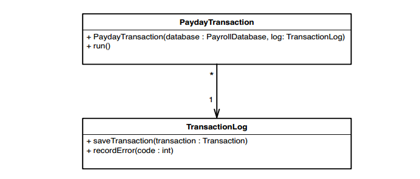
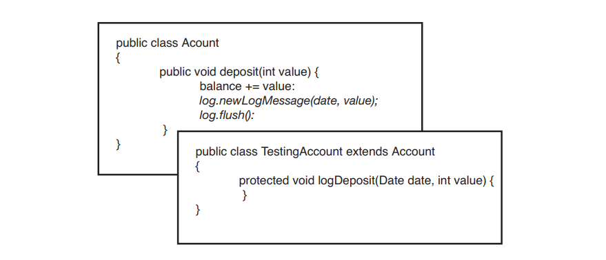

# Chương 25, Các kỹ thuật phá bỏ sự phụ thuộc

Trong chương này, tôi sẽ trình bày về các kỹ thuật phá bỏ sự phụ thuộc. Danh sách này không đầy đủ; đây chỉ là một số kỹ thuật mà tôi đã sử dụng với các nhóm để phân tách các lớp một cách đủ tốt để kiểm thử chúng. Về mặt lý thuyết, những kỹ thuật này là tái cấu trúc — mỗi kỹ thuật đều bảo toàn hành vi. Nhưng không giống như hầu hết các hoạt động tái cấu trúc được viết trong ngành cho đến nay, những hoạt động tái cấu trúc này được thực hiện mà không cần kiểm thử, để có được các kiểm thử tại chỗ. Trong hầu hết các trường hợp, nếu bạn làm theo các bước này một cách cẩn thận thì khả năng xảy ra sai sót là rất nhỏ. Điều này không có nghĩa là chúng hoàn toàn an toàn. Bạn vẫn có thể mắc lỗi khi thực hiện chúng, vì vậy bạn nên cẩn thận khi sử dụng chúng. Trước khi bạn sử dụng những phép tái cấu trúc này, hãy xem _Chương 23, Làm thế nào để biết rằng tôi không làm phá vỡ bất cứ thứ gì?_ Những lời khuyên trong chương đó có thể giúp bạn sử dụng những kỹ thuật này một cách an toàn để bạn có thể viết kiểm thử đúng vị trí. Khi làm như vậy, bạn sẽ có thể thực hiện những thay đổi sâu rộng hơn và tự tin hơn rằng mình không vi phạm bất kỳ điều gì.

Những kỹ thuật này không ngay lập tức làm cho thiết kế của bạn tốt hơn. Trên thực tế, nếu bạn có khả năng thiết kế tốt, một số kỹ thuật này sẽ khiến bạn lo lắng. Những kỹ thuật này có thể giúp bạn có được các phương thức, lớp và cụm lớp được kiểm thử và nhờ đó hệ thống của bạn sẽ dễ bảo trì hơn. Tại thời điểm đó, bạn có thể sử dụng các phép tái cấu trúc được hỗ trợ kiểm thử để làm cho thiết kế rõ ràng hơn

> Một số cách tái cấu trúc trong chương này đã được Martin Fowler mô tả trong cuốn sách _Tái cấu trúc: Cải thiện thiết kế hiện có (Refactoring: Improving the Design of Existing Code)_ (Addison-Wesley, 1999). Tôi đã đưa chúng vào đây với một số thay đổi. Chúng đã được thiết kế riêng để có thể sử dụng an toàn mà không cần kiểm thử.

## Tham số thích ứng (Adapt Parameter)

Khi thực hiện thay đổi với các phương thức, vấn đề đau đầu tôi thường gặp phải là sự phụ thuộc do các tham số của phương thức gây ra. Đôi khi tôi cảm thấy khó tạo được tham số mình cần; hoặc là, tôi cần kiểm thử tác động của phương thức lên tham số. Trong nhiều trường hợp, điều đó không hề dễ dàng với lớp của tham số. Nếu lớp đó là lớp mà tôi có thể sửa đổi, tôi có thể sử dụng _Trích xuất Giao diện (362)_ để phá bỏ sự phụ thuộc. _Trích xuất Giao diện_ thường là lựa chọn tốt nhất khi muốn phá bỏ sự phụ thuộc của tham số.

Nói chung, chúng ta muốn làm điều gì đó thật đơn giản để phá bỏ các phần phụ thuộc cản trở việc kiểm thử, một điều gì đó không có khả năng xảy ra lỗi. Tuy nhiên, trong một số trường hợp, _Trích xuất Giao diện (362)_ hoạt động không tốt lắm. Nếu loại tham số ở mức khá thấp hoặc dành riêng cho một số công nghệ triển khai thì việc trích xuất giao diện có thể phản tác dụng hoặc không thể thực hiện được.

> Sử dụng _Tham số thích ứng_ khi bạn không thể sử dụng _Trích xuất Giao diện (362)_ với lớp của tham số hoặc khi tham số đó khó giả mạo.

Dưới đây là một ví dụ:

```java
public class ARMDispatcher
{
  public void populate(HttpServletRequest request) {
    String [] values = request.getParameterValues(pageStateName);

    if (values != null && values.length > 0)
    {
      marketBindings.put(pageStateName + getDateStamp(), values[0]);
    }
    ...
  }
  ...
}
```

Trong lớp trên, phương thức `populate` nhận `HttpServletRequest` làm tham số. `HttpServletRequest` là giao diện thuộc chuẩn J2EE của Sun dành cho Java. Nếu hiện tại muốn kiểm thử `populate`, chúng ta sẽ phải tạo một lớp triển khai `HttpServletRequest` và cung cấp một số cách để truyền các giá trị tham số mà nó cần để có kết quả trả về khi kiểm thử. Tài liệu Java SDK hiện tại cho thấy có khoảng 23 phương thức khai báo trong `HttpServletRequest` và không tính các khai báo từ siêu giao diện của nó mà chúng ta phải triển khai. Sẽ thật tuyệt nếu sử dụng _Trích xuất Giao diện (362)_ để tạo một giao diện hẹp hơn, chỉ cung cấp các phương thức chúng ta cần, nhưng chúng ta không thể trích xuất giao diện từ giao diện khác. Trong Java, chúng ta cần có `HttpServletRequest` mở rộng giao diện chúng ta đang trích xuất và không thể sửa đổi giao diện chuẩn theo cách đó. May mắn thay, chúng ta có những lựa chọn khác.

Một số thư viện đối tượng giả lập có sẵn cho J2EE. Nếu tải xuống một trong số chúng, chúng ta có thể sử dụng mô hình cho `HttpServletRequest` và thực hiện kiểm thử chúng ta cần thực hiện. Điều này có thể tiết kiệm khá nhiều thời gian; nếu theo cách này, chúng ta sẽ không phải mất thời gian để tự thực hiện lệnh gọi servlet giả. Vì vậy, có vẻ như chúng ta đã có giải pháp — hoặc không?

Khi tôi phá bỏ sự phụ thuộc, tôi luôn cố gắng nhìn về phía trước và xem kết quả liệu sẽ như thế nào. Sau đó tôi có thể quyết định xem tôi có thể sống chung với nó hay không. Trong trường hợp này, code sản xuất của chúng ta sẽ trông khá giống nhau và chúng ta sẽ phải làm rất nhiều việc để duy trì `HttpServletRequest`, một giao diện API, tại chỗ. Có cách nào để làm cho code trông đẹp hơn và làm cho việc phá bỏ phần phụ thuộc dễ dàng hơn không? Trên thực tế là có. Chúng ta có thể gói tham số lại và phá bỏ hoàn toàn sự phụ thuộc của chúng ta vào giao diện API. Khi chúng ta hoàn thành việc đó, code sẽ trông như thế này:

```java
public class ARMDispatcher {
  public void populate(ParameterSource source) {
    String values = source.getParameterForName(pageStateName);
    if (value != null) {
      marketBindings.put(pageStateName + getDateStamp(),
      value);
    }
    ...
  }
}
```

Ở đây chúng ta đã làm gì? Chúng ta đã sử dụng một giao diện mới có tên `ParameterSource`. Vào lúc này, phương thức duy nhất mà nó có là phương thức có tên `getParameterForName`. Không giống như phương thức `HttpServletRequest getParmeterValue`, `getParameterForName` chỉ trả về một `String`. Chúng ta viết phương thức theo cách đó vì chúng ta chỉ quan tâm đến tham số đầu tiên trong ngữ cảnh này.

> Hướng tới các giao diện truyền đạt trách nhiệm hơn là chi tiết triển khai. Điều này làm cho code dễ đọc hơn và dễ bảo trì hơn.

Đây là một lớp giả triển khai `ParameterSource`. Chúng ta có thể sử dụng nó trong kiểm thử của mình:

```java
class FakeParameterSource implements ParameterSource
{
  public String value;
  public String getParameterForName(String name) {
    return value;
  }
}
```

Và nguồn tham số cho code sản xuất trông như thế này:

```java
class ServletParameterSource implements ParameterSource
{
  private HttpServletRequest request;

  public ServletParameterSource(HttpServletRequest request) {
    this.request = request;
  }

  String getParameterValue(String name) {
    String [] values = request.getParameterValues(name);
    if (values == null || values.length < 1)
      return null;
    return values[0];
  }
}
```

Nhìn bề ngoài, việc này có vẻ giống như chúng ta đang làm mọi thứ trở nên đẹp đẽ chỉ để cho đẹp, nhưng một vấn đề phổ biến trong các code base kế thừa là thường không có bất kỳ lớp trừu tượng nào; phần code quan trọng nhất trong hệ thống thường nằm xen kẽ với các lệnh gọi API cấp thấp. Chúng ta đã thấy điều này có thể gây khó khăn cho việc kiểm thử như thế nào, nhưng vấn đề còn vượt xa việc kiểm thử. Code khó hiểu hơn khi nó tràn ngập các giao diện lớn chứa hàng tá phương thức không được sử dụng. Khi bạn tạo các phần trừu tượng hẹp với mục tiêu nhắm đến những gì bạn cần, code của bạn sẽ giao tiếp tốt hơn và bạn sẽ có được đường nối tốt hơn.

Nếu chúng ta chuyển sang sử dụng `ParameterSource` trong ví dụ này, chúng ta sẽ tách logic tổng hợp khỏi các nguồn cụ thể. Chúng ta sẽ không bị ràng buộc với các giao diện J2EE cụ thể nữa.

> Tham số thích ứng là một trường hợp trong đó chúng ta không _Bảo toàn chữ ký (312)_. Hãy sử dụng cẩn thận.

Tham số thích ứng có thể gặp rủi ro nếu giao diện đơn giản hóa mà bạn đang tạo cho lớp của tham số quá khác với giao diện hiện tại của tham số. Nếu không cẩn thận khi thực hiện những thay đổi đó, chúng ta có thể gây ra những lỗi nhỏ. Như mọi khi, hãy nhớ rằng mục tiêu là phá vỡ các phần phụ thuộc đủ tốt để thực hiện các kiểm thử. Bạn nên thiên về việc thực hiện những thay đổi mà bạn cảm thấy tự tin hơn là những thay đổi mang lại cho bạn cấu trúc tốt nhất. Những điều đó có thể đến sau khi bạn đã có kiểm thử. Ví dụ: trong trường hợp này, chúng ta có thể muốn thay đổi `ParameterSource` để các lệnh gọi của nó không phải kiểm thử null khi họ gọi các phương thức của nó (xem _Mẫu đối tượng Null (112)_ để biết chi tiết).

> An toàn là trên hết. Sau khi thực hiện các kiểm thử, bạn có thể thực hiện các thay đổi mang tính xâm lấn một cách tự tin hơn nhiều.

### Các bước thực hiện

Để sử dụng _Thông số thích ứng_, hãy thực hiện các bước sau:

1. Tạo giao diện mới mà bạn sẽ sử dụng trong phương thức này. Làm cho nó đơn giản và dễ hiểu nhất có thể, nhưng cố gắng không tạo ra một giao diện đòi hỏi nhiều hơn những thay đổi nhỏ nhặt trong phương thức.

2. Tạo trình triển khai sản xuất cho giao diện mới.

3. Tạo trình triển khai giả lập cho giao diện.

4. Viết một trường hợp kiểm thử đơn giản, truyền giả lập vào phương thức.

5. Thực hiện những thay đổi bạn cần trong phương thức sử dụng tham số mới.

6. Chạy kiểm thử để xác minh rằng bạn có thể kiểm thử phương thức bằng cách sử dụng phương thức giả lập.

## Phá vỡ đối tượng phương thức

Trong nhiều ứng dụng, rất khó để làm việc với các phương thức lớn. Thông thường, nếu bạn có thể khởi tạo lớp chứa chúng và đưa chúng vào kiểm thử khai thác, bạn có thể bắt đầu viết kiểm thử. Trong một số trường hợp, công việc cần thiết để tạo một lớp riêng biệt có thể rất nhiều. Nó thậm chí có thể quá mức cần thiết cho những thay đổi bạn cần thực hiện. Nếu phương thức bạn cần làm việc có kích thước nhỏ và không sử dụng dữ liệu phiên bản, hãy sử dụng _Tìm kiếm Phương thức Tĩnh (345)_ để kiểm thử các thay đổi của bạn. Mặt khác, nếu phương thức của bạn lớn hoặc sử dụng dữ liệu và phương thức phiên bản, hãy cân nhắc sử dụng _Phá vỡ đối tượng phương thức_. Nói ngắn gọn, ý tưởng đằng sau cách tái cấu trúc này là chuyển một phương thức lớn sang một lớp mới. Các đối tượng mà bạn tạo bằng cách sử dụng lớp mới đó được gọi là đối tượng phương thức vì chúng thể hiện code của một phương thức duy nhất. Sau khi sử dụng _Phá vỡ đối tượng phương thức_, bạn thường có thể viết kiểm thử cho lớp mới dễ dàng hơn so với phương thức cũ. Các biến cục bộ trong phương thức cũ có thể trở thành biến thể hiện trong lớp mới. Thông thường, điều đó giúp việc phá bỏ các phần phụ thuộc dễ dàng hơn và chuyển code sang trạng thái tốt hơn.

Đây là một ví dụ trong C++ (các phần lớn của lớp và phương thức đã bị loại bỏ để bảo tồn cây):

```cpp
class GDIBrush
{
  public:
    void draw(vector<point>& renderingRoots, ColorMatrix& colors, vector<point>& selection);
    ...

  private:
    void drawPoint(int x, int y, COLOR color);
    ...
};

void GDIBrush::draw(vector<point>& renderingRoots, ColorMatrix& colors, vector<point>& selection)
{
  for(vector<points>::iterator it = renderingRoots.begin(); it != renderingRoots.end(); ++it) {
    point p = *it;
    ...

    drawPoint(p.x, p.y, colors[n]);
  }
  ...
}
```

Lớp `GDIBrush` có một phương thức lớn tên là `draw`. Chúng ta không thể dễ dàng viết kiểm thử cho nó và sẽ rất khó để tạo một phiên bản `GDIBrush` trong bộ kiểm thử khai thác. Hãy sử dụng _Phá vỡ đối tượng phương thức_ để di chuyển `draw` sang một lớp mới.

Bước đầu tiên là tạo một lớp mới sẽ thực hiện công việc 'draw'. Chúng ta có thể gọi nó là `Renderer`. Sau khi tạo xong, chúng ta tạo cho nó một hàm khởi tạo công khai. Các tham số của hàm khởi tạo này phải tham chiếu đến lớp gốc và các tham số của phương thức gốc. Chúng ta cần _Bảo toàn Chữ ký (312)_ về sau.

```cpp
class Renderer
{
public:
  Renderer(GBIBrush *brush, vector<point>& renderingRoots, ColorMatrix &colors, vector<point>& selection);
  ...
}
```

Sau khi tạo hàm khởi tạo, chúng ta thêm các biến thể hiện cho từng tham số của hàm khởi tạo và khởi tạo chúng. Chúng ta cũng thực hiện việc này như một tập hợp các thao tác cắt/sao chép/dán để _Bảo toàn Chữ ký (312)_.

```cpp
class Renderer
{
private:
  GDIBrush *brush;
  vector<point>& renderingRoots;
  ColorMatrix& colors;
  vector<point>& selection;

public:
  Renderer(GDIBrush *brush, vector<point>& renderingRoots, ColorMatrix& colors, vector<point>& selection)
  : brush(brush), renderingRoots(renderingRoots), colors(colors), selection(selection)
  {}
}
```

Bạn có thể nhìn và nói, "Hmmm, có vẻ như chúng ta sẽ rơi vào tình thế tương tự. Chúng ta đang chấp nhận một tham chiếu đến `GDIBrush` và chúng ta không thể khởi tạo một trong những tham chiếu đó trong kiểm thử khai thác của mình. Điều này có ích gì cho chúng ta?" Chờ đã, chúng ta sẽ có kết quả ở một nơi khác.

Sau khi tạo xong hàm khởi tạo, chúng ta có thể thêm một phương thức khác vào lớp, một phương thức sẽ thực hiện công việc đã được thực hiện trong phương thức `draw()`. Chúng ta cũng có thể gọi nó là `draw()`

```cpp
class Renderer
{
private:
  GDIBrush *brush;
  vector<point>& renderingRoots;
  ColorMatrix& colors;
  vector<point>& selection;

public:
  Renderer(GDIBrush *brush, vector<point>& renderingRoots, ColorMatrix& colors, vector<point>& selection)
  : brush(brush), renderingRoots(renderingRoots), colors(colors), selection(selection)
  {}

  void draw();
}
```

Bây giờ chúng ta thêm phần thân của phương thức `draw()` vào `Renderer`. Chúng ta sao chép nội dung của phương thức `draw()` cũ sang phương thức mới và _Dựa vào Trình biên dịch (315)_

```cpp
void Renderer::draw()
{
  for(vector<points>::iterator it = renderingRoots.begin(); it != renderingRoots.end(); ++it) {
    point p = *it;
    ...
    drawPoint(p.x, p.y, colors[n]);
  }
  ...
}
```

Nếu `draw()` trong `Renderer` có bất kỳ tham chiếu nào đến các biến thể hiện hoặc phương thức của `GDIBrush`, quá trình biên dịch của chúng ta sẽ thất bại. Để làm cho nó thành công, chúng ta có thể tạo `getters` cho các biến và tạo các phương thức mà nó phụ thuộc vào thành public. Trong trường hợp này, chỉ có một phương thức phụ thuộc duy nhất, một phương thức privated có tên `drawPoint`. Sau khi công khai nó trên `GDIBrush`, chúng ta có thể truy cập nó từ một tham chiếu đến lớp `Renderer` và biên dịch code.

Bây giờ chúng ta có thể ủy quyền phương thức `draw` của `GDIBrush` cho `Renderer`

```cpp
void GDIBrush::draw(vector<point>& renderingRoots, ColorMatrix &colors, vector<point>& selection)
{
  Renderer renderer(this, renderingRoots, colors, selection);
  renderer.draw();
}
```

Bây giờ quay lại phần phụ thuộc `GDIBrush`. Nếu không thể khởi tạo `GDIBrush` trong kiểm thử khai thác, chúng ta có thể sử dụng _Trích xuất Giao diện_ để loại bỏ hoàn toàn sự phụ thuộc vào `GDIBrush`. Phần trên _Trích xuát Giao diện (362)_ có chi tiết, nhưng tóm tắt lại, chúng ta tạo một lớp giao diện trống và yêu cầu `GDIBrush` triển khai nó. Trong trường hợp này, chúng ta có thể gọi nó là `PointRenderer` vì `drawPoint` là phương thức trên `GDIBrush` mà chúng ta thực sự cần quyền truy cập trong `Renderer`. Sau đó, chúng ta thay đổi tham chiếu mà `Renderer` giữ từ `GDIBrush` sang `PointRenderer`, biên dịch và để trình biên dịch cho chúng ta biết những phương thức nào phải có trên giao diện. Đây là code cuối cùng thu được:

```cpp
class PointRenderer
{
  public:
    virtual void drawPoint(int x, int y, COLOR color) = 0;
};

class GDIBrush : public PointRenderer
{
  public:
    void drawPoint(int x, int y, COLOR color);
  ...
}
class Renderer
{
  private:
    PointRender *pointRenderer;
    vector<point>& renderingRoots;
    ColorMatrix& colors;
    vector<point>& selection;

  public:
    Renderer(PointRenderer *renderer, vector<point>& renderingRoots, ColorMatrix& colors, vector<point>& selection)
    : pointRenderer(pointRenderer), renderingRoots(renderingRoots) colors(colors), selection(selection)
    {}

  void draw();
};

void Renderer::draw()
{
  for(vector<points>::iterator it = renderingRoots.begin(); it != renderingRoots.end(); ++it) {
    point p = *it;
    ...
    pointRenderer->drawPoint(p.x,p.y,colors[n]);
  }
  ...
}
```

Hình 25.1 cho thấy nó trông như thế nào bằng UML


Hình 25.1 `GDIBrush` sau khi sử dụng _Phá vỡ đối tượng phương thức_.

Những gì chúng ta thu được có vẻ hơi kỳ lạ. Chúng ta có một lớp `(GDIBrush)` triển khai giao diện mới `(PointRenderer)` và được sử dụng duy nhất bởi một đối tượng `(Renderer)` do lớp đó tạo ra. Bạn có thể cảm thấy khó chịu vì chúng ta đã public các một số phương thức privated trong lớp ban đầu để có thể sử dụng kỹ thuật này. Giờ đây, phương thức privated `drawPoint` của `GDIBrush` đã được public. Điều quan trọng cần lưu ý là đây không thực sự đã là hoàn thành.

Theo thời gian, bạn sẽ cảm thấy chán ghét thực tế là bạn không thể khởi tạo lớp ban đầu trong bộ kiểm thử khai thác và bạn sẽ phá bỏ các phần phụ thuộc khác để có thể làm được. Sau đó, bạn sẽ xem xét các lựa chọn khác. Ví dụ: `PointRenderer` có cần phải là một giao diện không? Nó có thể là một lớp chứa `GDIBrush` không? Nếu có thể, có lẽ bạn có thể bắt đầu chuyển sang thiết kế dựa trên khái niệm mới này về `Renderers`.

Đó chỉ là một trong những cách tái cấu trúc đơn giản mà chúng ta có thể thực hiện khi kiểm thử lớp này. Cấu trúc kết quả có thể mời nhiều hơn nữa.

> Đối tượng phương thức _Phá vỡ đối tượng phương thức_. Trong trường hợp đơn giản nhất, phương thức gốc không sử dụng bất kỳ biến thể hiện hoặc phương thức nào từ lớp gốc. Chúng ta không cần truyền cho nó một tham chiếu đến lớp ban đầu.
>
> Trong các trường hợp khác, phương thức chỉ sử dụng dữ liệu từ lớp gốc. Đôi khi, việc đặt dữ liệu này vào một lớp lưu giữ dữ liệu mới và chuyển nó làm tham số cho đối tượng phương thức là điều hợp lý.
>
> Trường hợp tôi trình bày ở phần này là trường hợp xấu nhất; chúng ta cần sử dụng các phương thức trên lớp gốc, vì vậy chúng ta sử dụng `Trích xuất Giao diện (362)` và bắt đầu xây dựng một số tính trừu tượng giữa đối tượng phương thức và lớp gốc.

### Các bước thực hiện

Bạn có thể sử dụng các bước sau để thực hiện _Phá vỡ đối tượng phương thức_ một cách an toàn mà không cần kiểm tra:

1. Tạo một lớp sẽ chứa code của phương thức.

2. Tạo một hàm khởi tạo cho lớp và _Bảo tồn Chữ ký (312)_ để cung cấp cho nó một bản sao chính xác của các tham số được phương thức sử dụng. Nếu phương thức sử dụng dữ liệu cá thể hoặc các phương thức từ lớp gốc, hãy thêm một tham chiếu đến lớp gốc làm tham số đầu tiên cho hàm khởi tạo.

3. Đối với mỗi tham số trong hàm khởi tạo, hãy khai báo một biến thực thể và cung cấp cho nó cùng kiểu với biến đó. _Bảo tồn Chữ ký (312)_ bằng cách sao chép tất cả các tham số trực tiếp vào lớp và định dạng chúng dưới dạng khai báo biến thể hiện. Gán tất cả các tham số cho các biến thể hiện trong hàm khởi tạo.

4. Tạo một phương thức thực thi trống trên lớp mới. Thông thường phương thức này được gọi là `run()`. Chúng t đã sử dụng tên `draw` trong ví dụ.

5. Sao chép phần thân của phương thức cũ vào phương thức thực thi và biên dịch thành _Dựa vào Trình biên dịch (315)_.

6. Các thông báo lỗi từ trình biên dịch sẽ cho biết phương thức vẫn đang sử dụng các phương thức hoặc biến từ lớp cũ ở đâu. Trong mỗi trường hợp này, hãy thực hiện những gì cần thiết để biên dịch phương thức. Trong một số trường hợp, điều này đơn giản như việc thay đổi lệnh gọi để sử dụng tham chiếu đến lớp ban đầu. Trong các trường hợp khác, bạn có thể phải đặt các phương thức ở chế độ public trên lớp gốc hoặc giới thiệu các `getters` để không phải đặt các biến thể hiện ở chế độ public.

7. Sau khi lớp mới biên dịch, hãy quay lại phương thức ban đầu và thay đổi nó để nó tạo một thể hiện của lớp mới và ủy thác công việc của nó cho nó.

8. Nếu cần, hãy sử dụng _Trích xuất Giao diện (362)_ để thoát khỏi sự phụ thuộc vào lớp gốc

## Hoàn thành định nghĩa

Trong một số ngôn ngữ, chúng ta có thể khai báo kiểu biến ở một nơi và định nghĩa nó ở một nơi khác. Các ngôn ngữ có khả năng này rõ ràng nhất là C và C++. Trong cả hai ngôn ngữ này, chúng ta có thể khai báo một hàm hoặc phương thức ở một nơi và định nghĩa nó ở một nơi khác, thường là trong một tệp triển khai. Khi có khả năng này, chúng ta có thể sử dụng nó để phá bỏ sự phụ thuộc.

Đây là một ví dụ:

```cpp
class CLateBindingDispatchDriver : public CDispatchDriver
{
public:
    CLateBindingDispatchDriver ();
  virtual ~CLateBindingDispatchDriver ();
    ROOTID GetROOTID (int id) const;
  void BindName (int id, OLECHAR FAR *name);
  ...

private:
  CArray<ROOTID, ROOTID& > rootids;
}
```

Đây là lời khai báo của một lớp nhỏ trong ứng dụng C++. Người dùng tạo `CLateBindingDispatchDrivers` rồi sử dụng phương thức `BindName` để liên kết tên với ID. Chúng ta muốn cung cấp một cách khác để liên kết tên khi sử dụng lớp này trong kiểm thử. Trong C++, chúng ta có thể thực hiện việc này bằng cách sử dụng _Hoàn thành định nghĩa_. Phương thức `BindName` đã được khai báo trong tệp tiêu đề của lớp. Làm thế nào chúng ta có thể đưa ra một định nghĩa khác khi kiểm thử? Chúng ta đưa tiêu đề chứa khai báo lớp này vào tệp kiểm thử và cung cấp các định nghĩa thay thế cho các phương thức trước khi kiểm thử.

```cpp
#include "LateBindingDispatchDriver.h"

CLateBindingDispatchDriver::CLateBindingDispatchDriver() {}

CLateBindingDispatchDriver::~CLateBindingDispatchDriver() {}

ROOTID GetROOTID (int id) const { return ROOTID(-1); }

void BindName(int id, OLECHAR FAR *name) {}

TEST(AddOrder,BOMTreeCtrl)
{
  CLateBindingDispatchDriver driver;
  CBOMTreeCtrl ctrl(&driver);
  ctrl.AddOrder(COrderFactory::makeDefault());
  LONGS_EQUAL(1, ctrl.OrderCount());
}
```

Khi xác định các phương thức này trực tiếp trong tệp kiểm thử, chúng ta đang cung cấp các định nghĩa sẽ được sử dụng trong kiểm thử. Chúng ta có thể cung cấp nội dung rỗng cho các phương thức mà chúng ta không quan tâm hoặc đưa vào các phương thức cảm biến có thể được sử dụng trong tất cả các kiểm thử của chúng ta.

Khi sử dụng _Hoàn thành định nghĩa_ trong C hoặc C++, chúng ta gần như có nghĩa vụ phải tạo một tệp thực thi riêng cho các kiểm thử sử dụng các định nghĩa đã hoàn thành. Nếu không, chúng sẽ xung đột với các định nghĩa thực tại thời điểm liên kết. Một nhược điểm khác là hiện tại chúng ta có hai bộ định nghĩa khác nhau cho các phương thức của một lớp, một trong tệp nguồn kiểm thử và một trong tệp nguồn sản xuất. Đây có thể là một gánh nặng bảo trì lớn. Nó cũng có thể gây nhầm lẫn cho trình gỡ lỗi nếu chúng ta không thiết lập môi trường chính xác. Vì những lý do này, tôi không khuyên bạn nên sử dụng _Hoàn thành định nghĩa_ ngoại trừ trong những tình huống phụ thuộc tồi tệ nhất. Thậm chí sau đó, tôi khuyên bạn nên làm điều đó chỉ để phá bỏ sự phụ thuộc ban đầu.

Sau đó, bạn nên nhanh chóng kiểm thử lớp đó để có thể loại bỏ các định nghĩa trùng lặp.

### Các bước thực hiện

Để sử dụng _Hoàn thành Định nghĩa_ trong C++, hãy làm theo các bước sau:

1. Xác định lớp có định nghĩa mà bạn muốn thay thế.

2. Xác minh rằng các định nghĩa phương thức nằm trong tệp nguồn chứ không phải trong tiêu đề.

3. Include tiêu đề trong tệp nguồn kiểm thử của lớp bạn đang kiểm thử.

4. Xác minh rằng các tệp nguồn của lớp không phải là một phần của bản dựng.

5. Xây dựng để tìm các phương thức còn thiếu.

6. Thêm định nghĩa phương thức vào tệp nguồn kiểm thử cho đến khi bạn có bản dựng hoàn chỉnh.

## Đóng gói tham khảo toàn cục

Khi bạn đang cố gắng kiểm thử code có vấn đề với sự phụ thuộc trên toàn cục, về cơ bản bạn có ba lựa chọn. Bạn có thể cố gắng làm cho các thành phần toàn cục hoạt động khác nhau khi kiểm thử, bạn có thể liên kết với các thành phần toàn cục khác nhau hoặc bạn có thể đóng gói các thành phần toàn cục để có thể tách rời mọi thứ ra hơn nữa. Tùy chọn cuối cùng được gọi là _Đóng gói tham khảo toàn cục_. Đây là một ví dụ trong C++:

```cpp
bool AGG230_activeframe[AGG230_SIZE];
bool AGG230_suspendedframe[AGG230_SIZE];

void AGGController::suspend_frame()
{
  frame_copy(AGG230_suspendedframe,
  AGG230_activeframe);
  clear(AGG230_activeframe);
  flush_frame_buffers();
}

void AGGController::flush_frame_buffers()
{
  for (int n = 0; n < AGG230_SIZE; ++n) {
    AGG230_activeframe[n] = false;
    AGG230_suspendedframe[n] = false;
  }
}
```

Trong ví dụ này, chúng ta có một số đoạn code hoạt động với một số mảng toàn cục. Phương thức `Suspend_frame` cần truy cập vào các khung đang hoạt động và bị treo. Thoạt nhìn, có vẻ như chúng ta có thể tạo các khung thành viên của lớp `AGGController`, nhưng một số lớp khác (không hiển thị) lại sử dụng khung. Chúng ta có thể làm gì?

Một ý nghĩ ngay lập tức là chúng ta có thể truyền chúng vào dưới dạng tham số cho phương thức `Suspend_frame` bằng cách sử dụng _Tham số hóa Phương thức (383)_, nhưng sau khi thực hiện điều đó, chúng ta sẽ phải chuyển chúng dưới dạng tham số cho bất kỳ phương thức nào mà lệnh gọi `Susp_frame` sử dụng chúng làm toàn cục. Trong trường hợp này, `Flush_frame_buffer` là kẻ tội đồ.

Tùy chọn tiếp theo là chuyển cả hai khung làm tham số hàm khởi tạo cho `AGGController`. Chúng ta có thể làm điều đó, nhưng cũng đáng để xem xét những nơi khác mà chúng được sử dụng. Nếu có vẻ như bất cứ khi nào chúng ta sử dụng cái này thì chúng ta cũng đang sử dụng cái kia, chúng ta có thể gộp chúng lại với nhau

> Nếu một số biến toàn cục luôn được sử dụng hoặc được sửa đổi gần nhau thì chúng thuộc cùng một lớp.

Cách tốt nhất để xử lý tình huống này là xem xét dữ liệu, các khung đang hoạt động và bị treo, đồng thời suy nghĩ xem liệu chúng ta có thể nghĩ ra một cái tên hay cho một lớp "thông minh" mới có thể chứa cả hai khung đó hay không. Đôi khi điều này hơi phức tạp một chút. Chúng ta phải suy nghĩ về ý nghĩa của dữ liệu đó trong thiết kế và sau đó xem xét lý do tại sao nó lại ở đó. Nếu chúng ta tạo một lớp mới, cuối cùng chúng ta sẽ chuyển các phương thức vào đó và rất có thể code của các phương thức đó đã tồn tại ở một nơi khác nơi dữ liệu được sử dụng.

> Khi đặt tên một lớp, hãy nghĩ về các phương thức cuối cùng sẽ tồn tại trên đó. Cái tên phải hay nhưng không cần phải hoàn hảo. Hãy nhớ rằng bạn luôn có thể đổi tên lớp sau này.

Trong ví dụ trước, tôi mong đợi rằng, theo thời gian, các phương thức `frame_copy` và `clear` có thể chuyển sang lớp mới mà chúng ta sắp tạo. Có công việc nào chung giữa khung treo và khung hoạt động không? Có vẻ như có, trong trường hợp này. Hàm `Suspending_frame` trên `AGGController` có thể chuyển sang một lớp mới miễn là nó chứa cả mảng `posted_frame` và mảng `active_frame`. Chúng ta có thể gọi lớp học mới này là gì? Chúng ta chỉ có thể gọi nó là `Frame` và nói rằng mỗi khung có một bộ đệm hoạt động và một bộ đệm bị treo. Điều này đòi hỏi chúng ta phải thay đổi khái niệm và đổi tên các biến một chút, nhưng đổi lại những gì chúng ta sẽ nhận được là một lớp thông minh hơn ẩn chứa nhiều chi tiết hơn.

> Tên lớp bạn tìm thấy có thể đã được sử dụng. Nếu vậy, hãy cân nhắc xem bạn có thể đổi tên bất cứ thứ gì đang sử dụng tên đó hay không.

Đây là cách chúng ta thực hiện, từng bước một.

Đầu tiên, chúng ta tạo một lớp trông như thế này:

```cpp
class Frame
{
public:
  // declare AGG230_SIZE as a constant
  enum { AGG230_SIZE = 256 };
  bool AGG230_activeframe[AGG230_SIZE];
  bool AGG230_suspendedframe[AGG230_SIZE];
}
```

Chúng ta đã cố tình giữ nguyên tên của dữ liệu chỉ để giúp bước tiếp theo dễ dàng hơn. Tiếp theo, chúng ta khai báo một thể hiện toàn cục của lớp `Frame`:

```cpp
Frame frameForAGG230;
```

Tiếp theo, chúng ta bỏ các khai báo ban đầu của dữ liệu và cố gắng xây dựng:

```cpp
// bool AGG230_activeframe[AGG230_SIZE];
// bool AGG230_suspendsframe[AGG230_SIZE];
```

Vào lúc này, chúng ta nhận được tất cả các loại lỗi biên dịch cho biết `AGG_activeframe` và `AGG230_suspendsframe` không tồn tại, đe dọa chúng ta với những hậu quả khủng khiếp. Nếu hệ thống xây dựng đủ nhỏ, nó sẽ hoàn thiện mọi thứ bằng nỗ lực liên kết, để lại cho chúng ta khoảng 10 trang lỗi liên kết chưa được giải quyết. Chúng ta có thể buồn bã, nhưng chúng ta đã mong đợi tất cả những điều đó sẽ xảy ra, phải không?

Để khắc phục tất cả các lỗi đó, chúng ta có thể dừng lại ở từng lỗi và đặt `frameForAGG230`, trước mỗi tài liệu tham khảo đang gây rắc rối.

```cpp
void AGGController::suspend_frame()
{
  frame_copy(frameForAGG230.AGG230_suspendedframe,
  frameForAGG230.AGG230_activeframe);
  clear(frameForAGG20.AGG230_activeframe);
  flush_frame_buffer();
}
```

Khi hoàn thành việc đó, chúng ta có code xấu hơn, nhưng tất cả sẽ biên dịch và hoạt động chính xác, vì vậy đây là một phép chuyển đổi bảo toàn hành vi. Bây giờ khi đã hoàn thành nó, chúng ta có thể chuyển một đối tượng `Frame` thông qua hàm khởi tạo của lớp `AGGController` và nhận được sự phân tách mà chúng ta cần để tiếp tục.

> Tham chiếu một thành viên của một lớp thay vì một toàn cục đơn giản chỉ là bước đầu tiên. Sau đó, hãy cân nhắc xem bạn nên sử dụng _Sử dụng Setter Tĩnh (372)_ hay tham số hóa code bằng cách sử dụng _Tham số hóa Hàm khởi tạo (379)_ hoặc _Tham số hóa phương thức (383)_.

Vì vậy, chúng ta sử dụng một lớp mới bằng cách thêm các biến toàn cục vào một lớp mới và đặt chúng ở chế độ công khai. Tại sao chúng ta lại làm theo cách này? Sau cùng, chúng ta đã dành thời gian suy nghĩ về việc nên gọi lớp mới là gì và đặt những loại phương thức nào vào nó. Lẽ ra chúng ta có thể bắt đầu bằng cách tạo một đối tượng `Frame` giả mà chúng ta có thể ủy quyền trong `AGG_Controller` và chúng ta có thể chuyển tất cả logic sử dụng các biến đó sang một lớp `Frame` thực. Chúng ta có thể đã làm được điều đó, nhưng sẽ cần rất nhiều nỗ lực cùng một lúc. Tệ hơn nữa, khi chúng ta không có các kiểm thử tại chỗ và chúng ta đang cố gắng thực hiện những công việc tối thiểu cần thiết để hoàn thành các kiểm thử, thì tốt nhất là nên để logic càng nhiều càng tốt. Chúng ta nên tránh di chuyển nó và cố gắng phân tách bằng cách đặt các đường nối cho phép chúng ta gọi một phương thức thay vì phương thức khác hoặc truy cập một phần dữ liệu thay vì một phần dữ liệu khác. Sau này, khi chúng ta thực hiện nhiều kiểm thử hơn, chúng ta có thể chuyển hành vi từ lớp này sang lớp khác mà không cần quá lo lắng.

Khi chuyển `frame` vào `AGGController`, chúng ta có thể đổi tên một chút để làm mọi thứ rõ ràng hơn một chút. Đây là trạng thái kết thúc của chúng ta cho lần tái cấu trúc này:

```cpp
class Frame
{
public:
  enum { BUFFER_SIZE = 256 };
  bool activebuffer[BUFFER_SIZE];
  bool suspendedbuffer[BUFFER_SIZE];
};

Frame frameForAGG230;

void AGGController::suspend_frame()
{
  frame_copy(frame.suspendedbuffer, frame.activebuffer);
  clear(frame.activeframe);
  flush_frame_buffer();
}
```

Nó có vẻ không có cải tiến nhiều lắm nhưng đó là bước đầu tiên cực kỳ có giá trị. Sau khi chuyển dữ liệu sang một lớp, chúng ta sẽ tách dữ liệu và sẵn sàng cải thiện code theo thời gian. Chúng ta thậm chí có thể muốn có một lớp `FrameBuffer` vào một lúc nào đó.

> Khi bạn sử dụng `Đóng gói tham chiếu toàn cục`, hãy bắt đầu với dữ liệu hoặc các phương thức nhỏ. Các phương thức quan trọng hơn có thể được chuyển sang lớp mới khi có nhiều kiểm thử hơn.

Trong ví dụ trước, tôi đã trình bày cách thực hiện `Đóng gói tham chiếu toàn cục` với dữ liệu toàn cục. Bạn có thể làm điều tương tự với các hàm không phải thành viên trong chương trình C++. Thông thường, khi bạn đang làm việc với một số API C, bạn có các lệnh gọi đến các hàm toàn cục nằm rải rác trong một vùng code mà bạn muốn làm việc. Đường nối duy nhất mà bạn có là mối liên kết giữa các lệnh gọi với các chức năng tương ứng của chúng. Bạn có thể sử dụng _Thay thế liên kết (377)_ để phân tách, nhưng bạn có thể có được code có cấu trúc tốt hơn nếu bạn sử dụng _Đóng gói tham chiếu toàn cục_ để xây dựng một đường nối khác. Đây là một ví dụ.

Trong một đoạn code mà chúng ta muốn kiểm thử, có các lệnh gọi đến hai hàm: `GetOption(const string optionName)` và `setOption(string name, Option option)`. Chúng chỉ là các hàm tự do, các hàm không được gắn vào bất kỳ lớp nào, nhưng chúng được sử dụng rất nhiều trong code như thế này:

```cpp
void ColumnModel::update()
{
  alignRows();
  Option resizeWidth = ::GetOption("ResizeWidth");
  if (resizeWidth.isTrue()) {
    resize();
  } else {
    resizeToDefault();
  }
}
```

Trong trường hợp này, chúng ta có thể xem xét một số kỹ thuật dự phòng cũ như _Tham số hóa Phương thức (383)_ và _Trích xuất và Ghi đè Getter(352)_, nhưng nếu các lệnh gọi được thực hiện trên nhiều phương thức và nhiều lớp thì sẽ gọn gàng hơn nếu sử dụng _Đóng gói tham chiếu toàn cục_. Để thực hiện, hãy tạo một lớp mới như sau

```cpp
class OptionSource
{
public:
  virtual ~OptionSource() = 0;
  virtual Option GetOption(const string& optionName) = 0;
  virtual void SetOption(const string& optionName, const Option& newOption) = 0;
}
```

Lớp này chứa các phương thức trừu tượng cho từng hàm tự do mà chúng ta cần. Tiếp theo, phân lớp để tạo lớp giả cho lớp. Trong trường hợp này, chúng ta có thể có một liên kết hoặc một vectơ trong lớp giả cho phép giữ một tập hợp các tùy chọn sẽ được sử dụng trong quá trình kiểm thử. Chúng ta có thể cung cấp một phương thức thêm vào lớp giả hoặc chỉ là một hàm khởi tạo chấp nhận liên kết — bất cứ điều gì thuận tiện cho việc kiểm thử. Khi có lớp giả, chúng ta có thể tùy chọn lớp thực:

```cpp
class ProductionOptionSource : public OptionSource
{
public:
  Option GetOption(const string& optionName);
  void SetOption(const string& optionName, const Option& newOption) ;
};

Option ProductionOptionSource::GetOption(const string& optionName)
{
  ::GetOption(optionName);
}

void ProductionOptionSource::SetOption(const string& optionName, const Option& newOption)
{
  ::SetOption(optionName, newOption);
}
```

> Để đóng gói các tham chiếu đến các hàm tự do, hãy tạo một lớp giao diện với các lớp con giả và sản xuất. Mỗi hàm trong code sản xuất không được làm gì khác hơn là ủy quyền cho một hàm toàn cục.

Việc tái cấu trúc này diễn ra tốt đẹp. Khi chúng ta sử dụng đường nối và kết thúc việc thực hiện ủy quyền đơn giản cho hàm API. Bây giờ chúng ta đã thực hiện xong việc đó, chúng ta có thể tham số hóa lớp để chấp nhận một đối tượng `OptionSource` để có thể sử dụng đối tượng giả trong kiểm thử và đối tượng thật trong sản xuất.

Trong ví dụ trước, chúng ta đặt các hàm vào một lớp và biến chúng thành ảo. Chúng ta có thể làm điều đó theo cách khác không? Có, chúng ta có thể tạo các hàm tự do để ủy quyền cho các hàm tự do khác hoặc thêm chúng vào một lớp mới dưới dạng static, nhưng cả hai cách tiếp cận đó đều không mang lại cho chúng ta những đường nối tốt. Chúng at sẽ phải sử dụng _Đường nối Liên kết (36)_ hoặc _Đường nối Tiền xử lý (33)_ để thay thế cách triển khai này bằng cách triển khai khác. Khi chúng ta sử dụng cách tiếp cận lớp và hàm ảo cũng như tham số hóa lớp, các đường nối mà chúng ta có sẽ rõ ràng và dễ quản lý.

### Các bước thực hiện

Để _Đóng gói tham chiếu toàn cục_, hãy làm theo các bước sau:

1. Xác định các phần tổng thể mà bạn muốn gói gọn.

2. Tạo một lớp mà bạn muốn tham chiếu đến chúng.

3. Sao chép toàn cục vào lớp. Nếu một số trong số chúng là biến, hãy xử lý việc khởi tạo chúng trong lớp.

4. Loại bỏ các khai báo ban đầu của toàn cục.

5. Khai báo một thực thể của toàn cục trong lớp mới.

6. Sử dụng _Dựa vào Trình biên dịch (315)_ để tìm tất cả các tham chiếu chưa được giải quyết của các toàn cục cũ.

7. Đặt trước mỗi tham chiếu chưa được giải quyết bằng tên của phiên bản chung của lớp mới.

8. Ở những nơi bạn muốn sử dụng giả lập, hãy sử dụng _Sử dụng Setter Tĩnh (372)_, _Tham số hóa Khởi tạo (379)_, _Tham số hóa Phương thức (383)_ hoặc _Thay thế Tham chiếu Toàn cục bằng Getter (399)_.

## Trích xuất Phương thức Tĩnh

Làm việc với các lớp không thể khởi tạo trong kiểm thử khai thác khá là khó khăn. Đây là một kỹ thuật tôi sử dụng trong một số trường hợp. Nếu bạn có một phương thức không sử dụng dữ liệu phiên bản hoặc các phương thức, bạn có thể biến nó thành một phương thức tĩnh. Khi nó ở trạng thái tĩnh, bạn có thể kiểm thử nó mà không cần phải khởi tạo lớp. Đây là một ví dụ trong Java.

Chúng ta có một lớp với phương thức xác thực và chúng ta cần thêm một điều kiện xác thực mới. Thật không may, lớp đó rất khó khởi tạo. Tôi sẽ giúp bạn không bị tổn thương khi nhìn cả lớp, nhưng đây là phương thức chúng ta cần thay đổi:

```java
class RSCWorkflow
{
  ...
  public void validate(Packet packet)
        throws InvalidFlowException {
    if (packet.getOriginator().equals( "MIA")
          || packet.getLength() > MAX_LENGTH
          || !packet.hasValidCheckSum()) {
      throw new InvalidFlowException();
    }
    ...
  }
  ...
}
```

Chúng ta có thể làm gì để kiểm thử phương thức này? Khi xem xét kỹ, chúng ta thấy rằng phương thức này sử dụng rất nhiều phương thức trên lớp `Packet`. Trên thực tế, việc chuyển `validate` sang lớp `Packet` sẽ thực sự hợp lý, nhưng việc di chuyển phương thức không phải là điều ít rủi ro nhất mà chúng ta có thể làm bây giờ; chúng ta chắc chắn sẽ không thể _Bảo toàn Chữ ký (312)_. Nếu bạn không có công cụ tự động hỗ trợ di chuyển các phương thức, tốt hơn hết bạn nên thực hiện một số kiểm thử trước. _Trích xuất Phương thức Tĩnh_ có thể giúp bạn làm điều đó. Với các kiểm thử đã có, bạn có thể thực hiện thay đổi cần thực hiện và tự tin hơn nhiều khi áp dụng phương thức đó sau đó.

> Khi bạn phá bỏ các phần phụ thuộc mà không cần kiểm thử, hãy _Bảo toàn Chữ ký (312)_ của các phương thức bất cứ khi nào có thể. Nếu bạn cắt/sao chép và dán toàn bộ chữ ký của phương thức, bạn sẽ có ít nguy cơ mắc lỗi hơn.

Code ở đây không phụ thuộc vào bất kỳ biến thể hiện hoặc phương thức nào. Nó sẽ trông như thế nào nếu phương thức `validate` là public static? Bất kỳ ai ở bất kỳ vị trí nào trong code đều có thể viết câu lệnh dưới và xác thực `packet`:

```java
RSCWorkflow.validate(packet);
```

Rất có thể, bất cứ ai tạo ra lớp này đều không bao giờ tưởng tượng được rằng một ngày nào đó ai đó sẽ làm cho phương thức đó thành static, ít công khai hơn nhiều. Vì vậy, đó có phải là một điều không tốt? Không thật sự lắm. Đóng gói là một điều tuyệt vời đối với các lớp, nhưng vùng static của một lớp không thực sự là một phần của lớp đó. Trên thực tế, trong một số ngôn ngữ, nó là một phần của lớp khác, đôi khi được gọi là siêu lớp của lớp.

Khi một phương thức là static, bạn biết rằng nó không truy cập bất kỳ dữ liệu riêng tư nào của lớp; nó chỉ là một phương thức tiện ích. Nếu bạn đặt phương thức này ở chế độ công khai, bạn có thể viết kiểm thử cho nó. Những kiểm thử đó sẽ hỗ trợ bạn nếu sau này bạn chọn chuyển phương thức đó sang lớp khác.

> Các phương thức và dữ liệu static thực sự hoạt động như thể chúng là một phần của một lớp khác. Dữ liệu static tồn tại trong vòng đời của chương trình chứ không phải vòng đời của thực thể đối tượng và có thể truy cập mà không cần thực thể đối tượng.
>
> Các phần static của một lớp có thể được coi là "khu vực tổ chức" cho những thứ không hoàn toàn thuộc về lớp đó. Nếu bạn thấy một phương thức không sử dụng bất kỳ dữ liệu thực thể đối tượng nào, bạn nên đặt nó thành static để dễ nhận thấy cho đến khi bạn tìm ra nó thực sự thuộc về lớp nào.

Đây là lớp `RSCWorkflow` sau khi chúng ta trích xuất một phương thức static để `validate`

```java
public class RSCWorkflow {
  public void validate(Packet packet) throws InvalidFlowException {
    validatePacket(packet);
  }
  public static void validatePacket(Packet packet) throws InvalidFlowException {
    if (packet.getOriginator() == "MIA" || packet.getLength() <= MAX_LENGTH || packet.hasValidCheckSum()) {
      throw new InvalidFlowException();
    }
    ...
  }
  ...
}
```

Trong một số ngôn ngữ, có một cách đơn giản hơn để thực hiện _Trích xuất Phương thức Tĩnh_. Thay vì trích xuất một phương thức tĩnh từ phương thức ban đầu, bạn chỉ cần làm cho phương thức gốc trở thành tĩnh. Nếu phương thức đang được các lớp khác sử dụng, nó vẫn có thể được truy cập từ một thực thể đối tượng của lớp đó. Đây là một ví dụ:

```java
RSCWorkflow workflow = new RCSWorkflow();
...
// static call that looks like a non-static call
workflow.validatePacket(packet);
```

Tuy nhiên, ở một số ngôn ngữ, bạn sẽ nhận được cảnh báo khi biên dịch nếu làm theo cách này. Tốt nhất bạn nên cố gắng đưa code vào trạng thái không có cảnh báo biên dịch.

Nếu bạn lo ngại rằng ai đó có thể bắt đầu sử dụng tĩnh theo cách có thể gây ra sự cố phụ thuộc sau này, bạn có thể hiển thị phương thức tĩnh bằng cách sử dụng một số chế độ truy cập không công khai. Trong các ngôn ngữ như Java và C#, có gói hoặc khả năng hiển thị nội bộ, bạn có thể hạn chế quyền truy cập vào tĩnh hoặc bảo vệ nó và truy cập nó thông qua lớp con kiểm thử. Trong C++, bạn có các tùy chọn tương tự: Bạn có thể bảo vệ phương thức tĩnh hoặc sử dụng một vùng tên.

### Các bước thực hiện

Để thực hiện _Trích xuất Phương thức Tĩnh_, hãy làm theo các bước sau:

1. Viết một kiểm thử truy cập vào phương thức mà bạn muốn hiển thị dưới dạng phương thức tĩnh công khai của lớp.

2. Trích xuất phần thân của phương thức thành một phương thức tĩnh. Hãy nhớ _Bảo toàn Chữ ký (312)_. Bạn sẽ phải sử dụng một tên khác cho phương thức. Thông thường có thể sử dụng tên của các tham số để giúp bạn nghĩ ra tên phương thức mới. Ví dụ: nếu một phương thức có tên `validate` có tham số là một `Packer`, bạn có thể trích xuất phần thân của nó dưới dạng một phương thức tĩnh có tên `validatePacket`.

3. Biên dịch.

4. Nếu có lỗi liên quan đến việc truy cập dữ liệu hoặc phương thức thực thể, hãy xem các tính năng đó và xem liệu chúng có thể được đặt ở trạng thái tĩnh hay không. Nếu có thể, hãy đặt chúng ở trạng thái tĩnh để hệ thống biên dịch.

## Trích xuất và Ghi đè Lệnh gọi

Đôi khi, các phần phụ thuộc gây cản trở trong quá trình kiểm thử khá cục bộ. Chúng ta có thể có một lệnh gọi phương thức duy nhất mà chúng ta cần thay thế. Nếu có thể phá bỏ sự phụ thuộc vào lệnh gọi phương thức, chúng ta có thể ngăn chặn các tác dụng phụ kỳ lạ trong quá trình kiểm thử hoặc cảm nhận các giá trị được chuyển cho lệnh gọi.

Hãy xem một ví dụ:

```java
public class PageLayout
{
  private int id = 0;
  private List styles;
  private StyleTemplate template;
  ...
  protected void rebindStyles() {
    styles = StyleMaster.formStyles(template, id);
    ...
  }
  ...
}
```

`PageLayout` thực hiện lệnh gọi hàm tĩnh có tên `formStyles` trong lớp có tên `StyleMaster`. Nó gán giá trị trả về cho một biến thực thể: `styles`. Chúng ta cần làm gì nếu muốn tìm hiểu `formStyles` hoặc loại bỏ sự phụ thuộc của chúng ta với `StyleMaster`? Có một lựa chọn là trích xuất lệnh gọi sang một phương thức mới và ghi đè nó trong lớp con kiểm kiểm thử. Điều này được gọi là _Trích xuất và Ghi đè Lệnh gọi_.

Đây là code sau khi trích xuất:

```java
public class PageLayout
{
  private int id = 0;
  private List styles;
  private StyleTemplate template;
  ...
  protected void rebindStyles() {
    styles = formStyles(template, id);
    ...
  }

  protected List formStyles(StyleTemplate template, int id) {
    return StyleMaster.formStyles(template, id);
  }
  ...
}
```

Bây giờ chúng ta đã có phương thức `formStyles` cục bộ của riêng mình, chúng ta có thể ghi đè nó để phá bỏ sự phụ thuộc. Chúng ta không cần `styles` cho những thứ đang kiểm thử, vì vậy chúng ta chỉ cần trả về một danh sách rỗng.

```java
public class TestingPageLayout extends PageLayout {
  protected List formStyles(StyleTemplate template, int id) {
    return new ArrayList();
  }
  ...
}
```

Khi chúng ta phát triển các kiểm thử cần nhiều `styles` khác nhau, chúng ta có thể thay đổi phương thức này để có thể định cấu hình những gì sẽ được trả về.

_Trích xuất và Ghi đè Lệnh gọi_ là một công cụ tái cấu trúc rất hữu ích; Tôi sử dụng nó rất thường xuyên. Đó là một cách lý tưởng để phá bỏ sự phụ thuộc vào các biến toàn cục và các phương thức tĩnh. Nói chung, tôi có xu hướng sử dụng nó trừ khi có nhiều lệnh gọi khác nhau đối với cùng một tệp toàn cục. Nếu có, tôi thường sử dụng _Thay thế Tham chiếu Toàn cục bằng Getter (399)_.

Nếu bạn có một công cụ tái cấu trúc tự động, thì việc _Trích xuất và Ghi đè Lệnh gọi_ là chuyện nhỏ. Bạn có thể làm điều đó bằng cách sử dụng kỹ thuật tái cấu trúc _Trích xuất Phương thức (415)_. Tuy nhiên, nếu không, hãy sử dụng các bước sau. Chúng cho phép bạn trích xuất bất kỳ lệnh gọi nào một cách an toàn, ngay cả khi bạn không có các kiểm thử tại chỗ.

### Các bước thực hiện

Để _trích xuất và Ghi đè Lệnh gọi_, hãy làm theo các bước sau:

1. Xác định lệnh gọi mà bạn muốn trích xuất. Tìm khai báo phương thức của nó. Sao chép chữ ký phương thức của nó để bạn có thể _Bảo toàn Chữ ký (312)_.

2. Tạo một phương thức mới trên lớp hiện tại. Cung cấp cho nó chữ ký bạn đã sao chép.

3. Sao chép lệnh gọi sang phương thức mới và thay thế lệnh gọi bằng lệnh gọi phương thức mới.

## Trích xuất và Ghi đè Phương thức Chế tạo

Việc tạo đối tượng trong hàm khởi tạo có thể khá khó chịu khi bạn muốn kiểm thử một lớp. Đôi khi công việc đang diễn ra trong các đối tượng đó không nên diễn ra trong bộ kiểm thử khai thác. Đôi khi, bạn chỉ muốn đặt một đối tượng cảm biến vào đúng vị trí, nhưng bạn không thể vì đó mà code cứng đối tượng trong hàm khởi tạo.

> Code cứng việc khởi tạo trong hàm khởi tạo có thể rất khó thực hiện trong quá trình kiểm thử.

Hãy xem xét ví dụ dưới đây:

```java
public class WorkflowEngine
{
  public WorkflowEngine () {
    Reader reader = new ModelReader(AppConfig.getDryConfiguration());
    Persister persister = new XMLStore(AppConfiguration.getDryConfiguration());
    this.tm = new TransactionManager(reader, persister);
    ...
  }
  ...
}
```

`WorkflowEngine` tạo `TransactionManager` trong hàm khởi tạo của nó. Nếu sự khởi tạo diễn ra ở một nơi nào khác, chúng ta có thể tạo ra sự tách biệt nào đó dễ dàng hơn. Một trong những lựa chọn là sử dụng _Trích xuất và Ghi đè Phương thức Chế tạo_.

> _Trích xuất và Ghi đè Phương thức Chế tạo_ khá mạnh mẽ nhưng có một số vấn đề với một số ngôn ngữ cụ thể. Chẳng hạn, bạn không thể làm điều đó trong C++. C++ không cho phép các lệnh gọi hàm ảo phân giải thành các hàm trong các lớp dẫn xuất. Java và nhiều ngôn ngữ khác cho phép điều này. Trong C++, _Biến thực thể thay thế_ và _Trích xuất và Ghi đè Getter (352)_ là những lựa chọn thay thế tốt. Xem ví dụ trong _Biến thực thể thay thế (404)_ để hiểu thêm về vấn đề này.

```java
public class WorkflowEngine
{
  public WorkflowEngine () {
    this.tm = makeTransactionManager();
    ...
  }

  protected TransactionManager makeTransactionManager() {
    Reader reader = new ModelReader(AppConfiguration.getDryConfiguration());
    Persister persister = new XMLStore(AppConfiguration.getDryConfiguration());
    return new TransactionManager(reader, persister);
  }
  ...
}
```

Khi có phương thức chế tạo đó, chúng ta có thể phân lớp và ghi đè nó để có thể trả về `TransactionManager` mới bất cứ khi nào chúng ta cần:

```java
public class TestWorkflowEngine extends WorkflowEngine
{
  protected TransactionManager makeTransactionManager() {
    return new FakeTransactionManager();
  }
}
```

### Các bước thực hiện

Để _Trích xuất và Ghi đè Phương thức Chế tạo_, hãy làm theo các bước sau:

1. Xác định việc khởi tạo đối tượng trong hàm khởi tạo.

2. Trích xuất tất cả công việc liên quan đến quá trình khởi tạo thành một phương thức chế tạo.

3. Tạo một lớp con kiểm thử và ghi đè phương thức chế tạo đó để tránh phụ thuộc vào các kiểu biến có vấn đề đang được kiểm thử.

## Trích xuất và Ghi đè Getter

_Trích xuất và Ghi đè Phương thức Chế tạo (350)_ là một kỹ thuật mạnh mẽ để tách các phần phụ thuộc vào các kiểu biến, nhưng nó không hoạt động trong mọi trường hợp. "Lỗ hổng" lớn trong phạm vi ứng dụng của nó là C++. Trong C++, bạn không thể gọi hàm ảo trong lớp dẫn xuất từ hàm khởi tạo của lớp cơ sở. May mắn thay, có một giải pháp thay thế cho trường hợp này, bạn chỉ cần tạo đối tượng trong hàm khởi tạo mà không cần thực hiện thêm bất kỳ công việc nào với nó.

Ý chính của kỹ thuật tái cấu trúc này là sử dụng getter cho biến thực thể mà bạn muốn thay thế bằng một đối tượng giả. Sau đó, bạn tái cấu trúc để sử dụng getter ở mọi vị trí trong lớp. Sau đó, bạn có thể phân lớp và ghi đè getter để cung cấp các đối tượng thay thế khi được kiểm thử.

Trong ví dụ này, chúng ta tạo một trình quản lý giao dịch (transaction manager) trong hàm khởi tạo. Chúng ta muốn thiết lập mọi thứ để lớp có thể sử dụng trình quản lý giao dịch này trong sản phẩm cuối và một trình quản lý cảm biến khi kiểm thử.

Đây là những gì chúng ta có ban đầu:

```cpp
// WorkflowEngine.h
class WorkflowEngine
{
  private:
    TransactionManager *tm;
  public:
    WorkflowEngine ();
  ...
}

// WorkflowEngine.cpp
WorkflowEngine::WorkflowEngine()
{
  Reader *reader = new ModelReader(AppConfig.getDryConfiguration());
  Persister *persister = new XMLStore(AppConfiguration.getDryConfiguration());
  tm = new TransactionManager(reader, persister);
  ...
}
```

Và đây là những gì chúng ta thu được:

```cpp
// WorkflowEngine.h
class WorkflowEngine
{
private:
  TransactionManager *tm;
protected:
  TransactionManager *getTransaction() const;
public:
  WorkflowEngine ();
...
}

// WorkflowEngine.cpp
WorkflowEngine::WorkflowEngine()
:tm (0)
{
  ...
}

TransactionManager *getTransactionManager() const
{
  if (tm == 0) {
    Reader *reader = new ModelReader(AppConfig.getDryConfiguration());
    Persister *persister = new XMLStore(AppConfiguration.getDryConfiguration());
    tm = new TransactionManager(reader,persister);
  }
  return tm;
}
...
```

Điều đầu tiên chúng ta làm là sử dụng một _lazy getter_, một hàm khởi tạo ra trình quản lý giao dịch trong lệnh gọi đầu tiên. Sau đó, chúng ta thay thế tất cả các vị trí sử dụng biến bằng các lệnh gọi đến getter.

> Một _lazy getter_ là một phương thức trông giống như một getter bình thường đối với tất cả lệnh gọi của nó. Sự khác biệt chính ở đây là _lazy getter_ tạo ra đối tượng mà chúng phải trả về ngay trong lần đầu tiên được gọi. Để làm điều này, chúng thường chứa logic trông như thế này. Lưu ý cách biến `instance` được khởi tạo
>
> ```java
> Thing getThing() {
>   if (thing == null) {
>     thing = new Thing();
>   }
>   return thing;
> }
> ```
>
> _Lazy Getters_ cũng được sử dụng trong _Design Pattern Singleton (xx)_.

Khi có getter đó, chúng ta có thể phân lớp và ghi đè để cài vào một đối tượng khác:

```cpp
class TestWorkflowEngine : public WorkflowEngine
{
public:
  TransactionManager *getTransactionManager()
      { return &transactionManager; }

  FakeTransactionManager transactionManager;
}
```

> Khi sử dụng _Trích xuất và Ghi đè Getter_, bạn phải hết sức lưu ý đến các vấn đề về vòng đời của đối tượng, đặc biệt là trong ngôn ngữ không thu thập rác như C++. Đảm bảo rằng bạn xóa phiên bản kiểm thử theo cách nhất quán với cách xóa phiên bản sản phẩm.

Trong quá trình kiểm thử, chúng ta có thể dễ dàng truy cập trình quản lý giao dịch giả mạo nếu cần:

```cpp
TEST(transactionCount, WorkflowEngine)
{
  auto_ptr<TestWorkflowEngine> engine(new TestWorkflowEngine);
  engine.run();
  LONGS_EQUAL(0, engine.transactionManager.getTransactionCount());
}
```

Một nhược điểm của _Trích xuất và Ghi đè Getter_ là có khả năng ai đó sẽ sử dụng biến trước khi nó được khởi tạo. Vì lý do này, tốt nhất bạn nên đảm bảo rằng tất cả code trong lớp đều đang sử dụng getter.

_Trích xuất và Ghi đè Getter_ không phải là kỹ thuật tôi thường xuyên sử dụng. Khi chỉ có một phương thức duy nhất trên một đối tượng có vấn đề, việc sử dụng _Trích xuất và Ghi đè Lệnh gọi (348)_ sẽ dễ dàng hơn nhiều. Tuy nhiên, _Trích xuất và Ghi đè Getter_ là lựa chọn tốt hơn khi có nhiều phương thức có vấn đề trên cùng một đối tượng. Nếu bạn có thể loại bỏ tất cả những vấn đề đó bằng cách trích xuất một getter và ghi đè nó thì đó là một chiến thắng rõ ràng.

### Các bước thực hiện

Thực hiện _Trích xuất và Ghi đè Getter_ theo các bước sau:

1. Xác định đối tượng bạn cần getter.

2. Trích xuất tất cả logic cần thiết để khởi tạo đối tượng vào một getter.

3. Thay thế tất cả các lệnh gọi đối tượng bằng các lệnh gọi đến getter và khởi tạo tham chiếu giữ đối tượng thành null trong tất cả các hàm khởi tạo.

4. Thêm logic lần đầu tiên vào getter để đối tượng được xây dựng và gán cho tham chiếu bất cứ khi nào tham chiếu rỗng.

5. Phân lớp lớp và ghi đè getter để cung cấp đối tượng thay thế để kiểm thử.

## Trích xuất Trình triển khai

_Trích xuất Giao diện (362)_ là một kỹ thuật tiện dụng, nhưng có một phần khó: đặt tên. Tôi thường gặp trường hợp cần trích xuất một giao diện nhưng tên tôi muốn sử dụng đã là tên của lớp. Nếu tôi làm việc với một IDE có hỗ trợ đổi tên lớp và _Trích xuất Giao diện_ thì việc này rất dễ xử lý.

Nếu không, tôi có một vài lựa chọn:

• Tôi có thể bịa ra một cái tên ngu ngốc nào đó.

• Tôi có thể xem các phương thức tôi cần và xem liệu chúng có phải là tập con của các phương thức công khai trên lớp hay không. Nếu đúng như vậy, chúng có thể gợi ý cho tôi một tên khác cho giao diện mới.

Một điều mà tôi thường bỏ qua là đặt tiền tố "I" vào tên của lớp để đặt tên cho giao diện mới, trừ khi nó đã là quy ước trong codebase. Không có gì tệ hơn việc làm việc trong một vùng code không quen thuộc, trong đó một nửa kiểu biến bắt đầu bằng `I` và một nửa thì không. Một nửa số lần bạn gõ tên kiểu nào đó, bạn sẽ sai. Bạn có thể đã bỏ lỡ `I` cần thiết hoặc không.

> Đặt tên là một phần quan trọng của thiết kế. Nếu bạn chọn những cái tên hay, bạn sẽ củng cố được sự hiểu biết về hệ thống và khiến việc làm việc với nó trở nên dễ dàng hơn. Nếu bạn chọn những cái tên kém chất lượng, bạn sẽ làm suy yếu sự hiểu biết và khiến cuộc sống của những lập trình viên theo sau bạn trở thành địa ngục.

Khi tên của một lớp hoàn hảo cho tên của một giao diện và tôi không có các công cụ tái cấu trúc tự động, tôi sử dụng _Trích xuất Trình triển khai_ để có được sự phân tách mà tôi cần. Để trích xuất phần triển khai của một lớp, chúng ta biến lớp đó thành một giao diện bằng cách phân lớp nó và đẩy tất cả các phương thức cụ thể của nó xuống lớp con.

Đây là một ví dụ trong C++:

```cpp
// ModelNode.h
class ModelNode
{
private:
  list<ModelNode *> m_interiorNodes;
  list<ModelNode *> m_exteriorNodes;
  double m_weight;
  void createSpanningLinks();

public:
  void addExteriorNode(ModelNode *newNode);
  void addInternalNode(ModelNode *newNode);
  void colorize();
  ...
}
```

Bước đầu tiên là sao chép toàn bộ phần khai báo của lớp `ModelNode` sang một tệp tiêu đề khác và đổi tên của bản sao thành `ProductionModelNode`. Đây là một phần khai báo cho lớp được sao chép:

```cpp
// ProductionModelNode.h
class ProductionModeNode
{
private:
  list<ModelNode *> m_interiorNodes;
  list<ModelNode *> m_exteriorNodes;
  double m_weight;
  void createSpanningLinks();
public:
  void addExteriorNode(ModelNode *newNode);
  void addInternalNode(ModelNode *newNode);
  void colorize();
  ...
}
```

Bước tiếp theo là quay lại tiêu đề `ModelNode` và loại bỏ tất cả các khai báo biến và khai báo phương thức không công khai. Tiếp theo, chúng ta biến tất cả các phương thức công khai còn lại thành thuần ảo (trừu tượng):

```cpp
// ModelNode.h
class ModelNode
{
public:
  virtual void addExteriorNode(ModelNode *newNode) = 0;
  virtual void addInternalNode(ModelNode *newNode) = 0;
  virtual void colorize() = 0;
  ...
}
```

Tại thời điểm này, `ModelNode` là một giao diện thuần túy. Nó chỉ chứa các phương thức trừu tượng. Chúng ta đang làm việc trong C++, vì vậy chúng ta cũng nên khai báo một hàm hủy ảo thuần túy và định nghĩa nó là một tệp triển khai:

```cpp
// ModelNode.h
class ModelNode
{
public:
  virtual ~ModelNode () = 0;
  virtual void addExteriorNode(ModelNode *newNode) = 0;
  virtual void addInternalNode(ModelNode *newNode) = 0;
  virtual void colorize() = 0;
  ...
};
// ModelNode.cpp
ModelNode::~ModelNode() {}
```

Bây giờ chúng ta quay lại lớp `ProductionModelNode` và cho nó kế thừa lớp giao diện mới:

```cpp
#include "ModelNode.h"
class ProductionModelNode : public ModelNode
{
private:
  list<ModelNode *> m_interiorNodes;
  list<ModelNode *> m_exteriorNodes;
  double m_weight;
  void createSpanningLinks();

public:
  void addExteriorNode(ModelNode *newNode);
  void addInternalNode(ModelNode *newNode);
  void colorize();
  ...
}
```

Bây giờ, `ProductionModelNode` sẽ được biên dịch rõ ràng. Nếu bạn xây dựng phần còn lại của hệ thống, bạn sẽ tìm thấy những nơi mà mọi người cố gắng khởi tạo `ModelNodes`. Bạn có thể thay đổi chúng để `ProductionModelNodes` được tạo thay thế. Trong quá trình tái cấu trúc này, chúng ta đang thay thế việc tạo các đối tượng của một lớp cụ thể bằng các đối tượng của một lớp khác, vì vậy chúng ta không thực sự làm cho tình hình phụ thuộc tổng thể của mình trở nên tốt hơn. Tuy nhiên, thật tốt khi xem xét các vùng tạo đối tượng đó và cố gắng tìm hiểu xem liệu một phương thức chế tạo có thể được sử dụng để giảm bớt sự phụ thuộc hơn nữa hay không.

### Các bước thực hiện

Thực hiện _Trích xuất Trình triển khai_, ta thực hiện theo các bước sau:

1. Tạo một bản sao khai báo của lớp nguồn. Đặt cho nó một cái tên khác. Sẽ rất hữu ích khi có quy ước đặt tên cho các lớp bạn đã trích xuất. Tôi thường sử dụng tiền tố `Production` để chỉ ra rằng lớp mới là trình triển khai code sản xuất của một giao diện.

2. Biến lớp nguồn thành một giao diện bằng cách xóa tất cả các phương thức không công khai và tất cả các biến.

3. Làm cho tất cả các phương thức public còn lại trở nên trừu tượng. Nếu bạn đang làm việc trong C++, hãy đảm bảo rằng không có phương thức nào bạn tạo trừu tượng bị ghi đè bởi các phương thức không ảo

4. Kiểm tra tất cả các nội dung nhập hoặc tệp đính kèm trong tệp giao diện và xem liệu chúng có cần thiết hay không. Thường thì bạn có thể loại bỏ nhiều trong số chúng. Bạn có thể _Dựa vào Trình biên dịch (315)_ để phát hiện những thứ này. Chỉ cần lần lượt xóa từng cái và biên dịch lại xem có cần thiết hay không.

5. Làm cho lớp sản xuất của bạn triển khai giao diện mới.

6. Biên dịch lớp sản xuất để đảm bảo rằng tất cả các chữ ký phương thức trong giao diện đều được triển khai.

7. Biên dịch phần còn lại của hệ thống để tìm tất cả các vị trí mà các phiên bản của lớp nguồn được tạo. Thay thế những thứ này bằng những sáng tạo của tầng lớp sản xuất mới.

8. Biên dịch lại và kiểm thử.

### Một ví dụ phức tạp hơn

_Trích xuất Trình triển khai_ tương đối đơn giản khi lớp nguồn không có bất kỳ lớp cha hoặc lớp con nào trong hệ thống phân cấp kế thừa của nó. Khi có lớp cha hoặc lớp con, chúng ta phải cải tiến hơn một chút. Hình 25.2 hiển thị `ModelNode`, nhưng trong Java với một siêu lớp và một lớp con:


Hình 25.2 `ModelNode` với siêu lớp và lớp con.

Trong thiết kế này, `Node`, `ModelNode` và `LinkageNode` đều là các lớp cụ thể. `ModelNode` sử dụng các phương thức protected từ `Node`. Nó cũng cung cấp các phương thức được sử dụng bởi lớp con của nó, `LinkageNode`. _Trích xuất Trình triển khai_ yêu cầu một lớp cụ thể có thể được chuyển đổi thành giao diện. Sau đó, bạn có một giao diện và một lớp cụ thể.

Đây là những gì chúng ta có thể làm trong tình huống này. Chúng ta có thể thực hiện _Trích xuất Trình triển khai_ với lớp `Node`, đặt lớp `ProductionNode` bên dưới `Node` trong hệ thống phân cấp kế thừa. Chúng ta cũng thay đổi mối quan hệ kế thừa để `ModelNode` kế thừa `ProductionNode` thay vì `Node`. Hình 25.3 cho thấy thiết kế trông như thế nào sau đó.

Tiếp theo, chúng ta thực hiện _Trích xuất Trình triển khai_ trên `ModelNode`. Vì `ModelNode` đã có một lớp con nên chúng ta đưa `ProductionModelNode` vào hệ thống phân cấp giữa `ModelNode` và `LinkageNode`. Khi thực hiện xong việc đó, chúng ta có thể làm cho giao diện `ModelNode` kế thừa `Node` như trong Hình 25.4.


Hình 25.3 Sau khi _Trích xuất Trình triển khai_ với `Node`


Hình 25.4 Sau khi _Trích xuất Trình triển khai_ với `ModelNode`

Khi bạn có một lớp được nhúng trong một hệ thống phân cấp như thế này, bạn thực sự phải cân nhắc xem liệu bạn có nên sử dụng _Trích xuất Giao diện (362)_ và chọn các tên khác nhau cho giao diện của mình hay không. Đó là một sự tái cấu trúc trực tiếp hơn nhiều.

## Trích xuất Giao diện

Trong nhiều ngôn ngữ, _Trích xuất Giao diện_ là một trong những kỹ thuật phá bỏ sự phụ thuộc an toàn nhất. Nếu bạn sai một bước, trình biên dịch sẽ thông báo cho bạn ngay lập tức, do đó có rất ít khả năng xảy ra lỗi. Ý chính của nó là bạn tạo một giao diện cho một lớp với các khai báo cho tất cả các phương thức mà bạn muốn sử dụng trong một số ngữ cảnh. Khi thực hiện xong việc đó, bạn có thể triển khai giao diện để nhận biết hoặc phân tách, chuyển một đối tượng giả vào lớp bạn muốn kiểm thử.

Có ba cách để thực hiện _Trích xuất Giao diện_ và một số vấn đề nhỏ cần chú ý. Cách đầu tiên là sử dụng hỗ trợ tái cấu trúc tự động nếu bạn đủ may mắn để có nó trong môi trường của mình. Các công cụ hỗ trợ này thường cung cấp một số cách chọn phương thức trên một lớp và nhập tên của giao diện mới. Những công cụ thực sự tốt sẽ hỏi bạn xem bạn có muốn chúng tìm kiếm trong code những nơi có thể thay đổi tham chiếu để sử dụng giao diện mới hay không. Một công cụ như thế có thể giúp bạn tiết kiệm rất nhiều công sức.

Nếu bạn không có hỗ trợ tự động cho việc trích xuất giao diện, bạn có thể sử dụng cách thứ hai: Trích xuất nó dần dần bằng cách sử dụng các bước tôi phác thảo trong phần này.

Cách thứ ba để trích xuất một giao diện là cắt/sao chép và dán một số phương thức từ một lớp cùng một lúc và đặt các khai báo của chúng vào một giao diện. Nó không an toàn như hai phương pháp đầu tiên, nhưng nó vẫn khá an toàn và thường đó là cách thực tế duy nhất để trích xuất giao diện khi bạn không có hỗ trợ tự động và quá trình xây dựng của bạn mất rất nhiều thời gian.

Hãy trích xuất một giao diện bằng phương pháp thứ hai. Trong quá trình đó, chúng ta sẽ thảo luận về một số điều cần chú ý.

Chúng ta cần trích xuất một giao diện để kiểm thử lớp `PaydayTransaction`. Hình 25.5 cho thấy `PaydayTransaction` và một trong những phần phụ thuộc của nó, một lớp có tên là `TransactionLog`.


Hình 25.5 `PaydayTransaction` phụ thuộc vào `TransactionLog`

Chúng ta có trường hợp kiểm thử như sau:

```java
void testPayday()
{
  Transaction t = new PaydayTransaction(getTestingDatabase());
  t.run();
  assertEquals(getSampleCheck(12), getTestingDatabase().findCheck(12));
}
```

Nhưng chúng ta phải truyền một biến kiểu `TransactionLog` để biên dịch nó. Hãy tạo một lệnh gọi đến một lớp chưa tồn tại, `FakeTransactionLog`.

```java
void testPayday()
{
  FakeTransactionLog aLog = new FakeTransactionLog();
  Transaction t = new PaydayTransaction(getTestingDatabase(), aLog);
  t.run();
  assertEquals(getSampleCheck(12), getTestingDatabase().findCheck(12));
}
```

Để biên dịch code này, chúng ta phải trích xuất một giao diện cho lớp `TransactionLog`, tạo một lớp có tên `FakeTransactionLog` triển khai giao diện và sau đó giúp `PaydayTransaction` có thể chấp nhận `FakeTransactionLog`.

Điều đầu tiên trước tiên: Chúng ta trích xuất giao diện. Chúng ta tạo một lớp trống mới gọi là `TransactionRecorder`. Nếu bạn đang thắc mắc cái tên đó đến từ đâu, hãy xem ghi chú sau.

> ### Đặt tên giao diện
>
> Các giao diện tương đối mới giống như cấu trúc lập trình. Java và nhiều ngôn ngữ .NET có chúng. Trong C++, bạn phải bắt chước chúng bằng cách tạo một lớp không chứa gì ngoài các hàm ảo thuần túy.
>
> Khi các giao diện lần đầu tiên được giới thiệu trong các ngôn ngữ, một số người bắt đầu đặt tên cho các giao diện bằng cách đặt chữ `I` trước tên của lớp mà chúng được thu thập. Ví dụ: nếu bạn có một lớp `Account` và muốn có một giao diện, bạn có thể đặt tên cho nó là `IAccount`. Ưu điểm của cách đặt tên này là bạn không thực sự phải suy nghĩ về tên khi thực hiện trích xuất. Việc đặt tên cũng đơn giản như việc thêm tiền tố. Điều bất lợi là bạn sẽ phải đối mặt với rất nhiều code phải biết liệu nó có đang xử lý một giao diện hay không. Lý tưởng nhất là nó không nên quan tâm theo cách này hay cách khác. Bạn cũng kết thúc với một codebase trong đó một số tên có tiền tố `I` và một số thì không. Việc loại bỏ chữ `I` nếu bạn muốn quay lại lớp bình thường sẽ là một sự thay đổi lan rộng. Nếu bạn không thực hiện thay đổi, tên vẫn còn trong code như một lời nói dối tinh vi.
>
> Khi bạn đang phát triển các lớp mới, điều dễ dàng nhất cần làm là tạo các tên lớp đơn giản, ngay cả đối với những khái niệm trừu tượng lớn. Ví dụ: nếu chúng ta đang viết một gói kế toán, chúng ta có thể bắt đầu với một lớp có tên là `Account`. Sau đó chúng ta có thể bắt đầu viết kiểm thử để thêm chức năng mới. Tại một thời điểm nào đó, bạn có thể muốn `Account` trở thành một giao diện. Nếu muốn, bạn có thể tạo một lớp con bên dưới nó, đẩy xuống tất cả dữ liệu và phương thức, đồng thời biến `Account` thành một giao diện. Khi làm điều đó, bạn không cần phải thực hiện đổi tên kiểu của mọi tham chiếu thành `Account`.
>
> Trong các trường hợp như ví dụ về `PaydayTransaction`, trong đó chúng ta đã có một tên hay cho giao diện `(TransactionLog)`, chúng ta có thể thực hiện điều tương tự. Nhược điểm là việc đẩy dữ liệu và phương thức xuống một lớp con mới cần rất nhiều bước. Nhưng khi rủi ro đủ nhỏ, đôi khi tôi sẽ sử dụng nó. Kỹ thuật này được gọi là _Trích xuất Trình triển khai (356)_.
>
> Nếu tôi không có nhiều kiểm thử và tôi muốn trích xuất một giao diện để phù hợp hơn, tôi thường cố gắng nghĩ ra một tên mới cho giao diện đó. Đôi khi phải mất một chút thời gian để nghĩ ra một cái tên. Nếu bạn không có công cụ đổi tên các lớp cho mình, bạn nên cố gắng củng cố tên mà bạn muốn sử dụng trước khi số lượng lệnh gọi sử dụng nó tăng quá lớn.

```java
interface TransactionRecorder
{ }
```

Bây giờ hãy quay lại ví dụ và làm cho `TransactionLog` triển khai giao diện mới

```java
public class TransactionLog implements TransactionRecorder
{
  ...
}
```

Tiếp theo, chúng ta tạo `FakeTransactionLog` dưới dạng một lớp trống.

```java
public class FakeTransactionLog implements TransactionRecorder
{}
```

Mọi thứ biên dịch tốt vì tất cả những gì chúng ta đã làm là sử dụng một vài lớp mới và thay đổi một lớp để nó triển khai một giao diện trống.

Lúc này, chúng ta bắt đầu toàn lực tái cấu trúc. Chúng ta thay đổi kiểu của từng tham chiếu ở những nơi muốn sử dụng giao diện. `PaydayTransaction` sử dụng `TransactionLog`; chúng ta cần thay đổi để nó sử dụng `TransactionRecorder`. Khi thực hiện điều đó, khi biên dịch, chúng ta tìm thấy một loạt trường hợp trong đó các phương thức được gọi từ `TransactionRecorder` và chúng tôi có thể loại bỏ từng lỗi một bằng cách thêm các khai báo phương thức vào giao diện `TransactionRecorder` và các định nghĩa phương thức trống vào `FakeTransactionLog`.

Đây là một ví dụ:

```java
public class PaydayTransaction extends Transaction
{
  public PaydayTransaction(PayrollDatabase db, TransactionRecorder log) {
    super(db, log);
  }

  public void run() {
    for(Iterator it = db.getEmployees(); it.hasNext(); ) {
      Employee e = (Employee)it.next();
      if (e.isPayday(date)) {
        e.pay();
      }
    }
    log.saveTransaction(this);
  }
  ...
}
```

Trong trường hợp này, phương thức duy nhất mà chúng ta đang gọi trên `TransactionRecorder` là `saveTransaction`. Vì `TransactionRecorder` chưa có phương thức `saveTransaction` nên chúng ta gặp lỗi biên dịch. Chúng ta có thể biên dịch kiểm thử của mình chỉ bằng cách thêm phương thức đó vào `TransactionRecorder` và `FakeTransactionLog`

```java
interface TransactionRecorder
{
  void saveTransaction(Transaction transaction);
}

public class FakeTransactionLog implements TransactionRecorder
{
  void saveTransaction(Transaction transaction) {
  }
}
```

Và chúng ta đã hoàn thành. Chúng tôi không còn phải tạo _TransactionLog_ thực trong các kiểm thử của mình nữa.

Bạn có thể nhìn vào điều này và nói, "Chà, nó chưa thực sự xong đâu; chúng ta chưa thêm phương thức `recordError` vào giao diện và giả lập." Đúng, phương thức `recordError` có trong `TransactionLog`. Nếu chúng ta cần trích xuất toàn bộ giao diện, chúng ta cũng có thể sử dụng nó trên giao diện, nhưng thực tế là chúng ta không cần nó để kiểm thử. Mặc dù thật tuyệt khi có một giao diện bao gồm tất cả các phương thức công khai của một lớp, nhưng nếu chúng ta đi theo hướng đó, chúng ta có thể sẽ phải làm nhiều việc hơn mức cần thiết để kiểm thử một phần của ứng dụng. Nếu bạn quan tâm đến một thiết kế trong đó một số khái niệm trừu tượng chính nhất định có giao diện bao gồm hoàn toàn một tập hợp các phương thức công khai trên các lớp của chúng, hãy nhớ rằng bạn có thể đạt được điều đó theo từng bước. Đôi khi, tốt hơn là nên trì hoãn cho đến khi bạn có thể nhận được nhiều kiểm thử hơn trước khi thực hiện một thay đổi sâu rộng.

> Khi trích xuất một giao diện, bạn không phải trích xuất tất cả các phương thức công khai của lớp bạn đang trích xuất. _Dựa vào Trình biên dịch (315)_ để tìm những cái đang được sử dụng

Phần khó khăn duy nhất xảy ra khi bạn xử lý các phương thức không ảo. Trong Java, đây có thể là các phương thức tĩnh. Các ngôn ngữ như C# và C++ cũng cho phép các phương thức phiên bản không ảo. Để biết thêm chi tiết về cách xử lý những vấn đề này, hãy xem phần đi kèm

### Các bước thực hiện

Để _Trích xuất Giao diện_, hãy làm theo các bước sau:

1. Tạo giao diện mới với tên bạn muốn sử dụng. Đừng thêm bất kỳ phương thức nào vào nó.

2. Tạo lớp mà bạn đang trích xuất triển khai giao diện. Điều này không thể phá vỡ bất cứ điều gì vì giao diện không có bất kỳ phương thức nào. Nhưng tốt nhất bạn nên biên dịch và chạy kiểm thử của mình chỉ để xác minh điều đó.

3. Thay đổi nơi bạn muốn sử dụng đối tượng để nó sử dụng giao diện thay vì lớp ban đầu.

4. Biên dịch hệ thống và sử dụng một phương thức khai báo mới trên giao diện cho mỗi phương thức sử dụng mà trình biên dịch báo cáo là lỗi.

> ### Trích xuất Giao diện với các hàm không ảo
>
> Nếu bạn có lệnh gọi như thế này trong code của mình: `bondRegistry.newFixedYield(client)` bằng nhiều ngôn ngữ, nếu chỉ nhìn qua thì thật khó để biết liệu phương thức đó là phương thức static hay phương thức thực thể ảo hay không ảo. Trong các ngôn ngữ cho phép các phương thức thực thể không ảo, bạn có thể gặp một số rắc rối nếu bạn trích xuất một giao diện và thêm chữ ký của một trong các lớp phương thức không ảo vào nó. Nói chung, nếu lớp của bạn không có lớp con, bạn có thể tạo phương thức ảo và sau đó trích xuất giao diện. Mọi thứ sẽ ổn thôi. Nhưng nếu lớp của bạn có các lớp con, việc kéo chữ ký phương thức vào giao diện có thể làm hỏng code. Đây là một ví dụ trong C++. Chúng tôi có một lớp với một phương thức không ảo:
>
> ```cpp
> class BondRegistry
> {
> public:
>   Bond *newFixedYield(Client *client) { ... }
> }
> ```
>
> Và chúng ta có một lớp con có một phương thức có cùng tên và chữ ký:
>
> ```cpp
> class PremiumRegistry : public BondRegistry
> {
> public:
>   Bond *newFixedYield(Client *client) { ... }
> };
> ```
>
> Nếu chúng ta trích xuất một giao diện từ `BondRegistry`:
>
> ``` cpp
> class BondProvider
> {
> public:
>   virtual Bond *newFixedYield(Client *client) = 0;
> }
> ```
>
> và yêu cầu `BondRegistry` triển khai nó:
>
> ```cpp
> class BondRegistry : public BondProvider { … };
> ```
>
> chúng ta có thể làm hỏng code khi truyền vào `PremiumRegistry`:
>
> ```cpp
> void disperse(BondRegistry *registry) {
>   ...
>   Bond *bond = registry->newFixedYield(existingClient);
>   ...
> }
> ```
>
> Trước khi chúng ta trích xuất giao diện, phương thức `newFixedYield` của `BondRegistry` đã được gọi vì kiểu thời gian biên dịch của biến đăng ký là `BondRegistry`. Nếu chúng ta tạo `newFixedYield` ảo trong quá trình trích xuất giao diện, điều đó sẽ làm thay đổi hành vi. Phương thức trên `PremiumBondRegistry` được gọi. Trong C++, khi chúng ta tạo một phương thức ảo trong lớp cơ sở, các phương thức ghi đè lên nó trong các lớp con sẽ trở thành ảo. Lưu ý rằng chúng tôi không gặp phải vấn đề này trong Java hoặc C#. Trong Java, tất cả các phương thức phiên bản đều là ảo. Trong C#, mọi thứ an toàn hơn một chút vì việc thêm giao diện không ảnh hưởng đến các lệnh gọi hiện có sang các phương thức không ảo.
>
> Nói chung, việc tạo một phương thức trong lớp dẫn xuất có cùng chữ ký với một phương thức phi ảo trong cơ sở không phải là cách làm tốt trong C++ vì nó có thể dẫn đến hiểu lầm. Nếu bạn muốn có quyền truy cập vào một hàm không ảo thông qua một giao diện và nó không nằm trên một lớp không có lớp con, điều tốt nhất cần làm là thêm một phương thức ảo mới với tên mới. Phương thức đó có thể ủy quyền cho một phương thức không ảo hoặc thậm chí là phương thức tĩnh. Bạn chỉ cần đảm bảo rằng phương thức này thực hiện đúng cho tất cả các lớp con bên dưới lớp con mà bạn đang trích xuất.

## Sử dụng biến thực thể ủy quyền

Chúng ta sử dụng các phương thức tĩnh vì nhiều lý do. Một trong những lý do phổ biến nhất là triển khai _Mẫu Thiết kế Singleton (372)_. Một lý do phổ biến khác để sử dụng các phương thức tĩnh là tạo các lớp tiện ích.

Các lớp tiện ích khá dễ tìm được trong nhiều thiết kế. Chúng là các lớp không có bất kỳ biến thể hiện hoặc phương thức thể hiện nào. Thay vào đó, chúng bao gồm một tập hợp các phương thức và hằng số tĩnh.

Chúng ta tạo ra các lớp tiện ích vì nhiều lý do. Hầu hết chúng được tạo ra khi khó tìm được sự trừu tượng chung cho một tập hợp các phương thức. Lớp `Math` trong Java JDK là một ví dụ về điều này. Nó có các phương thức tĩnh cho các hàm lượng giác (cos, sin, tan) và nhiều hàm khác. Khi các nhà thiết kế ngôn ngữ xây dựng ngôn ngữ của họ từ các đối tượng "cho đến tận cùng", họ đảm bảo rằng kệ cả người nguyên thủy với số học cũng biết cách thực hiện những điều này. Ví dụ: bạn có thể gọi phương thức `sin()` trên đối tượng 1 hoặc bất kỳ đối tượng số nào khác và nhận được kết quả đúng. Tại thời điểm viết bài này, Java không hỗ trợ các phương thức toán học trên các kiểu nguyên thủy, vì vậy lớp tiện ích là một giải pháp hợp lý, nhưng nó cũng là một trường hợp đặc biệt. Trong hầu hết các trường hợp, bạn có thể sử dụng các lớp cũ đơn giản với dữ liệu thực thể và các phương thức để thực hiện công việc của mình.

Nếu bạn có các phương thức tĩnh trong dự án của mình, rất có thể bạn sẽ không gặp bất kỳ rắc rối nào với chúng trừ khi chúng chứa thứ gì đó khó phụ thuộc vào trong kiểm thử. (Thuật ngữ kỹ thuật cho điều này là bám tĩnh). Trong những trường hợp này, bạn có thể muốn sử dụng một đường nối đối tượng (40) để thay thế trong một số hành vi khác khi các phương thức tĩnh được gọi. Bạn làm gì trong trường hợp này?

Một điều có thể làm là sử dụng các phương thức ủy quyền trên lớp. Khi thực hiện việc này, bạn phải tìm cách thay thế các lệnh gọi tĩnh bằng các lệnh gọi phương thức trên một đối tượng. Đây là một ví dụ:

```java
public class BankingServices
{
  public static void updateAccountBalance(int userID, Money amount) {
    ...
  }
  ...
}
```

Ở đây chúng ta có một lớp không chứa gì ngoài các phương thức tĩnh. Tôi chỉ trình bày một cái ở đây, nhưng bạn hiểu ý rồi đấy. Chúng ta có thể thêm một phương thức cá thể vào lớp như thế này và ủy quyền cho nó cho phương thức tĩnh:

```java
public class BankingServices
{
  public static void updateAccountBalance(int userID, Money amount) {
    ...
  }

  public void updateBalance(int userID, Money amount) {
    updateAccountBalance(userID, amount);
  }
  ...
}
```

Trong trường hợp này, chúng ta đã thêm một phương thức phiên bản có tên `updateBalance` và ủy quyền cho phương thức tĩnh `updateAccountBalance`.

Bây giờ trong lệnh gọi, chúng ta có thể thay thế các tham chiếu như thế này:

```java
public class SomeClass
{
  public void someMethod() {
    ...
    BankingServices.updateAccountBalance(id, sum);
  }
}
```

với:

```java
public class SomeClass
{
  public void someMethod(BankingServices services) {
    ...
    services.updateBalance(id,sum);
  }
  ...
}
```

Lưu ý rằng chúng ta chỉ có thể thực hiện được điều này nếu chúng ta có thể tìm ra cách nào đó để tạo ra đối tượng `BankingServices` mà chúng ta đang sử dụng từ bên ngoài. Đây là một bước tái cấu trúc bổ sung, nhưng trong các kiểu ngôn ngữ tĩnh, chúng ta có thể _Dựa vào Trình biên dịch (315)_ để đưa đối tượng vào đúng vị trí.

Kỹ thuật này khá đơn giản với nhiều phương thức tĩnh, nhưng khi bạn bắt đầu thực hiện nó với các lớp tiện ích, bạn có thể bắt đầu cảm thấy không thoải mái. Một lớp có 5 hoặc 10 phương thức tĩnh và chỉ có một hoặc hai phương thức phiên bản trông có vẻ kỳ lạ. Nó thậm chí còn kỳ lạ hơn khi chúng chỉ là những phương thức đơn giản ủy quyền cho các phương thức tĩnh. Nhưng khi bạn sử dụng kỹ thuật này, bạn có thể dễ dàng đặt một đường nối đối tượng vào đúng vị trí và thay thế các hành vi khác nhau khi kiểm thử. Theo thời gian, bạn có thể đi đến điểm mà mọi lệnh gọi đến lớp tiện ích đều thông qua các phương thức ủy nhiệm. Vào thời điểm đó, bạn có thể di chuyển phần thân của các phương thức tĩnh vào các phương thức cá thể và xóa các phương thức tĩnh.

### Các bước thực hiện

Để thực hiện _Sử dụng biến thực thể ủy quyền_, hãy làm theo các bước sau:

1. Xác định một phương thức tĩnh có vấn đề khi sử dụng trong kiểm thử.

2. Tạo một phương thức cá thể cho phương thức trên lớp. Hãy nhớ _Bảo tồn Chữ ký (312)_. Làm cho phương thức cá thể được ủy quyền cho phương thức tĩnh.

3. Tìm những nơi sử dụng các phương thức tĩnh trong lớp bạn đang kiểm thử. Sử dụng _Tham số hóa Phương thức (383)_ hoặc một kỹ thuật phá bỏ sự phụ thuộc khác để cung cấp một phiên bản cho vị trí thực hiện lệnh gọi phương thức tĩnh.

## Sử dụng Setter Tĩnh

Có thể tôi là người theo chủ nghĩa thuần túy, nhưng tôi không thích dữ liệu có thể thay đổi trên toàn cục. Khi tôi đến gặp các nhóm, rào cản rõ ràng nhất là đưa các phần hệ thống của họ vào kiểm thử khai thác. Bạn muốn đưa một tập hợp các lớp vào kiểm thử khai thác, nhưng phát hiện ra rằng một số lớp trong số đó cần phải được thiết lập ở các trạng thái cụ thể để có thể sử dụng được. Khi đã thiết lập môi trường khai thác, bạn phải chạy qua danh sách các biến toàn cục chung để đảm bảo rằng mỗi biến toàn cục đều có trạng thái bạn cần cho điều kiện bạn muốn kiểm thử. Các nhà vật lý lượng tử đã không phát hiện ra "tác dụng ma quái ở khoảng cách xa"; trong phần mềm, chúng tôi đã có nó trong nhiều năm.

Bỏ qua tất cả những lo lắng về biến toàn cục, nhiều hệ thống đều có chúng. Trong một số hệ thống, chúng rất trực tiếp và thiếu tự giác; ai đó vừa khai báo một biến ở đâu đó. Ở những hệ thống khác, chúng hóa trang như những singleton tuân thủ nghiêm ngặt _Design Parttern Singleton_. Trong mọi trường hợp, việc đặt giả lập để xác nhận rất đơn giản. Nếu biến là một biến toàn cục không thay đổi, nằm bên ngoài một lớp hoặc rõ ràng ở dạng mở dưới dạng biến tĩnh công khai, bạn chỉ cần thay thế đối tượng. Nếu tham chiếu là `const` hoặc `final`, bạn có thể phải loại bỏ sự bảo vệ đó. Để lại ghi chú trong code nói rằng bạn đang thực hiện nó để kiểm thử và mọi người không nên tận dụng quyền truy cập trong code sản xuất.

> ### Design Pattern Singleton
>
> _Design Pattern Singleton_ là mẫu được nhiều người sử dụng để đảm bảo chỉ có thể có một thực thể của một lớp cụ thể trong một chương trình. Có ba thuộc tính mà hầu hết những singleton đều có chung:
>
> 1. Các hàm khởi tạo của một lớp singleton thường được đặt ở chế độ privated.
>
> 2. Thành viên tĩnh của lớp giữ thực thể duy nhất của lớp sẽ được tạo trong chương trình.
>
> 3. Một phương thức tĩnh được sử dụng để cung cấp quyền truy cập vào thực thể. Thông thường phương thức này được đặt tên là `instance`.
>
> Mặc dù các singleton ngăn cản mọi người tạo nhiều thực thể của một lớp trong code sản xuất, nhưng chúng cũng ngăn tạo nhiều thực thể của một lớp trong kiểm thử khai thác.

Thay singletons khá đơn giản. Thêm một getter tĩnh vào singleton để thay thế thực thể, sau đó chuyển hàm khởi tạo thành protected. Sau đó, qua có thể phân lớp singleton, tạo một đối tượng mới và truyền cho setter.

Bạn có thể cảm thấy hơi khó chịu khi biết ý tưởng bạn đang loại bỏ tính năng bảo vệ quyền truy cập khi sử dụng setter tĩnh, nhưng hãy nhớ rằng mục đích của việc bảo vệ quyền truy cập là để ngăn ngừa lỗi. Chúng ta cũng đang tiến hành các kiểm thử để ngăn ngừa lỗi. Trong trường hợp này, chúng ta cần công cụ mạnh hơn.

Dưới đây là một ví dụ về _Sử dụng Static Setter_ trong C++:

```java
void MessageRouter::route(Message *message) {
  ...
  Dispatcher *dispatcher = ExternalRouter::instance()->getDispatcher();
  if (dispatcher != NULL)
    dispatcher->sendMessage(message);
}
```

Trong lớp `MessageRouter`, chúng ta sử dụng singleton ở một vài nơi để lấy `dispatchers`. Lớp `InternalRouter` là một trong những lớp singleton đó. Nó sử dụng một phương thức tĩnh có tên `instance` để cung cấp quyền truy cập vào một `instance` duy nhất của `InternalRouter`. Lớp `InternalRouter` có một getter cho dispatcher. Chúng ta có thể thay thế dispatcher bằng một dispatcher khác bằng cách thay thế bộ định tuyến bên ngoài phục vụ nó.

Đây là giao diện của lớp `ExternalRouter` trước khi chúng ta sử dụng setter tĩnh:


```java
class ExternalRouter
{
private:
  static ExternalRouter *_instance;
public:
  static ExternalRouter *instance();
  ...
};

ExternalRouter *ExternalRouter::_instance = 0;

ExternalRouter *ExternalRouter::instance()
{
  if (_instance == 0) {
    _instance = new ExternalRouter;
  }
  return _instance;
}
```

Lưu ý rằng router được tạo trong lệnh gọi đầu tiên đến phương thức `instance`. Để thay thế bằng một router khác, chúng ta phải thay đổi giá trị `instance` trả về. Bước đầu tiên là sử dụng một phương thức mới để thay thế instance.

```java
void ExternalRouter::setTestingInstance(ExternalRouter *newInstance)
{
  delete _instance;
  _instance = newInstance;
}
```

Tất nhiên, giả định rằng chúng ta có thể tạo một thực thể mới. Khi mọi người sử dụng singleton pattern, hàm khởi tạo của lớp thường là privated để ngăn việc tạo nhiều hơn một thực thể. Nếu bạn đặt hàm khởi tạo là protected, bạn có thể phân lớp singleton để tìm hiểu hoặc tách và truyền thực thể mới vào phương thức `setTestingInstance`. Trong ví dụ trước, chúng ta sẽ tạo một lớp con của `InternalRouter` có tên là `testingExternalRouter` và ghi đè phương thức `getDispatcher` để nó trả về dispatcher mà chúng ta muốn, một dispatcher giả.

```java
class TestingExternalRouter : public ExternalRouter
{
public:
  virtual void Dispatcher *getDispatcher() const {
    return new FakeDispatcher;
  }
}
```

Điều này có thể giống như một cách thay thế khá vòng vo bằng một dispatcher mới. Cuối cùng, chúng ta tạo một `ExternalRouter` mới chỉ để thay thế những dispatcher. Chúng ta có thể đi một số đường tắt, nhưng chúng có những sự đánh đổi khác. Một điều khác mà chúng ta có thể làm là thêm cờ `boolean` vào `InternalRouter` và để nó trả về một dispatcher khác khi cờ được đặt. Trong C++ hoặc C#, chúng ta cũng có thể sử dụng trình biên dịch có điều kiện để chọn dispatcher. Những kỹ thuật này có thể hoạt động tốt nhưng chúng có tính xâm lấn và có thể khó sử dụng nếu bạn sử dụng chúng trong suốt một ứng dụng. Nói chung, tôi muốn tách biệt giữa code sản xuất và code kiểm thử.

Việc sử dụng phương thức setter và hàm khởi tạo protected trong một singleton có tính xâm lấn nhẹ nhưng nó giúp bạn thực hiện các kiểm thử đúng chỗ. Liệu mọi người có thể sử dụng sai hàm khởi tạo public và tạo ra nhiều hơn một thực thể trong hệ thống sản xuất không? Có, nhưng theo ý kiến ​​của tôi, nếu điều quan trọng là chỉ có một phiên bản của một đối tượng trong hệ thống thì cách tốt nhất để xử lý vấn đề đó là đảm bảo mọi người trong nhóm hiểu được hạn chế đó.

> Một cách thay thế để giảm mức độ bảo vệ của hàm khởi tạo và phân lớp con là sử dụng _Trích xuất Giao diện (362)_ trên singleton và cung một trình thiết lập chấp nhận một đối tượng có giao diện đó. Nhược điểm của việc này là bạn phải thay đổi kiểu tham chiếu bạn sử dụng để giữ singleton trong lớp và kiểu giá trị trả về của phương thức `instance`. Những thay đổi này có thể khá phức tạp và chúng không thực sự đưa chúng ta đến trạng thái tốt hơn. "Trạng thái tốt hơn" cuối cùng là giảm các tham chiếu toàn cục đến singleton đến mức nó có thể trở thành một lớp bình thường.

Trong ví dụ trước, chúng tôi đã thay thế một singleton bằng setter tĩnh. Singleton là một đối tượng phục vụ một đối tượng khác, một dispatcher. Đôi khi, chúng ta thấy một loại hệ thống toàn cục khác, một phương thức chế tạo toàn cục. Thay vì giữ lại một thực thể, chúng cung cấp các đối tượng mới mỗi khi bạn gọi một trong các phương thức tĩnh của chúng. Việc thay thế một đối tượng khác để trả lại khá phức tạp, nhưng bạn thường có thể làm điều đó bằng cách ủy quyền cho phương thức chế tạo này cho một phương thức chế tạo khác. Chúng ta hãy xem một ví dụ trong Java:

```java
public class RouterFactory
{
  static Router makeRouter() {
    return new EWNRouter();
  }
}
```

`RouterFactory` là một phương thức chế tạo toàn cục đơn giản. Hiện tại, nó không cho phép chúng ta thay thế các router mà nó phục vụ trong quá trình kiểm thử, nhưng chúng ta có thể thay đổi nó để có thể làm được điều đó.

```java
interface RouterServer
{
  Router makeRouter();
}

public class RouterFactory implements RouterServer
{
  static Router makeRouter() {
  return server.makeRouter();
  }

  static setServer(RouterServer server) {
    this.server = server;
  }

  static RouterServer server = new RouterServer() {
    public RouterServer makeRouter() {
      return new EWNRouter();
    }
  };
}
```

Trong kiểm thử, chúng ta có thể làm thế này:

```java
protected void setUp() {
  RouterServer.setServer(new RouterServer() {
    public RouterServer makeRouter() {
      return new FakeRouter();
    }
  });
}
```

Nhưng điều quan trọng cần nhớ là trong bất kỳ setter tĩnh nào, bạn đang sửa đổi trạng thái có sẵn cho tất cả các kiểm thử. Bạn có thể sử dụng phương thức `TearsDown` trong khung kiểm thử xUnit để đưa mọi thứ trở lại trạng thái đã biết trước khi các kiểm thử còn lại của bạn thực hiện. Nói chung, tôi chỉ làm điều đó khi sử dụng sai trạng thái trong bài kiểm tra tiếp theo có thể gây hiểu lầm. Nếu tôi thay thế bằng một `MailSender` giả trong tất cả các kiểm thử của mình thì việc đưa một cái khác vào sẽ không có nhiều ý nghĩa. Mặt khác, nếu tôi có toàn cục giữ trạng thái ảnh hưởng đến kết quả của hệ thống, tôi thường làm điều tương tự trong các phương thức `setUp` và `TearDown` để đảm bảo rằng tôi đã để mọi thứ ở trạng thái sạch sẽ:

```java
protected void setUp() {
  Node.count = 0;
  ...
}

protected void tearDown() {
  Node.count = 0;
}
```

Lúc này, tôi đang tưởng tượng ra phản ứng bạn. Bạn đang ngồi đó chán ghét nhìn cuộc tàn sát mà tôi thực hiện với hệ thống chỉ để có thể thực hiện một số kiểm thử tại chỗ. Và bạn đã đúng: Những mô hình này có thể làm xấu đi đáng kể các bộ phận của hệ thống. Phẫu thuật không bao giờ đẹp đẽ, đặc biệt là ở giai đoạn đầu. Bạn có thể làm gì để đưa hệ thống trở lại trạng thái tốt?

Một điều cần xem xét là truyền tham số. Hãy xem các lớp cần quyền truy cập vào toàn cục của bạn và xem xét liệu bạn có thể cung cấp cho chúng một siêu lớp chung hay không. Nếu có thể, bạn có thể truyền biến toàn cục cho chúng khi khởi tạo và từ từ tránh xa việc có biến toàn cục. Mọi người thường lo sợ rằng mọi lớp trong hệ thống sẽ yêu cầu một số lớp toàn cục. Thường thì bạn sẽ ngạc nhiên. Tôi đã từng làm việc trên một hệ thống nhúng đóng gói việc quản lý bộ nhớ và báo cáo lỗi dưới dạng các lớp, chuyển đối tượng bộ nhớ hoặc trình báo lỗi cho bất kỳ ai cần. Theo thời gian, có sự tách biệt rõ ràng giữa các lớp cần những dịch vụ đó và các lớp không cần. Những cái cần chúng chỉ có một siêu lớp chung. Các đối tượng được truyền trong toàn bộ hệ thống đã được tạo khi bắt đầu chương trình và hầu như không được chú ý.

### Các bước thực hiện

Để _Sử dụng Setter Tĩnh_, thực hiện theo các bước sau:

1. Giảm mức độ bảo vệ của hàm khởi tạo để bạn có thể giả lập bằng cách phân lớp singleton.

2. Thêm setter tĩnh vào lớp singleton. Setter phải chấp nhận tham chiếu đến lớp singleton. Đảm bảo rằng setter hủy đúng thực thể singleton trước khi thiết lập đối tượng mới.

3. Nếu bạn cần quyền truy cập vào các phương thức privated hoặc protected trong singleton để thiết lập nó đúng cách cho kiểm thử, hãy xem xét phân lớp nó hoặc trích xuất một giao diện và làm cho singleton giữ thực thể của nó làm tham chiếu có kiểu là kiểu giao diện.

## Thay thế Liên kết

Lập trình hướng đối tượng mang đến cho chúng ta những cơ hội tuyệt vời để thay thế đối tượng này bằng đối tượng khác. Nếu hai lớp triển khai cùng một giao diện hoặc có cùng một lớp cha, bạn có thể thay thế lớp này bằng lớp khác khá dễ dàng. Thật không may, những người làm việc trong các ngôn ngữ thủ tục như C không có lựa chọn đó. Khi bạn có một hàm như thế này, không có cách nào để thay thế hàm này bằng hàm khác tại thời điểm biên dịch, ngoại trừ việc sử dụng bộ tiền xử lý:

```cpp
void account_deposit(int amount);
```

Liệu có lựa chọn nào khác? Có, bạn có thể _Thay thế liên kết_ để thay thế hàm này bằng hàm khác. Để thực hiện việc này, hãy tạo một thư viện giả lập có các hàm có cùng chữ ký với các hàm mà bạn muốn giả lập. Nếu bạn đang tìm hiểu, bạn cần thiết lập một số cơ chế để lưu thông báo và truy vấn chúng. Bạn có thể sử dụng tệp, biến toàn cục hoặc bất kỳ thứ gì thuận tiện khi kiểm thử.

Xét ví dụ sau:

```cpp
void account_deposit(int amount)
{
  struct Call *call = (struct Call *)calloc(1, sizeof (struct Call));
  call->type = ACC_DEPOSIT;
  call->arg0 = amount;
  append(g_calls, call);
}
```

Trong trường hợp này, chúng ta quan tâm đến tìm hiểu, vì vậy chúng ta tạo một danh sách chung các lệnh gọi để ghi lại mỗi lần hàm này (hoặc bất kỳ hàm nào khác mà chúng ta đang giả lập) được gọi. Trong quá trình kiểm thử, chúng ta có thể kiểm tra danh sách này sau khi thực hiện một tập hợp đối tượng và xem liệu các hàm mô phỏng có được gọi theo thứ tự thích hợp hay không.

Tôi chưa bao giờ thử sử dụng _Thay thế liên kết_ với các lớp C++, nhưng tôi cho rằng điều đó là có thể. Tôi chắc chắn rằng những cái tên đọc sai mà trình biên dịch C++ tạo ra sẽ gây khó khăn cho việc này; tuy nhiên, khi thực hiện lệnh gọi hàm C, nó rất thực tế. Trường hợp hữu ích nhất là khi giả lập các thư viện bên ngoài. Các thư viện tốt nhất để giả mạo là những thư viện chủ yếu là các kho dữ liệu thuần túy: Bạn gọi các hàm trong đó nhưng thường không quan tâm đến các giá trị trả về. Ví dụ: các thư viện đồ họa đặc biệt hữu ích để giả mạo bằng _Thay thế liên kết_.

_Thay thế liên kết_ cũng có thể được sử dụng trong Java. Tạo các lớp có cùng tên và phương thức, đồng thời thay đổi đường dẫn lớp của bạn để các cuộc gọi giải quyết chúng thay vì các lớp có phần phụ thuộc không tốt.

### Các bước thực hiện Thay thế Liên kết

1. Xác định các hàm hoặc lớp mà bạn muốn giả lập.

2. Đưa ra những định nghĩa thay thế cho chúng.

3. Điều chỉnh bản dựng của bạn để đưa vào các định nghĩa thay thế thay vì các phiên bản sản xuất.

## Tham số hóa hàm khởi tạo

Nếu bạn đang tạo một đối tượng trong một hàm khởi tạo, cách dễ nhất để thay thế nó là đưa nó ra bên ngoài, tạo đối tượng bên ngoài lớp và làm cho các lệnh gọi chuyển nó vào hàm khởi tạo dưới dạng tham số. Đây là một ví dụ.

Chúng ta bắt đầu với điều này:

```java
public class MailChecker
{
  public MailChecker (int checkPeriodSeconds) {
    this.receiver = new MailReceiver();
    this.checkPeriodSeconds = checkPeriodSeconds;
  }
  ...
}
```

Sau đó, chúng ta sử dụng một tham số mới như thế này:

```java
public class MailChecker
{
  public MailChecker (MailReceiver receiver, int checkPeriodSeconds) {
    this.receiver = receiver;
    this.checkPeriodSeconds = checkPeriodSeconds;
  }
  ...
}
```

Một lý do khiến chúng ta không thường nghĩ đến kỹ thuật này là vì cho rằng nó buộc tất cả lệnh gọi phải thêm vào một tham số bổ sung. Tuy nhiên, bạn có thể viết một hàm khởi tạo giữ chữ ký gốc xung quanh:

```java
public class MailChecker
{
  public MailChecker (int checkPeriodSeconds) {
    this(new MailReceiver(), checkPeriodSeconds);
  }
  public MailChecker (MailReceiver receiver, int checkPeriodSeconds) {
    this.receiver = receiver;
    this.checkPeriodSeconds = checkPeriodSeconds;
  }
  ...
}
```

Nếu làm như vậy, bạn có thể cung cấp các đối tượng khác nhau để kiểm thử và các lời gọi của lớp không cần phải biết sự khác biệt.

Hãy thực hiện từng bước một. Đây là code ban đầu của chúng ta:

```java
public class MailChecker
{
  public MailChecker (int checkPeriodSeconds) {
    this.receiver = new MailReceiver();
    this.checkPeriodSeconds = checkPeriodSeconds;
  }
  ...
}
```

Chúng ta tạo một bản sao của hàm khởi tạo:

```java
public class MailChecker
{
  public MailChecker (int checkPeriodSeconds) {
    this.receiver = new MailReceiver();
    this.checkPeriodSeconds = checkPeriodSeconds;
  }

  public MailChecker (int checkPeriodSeconds) {
    this.receiver = new MailReceiver();
    this.checkPeriodSeconds = checkPeriodSeconds;
  }
  ...
}
```

Sau đó, chúng ta thêm một tham số cho `MailReceiver`:

```java
public class MailChecker
{
  public MailChecker (int checkPeriodSeconds) {
    this.receiver = new MailReceiver();
    this.checkPeriodSeconds = checkPeriodSeconds;
  }

  public MailChecker (MailReceiver receiver, int checkPeriodSeconds) {
    this.receiver = new MailReceiver();
    this.checkPeriodSeconds = checkPeriodSeconds;
  }
  ...
}
```

Tiếp theo, chúng ta gán tham số đó cho biến thực thể, loại bỏ biểu thức `new`.

```java

public class MailChecker
{
  public MailChecker (int checkPeriodSeconds) {
    this.receiver = new MailReceiver();
    this.checkPeriodSeconds = checkPeriodSeconds;
  }

  public MailChecker (MailReceiver receiver, int checkPeriodSeconds) {
    this.receiver = receiver;
    this.checkPeriodSeconds = checkPeriodSeconds;
  }
  ...
}
```

Bây giờ, chúng ta quay lại hàm khởi tạo ban đầu và loại bỏ phần thân của nó, thay thế nó bằng lệnh gọi hàm khởi tạo mới. Hàm khởi tạo ban đầu sử dụng `new` để tạo tham số mà nó cần truyền.

```java
public class MailChecker
{
  public MailChecker (int checkPeriodSeconds) {
    this(new MailReceiver(), checkPeriodSeconds);
  }

  public MailChecker (MailReceiver receiver, int checkPeriodSeconds) {
    this.receiver = receiver;
    this.checkPeriodSeconds = checkPeriodSeconds;
  }
  ...
}
```

Có bất kỳ nhược điểm nào đối với kỹ thuật này không? Trên thực tế là có một. Khi chúng ta thêm một tham số mới vào hàm khởi tạo, chúng ta đang mở ra cánh cửa cho sự phụ thuộc sâu hơn vào lớp của tham số đó. Người dùng của lớp có thể sử dụng hàm khởi tạo mới trong code sản xuất và tăng sự phụ thuộc trên toàn hệ thống. Tuy nhiên, nhìn chung đó là một mối lo ngại khá nhỏ. _Tham số hóa Hàm khởi tạo_ là một công cụ tái cấu trúc rất dễ dàng và là công cụ mà tôi có khuynh hướng sử dụng nhiều.

> Trong các ngôn ngữ cho phép tham số mặc định, có một cách đơn giản hơn để thực hiện _Tham số hóa Hàm khởi tạo_. Chúng ta có thể chỉ cần thêm một tham số mặc định vào hàm khởi tạo hiện có:
>
> Đây là một hàm khởi tạo đã được tham số hóa theo cách này trong C++:
> ```cpp
> class AssemblyPoint
> {
> public:
>   AssemblyPoint(EquipmentDispatcher *dispatcher = new EquipmentDispatcher);
>   ...
> };
> ```
>
> Chỉ có một nhược điểm khi chúng ta thực hiện điều này trong C++. Tệp tiêu đề chứa khai báo lớp này phải bao gồm tiêu đề cho `EquipmentDispatcher`. Nếu không có lệnh gọi hàm khởi tạo, chúng ta có thể đã sử dụng khai báo chuyển tiếp cho `EquipmentDispatcher`. Vì lý do này, tôi không thường xuyên sử dụng các đối số mặc định.

### Các bước thực hiện Tham số hóa Hàm khởi tạo

1. Xác định hàm khởi tạo mà bạn muốn tham số hóa và tạo một bản sao của nó.

2. Thêm một tham số vào hàm khởi tạo cho đối tượng mà bạn sắp thay thế. Xóa việc tạo đối tượng và thêm phép gán từ tham số vào biến thể hiện cho đối tượng.

3. Nếu bạn có thể gọi một hàm khởi tạo từ một hàm khởi tạo trong ngôn ngữ của mình, hãy xóa phần nội dung của hàm khởi tạo cũ và thay thế nó bằng lệnh gọi đến hàm khởi tạo cũ. Thêm tham số mới vào lệnh gọi hàm khởi tạo mới trong hàm khởi tạo cũ. Nếu bạn không thể gọi một hàm khởi tạo từ một hàm khởi tạo khác trong ngôn ngữ của mình, bạn có thể phải trích xuất bất kỳ sự trùng lặp nào giữa các hàm khởi tạo đó sang một phương thức mới.

## Tham số hóa phương thức

Bạn có một phương thức tạo một đối tượng bên trong và bạn muốn thay thế đối tượng đó để tìm hiểu hoặc trích xuất. Thông thường cách dễ nhất để làm điều này là truyền đối tượng từ bên ngoài. Đây là một ví dụ trong C++:

```cpp
void TestCase::run() {
  delete m_result;
  m_result = new TestResult;
  try {
    setUp();
    runTest(m_result);
  }
  catch (exception& e) {
    result->addFailure(e, this);
  }
  tearDown();
}
```

Ở đây chúng ta có một phương thức tạo đối tượng `TestResult` bất cứ khi nào nó được gọi. Nếu muốn tìm hiểu hoặc trích xuất, chúng ta có thể truyền nó vào dưới dạng tham số.

```cpp
void TestCase::run(TestResult *result) {
  delete m_result;
  m_result = result;
  try {
    setUp();
    runTest(m_result);
  }
  catch (exception& e) {
    result->addFailure(e, this);
  }
  tearDown();
}
```

Chúng ta có thể sử dụng một phương thức chuyển tiếp nhỏ để giữ nguyên giá trị trả về gốc:

```cpp
void TestCase::run() {
  run(new TestResult);
}
```

> Trong C++, Java, C# và nhiều ngôn ngữ khác, bạn có thể có hai phương thức có cùng tên trên một lớp, miễn là các giá trị trả về khác nhau. Trong ví dụ này, chúng ta tận dụng lợi thế này và sử dụng cùng tên cho phương thức được tham số hóa mới và phương thức ban đầu. Mặc dù điều này giúp tiết kiệm một số công việc nhưng đôi khi nó có thể gây nhầm lẫn. Một cách khác là sử dụng loại tham số trong tên của phương thức mới. Ví dụ: trong trường hợp này, chúng ta có thể giữ `run()` làm tên của phương thức ban đầu nhưng gọi phương thức mới là `runWithTestResult(TestResult)`.

Giống như _Tham số hóa Hàm khởi tạo (379)_, _Tham số hóa Phương thức_ có thể cho phép lệnh gọi trở nên phụ thuộc vào các kiểu mới đã được sử dụng trong lớp trước đó nhưng không có trên giao diện. Nếu tôi nghĩ rằng điều này sẽ trở thành một vấn đề, thay vào đó tôi sẽ xem xét sử dụng _Trích xuất và Ghi đè Phương thức chế tạo (350)_

### Các bước thực hiện

Thực hiện _Tham số hóa Phương thức_ theo các bước sau:

1. Xác định phương thức bạn muốn thay thế và tạo một bản sao của phương thức đó.

2. Thêm một tham số vào phương thức của đối tượng mà bạn sắp thay thế. Xóa việc tạo đối tượng và thêm phép gán từ tham số vào biến chứa đối tượng.

3. Xóa phần thân của phương thức đã sao chép và thực hiện lệnh gọi phương thức được tham số hóa, sử dụng biểu thức tạo đối tượng cho đối tượng ban đầu.

## Ưu tiên tham số

Nhìn chung, cách tốt nhất để thực hiện thay đổi đối với một lớp là tạo một thực thể trong kiểm thử khai thác, viết kiểm thử cho thay đổi mà bạn muốn sau đó thực hiện thay đổi để đáp ứng kiểm thử. Nhưng đôi khi khối lượng công việc bạn phải làm để có một lớp được kiểm thử lớn đến mức nực cười. Một nhóm mà tôi đến thăm đã kế thừa một hệ thống cũ với các lớp miền phụ thuộc quá mức vào hầu hết các lớp khác trong hệ thống. Như thể điều đó vẫn chưa đủ tệ, tất cả chúng đều bị ràng buộc chặt vào một framework. Việc đưa một trong những lớp đó vào framework kiểm thử là điều có thể làm được, nhưng nhóm sẽ không có được tiến bộ về các tính năng trong một thời gian nếu họ dành toàn bộ thời gian đó để chiến đấu với các lớp miền. Để có được sự tách biệt, chúng tôi đã sử dụng chiến lược này. Ví dụ đã được thay đổi để bảo vệ người vô tội.

Trong công cụ soạn nhạc, một bản nhạc chứa một số chuỗi sự kiện âm nhạc. Chúng ta cần tìm "thời gian chết" trong mỗi chuỗi để có thể lấp đầy nó bằng những mẫu âm nhạc lặp đi lặp lại. Chúng ta cần một phương thức có tên `bool Sequence::hasGapFor(Sequence& sample) const`. Phương thức trả về một giá trị cho biết liệu một mẫu có thể khớp với một chuỗi hay không.

Lý tưởng nhất là phương thức này sẽ nằm trong một lớp có tên là `Sequence`, nhưng `Sequence` là một trong những lớp tồi tệ sẽ đưa cả thế giới vào kiểm thử khai thác nếu cố gắng tạo ra nó. Để bắt đầu viết phương thức đó, chúng ta phải tìm ra cách viết kiểm thử cho nó. Điều khiến chúng ta có thể thực hiện được là các chuỗi có biểu diễn bên trong có thể được đơn giản hóa. Mỗi chuỗi bao gồm một vectơ các sự kiện. Thật không may, các sự kiện có cùng một vấn đề như các chuỗi: sự phụ thuộc khủng khiếp dẫn đến các vấn đề về bản dựng. May mắn thay, để thực hiện tính toán này, chúng ta chỉ cần thời lượng của mỗi sự kiện. Chúng ta có thể viết một phương thức khác sẽ thực hiện phép tính trên `int`. Khi có nó, chúng ta có thể viết `hasGapFor` và để nó thực hiện công việc của mình bằng cách ủy quyền cho phương thức khác.

Hãy bắt đầu viết phương thức đầu tiên. Đây là một kiểm thử cho nó:

```cpp
TEST(hasGapFor, Sequence)
{
  vector<unsigned int> baseSequence;
  baseSequence.push_back(1);
  baseSequence.push_back(0);
  baseSequence.push_back(0);

  vector<unsigned int> pattern;
  pattern.push_back(1);
  pattern.push_back(2);

  CHECK(SequenceHasGapFor(baseSequence, pattern));
}
```

Hàm `SequenceHasGapFor` chỉ là một hàm tự do; nó không phải là một phần của bất kỳ lớp nào, nhưng nó hoạt động trên một biểu diễn được xây dựng từ các số nguyên tố — trong trường hợp này là các số nguyên không dấu. Nếu xây dựng chức năng cho `SequenceHasGapFor` trong kiểm thử khai thác, chúng ta có thể viết một hàm khá đơn giản trên `Sequence` để ủy quyền cho chức năng mới:

```cpp
bool Sequence::hasGapFor(Sequence& pattern) const
{
  vector<unsigned int> baseRepresentation = getDurationsCopy();

  vector<unsigned int> patternRepresentation = pattern.getDurationsCopy();

  return SequenceHasGapFor(baseRepresentation, patternRepresentation);
}
```

Hàm này cần một hàm khác để lấy một mảng thời lượng, vì vậy chúng ta viết nó:

```cpp
vector<unsigned int> Sequence::getDurationsCopy() const
{
  vector<unsigned int> result;
  for (vector<Event>::iterator it = events.begin(); it != events.end(); ++it) {
    result.push_back(it->duration);
  }
  return result;
}
```

Bây giờ, chúng at đã có thể đưa tính năng này vào nhưng theo cách rất kém. Hãy lập danh sách tất cả những điều tồi tệ chúng ta đã làm:

1. Hiển thị biểu diễn bên trong của `Sequence`.

2. Khiến việc triển khai `Sequence` trở nên khó hiểu hơn một chút khi chuyển một số hàm trong của nó thành một hàm tự do.

3. Viết một số code chưa được kiểm thử (chúng ta thực sự không thể viết kiểm thử cho `getDurationsCopy()`).

4. Dữ liệu trùng lặp trong hệ thống.

5. Vấn đề kéo dài. Chúng ta vẫn chưa bắt đầu thực hiện công việc khó khăn trong việc phá vỡ sự phụ thuộc giữa các lớp miền và cơ sở hạ tầng. (Đó là điều sẽ tạo ra sự khác biệt lớn khi chúng ta tiến về phía trước và nó vẫn còn ở phía trước chúng ta.)

Bất chấp tất cả những nhược điểm đó, chúng ta vẫn có thể thêm vào một tính năng đã được kiểm thử. Tôi không thích thực hiện việc tái cấu trúc này, nhưng tôi sẽ sử dụng nó nếu không còn cách nào khác. Thường thì nó là tiền đề tốt cho _Ươm mầm lớp (63)_. Để thấy điều này, hãy tưởng tượng gói `SequenceHasGapFor` trong một lớp có tên là `GapFinder`.

> _Ưu tiên tham số (385)_ khiến code ở trạng thái khá kém. Nhìn chung, tốt hơn là thêm code mới vào lớp ban đầu hoặc sử dụng _Ươm mầm Lớp(63)_ để xây dựng một số khái niệm trừu tượng mới có thể dùng làm cơ sở cho công việc tiếp theo. Lần duy nhất tôi sử dụng _Ưu tiên tham số_ là khi tôi cảm thấy tự tin rằng sau này tôi sẽ dành thời gian để kiểm thử lớp. Tại thời điểm đó, hàm có thể được xếp vào lớp như một phương thức thực sự.

### Các bước thực hiện

Để thực hiện _Ưu tiên tham số_, hãy làm theo các bước sau:

1. Phát triển một hàm tự do thực hiện công việc bạn cần làm trên lớp. Trong quá trình này, hãy phát triển một biểu diễn trung gian mà bạn có thể sử dụng để thực hiện công việc.

2. Thêm một hàm vào lớp để xây dựng biểu diễn và
ủy quyền nó cho chức năng mới.

## Đưa tính năng lên

Đôi khi bạn phải làm việc với một cụm phương thức trong một lớp và các phần phụ thuộc khiến bạn không thể khởi tạo lớp đó mà không liên quan đến cụm đó. Khi nói "không liên quan", ý tôi là các phương thức bạn muốn làm việc không tham chiếu trực tiếp hoặc gián tiếp đến bất kỳ phần phụ thuộc xấu nào. Bạn có thể thực hiện nhiều lần _Trích xuất Phương thức Tĩnh(345)_ hoặc _Phá bỏ Phương thức Đối tượng (330)_, nhưng đó không nhất thiết là cách trực tiếp nhất để giải quyết vấn đề phụ thuộc.

Trong tình huống này, bạn có thể kéo cụm phương thức, tính năng vào một siêu lớp trừu tượng. Khi bạn có siêu lớp trừu tượng đó, bạn có thể phân lớp nó và tạo các phiên bản của lớp con trong các kiểm thử của mình. Đây là một ví dụ:

```java
public class Scheduler
{
  private List items;

  public void updateScheduleItem(ScheduleItem item) throws SchedulingException {
    try {
      validate(item);
    }
    catch (ConflictException e) {
      throw new SchedulingException(e);
    }
    ...
  }

  private void validate(ScheduleItem item) throws ConflictException {
  // make calls to a database
  ...
  }

  public int getDeadtime() {
    int result = 0;
    for (Iterator it = items.iterator(); it.hasNext(); ) {
      ScheduleItem item = (ScheduleItem)it.next();
      if (item.getType() != ScheduleItem.TRANSIENT && notShared(item)) {
        result += item.getSetupTime() + clockTime();
      }
      if (item.getType() != ScheduleItem.TRANSIENT) {
        result += item.finishingTime();
      }
      else {
        result += getStandardFinish(item);
      }
    }
    return result;
  }
}
```

Giả sử chúng ta muốn thực hiện sửa đổi cho `getDeadTime`, nhưng chúng ta không cần quan tâm đến `updateScheduleItem`. Sẽ thật tuyệt nếu không phải đối mặt với sự phụ thuộc vào cơ sở dữ liệu. Chúng ta có thể thử sử dụng _Trích xuất Phương thức Tĩnh (345)_, nhưng chúng ta đang sử dụng nhiều tính năng không tĩnh của lớp `Scheduler`. _Phá vỡ Phương thức Đối tượng (330)_ là một lựa chọn khác, nhưng đây là một phương thức khá nhỏ và những sự phụ thuộc đó vào các phương thức và trường khác của lớp sẽ khiến công việc trở nên phức tạp hơn chúng ta mong muốn chỉ để kiểm thử phương thức đó.

Một lựa chọn khác là đưa phương thức mà chúng ta quan tâm vào một siêu lớp. Khi làm điều đó, chúng ta có thể loại bỏ các phần phụ thuộc xấu trong lớp này, nơi chúng sẽ không còn phù hợp với các kiểm thử của chúng ta. Đây là những gì thu được:

```java
public class Scheduler extends SchedulingServices
{
  public void updateScheduleItem(ScheduleItem item) throws SchedulingException {
    ...
  }

  private void validate(ScheduleItem item) throws ConflictException {
    // make calls to the database
    ...
  }
  ...
}
```

Chúng ta đã kéo `getDeadtime` (tính năng chúng ta muốn kiểm thử) và tất cả các tính năng nó sử dụng vào một lớp trừu tượng.

```java
public abstract class SchedulingServices
{
  protected List items;

  protected boolean notShared(ScheduleItem item) {
    ...
  }

  protected int getClockTime() {
    ...
  }

  protected int getStandardFinish(ScheduleItem item) {
    ...
  }

  public int getDeadtime() {
    int result = 0;
    for (Iterator it = items.iterator(); it.hasNext(); ) {
      ScheduleItem item = (ScheduleItem)it.next();
      if (item.getType() != ScheduleItem.TRANSIENT && notShared(item)) {
        result += item.getSetupTime() + clockTime();
      }
      if (item.getType() != ScheduleItem.TRANSIENT) {
        result += item.finishingTime();
      }
      else {
        result += getStandardFinish(item);
      }
    }
    return result;
  }
  ...
}
```

Bây giờ chúng ta có thể tạo một _lớp con kiểm thử_ cho phép truy cập các phương thức đó trong kiểm thử khai thác:

```java
public class TestingSchedulingServices extends SchedulingServices
{
  public TestingSchedulingServices() {
  }

  public void addItem(ScheduleItem item) {
    items.add(item);
  }
}

import junit.framework.*;

class SchedulingServicesTest extends TestCase
{
  public void testGetDeadTime() {
    TestingSchedulingServices services = new TestingSchedulingServices();
    services.addItem(new ScheduleItem("a", 10, 20, ScheduleItem.BASIC));
    assertEquals(2, services.getDeadtime());
  }
  ...
}
```

Vì vậy, những gì chúng ta đã làm ở đây là kéo các phương thức muốn kiểm thử vào một siêu lớp trừu tượng, sau đó tạo một lớp con `cụ` thể mà chúng ta có thể sử dụng để kiểm thử chúng. Đây có phải là _Thay thế Biến Thực thể_? Từ góc nhìn thiết kế, nó kém lý tưởng. Chúng ta đã phân bổ một bộ tính năng cho _Tham số hòa hai khởi tạo kiểm thử_ dễ dàng hơn. Sự chênh lệch có thể gây nhầm lẫn nếu _Thay thế Biến Thực thể giữa _các đặc điểm trong mỗi lớp không chặt chẽ và đó là trường hợp đang xét ở đây. Chúng ta có `Sch_Trích xuất và Ghi đè eduler`, chế tạo lập _lịch và `SchedulingServices`, chịu trách nhiệm về nhiều việc khác nhau, bao gồm lấy thời gian mặc định cho các mục và tính toán thời gian chết. Cách tốt hơn là để `Scheduler` ủy quyền cho một số đối tượng trình xác thực biết cách giao tiếp với cơ sở dữ liệu, nhưng nếu bước đó có vẻ quá rủi ro để thực hiện ngay lập tức hoặc có các phần phụ thuộc không tốt khác, thì việc nâng cấp các tính năng là bước đầu tiên tốt. Nếu bạn _Bảo toàn Chữ ký (312)_ và _Dựa vào Trình biên dịch (315)_, điều đó sẽ ít rủi ro hơn nhiều. Chúng ta có thể chuyển sang ủy quyền sau khi có nhiều kiểm thử hơn.

### Các bước thực hiện

1. Xác định các phương thức bạn muốn kéo lên.

2. Tạo một siêu lớp trừu tượng cho lớp chứa các phương thức.

3. Sao chép các phương thức vào siêu lớp và biên dịch.

4. Sao chép từng tham chiếu bị thiếu mà trình biên dịch thông báo cho bạn về siêu lớp mới. Hãy nhớ _Bảo tồn Chữ ký (312)_ khi bạn thực hiện việc này để giảm khả năng xảy ra lỗi.

5. Khi cả hai lớp biên dịch thành công, hãy tạo một lớp con cho lớp trừu tượng và thêm bất kỳ phương thức nào bạn cần để có thể thiết lập nó trong các kiểm thử của mình.

> Bạn có thể thắc mắc tại sao chúng ta lại tạo siêu lớp trừu tượng. Tôi thích làm cho nó trừu tượng để code dễ hiểu hơn. Thật tuyệt khi có thể xem code trong một ứng dụng và biết rằng mọi lớp cụ thể đều đang được sử dụng. Nếu bạn tìm kiếm code và tìm thấy các lớp cụ thể chưa được khởi tạo ở bất kỳ đâu, chúng có thể trông giống như "code chết".

## Đẩy phụ thuộc xuống

Một số lớp chỉ có một vài phụ thuộc có vấn đề. Nếu các phần phụ thuộc chỉ có trong một vài lệnh gọi phương thức, bạn có thể sử dụng _Phân lớp và Ghi đè Phương thức (401)_ để loại bỏ chúng khi bạn viết bài kiểm thử. Nhưng nếu sự phụ thuộc lan rộng, _Phân lớp và Ghi đè Phương thức (401)_ có thể không hoạt động. Bạn có thể phải sử dụng _Trích xuất Giao diện (362)_ nhiều lần để loại bỏ sự phụ thuộc vào các kiểu cụ thể. _Đẩy phụ thuộc xuống_ là một lựa chọn khác. Kỹ thuật này giúp bạn tách các phần phụ thuộc có vấn đề khỏi phần còn lại của lớp, giúp bạn làm việc dễ dàng hơn trong kiểm thử khai thác.

Khi bạn sử dụng _Đẩy phụ thuộc xuống_, bạn làm cho lớp hiện tại của mình thành trừu tượng. Sau đó, bạn tạo một lớp con sẽ là lớp sản xuất mới của bạn và bạn đẩy tất cả các phần phụ thuộc có vấn đề vào lớp đó. Tại thời điểm này, bạn có thể phân lớp lớp ban đầu của mình để cung cấp các phương thức của nó cho việc kiểm thử.

Đây là một ví dụ trong C++:

```cpp
class OffMarketTradeValidator : public TradeValidator
{
private:
  Trade& trade;
  bool flag;

  void showMessage() {
    int status = AfxMessageBox(makeMessage(), MB_ABORTRETRYIGNORE);
    if (status == IDRETRY) {
      SubmitDialog dlg(this, "Press okay if this is a valid trade");
      dlg.DoModal();
      if (dlg.wasSubmitted()) {
        g_dispatcher.undoLastSubmission();
        flag = true;
      }
    }
    else if (status == IDABORT) {
      flag = false;
    }
  }

public:
  OffMarketTradeValidator(Trade& trade)
  : trade(trade), flag(false)
  {}

  bool isValid() const {
    if (inRange(trade.getDate()) && validDestination(trade.destination) && inHours(trade)) {
      flag = true;
    }
    showMessage();
    return flag;
  }
  ...
};
```

Nếu cần thực hiện các thay đổi trong logic xác thực, chúng ta có thể gặp rắc rối nếu không muốn liên kết các hàm và lớp dành riêng cho giao diện người dùng vào kiểm thử khai thác của mình. _Đẩy phụ thuộc xuống_ là một lựa chọn tốt trong trường hợp này.

Đây là code sẽ trông như thế này sau khi _Đẩy phụ thuộc xuống_:

```cpp
class OffMarketTradeValidator : public TradeValidator
{
protected:
  Trade& trade;
  bool flag;
  virtual void showMessage() = 0;

public:
  OffMarketTradeValidator(Trade& trade)
  : trade(trade), flag(false) {}

  bool isValid() const {
    if (inRange(trade.getDate()) && validDestination(trade.destination) && inHours(trade)) {
      flag = true;
    }
    showMessage();
    return flag;
  }
  ...
};

class WindowsOffMarketTradeValidator
    : public OffMarketTradeValidator
{
protected:
  virtual void showMessage() {
    int status = AfxMessageBox(makeMessage(), MB_ABORTRETRYIGNORE);
    if (status == IDRETRY) {
      SubmitDialog dlg(this, "Press okay if this is a valid trade");
      dlg.DoModal();
      if (dlg.wasSubmitted()) {
        g_dispatcher.undoLastSubmission();
        flag = true;
      }
    }
    else if (status == IDABORT) {
      flag = false;
    }
  }
  ...
};
```

Khi chúng ta đẩy công việc dành riêng cho giao diện người dùng xuống một lớp con mới (`WindowsOffMarketValidator`), chúng ta có thể tạo một lớp con khác để kiểm thử. Tất cả những gì nó phải làm là loại bỏ hành vi `showMessage`:

```cpp
class TestingOffMarketTradeValidator : public OffMarketTradeValidator
{
protected:
  virtual void showMessage() {}
};
```

Bây giờ chúng ta có một lớp có thể kiểm thử mà không có bất kỳ sự phụ thuộc nào vào giao diện người dùng. Việc sử dụng tính kế thừa theo cách này có lý tưởng không? Không, nhưng nó giúp chúng ta hiểu được một phần logic của lớp đang được kiểm thử. Khi tiến hành kiểm thử `OffMarketTradeValidator`, chúng ta có thể bắt đầu dọn sạch logic thử lại và kéo nó lên từ `WindowsOffMarketTradeValidator`. Khi chỉ còn lại các lệnh gọi giao diện người dùng, chúng ta có thể chuyển sang ủy quyền chúng cho một lớp mới. Lớp mới đó cuối cùng chỉ giữ các phần phụ thuộc giao diện người dùng duy nhất.

### Các bước thực hiện

1. Cố gắng dựng lớp có vấn đề với phụ thuộc trong kiểm thử khai thác của bạn.

2. Xác định những phần phụ thuộc nào gây ra sự cố trong quá trình dựng.

3. Tạo một lớp con mới với tên truyền đạt môi trường cụ thể của các phần phụ thuộc đó.

4. Sao chép các biến thực thể và phương thức có chứa các phần phụ thuộc không tốt vào lớp con mới, chú ý bảo toàn chữ ký. Làm cho các phương thức được bảo vệ và trừu tượng trong lớp gốc của bạn và làm cho lớp gốc của bạn trở nên trừu tượng.

5. Tạo một lớp con kiểm thử và thay đổi kiểm thử của bạn để bạn thử khởi tạo nó.

6. Xây dựng các kiểm thử để xác minh rằng bạn có thể khởi tạo lớp mới.

## Thay thế hàm bằng con trỏ hàm

Khi bạn cần phá vỡ sự phụ thuộc trong các ngôn ngữ thủ tục, bạn không có nhiều lựa chọn như trong các ngôn ngữ hướng đối tượng. Bạn không thể sử dụng _Đóng gói biến tham chiếu toàn cục (339)_ hoặc _Phân lớp con và Ghi đè Phương thức (401)_. Tất cả các lựa chọn đó đều không dùng được. Bạn có thể sử dụng _Liên kết Thay thế (377)_ hoặc _Hoàn thành Định nghĩa (337)_, nhưng chúng thường quá mức cần thiết đối khi phá vỡ sự phụ thuộc tương đối nhỏ. _Thay thế Hàm bằng Con trỏ Hàm_ là một lựa chọn thay thế trong các ngôn ngữ hỗ trợ con trỏ hàm. Ngôn ngữ nổi tiếng nhất có sự hỗ trợ này là C.

Các nhóm khác nhau có quan điểm khác nhau về con trỏ hàm. Ở một số nhóm, chúng được coi là cực kỳ không an toàn vì có thể làm hỏng nội dung của chúng và cuối cùng gọi qua một vùng bộ nhớ ngẫu nhiên nào đó. Ở các nhóm khác, chúng được coi là một công cụ hữu ích cần được sử dụng cẩn thận. Nếu bạn nghiêng nhiều hơn về phía "được sử dụng cẩn thận", bạn có thể tách biệt các phần phụ thuộc khó hoặc không thể tách rời.

Trước tiên. Chúng ta hãy xem xét một con trỏ hàm trong môi trường tự nhiên của nó. Ví dụ sau đây cho thấy việc khai báo một số con trỏ hàm trong C và một vài lệnh gọi thông qua chúng:

```cpp
struct base_operations
{
  double (*project)(double,double);
  double (*maximize)(double,double);
};

double default_projection(double first, double second) {
  return second;
}

double maximize(double first, double second) {
  return first + second;
}

void init_ops(struct base_operations *operations) {
  operations->project = default_projection;
  operations->maximize = default_maximize;
}

void run_tesselation(struct node *base, struct base_operations *operations) {
  double value = operations->project(base.first, base.second);
  ...
}
```

Với con trỏ hàm, bạn có thể thực hiện một số chương trình dựa trên đối tượng rất đơn giản, nhưng chúng hữu ích như thế nào khi phá vỡ các phần phụ thuộc? Hãy xem xét tình huống này:

Bạn có một ứng dụng mạng lưu trữ thông tin gói trong cơ sở dữ liệu trực tuyến. Bạn tương tác với cơ sở dữ liệu thông qua các lệnh gọi như sau:

```cpp
void db_store( struct receive_record *record, struct time_stamp receive_time);
struct receive_record * db_retrieve(time_stamp search_time);
```

Chúng ta có thể sử dụng _Thay thế Liên kết (377)_ để liên kết với các nội dung mới cho các chức năng này, nhưng đôi khi _Thay thế Liên kết_ gây ra những thay đổi không đáng kể về bản dựng. Chúng ta có thể phải chia nhỏ các thư viện để phân tách các chức năng muốn giả lập. Quan trọng hơn, các đường nối chúng ta nhận được với _Thay thế Liên kết_ không phải là loại bạn muốn khai thác để thay đổi hành vi trong code sản xuất. Ví dụ: nếu bạn muốn kiểm thử code của mình và cung cấp tính linh hoạt để thay đổi loại cơ sở dữ liệu mà code của bạn có thể giao tiếp, thì _Thay thế Hàm bằng Con trỏ Hàm_ có thể hữu ích. Hãy cùng thực hiện các bước:

Đầu tiên tìm phần khai báo của hàm mà chúng ta muốn thay thế

```cpp
// db.h
void db_store(struct receive_record *record,
struct time_stamp receive_time);
```

Sau đó chúng ta khai báo một con trỏ hàm có cùng tên

```cpp
// db.h
void db_store(struct receive_record *record, struct time_stamp receive_time);

void (*db_store)(struct receive_record *record, struct time_stamp receive_time);
```

Bây giờ chúng ta đổi tên khai báo ban đầu

```cpp
// db.h
void db_store_production(struct receive_record *record, struct time_stamp receive_time);

void (*db_store)(struct receive_record *record, struct time_stamp receive_time);
```

Sau đó, chúng ta khởi tạo con trỏ trong tệp nguồn C:

```cpp
// main.c
extern void db_store_production(
struct receive_record *record,
struct time_stamp receive_time);
void initializeEnvironment() {
	db_store = db_store_production;
...
}
int main(int ac, char **av) {
initializeEnvironment();
...
}
```

Bây giờ chúng ta tìm định nghĩa của hàm `db_store` và đổi tên nó thành `db_store_production`

```cpp
// db.c
void db_store_production(struct receive_record *record, struct time_stamp receive_time) {
	...
}
```

Bây giờ chúng ta có thể biên dịch và kiểm thử.

Với các con trỏ hàm sẵn có, các kiểm thử có thể cung cấp các định nghĩa thay thế cho việc cảm nhận hoặc phân tách.

> _Thay thế Hàm bằng Con trỏ Hàm_ là một cách hay để phá vỡ sự phụ thuộc. Một trong những điều thú vị về nó là nó diễn ra hoàn toàn vào thời gian biên dịch, vì vậy nó có tác động tối thiểu đến hệ thống dựng của bạn. Tuy nhiên, nếu bạn đang sử dụng kỹ thuật này trong C, hãy cân nhắc nâng cấp lên C++ để có thể tận dụng tất cả các đường nối khác mà C++ cung cấp cho bạn. Tại thời điểm viết bài này, nhiều trình biên dịch C cung cấp các công tắc để cho phép bạn thực hiện biên dịch hỗn hợp C và C++. Khi sử dụng tính năng này, bạn có thể di chuyển dự án C của mình sang C++ một cách chậm rãi, trước tiên chỉ lấy các tệp mà bạn quan tâm để phá vỡ các phần phụ thuộc.

### Các bước thực hiện

1. Tìm phần khai báo của hàm bạn muốn thay thế.

2. Tạo các con trỏ hàm có cùng tên trước mỗi lần khai báo hàm.

3. Đổi tên các khai báo hàm ban đầu sao cho tên của chúng không giống với tên con trỏ hàm bạn vừa khai báo.

4. Khởi tạo con trỏ tới địa chỉ của các hàm cũ trong tệp C.

5. Chạy bản dựng để tìm nội dung của các hàm cũ. Đổi tên chúng thành tên hàm mới.

## Thay thế tham chiếu toàn cục bằng Getter

Biến toàn cục có thể thực sự là một vấn đề khó khăn khi bạn phải làm việc với các đoạn code một cách độc lập. Đó là tất cả những gì tôi sẽ đề cập trong chương này. Tôi đã nói khá đầy đủ về cách đối phó với biến toàn cục trong phần về _Sử dụng Setter Tĩnh (372)_. Tôi sẽ giúp bạn lặp lại điều đó ở đây.

Một cách để vượt qua sự phụ thuộc vào các biến toàn cục trong một lớp là sử dụng các getters cho từng biến trong lớp. Khi bạn có getters, bạn có thể _Phân lớp và Ghi đè phương thức (401)_ để getters trả về thứ gì đó phù hợp. Trong một số trường hợp, bạn có thể sử dụng _Trích xuất Giao diện (362)_ để phá vỡ sự phụ thuộc vào lớp của biến toàn cục. Đây là một ví dụ trong Java:

```java
public class RegisterSale
{
  public void addItem(Barcode code) {
  Item newItem = Inventory.getInventory().itemForBarcode(code);
  items.add(newItem);
}
...
}
```

Trong đoạn code này, lớp `Inventory` được truy cập như một biến toàn cục. "Chờ đã?" Bạn sẽ thắc mắc. "Một biến toàn cục sao? Nó chỉ là một lời gọi đến một phương thức tĩnh trên một lớp." Đối với mục đích của chúng ta, nó được coi là toàn cục. Trong Java, bản thân lớp này là một đối tượng toàn cục và có vẻ như nó phải tham chiếu một số trạng thái để có thể thực hiện công việc của mình (trả về các đối tượng item cung cấp mã vạch). Chúng ta có thể vượt qua điều này bằng _Thay thế tham chiếu toàn cục bằng Getter không? Hãy thử xem.

Đầu tiên chúng ta viết getter. Lưu ý rằng chúng là phương thức protected để có thể ghi đè khi kiểm thử.

```java
public class RegisterSale
{
  public void addItem(Barcode code) {
  Item newItem = Inventory.getInventory().itemForBarcode(code);
  items.add(newItem);
}

protected Inventory getInventory() {
  return Inventory.getInventory();
}
...
}
```

Sau đó chúng ta thay thế mọi lời gọi đến biến toàn cục bằng getter.

```java
public class RegisterSale
{
  public void addItem(Barcode code) {
  Item newItem = getInventory().itemForBarcode(code);
  items.add(newItem);
}

protected Inventory getInventory() {
  return Inventory.getInventory();
}
...
}
```

Bây giờ chúng ta có thể tạo một lớp con `Inventory` để có thể sử dụng trong kiểm thử. Vì `Inventory` là một singleton nên hàm khởi tạo nên là protected thay vì privated. Sau khi thực hiện xong, chúng ta có thể phân lớp nó như thế này và đưa vào bất kỳ logic nào chúng ta muốn sử dụng để chuyển đổi mã vạch thành các mục trong kiểm thử.


```java
public class FakeInventory extends Inventory
{
  public Item itemForBarcode(Barcode code) {
  ...
}
...
}
```

Bây giờ chúng ta có thể viết lớp mà chúng ta sẽ sử dụng trong kiểm thử.

```java
class TestingRegisterSale extends RegisterSale
{
  Inventory inventory = new FakeInventory();
  protected Inventory getInventory() {
    return inventory;
  }
}
```

### Các bước thực hiện

1. Xác định tham chiếu chung mà bạn muốn thay thế.

2. Viết một getter cho tham chiếu toàn cục. Đảm bảo rằng biện pháp bảo vệ quyền truy cập của phương thức đủ lỏng lẻo để bạn có thể ghi đè getter trong một lớp con.

3. Thay thế các tham chiếu đến toàn cục bằng các lệnh gọi đến getter.

4. Tạo một lớp con kiểm thử và ghi đè getter.

## Phân lớp và Ghi đè Phương thức

_Phân lớp và Ghi đè Phương thức_ là một kỹ thuật cốt lõi để phá vỡ các phần phụ thuộc trong lập trình hướng đối tượng. Trên thực tế, nhiều kỹ thuật phá vỡ sự phụ thuộc khác trong chương này là những biến thể của nó.

Ý tưởng trọng tâm của _Phân lớp và Ghi đè Phương thức_ là bạn có thể sử dụng tính kế thừa khi kiểm thử để vô hiệu hóa hành vi mà bạn không quan tâm hoặc có quyền truy cập vào hành vi mà bạn quan tâm.

Chúng ta hãy xem một phương thức trong một ứng dụng nhỏ:

```java
class MessageForwarder
{
  private Message createForwardMessage(Session session, Message message)
      throws MessagingException, IOException {
    MimeMessage forward = new MimeMessage(session);
    forward.setFrom(getFromAddress(message));
    forward.setReplyTo(new Address [] { new InternetAddress(listAddress) });
    forward.addRecipients(Message.RecipientType.TO, listAddress);
    forward.addRecipients(Message.RecipientType.BCC, getMailListAddresses());
    forward.setSubject(transformedSubject(message.getSubject()));
    forward.setSentDate(message.getSentDate());
    forward.addHeader(LOOP_HEADER, listAddress);
    buildForwardContent(message, forward);

    return forward;
  }
  ...
}
```

`MessageForwarder` có khá nhiều phương thức không được hiển thị ở đây. Một trong những phương thức công khai gọi phương thức riêng tư này là `createForwardMessage` để xây dựng một thông báo mới. Giả sử chúng ta không muốn có sự phụ thuộc vào lớp `MimeMessage` khi đang kiểm thử. Nó sử dụng một biến có tên là `session` và sẽ không có `session` thực sự khi đang kiểm thử. Nếu muốn tách phần phụ thuộc vào `MimeMessage`, chúng ta có thể chuyển `createForwardMessage` thành protected và ghi đè nó trong một lớp con mới mà chúng ta tạo ra chỉ để kiểm thử.

```java
class TestingMessageForwarder extends MessageForwarder
{
  protected Message createForwardMessage(Session session, Message message) {
    Message forward = new FakeMessage(message);
    return forward;
  }
  ...
}
```

Trong lớp con mới này, chúng ta có thể làm bất cứ điều gì cần làm để có được sự tách biệt hoặc cảm nhận mà chúng ta cần. Trong trường hợp này, về cơ bản, chúng ta đang loại bỏ hầu hết hành vi của `createForwardMessage`, nhưng nếu chúng không cần cho mục đích cụ thể mà chúng ta đang kiểm thử bây giờ thì điều đó vẫn ổn.

Trong code sản `phẩm,` chúng ta khởi tạo `MessageForwarders`; trong các kiểm thử, chúng ta khởi tạo `TestMessageForwarders`. _Thay thế Biến Thực thể_ tách biệt bằng cách sửa đổi tối thiểu code sản phẩm. Tất cả những gì chúng ta làm là thay đổi phạm _Tham số hòa vi khởi tạo privated sang_ protected.

Nói chung, lý do mà bạn có trong một _Thay thế Biến Thực thể mức đ_ộ bạn có thể sử dụng tính kế thừa để phân tách các phần phụ thuộc. Đôi khi bạn có _Trích xuất và Ghi đè một sự chế tạo bằng _một phương thức nhỏ. Vào những lúc khác, bạn phải ghi đè một phương thức lớn hơn để tách phần phụ thuộc.

_Phân lớp và Ghi đè Phương thức_ là một kỹ thuật mạnh mẽ, nhưng bạn phải cẩn thận. Trong ví dụ trước, tôi có thể trả về một tin nhắn rỗng mà không có chủ đề, địa chỉ, v.v., nhưng điều đó chỉ có ý nghĩa nếu tôi đang kiểm thử thực tế rằng tôi có thể nhận tin nhắn từ một nơi trong phần mềm tới nơi khác và không quan tâm nội dung thực tế và địa chỉ là gì.

Đối với tôi, lập trình chủ yếu là trực quan. Tôi nhìn thấy đủ loại hình ảnh trong đầu khi làm việc và chúng giúp tôi quyết định giữa các lựa chọn thay thế. Thật đáng tiếc là không có bức ảnh nào trong số này thực sự là UML, nhưng dù sao chúng cũng giúp ích cho tôi.

Một hình ảnh đến với tôi thường xuyên là cái mà tôi gọi là chế độ xem trên giấy. Tôi nhìn vào một phương thức và bắt đầu thấy tất cả các cách mà tôi có thể nhóm các câu lệnh và biểu thức. Đối với bất kỳ đoạn code nhỏ nào trong một phương thức mà tôi có thể xác định, tôi nhận ra rằng nếu tôi có thể trích xuất nó thành một phương thức, tôi có thể thay thế nó bằng một phương thức khác trong quá trình kiểm thử. Nó giống như thể tôi đặt một mảnh giấy mờ lên trên mảnh giấy có code. Trang tính mới có thể có đoạn code khác cho đoạn code mà tôi muốn thay thế. Chồng giấy là thứ tôi kiểm thử và các phương thức tôi thấy qua trang trên cùng là những phương thức có thể được thực thi khi tôi kiểm thử. Hình 25.6 là một nỗ lực để hiển thị chế độ xem bài viết này của một lớp.


Hình 25.6 `TestingAccount` chồng lên `Account`

Chế độ xem giấy giúp tôi biết những gì có thể làm được, nhưng khi bắt đầu sử dụng _Phân lớp và Ghi đè Phương thức_, tôi cố gắng ghi đè các phương thức đã tồn tại. Suy cho cùng, mục tiêu là thực hiện các kiểm thử tại chỗ và việc trích xuất các phương thức không có kiểm thử tại chỗ đôi khi có thể gặp rủi ro.

### Các bước thực hiện

1. Xác định những phụ thuộc mà bạn muốn tách biệt hoặc nơi bạn muốn cảm nhận. Cố gắng tìm nhóm phương thức nhỏ nhất mà bạn có thể áp dụng để đạt được mục tiêu của mình.

2. Làm cho mỗi phương thức có thể ghi đè được. Cách thực hiện việc này khác nhau giữa các ngôn ngữ lập trình. Trong C++, các phương thức phải được tạo ảo nếu chưa có. Trong Java, các phương thức cần phải được đặt ở dạng không final. Trong nhiều ngôn ngữ .NET, rõ ràng bạn cũng phải làm cho phương thức này có thể ghi đè được.

3. Nếu ngôn ngữ của bạn yêu cầu điều đó, hãy điều chỉnh mức độ hiển thị của các phương thức mà bạn sẽ ghi đè để chúng có thể được ghi đè trong một lớp con. Trong Java và C#, các phương thức ít nhất phải có khả năng hiển thị được bảo vệ để có thể ghi đè trong các lớp con. Trong C++, các phương thức có thể vẫn ở chế độ privated và vẫn bị ghi đè trong các lớp con.

4. Tạo một lớp con ghi đè các phương thức. Xác minh rằng bạn có thể xây dựng nó trong kiểm thử khai thác của mình.

## Thay thế Biến Thực thể

Việc tạo đối tượng trong hàm khởi tạo có thể là một vấn đề, đặc biệt khi khó phụ thuộc vào các đối tượng đó trong kiểm thử. Trong hầu hết các trường hợp, chúng ta có thể sử dụng _Trích xuất và Ghi đè Phương thức Chế tạo (350)_ để khắc phục vấn đề này. Tuy nhiên, trong các ngôn ngữ không cho phép ghi đè lệnh gọi hàm ảo trong hàm khởi tạo, chúng ta phải xem xét các lựa chọn khác. Một trong số đó là _Thay thế Biến Thực thể_.

Đây là một ví dụ cho thấy vấn đề về hàm ảo trong C++:

```cpp
class Pager
{
public:
  Pager() {
    reset();
    formConnection();
  }

  virtual void formConnection() {
    assert(state == READY);
    // nasty code that talks to hardware here
    ...
  }

  void sendMessage(const std::string& address, const std::string& message) {
    formConnection();
    ...
  }
  ...
}
```

Trong ví dụ này, phương thức `formConnection` được gọi trong hàm khởi tạo. Không có gì sai khi hàm khởi tạo ủy quyền công việc cho các hàm khác, nhưng có điều gì đó không đúng lắm trong đoạn code này. Phương thức `formConnection` được khai báo là một phương thức ảo, vì vậy có vẻ như chúng ta chỉ có thể _Phân lớp và Ghi đè Phương thức (401)_. Chậm lại một chút. Hãy thử xem:

```cpp
class TestingPager : public Pager
{
public:
  virtual void formConnection() {
  }
};

TEST(messaging,Pager)
{
  TestingPager pager;
  pager.sendMessage("5551212", "Hey, wanna go to a party? XXXOOO");
  LONGS_EQUAL(OKAY, pager.getStatus());
}
```

Khi ghi đè một hàm ảo trong C++, chúng ta sẽ thay thế hành vi của hàm đó trong các lớp dẫn xuất giống như chúng ta mong đợi, nhưng có một ngoại lệ. Khi lệnh gọi được thực hiện tới một hàm ảo trong hàm khởi tạo, ngôn ngữ sẽ không cho phép ghi đè. Trong ví dụ này, điều này có nghĩa là khi `sendMessage` được gọi, `TestPager::formConnection` sẽ được sử dụng và điều đó thật tuyệt: Chúng ta không thực sự muốn gửi một trang tán tỉnh đến nhà điều hành thông tin, nhưng thật không may, chúng ta đã thực hiện việc đó. Khi chúng tôi xây dựng `TestPager`, `Page::formConnection` đã được gọi trong quá trình khởi tạo vì C++ không cho phép ghi đè trong hàm khởi tạo.

C++ có quy tắc này vì lệnh gọi hàm khởi tạo tới các hàm ảo bị ghi đè có thể không an toàn. Hãy tưởng tượng kịch bản này:

```cpp
class A
{
public:
  A() {
    someMethod();
  }

  virtual void someMethod() {
  }
};

class B : public A
{
  C *c;
public:
  B() {
    c = new C;
  }

  virtual void someMethod() {
    c.doSomething();
  }
}
```

Ở đây chúng ta có `someMethod` của B ghi đè A. Nhưng hãy nhớ thứ tự của các lệnh gọi hàm khởi tạo. Khi chúng ta khởi tạo B, hàm khởi tạo của A được gọi trước B. Vì vậy, hàm khởi tạo của A gọi `someMethod` và `someMethod` bị ghi đè, do đó phương thức trong B được sử dụng. Nó cố gắng gọi `doSomething` trên một tham chiếu kiểu C, nhưng, đoán xem? Nó chưa bao giờ được khởi tạo vì hàm khởi tạo của B chưa được chạy.

C++ ngăn chặn điều này xảy ra. Các ngôn ngữ khác dễ dàng hơn. Ví dụ: các phương thức bị ghi đè có thể được gọi từ các hàm khởi tạo trong Java, nhưng tôi không khuyên bạn nên thực hiện điều đó trong code sản xuất.

Trong C++, cơ chế bảo vệ nhỏ này ngăn chúng ta thay thế hành vi trong hàm khởi tạo. May mắn thay, chúng ta có một số cách khác để thực hiện việc này. Nếu đối tượng bạn đang thay thế không được sử dụng trong hàm khởi tạo, bạn có thể sử dụng _Trích xuất và Ghi đè Getter (352)_ để phá vỡ sự phụ thuộc. Nếu bạn sử dụng đối tượng nhưng cần đảm bảo rằng bạn có thể thay thế nó trước khi một phương thức khác được gọi, bạn có thể sử dụng _Thay thế Biến Thực thể_. Đây là một ví dụ:

```cpp
BlendingPen::BlendingPen()
{
  setName("BlendingPen");
  m_param = ParameterFactory::createParameter("cm", "Fade", "Aspect Alter");
  m_param->addChoice("blend");
  m_param->addChoice("add");
  m_param->addChoice("filter");
  setParamByName("cm", "blend");
}
```

Trong trường hợp này, hàm khởi tạo đang tạo một tham số thông qua phương thức chế tạo. Chúng ta có thể dùng _Sử dụng Setter Tĩnh (372)_ để có một số quyền kiểm soát đối tượng tiếp theo mà phương thức chế tạo trả về, nhưng điều đó khá xâm phạm. Nếu không ngại thêm một phương thức bổ sung vào lớp, chúng ta có thể thay thế tham số mà chúng ta đã tạo trong hàm khởi tạo:

```cpp
void BlendingPen::supersedeParameter(Parameter *newParameter)
{
  delete m_param;
  m_param = newParameter;
}
```

Trong các kiểm thử, chúng ta có thể tạo những chiếc bút khi cần và gọi `supersedeParameter` khi chúng ta cần đặt một đối tượng cảm biến vào.

Nhìn bề ngoài, _Thay thế Biến Thực thể_ trông giống như một cách kém để đưa một đối tượng cảm biến vào đúng vị trí, nhưng trong C++, khi _Tham số hòa Trình khởi tạo (379)_ quá khó xử vì logic rối rắm trong hàm khởi tạo, _Thay thế Biến Thực thể (404)_ có thể là lựa chọn tốt nhất. Trong các ngôn ngữ cho phép lệnh gọi ảo trong hàm khởi tạo, _Trích xuất và Ghi đè Phương thức chế tạo (350)_ thường là lựa chọn tốt hơn.

> Nói chung, việc cung cấp các setter có thể thay đổi các đối tượng cơ sở mà một đối tượng sử dụng là một cách thực hành kém. Những setters đó cho phép khách hàng thay đổi đáng kể hành vi của một đối tượng trong suốt vòng đời của nó. Khi ai đó có thể thực hiện những thay đổi đó, bạn phải biết lịch sử của đối tượng đó để hiểu điều gì xảy ra khi bạn gọi một trong các phương thức của nó. Khi bạn không có setters, mã sẽ dễ hiểu hơn.

Một điều thú vị khi sử dụng từ thay thế làm tiền tố phương thức là nó khá lạ mắt và không phổ biến. Nếu bạn lo lắng về việc liệu mọi người có đang sử dụng các phương pháp siêu cấp trong mã sản xuất hay không, bạn có thể thực hiện tìm kiếm nhanh để đảm bảo rằng không có.

### Các bước thực hiện

1. Xác định biến mẫu mà bạn muốn thay thế.

2. Tạo một phương thức có tên supersedeXXX, trong đó XXX là tên biến bạn muốn thay thế.

3. Trong phương thức này, hãy viết bất kỳ mã nào bạn cần để hủy phiên bản trước đó của biến và đặt nó thành giá trị mới. Nếu biến là một tham chiếu, hãy xác minh rằng không có bất kỳ tham chiếu nào khác trong lớp tới đối tượng mà nó trỏ tới. Nếu có, bạn có thể phải thực hiện thêm công việc trong phương pháp thay thế để đảm bảo rằng việc thay thế đối tượng là an toàn và có tác dụng phù hợp

## Định nghĩa lại khai báo

Nhiều kỹ thuật phá bỏ sự phụ thuộc trong chương này dựa vào các cơ chế cốt lõi của hướng đối tượng như kế thừa và triển khai giao diện. Một số chức năng của các ngôn ngữ mới còn cung cấp thêm các lựa chọn khác. Ví dụ: một ngôn ngữ cung cấp các khai báo chung và đặt bí danh, bạn có thể phá bỏ các phần phụ thuộc bằng cách sử dụng kỹ thuật có tên _Định nghĩa lại khai báo_. Đây là một ví dụ trong C++:

```cpp
// AsyncReceptionPort.h
class AsyncReceptionPort
{
private:
  CSocket m_socket;
  Packet m_packet;
  int m_segmentSize;
  ...

public:
  AsyncReceptionPort();
  void Run();
  ...
}

// AsynchReceptionPort.cpp
void AsyncReceptionPort::Run() {
  for(int n = 0; n < m_segmentSize; ++n) {
    int bufferSize = m_bufferMax;
    if (n = m_segmentSize - 1)
      bufferSize = m_remainingSize;
    m_socket.receive(m_receiveBuffer, bufferSize);
    m_packet.mark();
    m_packet.append(m_receiveBuffer,bufferSize);
    m_packet.pack();
  }
  m_packet.finalize();
}
```

Nếu chúng ta có code như trên và muốn thực hiện các thay đổi với logic trong phương thức, thì chúng ta sẽ gặp phải thực tế là không thể chạy phương thức đó trong kiểm thử khai thác mà không gửi thứ gì đó qua `socker`. Trong C++, chúng ta có thể tránh điều này hoàn toàn bằng cách biến `AsyncReceptionPort` thành một khai báo thay vì một lớp thông thường. Đây là code sau khi thay đổi. Chúng ta sẽ thực hiện các bước sau.

```cpp
// AsynchReceptionPort.h
template<typename SOCKET> class AsyncReceptionPortImpl
{
private:
  SOCKET m_socket;
  Packet m_packet;
  int m_segmentSize;
  ...

public:
  AsyncReceptionPortImpl();
  void Run();
  ...
};

template<typename SOCKET>
void AsyncReceptionPortImpl<SOCKET>::Run() {
  for(int n = 0; n < m_segmentSize; ++n) {
    int bufferSize = m_bufferMax;
    if (n = m_segmentSize - 1)
      bufferSize = m_remainingSize;
    m_socket.receive(m_receiveBuffer, bufferSize);
    m_packet.mark();
    m_packet.append(m_receiveBuffer,bufferSize);
    m_packet.pack();
  }
  m_packet.finalize();
}

typedef AsyncReceptionPortImpl<CSocket> AsyncReceptionPort;
```

Khi thực hiện thay đổi này, chúng ta có thể khởi tạo khai báo bằng một kiểu khác trong tệp kiểm thử:

```cpp
// TestAsynchReceptionPort.cpp

#include "AsyncReceptionPort.h"

class FakeSocket
{
public:
  void receive(char *, int size) { ... }
};

TEST(Run,AsyncReceptionPort)
{
  AsyncReceptionPortImpl<FakeSocket> port;
  ...
}
```

Điều thú vị nhất về kỹ thuật này là chúng ta có thể sử dụng `typedef` để tránh phải thay đổi tất cả các tham chiếu thông qua code base của mình. Nếu không có nó, chúng ta sẽ phải thay thế mọi tham chiếu đến `AsyncReceptionPort` bằng `AsyncReceptionPort<CSocket>`. Đó sẽ là một công việc khá tẻ nhạt, nhưng nó lại dễ dàng hơn nhiều. Chúng ta có thể _Dựa vào Trình biên dịch (315)_ để đảm bảo rằng đã thay đổi tất cả các tham chiếu thích hợp. Trong các ngôn ngữ có cơ chế chung nhưng không có cơ chế bí danh kiểu như `typedef`, bạn sẽ phải _Dựa vào Trình biên dịch_.

Trong C++, bạn có thể sử dụng kỹ thuật này để cung cấp các định nghĩa thay thế của phương thức thay vì dữ liệu, nhưng nó hơi lộn xộn. Các quy tắc của C++ bắt buộc bạn phải có một tham số khai báo, do đó bạn có thể chọn một biến và biến kiểu của nó thành tham số khai báo một cách ngẫu nhiên hoặc sử dụng một biến mới chỉ để làm cho lớp được tham số hóa theo một số loại — nhưng tôi sẽ chỉ làm điều đó như một lựa chọn cuối cùng. Tôi sẽ xem xét rất kỹ xem liệu trước tiên tôi có thể sử dụng các kỹ thuật dựa trên kế thừa hay không.

> Việc xác định lại khai báo trong C++ có một nhược điểm chính. Code trong tệp triển khai sẽ chuyển sang tiêu đề khi bạn tạo khuôn khai báo cho nó. Điều này có thể làm tăng sự phụ thuộc trong hệ thống. Người dùng khai báo sau đó buộc phải biên dịch lại bất cứ khi nào code khai báo bị thay đổi.
>
> Nói chung, tôi thiên về sử dụng các kỹ thuật dựa trên kế thừa để phá bỏ các phần phụ thuộc trong C++. Tuy nhiên, _Dịnh nghĩa lại Khai báo_ có thể hữu ích khi các phần phụ thuộc mà bạn muốn phá bỏ đã có trong code được tạo khai báo. Đây là một ví dụ:
>
> ```cpp
> template<typename ArcContact> class CollaborationManager
> {
>   ...
>   ContactManager<ArcContact> m_contactManager;
>   ...
> }
> ```
>
> Nếu muốn phá bỏ sự phụ thuộc vào `m_contactManager`, chúng ta không thể dễ dàng sử dụng _Trích xuất Giao diện (362)_ vì cách chúng ta đang sử dụng các khai báo mẫu ở đây. Tuy nhiên, chúng ta có thể tham số hóa khai báo mẫu theo cách khác
> 
> ```cpp
> template<typename ArcContactManager> class CollaborationManager
> {
>   ...
>   ArcContactManager m_contactManager;
>   ...
> }
> ```

### Các bước thực hiện

Dưới đây là mô tả về cách thực hiện _Định nghĩa lại khai báo_ trong C++. Các bước có thể khác nhau trong các ngôn ngữ khác hỗ trợ generic, nhưng mô tả này hoàn toàn mang tính kỹ thuật:

1. Xác định các tính năng bạn muốn thay thế trong lớp bạn cần kiểm thử.

2. Biến lớp đó thành một khai báo mẫu, tham số hóa nó bằng các biến mà bạn cần thay thế và sao chép nội dung phương thức vào tiêu đề.

3. Đặt tên khác cho khai báo mẫu. Một cách máy móc để thực hiện việc này là gắn thêm `Impl` vào tên gốc.

4. Thêm một câu lệnh `typedef` sau định nghĩa mẫu, xác định khai báo mẫu với các đối số ban đầu bằng tên lớp ban đầu.

5. Trong tệp kiểm thử, hãy bao gồm định nghĩa mẫu và khởi tạo mẫu trên các loại mới sẽ thay thế những loại bạn cần thay thế để kiểm thử.

## Định nghĩa lại ngữ cảnh

Một số ngôn ngữ thông dịch mới cung cấp cho bạn một cách rất hay để phá vỡ sự phụ thuộc. Khi chúng thông dịch, các phương thức có thể được định nghĩa lại một cách nhanh chóng. Đây là một ví dụ trong ngôn ngữ Ruby:

```rb
# Account.rb
class Account
  def report_deposit(value)
    ...
  end

  def deposit(value)
    @balance += value
    report_deposit(value)
  end

  def withdraw(value)
    @balance -= value
  end
end
```

Nếu không muốn `report_deposit` chạy trong quá trình kiểm thử, chúng ta có thể định nghĩa lại nó trong tệp kiểm thử và đặt các kiểm thử sau khi định nghĩa lại:

```rb
# AccountTest.rb
require "runit/testcase"
require "Account"

class Account
  def report_deposit(value)
  end
end

# tests start here
class AccountTest < RUNIT::TestCase
  ...
end
```

Điều quan trọng cần lưu ý là chúng ta không định nghĩa lại toàn bộ lớp `Account` — mà chỉ là phương thức `report_deposit`. Trình thông dịch Ruby diễn giải tất cả các dòng trong tệp Ruby dưới dạng các câu lệnh thực thi. Câu lệnh `Account` của lớp mở ra định nghĩa của lớp `Account` để có thể thêm các định nghĩa bổ sung vào nó. Câu lệnh `def report_deposit(value)` bắt đầu quá trình thêm định nghĩa vào lớp mở. Trình thông dịch Ruby không quan tâm liệu đã có định nghĩa về phương thức đó hay chưa, nếu có; nó chỉ thay thế nó.

> _Định nghĩa lại ngữ cảnh_ trong Ruby có một nhược điểm. Phương thức mới thay thế phương thức cũ cho đến khi chương trình kết thúc. Điều này có thể gây ra một số rắc rối nếu bạn quên rằng một phương thực cụ thể đã được định nghĩa lại trong lần kiểm thử trước đó.
>
> Chúng ta cũng có thể thực hiện _Định nghĩa lại ngữ cảnh_ trong C và C++ bằng cách sử dụng bộ tiền xử lý. Để xem ví dụ về cách thực hiện việc này, hãy xem ví dụ về _Tiền xử lý đường may (33)_ trong _Chương 4, Mô hình đường may_

### Các bước thực hiện

1. Xác định lớp có định nghĩa mà bạn muốn thay thế.

2. Thêm mệnh đề yêu cầu có tên của mô-đun chứa lớp đó vào đầu tệp nguồn kiểm thử.

3. Cung cấp các định nghĩa thay thế ở đầu tệp nguồn kiểm thử cho từng phương pháp mà bạn muốn thay thế.