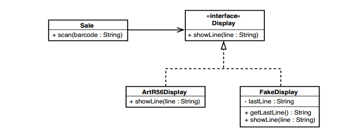
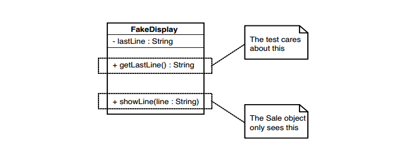

# Chương 3 Hiểu biết và tách biệt

Lý tưởng nhất là khi chúng ta không phải làm bất cứ điều gì đặc biệt đối với một lớp để bắt đầu làm việc với nó. Trong một hệ thống lý tưởng, chúng ta có thể khởi tạo các đối tượng thuộc bất kỳ lớp nào trong kiểm thử khai thác và khiến chúng hoạt động. Chúng ta có thể khởi tạo các đối tượng, viết kiểm thử cho chúng và sau đó chuyển sang những thứ khác. Nếu mọi việc dễ dàng như vậy thì sẽ chẳng có gì để viết về nó, nhưng thật không may, chúng thường khó. Sự phụ thuộc giữa các lớp có thể gây khó khăn cho việc kiểm thử các cụm đối tượng cụ thể. Chúng ta có thể muốn tạo một đối tượng của một lớp và đặt các câu hỏi cho nó, nhưng để tạo ra nó, chúng ta cần các đối tượng của một lớp khác và những đối tượng đó cần các đối tượng của một lớp khác, v.v. Cuối cùng, bạn kết thúc với gần như toàn bộ hệ thống. Trong một số ngôn ngữ, đây không phải là vấn đề lớn. Ở những nơi khác, đáng chú ý nhất là C++, chỉ riêng thời gian liên kết có thể khiến việc quay vòng nhanh chóng gần như không thể xảy ra nếu bạn không phá bỏ sự phụ thuộc.

Trong các hệ thống không được phát triển đồng thời với các kiểm thử đơn vị, chúng ta thường phải phá bỏ các phần phụ thuộc để đưa các lớp vào kiểm thử khai thác, nhưng đó không phải là lý do duy nhất để phá bỏ phụ thuộc. Đôi khi lớp chúng ta muốn kiểm thử có ảnh hưởng đến các lớp khác và các kiểm thử của chúng ta cần biết về chúng. Đôi khi chúng ta có thể cảm nhận được những tác động đó thông qua giao diện của lớp khác. Vào những lúc khác, chúng ta không thể. Lựa chọn duy nhất mà chúng ta có là mạo danh lớp khác để có thể trực tiếp cảm nhận được tác động.

Nói chung, khi chúng tôi muốn thực hiện các kiểm thử, có hai lý do để phá bỏ sự phụ thuộc: cảm biến và tách biệt.

1. Cảm biến — Chúng ta phá bỏ các phần phụ thuộc để nhận biết khi không thể truy cập các giá trị mà code của chúng ta tính toán.
2. Tách biệt — Chúng ta phá bỏ các phần phụ thuộc để phân tách khi thậm chí không thể lấy một đoạn code vào bộ kiểm thử khai thác để chạy.

Đây là một ví dụ. Chúng tôi có một lớp có tên NetworkBridge trong ứng dụng quản lý mạng:

```java
public class NetworkBridge
{
	public NetworkBridge(EndPoint [] endpoints) {
		...
	}
	public void formRouting(String sourceID, String destID) {
		...
	}
	...
}
```

`NetworkBridge` nhận tham số là một mảng `Endpoints` và quản lý cấu hình của chúng bằng cách sử dụng một số phần cứng cục bộ. Người dùng của `NetworkBridge` có thể sử dụng các phương thức của nó để định tuyến lưu lượng truy cập từ `Endpoint` này đến `Endpoint` khác. `NetworkBridge` thực hiện công việc này bằng cách thay đổi cài đặt trên lớp `EndPoint`. Mỗi đối tượng của lớp `EndPoint` sẽ mở một socket và giao tiếp qua mạng tới một thiết bị cụ thể.

Đó là mô tả ngắn gọn về những gì `NetworkBridge` thực hiện. Chúng ta có thể đi vào chi tiết hơn, nhưng từ góc độ kiểm thử, rõ ràng đã có một số vấn đề. Nếu chúng ta muốn viết kiểm thử cho `NetworkBridge` thì phải làm như thế nào? Lớp này rất có thể thực hiện một số lệnh gọi tới phần cứng thực khi nó được khởi tạo. Chúng ta có cần có sẵn phần cứng để tạo một đối tượng của lớp không? Tệ hơn nữa, làm sao chúng ta biết được `Bridge` đang làm gì với phần cứng hoặc `Endpoint` đó? Theo quan điểm của chúng tôi, lớp này là một hộp kín.

Điều này có thể không quá tệ. Có lẽ chúng ta có thể viết một số code để đánh hơi các gói tin trên mạng. Có lẽ chúng ta có thể lấy một số phần cứng để `NetworkBridge` giao tiếp để ít nhất nó không bị treo khi chúng ta cố gắng tạo một đối tượng của nó. Có lẽ chúng ta có thể thiết lập hệ thống dây điện để có thể có một cụm điểm cuối cục bộ và sử dụng chúng khi kiểm thử. Những giải pháp đó có thể hiệu quả, nhưng chúng tốn rất nhiều công sức. Logic mà chúng ta muốn thay đổi trong `NetworkBridge` có thể không cần bất kỳ thứ nào trong số đó; chỉ là chúng ta không thể nắm bắt được nó. Chúng ta không thể chạy một đối tượng của lớp đó và thử trực tiếp để xem nó hoạt động như thế nào.

Ví dụ này minh họa cả vấn đề cảm nhận và tách biệt. Chúng ta không thể cảm nhận được tác động của các lệnh gọi đến các phương thức trên lớp này và chúng ta không thể chạy nó tách biệt với phần còn lại của ứng dụng.

Vấn đề nào khó khăn hơn? Cảm nhận hay tách biệt? Không có câu trả lời rõ ràng. Thông thường, chúng ta cần cả hai và cả hai đều là lý do khiến chúng ta phá bỏ sự phụ thuộc. Tuy nhiên, có một điều rõ ràng: Có nhiều cách để phân tách phần mềm. Trên thực tế, có cả một danh mục các kỹ thuật đó ở phía sau cuốn sách này về chủ đề đó, nhưng có một kỹ thuật chiếm ưu thế về cảm nhận.

## Cộng tác viên giả lập

Một trong những vấn đề lớn mà chúng ta gặp phải khi làm việc với code kế thừa là sự phụ thuộc. Nếu chúng ta muốn tự mình thực thi một đoạn code và xem nó làm gì, chúng ta thường phải loại bỏ sự phụ thuộc vào đoạn code khác. Nhưng nó hiếm khi đơn giản như vậy. Thông thường, đoạn code khác đó là nơi duy nhất chúng ta có thể dễ dàng cảm nhận được tác động của hành động của mình. Nếu chúng ta có thể đặt một số code khác vào vị trí của nó và kiểm thử nó, chúng ta có thể viết các kiểm thử của mình. Trong hướng đối tượng, những đoạn code khác này thường được gọi là _đối tượng giả_.

### Đối tượng giả

Một _đối tượng giả_ là một đối tượng mạo danh một số cộng tác viên lớp của bạn khi nó đang được kiểm thử. Đây là một ví dụ. Trong hệ thống tích điểm bán hàng, chúng ta có một lớp `Sale` (xem Hình 3.1). Nó có một phương thức `scan()` chấp nhận mã vạch của một số mặt hàng khách hàng muốn mua. Bất cứ khi nào `scan()` được gọi, đối tượng `Sale` cần hiển thị tên của mặt hàng được quét cùng với giá của nó trên màn hình máy tính tiền.

Làm cách nào chúng ta có thể kiểm thử chức năng này để xem liệu văn bản phù hợp có hiển thị trên màn hình hay không? Chà, nếu các lệnh gọi đến API hiển thị của máy tính tiền được chôn sâu trong lớp `Sale` thì sẽ rất khó khăn. Có thể không dễ để cảm nhận được hiệu ứng trên màn hình. Nhưng nếu chúng ta có thể tìm thấy vị trí trong code nơi màn hình được cập nhật, chúng ta có thể chuyển sang thiết kế được hiển thị trong Hình 3.2.

Ở đây chúng ta đã viết một lớp mới, `ArtR56Display`. Lớp đó chứa tất cả code cần thiết để giao tiếp với thiết bị hiển thị cụ thể mà chúng ta đang sử dụng. Tất cả những gì chúng ta phải làm là cung cấp cho nó một dòng văn bản chứa những gì chúng ta muốn hiển thị. Chúng ta có thể chuyển tất cả code hiển thị trong `Sale` sang `ArtR56Display` và có một hệ thống thực hiện chính xác những gì nó đã làm trước đây. Điều đó có mang lại cho chúng ta điều gì không? Chà, sau khi hoàn thành việc đó, chúng ta có thể có được thiết kế như trong Hình 3.3.


Hình 3.1 Lớp `Sale`


Hình 3.1 Lớp `Sale` tương tác với lớp hiển thị

Lớp `Sale` hiện có thể giữ `ArtR56Display` hoặc thứ gì khác, `FakeDisplay`. Điều thú vị khi có một màn hình giả là chúng ta có thể viết kiểm thử đối với nó để tìm hiểu xem `Sale` thực hiện điều gì.

Cái này hoạt động ra sao? Chà, `Sale` chấp nhận một `display` và `display` là đối tượng của bất kỳ lớp nào triển khai giao diện `Display`.

```java
public interface Display
{
	void showLine(String line);
}
```

Cả `ArtR56Display` và `FakeDisplay` đều triển khai `Display`.
Một đối tượng `Sale` có thể nhận `display` thông qua hàm khởi tạo và giữ nó bên trong:

```java
public class Sale
{
	private Display display;

	public Sale(Display display) {
		this.display = display;
	}

	public void scan(String barcode) {
		...
		String itemLine = item.name() + " " + item.price().asDisplayText();
		display.showLine(itemLine);
		...
	}
}
```


Hình 3.3 Lớp `Invoice` với phân cấp display

Trong phương thức `scan` có thực hiện gọi phương thức `showLine` bằng biến `display`. Nhưng điều gì xảy ra tùy thuộc vào loại `display` mà chúng ta cung cấp cho đối tượng `Sale` khi khởi tạo nó. Nếu chúng ta cấp cho nó `ArtR56Display`, nó sẽ hiển thị trên phần cứng của máy tính tiền thực. Nếu chúng ta cho nó một `FakeDisplay` thì nó sẽ không hiển thị nhưng chúng ta có thể xem được những gì sẽ được hiển thị. Đây là một kiểm thử chúng ta có thể sử dụng để thấy điều đó:

```java
import junit.framework.*;

public class SaleTest extends TestCase
{
	public void testDisplayAnItem() {
		FakeDisplay display = new FakeDisplay();
		Sale sale = new Sale(display);

		sale.scan("1");
		assertEquals("Milk $3.99", display.getLastLine());
	}
}
```

Lớp `FakeDisplay` có một chút đặc biệt. Hãy nhìn vào nó:

```java
public class FakeDisplay implements Display
{
	private String lastLine = "";

	public void showLine(String line) {
		lastLine = line;
	}

	public String getLastLine() {
		return lastLine;
	}
}
```

Phương thức `showLine` chấp nhận một dòng văn bản và gán nó cho biến `LastLine`. Phương thức `getLastLine` trả về dòng văn bản đó bất cứ khi nào nó được gọi. Đây là hành vi khá mỏng nhưng nó giúp chúng ta rất nhiều. Với kiểm thử đã viết, chúng ta có thể tìm hiểu xem liệu văn bản phù hợp có được gửi đến màn hình hay không khi lớp `Sale` được gọi.

> Đối tượng giả hỗ trợ kiểm thử thực
>
> Đôi khi mọi người nhìn thấy việc sử dụng đối tượng giả, họ nói: "Đó không thực sự là kiểm thử nghiệm". Rốt cuộc, kiểm thử này không cho chúng ta thấy những gì thực sự được hiển thị trên màn hình thực. Giả sử một phần nào đó của phần mềm hiển thị máy tính tiền không hoạt động bình thường; kiểm thử này sẽ không bao giờ phát hiện được. Chà, điều đó đúng, nhưng điều đó không có nghĩa đây không phải là một kiểm thử thực sự. Ngay cả khi chúng ta có thể nghĩ ra một kiểm thử thực sự cho thấy chính xác pixel nào được đặt trên màn hình máy tính tiền thật, điều đó có nghĩa là phần mềm sẽ hoạt động với tất cả phần cứng phải không? Không, không phải vậy—nhưng điều đó cũng không có nghĩa đó không phải là một kiểm thử. Khi chúng ta viết kiểm thử, chúng ta phải chia để trị. Kiểm thử này cho chúng ta biết các đối tượng `Sale` ảnh hưởng đến các `display` như thế nào, chỉ vậy thôi. Nhưng điều đó không tầm thường. Nếu chúng ta phát hiện ra lỗi, việc chạy kiểm thử này có thể giúp chúng ta thấy rằng sự cố không nằm ở `Sale`. Nếu chúng ta có thể sử dụng thông tin như vậy để giúp khoanh vùng lỗi, chúng ta có thể tiết kiệm được một lượng thời gian đáng kinh ngạc.
>
> Khi chúng ta viết kiểm thử cho từng đơn vị riêng lẻ, chúng ta sẽ thu được những phần nhỏ, dễ hiểu. Điều này có thể làm cho việc suy luận về code của chúng ta dễ dàng hơn.

### Hai mặt của đối tượng giả lập

Đối tượng giả lập có thể gây nhầm lẫn khi bạn thấy chúng lần đầu tiên. Một trong những điều kỳ lạ nhất về chúng là chúng có hai "mặt". Chúng ta hãy xem lại lớp `FakeDisplay`, trong Hình 3.4.

Phương thức `showLine` là cần thiết trên `FakeDisplay` vì `FakeDisplay` triển khai `Display`. Đây là phương thức duy nhất trên `Display` và là phương thức duy nhất mà `Sale` thấy được. Phương thức khác, `getLastLine`, dùng để kiểm thử. Đó là lý do tại sao chúng ta khai báo `display` là `FakeDisplay` chứ không phải `Display`


Hình 3.4 Hai mặt của đối tượng giả lập

```java
import junit.framework.*;

public class SaleTest extends TestCase
{
	public void testDisplayAnItem() {
		FakeDisplay display = new FakeDisplay();
		Sale sale = new Sale(display);

		sale.scan("1");
		assertEquals("Milk $3.99", display.getLastLine());
	}
}
```

Lớp `Sale` sẽ thấy `display` giả là `Display`, nhưng trong quá trình kiểm thử, chúng ta cần giữ đối tượng là `FakeDisplay`. Nếu không, chúng ta sẽ không thể gọi `getLastLine()` để tìm hiểu xem chương trình giảm giá sẽ hiển thị nội dung gì.

### Giả lập "chưng cất"

Ví dụ tôi đưa ra trong phần này rất đơn giản nhưng nó cho thấy ý tưởng cốt lõi đằng sau sự giả lập. Chúng có thể được thực hiện theo nhiều cách khác nhau. Trong các ngôn ngữ OO, chúng thường được triển khai dưới dạng các lớp đơn giản như lớp `FakeDisplay` trong ví dụ trước. Trong các ngôn ngữ không phải OO, chúng ta có thể triển khai giả lập bằng cách định nghĩa một hàm thay thế, một hàm ghi lại các giá trị trong một số cấu trúc dữ liệu chung mà chúng ta có thể truy cập trong các kiểm thử. Xem _Chương 19, Dự án của tôi không hướng đối tượng. Làm cách nào để thực hiện an toàn các thay đổi?_, để biết chi tiết.

### Đối tượng mô phỏng (mock)

Giả lập rất dễ viết và là một công cụ rất có giá trị để cảm nhận. Nếu bạn phải viết nhiều, bạn có thể muốn xem xét một loại giả cao cấp hơn được gọi là _đối tượng mô phỏng (mock object)_. Đối tượng mô phỏng là giả lập thực hiện các xác nhận nội bộ. Dưới đây là ví dụ về kiểm thử sử dụng đối tượng mô phỏng:

```java
import junit.framework.*;

public class SaleTest extends TestCase
{
	public void testDisplayAnItem() {
		MockDisplay display = new MockDisplay();
		display.setExpectation("showLine", "Milk $3.99");
		Sale sale = new Sale(display);
		sale.scan("1");
		display.verify();
	}
}
```

Trong kiểm thử này, chúng ta tạo một đối tượng display mô phỏng. Điều thú vị về mô phỏng là chúng ta có thể cho chúng biết những cuộc gọi nào sẽ xảy ra, sau đó chúng ta yêu cầu chúng kiểm tra xem liệu chúng có nhận được những cuộc gọi đó hay không. Đó chính xác là những gì xảy ra trong trường hợp kiểm thử này. Chúng ta yêu cầu `display` gọi phương thức `showLine` của nó với đối số là "Milk $3,99". Sau khi kỳ vọng đã được đặt, chúng ta chỉ cần tiếp tục và sử dụng đối tượng bên trong kiểm thử. Trong trường hợp này, chúng ta gọi phương thức `scan()`. Sau đó, chúng ta gọi phương thức `verify()` để kiểm tra xem liệu tất cả các kỳ vọng có được đáp ứng hay không. Nếu không, kiểm thử sẽ thất bại.

Mô phỏng là một công cụ mạnh mẽ và có sẵn rất nhiều framework mô phỏng. Tuy nhiên, các framework mô phỏng không có sẵn ở tất cả các ngôn ngữ và các đối tượng giả đơn giản là đủ trong hầu hết các trường hợp.
