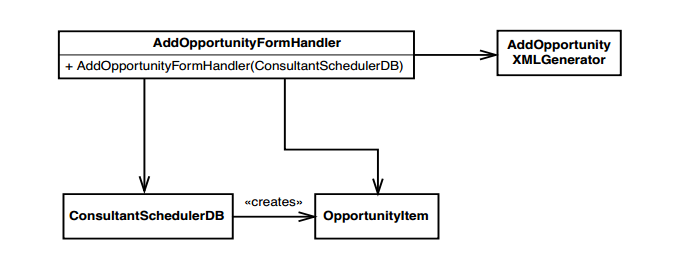
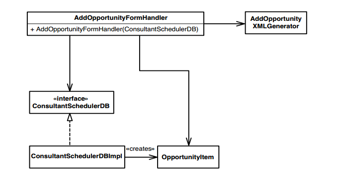
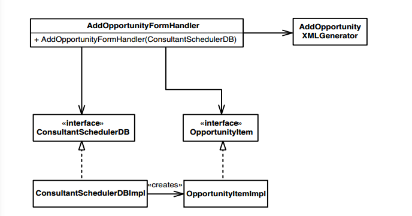
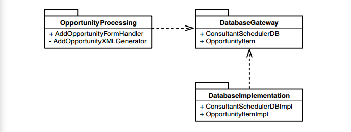

# Chương 7, Mất quá nhiều thời gian để tạo ra một sự thay đổi

Mất bao lâu để thực hiện thay đổi? Câu trả lời sẽ rất rộng. Với các dự án có code tệ hại không rõ ràng, nhiều thay đổi cần thời gian khá dài. Chúng ta phải tìm hiểu code, hiểu tất cả các nhánh của một thay đổi và sau đó thực hiện thay đổi. Ở những vùng code rõ ràng hơn, việc này có thể rất nhanh, nhưng ở những vùng thực sự rắc rối, có thể mất rất nhiều thời gian. Một số nhóm có thể tồi tệ hơn nhiều so với những nhóm khác. Đối với họ, ngay cả những thay đổi đơn giản nhất cũng mất nhiều thời gian để thực hiện. Mọi người trong nhóm đó có thể tìm hiểu xem họ cần thêm tính năng nào, hình dung chính xác nơi thực hiện thay đổi, truy cập vào code và thực hiện thay đổi trong năm phút và vẫn không thể hoàn thành thay đổi của họ trong vài giờ.

Hãy xem xét các lý do và một số giải pháp khả thi

## Hiểu biết

Khi số lượng code trong một dự án tăng lên, nó sẽ dần vượt qua sự hiểu biết. Thời gian cần thiết để tìm ra những gì cần thay đổi liên tục tăng lên.

Một phần của điều này là không thể tránh khỏi. Khi thêm code vào một hệ thống, chúng ta có thể thêm vào các lớp, phương thức, hàm hiện có hoặc có thể tạo mới. Trong cả hai trường hợp, sẽ mất một thời gian để tìm ra hướng thay đổi nếu chúng ta không quen thuộc với bối cảnh.

Tuy nhiên, có một điểm khác biệt chính giữa hệ thống được bảo trì tốt và hệ thống kế thừa. Trong một hệ thống được bảo trì tốt, có thể mất một lúc để tìm ra cách thực hiện thay đổi, nhưng khi bạn đã có cách thực hiện, nó thường dễ dàng và bạn sẽ cảm thấy thoải mái hơn nhiều với hệ thống. Trong một hệ thống kế thừa, có thể mất nhiều thời gian hơn để tìm ra những việc cần làm và cách thay đổi cũng khó khăn. Bạn cũng có thể cảm thấy mình chưa học được nhiều điều ngoài sự hiểu biết hạn hẹp mà bạn phải đạt được để thực hiện thay đổi. Trong trường hợp xấu nhất, có vẻ như không có đủ thời gian để hiểu mọi thứ bạn cần làm để tạo ra sự thay đổi, bạn phải mù quáng bắt đầu thay đổi, và hy vọng rằng sẽ có thể giải quyết tất cả vấn đề mà bạn gặp phải.

Các hệ thống được chia thành các phần nhỏ, được đặt tên rõ ràng, dễ hiểu giúp làm việc nhanh hơn. Nếu sự hiểu biết là một vấn đề lớn đối với dự án của bạn, hãy xem _Chương 16, Tôi không hiểu code đủ rõ để thay đổi nó_ và _Chương 17, Ứng dụng của tôi không có kiến trúc_, để có một số ý tưởng về cách tiến hành.

## Độ trễ

Các thay đổi thường mất nhiều thời gian vì một lý do rất phổ biến khác: độ trễ. Độ trễ là khoảng thời gian giữa một thay đổi đang được thực hiện và thời điểm nhận được phản hồi thực sự về thay đổi đó. Tại thời điểm viết bài này, tàu thám hiểm Sao Hỏa - Spirit - đang di chuyển trên bề mặt sao Hỏa để chụp ảnh. Mất khoảng bảy phút để tín hiệu đi từ Trái đất đến Sao Hỏa. May mắn là Spirit có một số phần mềm hướng dẫn tích hợp giúp nó tự di chuyển. Hãy tưởng tượng sẽ như thế nào khi lái thủ công từ Trái đất. Bạn vận hành các nút điều khiển và tìm ra 14 phút sau xe tự hành đã di chuyển được bao xa. Sau đó, bạn quyết định những gì bạn muốn làm tiếp theo, thực hiện nó và đợi thêm 14 phút để tìm hiểu điều gì đã xảy ra. Nó có vẻ không hiệu quả một cách lố bịch, phải không? Tuy nhiên, khi nghĩ lại, đó chính xác là cách mà hầu hết chúng ta làm việc hiện nay khi phát triển phần mềm. Chúng ta thực hiện một số thay đổi, bắt đầu dựng và sau đó tìm hiểu điều gì đã xảy ra sau đó. Thật không may, chúng ta không có phần mềm biết cách điều hướng xung quanh các chướng ngại vật trong quá trình dựng, chẳng hạn như lỗi kiểm thử. Thay vào đó, những gì chúng ta cố gắng làm là gộp một loạt các thay đổi và thực hiện tất cả chúng cùng một lúc để chúng ta không phải dựng quá thường xuyên. Nếu những thay đổi của chúng ta là tốt, sẽ có cải thiện, mặc dù chậm như xe tự hành trên sao Hỏa. Nếu gặp chướng ngại vật, chúng ta sẽ đi chậm hơn.

Điều đáng buồn về cách làm việc này là trong hầu hết các ngôn ngữ, nó hoàn toàn không cần thiết. Đó hoàn toàn là một sự lãng phí thời gian. Trong hầu hết các ngôn ngữ chính thống, bạn luôn có thể phá vỡ phụ thuộc theo cách cho phép bạn biên dịch lại và chạy kiểm thử đối với bất kỳ code nào bạn đang làm việc trong vòng chưa đầy 10 giây. Nếu một nhóm thực sự có động lực, các thành viên của nhóm có thể giảm tốc độ xuống dưới năm giây, trong hầu hết các trường hợp. Kết quả là: Bạn sẽ có thể biên dịch mọi lớp hoặc mô-đun trong hệ thống của mình một cách riêng biệt với các lớp hoặc mô-đun khác và trong kiểm thử khai thác của chính nó. Khi có điều đó, bạn có thể nhận được phản hồi rất nhanh và điều đó sẽ giúp quá trình phát triển diễn ra nhanh hơn.

Tâm trí con người có một số đặc điểm thú vị. Nếu chúng ta phải thực hiện một nhiệm vụ ngắn (khoảng 5-10 giây) và chúng ta chỉ có thể bước một bước mỗi phút, chúng ta thường thực hiện rồi tạm dừng. Nếu chúng ta phải thực hiện một số công việc để tìm ra những việc cần làm ở bước tiếp theo, chúng ta bắt đầu lập kế hoạch. Sau khi lập kế hoạch, tâm trí chúng ta lang thang cho đến khi chúng ta có thể thực hiện bước tiếp theo. Nếu chúng ta rút ngắn thời gian giữa các bước xuống từ một phút xuống còn vài giây, chất lượng của công việc trí óc sẽ khác đi. Chúng ta có thể sử dụng thông tin phản hồi để thử các phương pháp một cách nhanh chóng. Công việc của chúng ta trở nên giống như lái xe hơn là chờ đợi ở trạm xe buýt. Sự tập trung của chúng ta cao hơn bởi vì chúng ta không liên tục chờ đợi cơ hội tiếp theo để làm điều gì đó. Quan trọng nhất, lượng thời gian mà chúng ta cần để nhận ra và sửa lỗi sẽ ít hơn nhiều.

Điều gì khiến chúng ta không thể làm việc theo cách này mọi lúc? Một số người có thể. Những người lập trình bằng ngôn ngữ thông dịch thường có thể nhận được phản hồi gần như tức thời khi họ làm việc. Đối với phần còn lại, những người làm việc với các ngôn ngữ cần biên dịch, trở ngại chính là sự phụ thuộc, nhu cầu biên dịch thứ gì đó mà chúng ta không quan tâm chỉ vì chúng ta muốn biên dịch thứ khác.

## Phá bỏ sự phụ thuộc

Sự phụ thuộc có thể có vấn đề, nhưng may mắn thay, chúng ta có thể phá vỡ chúng. Trong code hướng đối tượng, bước đầu tiên thường là cố gắng khởi tạo các lớp mà chúng ta cần trong kiểm thử khai thác. Trong những trường hợp đơn giản nhất, chúng ta có thể làm điều này chỉ bằng cách nhập hoặc liệt kê phần khai báo của các lớp phụ thuộc. Trong những trường hợp khó hơn, hãy thử các kỹ thuật trong _Chương 9, Tôi không thể đưa lớp này vào kiểm thử khai thác_. Khi bạn có thể tạo một đối tượng của một lớp trong kiểm thử khai thác, bạn có thể sẽ phải phá vỡ các phần phụ thuộc khác nếu bạn muốn thử nghiệm riêng biệt các phương thức. Trong những trường hợp đó, hãy xem _Chương 10, Tôi không thể đưa lớp này vào kiểm thử khai thác_.

Nói chung, khi bạn có một lớp cần thay đổi trong kiểm thử khai thác, bạn sẽ được hưởng lợi khi vòng lặp chỉnh sửa - biên dịch - liên kết - kiểm tra diễn ra nhanh. Thông thường, chi phí thực thi đối với hầu hết các phương thức tương đối thấp so với chi phí của các phương thức mà chúng gọi, đặc biệt là gọi đến tài nguyên bên ngoài như cơ sở dữ liệu, phần cứng hoặc cơ sở hạ tầng truyền thông. Ngoài ra là trường hợp phương thức có nhiều tính toán. Những kỹ thuật mà tôi đã vạch ra trong _Chương 22 - Tôi Cần Thay đổi một Phương thức "Quái vật" và Tôi Không thể Viết Kiểm thử cho Nó_, có thể hữu ích.

Trong nhiều trường hợp, sự thay đổi diễn ra đơn giản, nhưng thường thì những người làm việc với code kế thừa đã dừng lại ngay từ bước đầu tiên: cố gắng đưa một lớp vào kiểm thử khai thác. Đây có thể là một nỗ lực lớn với một số hệ thống. Một số lớp thậm chí rất lớn; những cái khác có quá nhiều phụ thuộc đến mức chúng dường như quá tải hoàn toàn các chức năng mà bạn muốn làm việc. Trong những trường hợp như vậy, bạn nên xem liệu có thể cắt bỏ một đoạn code lớn hơn và đưa nó vào kiểm thử hay không. Xem _Chương 12, Tôi cần thực hiện nhiều thay đổi trong một khu vực. Tôi có phải phá vỡ các phụ thuộc của tất cả các lớp liên quan không?_ Chương đó chứa một tập hợp các kỹ thuật có thể sử dụng để tìm các _điểm chặn (180)_, những nơi mà việc viết kiểm thử dễ dàng hơn.

Trong phần còn lại của chương này, tôi mô tả cách bạn có thể thay đổi tổ chức code của mình để giúp việc dựng dễ dàng hơn.

## Dựng phụ thuộc

Trong hệ thống hướng đối tượng, nếu bạn muốn xây dựng một nhóm các lớp nhanh hơn, thì điều đầu tiên cần xác định là những phần phụ thuộc nào sẽ gây cản trở. Nói chung, điều đó khá dễ dàng: Bạn chỉ cần sử dụng các lớp trong kiểm thử khai thác. Gần như mọi vấn đề bạn gặp phải sẽ là kết quả của một số sự phụ thuộc nên phá vỡ. Sau khi các lớp chạy trong kiểm thử khai thác, vẫn còn một số phụ thuộc có thể ảnh hưởng đến thời gian biên dịch. Rất đáng để xem xét mọi thứ phụ thuộc vào những gì bạn có thể khởi tạo. Những thứ đó sẽ phải biên dịch lại khi bạn dựng lại hệ thống. Làm thế nào bạn có thể giảm thiểu điều này?

Cách để xử lý việc này là trích xuất các giao diện cho các lớp trong nhóm dựng nhanh được sử dụng bởi các lớp bên ngoài. Trong nhiều IDE, bạn có thể trích xuất giao diện bằng cách chọn một lớp và thực hiện lựa chọn menu hiển thị cho bạn danh sách tất cả các phương thức trong lớp và cho phép bạn chọn phương thức nào bạn muốn trở thành một phần của giao diện mới. Sau đó, công cụ cho phép bạn cung cấp tên của giao diện mới. Chúng cũng cung cấp cho bạn tùy chọn thay thế các tham chiếu đến lớp bằng các tham chiếu đến giao diện ở mọi nơi có thể trong hệ thống. Đó là một tính năng cực kỳ hữu ích. Trong C++, _Trích xuất Trình triển khai (356)_ dễ hơn một chút so với _Trích xuất Giao diện (362)_. Bạn không phải thay đổi tên của các tham chiếu ở mọi nơi, nhưng bạn phải thay đổi những nơi tạo ra các thực thể của lớp cũ (xem _Trích xuất Trình triển khai (356)_ để biết chi tiết).

Khi chúng ta có kiểm thử của nhóm lớp này, chúng ta có khả năng thay đổi cấu trúc vật lý của dự án để giúp việc xây dựng dễ dàng hơn, bằng cách chuyển nhóm này sang một gói hoặc thư viện mới. Các bản dựng trở nên phức tạp hơn khi chúng ta làm điều đó, nhưng đây mới là điểm mấu chốt: Khi chúng ta chia nhỏ các phần phụ thuộc và tách các lớp thành các gói hoặc thư viện mới, tổng chi phí cho việc xây dựng lại toàn bộ hệ thống tăng lên, nhưng thời gian trung bình cho một bản dựng có thể giảm bớt.

Cùng xem xét một ví dụ. Hình 7.1 cho thấy một tập hợp nhỏ các lớp cộng tác với nhau, tất cả nằm trong cùng một gói.

Hình 7.1 Sơ đồ phân phối lớp Opportunity

Chúng ta muốn thực hiện một số thay đổi với lớp `AddOpportunityFormHandler`, nhưng sẽ tốt hơn rất nhiều nếu chúng ta cũng có thể khiến bản dựng nhanh hơn. Bước đầu tiên là thử tạo một `AddOpportunityFormHandler`. Thật không may, tất cả các lớp mà nó phụ thuộc đều là bị cụ thể hóa. `AddOpportunityFormHandler` cần có `ConsultantSchedulerDB` và `AddOpportunityXMLGenerator`. Rất có thể cả hai lớp đó đều phụ thuộc vào các lớp khác không có trong sơ đồ.

Nếu chúng ta cố gắng khởi tạo một `AddOpportunityFormHandler`, ai mà biết được sẽ phải sử dụng bao nhiêu lớp? Chúng ta có thể vượt qua điều này nếu phá bỏ sự phụ thuộc. Phần phụ thuộc đầu tiên mà chúng tôi gặp phải là `ConsultantSchedulerDB`. Chúng ta cần tạo một thực thể của nó để truyền vào hàm khởi tạo `AddOpportunityFormHandler`. Sẽ rất khó sử dụng lớp đó vì nó kết nối với cơ sở dữ liệu và chúng ta không muốn làm điều đó trong quá trình thử nghiệm. Tuy nhiên, chúng ta có thể sử dụng _Trích xuất Trình triển khai (356)_ và phá bỏ sự phụ thuộc như trong Hình 7.2.

Hình 7.2 Trích xuất triển khai `ConsultantSchedulerDB`

Bây giờ `ConsultantSchedulerDB` là một giao diện, chúng ta có thể tạo một `AddOpportunityFormHandler` bằng cách sử dụng một đối tượng giả của giao diện `ConsultantSchedulerDB`. Thật thú vị, bằng cách phá bỏ sự phụ thuộc này, chúng ta đã làm cho quá trình dựng nhanh hơn trong một số điều kiện. Lần tới khi thực hiện sửa đổi `ConsultantSchedulerDBImpl`, `AddOpportunityFormHandler` sẽ không phải cần biên dịch lại. Tại sao? Chà, nó không còn phụ thuộc trực tiếp vào `ConsultantSchedulerDBImpl` nữa. Chúng ta có thể thực hiện bao nhiêu thay đổi tùy ý đối với tệp `ConsultantSchedulerDBImpl`, mà không phải dựng lại lớp `AddOpportunityFormHandler`, trừ khi điều gì đó buộc chúng ta phải thay đổi giao diện `ConsultantSchedulerDB`,

Nếu muốn, chúng ta có thể tự cô lập mình khỏi việc bắt buộc biên dịch lại, như trong Hình 7.3. Đây là một thiết kế khác cho hệ thống mà chúng ta đạt được bằng cách sử dụng _Trích xuất Trình triển khai (356)_ trên lớp `OpportunityItem`.

Hình 7.3 Trích xuất triển khai `OpportunityItem`

Bây giờ `AddOpportunityFormHandler` hoàn toàn không phụ thuộc gì vào `OpportunityItem`. Theo một cách nào đó, chúng ta đã đặt một "tường lửa biên dịch" trong code. Chúng ta có thể thực hiện bao nhiêu thay đổi tùy ý với `ConsultantSchedulerDBImpl` và `OpportunityItemImpl`, nhưng điều đó sẽ không buộc `AddOpportunityFormHandler` phải biên dịch lại và nó sẽ không buộc bất kỳ nơi gọi nào của `AddOpportunityFormHandler` phải biên dịch lại. Nếu muốn làm rõ điều này trong cấu trúc gói của ứng dụng, chúng ta có thể chia thiết kế của mình thành các gói riêng biệt như trong Hình 7.4.

Hình 7.4 Tái cấu trúc cấu trúc của gói

Bây giờ chúng ta có gói `OpportunityProcessing` hoàn toàn không phụ thuộc vào việc triển khai cơ sở dữ liệu. Bất kỳ kiểm thử nào chúng ta viết và đặt trong gói sẽ được biên dịch nhanh chóng và bản thân gói đó không phải biên dịch lại khi thay đổi code trong các lớp triển khai cơ sở dữ liệu.

> Nguyên tắc đảo ngược phụ thuộc
>
> Khi code của bạn phụ thuộc vào một giao diện, sự phụ thuộc đó thường rất nhỏ và khó nhận biết. Code của bạn không cần thay đổi trừ khi giao diện thay đổi và các giao diện thường ít thay đổi hơn nhiều so với code đằng sau chúng. Khi bạn có một giao diện, bạn có thể chỉnh sửa các lớp đang triển khai giao diện đó hoặc thêm các lớp mới triển khai giao diện mà không ảnh hưởng đến code sử dụng giao diện.
>
> Vì lý do này, tốt hơn là phụ thuộc vào các giao diện hoặc các lớp trừu tượng hơn là phụ thuộc vào các lớp cụ thể. Khi bạn phụ thuộc vào những thứ ít biến động hơn, bạn giảm thiểu khả năng những thay đổi cụ thể sẽ kích hoạt quá trình biên dịch lại lớn.

Cho đến giờ, chúng ta đã thực hiện một số cách để ngăn không cho `AddOpportunityFormHandler` biên dịch lại khi sửa đổi các lớp mà nó phụ thuộc vào. Điều đó làm cho việc dựng nhanh hơn, nhưng nó chỉ là một nửa của vấn đề. Chúng ta cũng có thể tạo bản dựng nhanh hơn cho code phụ thuộc vào `AddOpportunityFormHandler`. Hãy xem lại thiết kế gói trong Hình 7.5.

Hình 7.5 Cấu trúc của gói

`AddOpportunityFormHandler` là lớp sản phẩm công khai duy nhất (không kiểm thử) trong `OpportunityProcessing`. Bất kỳ lớp nào trong các gói khác phụ thuộc vào nó đều phải biên dịch lại khi nó thay đổi. Chúng ta có thể phá bỏ sự phụ thuộc đó bằng cách sử dụng _Trích xuất Giao diện (362)_ hoặc _Trích xuất Trình triển khai (356)_ trên `AddOpportunityFormHandler`. Sau đó, các lớp trong các gói khác có thể phụ thuộc vào các giao diện. Khi làm điều này, chúng ta đã bảo vệ hiệu quả tất cả lời của gói này khỏi việc biên dịch lại khi thực hiện hầu hết các thay đổi.

Chúng ta có thể phá vỡ các phụ thuộc và phân bổ chúng vào các gói khác nhau để giúp thời gian dựng nhanh hơ, việc này rất đáng giá. Khi bạn có thể dựng lại và chạy kiểm thử của mình thật nhanh, bạn có thể nhận được nhiều phản hồi hơn khi phát triển. Trong hầu hết các trường hợp, điều đó đồng nghĩa với ít lỗi hơn và lỗi ít trầm trọng hơn. Nhưng nó vẫn có cái giá của nó. Có một số khái niệm về chi phí chung trong việc số giao diện và gói tăng lên. Đó có phải là một mức giá hợp lý để trả so với giải pháp thay thế? Đúng. Đôi khi, có thể mất nhiều thời gian hơn để tìm kiếm hơn khi bạn có nhiều gói và giao diện hơn, nhưng khi tìm thấy, bạn sẽ dễ dàng làm việc với chúng hơn.

> Khi bạn sử dụng nhiều giao diện và gói hơn vào thiết kế của mình để phá vỡ các phụ thuộc, lượng thời gian cần thiết để dựng lại toàn bộ hệ thống sẽ tăng lên một chút. Có nhiều tập tin để biên dịch. Nhưng thời gian trung bình để tạo một bản dựng dựa trên những gì cần được biên dịch lại có thể giảm đáng kể

Khi bạn tối ưu hóa thời gian dựng trung bình, bạn sẽ có được những vùng code rất dễ làm việc. Có thể hơi khó khăn khi yêu cầu một tập hợp nhỏ các lớp biên dịch riêng biệt và được kiểm thử, nhưng điều quan trọng cần nhớ là bạn chỉ phải thực hiện một lần cho tập hợp các lớp đó; sau đó, bạn có thể gặt hái những lợi ích mãi mãi.

## Tóm tắt

Các kỹ thuật tôi trình bày trong chương này có thể được sử dụng để giảm thời gian dựng cho các cụm lớp nhỏ, nhưng đây chỉ là một phần nhỏ trong những gì bạn có thể làm với việc sử dụng các giao diện và gói để quản lý các phụ thuộc. Cuốn sách của Robert C. Martin _Phát triển phần mềm linh hoạt: Nguyên tắc, Khuôn mẫu và Thực tiễn_ (Pearson Education, 2002) trình bày nhiều kỹ thuật hơn và tôi cho là mọi chuyên gia phát triển phần mềm nên biết.
