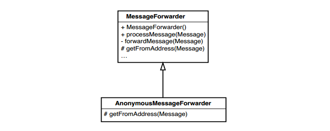
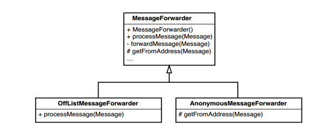
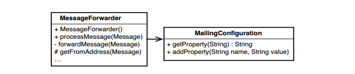
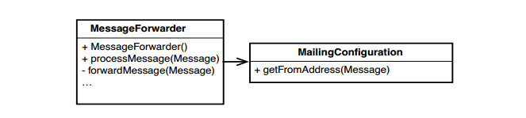
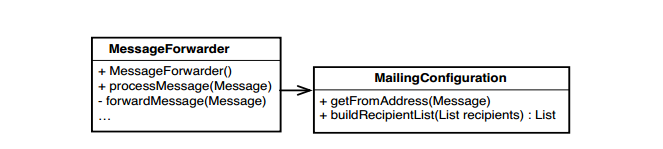
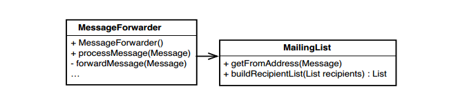

# Chương 8, Làm thế nào để tôi thêm một chức năng mới?

Đây hẳn là câu hỏi trừu tượng nhất và về vấn đề chuyên biệt nhất trong cuốn sách này. Tôi suýt nữa đã không đưa nó vào vì điều đó. Nhưng thực tế là, bất kể thiết kế của chúng ta có cách tiếp cận thế nào hay có hạn chế nào, có một số kỹ thuật mà có thể sử dụng để làm cho công việc trở nên dễ dàng hơn.

Hãy nói về bối cảnh. Trong code kế thừa, một trong những cân nhắc quan trọng nhất là chúng ta không có các kiểm thử xung quanh phần lớn code của mình. Tồi tệ hơn, việc đưa chúng vào đúng vị trí có thể gặp khó khăn. Nhiều người trong nhiều nhóm bị cám dỗ quay trở lại với các kỹ thuật trong _Chương 6, Tôi không có nhiều thời gian và tôi phải thay đổi nó_, vì điều này. Chúng ta có thể sử dụng các kỹ thuật được mô tả ở đó (phát triền và đóng gói) để thêm vào code mà không cần kiểm tra, nhưng có những mối nguy hiểm khác ngoài những mối nguy hiểm rõ ràng. Có một điều, khi chúng ta phát triển hoặc đóng gói, chúng ta không sửa đổi đáng kể code hiện có, vì vậy code sẽ không khá hơn trong một khoảng thời gian. Sao chép là một mối nguy hiểm khác. Nếu code mà chúng ta thêm code trùng lặp tồn tại trong các khu vực chưa được kiểm thử, code đó có thể sẽ nằm đó và mưng mủ. Tồi tệ hơn, chúng ta có thể không nhận ra rằng sẽ có sự trùng lặp cho đến khi thực hiện các thay đổi của mình. Mối nguy hiểm cuối cùng là sự sợ hãi và cam chịu: sợ rằng chúng ta không thể thay đổi một đoạn code cụ thể và làm cho nó dễ làm việc hơn, và cam chịu vì toàn bộ các khu vực của code không trở nên tốt hơn. Nỗi sợ hãi cản trở việc đưa ra quyết định đúng đắn. Các mầm và lớp bọc còn lại trong code là những lời nhắc nhở nhỏ về nó.

Nói chung, tốt hơn là nên đối đầu với con thú thay vì trốn tránh nó. Nếu chúng ta có thể kiểm thử code, chúng ta có thể sử dụng các kỹ thuật trong chương này để tiến lên một cách tốt đẹp. Nếu bạn cần tìm cách thực hiện các kiểm thử đúng vị trí, hãy xem _Chương 13, Tôi cần thực hiện thay đổi nhưng tôi không biết kiểm thử nào phải viết_. Nếu các phần phụ thuộc cản trở bạn, hãy xem _Chương 9, Tôi không thể đưa lớp này vào kiểm thử khai thác_ và _Chương 10, Tôi không thể đưa lớp này vào kiểm thử khai thác_. Khi chúng ta có các kiểm thử đúng vị trí, chúng ta sẽ ở vị thế tốt hơn để thêm các tính năng mới. Chúng ta có một nền tảng vững chắc.

## Phát triển dựa trên thử nghiệm (Test-Driven Development - TDD)

Kỹ thuật bổ sung tính năng mạnh mẽ nhất mà tôi biết là phát triển dựa trên thử nghiệm (TDD). Nó hoạt động ngắn gọn như sau: Đầu tiên tưởng tượng ra phương thức sẽ giúp chúng ta giải quyết một phần của vấn đề, sau đó chúng ta viết một trường hợp kiểm thử thất bại cho phương thức đó. Phương thức này chưa tồn tại, nhưng nếu chúng ta có thể viết kiểm thử cho nó, thì chúng ta đã củng cố hiểu biết của mình về những gì nên làm của code chúng ta sắp viết.

Phát triển dựa trên thử nghiệm sử dụng một thuật toán nhỏ như sau:
1. Viết một trường hợp kiểm thử thất bại.
2. Viết code để biên dịch kiểm thử.
3. Viết code để vượt qua kiểm thử.
4. Tái cấu trúc.
5. Lặp lại

Đây là một ví dụ. Chúng ta đang làm việc với một ứng dụng tài chính và cần một lớp sử dụng các phép toán mạnh mẽ để xác định có nên giao dịch một số mặt hàng nhất định hay không. Chúng ta cần một lớp Java tính toán một thứ gọi là thời điểm thống kê đầu tiên về một điểm. Chúng ta chưa có một phương thức nào làm được điều đó, nhưng chúng ta biết rằng có thể viết một trường hợp kiểm thử cho phương thức đó. Chúng ta biết toán học, vì vậy chúng ta biết rằng câu trả lời phải là -0,5 đối với dữ liệu chúng tôi mã hóa trong kiểm thử.

### Viết một trường hợp kiểm thử thất bại
Đây là một trường hợp kiểm thử cho chức năng chúng ta cần.

```java
public void testFirstMoment() {
  InstrumentCalculator calculator = new InstrumentCalculator();
  calculator.addElement(1.0);
  calculator.addElement(2.0);

  assertEquals(-0.5, calculator.firstMomentAbout(2.0), TOLERANCE);
}
```

### Viết code để biên dịch kiểm thử
Kiểm thử chúng ta vừa viết rất tốt, nhưng nó không biên dịch được. Chúng ta không có phương thức có tên `firstMomentAbout` trong `InstrumentCalculator`. Nhưng chúng ta thêm nó như một phương thức rỗng. Chúng ta muốn thử nghiệm thất bại, vì vậy chúng ta yêu cầu nó trả về giá trị `double` là `NaN` (chắc chắn không phải là giá trị mong đợi là -0,5).

```java
public class InstrumentCalculator
{
  double firstMomentAbout(double point) {
    return Double.NaN;
  }
  ...
}
```

### Viết code để vượt qua kiểm thử
Với kiểm thử được viết, chúng ta viết code để nó vượt qua.

```java
public double firstMomentAbout(double point) {
  double numerator = 0.0;
  for (Iterator it = elements.iterator(); it.hasNext(); ) {
    double element = ((Double)(it.next())).doubleValue();
    numerator += element - point;
  }
  return numerator / elements.size();
}
```

> Đây là một lượng code lớn bất thường cần viết để đáp ứng với kiểm thử trong TDD. Thông thường, các bước nhỏ hơn nhiều, mặc dù chúng có thể lớn như vậy nếu bạn chắc chắn về thuật toán bạn cần sử dụng.

### Tái cấu trúc
Có bất kỳ sự trùng lặp nào ở đây không? Không. Chúng ta có thể chuyển sang trường hợp tiếp theo.

### Viết một trường hợp kiểm thử thất bại.

Code chúng ta vừa viết đã vượt qua được kiểm thử, nhưng nó chắc chắn không đúng cho mọi trường hợp. Trong câu lệnh `return`, chúng ta có thể vô tình chia cho 0. Trong trường hợp đó, chúng ta nên làm gì? Chúng ta trả về cái gì khi không có phần tử nào? Trong trường hợp này, chúng ta muốn trả về một ngoại lệ. Kết quả sẽ vô nghĩa đối với chúng ta trừ khi chúng ta có dữ liệu trong danh sách thành phần của mình.

Kiểm thử tiếp theo sẽ đặc biệt hơn. Nó sẽ không vượt qua nếu một `UnlimitedBasisException` không được trả ra và nó sẽ vượt qua nếu không có ngoại lệ nào được trả ra hoặc bất kỳ ngoại lệ nào khác được trả ra. Khi chúng ta chạy nó, nó không thành công vì `ArithmeticException` bị trả ra khi chúng ta chia cho 0 trong `FirstMomentAbout`.

```java
public void testFirstMoment() {
  try {
    new InstrumentCalculator().firstMomentAbout(0.0);
    fail("expected InvalidBasisException");
  }
  catch (InvalidBasisException e) {
  }
}
```

### Viết code để biên dịch kiểm thử.

Để làm điều này, chúng ta phải thay đổi khai báo của `firstMomentAbout` để nó trả ra một `UnlimitedBasisException`.

```java
public double firstMomentAbout(double point)
    throws InvalidBasisException {

  double numerator = 0.0;
  for (Iterator it = elements.iterator(); it.hasNext(); ) {
    double element = ((Double)(it.next())).doubleValue();
    numerator += element - point;
  }
  return numerator / elements.size();
}
```

Nhưng nó vẫn chưa biên dịch được. Các lỗi trình biên dịch cho biết rằng chúng ta phải thực sự trả ra ngoại lệ nếu nó được liệt kê trong phần khai báo, vì vậy cần tiếp tục viết thêm code.

```java
public double firstMomentAbout(double point)
    throws InvalidBasisException {

  if (element.size() == 0)
    throw new InvalidBasisException("no elements");

  double numerator = 0.0;
  for (Iterator it = elements.iterator(); it.hasNext(); ) {
    double element = ((Double)(it.next())).doubleValue();
    numerator += element - point;
  }
  return numerator / elements.size();
}
```

### Viết code để vượt qua kiểm thử.
Kiểm thử đã vượt qua

### Tái cấu trúc.

Không có trùng lặp nào.

### Viết một trường hợp kiểm thử thất bại

Đoạn code tiếp theo mà chúng ta phải viết là một phương thức tính toán thời điểm thống kê thứ hai về một điểm. Trên thực tế, nó chỉ là một biến thể của cái đầu tiên. Đây là một kiểm thử giúp chúng ta viết code đó. Trong trường hợp này, giá trị kỳ vọng là 0,5 thay vì -0,5. Chúng ta viết một kiểm thử mới cho một phương thức chưa tồn tại: `secondMomentAbout`.

```java
public void testSecondMoment() throws Exception {
  InstrumentCalculator calculator = new InstrumentCalculator();
  calculator.addElement(1.0);
  calculator.addElement(2.0);

  assertEquals(0.5, calculator.secondMomentAbout(2.0), TOLERANCE);
}
```

### Viết code để biên dịch kiểm thử

Để biên dịch nó, chúng ta phải định nghĩa phương thức `secondMomentAbout`. Chúng ta có thể sử dụng thủ thuật tương tự với phương thức `FirstMomentAbout`, nhưng hóa ra code cho `second moment` chỉ là một biến thể nhỏ `first moment`.

Dòng này ở `firstMoment`:

```java
  numerator += element - point;
```

phải trở thành như thế này trong trường hợp của `secondMoment`:

```java
  numerator += Math.pow(element – point, 2.0);
```

Và có một mô hình chung cho loại điều này. Thời điểm thống kê thứ n được tính bằng biểu thức này:

```java
  numerator += Math.pow(element – point, N);
```

Code của `firstMomentAbout` chạy được bởi vì `element – point` có cùng giá trị với `Math.pow(element – point, 1.0)`

Giờ đây, chúng ta có một vài lựa chọn. Chúng ta có thể nhận thấy tính tổng quát và viết một phương thức chung chấp nhận một điểm "about" và một giá trị cho `N`. Sau đó, chúng ta có thể thay thế toàn bộ `firstMomentAbout(double)` bằng một lệnh gọi đến phương thức chung đó. Chúng ta có thể làm điều đó, nhưng nó sẽ tạo gánh nặng cho nơi gọi với yêu cầu cung cấp giá trị `N` và chúng ta cũng không muốn cho khách hàng tuỳ ý cung cấp giá trị của `N`. Có vẻ như chúng ta đang suy nghĩ hơi lan man. Chúng ta nên tạm dừng việc này và hoàn thành những gì cần làm trước. Công việc duy nhất bây giờ là biên dịch nó. Chúng ta có thể khái quát hóa sau nếu thấy vẫn cần thiết.

Để biên dịch nó, chúng ta có thể tạo một bản sao của phương thức `firstMomentAbout` và đổi tên nó thành `secondMomentAbout`:

```java
public double secondMomentAbout(double point)
    throws InvalidBasisException {

  if (elements.size() == 0)
    throw new InvalidBasisException("no elements");

  double numerator = 0.0;
  for (Iterator it = elements.iterator(); it.hasNext(); ) {
    double element = ((Double)(it.next())).doubleValue();
    numerator += element - point;
  }

  return numerator / elements.size();
}
```

### Viết code để vượt qua kiểm thử

Code này thất bại trong kiểm thử. Khi nó không thành công, chúng ta có thể quay lại và vượt qua nó bằng cách thay đổi code thành:

```java
public double secondMomentAbout(double point)
    throws InvalidBasisException {

  if (elements.size() == 0)
    throw new InvalidBasisException("no elements");

  double numerator = 0.0;
  for (Iterator it = elements.iterator(); it.hasNext(); ) {
    double element = ((Double)(it.next())).doubleValue();
    numerator += Math.pow(element – point, 2.0);
  }

  return numerator / elements.size();
}
```

Bạn có thể bị sốc bởi thao tác cắt/sao chép/dán mà chúng ta vừa thực hiện, nhưng trùng lặp sẽ bị xoá sớm thôi. Code đang viết là code mới. Nhưng mẹo sao chép code và sửa đổi code đó cho một phương thức mới khá hiệu quả trong bối cảnh code kế thừa. Thông thường, khi muốn thêm các tính năng vào code đặc biệt tệ hại, các sửa đổi sẽ dễ hiểu hơn nếu đặt chúng ở một vị trí mới và có thể nhìn thấy chúng ở cạnh code cũ. Chúng ta có thể loại bỏ trùng lặp sau này để đưa code mới vào lớp theo cách đẹp hơn hoặc chúng ta có thể loại bỏ sửa đổi và thử theo cách khác, khi biết rằng chúng ta vẫn có code cũ để xem và học hỏi.

### Tái cấu trúc

Khi đã vượt qua cả hai kiểm thử, chúng ta phải thực hiện bước tiếp theo: xóa trùng lặp/tái cấu trúc. Chúng ta làm điều đó như thế nào?

Có một cách để làm điều đó là trích xuất toàn bộ nội dung của `secondMomentAbout`, gọi nó là `nthMomentAbout` và đặt cho nó một tham số, `N`:

```java
public double secondMomentAbout(double point)
    throws InvalidBasisException {
  return nthMomentAbout(point, 2.0);
}

private double nthMomentAbout(double point, double n)
    throws InvalidBasisException {
  if (elements.size() == 0)
    throw new InvalidBasisException(“no elements“);

  double numerator = 0.0;
  for (Iterator it = elements.iterator(); it.hasNext(); ) {
    double element = ((Double)(it.next())).doubleValue();
    numerator += Math.pow(element – point, n);
  }
  return numerator / elements.size();
}
```

Nếu chạy kiểm thử ngay bây giờ, chúng ta sẽ thấy rằng chúng đã vượt qua. Chúng ta có thể quay lại `firstMomentAbout` và thay thế phần thân của nó bằng lệnh gọi `nthMomentAbout`:

```java
public double firstMomentAbout(double point)
    throws InvalidBasisException {
  return nthMomentAbout(point, 1.0);
}
```

Bước cuối cùng này rất quan trọng. Chúng ta có thể thêm các tính năng vào code một cách nhanh chóng và thô bạo bằng cách thực hiện những việc như sao chép toàn bộ khối code, nhưng nếu sau đó chúng ta không loại bỏ phần trùng lặp, thì chúng ta sẽ chỉ gây rắc rối và tạo ra gánh nặng bảo trì. Mặt khác, nếu chúng ta có các kiểm thử đúng chỗ, chúng ta có thể loại bỏ trùng lặp một cách dễ dàng. Chúng ta chắc chắn đã thấy điều này ở đây, nhưng lý do duy nhất khiến chúng ta có các kiểm thử là vì chúng ta đã sử dụng TDD ngay từ đầu. Trong code kế thừa, các kiểm thử mà chúng ta viết xung quanh code hiện có khi sử dụng TDD rất quan trọng. Khi có chúng, chúng ta có thể tự do viết bất kỳ code nào chúng ta cần để thêm một tính năng và biết rằng có thể đưa nó vào phần còn lại của code mà không làm mọi thứ trở nên tồi tệ hơn.

> ### TDD và code kế thừa

> Một trong những điều giá trị nhất của TDD là nó cho phép chúng ta tập trung vào một việc tại một thời điểm. Chúng ta chỉ có thể viết code hoặc tái cấu trúc; không bao giờ làm cả hai cùng một lúc.
>
> Sự tách bạch đó đặc biệt có giá trị với code kế thừa vì nó cho phép chúng ta viết code mới độc lập với code mới.
>
> Sau khi viết một số code mới, chúng tôi có thể cấu trúc lại để loại bỏ bất kỳ sự trùng lặp nào giữa nó và code cũ.

Đối với code kế thừa, có thể mở rộng thuật toán TDD như sau:
1. Viết kiểm thử cho lớp bạn muốn thay đổi.
2. Viết một trường hợp kiểm thử thất bại.
3. Viết code để biên dịch kiểm thử.
4. Viết code để vượt qua kiểm thử. (Cố gắng không thay đổi code hiện có khi bạn thực hiện việc này.)
5. Tái cấu trúc.
6. Lặp lại

## Lập trình theo sự khác biệt

_Phát triển dựa trên kiểm thử_ không bị ràng buộc với hướng đối tượng. Trên thực tế, ví dụ trong phần trước thực sự chỉ là một đoạn code thủ tục được bọc trong một lớp. Trong OO, chúng ta có một lựa chọn khác. Chúng ta có thể sử dụng tính kế thừa để thêm vào các tính năng mà không cần sửa đổi trực tiếp một lớp. Sau khi thêm tính năng, chúng ta có thể tìm ra chính xác cách chúng ta thực sự muốn tính năng được tích hợp.

Kỹ thuật quan trọng để làm điều này được gọi là _lập trình theo sự khác biệt_. Đó là một kỹ thuật khá cũ đã được thảo luận và sử dụng khá nhiều vào những năm 1980, nhưng nó không còn được ưa chuộng vào những năm 1990 khi nhiều người trong cộng đồng OO nhận thấy rằng việc thừa kế có thể gây ra nhiều vấn đề nếu nó bị lạm dụng. Nhưng chỉ vì ban đầu chúng ta sử dụng tính kế thừa không có nghĩa là phải giữ nguyên nó. Với sự trợ giúp của các kiểm thử, chúng ta có thể dễ dàng chuyển sang các cấu trúc khác nếu việc kế thừa gặp vấn đề.

Đây là một ví dụ cho thấy nó hoạt động như thế nào. Chúng ta có một lớp Java đã được kiểm thử tên là `MailForwarder`, đây là một phần của chương trình Java quản lý danh sách gửi thư. Nó có một phương thức tên là `getFromAddress`. Đây là những gì bên trong nó:

```java
private InternetAddress getFromAddress(Message message)
		throws MessagingException {

	Address [] from = message.getFrom ();
	if (from != null && from.length > 0)
		return new InternetAddress (from [0].toString ());
	return new InternetAddress (getDefaultFrom());
}
```

Mục đích của phương thức này là loại bỏ địa chỉ "from" của thư đã nhận và trả lại để có thể sử dụng nó làm địa chỉ "from" của thư được chuyển tiếp đến những người nhận trong danh sách.

Nó chỉ được sử dụng ở một nơi duy nhất, tại những dòng này trong một phương thức có tên là `forwardMessage`:

```java
	MimeMessage forward = new MimeMessage (session);
	forward.setFrom (getFromAddress (message));
```

Bây giờ, chúng ta phải làm gì nếu có yêu cầu mới? Điều gì xảy ra nếu chúng ta phải hỗ trợ các danh sách gửi thư ẩn danh? Các thành viên trong danh sách này có thể gửi thư, nhưng địa chỉ "from" trong thư của họ phải được đặt thành một địa chỉ e-mail cụ thể dựa trên giá trị của `domain` (một biến đối tượng của lớp `MessageFowarder`). Đây là trường hợp kiểm thử thất bại cho thay đổi đó (khi kiểm thử thực thi, biến `expectedMessage` được đặt thành thông báo mà `MessageFowarder` chuyển tiếp):

```java
public void testAnonymous () throws Exception {
	MessageForwarder forwarder = new MessageForwarder();
	forwarder.forwardMessage (makeFakeMessage());
	assertEquals ("anon-members@" + forwarder.getDomain(), expectedMessage.getFrom ()[0].toString());
}
```

Chúng ta có phải sửa đổi `MessageForwarder` để thêm chức năng này không? Không hẳn - chúng ta có thể chỉ cần phân lớp `MessageForwarder` và tạo một lớp gọi là `AnonymousMessageForwarder`. Chúng ta có thể sử dụng nó trong kiểm thử để thay cho `MessageForwarder`.

```java
public void testAnonymous () throws Exception {
  MessageForwarder forwarder = new AnonymousMessageForwarder();
  forwarder.forwardMessage (makeFakeMessage());
  assertEquals ("anon-members@" + forwarder.getDomain(), expectedMessage.getFrom ()[0].toString());
}
```

Sau đó chúng ta phân lớp như hình 8.1


Hình 8.1 _Phân lớp_ `MessageForwarder`.

Ở đây, chúng ta đặt mức truy cập của phương thức `getFromAddress` trong `MessageForwarder` là protected thay vì private. Sau đó, chúng ta ghi đè lên trong `AnonymousMessageForwarder`. Trong lớp đó, nó trông như thế này:

```java
protected InternetAddress getFromAddress(Message message)
		throws MessagingException {
	String anonymousAddress = "anon-" + listAddress;
	return new InternetAddress(anonymousAddress);
}
```

Điều đó giúp chúng ta điều gì? Chà, chúng ta đã giải quyết được vấn đề, nhưng chúng ta đã thêm một lớp mới vào hệ thống của mình cho một số hành vi rất đơn giản. Có hợp lý không khi phân lớp toàn bộ lớp `message-forwarding` chỉ để thay đổi địa chỉ "from" của nó? Về lâu dài thì không, nhưng điều tốt là nó cho phép chúng ta vượt qua kiểm thử một cách nhanh chóng. Và khi vượt qua kiểm thử đó, chúng ta có thể sử dụng nó để đảm bảo rằng hành vi mới được duy trì khi chúng tôi quyết định muốn thay đổi thiết kế.

```java
public void testAnonymous () throws Exception {
	MessageForwarder forwarder = new AnonymousMessageForwarder();
	forwarder.forwardMessage (makeFakeMessage());
	assertEquals ("anon-members@" + forwarder.getDomain(), expectedMessage.getFrom ()[0].toString());
}
```

Điều đó dường như quá dễ dàng. Chúng ta thu lại điều gì? Chà, nó đây: Nếu sử dụng kỹ thuật này nhiều lần mà không chú ý đến một số khía cạnh chính trong thiết kế của mình, nó sẽ bắt đầu xuống cấp nhanh chóng. Hãy lấy một thay đổi khác để xem điều gì có thể xảy ra. Chúng ta muốn chuyển tiếp thư đến những người nhận trong danh sách gửi thư, nhưng chúng ta cũng muốn gửi chúng cho danh sách ẩn (bcc) gồm một số địa chỉ khác không thể hiển thị trong danh sách gửi thư chính thức. Chúng ta có thể gọi họ là những người nhận ngoài danh sách.

Nó có vẻ khá dễ dàng; chúng ta có thể phân lớp `MessageForwarder` một lần nữa và ghi đè phương thức xử lý của nó để gửi tin nhắn đến đích, như trong Hình 8.2.

Điều đó có thể hoạt động tốt ngoại trừ một điều. Sẽ ra sao nếu chúng ta cần một `MessageForwarder` thực hiện cả hai việc: gửi tất cả thư đến những người nhận ngoài danh sách và thực hiện tất cả chuyển tiếp ẩn danh?

Đây là một trong những vấn đề lớn với việc sử dụng thừa kế một cách bừa bãi. Nếu chúng ta đặt các tính năng vào các lớp con riêng biệt, chúng ta chỉ có thể có một trong các tính năng đó tại một thời điểm.

Làm thế nào chúng ta có thể thoát ra khỏi ràng buộc này? Có một cách là dừng lại trước khi thêm tính năng người nhận ngoại tuyến và cấu trúc lại để nó có thể hoạt động trơn tru. May mắn thay, chúng ta có kiểm thử đã viết trước đó. Chúng ta có thể sử dụng nó để xác minh rằng hành vi được bảo toàn khi chuyển sang một kế hoạch khác.

Đối với tính năng chuyển tiếp ẩn danh, có một cách mà chúng ta có thể triển khai tính năng này mà không cần phân lớp con. Chúng ta có thể đã chọn biến chuyển tiếp ẩn danh thành một tùy chọn cấu hình. Một cách để làm điều này là thay đổi hàm tạo của lớp để nó chấp nhận một tập hợp các thuộc tính:

```java
	Properties configuration = new Properties();
	configuration.setProperty("anonymous", "true");
	MessageForwarder forwarder = new MessageForwarder(configuration);
```

Chúng ta có thể vượt qua kiểm thử khi làm điều đó không? Hãy xem xét lại kiểm thử:

```java
public void testAnonymous () throws Exception {
	MessageForwarder forwarder = new AnonymousMessageForwarder();
	forwarder.forwardMessage (makeFakeMessage());
	assertEquals ("anon-members@" + forwarder.getDomain(),
	expectedMessage.getFrom ()[0].toString());
}
```


Hình 8.2 _Phân lớp cho 2 khác biệt_.

Hiện tại, kiểm thử này đã được vượt qua. `AnonymousMessageForwarder` ghi đè phương thức `getFrom` từ `MessageForwarder`. Điều gì sẽ xảy ra nếu chúng ta thay đổi phương thức `getFrom` trong `MessageForwarder` như thế này?

```java
private InternetAddress getFromAddress(Message message)
    throws MessagingException {
  String fromAddress = getDefaultFrom();
  if (configuration.getProperty("anonymous").equals("true")) {
    fromAddress = "anon-members@" + domain;
  }
  else {
    Address [] from = message.getFrom ();
    if (from != null && from.length > 0) {
      fromAddress = from [0].toString ();
    }
  }
  return new InternetAddress (fromAddress);
}
```

Bây giờ chúng ta có một phương thức `getFrom` trong `MessageFowarder` có thể xử lý trường hợp ẩn danh và trường hợp thông thường. Chúng ta có thể xác minh điều này bằng cách nhận xét ghi đè `getFrom` trong `AnonymousMessageForwarder` và xem liệu có vượt qua được kiểm thử không:

```java
public class AnonymousMessageForwarder extends MessageForwarder
{
/*
  protected InternetAddress getFromAddress(Message message)
      throws MessagingException {
    String anonymousAddress = "anon-" + listAddress;
    return new InternetAddress(anonymousAddress);
  }
*/
}
```

Chắc chắn, chúng làm được.

Chúng ta không cần lớp `AnonymousMessageForwarder` nữa, vì vậy chúng ta có thể xóa nó. Sau đó, chúng ta phải tìm từng nơi mà chúng ta tạo một `AnonymousMessageForwarder` và thay thế lời gọi hàm tạo của nó bằng một lời gọi hàm tạo chấp nhận một bộ sưu tập thuộc tính.

Chúng ta cũng có thể sử dụng bộ sưu tập thuộc tính để thêm tính năng mới. Chúng ta có thể có một thuộc tính kích hoạt tính năng người nhận ngoài danh sách.

Chúng ta đã xong chưa? Chưa hẳn. Chúng ta đã tạo phương thức `getFrom` trong `MessageForwarder` hơi lộn xộn, nhưng vì chúng ta có các kiểm thử nên có thể nhanh chóng thực hiện một phương thức giải nén để dọn dẹp nó một chút. Ngay bây giờ nó trông như thế này:

```java
private InternetAddress getFromAddress(Message message)
		throws MessagingException {

	String fromAddress = getDefaultFrom();
	if (configuration.getProperty("anonymous").equals("true")) {
		fromAddress = "anon-members@" + domain;
	}
	else {
		Address [] from = message.getFrom ();
		if (from != null && from.length > 0)
			fromAddress = from [0].toString ();
	}
	return new InternetAddress (fromAddress);
}
```

Sau khi tái cấu trúc, nó sẽ trông như thế này:

```java
private InternetAddress getFromAddress(Message message)
		throws MessagingException {

	String fromAddress = getDefaultFrom();
	if (configuration.getProperty("anonymous").equals("true")) {
		from = getAnonymousFrom();
	}
	else {
		from = getFrom(Message);
	}
	return new InternetAddress (from);
}
```

Nó trông gọn gàng hơn một chút nhưng các tính năng gửi thư ẩn danh và người nhận ngoài danh sách hiện đã được đưa vào `MessageForwarder`. Điều này có vi phạm _Nguyên tắc Trách nhiệm duy nhất (246)_ không? Có thể. Nó phụ thuộc vào khối lượng của code liên quan đến một trách nhiệm và mức độ phức tạp của nó với phần còn lại của code. Trong trường hợp này, việc xác định xem danh sách có ẩn danh hay không không phải là vấn đề lớn. Cách tiếp cận tài nguyên cho phép chúng ta tiếp tục một cách ổn thỏa. Chúng ta có thể làm gì khi có nhiều thuộc tính và code của `MessageForwarder` bắt đầu bị lấp đầy bởi các câu điều kiện? Một điều chúng ta có thể làm là bắt đầu sử dụng một lớp thay vì một tập hợp các thuộc tính. Điều gì sẽ xảy ra nếu chúng ta tạo một lớp có tên là `Mailing-Configuration` và để nó giữ bộ sưu tập thuộc tính? (Xem Hình 8.3.)


Hình 8.3 _Ủy quyền cho_ `MailingConfiguration`.

Nhìn có vẻ ổn, nhưng có phải quá mức cần thiết không? Có vẻ như `MailingConfiguration` chỉ thực hiện những việc giống như danh sách thuộc tính đã làm.

Điều gì sẽ xảy ra nếu chúng ta chuyển `getFromAddress` sang lớp `MailingConfiguration`? Lớp `MailingConfiguration` có thể chấp nhận thư và quyết định địa chỉ "from" nào sẽ trả về. Nếu cấu hình được thiết lập để ẩn danh, nó sẽ trả về địa chỉ "from" gửi thư ẩn danh. Nếu không, nó có thể trả về địa chỉ đầu tiên từ tin nhắn. Thiết kế sẽ giống như trong Hình 8.4. Lưu ý rằng chúng ta không cần phải có phương thức để nhận và đặt thuộc tính nữa. `MailingConfiguration` bây giờ hỗ trợ chức năng cấp cao hơn.


Hình 8.4 _Di chuyển hành vi tơi_ `MailingConfiguration`.

Chúng ta cũng có thể bắt đầu thêm các phương thức khác vào `MailingConfiguration`. Chẳng hạn, nếu muốn triển khai tính năng người nhận ngoài danh sách đó, chúng ta có thể thêm một phương thức có tên `buildRecipientList` trong `MailingConfiguration` và để `MessageForwarder` sử dụng nó, như trong Hình 8.5.


Hình 8.5 _Di chuyển thêm hành vi tới_ `MailingConfiguration`.

Với những thay đổi này, tên của lớp không còn đẹp như trước. `Configuration` thường cho những thứ khá thụ động. Lớp này tích cực xây dựng và sửa đổi dữ liệu cho `MessageFowarders` theo yêu cầu của nó. Nếu không có lớp nào khác có cùng tên trong hệ thống, thì tên `MailingList` có thể phù hợp. `MessageForwarders` yêu cầu danh sách gửi thư tính toán từ địa chỉ và xây dựng danh sách người nhận. Chúng ta có thể nói rằng trách nhiệm của một danh sách gửi thư là xác định cách các thư bị thay đổi. Hình 8.6 cho thấy thiết kế của chúng ta sau khi đổi tên.


Hình 8.6 `MailingConfiguration` _đổi tên thành_ `MailingList`.

> Có nhiều phép tái cấu trúc mạnh mẽ, nhưng `Đổi tên lớp` là mạnh nhất. Nó thay đổi cách mọi người nhìn code và cho phép họ chú ý đến những khả năng mà họ có thể chưa từng xem xét trước đây.

_Lập trình theo sự khác biệt_ là một kỹ thuật hữu ích. Nó cho phép chúng ta thực hiện thay đổi một cách nhanh chóng và có thể sử dụng các kiểm thử để có một thiết kế sạch hơn. Nhưng để làm tốt điều đó, chúng ta phải chú ý đến một vài “khắc phục”. Một trong số đó là vi phạm _nguyên tắc thay thế Liskov (LSP)_.

> Nguyên tắc thay thế Liskov
> Có một số lỗi thầm lặng chúng ta có thể gây ra khi sử dụng kế thừa.
> Hãy xem xét đoạn mã sau:
> 
> ```java
> public class Rectangle
> {
>   ...
>   public Rectangle(int x, int y, int width, int height) { … }
>   public void setWidth(int width) { ... }
>   public void setHeight(int height) { ... }
>   public int getArea() { ... }
> }
> ```
>
> Chúng ta có một lớp `Rectangle`. Chúng ta có thể tạo một lớp con có tên là `Square` không?
>
> ```java
> public class Square extends Rectangle
> {
>   ...
>   public Square(int x, int y, int width) { ... }
>   ...
> }
> ```
>
> `Square` kế thừa các phương thức `setWidth` và `setHeight` của `Rectangle`. Sẽ thế nào nếu chúng ta thực thi đoạn code dưới đây?
>
> ```java
>   Rectangle r = new Square();
>   r.setWidth(3);
>   r.setHeight(4);
> ```
>
> Nếu diện tích là 12, thì Hình vuông thực sự không còn là hình vuông nữa? Chúng ta có thể ghi đè `setWidth` và `setHeight` để chúng có thể giữ Square là "hình vuông". Chúng ta có thể `setWidth` và `setHeight` đều sửa đổi biến chiều rộng theo hình vuông, nhưng điều đó có thể dẫn đến một số kết quả phản trực giác. Bất cứ ai mong đợi rằng tất cả các hình chữ nhật sẽ có diện tích là 12 khi chiều rộng của chúng được đặt thành 3 và chiều cao của chúng được đặt thành 4 đều sẽ ngạc nhiên. Thay vào đó, họ sẽ nhận được 16.
>
> Đây là một ví dụ điển hình về việc vi phạm Nguyên tắc thay thế Liskov (LSP). Các đối tượng của các lớp con phải được thay thế cho các đối tượng của các lớp cha của chúng trong toàn bộ code của chúng ta. Nếu không, chúng ta có thể có lỗi thầm lặng trong code của mình.

LSP ngụ ý rằng các lời gọi của một lớp có thể sử dụng đối tượng của một lớp con mà không cần biết rằng chúng là các đối tượng của một lớp con. Không có bất kỳ cách cơ học nào để tránh hoàn toàn vi phạm LSP. Việc một lớp có tuân thủ LSP hay không phụ thuộc vào các lời gọi mà nó có và những gì họ mong đợi. Tuy nhiên, một số quy tắc theo kinh nghiệm như sau:
1. Bất cứ khi nào có thể, tránh ghi đè các phương pháp cụ thể.
2. Nếu bạn buộc phải làm như vậy, hãy xem liệu bạn có thể gọi phương thức bạn đang ghi đè trong phương thức ghi đè không