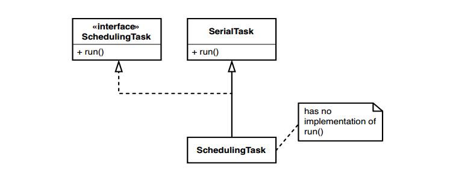
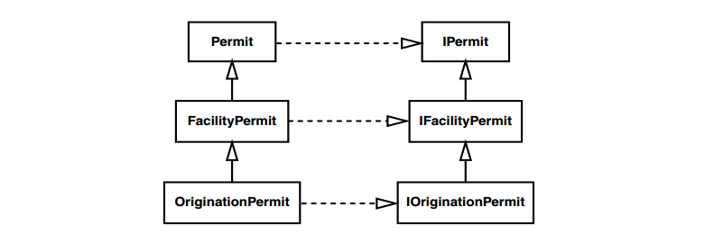

# Chương 9, Tôi không thể đưa lớp này vào kiểm thử khai thác

Đây là trường hợp khó. Nếu việc khởi tạo một lớp trong kiểm thử khai thác luôn dễ dàng, thì cuốn sách này sẽ ngắn hơn rất nhiều. Thật không may, nó thường khó thực hiện.

Dưới đây là bốn vấn đề phổ biến nhất mà chúng ta thường gặp phải:

1. Các đối tượng/tham số trong lớp không thể tạo ra một cách dễ dàng.

2. Không dễ dàng xây dựng kiểm thử khai thác với lớp đó bên trong.

3. Hàm khởi tạo chúng ta cần sử dụng có tác dụng phụ xấu.

4. Công việc quan trọng xảy ra trong hàm khởi tạo và chúng ta cần cảm nhận được điều đó.

Trong chương này, chúng ta sẽ đi qua một loạt các ví dụ làm nổi bật những vấn đề này bằng các ngôn ngữ khác nhau. Có nhiều hơn một cách để giải quyết từng vấn đề này. Tuy nhiên, đọc qua các ví dụ này là một cách tuyệt vời để làm quen với kho kỹ thuật phá vỡ sự phụ thuộc và học cách đánh đổi chúng cũng như áp dụng chúng trong các tình huống cụ thể.

## Trường hợp tham số khó chịu

Khi tôi cần thực hiện thay đổi trong một hệ thống kế thừa, tôi thường bắt đầu với tinh thần lạc quan phấn chấn. Tôi không biết tại sao lại như vậy. Tôi cố gắng trở thành một người thực tế nhất có thể, nhưng sự lạc quan luôn ở đó. "Này," tôi nói với chính mình (hoặc một đối tác), "điều này nghe có vẻ dễ dàng. Chúng ta chỉ cần làm _Floogle flumoux_ một chút là xong." Tất cả nghe có vẻ dễ dàng qua lời nói cho đến khi gặp lớp _Floogle_ (bất kể đó là gì) và xem xét nó một chút. "Được rồi, vậy là chúng ta cần thêm một phương thức ở đây và thay đổi các phương thức khác, và tất nhiên chúng ta sẽ cần đưa nó vào một kiểm thử khai thác." Lúc này, tôi bắt đầu nghi ngờ một chút. "Trời, có vẻ như hàm khởi tạo đơn giản nhất trong lớp này chấp nhận ba tham số. Nhưng," tôi về một số lượng lớn lạc qu chỉan, "có lẽ sẽ không quá khó để code

xây dựng"

Hãy cùng xem một ví dụ và xem liệu sự lạc quan của tôi sẽ phù hợp hay chỉ là một cơ chế phòng thủ.

Trong code của hệ thống thanh toán, chúng ta có một lớp Java chưa được kiểm thử tên là `CreditValidator`.

```java
public class CreditValidator
{
	public CreditValidator(RGHConnection connection, CreditMaster master, String validatorID) {
		...
	}
	Certificate validateCustomer(Customer customer)
				throws InvalidCredit {
		...
	}
	...
}
```

Một trong rất nhiều trách nhiệm của lớp này là cho chúng ta biết khách hàng có tín dụng hợp lệ hay không. Nếu có, chúng ta sẽ nhận lại một chứng chỉ cho biết họ có bao nhiêu tín dụng. Nếu không, sẽ trả về một ngoại lệ.

Nhiệm vụ của chúng ta, nếu lựa chọn chấp nhận nó, là thêm một phương thức mới vào lớp này. Phương thức này sẽ được đặt tên là `getValidationPercent` và nhiệm vụ của nó là cho chúng ta biết tỷ lệ phần trăm các lệnh gọi `validateCustomer` thành công mà chúng ta đã thực hiện trong suốt vòng đời của `validator`.

Chúng ta sẽ bắt đầu như thế nào?

Khi chúng ta cần tạo một đối tượng trong kiểm thửu khai thác, cách tiếp cận tốt nhất thường là cố gắng thực hiện nó. Chúng ta có thể thực hiện nhiều phân tích để tìm ra lý do tại sao nó dễ hoặc không dễ hoặc khó, nhưng thật dễ dàng để tạo một lớp kiểm thử JUnit, nhập code này vào và biên dịch:

```java
public void testCreate() {
	CreditValidator validator = new CreditValidator();
}
```

> Cách tốt nhất để xem liệu bạn có gặp khó khăn khi khởi tạo một lớp trong kiểm thử khai thác hay không là thử. Viết một trường hợp kiểm thử và cố gắng tạo một đối tượng trong đó. Trình biên dịch sẽ cho bạn biết bạn cần gì để nó thực sự hoạt động.

Kiểm thử này là một kiểm thử xây dựng. Các kiểm thử xây dựng trông hơi kỳ lạ. Khi tôi viết nó, tôi thường không đưa ra lời khẳng định nào trong đó. Tôi chỉ cố gắng tạo đối tượng. Sau đó, khi cuối cùng tôi có thể xây dựng một đối tượng trong kiểm thử khai thác, tôi thường loại bỏ nó hoặc đổi tên để có thể sử dụng kiểm thử thứ gì đó quan trọng hơn.

Quay lại ví dụ trên:

Chúng ta chưa thêm bất kỳ đối số nào vào hàm khởi tạo, vì vậy trình biên dịch sẽ phàn nàn. Nó cho chúng ta biết rằng không có hàm khởi tạo mặc định nào cho `CreditValidator`. Tìm kiếm trong code, chúng ta phát hiện ra rằng cần `RGHConnection`, `CreditMaster` và `password`. Mỗi lớp này chỉ có một hàm khởi tạo. Nó trông giống như thế này:

```java
public class RGHConnection
{
	public RGHConnection(int port, String Name, string passwd)
			throws IOException {
		...
	}
}
public class CreditMaster
{
	public CreditMaster(String filename, boolean isLocal) {
		...
	}
}
```

Khi một `RGHConnection` được khởi tạo, nó sẽ kết nối với máy chủ. Kết nối đó sẽ nhận tất cả các báo cáo cần thiết để xác thực tín dụng của khách hàng.

Lớp khác, `CreditMaster`, cung cấp cho chúng ta một số thông tin chính sách mà chúng ta sử dụng trong các quyết định tín dụng của mình. Khi khởi tạo, `CreditMaster` tải thông tin từ tệp và giữ thông tin đó trong bộ nhớ.

Vậy thì, có vẻ khá dễ dàng để đưa lớp này vào kiểm thử khai thác, phải không? Không nhanh thế đâu. Chúng ta có thể viết kiểm thử, nhưng liệu chúng ta có thể chung sống với nó không?

```java
public void testCreate() throws Exception {
	RGHConnection connection = new RGHConnection(DEFAULT_PORT, "admin", "rii8ii9s");
	CreditMaster master = new CreditMaster("crm2.mas", true);
	CreditValidator validator = new CreditValidator(connection, master, "a");
}
```

Hóa ra việc thiết lập `RGHConnections` tới máy chủ trong kiểm thử không phải là một ý kiến hay. Quá trình này mất nhiều thời gian và không phải lúc nào máy chủ cũng hoạt động. Mặt khác, `CreditMaster` không thực sự là một vấn đề. Khi chúng ta khởi tạo một `CreditMaster`, nó sẽ tải tệp của nó rất nhanh chóng. Ngoài ra, tệp ở chế độ chỉ đọc, vì vậy chúng ta không phải lo lắng về việc các kiểm thử sẽ làm hỏng tệp.

Điều thực sự cản trở chúng ta tạo trình xác thực là `RGHConnection`. Đó là một _tham số khó chịu_. Nếu chúng ta có thể tạo một số loại đối tượng `RGHConnection` giả mạo và làm cho `CreditValidator` tin rằng nó đang nói chuyện với một đối tượng thực, thì chúng ta có thể tránh được tất cả các loại sự vấn đề kết nối. Hãy cùng xem các phương thức mà `RGHConnection` cung cấp (xem Hình 9.1).

Có vẻ như `RGHConnection` có một tập hợp các phương thứ xử lý cơ chế hình thành kết nối: `connect`, `disconnect` và `retry`, cũng như các phương thức dành riêng cho nghiệp vụ cụ thể hơn như `RFDIReportFor` và `ACTIOReportFor`. Khi chúng ta viết phương thức mới của mình trên `CreditValidator`, chúng ta sẽ phải gọi `RFDIReportFor` để lấy tất cả thông tin chúng ta cần. Thông thường, tất cả thông tin đó đến từ máy chủ, nhưng vì muốn tránh sử dụng kết nối thực, chúng ta sẽ phải tự tìm cách cung cấp thông tin đó.


Trong trường hợp này, cách tốt nhất để tạo một đối tượng giả mạo là sử dụng _Trích xuất giao diện (362)_ với lớp `RGHConnection`. Nếu bạn có một công cụ hỗ trợ tái cấu trúc, rất có thể nó sẽ hỗ trợ _Trích xuất giao diện_. Nếu bạn không có công cụ hỗ trợ _Trích xuất giao diện_, hãy nhớ rằng nó đủ dễ để tự thực hiện.


Hình 9.1 `RGHConnection`.

Sau khi thực hiện _Trích xuất Giao diện (362)_, chúng ta có một cấu trúc giống như trong Hình 9.2.

Chúng ta có thể bắt đầu viết các kiểm thử bằng cách tạo một lớp giả nhỏ cung cấp các báo cáo mà chúng ta cần:

```java
public class FakeConnection implements IRGHConnection
{
	public RFDIReport report;
	public void connect() {}
	public void disconnect() {}
	public RFDIReport RFDIReportFor(int id) { return report; }
	public ACTIOReport ACTIOReportFor(int customerID) { return null; }
}
```

Với lớp này, chúng ta có thể bắt đầu viết kiểm thử như sau:

```java
void testNoSuccess() throws Exception {
	CreditMaster master = new CreditMaster("crm2.mas", true);
	IRGHConnection connection = new FakeConnection();
	CreditValidator validator = new CreditValidator(
	connection, master, "a");
	connection.report = new RFDIReport(...);
	Certificate result = validator.validateCustomer(new Customer(...));
	assertEquals(Certificate.VALID, result.getStatus());
}
```


Hình 9.2 `RGHConnection` sau khi trích xuất giao diện

Lớp `FakeConnection` có vẻ hơi lạ. Chúng ta có thường xuyên viết các phương thức không có gì bên trong nào hoặc chỉ trả về giá trị rỗng cho lệnh gọi không? Tệ hơn nữa, nó có một biến công khai mà bất kỳ ai cũng có thể đặt giá trị vào bất cứ khi nào họ muốn. Có vẻ như lớp này vi phạm tất cả các quy tắc. Chà, không hẳn. Các quy tắc có chút khác đối với các lớp mà chúng ta sử dụng để có thể viết được kiểm thử. Code trong `FakeConnection` không dùng cho sản phẩm. Nó sẽ không bao giờ chạy trong ứng dụng đang hoạt động đầy đủ - chỉ trong kiểm thử khai thác.

Bây giờ chúng ta có thể tạo trình xác thực, chúng ta có thể viết phương thức `getValidationPercent` của mình. Đây là một kiểm thử cho nó.

```java
void testAllPassed100Percent() throws Exception {
	CreditMaster master = new CreditMaster("crm2.mas", true);
	IRGHConnection connection = new FakeConnection("admin", "rii8ii9s");
	CreditValidator validator = new CreditValidator(
	connection, master, "a");
	connection.report = new RFDIReport(...);
	Certificate result = validator.validateCustomer(new Customer(...));
	assertEquals(100.0, validator.getValidationPercent(), THRESHOLD);
}
```

> Code kiểm thử và code sản phẩm
> Code kiểm thử không nhất thiết phải tuân theo các tiêu chuẩn giống như code sản phẩm. Nói chung, tôi không ngại phá vỡ sự đóng gói bằng cách đặt các biến ở chế độ công khai nếu điều đó giúp viết kiểm thử dễ dàng hơn. Tuy nhiên, code kiểm thử phải sạch. Nó phải dễ hiểu và dễ thay đổi.
> Xem xét 2 kiểm thử `testNoSuccess` và `testAllPassed100Percent` trong ví dụ trên. Chúng có bất kỳ bị trùng lặp code không? Có. Ba dòng đầu tiên bị lặp lại. Chúng nên được trích xuất và đặt ở một nơi chung, như phương thức `setUp()` cho lớp kiểm thử này.

Kiểm thử kiểm tra phần trăm xác thực của chứng chỉ tín dụng hợp lệ mà chúng ta nhận được có xấp xỉ 100.0 hay không.

Kiểm thử hoạt động tốt, nhưng khi viết code cho `getValidationPercent`, chúng ta sẽ nhận thấy một điều thú vị. Hóa ra `getValidationPercent` hoàn toàn không sử dụng `CreditMaster`, vậy tại sao chúng ta lại phải tạo một cái và truyền nó vào `CreditValidator`? Hay là chúng ta không cần nó. Chúng ta có thể tạo `CreditValidator` như thế này trong kiểm thử của mình:

```java
CreditValidator validator = new CreditValidator(connection, null, "a");
```

Bạn còn theo kịp không?

Cách mọi người phản ứng với những dòng code như vậy thường nói lên rất nhiều điều về loại hệ thống mà họ làm việc. Nếu bạn nhìn vào nó và nói, "Ồ, tốt thôi, vậy là anh ta đang truyền một giá trị null vào hàm khởi tạo — chúng tôi vẫn thường làm điều đó trong hệ thống của mình," thì rất có thể, bạn đang làm việc với một hệ thống khá tệ hại. Bạn có thể phải kiểm tra null ở khắp mọi nơi và cần sử dụng rất nhiều lệnh điều kiện chỉ để tìm ra những gì bạn có và những gì bạn có thể làm. Mặt khác, nếu bạn nhìn vào nó và nói, "Anh chàng này bị sao vậy?! Truyền null xung quanh trong một hệ thống?
Anh ấy có biết gì không vậy?", Chà, đối với những bạn thuộc nhóm sau (ít nhất là những người vẫn đang đọc và chưa đóng sầm cuốn sách trong hiệu sách), tôi chỉ có điều này để nói: Hãy nhớ rằng, chúng ta chỉ làm điều này trong các kiểm thử. Điều tồi tệ nhất có thể xảy ra là một số code sẽ cố gắng sử dụng biến này. Trong trường hợp đó, Java sẽ trả về một ngoại lệ khi chạy. Bởi vì khai thác nắm bắt tất cả các ngoại lệ được đưa ra trong các kiểm thử, rất nhanh, chúng ta sẽ biết được liệu tham số đó có đang được sử dụng hay không.

> Truyền Null
> Khi bạn đang viết kiểm thử và một đối tượng yêu cầu một tham số khó khởi tạo, thay vì cố tạo ra tham số đó, hãy xem xét chỉ truyền vào giá trị null. Nếu tham số được sử dụng trong quá trình thực hiện kiểm thử, code sẽ đưa ra một ngoại lệ và kiểm thử khai thác sẽ bắt được ngoại lệ đó. Nếu hành vi bạn cần thực sự phải có đối tượng đó, bạn có thể xây dựng nó và truyền nó dưới dạng tham số tại thời điểm đó.
> Pass Null là một kỹ thuật rất tiện dụng trong một số ngôn ngữ. Nó hoạt động tốt trong Java, C# và trong mọi ngôn ngữ trả ra ngoại lệ khi tham chiếu null được sử dụng trong khi chạy. Tuy nhiên đó không phải là một ý tưởng hay khi làm điều này với C và C++ trừ khi bạn biết bộ thực thi sẽ phát hiện lỗi con trỏ null. Nếu không, bạn sẽ kết thúc với các kiểm thử sẽ gặp sự cố một cách bí ẩn, đó là nếu bạn may mắn. Còn nếu bạn không may mắn, các kiểm thử của bạn sẽ chỉ sai một cách thầm lặng và vô vọng. Chúng sẽ làm hỏng bộ nhớ khi chúng chạy và bạn sẽ không bao giờ biết được.

Khi tôi làm việc với Java, tôi thường bắt đầu với một kiểm thử như thế này ngay từ đầu và điền các tham số khi tôi cần.

```java
public void testCreate() {
	CreditValidator validator = new CreditValidator(null, null, "a");
}
```

Điều quan trọng cần nhớ là: Không truyền null vào code sản phẩm trừ khi bạn không có lựa chọn nào khác. Tôi biết có một số thư viện muốn bạn làm như vậy, nhưng khi bạn viết code mới, sẽ có những lựa chọn thay thế tốt hơn. Nếu bạn muốn sử dụng null trong code sản phẩm, hãy tìm những nơi bạn đang trả về null và truyền vào null, đồng thời xem xét một giao thức khác. Thay vào đó, hãy cân nhắc sử dụng _Kiểu mẫu đối tượng Null (Null Object Pattern)_.

> Kiểu mẫu đối tượng Null
> Kiểu mẫu đối tượng Null là một cách để tránh sử dụng null trong chương trình. Ví dụ: nếu chúng ta có một phương thức trả về một nhân viên với tham số đầu vào là ID nhân viên, thì chúng ta nên trả ra gì nếu không có nhân viên nào tương ứng ID đó?
>
> ```java
> for(Iterator it = idList.iterator(); it.hasNext(); ) {
> 	EmployeeID id = (EmployeeID)it.next();
> 	Employee e = finder.getEmployeeForID(id);
> 	e.pay();
> }
> ```
>
> Chúng ta có một vài sự lựa chọn. Chúng ta chỉ cần trả ra một ngoại lệ để không phải trả ra bất kỳ thứ gì sau đó, nhưng điều đó buộc nơi thực hiện lệnh gọi phải xử lý lỗi một cách rõ ràng. Chúng ta cũng có thể trả về null, nhưng sau đó nơi thực hiện lệnh gọi sẽ phải kiểm tra null một cách rõ ràng.
>
> Còn một lựa chọn thứ ba. Code phía trên có thực sự quan tâm xem liệu có nhân viên phải trả tiền không? Nó có bắt buộc phải biết không? Điều gì sẽ xảy ra nếu chúng ta có một lớp tên là `NullEmployee`? Một thực thể của `NullEmployee` không có tên và không có địa chỉ, và khi bạn yêu cầu nó trả tiền, nó sẽ không làm gì cả.
>
> Các đối tượng null có thể hữu ích trong các ngữ cảnh như thế này; chúng có thể bảo vệ nơi gọi khỏi việc kiểm tra lỗi rõ ràng. Tuy các đối tượng null hữu dụng, nhưng bạn phải thận trọng khi sử dụng chúng. Chẳng hạn, đây là một cách rất tệ để đếm số lượng nhân viên được trả lương:
>
> ```java
> int employeesPaid = 0;
> for(Iterator it = idList.iterator(); it.hasNext(); ) {
> 	EmployeeID id = (EmployeeID)it.next();
> 	Employee e = finder.getEmployeeForID(id);
> 	e.pay();
> 	mployeesPaid++; // bug!
> }
> ```
>
> Nếu có nhân viên nào được trả ta là nhân viên rỗng, số lượng sẽ sai.
>
> Các đối tượng null đặc biệt hữu ích khi khách hàng không cần quan tâm liệu một thao tác có thành công hay không. Trong nhiều trường hợp, chúng ta có thể tinh chỉnh thiết kế của mình để đạt được điều này.

_Truyền Null_ và _Trích xuất giao diện (362)_ là hai cách tiếp cận khi gặp các tham số khó chịu. Nhưng vẫn còn lựa chọn khác đôi khi được sử dụng. Nếu phần phụ thuộc có vấn đề trong một tham số không được code cứng vào hàm khởi tạo của nó, chúng ta có thể sử dụng _Lớp con và Phương thức ghi đè (Subclass and Override Method) (401)_ để loại bỏ phần phụ thuộc. Điều đó có thể xảy ra trong trường hợp này. Nếu hàm khởi tạo của `RGHConnection` sử dụng phương thức `connect` của nó để tạo kết nối, chúng ta có thể phá vỡ sự phụ về một số lượng lớn ghi đè ` chỉconnect()` trong một lớp kiểm code

thử. _Lcode con và Phương thức ghi đè (401)_ có thể là một cách rất hữu ích để phá vỡ các phụ thuộc, nhưng chúng ta phải chắc chắn rằng chúng ta không thay đổi hành vi mà chúng ta muốn kiểm thử khi sử dụng nó.

## Trường hợp của sự phụ thuộc tiềm ẩn

Có một vài lớp khá lắt léo. Khi xem xét chúng, chúng ta dễ dàng tìm được hàm khởi tạo cần sử dụng và gọi nó. Sau đó, bùm! Chúng ta va phải một chướng ngại vật. Một trong những trở ngại phổ biến nhất là _sự phụ thuộc tiềm ẩn_; hàm khởi tạo sử dụng một số tài nguyên mà chúng ta không thể truy cập dễ dàng trong kiểm thử khai thác của mình. Chúng ta sẽ gặp tình huống này trong ví dụ tiếp theo đây, một lớp C++ được thiết kế kém để quản lý danh sách gửi thư:

```cpp
class mailing_list_dispatcher
{
public:
	mailing_list_dispatcher ();
	virtual ~mailing_list_dispatcher;
	void send_message(const std::string& message);
	void add_recipient(const mail_txm_id id, const mail_address& address);
	...
private:
	mail_service *service;
	int status;
};
```

Đây là một phần của hàm khởi tạo của lớp. Nó phân bổ một đối tượng `mail_service` bằng cách sử dụng `new` trong danh sách trình khởi tạo của hàm khởi tạo. Đó là cách làm tệ, và nó còn trở nên tồi tệ hơn. Hàm khởi tạo thực hiện nhiều công việc chi tiết với `mail_service`. Nó cũng sử dụng một con số kỳ diệu, 12 - 12 nghĩa là gì?

```cpp
mailing_list_dispatcher::mailing_list_dispatcher()
: service(new mail_service), status(MAIL_OKAY)
{
	const int client_type = 12;
	service->connect();
	if (service->get_status() == MS_AVAILABLE) {
		service->register(this, client_type, MARK_MESSAGES_OFF);
		service->set_param(client_type, ML_NOBOUNCE | ML_REPEATOFF);
	}
	else
		status = MAIL_OFFLINE;
	...
}
```

Chúng ta có thể tạo một thực thể của lớp này trong một kiểm thử, nhưng có thể sẽ không mang lại nhiều lợi ích cho chúng ta. Trước hết, chúng ta phải liên kết với các thư viện mail và cấu hình hệ thống mail để xử lý các đăng ký. Và nếu chúng ta sử dụng chức năng `send_message` trong các kiểm thử của mình, chúng ta sẽ thực sự gửi mail cho mọi người. Sẽ khó kiểm thử chức năng đó theo cách tự động trừ khi chúng ta thiết lập một hộp thư đặc biệt và kết nối với hộp thư đó nhiều lần, rồi chờ thư đến. Điều đó có thể tuyệt vời với một kiểm thử hệ thống tổng thể, nhưng nếu tất cả những gì chúng ta muốn bây giờ là thêm một số chức năng đã được kiểm thử mới vào lớp, thì điều đó có thể là quá mức cần thiết. Làm thế nào chúng ta có thể tạo một đối tượng đơn giản để thêm một số chức năng mới?

Vấn đề cơ bản ở đây là sự phụ thuộc vào `mail_service` ẩn bên trong hàm khởi tạo `mailing_list_dispatcher`. Nếu có một số cách để thay thế đối tượng `mail_service` bằng một đối tượng giả khác, chúng ta có thể sử dụng đối tượng giả mạo này và nhận được một số phản hồi khi thay đổi lớp.

Một trong những kỹ thuật chúng ta có thể sử dụng là _Tham số hóa hàm khởi tạo (Parameterize Constructor) (379)_. Với kỹ thuật này, chúng ta đưa ra ngoài phụ thuộc có trong hàm khởi tạo bằng cách truyền nó vào hàm khởi tạo.
Đây là code của hàm khởi tạo sau khi áp dụng _Tham số hóa hàm khởi tạo_(379)

```cpp
mailing_list_dispatcher::mailing_list_dispatcher(mail_service *service) : status(MAIL_OKAY)
{
	const int client_type = 12;
	service->connect();
	if (service->get_status() == MS_AVAILABLE) {
		service->register(this, client_type, MARK_MESSAGES_OFF);
		service->set_param(client_type, ML_NOBOUNCE | ML_REPEATOFF);
	}
	else
	status = MAIL_OFFLINE;
	...
}
```

Sự khác biệt thực sự và duy nhất ở đây là đối tượng `mail_service` được tạo bên ngoài lớp và được truyền vào. Điều đó trông có vẻ là không cải tiến nhiều, nhưng nó mang lại lợi ích đáng kinh ngạc. Chúng ta có thể sử dụng _Trích xuất Giao diện (362)_ để tạo giao diện cho `mail_service`. Triển khai giao diện có thể là lớp sản phẩm thực sự gửi mail. Một lớp khác có thể là một lớp giả mạo dành cho những điều chúng ta làm với nó khi kiểm thử và cho phép chúng ta đảm bảo rằng chúng đã xảy ra.

_Tham số hóa hàm khởi tạo (379)_ là một cách rất thuận tiện để loại bỏ các phụ thuộc của hàm khởi tạo, nhưng thường xuyên bị bỏ qua. Một trong những trở ngại là có thể tất cả các lời gọi của lớp sẽ bị thay đổi để truyền tham số mới, nhưng điều đó không đúng. Chúng ta có thể xử lý nó như thế này. Trước tiên, chúng ta trích xuất phần thân của hàm khởi tạo thành một phương thức mới gọi là `initialize`. Không giống như hầu hết các phương pháp trích xuất, phương pháp này khá an toàn để thử mà không cần kiểm thử vì chúng ta có thể _Bảo toàn Chữ ký (312)_ khi thực hiện.

```cpp
void mailing_list_dispatcher::initialize(mail_service *service)
{
	status = MAIL_OKAY;
	const int client_type = 12;
	service.connect();
	if (service->get_status() == MS_AVAILABLE) {
		service->register(this, client_type, MARK_MESSAGES_OFF);
		service->set_param(client_type, ML_NOBOUNCE | ML_REPEATOFF);
	}
	else
		status = MAIL_OFFLINE;
	...
}
mailing_list_dispatcher::mailing_list_dispatcher(mail_service *service)
{
	initialize(service);
}
```

Bây giờ chúng ta có thể cung cấp một hàm khởi tạo có chữ ký ban đầu. Các kiểm thử có thể gọi hàm khởi tạo đã được tham số hóa bởi `mail_service` và các nơi gọi có thể gọi hàm này. Không cần biết rằng mọi thứ đã thay đổi.

```cpp
mailing_list_dispatcher::mailing_list_dispatcher()
{
	initialize(new mail_service);
}
```

Việc tái cấu trúc này thậm chí còn dễ dàng hơn trong các ngôn ngữ như C# và Java vì chúng ta có thể gọi các hàm khởi tạo từ các hàm khởi tạo khác trong các ngôn ngữ này.

Chẳng hạn, nếu chúng ta đang làm điều gì đó tương tự trong C#, kết quả sẽ như sau:

```cpp
public class MailingListDispatcher
{
	public MailingListDispatcher(): this(new MailService()) {}
	public MailingListDispatcher(MailService service) {
		...
	}
}
```

Các phụ thuộc ẩn trong hàm khởi tạo có thể được giải quyết bằng nhiều kỹ thuật. Thường thì chúng ta có thể sử dụng _Extract and Override Getter (352)_, _Extract and Override Factory Method (350)_, và _Supersede Instance Variable (404)_, nhưng tôi thích sử dụng _Parameterize Constructor (379)_ thường xuyên nhất có thể. Khi một đối tượng được tạo trong một hàm khởi tạo và bản thân nó không có bất kỳ phụ thuộc cấu trúc nào, _Tham số hóa hàm khởi tạo_ là một kỹ thuật rất dễ áp dụng.

## Trường hợp khối khởi tạo

_Tham số hóa hàm khởi tạo (379)_ là một trong những kỹ thuật đơn giản nhất chúng ta có thể sử dụng để phá vỡ các phụ thuộc ẩn trong hàm khởi tạo và đó là kỹ thuật mà tôi thường nghĩ đến đầu tiên. Thật không may, nó không phải lúc nào cũng là sự lựa chọn tốt nhất. Nếu một hàm khởi tạo xây dựng một số lượng lớn các đối tượng bên trong hoặc truy cập một số lượng lớn các đối tượng toàn cục, chúng ta có thể đối mặt với một danh sách tham số rất lớn. Trong những tình huống tồi tệ hơn, hàm khởi tạo sẽ tạo một vài đối tượng rồi sử dụng chúng để tạo các đối tượng khác, như ví dụ sau:

```cpp
class WatercolorPane
{
public:
	WatercolorPane(Form *border, WashBrush *brush, Pattern *backdrop)
	{
		...
		anteriorPanel = new Panel(border);
		anteriorPanel->setBorderColor(brush->getForeColor());
		backgroundPanel = new Panel(border, backdrop);

		cursor = new FocusWidget(brush, backgroundPanel);
		...
	}
	...
}
```

Nếu muốn phán đoán thông qua biến `cursor`, chúng ta sẽ gặp rắc rối. Đối tượng `cursor` được nhúng trong một khối khởi tạo đối tượng. Chúng ta có thể cố gắng chuyển tất cả code sử dụng để tạo `cursor` ra bên ngoài. Sau đó, nơi thực hiện lệnh gọi có thể tạo `cursor` và chuyển nó thành tham số. Nhưng điều đó không an toàn lắm nếu chúng ta không có các kiểm thử tại chỗ và có thể trở thành gánh nặng lớn đối với nơi gọi lớp này.

Nếu có một công cụ tái cấu trúc giúp trích xuất các phương thức một cách an toàn, thì chúng ta có thể sử dụng _Trích xuất và Ghi đè Phương thức (350)_ với code trong hàm khởi tạo, nhưng điều đó không hoạt động ở tất cả các ngôn ngữ. Trong Java và C#, chúng ta có thể làm được, nhưng C++ không cho phép gọi các hàm ảo trong các hàm khởi tạo để giải quyết các hàm ảo được định nghĩa trong các lớp dẫn xuất. Và nói chung, đó không phải là một ý kiến hay. Các hàm trong lớp dẫn xuất thường giả định rằng chúng có thể sử dụng các biến từ lớp cơ sở của chúng. Cho đến khi hàm khởi tạo của lớp cơ sở thực thi hoàn toàn, có khả năng một hàm bị ghi đè mà nó gọi có thể truy cập vào biến chưa được khởi tạo.

Một lựa chọn khác là _Thay thế biến thực thể (404)_. Chúng ta viết một `setter` trên lớp cho phép hoán đổi trong một thự thể khác sau khi xây dựng đối tượng.

```cpp
class WatercolorPane
{
public:
	WatercolorPane(Form *border, WashBrush *brush, Pattern *backdrop)
	{
		...
		anteriorPanel = new Panel(border);
		anteriorPanel->setBorderColor(brush->getForeColor());
		backgroundPanel = new Panel(border, backdrop);

		cursor = new FocusWidget(brush, backgroundPanel);
		...
	}

	void supersedeCursor(FocusWidget *newCursor)
	{
		delete cursor;
		cursor = newCursor;
	}
}
```

Trong C++, chúng ta phải rất cẩn thận với cách tái cấu trúc này. Khi chúng ta thay thế một đối tượng, chúng ta phải loại bỏ đối tượng cũ. Điều đó thường có nghĩa là chúng ta phải sử dụng toán tử xóa để gọi hàm hủy của nó và hủy bộ nhớ của nó. Khi làm điều vậy, chúng ta phải hiểu hàm hủy làm gì và liệu nó có phá hủy bất kỳ thứ gì được truyền cho hàm khởi tạo của đối tượng hay không. Nếu chúng ta không cẩn thận khi dọn dẹp bộ nhớ, chúng có thể đưa ra một số lỗi khó nhận biết.

Trong hầu hết các ngôn ngữ khác, _Thay thế biến thực thể (404)_ khá đơn giản. Đây là kết quả được thu được với Java. Chúng ta không phải làm bất cứ điều gì đặc biệt để loại bỏ đối tượng mà `cursor` đề cập đến; cuối cùng bộ thu gom rác sẽ loại bỏ nó. Nhưng chúng ta cần rất cẩn thận để không sử dụng phương pháp thay thế trong code sản phẩm. Nếu các đối tượng thay thế quản lý các tài nguyên khác, chúng ta có thể gây ra một số vấn đề nghiêm trọng về tài nguyên.

```java
void supersedeCursor(FocusWidget newCursor) {
	cursor = newCursor;
}
```

Bây giờ chúng ta có một phương thức thay thế, chúng ta có thể thử tạo một `FocusWidget` bên ngoài và sau đó truyền nó vào đối tượng sau khi khởi tạo. Vì cần phải điều tra nên chúng ta có thể sử dụng _Trích xuất Giao diện (Extract Interface) (362)_ hoặc _Trích xuất Triển khai (Extract Deployer) (356)) trên lớp `FocusWidget` và tạo một đối tượng giả để truyền vào. Chắc chắn sẽ dễ tạo hơn so với `FocusWidget` tạo trong hàm khởi tạo.

Tôi không thích sử dụng _Thay thế biến thực thể (404)_ trừ khi bắt buộc. Khả năng xảy ra các vấn đề về quản lý tài nguyên là quá lớn. Tuy nhiên, đôi khi tôi sử dụng nó trong C++. Thường thì tôi muốn sử dụng _Trích xuất và Ghi đè Phương thức (350)_ và không thể làm điều đó trong các hàm khởi tạo C++. Vì lý do đó, thỉnh thoảng tôi vẫn sử dụng _Thay thế biến thực thể (404)_

## Trường hợp phụ thuộc toàn cục khó chịu

Nhiều năm trong ngành công nghiệp phần mềm, rất nhiều người phàn nàn về một thực tế là trên thị trường không có nhiều thành phần hệ thống có thể tái sử dụng. Điều này đang trở nên tốt hơn theo thời gian; có rất nhiều framework mã nguồn mở và thương mại, nhưng nhìn chung, phần lớn không thực sự là thứ mà chúng ta muốn sử dụng; chúng là những thứ sử dụng code của chúng ta. Các framework thường quản lý vòng đời của một ứng dụng và chúng ta viết code để lấp vào các lỗ hổng. Chúng ta có thể thấy điều này trong tất cả các loại framework, từ ASP.NET đến Java Struts. Ngay cả các framework xUnit cũng hoạt động theo cách này. Chúng ta viết các lớp kiểm thử; xUnit gọi và hiển thị kết quả của chúng.

Các framework giải quyết nhiều vấn đề, đặc biệt là đẩy nhanh tiến độ ở giai đoạn đầu của các dự án, nhưng đây không phải là kiểu tái sử dụng mà nhiều người thực sự mong đợi từ rất sớm trong quá trình phát triển phần mềm. Tái sử dụng kiểu cũ xảy ra khi chúng ta tìm thấy một số lớp hoặc tập hợp các lớp mà chúng ta muốn sử dụng trong ứng dụng của mình và chúng ta chỉ cần thêm chúng vào một dự án và sử dụng chúng. Sẽ rất tuyệt nếu có thể làm điều này thường xuyên, nhưng thành thật mà nói, tôi nghĩ rằng chúng ta đang đùa giỡn với chính mình thậm chí nghĩ về kiểu tái sử dụng đó nếu chúng ta không thể lấy một lớp ngẫu nhiên ra khỏi một ứng dụng trung bình và biên dịch nó một cách độc lập trong một kiểm thử khai thác mà không phải làm nhiều việc khác (càu nhàu, càu nhàu).

Nhiều loại phụ thuộc khác nhau có thể gây khó khăn cho việc tạo và sử dụng các lớp trong framework kiểm thử, nhưng một trong những vấn đề khó giải quyết nhất là việc sử dụng biến toàn cục. Trong các trường hợp đơn giản, chúng ta có thể sử dụng _Tham số hóa hàm khởi tạo (379)_, _Tham số hóa Phương thức (383)_ và _Trích xuất và Ghi đè Lệnh gọi (348)_ để loại bỏ các phụ thuộc này, nhưng đôi khi các phụ thuộc toàn cục quá rộng nên việc giải quyết vấn đề sẽ trở nên dễ dàng hơn tại nguồn. Chúng ta gặp tình huống này trong ví dụ tiếp theo đây, một lớp trong ứng dụng Java ghi lại giấy phép xây dựng cho một cơ quan chính phủ. Đây là một trong những lớp chính:

```java
public class Facility
{
	private Permit basePermit;

	public Facility(int facilityCode, String owner, PermitNotice notice) throws PermitViolation {
		Permit associatedPermit = PermitRepository.getInstance().findAssociatedPermit(notice);
		if (associatedPermit.isValid() && !notice.isValid()) {
			basePermit = associatedPermit;
		}
		else if (!notice.isValid()) {
			Permit permit = new Permit(notice);
			permit.validate();
			basePermit = permit;
		}
		else
			throw new PermitViolation(permit);
		}
	...
}
```

Để tạo lớp `Facility` trong kiểm thử khai thác, chúng ta sẽ bắt đầu bằng việc tạo một đối tượng trong kiểm thử khai thác:

```java
public void testCreate() {
	PermitNotice notice = new PermitNotice(0, "a");
	Facility facility = new Facility(Facility.RESIDENCE, "b", notice);
}
```

Kiểm thử biên dịch ổn, nhưng khi bắt đầu viết thêm các kiểm thử bổ sung, chúng ta sẽ nhận thấy một vấn đề. Hàm khởi tạo sử dụng một lớp có tên `PermitRepository` và nó cần được khởi tạo với một bộ giấy phép cụ thể để thiết lập các kiểm thử đúng cách. Lén lút lén lút. Đây là tuyên bố vi phạm trong hàm khởi tạo:

```java
Permit associatedPermit = PermitRepository.getInstance().findAssociatedPermit(notice);
```

Chúng ta có thể khắc phục điều này bằng cách tham số hóa hàm khởi tạo, nhưng trong ứng dụng này, đây không phải là trường hợp cá biệt. Có 10 lớp khác có cùng một dòng code. Nó nằm trong các hàm khởi tạo, các phương thức thông thường và các phương thức tĩnh. Chúng ta có thể tưởng tượng về một số lượng lớn thời gian chỉ để giải quyết vấn đề này trong code cơ sở.

Nếu bạn đã từng biết về các design pattern, bạn sẽ nhận ra đây là một ví dụ về _Singleton (372)_. Phương thức _getInstance_ của _PermitRepository_ là một phương thức tĩnh có nhiệm vụ trả về phiên bản duy nhất của _PermitRepository_ có thể tồn tại trong ứng dụng của chúng ta. Trường chứa thực thể đó cũng là trường tĩnh và nó nằm trong lớp _PermitRepository_.

Trong Java, singleton là một trong những cơ chế thường được sử dụng để tạo các biến toàn cục. Nói chung, các biến toàn cục là một ý tưởng tồi vì một vài lý do. Một trong số đó là thiếu minh bạch. Khi chúng ta xem xét một đoạn code, thật tuyệt khi có thể biết nó có thể ảnh hưởng đến điều gì. Ví dụ, trong Java, khi chúng ta muốn hiểu đoạn code này có thể ảnh hưởng đến mọi thứ như thế nào, chúng ta chỉ cần xem xét một vài chỗ:

```java
	Account example = new Account();
	example.deposit(1);
	int balance = example.getBalance();
```

Chúng ta biết rằng một đối tượng `account` có thể ảnh hưởng đến những thứ mà chúng ta truyền vào hàm khởi tạo `Account`, nhưng chúng ta không truyền bất kỳ thứ gì vào nó. Các đối tượng `account` cũng có thể ảnh hưởng đến các đối tượng mà chúng ta truyền dưới dạng tham số cho các phương thức, nhưng trong trường hợp này, chúng ta không truyền bất kỳ thứ gì có thể thay đổi vào đó — nó chỉ là một `int`. Ở đây, chúng ta đang gán giá trị trả về của `getBalance` cho một biến và đó thực sự là giá trị duy nhất sẽ bị ảnh hưởng bởi tập hợp các câu lệnh này.

Khi chúng ta sử dụng các biến toàn cục, tình huống này bị đảo lộn. Chúng ta có thể xem xét việc sử dụng một lớp chẳng hạn như `Account` và không biết liệu nó có đang truy cập hoặc sửa đổi các biến được khai báo ở một nơi khác trong chương trình hay không. Không cần phải nói, điều này có thể khiến chương trình khó hiểu hơn.

Phần khó khăn trong một tình huống kiểm thử là chúng ta phải tìm ra biến toàn cục nào đang được sử dụng bởi một lớp và thiết lập chúng với trạng thái thích hợp cho một kiểm thử. Và chúng ta phải làm điều đó trước mỗi lần kiểm thử nếu thiết lập khác. Nó khá tẻ nhạt; Tôi đã thực hiện nó trên hàng chục hệ thống để kiểm thử chúng và không có gì thú vị hơn thế.

Quay lại ví dụ trên:

`PermitRepository` là một singleton. Do đó, nó đặc biệt khó làm giả. Toàn bộ ý tưởng của singleton là không thể tạo nhiều hơn một phiên bản của một singleton trong một ứng dụng. Điều đó có thể tốt trong code sản phẩm, nhưng khi kiểm thử, mỗi kiểm thử trong một bộ kiểm thử phải là một ứng dụng nhỏ, chúng cần phải hoàn toàn tách biệt với các kiểm thử khác. Vì vậy, để chạy code chứa các singleton trong kiểm thử khai thác, chúng ta phải nới lỏng thuộc tính singleton.

Đây là cách chúng ta thực hiện.

Bước đầu tiên là thêm một phương thức tĩnh mới vào trong lớp singleton. Phương thức này cho phép chúng ta thay thế thực thể tĩnh trong singleton. Chúng ta gọi nó là `setTestingInstance`.

```java
public class PermitRepository
	{
	private static PermitRepository instance = null;

	private PermitRepository() {}

	public static void setTestingInstance(PermitRepository newInstance)
	{
		instance = newInstance;
	}

	public static PermitRepository getInstance()
	{
		if (instance == null) {
			instance = new PermitRepository();
		}
		return instance;
	}

	public Permit findAssociatedPermit(PermitNotice notice) {
		...
	}
	...
}
```

Khi chúng ta đã có bộ thiết lập đó, chúng ta có thể tạo một phiên bản dành cho kiểm thử của `PermitRepository` và thiết lập nó. Chúng ta sẽ viết như thế này trong thiết lập kiểm thử của mình:

```java
public void setUp() {
	PermitRepository repository = new PermitRepository();
	...
	// add permits to the repository here
	...
	PermitRepository.setTestingInstance(repository);
}
```

> _Chèn gán biến tĩnh (Introduce Static Setter - 372)_ không phải là cách duy nhất để xử lý tình huống này. Dưới đây là một cách tiếp cận khác. Chúng ta có thể thêm phương thức `resetForTesting()` vào singleton như sau:
>
> ```java
> public class PermitRepository
> {
> 	...
> 	public void resetForTesting() {
>			instance = null;
> 	}
> 	...
> }
> ```
>
> Nếu gọi phương thức này trong `setUp` kiểm thử (bạn cũng nên gọi nó trong `tearDown`), chúng ta có thể tạo các singleton mới cho mọi kiểm thử. Singleton sẽ tự khởi động lại cho mọi kiểm thử. Lược đồ này hoạt động tốt khi các phương thức công khai trên singleton cho phép bạn thiết lập trạng thái của singleton theo mọi cách bạn cần trong quá trình kiểm thử. Nếu singleton không có các phương thức công khai đó hoặc sử dụng một số tài nguyên bên ngoài ảnh hưởng đến trạng thái của nó, thì _Chèn gán biến tĩnh (Introduce Static Setter - 372)_ là lựa chọn tốt hơn. Bạn có thể phân lớp đơn, ghi đè các phương thức để phá vỡ các phụ thuộc và thêm các phương thức công khai vào lớp con để thiết lập trạng thái đúng cách.

Liệu nó sẽ hoạt động chứ? Chưa đâu. Khi sử dụng _Singleton Design Pattern (372)_, người ta thường đặt hàm khởi tạo của lớp singleton ở chế độ riêng tư (private) và điều đó có lý do chính đáng. Đó là cách rõ ràng nhất để đảm bảo không có gì bên ngoài lớp có thể tạo một phiên bản khác của singleton.

Lúc này, chúng ta có một sự xung đột giữa hai mục tiêu thiết kế. Trong một hệ thống, chúng ta muốn đảm bảo rằng chỉ có một phiên bản `PermitRepository` và cũng muốn các lớp có thể thực hiện kiểm thử độc lập. Liệu chúng ta có thể có cả hai?

Hãy nhìn lại trong chút. Tại sao chúng ta chỉ muốn một thực thể của một lớp trong một hệ thống? Có rất nhiều câu trả lời, và còn tùy thuộc vào hệ thống, nhưng dưới đây là một số câu trả lời phổ biến nhất:

1. **Chúng ta đang mô hình hóa thế giới thực và ở đó chúng chỉ tồn tại duy nhất một thực thể.** Một số hệ thống kiểm soát phần cứng cũng giống như vậy. Người ta tạo một lớp cho mỗi bảng mạch mà họ cần điều khiển; họ hình dung rằng nếu chúng chỉ có một, thì phải là singleton. Điều này cũng đúng với cơ sở dữ liệu. Chỉ có một tập hợp giấy phép cho cơ quan của chúng ta, vì vậy thứ cung cấp quyền truy cập vào nó phải là một singleton.

2. **Nếu hai trong số chúng được tạo ra, chúng ta có thể gặp vấn đề nghiêm trọng.** Điều này thường xảy ra, một lần nữa, trong nghiệp vụ kiểm soát phần cứng. Hãy tưởng tượng việc vô tình tạo ra hai bộ điều khiển thanh điều khiển hạt nhân và có hai phần khác nhau của một chương trình vận hành cùng một thanh điều khiển không biết về sự tồn tại của nhau.

3. **Nếu ai đó tạo ra hai trong số chúng, sẽ tốn quá nhiều tài nguyên.** Điều này xảy ra thường xuyên. Tài nguyên có thể là những thứ vật lý như dung lượng đĩa hoặc mức tiêu thụ bộ nhớ hoặc chúng có thể là những thứ trừu tượng như số lượng giấy phép phần mềm.

Đó là những lý do chính khiến mọi người chỉ muốn có một thực thể duy nhất, nhưng không phải là lý do chính khiến mọi người sử dụng singleton. Mọi người thường tạo các singleton vì họ muốn có một biến toàn cục. Họ cảm thấy rằng sẽ rất vất vả nếu truyền biến số đó đến những nơi cần thiết.

Nếu chúng ta có một singleton vì một lý do nào khác, thì thực sự không có lý do gì để giữ các tính chất của singleton. Chúng ta có thể làm cho hàm khởi tạo ở phạm vi riêng tư (protectd), công khai (public), hoặc nằm trong phạm vi gói mà vẫn có một hệ thống tốt, có thể kiểm thử được. Trong các trường hợp khác, vẫn đáng để tìm kiếm một giải pháp thay thế khác. Chúng ta có thể sự dụng biện pháp bảo vệ khác nếu cần. Chúng ta có thể thêm kiểm tra vào hệ thống dựng, trong đó chúng ta tìm kiếm tất cả các tệp nguồn để đảm bảo rằng `setTestingInstance` không được gọi bởi code không được kiểm thử. Chúng ta có thể làm điều tương tự với kiểm thử vào thời điểm chạy. Nếu `setTestingInstance` được gọi trong thời điểm chạy, chúng ta có thể đưa ra cảnh báo hoặc tạm dừng hệ thống và chờ sự can thiệp của người vận hành. Sự thật là, không thể thực thi tính chất của singleton trong nhiều ngôn ngữ có trước OO và mọi người đã cố gắng tạo ra nhiều hệ thống an toàn. Cuối cùng, nó phụ thuộc vào thiết kế và viết code có trách nhiệm.

Nếu vi phạm thuộc tính singleton không phải là vấn đề nghiêm trọng, chúng ta có thể dựa vào quy tắc của nhóm. Chẳng hạn, mọi người trong nhóm nên hiểu rằng chúng ta có một phiên bản cơ sở dữ liệu trong ứng dụng và chúng ta không nên có phiên bản khác.

Để nới lỏng thuộc tính singleton trên `PermitRepository`, chúng ta có thể công khai hàm khởi tạo. Và cách đó sẽ hoạt động tốt miễn là các phương thức công khai trên `PermitRepository` cho phép chúng ta thực hiện mọi thứ cần thiết để thiết lập kho lưu trữ cho các kiểm thử của mình. Ví dụ: nếu `PermitRepository` có một phương thức có tên `addPermit` cho phép điền vào đó bất kỳ giấy phép nào cần cho các kiểm thử, thì có thể chỉ cần cho phép chúng ta tạo các kho lưu trữ và sử dụng chúng trong các kiểm thử của mình. Vào những thời điểm khác, chúng ta có thể không có quyền truy cập mà chúng ta cần, hoặc tệ hơn, singleton có thể đang làm những việc mà chúng ta không muốn xảy ra trong kiểm thử khai thác, chẳng hạn như giao tiếp với cơ sở dữ liệu ở chế độ ngầm. Trong những trường hợp này, chúng ta có thể _Phân lớp và Ghi đè Phương thức (401)_ và tạo các lớp dẫn xuất giúp dễ dàng kiểm thử hơn.

Đây là một ví dụ trong hệ thống giấy phép của chúng tôi. Ngoài phương thức và các biến làm cho `PermitRepository` trở thành một singleton, chúng ta có phương thức sau:

```java
{
	...
	public Permit findAssociatedPermit(PermitNotice notice) {
		// open permit database
		...
		// select using values in notice
		...
		// verify we have only one matching permit, if not report error
		...
		// return the matching permit
		...
	}
}
```

Nếu chúng ta muốn tránh giao tiếp với cơ sở dữ liệu, chúng ta có thể phân lớp `PermitRepository` như sau:

```java
public class TestingPermitRepository extends PermitRepository
{
	private Map permits = new HashMap();
	public void addAssociatedPermit(PermitNotice notice, permit) {
		permits.put(notice, permit);
	}

	public Permit findAssociatedPermit(PermitNotice notice) {
		return (Permit)permits.get(notice);
	}
}
```

Khi làm điều này, chúng ta có thể bảo toàn một phần thuộc tính của singleton. Bởi vì chúng ta đang sử dụng một lớp con của `PermitRepository`, chúng ta có thể làm cho hàm khởi tạo của `PermitRepository` được bảo vệ thay vì công khai. Điều đó sẽ ngăn việc tạo nhiều hơn một `PermitRepository`, mặc dù nó cho phép chúng ta tạo các lớp con.

```java
public class PermitRepository
{
	private static PermitRepository instance = null;

	protected PermitRepository() {}

	public static void setTestingInstance(PermitRepository newInstance)
	{
		instance = newInstance;
	}

	public static PermitRepository getInstance()
	{
		if (instance == null) {
			instance = new PermitRepository();
		}
		return instance;
	}

	public Permit findAssociatedPermit(PermitNotice notice)
	{
		...
	}
	...
}
```

Trong nhiều trường hợp, chúng ta có thể sử dụng _Subclass và Override Method (401)_ như dưới đây để tạo một singleton giả. Vào những trường hợp khác, các phần phụ thuộc quá rộng nên việc sử dụng _Trích xuất Giao diện (362)_ trên singleton sẽ dễ dàng hơn và thay đổi tất cả các tham chiếu trong ứng dụng để chúng sử dụng tên giao diện. Điều này có thể tốn nhiều công sức, nhưng chúng ta có thể _Tận dụng trình biên dịch (315)_ để thực hiện thay đổi. Đây là giao diện của lớp `PermitRepository` sau khi trích xuất:

```java
public class PermitRepository implements IPermitRepository
{
	private static IPermitRepository instance = null;

	protected PermitRepository() {}

	public static void setTestingInstance(IPermitRepository newInstance)
	{
		instance = newInstance;
	}

	public static IPermitRepository getInstance()
	{
		if (instance == null) {
			instance = new PermitRepository();
		}
		return instance;
	}

	public Permit findAssociatedPermit(PermitNotice notice)
	{
		...
	}
	...
}
```

Giao diện `IPermitRepository` sẽ giữ chữ ký cho tất cả các phương thức không tĩnh công khai trên `PermitRepository`.

```java
public interface IPermitRepository
{
	Permit findAssociatedPermit(PermitNotice notice);
	...
}
```

Nếu bạn đang sử dụng ngôn ngữ có công cụ tái cấu trúc, bạn có thể tự động trích xuất giao diện như trên. Nếu bạn đang sử dụng một ngôn ngữ không có công cụ đó, thì sẽ dễ dàng hơn nếu sử dụng _Trích xuất Trình triển khai (356)_ thay cho cách trên.

Tên của toàn bộ quá trình tái cấu trúc này là _Chèn gán biến tĩnh (372)_. Đây là một kỹ thuật mà chúng ta có thể sử dụng để viết các kiểm thử bất chấp sự phụ thuộc rất lớn của biến toàn cục. Thật không may, nó không giúp được gì nhiều để vượt qua sự phụ thuộc toàn cục. Nếu bạn chọn giải quyết vấn đề đó, bạn có thể làm như vậy bằng cách sử dụng _Tham số hóa Phương thức (383)_ và _Tham số hóa Hàm khởi tạo (379)_. Với những phương pháp tái cấu trúc đó, thay vì sử dụng một tham chiếu toàn cục, bạn sử dụng một biến tạm thời trong một phương thức hoặc một trường trong một đối tượng. Nhược điểm của _Tham số hóa Phương thức (383)_ là bạn có thể kết thúc với nhiều phương thức bổ sung khiến mọi người mất tập trung khi họ cố gắng hiểu các lớp. Nhược điểm của _Tham số hóa Hàm khởi tạo (379)_ là mỗi đối tượng hiện đang sử dụng biến toàn cục sẽ kết thúc bằng một trường bổ sung. Trường đó sẽ phải được truyền đến hàm khởi tạo của nó, vì vậy lớp tạo đối tượng cũng cần có quyền truy cập vào thực thể. Nếu có quá nhiều đối tượng cần trường bổ sung này, nó có thể ảnh hưởng đáng kể đến dung lượng bộ nhớ mà ứng dụng sử dụng, nhưng điều đó thường chỉ ra các vấn đề thiết kế khác.

Hãy xem xét trường hợp xấu nhất. Chúng tôi có một ứng dụng với hàng trăm lớp tạo ra hàng nghìn đối tượng trong thời gian chạy và mỗi đối tượng đều cần truy cập vào cơ sở dữ liệu. Thậm chí không cần nhìn vào ứng dụng, câu hỏi đầu tiên xuất hiện trong đầu tôi là, tại sao? Nếu hệ thống làm bất cứ điều gì khác ngoài truy cập cơ sở dữ liệu, nó có thể được tái cấu trúc để một số lớp làm những việc khác còn lớp khác lưu trữ và truy xuất dữ liệu. Khi chúng ta nỗ lực phối hợp để phân tách trách nhiệm trong một ứng dụng, các phụ thuộc sẽ trở nên cục bộ; chúng ta có thể không cần tham chiếu đến cơ sở dữ liệu trong mọi đối tượng. Một số đối tượng lấy dữ liệu từ cơ sở dữ liệu. Những đối tượng khác thực hiện tính toán trên dữ liệu được cung cấp thông qua các hàm khởi tạo của chúng.

Như một bài tập, hãy chọn một biến toàn cục trong một ứng dụng lớn và tìm kiếm nó. Trong hầu hết các trường hợp, các biến toàn cục có thể truy cập được trên toàn bộ hệ thống, nhưng chúng không thực sự được sử dụng trong toàn bộ hệ thống. Thực tế là phạm vi sử dụng của chúng tương đối nhỏ. Hãy tưởng tượng làm thế nào chúng ta có thể đưa nó đến các vị trí cần nó nếu nó không thể là một biến toàn cục. Chúng ta sẽ cấu trúc lại ứng dụng như thế nào? Có trách nhiệm nào mà chúng ta có thể tách ra khỏi tập hợp các lớp để giảm phạm vi toàn cầu không?

Nếu bạn tìm thấy một biến toàn cục thực sự đang được sử dụng ở mọi nơi, điều đó có nghĩa là code của bạn không có bất kỳ phân lớp nào. Hãy xem _Chương 15, Toàn bộ ứng dụng của tôi chỉ gồm các lệnh gọi API_ và _Chương 17, Ứng dụng của tôi không có cấu trúc_.

## Trường hợp gồm các phụ thuộc include khủng khiếp

C++ là ngôn ngữ OO đầu tiên tôi biết và tôi phải thừa nhận rằng tôi thấy rất tự hào về bản thân vì đã học được nhiều chi tiết và sự phức tạp của nó. Nó trở nên thống trị trong ngành bởi vì nó là một giải pháp hoàn toàn thực dụng cho nhiều vấn đề nhức nhối vào thời điểm đó. Máy quá chậm? Không vấn đề, đây là một ngôn ngữ mà mọi thứ đều có thể tùy chỉnh. Bạn có thể nhận được tất cả hiệu quả của C thô nếu bạn chỉ sử dụng các tính năng của C. Không thể yêu cầu nhóm của bạn sử dụng ngôn ngữ OO? Cũng không sao, đây là trình biên dịch C++; bạn có thể viết trong tập hợp con C của C++ và học OO khi bạn muốn.

Mặc dù C++ đã rất phổ biến được một thời gian, nhưng cuối cùng nó bị tụt lại phía sau Java và một số ngôn ngữ mới hơn về mức độ phổ biến. Có đòn bẩy trong việc duy trì khả năng tương thích ngược với C, nhưng càng có nhiều đòn bẩy hơn trong việc làm cho ngôn ngữ dễ làm việc hơn. Nhiều lần, các nhóm C++ đã học được rằng ngôn ngữ mặc định không lý tưởng để bảo trì và họ phải vượt qua chúng để giữ cho hệ thống nhanh nhẹn và dễ thay đổi.

Một phần di sản C của C++ đặc biệt có vấn đề với cách nó cho phép một phần của chương trình biết về phần khác. Trong Java và C#, nếu một lớp trong một tệp cần sử dụng một lớp trong một tệp khác, chúng tôi sử dụng lệnh import hoặc sử dụng khai báo để khiến chúng khả dụng. Trình biên dịch tìm lớp đó và kiểm tra xem nó đã được biên dịch chưa. Nếu không, nó sẽ biên dịch nó. Nếu nó đã được biên dịch, trình biên dịch sẽ đọc một đoạn thông tin ngắn từ tệp đã biên dịch, chỉ nhận đủ thông tin cần thiết để đảm bảo rằng tất cả các phương thức mà lớp ban đầu cần đều có trên lớp đó.

Trình biên dịch C++ thường không có tối ưu hóa này. Trong C++, nếu một lớp cần biết về một lớp khác, thì phần khai báo của lớp (trong một tệp khác) được đưa vào văn bản trong tệp cần sử dụng nó. Đây có thể là một quá trình khá chậm. Trình biên dịch phải phân tích lại khai báo và xây dựng khai báo bên trong mỗi khi nó thấy khai báo đó. Tồi tệ hơn, cơ chế include dễ bị lạm dụng. Một tệp có thể include một tệp include một tệp khác, v.v. Trong các dự án mà mọi người không tránh được điều này, không có gì lạ khi tìm thấy các tệp nhỏ có thể include bao gồm hàng chục nghìn dòng code. Mọi người sẽ thắc mắc tại sao quá trình dựng của ứng dụng lại mất nhiều thời gian như vậy, nhưng vì các tệp include trải rộng khắp hệ thống nên khó có thể xác định cụ thể tệp nào và hiểu được tại sao quá trình biên dịch lại mất nhiều thời gian như vậy.

Có vẻ như tôi đang thất vọng với C++, thực tế thì không. Nó là một ngôn ngữ quan trọng, và có một lượng code C++ đáng kinh ngạc ngoài kia - nhưng cần hết sức cẩn thận nếu muốn làm việc tốt với nó.

Trong code kế thừa, có thể khó khởi tạo một lớp C++ trong kiểm thử khai thác. Một trong những vấn đề trực tiếp nhất mà chúng ta gặp phải là sự phụ thuộc vào header. Chúng ta cần những tệp header nào để tự tạo một lớp trong kiểm thử khai thác?

Đây là phần khai báo của một lớp C++ khổng lồ có tên `Scheduler`. Nó có hơn 200 phương thức, nhưng tôi chỉ trình bày khoảng 5 trong số chúng trong phần khai báo. Ngoài việc là một lớp lớn, nó còn phụ thuộc rất chặt chẽ và phức tạp vào nhiều lớp khác. Làm cách nào chúng ta có thể tạo ra `Scheduler` trong kiểm thử?

```cpp
#ifndef SCHEDULER_H
#define SCHEDULER_H

#include "Meeting.h"
#include "MailDaemon.h"
...
#include "SchedulerDisplay.h"
#include "DayTime.h"

class Scheduler
{
public:
		Scheduler(const string& owner);
		~Scheduler();

	void addEvent(Event *event);
	bool hasEvents(Date date);
	bool performConsistencyCheck(string& message);
	...
};
#endif
```

Ngoài ra, lớp `Scheduler` còn sử dụng `Meetings`, `MailDaemon`, `Events`, `SchedulerDisplays` và `Dates`. Nếu muốn tạo kiểm thử cho `Schedulers`, điều dễ dàng nhất mà có thể làm là cố gắng tạo kiểm thử cùng thư mục với một tệp khác có tên là `SchedulerTests`. Tại sao chúng ta muốn các kiểm thử ở trong cùng một thư mục? Với sự hiện diện của bộ tiền xử lý, nó thường dễ dàng hơn. Nếu dự án không sử dụng các đường dẫn để include các tệp theo những cách nhất quán, chúng ta có thể có rất nhiều việc phải làm nếu cố gắng tạo các kiểm thử trong các thư mục khác.

```cpp
#include "TestHarness.h"
#include "Scheduler.h"
TEST(create,Scheduler)
{
	Scheduler scheduler("fred");
}
```

Nếu chúng ta tạo một tệp và chỉ nhập khai báo đối tượng vào kiểm thử, chúng ta sẽ gặp vấn đề với include. Để biên dịch `Scheduler`, chúng ta phải đảm bảo rằng trình biên dịch và trình liên kết biết về tất cả những thứ `Scheduler` cần và tất cả những thứ mà những thứ đó cần, v.v. May mắn thay, hệ thống dựng cung cấp cho chúng ta một số lượng lớn thông báo lỗi và cho chúng ta biết chi tiết về những điều này.

Trong các trường hợp đơn giản, tệp `Scheduler.h` include mọi thứ chúng ta cần để có thể tạo `Scheduler`, nhưng trong một số trường hợp, tệp header không include mọi thứ. Chúng ta phải cung cấp một số include bổ sung để tạo và sử dụng một số đối tượng.

Chúng ta có thể chỉ cần sao chép tất cả các lệnh `#include` từ tệp nguồn của lớp `Scheduler`, nhưng thực tế là chúng ta có thể không cần tất cả chúng. Cách tốt nhất để thực hiện là thêm từng cái một và quyết định xem chúng ta có thực sự cần những phụ thuộc cụ thể đó hay không.

Trong trường hợp lý tưởng, cách dễ nhất là include tất cả các tệp mà chúng ta cần cho đến khi không còn bất kỳ lỗi dựng nào nữa, nhưng điều đó có thể khiến chúng ta rơi vào tình trạng lộn xộn. Nếu có một hàng dài các phụ thuộc chuyển tiếp, cuối cùng chúng ta có thể include nhiều hơn những gì chúng ta thực sự cần. Ngay cả khi các phụ thuộc không quá dài, cuối cùng chúng ta vẫn có thể phụ thuộc vào những thứ rất khó xử lý trong kiểm thử khai . Trong ví dụ này, lớp `SchedulerDisplay` là một trong những phụ thuộc đó. Tôi không hiển thị nó ở đây, nhưng nó thực sự được truy cập trong hàm khởi tạo của `Scheduler`. Chúng ta có thể thoát khỏi sự phụ thuộc như sau:

```cpp
#include "TestHarness.h"
#include "Scheduler.h"

void SchedulerDisplay::displayEntry(const string& entyDescription)
{

}
TEST(create,Scheduler)
{
	Scheduler scheduler("fred");
}
```

Ở đây chúng ta đã giới thiệu một định nghĩa thay thế cho `SchedulerDisplay::displayEntry`. Không may là khi làm điều này, chúng ta cần phải có một bản dựng riêng cho các trường hợp kiểm thử trong tệp này. Chúng ta chỉ có thể có một định nghĩa cho mỗi phương thức trong `SchedulerDisplay` trong một chương trình, vì vậy chúng ta cần có một chương trình riêng cho các kiểm thử `scheduler`.

May mắn thay, chúng ta có thể tái sử dụng một số đồ giả mà chúng ta tạo ra theo cách này. Thay vì đặt các định nghĩa của các lớp như `SchedulerDisplay` nội tuyến trong tệp kiểm thử, chúng ta có thể đặt chúng trong một tệp include riêng biệt có thể được sử dụng trên một tập hợp các tệp kiểm thử:

```cpp
#include "TestHarness.h"
#include "Scheduler.h"
#include “Fakes.h“

TEST(create,Scheduler)
{
	Scheduler scheduler("fred");
}
```

Sau khi làm điều này vài lần, việc có được một lớp C++ có thể khởi tạo trong kiểm thử khai thác là khá dễ dàng và tự động. Có một vài nhược điểm rất nghiêm trọng. Chúng ta phải tạo ra chương trình riêng biệt và thực sự không phá vỡ các phụ thuộc ở cấp độ ngôn ngữ, vì vậy chúng ta không làm cho code sạch hơn khi phá vỡ các phụ thuộc. Tồi tệ hơn, những định nghĩa trùng lặp mà chúng tôi đặt trong tệp kiểm thử (trong ví dụ này là `SchedulerDisplay::displayEntry`) phải được duy trì miễn là chúng ta giữ nguyên bộ kiểm thử này.

Tôi dành kỹ thuật này cho các trường hợp mà tôi có một lớp rất lớn với các vấn đề phụ thuộc rất nghiêm trọng. Nó không phải là một kỹ thuật để sử dụng thường xuyên hoặc nhẹ nhàng. Nếu lớp đó sẽ được chia thành một số lượng lớn các lớp nhỏ hơn theo thời gian, thì việc tạo một chương trình kiểm thử riêng cho một lớp có thể hữu ích. Nó có thể hoạt động như một điểm kiểm thử cho rất nhiều quá trình tái cấu trúc. Theo thời gian, chương trình kiểm thử riêng biệt này có thể biến mất khi bạn trích xuất nhiều lớp hơn và đưa chúng vào kiểm thử.

## Trường hợp tham số củ hành (nhiều lớp)

Tôi thích các hàm khởi tạo đơn giản. Tôi thực sự thích. Thật tuyệt khi quyết định tạo một lớp, sau đó chỉ cần nhập lệnh gọi hàm khởi tạo và chúng ta đã có một đối tượng hoạt động tốt để sẵn sàng sử dụng. Nhưng trong nhiều trường hợp, việc tạo đối tượng có thể khá khó. Mọi đối tượng cần được thiết lập ở trạng thái tốt, trạng thái giúp nó sẵn sàng cho những công việc sau này. Trong nhiều trường hợp, điều đó có nghĩa là chúng ta phải cung cấp cho nó các đối tượng được thiết lập đúng cách. Các đối tượng đó có thể yêu cầu các đối tượng khác để chúng cũng có thể được thiết lập, vì vậy cuối cùng chúng ta phải tạo đối tượng để tạo đối tượng để tạo đối tượng để làm tham số cho hàm khởi tạo của lớp mà chúng ta muốn kiểm thử. Các đối tượng bên trong các đối tượng khác — giống như một củ hành lớn. Đây là một ví dụ về loại vấn đề này.

Chúng tôi có một lớp hiển thị `SchedulingTask`

```java
public class SchedulingTaskPane extends SchedulerPane
{
	public SchedulingTaskPane(SchedulingTask task) {
		...
	}
}
```

Để tạo nó, chúng ta cần truyền cho nó một `SchedulingTask`, nhưng để tạo một `SchedulingTask`, chúng ta phải sử dụng một và chỉ một hàm khởi tạo:

```java
public class SchedulingTask extends SerialTask
{
	public SchedulingTask(Scheduler scheduler, MeetingResolver resolver)
	{
		...
	}
}
```

Chắc hẳn bạn sẽ vò đầu bứt tai nếu biết rằng còn cần nhiều đối tượng hơn để tạo `Schedulers` và `MeetingResolver`. Điều duy nhất giúp chúng ta không hoàn toàn tuyệt vọng là thực tế phải có ít nhất một lớp không yêu cầu các đối tượng của lớp khác làm tham số. Nếu không thì hệ thống không thể nào biên dịch được.

Cách để xử lý tình huống này là xem xét kỹ những gì chúng ta muốn làm. Chúng ta cần viết các kiểm thử, nhưng chúng ta thực sự cần gì ở các tham số được truyền vào hàm khởi tạo? Nếu chúng ta không cần bất cứ thứ gì từ chúng trong các kiểm thử, chúng ta có thể _Truyền vào Null (111)_. Nếu chúng ta chỉ cần một số hành vi thô sơ, chúng ta có thể sử dụng _Trích xuất Giao diện (362)_ hoặc _Trích xuất Trình triển khai (356)_ trên phần phụ thuộc trực tiếp nhất và sử dụng giao diện (interface) để tạo đối tượng giả. Trong trường hợp này, phần phụ thuộc trực tiếp nhất của `SchedulingTaskPane` là `SchedulingTask`. Nếu chúng ta có thể tạo một `SchedulingTask` giả, chúng ta có thể tạo một `SchedulingTaskPane`.

Thật không may, `SchedulingTask` kế thừa từ một lớp có tên là `SerialTask` và tất cả những gì nó làm là ghi đè lên một số phương thức bảo vệ (protected). Tất cả các phương thức công khai (public) đều có trong `SerialTask`. Chúng ta sẽ chỉ sử dụng _Trích xuất Giao diện (362)_ trên `SchedulingTask` hay cả cho `SerialTask`? Trong Java, chúng ta không làm vậy. Chúng ta có thể tạo một giao diện cho `SchedulingTask` cũng bao gồm các phương thức từ `SerialTask`.

Hệ thống phân cấp kết quả sẽ giống như Hình 9.3


Hình 9.3 `SchedulingTask`

Trong trường hợp này, thật may mắn là chúng ta sử dụng Java. Với C++ thì không như vậy, chúng ta không thể xử lý trường hợp này với cách tương tự. Không có cấu trúc giao diện riêng biệt. Các giao diện thường được triển khai dưới dạng các lớp chỉ chứa các hàm ảo thuần túy. Nếu ví dụ này được chuyển sang C++, thì `SchedulingTask` sẽ trở nên trừu tượng vì nó kế thừa một hàm ảo thuần túy từ `SchedulingTask`. Để khởi tạo một `SchedulingTask`, chúng ta cần cung cấp phần thân cho `run()` trong `SchedulingTask`, phần thân này ủy quyền cho `run()` từ `SerialTask`. May mắn thay, điều đó vẫn dễ dàng để thêm vào. Nó sẽ như sau:

```cpp
class SerialTask
{
public:
	virtual void run();
	...
};

class ISchedulingTask
{
public:
	virtual void run() = 0;
	...
};

class SchedulingTask : public SerialTask, public ISchedulingTask
{
public:
	virtual void run() { SerialTask::run(); }
};
```

Trong bất kỳ ngôn ngữ nào chúng ta có thể tạo giao diện hoặc lớp hoạt động giống như giao diện, chúng ta có thể sử dụng chúng một cách có hệ thống để phá vỡ các phụ thuộc.

## Trường hợp của tham số bí danh (alias)

Thông thường khi bị cản trở bởi các tham số của hàm khởi, chúng ta có thể khắc phục bằng _Trích xuất Giao diện (362)_ hoặc _Trích xuất trình triển khai (356)_. Nhưng đôi khi những cách này không thực tế. Hãy xem xét một lớp khác trong hệ thống giấy phép xây dựng đã xét trong phần trước:

```java
public class IndustrialFacility extends Facility
{
	Permit basePermit;

	public IndustrialFacility(int facilityCode, String owner,	OriginationPermit permit) throws PermitViolation {
		Permit associatedPermit = PermitRepository.GetInstance().findAssociatedFromOrigination(permit);

		if (associatedPermit.isValid() && !permit.isValid()) {
			basePermit = associatedPermit;
		}
		else if (!permit.isValid()) {
			permit.validate();
			basePermit = permit;
		}
		else
			throw new PermitViolation(permit);
	}
	...
}
```

Chúng ta muốn khởi tạo lớp này trong kiểm thử khai thác, nhưng có một số vấn đề. Một là chúng ta lại truy cập vào một `singleton`, `PermitRepository`. Chúng ta có thể vượt qua vấn đề đó với các kỹ thuật đã đề cập trong phần trước "Trường hợp phụ thuộc toàn cục khó chịu". Nhưng trước khi giải quyết vấn đề đó, chúng ta có một vấn đề khác. Thật khó để tạo giấy phép gốc cần để truyền vào hàm khởi tạo. `OriginationPermits` có các phụ thuộc tồi tệ. Ý nghĩ ngay lập tức mà tôi có là "Ồ, mình có thể sử dụng _Trích xuất Giao diện_ với lớp `OriginationPermit` để vượt qua sự phụ thuộc này," nhưng điều đó không dễ dàng như vậy. Hình 9.4 cho thấy cấu trúc của hệ thống phân cấp `Permit`.


Hình 9.4 Phân cấp của `Permit`

Hàm khởi tạo của `IndustrialFacility` nhận `OriginationPermit` làm tham số và truyền vào `PermitRepository` để lấy được `permit` liên quan; chúng ta sử dụng một phương thức trên `PermitRepository` tiếp nhận `OriginationPermit` và trả về `Permit`. Nếu kho lưu trữ tìm thấy `permit` liên quan, nó sẽ lưu chúng vào trường `permit`. Nếu không, nó sẽ lưu `OriginationPermit` vào trường `permit`. Chúng ta có thể tạo một giao diện cho `OriginationPermit`, nhưng điều đó sẽ không giúp ích gì cả. Chúng ta sẽ phải gán một `IOriginationPermit` cho trường `Permit` và điều đó sẽ không hoạt động. Trong Java, các giao diện không thể kế thừa từ các lớp. Giải pháp rõ ràng nhất là tạo tất cả các giao diện và biến trường `Permit` thành trường `IPermit`. Hình 9.5 cho thấy điều này sẽ trông như thế nào.

Thật đáng sợ. Đó là một khối lượng công việc lố bịch và tôi đặc biệt không thích kết cục của các đoạn code. Các giao diện rất hữu dụng để phá vỡ sự phụ thuộc, nhưng khi liên hệ giữa lớp và giao diện đạt đến mức gần như một đối một, thì sẽ làm thiết kế trở nên lộn xộn. Đừng hiểu sai ý tôi: Nếu không còn lựa chọn nào khác, sẽ tốt hơn nếu tiến tới thiết kế này, nhưng nếu có những khả năng khác, chúng ta nên khám phá chúng. May mắn thay, chúng ta có.


Hình 9.5 Phân cấp của `Permit` với các lớp giao diện

_Trích xuất Giao diện (362)_ chỉ là một cách để phá vỡ sự phụ thuộc vào một tham số. Đôi khi sẽ tốt hơn nếu tự hỏi tại sao sự phụ thuộc là xấu. Đôi khi sáng tạo lại là một nỗi đau. Vào những thời điểm khác, tham số lại có tác dụng phụ xấu. Có thể nó giao tiếp với hệ thống tệp hoặc cơ sở dữ liệu. Vào những thời điểm khác nữa, có thể mất quá nhiều thời gian để code của nó chạy. Khi chúng ta sử dụng _Trích xuất Giao diện (362)_, chúng ta có thể vượt qua tất cả các vấn đề này, nhưng chúng ta thực hiện điều đó bằng cách cắt đứt kết nối với một lớp một cách thô bạo. Nếu chỉ có các phần của một lớp là vấn đề, chúng ta có thể thực hiện một cách tiếp cận khác và chỉ cắt đứt kết nối với chúng.
