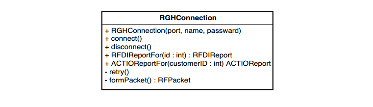
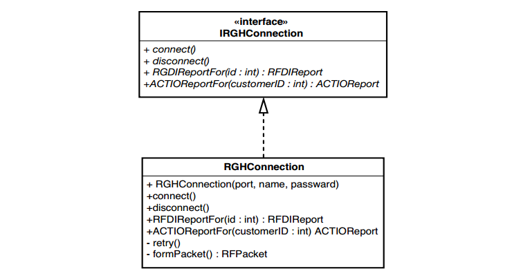

# Chương 9, Tôi không thể đưa lớp này vào kiểm thử khai thác

Đây là trường hợp khó. Nếu việc khởi tạo một lớp trong kiểm thử khai thác luôn dễ dàng, thì cuốn sách này sẽ ngắn hơn rất nhiều. Thật không may, nó thường khó thực hiện.

Dưới đây là bốn vấn đề phổ biến nhất mà chúng ta thường gặp phải:

1. Các đối tượng/tham số trong lớp không thể tạo ra một cách dễ dàng.

2. Không dễ dàng xây dựng kiểm thử khai thác với lớp đó bên trong.

3. Hàm khởi tạo chúng ta cần sử dụng có tác dụng phụ xấu.

4. Công việc quan trọng xảy ra trong hàm khởi tạo và chúng ta cần cảm nhận được điều đó.

Trong chương này, chúng ta sẽ đi qua một loạt các ví dụ làm nổi bật những vấn đề này bằng các ngôn ngữ khác nhau. Có nhiều hơn một cách để giải quyết từng vấn đề này. Tuy nhiên, đọc qua các ví dụ này là một cách tuyệt vời để làm quen với kho kỹ thuật phá vỡ sự phụ thuộc và học cách đánh đổi chúng cũng như áp dụng chúng trong các tình huống cụ thể.

## Trường hợp tham số khó chịu

Khi tôi cần thực hiện thay đổi trong một hệ thống kế thừa, tôi thường bắt đầu với tinh thần lạc quan phấn chấn. Tôi không biết tại sao lại như vậy. Tôi cố gắng trở thành một người thực tế nhất có thể, nhưng sự lạc quan luôn ở đó. "Này," tôi nói với chính mình (hoặc một đối tác), "điều này nghe có vẻ dễ dàng. Chúng ta chỉ cần làm _Floogle flumoux_ một chút là xong." Tất cả nghe có vẻ dễ dàng qua lời nói cho đến khi gặp lớp _Floogle_ (bất kể đó là gì) và xem xét nó một chút. "Được rồi, vậy là chúng ta cần thêm một phương thức ở đây và thay đổi các phương thức khác, và tất nhiên chúng ta sẽ cần đưa nó vào một kiểm thử khai thác." Lúc này, tôi bắt đầu nghi ngờ một chút. "Trời, có vẻ như hàm tạo đơn giản nhất trong lớp này chấp nhận ba tham số. Nhưng," tôi nói một cách lạc quan, "có lẽ sẽ không quá khó để xây dựng nó."

Hãy cùng xem một ví dụ và xem liệu sự lạc quan của tôi sẽ phù hợp hay chỉ là một cơ chế phòng thủ.

Trong code của hệ thống thanh toán, chúng ta có một lớp Java chưa được kiểm thử tên là `CreditValidator`.

```java
public class CreditValidator
{
	public CreditValidator(RGHConnection connection, CreditMaster master, String validatorID) {
		...
	}
	Certificate validateCustomer(Customer customer)
				throws InvalidCredit {
		...
	}
	...
}
```

Một trong rất nhiều trách nhiệm của lớp này là cho chúng ta biết khách hàng có tín dụng hợp lệ hay không. Nếu có, chúng ta sẽ nhận lại một chứng chỉ cho biết họ có bao nhiêu tín dụng. Nếu không, sẽ trả về một ngoại lệ.

Nhiệm vụ của chúng ta, nếu lựa chọn chấp nhận nó, là thêm một phương thức mới vào lớp này. Phương thức này sẽ được đặt tên là `getValidationPercent` và nhiệm vụ của nó là cho chúng ta biết tỷ lệ phần trăm các lệnh gọi `validateCustomer` thành công mà chúng ta đã thực hiện trong suốt vòng đời của `validator`.

Chúng ta sẽ bắt đầu như thế nào?

Khi chúng ta cần tạo một đối tượng trong kiểm thửu khai thác, cách tiếp cận tốt nhất thường là cố gắng thực hiện nó. Chúng ta có thể thực hiện nhiều phân tích để tìm ra lý do tại sao nó dễ hoặc không dễ hoặc khó, nhưng thật dễ dàng để tạo một lớp kiểm thử JUnit, nhập code này vào và biên dịch:

```java
public void testCreate() {
	CreditValidator validator = new CreditValidator();
}
```

> Cách tốt nhất để xem liệu bạn có gặp khó khăn khi khởi tạo một lớp trong kiểm thử khai thác hay không là thử. Viết một trường hợp kiểm thử và cố gắng tạo một đối tượng trong đó. Trình biên dịch sẽ cho bạn biết bạn cần gì để nó thực sự hoạt động.

Kiểm thử này là một kiểm thử xây dựng. Các kiểm thử xây dựng trông hơi kỳ lạ. Khi tôi viết nó, tôi thường không đưa ra lời khẳng định nào trong đó. Tôi chỉ cố gắng tạo đối tượng. Sau đó, khi cuối cùng tôi có thể xây dựng một đối tượng trong kiểm thử khai thác, tôi thường loại bỏ nó hoặc đổi tên để có thể sử dụng kiểm thử thứ gì đó quan trọng hơn.

Quay lại ví dụ trên:

Chúng ta chưa thêm bất kỳ đối số nào vào hàm khởi tạo, vì vậy trình biên dịch sẽ phàn nàn. Nó cho chúng ta biết rằng không có hàm khởi tạo mặc định nào cho `CreditValidator`. Tìm kiếm trong code, chúng ta phát hiện ra rằng cần `RGHConnection`, `CreditMaster` và `password`. Mỗi lớp này chỉ có một hàm khởi tạo. Nó trông giống như thế này:

```java
public class RGHConnection
{
	public RGHConnection(int port, String Name, string passwd)
			throws IOException {
		...
	}
}
public class CreditMaster
{
	public CreditMaster(String filename, boolean isLocal) {
		...
	}
}
```

Khi một `RGHConnection` được khởi tạo, nó sẽ kết nối với máy chủ. Kết nối đó sẽ nhận tất cả các báo cáo cần thiết để xác thực tín dụng của khách hàng.

Lớp khác, `CreditMaster`, cung cấp cho chúng ta một số thông tin chính sách mà chúng ta sử dụng trong các quyết định tín dụng của mình. Khi khởi tạo, `CreditMaster` tải thông tin từ tệp và giữ thông tin đó trong bộ nhớ.

Vậy thì, có vẻ khá dễ dàng để đưa lớp này vào kiểm thử khai thác, phải không? Không nhanh thế đâu. Chúng ta có thể viết kiểm thử, nhưng liệu chúng ta có thể chung sống với nó không?

```java
public void testCreate() throws Exception {
	RGHConnection connection = new RGHConnection(DEFAULT_PORT, "admin", "rii8ii9s");
	CreditMaster master = new CreditMaster("crm2.mas", true);
	CreditValidator validator = new CreditValidator(connection, master, "a");
}
```

Hóa ra việc thiết lập `RGHConnections` tới máy chủ trong kiểm thử không phải là một ý kiến hay. Quá trình này mất nhiều thời gian và không phải lúc nào máy chủ cũng hoạt động. Mặt khác, `CreditMaster` không thực sự là một vấn đề. Khi chúng ta khởi tạo một `CreditMaster`, nó sẽ tải tệp của nó rất nhanh chóng. Ngoài ra, tệp ở chế độ chỉ đọc, vì vậy chúng ta không phải lo lắng về việc các kiểm thử sẽ làm hỏng tệp.

Điều thực sự cản trở chúng ta tạo trình xác thực là `RGHConnection`. Đó là một _tham số khó chịu_. Nếu chúng ta có thể tạo một số loại đối tượng `RGHConnection` giả mạo và làm cho `CreditValidator` tin rằng nó đang nói chuyện với một đối tượng thực, thì chúng ta có thể tránh được tất cả các loại sự vấn đề kết nối. Hãy cùng xem các phương thức mà `RGHConnection` cung cấp (xem Hình 9.1).

Có vẻ như `RGHConnection` có một tập hợp các phương thứ xử lý cơ chế hình thành kết nối: `connect`, `disconnect` và `retry`, cũng như các phương thức dành riêng cho nghiệp vụ cụ thể hơn như `RFDIReportFor` và `ACTIOReportFor`. Khi chúng ta viết phương thức mới của mình trên `CreditValidator`, chúng ta sẽ phải gọi `RFDIReportFor` để lấy tất cả thông tin chúng ta cần. Thông thường, tất cả thông tin đó đến từ máy chủ, nhưng vì muốn tránh sử dụng kết nối thực, chúng ta sẽ phải tự tìm cách cung cấp thông tin đó.


Trong trường hợp này, cách tốt nhất để tạo một đối tượng giả mạo là sử dụng _Trích xuất giao diện (362)_ với lớp `RGHConnection`. Nếu bạn có một công cụ hỗ trợ tái cấu trúc, rất có thể nó sẽ hỗ trợ _Trích xuất giao diện_. Nếu bạn không có công cụ hỗ trợ _Trích xuất giao diện_, hãy nhớ rằng nó đủ dễ để tự thực hiện.


Hình 9.1 `RGHConnection`.

Sau khi thực hiện _Trích xuất Giao diện (362)_, chúng ta có một cấu trúc giống như trong Hình 9.2.

Chúng ta có thể bắt đầu viết các kiểm thử bằng cách tạo một lớp giả nhỏ cung cấp các báo cáo mà chúng ta cần:

```java
public class FakeConnection implements IRGHConnection
{
	public RFDIReport report;
	public void connect() {}
	public void disconnect() {}
	public RFDIReport RFDIReportFor(int id) { return report; }
	public ACTIOReport ACTIOReportFor(int customerID) { return null; }
}
```

Với lớp này, chúng ta có thể bắt đầu viết kiểm thử như sau:

```java
void testNoSuccess() throws Exception {
	CreditMaster master = new CreditMaster("crm2.mas", true);
	IRGHConnection connection = new FakeConnection();
	CreditValidator validator = new CreditValidator(
	connection, master, "a");
	connection.report = new RFDIReport(...);
	Certificate result = validator.validateCustomer(new Customer(...));
	assertEquals(Certificate.VALID, result.getStatus());
}
```


Hình 9.2 `RGHConnection` sau khi trích xuất giao diện

Lớp `FakeConnection` có vẻ hơi lạ. Chúng ta có thường xuyên viết các phương thức không có gì bên trong nào hoặc chỉ trả về giá trị rỗng cho lệnh gọi không? Tệ hơn nữa, nó có một biến công khai mà bất kỳ ai cũng có thể đặt giá trị vào bất cứ khi nào họ muốn. Có vẻ như lớp này vi phạm tất cả các quy tắc. Chà, không hẳn. Các quy tắc có chút khác đối với các lớp mà chúng ta sử dụng để có thể viết được kiểm thử. Code trong `FakeConnection` không dùng cho sản phẩm. Nó sẽ không bao giờ chạy trong ứng dụng đang hoạt động đầy đủ - chỉ trong kiểm thử khai thác.

Bây giờ chúng ta có thể tạo trình xác thực, chúng ta có thể viết phương thức `getValidationPercent` của mình. Đây là một kiểm thử cho nó.

```java
void testAllPassed100Percent() throws Exception {
	CreditMaster master = new CreditMaster("crm2.mas", true);
	IRGHConnection connection = new FakeConnection("admin", "rii8ii9s");
	CreditValidator validator = new CreditValidator(
	connection, master, "a");
	connection.report = new RFDIReport(...);
	Certificate result = validator.validateCustomer(new Customer(...));
	assertEquals(100.0, validator.getValidationPercent(), THRESHOLD);
}
```

> Code kiểm thử và code sản phẩm
> Code kiểm thử không nhất thiết phải tuân theo các tiêu chuẩn giống như code sản phẩm. Nói chung, tôi không ngại phá vỡ sự đóng gói bằng cách đặt các biến ở chế độ công khai nếu điều đó giúp viết kiểm thử dễ dàng hơn. Tuy nhiên, code kiểm thử phải sạch. Nó phải dễ hiểu và dễ thay đổi.
> Xem xét 2 kiểm thử `testNoSuccess` và `testAllPassed100Percent` trong ví dụ trên. Chúng có bất kỳ bị trùng lặp code không? Có. Ba dòng đầu tiên bị lặp lại. Chúng nên được trích xuất và đặt ở một nơi chung, như phương thức `setUp()` cho lớp kiểm thử này.

Kiểm thử kiểm tra phần trăm xác thực của chứng chỉ tín dụng hợp lệ mà chúng ta nhận được có xấp xỉ 100.0 hay không.

Kiểm thử hoạt động tốt, nhưng khi viết code cho `getValidationPercent`, chúng ta sẽ nhận thấy một điều thú vị. Hóa ra `getValidationPercent` hoàn toàn không sử dụng `CreditMaster`, vậy tại sao chúng ta lại phải tạo một cái và truyền nó vào `CreditValidator`? Hay là chúng ta không cần nó. Chúng ta có thể tạo `CreditValidator` như thế này trong kiểm thử của mình:

```java
CreditValidator validator = new CreditValidator(connection, null, "a");
```

Bạn còn theo kịp không?

Cách mọi người phản ứng với những dòng code như vậy thường nói lên rất nhiều điều về loại hệ thống mà họ làm việc. Nếu bạn nhìn vào nó và nói, "Ồ, tốt thôi, vậy là anh ta đang truyền một giá trị null vào hàm khởi tạo — chúng tôi vẫn thường làm điều đó trong hệ thống của mình," thì rất có thể, bạn đang làm việc với một hệ thống khá tệ hại. Bạn có thể phải kiểm tra null ở khắp mọi nơi và cần sử dụng rất nhiều lệnh điều kiện chỉ để tìm ra những gì bạn có và những gì bạn có thể làm. Mặt khác, nếu bạn nhìn vào nó và nói, "Anh chàng này bị sao vậy?! Truyền null xung quanh trong một hệ thống?
Anh ấy có biết gì không vậy?", Chà, đối với những bạn thuộc nhóm sau (ít nhất là những người vẫn đang đọc và chưa đóng sầm cuốn sách trong hiệu sách), tôi chỉ có điều này để nói: Hãy nhớ rằng, chúng ta chỉ làm điều này trong các kiểm thử. Điều tồi tệ nhất có thể xảy ra là một số code sẽ cố gắng sử dụng biến này. Trong trường hợp đó, Java sẽ trả về một ngoại lệ khi chạy. Bởi vì khai thác nắm bắt tất cả các ngoại lệ được đưa ra trong các kiểm thử, rất nhanh, chúng ta sẽ biết được liệu tham số đó có đang được sử dụng hay không.

> Truyền Null
> Khi bạn đang viết kiểm thử và một đối tượng yêu cầu một tham số khó khởi tạo, thay vì cố tạo ra tham số đó, hãy xem xét chỉ truyền vào giá trị null. Nếu tham số được sử dụng trong quá trình thực hiện kiểm thử, code sẽ đưa ra một ngoại lệ và kiểm thử khai thác sẽ bắt được ngoại lệ đó. Nếu hành vi bạn cần thực sự phải có đối tượng đó, bạn có thể xây dựng nó và truyền nó dưới dạng tham số tại thời điểm đó.
> Pass Null là một kỹ thuật rất tiện dụng trong một số ngôn ngữ. Nó hoạt động tốt trong Java, C# và trong mọi ngôn ngữ trả ra ngoại lệ khi tham chiếu null được sử dụng trong khi chạy. Tuy nhiên đó không phải là một ý tưởng hay khi làm điều này với C và C++ trừ khi bạn biết bộ thực thi sẽ phát hiện lỗi con trỏ null. Nếu không, bạn sẽ kết thúc với các kiểm thử sẽ gặp sự cố một cách bí ẩn, đó là nếu bạn may mắn. Còn nếu bạn không may mắn, các kiểm thử của bạn sẽ chỉ sai một cách thầm lặng và vô vọng. Chúng sẽ làm hỏng bộ nhớ khi chúng chạy và bạn sẽ không bao giờ biết được.

Khi tôi làm việc với Java, tôi thường bắt đầu với một kiểm thử như thế này ngay từ đầu và điền các tham số khi tôi cần.

```java
public void testCreate() {
	CreditValidator validator = new CreditValidator(null, null, "a");
}
```

Điều quan trọng cần nhớ là: Không truyền null vào code sản phẩm trừ khi bạn không có lựa chọn nào khác. Tôi biết có một số thư viện muốn bạn làm như vậy, nhưng khi bạn viết code mới, sẽ có những lựa chọn thay thế tốt hơn. Nếu bạn muốn sử dụng null trong code sản phẩm, hãy tìm những nơi bạn đang trả về null và truyền vào null, đồng thời xem xét một giao thức khác. Thay vào đó, hãy cân nhắc sử dụng _Kiểu mẫu đối tượng Null (Null Object Pattern)_.

> Kiểu mẫu đối tượng Null
> Kiểu mẫu đối tượng Null là một cách để tránh sử dụng null trong chương trình. Ví dụ: nếu chúng ta có một phương thức trả về một nhân viên với tham số đầu vào là ID nhân viên, thì chúng ta nên trả ra gì nếu không có nhân viên nào tương ứng ID đó?
>
> ```java
> for(Iterator it = idList.iterator(); it.hasNext(); ) {
> 	EmployeeID id = (EmployeeID)it.next();
> 	Employee e = finder.getEmployeeForID(id);
> 	e.pay();
> }
> ```
>
> Chúng ta có một vài sự lựa chọn. Chúng ta chỉ cần trả ra một ngoại lệ để không phải trả ra bất kỳ thứ gì sau đó, nhưng điều đó buộc nơi thực hiện lệnh gọi phải xử lý lỗi một cách rõ ràng. Chúng ta cũng có thể trả về null, nhưng sau đó nơi thực hiện lệnh gọi sẽ phải kiểm tra null một cách rõ ràng.
>
> Còn một lựa chọn thứ ba. Code phía trên có thực sự quan tâm xem liệu có nhân viên phải trả tiền không? Nó có bắt buộc phải biết không? Điều gì sẽ xảy ra nếu chúng ta có một lớp tên là `NullEmployee`? Một thực thể của `NullEmployee` không có tên và không có địa chỉ, và khi bạn yêu cầu nó trả tiền, nó sẽ không làm gì cả.
>
> Các đối tượng null có thể hữu ích trong các ngữ cảnh như thế này; chúng có thể bảo vệ nơi gọi khỏi việc kiểm tra lỗi rõ ràng. Tuy các đối tượng null hữu dụng, nhưng bạn phải thận trọng khi sử dụng chúng. Chẳng hạn, đây là một cách rất tệ để đếm số lượng nhân viên được trả lương:
>
> ```java
> int employeesPaid = 0;
> for(Iterator it = idList.iterator(); it.hasNext(); ) {
> 	EmployeeID id = (EmployeeID)it.next();
> 	Employee e = finder.getEmployeeForID(id);
> 	e.pay();
> 	mployeesPaid++; // bug!
> }
> ```
>
> Nếu có nhân viên nào được trả ta là nhân viên rỗng, số lượng sẽ sai.
>
> Các đối tượng null đặc biệt hữu ích khi khách hàng không cần quan tâm liệu một thao tác có thành công hay không. Trong nhiều trường hợp, chúng ta có thể tinh chỉnh thiết kế của mình để đạt được điều này.

_Truyền Null_ và _Trích xuất giao diện (362)_ là hai cách tiếp cận khi gặp các tham số khó chịu. Nhưng vẫn còn lựa chọn khác đôi khi được sử dụng. Nếu phần phụ thuộc có vấn đề trong một tham số không được code cứng vào hàm khởi tạo của nó, chúng ta có thể sử dụng _Lớp con và Phương thức ghi đè (Subclass and Override Method) (401)_ để loại bỏ phần phụ thuộc. Điều đó có thể xảy ra trong trường hợp này. Nếu hàm tạo của `RGHConnection` sử dụng phương thức `connect` của nó để tạo kết nối, chúng ta có thể phá vỡ sự phụ thuộc bằng cách ghi đè `connect()` trong một lớp kiểm thử con. _Lớp con và Phương thức ghi đè (401)_ có thể là một cách rất hữu ích để phá vỡ các phụ thuộc, nhưng chúng ta phải chắc chắn rằng chúng ta không thay đổi hành vi mà chúng ta muốn kiểm thử khi sử dụng nó.

## Trường hợp của sự phụ thuộc tiềm ẩn

Có một vài lớp khá lắt léo. Khi xem xét chúng, chúng ta dễ dàng tìm được hàm khởi tạo cần sử dụng và gọi nó. Sau đó, bùm! Chúng ta va phải một chướng ngại vật. Một trong những trở ngại phổ biến nhất là _sự phụ thuộc tiềm ẩn_; hàm khởi tạo sử dụng một số tài nguyên mà chúng ta không thể truy cập dễ dàng trong kiểm thử khai thác của mình. Chúng ta sẽ gặp tình huống này trong ví dụ tiếp theo đây, một lớp C++ được thiết kế kém để quản lý danh sách gửi thư:

```cpp
class mailing_list_dispatcher
{
public:
	mailing_list_dispatcher ();
	virtual ~mailing_list_dispatcher;
	void send_message(const std::string& message);
	void add_recipient(const mail_txm_id id, const mail_address& address);
	...
private:
	mail_service *service;
	int status;
};
```

Đây là một phần của hàm khởi tạo của lớp. Nó phân bổ một đối tượng `mail_service` bằng cách sử dụng `new` trong danh sách trình khởi tạo của hàm khởi tạo. Đó là cách làm tệ, và nó còn trở nên tồi tệ hơn. Hàm khởi tạo thực hiện nhiều công việc chi tiết với `mail_service`. Nó cũng sử dụng một con số kỳ diệu, 12 - 12 nghĩa là gì?

```cpp
mailing_list_dispatcher::mailing_list_dispatcher()
: service(new mail_service), status(MAIL_OKAY)
{
	const int client_type = 12;
	service->connect();
	if (service->get_status() == MS_AVAILABLE) {
		service->register(this, client_type, MARK_MESSAGES_OFF);
		service->set_param(client_type, ML_NOBOUNCE | ML_REPEATOFF);
	}
	else
		status = MAIL_OFFLINE;
	...
}
```

Chúng ta có thể tạo một thực thể của lớp này trong một kiểm thử, nhưng có thể sẽ không mang lại nhiều lợi ích cho chúng ta. Trước hết, chúng ta phải liên kết với các thư viện mail và cấu hình hệ thống mail để xử lý các đăng ký. Và nếu chúng ta sử dụng chức năng `send_message` trong các kiểm thử của mình, chúng ta sẽ thực sự gửi mail cho mọi người. Sẽ khó kiểm thử chức năng đó theo cách tự động trừ khi chúng ta thiết lập một hộp thư đặc biệt và kết nối với hộp thư đó nhiều lần, rồi chờ thư đến. Điều đó có thể tuyệt vời với một kiểm thử hệ thống tổng thể, nhưng nếu tất cả những gì chúng ta muốn bây giờ là thêm một số chức năng đã được kiểm thử mới vào lớp, thì điều đó có thể là quá mức cần thiết. Làm thế nào chúng ta có thể tạo một đối tượng đơn giản để thêm một số chức năng mới?

Vấn đề cơ bản ở đây là sự phụ thuộc vào `mail_service` ẩn bên trong hàm khởi tạo `mailing_list_dispatcher`. Nếu có một số cách để thay thế đối tượng `mail_service` bằng một đối tượng giả khác, chúng ta có thể sử dụng đối tượng giả mạo này và nhận được một số phản hồi khi thay đổi lớp.

Một trong những kỹ thuật chúng ta có thể sử dụng là _Tham số hóa hàm khởi tạo (Parameterize Constructor) (379)_. Với kỹ thuật này, chúng ta đưa ra ngoài phụ thuộc có trong hàm khởi tạo bằng cách truyền nó vào hàm khởi tạo.
Đây là code của hàm khởi tạo sau khi áp dụng _Tham số hóa hàm khởi tạo_(379)

```cpp
mailing_list_dispatcher::mailing_list_dispatcher(mail_service *service) : status(MAIL_OKAY)
{
	const int client_type = 12;
	service->connect();
	if (service->get_status() == MS_AVAILABLE) {
		service->register(this, client_type, MARK_MESSAGES_OFF);
		service->set_param(client_type, ML_NOBOUNCE | ML_REPEATOFF);
	}
	else
	status = MAIL_OFFLINE;
	...
}
```

Sự khác biệt thực sự và duy nhất ở đây là đối tượng `mail_service` được tạo bên ngoài lớp và được truyền vào. Điều đó trông có vẻ là không cải tiến nhiều, nhưng nó mang lại lợi ích đáng kinh ngạc. Chúng ta có thể sử dụng _Trích xuất Giao diện (362)_ để tạo giao diện cho `mail_service`. Triển khai giao diện có thể là lớp sản phẩm thực sự gửi mail. Một lớp khác có thể là một lớp giả mạo dành cho những điều chúng ta làm với nó khi kiểm thử và cho phép chúng ta đảm bảo rằng chúng đã xảy ra.

_Tham số hóa hàm khởi tạo (379)_ là một cách rất thuận tiện để loại bỏ các phụ thuộc của hàm khởi tạo, nhưng thường xuyên bị bỏ qua. Một trong những trở ngại là có thể tất cả các lời gọi của lớp sẽ bị thay đổi để truyền tham số mới, nhưng điều đó không đúng. Chúng ta có thể xử lý nó như thế này. Trước tiên, chúng ta trích xuất phần thân của hàm khởi tạo thành một phương thức mới gọi là `initialize`. Không giống như hầu hết các phương pháp trích xuất, phương pháp này khá an toàn để thử mà không cần kiểm thử vì chúng ta có thể _Bảo toàn Chữ ký (312)_ khi thực hiện.

```cpp
void mailing_list_dispatcher::initialize(mail_service *service)
{
	status = MAIL_OKAY;
	const int client_type = 12;
	service.connect();
	if (service->get_status() == MS_AVAILABLE) {
		service->register(this, client_type, MARK_MESSAGES_OFF);
		service->set_param(client_type, ML_NOBOUNCE | ML_REPEATOFF);
	}
	else
		status = MAIL_OFFLINE;
	...
}
mailing_list_dispatcher::mailing_list_dispatcher(mail_service *service)
{
	initialize(service);
}
```

Bây giờ chúng ta có thể cung cấp một hàm khởi tạo có chữ ký ban đầu. Các kiểm thử có thể gọi hàm khởi tạo đã được tham số hóa bởi `mail_service` và các nơi gọi có thể gọi hàm này. Không cần biết rằng mọi thứ đã thay đổi.

```cpp
mailing_list_dispatcher::mailing_list_dispatcher()
{
	initialize(new mail_service);
}
```

Việc tái cấu trúc này thậm chí còn dễ dàng hơn trong các ngôn ngữ như C# và Java vì chúng ta có thể gọi các hàm khởi tạo từ các hàm khởi tạo khác trong các ngôn ngữ này.

Chẳng hạn, nếu chúng ta đang làm điều gì đó tương tự trong C#, kết quả sẽ như sau:

```cpp
public class MailingListDispatcher
{
	public MailingListDispatcher(): this(new MailService()) {}
	public MailingListDispatcher(MailService service) {
		...
	}
}
```

Các phụ thuộc ẩn trong hàm khởi tạo có thể được giải quyết bằng nhiều kỹ thuật. Thường thì chúng ta có thể sử dụng _Extract and Override Getter (352)_, _Extract and Override Factory Method (350)_, và _Supersede Instance Variable (404)_, nhưng tôi thích sử dụng _Parameterize Constructor (379)_ thường xuyên nhất có thể. Khi một đối tượng được tạo trong một hàm khởi tạo và bản thân nó không có bất kỳ phụ thuộc cấu trúc nào, _Tham số hóa hàm khởi tạo_ là một kỹ thuật rất dễ áp dụng.

## Trường hợp khối khởi tạo

_Tham số hóa hàm khởi tạo (379)_ là một trong những kỹ thuật đơn giản nhất chúng ta có thể sử dụng để phá vỡ các phụ thuộc ẩn trong hàm khởi tạo và đó là kỹ thuật mà tôi thường nghĩ đến đầu tiên. Thật không may, nó không phải lúc nào cũng là sự lựa chọn tốt nhất. Nếu một hàm khởi tạo xây dựng một số lượng lớn các đối tượng bên trong hoặc truy cập một số lượng lớn các đối tượng toàn cục, chúng ta có thể đối mặt với một danh sách tham số rất lớn. Trong những tình huống tồi tệ hơn, hàm khởi tạo sẽ tạo một vài đối tượng rồi sử dụng chúng để tạo các đối tượng khác, như ví dụ sau:

```cpp
class WatercolorPane
{
public:
	WatercolorPane(Form *border, WashBrush *brush, Pattern *backdrop)
	{
		...
		anteriorPanel = new Panel(border);
		anteriorPanel->setBorderColor(brush->getForeColor());
		backgroundPanel = new Panel(border, backdrop);

		cursor = new FocusWidget(brush, backgroundPanel);
		...
	}
	...
}
```

Nếu muốn phán đoán thông qua biến `cursor`, chúng ta sẽ gặp rắc rối. Đối tượng `cursor` được nhúng trong một khối khởi tạo đối tượng. Chúng ta có thể cố gắng chuyển tất cả code sử dụng để tạo `cursor` ra bên ngoài. Sau đó, nơi thực hiện lệnh gọi có thể tạo `cursor` và chuyển nó thành tham số. Nhưng điều đó không an toàn lắm nếu chúng ta không có các kiểm thử tại chỗ và có thể trở thành gánh nặng lớn đối với nơi gọi lớp này.

Nếu có một công cụ tái cấu trúc giúp trích xuất các phương thức một cách an toàn, thì chúng ta có thể sử dụng _Trích xuất và Ghi đè Phương thức (350)_ với code trong hàm khởi tạo, nhưng điều đó không hoạt động ở tất cả các ngôn ngữ. Trong Java và C#, chúng ta có thể làm được, nhưng C++ không cho phép gọi các hàm ảo trong các hàm khởi tạo để giải quyết các hàm ảo được định nghĩa trong các lớp dẫn xuất. Và nói chung, đó không phải là một ý kiến hay. Các hàm trong lớp dẫn xuất thường giả định rằng chúng có thể sử dụng các biến từ lớp cơ sở của chúng. Cho đến khi hàm khởi tạo của lớp cơ sở thực thi hoàn toàn, có khả năng một hàm bị ghi đè mà nó gọi có thể truy cập vào biến chưa được khởi tạo.

Một lựa chọn khác là _Thay thế biến thực thể (404)_. Chúng ta viết một `setter` trên lớp cho phép hoán đổi trong một thự thể khác sau khi xây dựng đối tượng.

```cpp
class WatercolorPane
{
public:
	WatercolorPane(Form *border, WashBrush *brush, Pattern *backdrop)
	{
		...
		anteriorPanel = new Panel(border);
		anteriorPanel->setBorderColor(brush->getForeColor());
		backgroundPanel = new Panel(border, backdrop);

		cursor = new FocusWidget(brush, backgroundPanel);
		...
	}

	void supersedeCursor(FocusWidget *newCursor)
	{
		delete cursor;
		cursor = newCursor;
	}
}
```

Trong C++, chúng ta phải rất cẩn thận với cách tái cấu trúc này. Khi chúng ta thay thế một đối tượng, chúng ta phải loại bỏ đối tượng cũ. Điều đó thường có nghĩa là chúng ta phải sử dụng toán tử xóa để gọi hàm hủy của nó và hủy bộ nhớ của nó. Khi làm điều vậy, chúng ta phải hiểu hàm hủy làm gì và liệu nó có phá hủy bất kỳ thứ gì được truyền cho hàm khởi tạo của đối tượng hay không. Nếu chúng ta không cẩn thận khi dọn dẹp bộ nhớ, chúng có thể đưa ra một số lỗi khó nhận biết.

Trong hầu hết các ngôn ngữ khác, _Thay thế biến thực thể (404)_ khá đơn giản. Đây là kết quả được thu được với Java. Chúng ta không phải làm bất cứ điều gì đặc biệt để loại bỏ đối tượng mà `cursor` đề cập đến; cuối cùng bộ thu gom rác sẽ loại bỏ nó. Nhưng chúng ta cần rất cẩn thận để không sử dụng phương pháp thay thế trong code sản phẩm. Nếu các đối tượng thay thế quản lý các tài nguyên khác, chúng ta có thể gây ra một số vấn đề nghiêm trọng về tài nguyên.

```java
void supersedeCursor(FocusWidget newCursor) {
	cursor = newCursor;
}
```

Bây giờ chúng ta có một phương thức thay thế, chúng ta có thể thử tạo một `FocusWidget` bên ngoài và sau đó truyền nó vào đối tượng sau khi khởi tạo. Vì cần phải điều tra nên chúng ta có thể sử dụng _Trích xuất Giao diện (Extract Interface) (362)_ hoặc _Trích xuất Triển khai (Extract Deployer) (356)) trên lớp `FocusWidget` và tạo một đối tượng giả để truyền vào. Chắc chắn sẽ dễ tạo hơn so với `FocusWidget` tạo trong hàm khởi tạo.

Tôi không thích sử dụng _Thay thế biến thực thể (404)_ trừ khi bắt buộc. Khả năng xảy ra các vấn đề về quản lý tài nguyên là quá lớn. Tuy nhiên, đôi khi tôi sử dụng nó trong C++. Thường thì tôi muốn sử dụng _Trích xuất và Ghi đè Phương thức (350)_ và không thể làm điều đó trong các hàm tạo C++. Vì lý do đó, thỉnh thoảng tôi vẫn sử dụng _Thay thế biến thực thể (404)_
